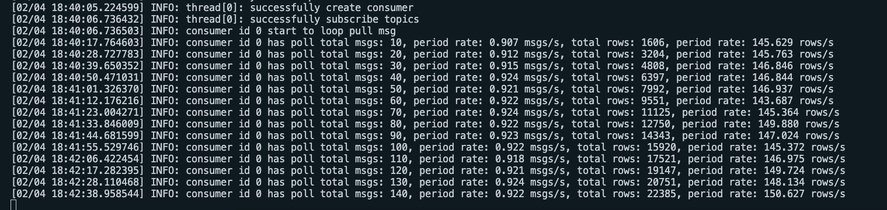
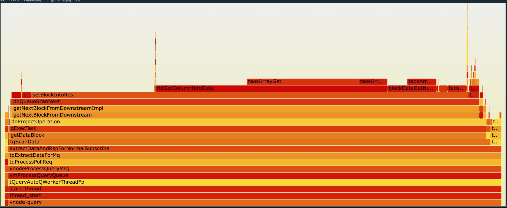
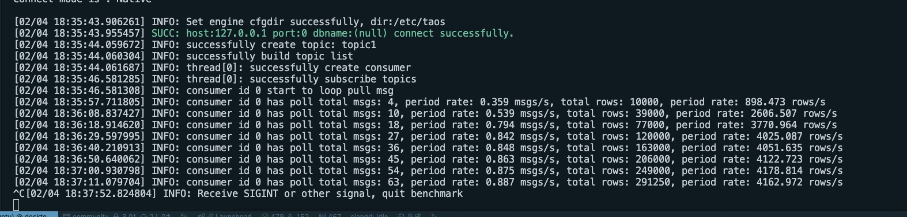
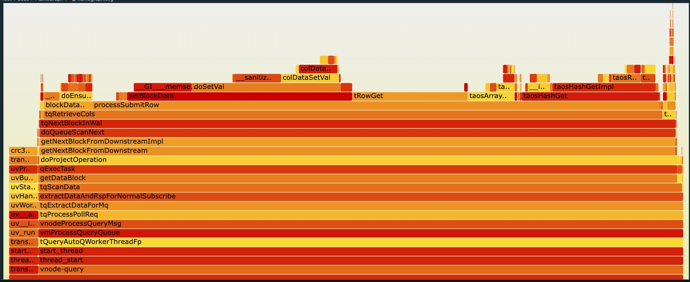

# tmq 订阅优化（效率提升 27 倍）

## 1. 问题来源

## 2. 问题复现分析

1. 通过 taosBenchmark 先创建子表，单个 vnode，30000子表，每个子表 1000 列数据，10列 tag。每个子表写入10条数据。
2. 然后启动 taosBenchmark 创建 select * from stb 的订阅，分析火焰图 和 代码逻辑。
3. 写入，订阅配置文件如下
<view type="2">

  > ⚠ 嵌入文件，需在飞书中查看 (token: EM9UbPDtCoMxo8xCL08cCJAUnYc)

</view>

<view type="2">

  > ⚠ 嵌入文件，需在飞书中查看 (token: T8ZwbZh0MocgS2xu12hci11Qndd)

</view>

## 3. 问题原因

分析火焰图和代码逻辑后，效率低下主要集中在下面几点：
1. 每个表单独 一个 block，需要频繁的分配拷贝对齐数据。特别对于交叉写入的情形，效率更低。
2. 拼装 slodId colId 逻辑复杂混乱，导致每个表的处理结果很慢。
3. 每个 block 都要 set tag，filter 等逻辑，且要把每个 block，拷贝到最终结果 block 里，影响效率。

## 4. 主要优化点

1. 因为 query 是固定的，所以结果 block 类型固定，不同的表用同一个block 即可，避频繁的创建拷贝。效率有了极大的提升。
2. 优化 colId  和 solt Id 处理逻辑，再初始化时建立好结果，解析数据时直接使用，避免复杂的处理逻辑。
3. 对最终的 block 做一次 filter。

## 5. 优化效果

对比优化前后，订阅速度由之前的 150条/s，提升到了 4000条/s，订阅效率提升了 27 倍。

## 6. 其他优化

在性能优化的过程中发现了很多其他问题，也进行了优化
1. 增加 tmq_consumer_poll 接口单次最大返回时长
   - 该时间通过 fetch.max.wait.ms 参数控制，默认为 1s，意义为如果  tmq_consumer_poll 接口调用服务端超过该时间，即使没有到需要的条数，同样返回。
   - tmq_consumer_poll 目前的处理逻辑为：
      - 超过 fetch.max.wait.ms 时间，返回
      - 超过 min.poll.rows 设置的条数，返回
      - 如果没有数据，超过 poll 接口本身设置的 timeout ，返回
      - 如果返回非 NULL，表示有数据，如果返回 NULL，可通过 taos_errstr(NULL) 接口获取，返回NULL的原因，可能是出错，也可能是真的没数据了。
2. 优化 query 类型 topic，query 里有 tag 时，获取 tag 的缓存逻辑。
   - 之前该 tag 缓存使用的是 LRU Cache，和查询共用。该 LRU cache 报过多次问题。
   - 优化后，使用该 topic 独立的只有需要的 tag 的缓存。避免出问题。
3. 优化 query 类型 topic 的 operator
   - 之前的 operator 为 StreamOperator，是订阅和流共用的 operator，混杂了旧流的大量字段和逻辑。造成逻辑晦涩难懂。
   - 优化后，新的 operator 为命名为 TmqOperator，清除掉大量的旧 stream 相关内容，新的逻辑清晰明朗，便于维护。
