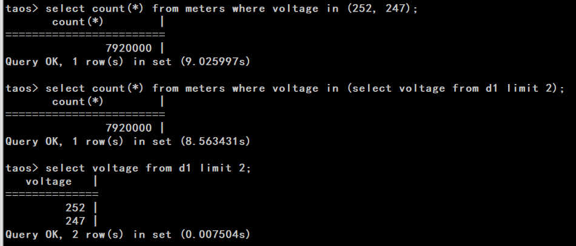

# 支持 IN + 非相关子查询 TS

## 1. 修订记录

| 编写日期 | 发布日期 | 版本 | 修订人 | 主要修改内容 |
| --- | --- | --- | --- | --- |
| 2026-01-20 | - | 0.1 | 潘魏 | 新建 |
|  |  |  |  |  |

## 2. 测试目标

本次测试的主要目标：测试 IN + 非相关子查询功能与性能

## 3. 参考文档

JIRA: 
RS：[需求说明：支持更多子查询](https://taosdata.feishu.cn/wiki/Gi6HwAWcIimFpjkpAhXcMdNYn3N)
FS：[支持 IN + 非相关子查询 FS](https://taosdata.feishu.cn/wiki/PYB6wExFiilg1Mkh4CQckdITnTe)

## 4. 测试结论

功能、性能符合预期，测试通过。

## 5. 测试环境

- OS: Linux

## 6. 功能测试

在测试用例目录test/cases/09-DataQuerying/08-SubQuery下增加下列文件进行功能测试
-rw-r--r--  1 pw pw  13018 Jan 20 13:40 test_in_subq1.py
-rw-r--r--  1 pw pw  28128 Jan 20 10:05 test_in_subq2.py
-rw-r--r--  1 pw pw  10362 Jan 19 16:45 test_in_subq3a.py
-rw-r--r--  1 pw pw  10362 Jan 19 16:45 test_in_subq3b.py
-rw-r--r--  1 pw pw  10361 Jan 19 16:45 test_in_subq3c.py
-rw-r--r--  1 pw pw  10349 Jan 19 16:45 test_in_subq3d.py
主要测试覆盖内容包括：

| 分类 | 测试场景 | 编号 | 测试用例 | 预期行为 | 测试结果 | 说明 |
| --- | --- | --- | --- | --- | --- | --- |
| 查询功能 | 查询语句 | 1 | 查询各子句与各种IN子查询的组合测试 | 语法允许部分执行成功，其他语句执行失败 | 通过 |  |
| 查询功能 | 视图语句 | 2 | 视图语句含子查询，子查询中使用视图 | 正常执行 | 通过 |  |
| 查询功能 | 嵌套查询 | 3 | 嵌套查询与IN子查询的组合测试 | 正常执行 | 通过 |  |
| 查询功能 | INSERT INTO SELECT | 4 | 测试INSERT INTO SELECT语句中含IN子查询 | 正常执行 | 通过 |  |
| 查询功能 | STMT查询 | 5 | 测试STMT查询语句中含IN子查询 | 正常执行 | 通过 |  |
| 查询功能 | 函数、表达式 | 6 | 测试函数参数、表达式中使用IN子查询 | 参数允许为IN子查询执行成功，其他报错 | 通过 |  |
| 异常功能 | 不支持的语句 | 7 | 流计算、订阅、DDL、DML语句中使用IN子查询 | 报错 | 通过 |  |
| explain功能 | 查询语句explain | 8 | Explain 各模式与查询语句的组合测试 | 正常执行 | 通过 |  |

以上所有测试在 ASAN 模式下测试通过。

## 7. 易用性测试

不涉及

## 8. 长期稳定性测试

无

## 9. 性能测试

以智能电表 meters 100000000 行数据进行对比测试，排除 SMA 影响，以下两个测试语句耗时基本相当，符合预期。
select count(*) from meters where voltage in (select voltage from d1 limit 2);
select count(*) from meters where voltage in (252, 247);

## 10. 安全性测试

无

## 11. 兼容性测试

不涉及兼容性测试。

## 12. 已知问题和限制

无
