# 数据修复功能——模拟损坏测试

以下情况进行验证

## 1. 目的

   服务能启动及功能可用优先，尽可能修复数据

## 2. 环境

服务器：单节点
数据库： taosBenchmark 生成， 两 VGROUPS, 1 副本  1000 子表 每子表 1W 数据，智能电表数据

## 3. 验证方法

1. 修复数据验证：记录原始超级表各字段的 SUM 值，修复后与其比较，完全一致为数据全部恢复成功
2. 功能验证：原无法写入或查询的功能可以正常执行

## 4. 测试内容

### 4.1 HEAD 文件

| 序号 | 破坏场景 | 步骤表现 | 修复预期 | 结果 |
| --- | --- | --- | --- | --- |
| 1 | Head 文件被删除 （清理工具误清理或误删） | 1. 删除 任一 HEAD 文件 1. 正常模式启动服务，可正常启动 1. 查询超级表，报 VNODE 错 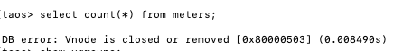 1. 修复模式启动服务，提示检测到了错误 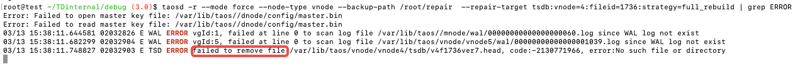 1. 查询成功，查看目录删除的HEAD 文件对应的 DATA 文件也已被清除，丢失 384 W 数据 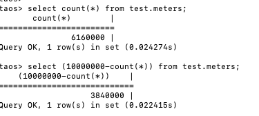 | 查询正常 部分数据丢失 | 通过 注：损坏文件全部数据丢失 |
| 2 | HEAD 文件头部破坏 | 1. 修改 HEAD 文件v4f1736ver7.head 头部有数据开始的 16 字节数据 1. 正常模式启动服务，启动成功 1. 查询超级表报错如下： 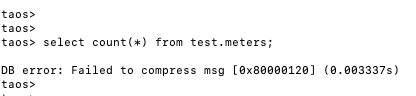 1. 修复模式启动服务，启动正常 tasd -r --mode force --node-type vnode --backup-path /root/repair --repair-target tsdb:vnode=4:fileid=1736:strategy=full_rebuild 1. 查询成功，丢失约 85W 行数据。 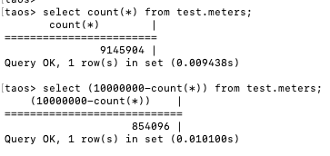 | 查询正常 部分数据丢失 | 通过 注：损坏文件25%数据丢失 |
| 3 | HEAD 文件中间丢失一段数据 | 1. 修改 HEAD 文件v4f1736ver7.head 中间任意位置 16 字节 1. 正常模式启动服务，启动成功 1. 查询超级表报错如下： 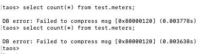 1. 修复模式启动服务，启动正常 taosd -r --mode force --node-type vnode --backup-path /root/repair --repair-target tsdb:vnode=4:fileid=1736:strategy=full_rebuild 1. 查询成功，丢失约 **85W **行数据。 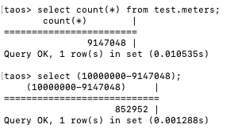 | 查询正常 部分数据丢失（85W） | 通过 注：损坏文件25%数据丢失 |
| 4 | HEAD 文件结尾破坏 （服务器突然断电易产生） | 1. 修改 HEAD 文件v4f1736ver7.head 结尾 16 字节 1. 正常模式启动服务，启动成功 1. 查询报错 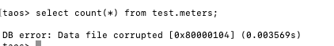 1. 修复模式启动服务，启动成功，并检测到了指定的错误文件：  1. 查询成功，丢失数据约 **384W** 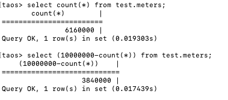 | 查询正常 部分数据丢失 | 通过 注：损坏文件全部数据丢失 |
| 5 | HEAD 文件只有前一半，后面全丢失 | 1. 删除 HEAD 文件的后一半 1. 正常模式启动服务，启动成 1. 查询报错 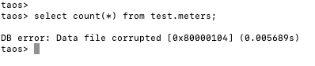 1. 修复模式启动服务，启动成功，并检测到了指定的错误文件： 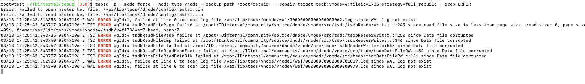 1. 查询成功，丢失数据约 **384W**  | 查询正常 部分数据丢失 | 通过 注：损坏文件全部数据丢失 |
| 6 | HEAD 文件是旧版本 验证有旧版本文件混合场景 | 1. 使用 3.3.0.0 版本生成数据规模一样的 head 文件的内容，替换当前版本的 HEAD 文件 1. 正常模式启动服务，成功 1. 查询数据库成功，查询超级表报内存耗尽错误： 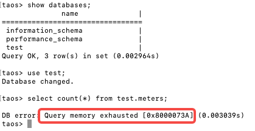 1. 修复模式启动服务，成功，有检查到报错： 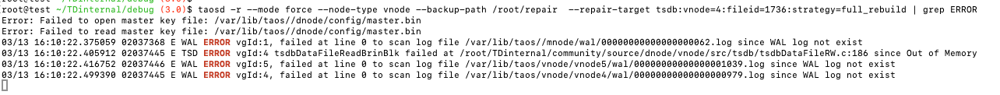 1. 查询超级表成功，不再报内存耗尽错误： 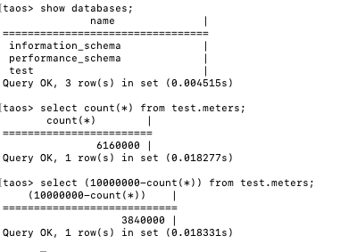 | 查询正常 部分数据丢失 | 通过 |
| 6 | HEAD 文件零字节 | 1. 删除 HEAD 文件全部内容 1. 正常模式启动服务，启动成 1. 查询报错  1. 修复模式启动服务，启动成功，并检测到了指定的错误文件：  1. 查询成功，丢失数据约 **384W** 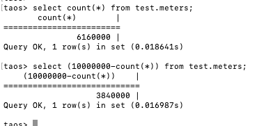 | 查询正常 部分数据丢失 | 通过 |


### 4.2 DATA 文件

| 序号 | 破坏场景 | 步骤表现 | 修复预期 | 结果 |
| --- | --- | --- | --- | --- |
| 1 | DATA 文件被删除 | 1. 删除 任一 DATA 文件 1. 正常模式启动服务，可正常启动 1. 查询超级表，报 VNODE 错 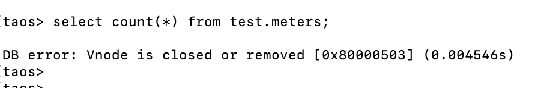 1. 修复模式启动服务，提示检测到了错误 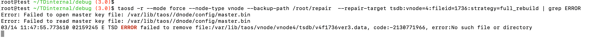 1. 查询成功，查看目录删除的HEAD 文件对应的 DATA 文件也已被清除，丢失 384 W 数据 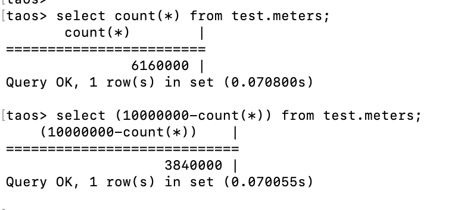 | 查询正常 部分数据丢失 | 通过 注：损坏文件全部数据丢失 |
| 2 | DATA 文件头部破坏 | 1. 修改 DATA 文件v4f1736ver7.data 头部有数据开始多处数据 1. 正常模式启动服务，启动成功 1. 查询超级表报错如下： 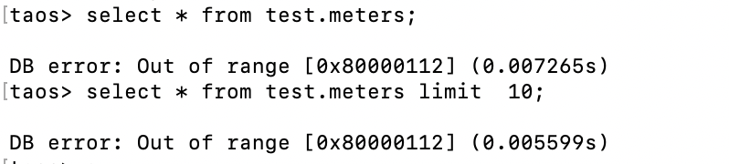 1. 修复模式启动服务，启动正常 tasd -r --mode force --node-type vnode --backup-path /root/repair --repair-target tsdb:vnode=4:fileid=1736:strategy=full_rebuild 1. 查询成功，丢失约 384W 行数据。 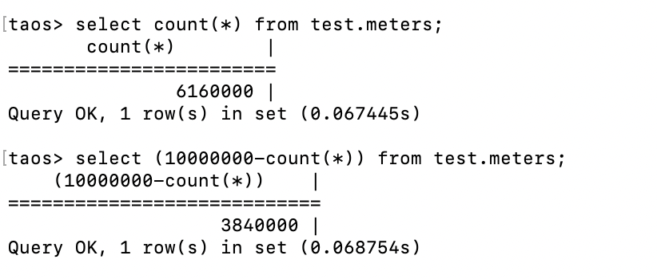 | 查询正常 部分数据丢失 | 通过 注：损坏文件数据全部丢失 |
| 3 | DATA 文件中间丢失一段数据 | 1. 修改 DATA 文件v4f1736ver3.data 中间任意位置 16 字节 1. 正常模式启动服务，启动成功 1. 查询超级表报错如下： 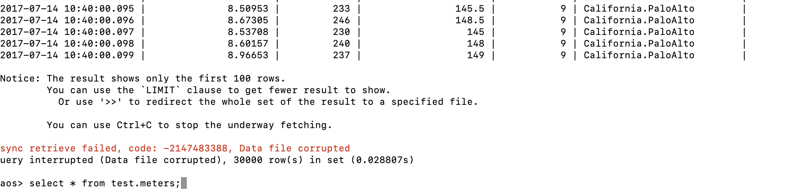 1. 修复模式启动服务，启动正常 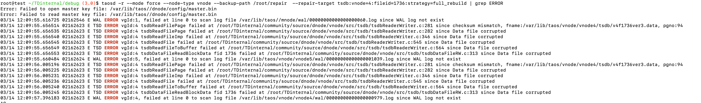 1. 查询成功，丢失约 **4096 **行数据。 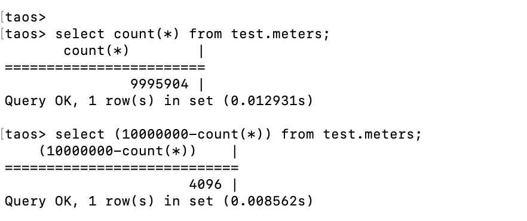 | 查询正常 部分数据丢失 | 通过 注：损坏块的 4096 行数据丢失（修复效果很好） |
| 4 | DATA 文件结尾破坏 （服务器突然断电易产生） | 1. 修改 DATA 文件v4f1736ver7.head 结尾 16 字节 1. 正常模式启动服务，启动成功 1. 查询报错 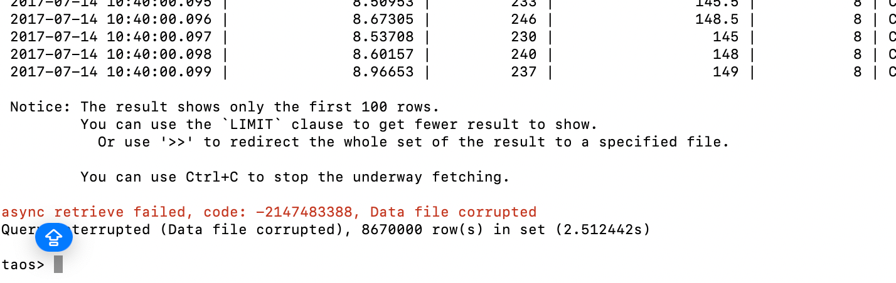 1. 修复模式启动服务，启动成功，并检测到了指定的错误文件： 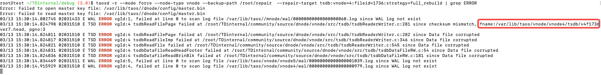 1. 查询成功，丢失数据约 **2952W** 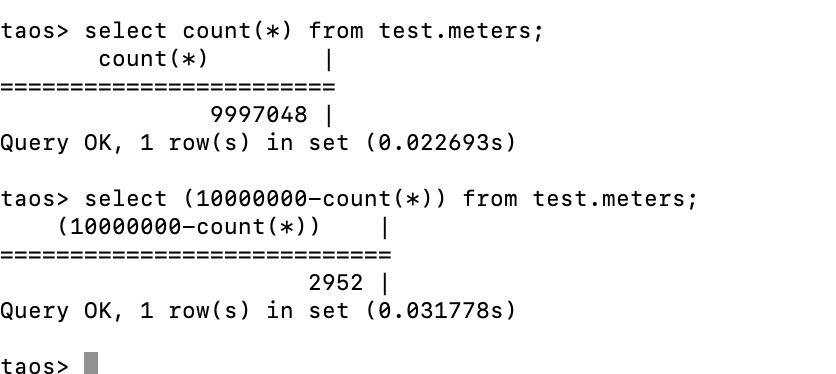 | 查询正常 部分数据丢失 | 通过 注：损坏块的 4096 行数据丢失（修复效果很好） |
| 5 | DATA 文件只有前一半，后面全丢失 | 1. 删除 DATA 文件的后一半 1. 正常模式启动服务，启动成功 1. 查询报错 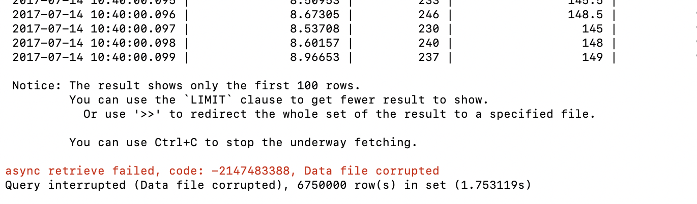 1. 修复模式启动服务，无法启动成功： 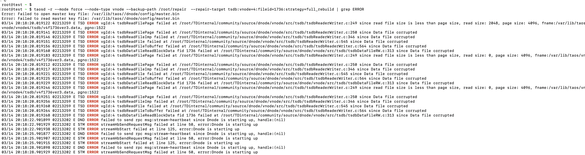 | 查询正常 部分数据丢失 | 不通过 服务无法启动 |
| 6 | DATA 文件只有后一半 | 1. 删除 DATA 文件前一半 1. 正常模式启动服务，启动成功 1. 查询报错  1. 修复模式启动服务，启动成功，有修复错误： 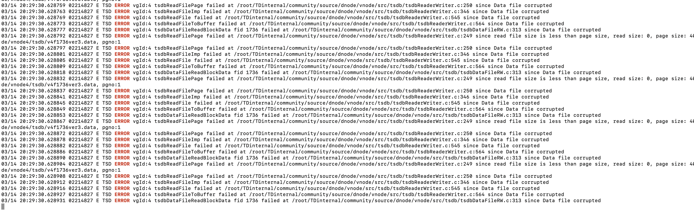 1. 查询成功，丢失数据 384W 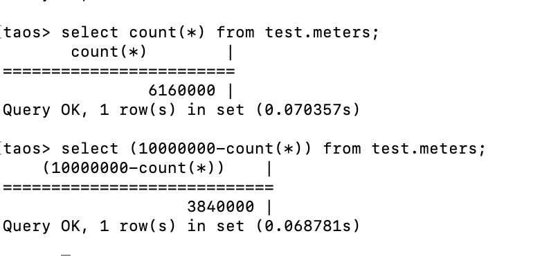 | 查询正常 部分数据丢失 | 通过 注：损坏文件数据全部丢失 |
| 7 | DATA 文件是旧版本 验证有旧版本文件混合场景 | 1. 使用 3.3.0.0 版本生成数据规模一样的 data 文件的内容，替换当前版本的 DATA 文件 1. 正常模式启动服务，成功 1. 查询数据库成功，查询超级表报内存耗尽错误： 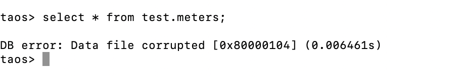 1. 修复模式启动服务，失败： 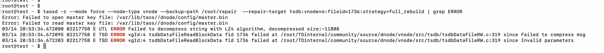 | 查询正常 部分数据丢失 | 不通过 服务启动失败 |
| 8 | DATA 文件零字节 | 1. 删除 DATA 文件全部内容 1. 正常模式启动服务，启动成 1. 查询报错 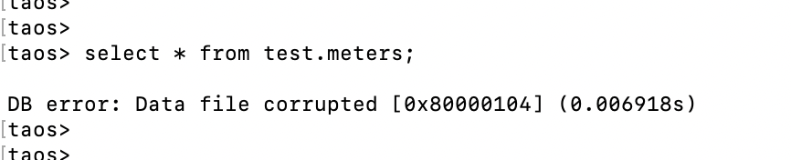 1. 修复模式启动服务，启动成功，并检测到了指定的错误文件： 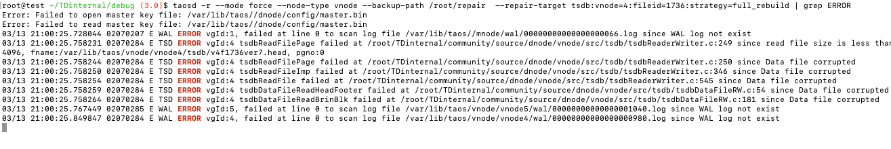 1. 查询成功，丢失数据约 **384W** 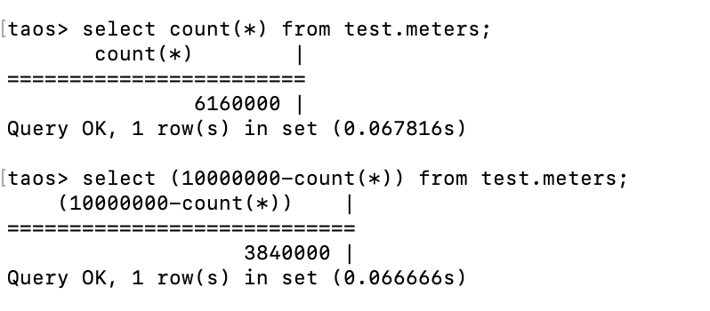 | 查询正常 部分数据丢失 | 通过 损坏文件全部数据丢失 |


### 4.3 META 文件

| 序号 | 破坏场景 | 步骤表现 | 修复预期 | 结果 |
| --- | --- | --- | --- | --- |
| 1 | META 文件多处被破坏 | 1. 破坏 VNODE4 的 META 文件 main.tdb 多处 1. 正常模式启动服务，启动成功 1. 查询超级表报错如下： 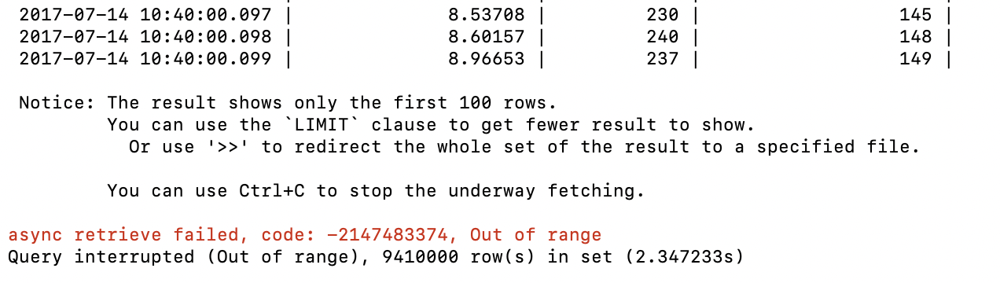 1. 修复模式启动服务，启动正常 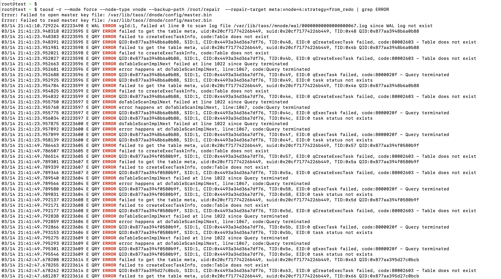 1. 查询超级表，提示表不存在，但 DESC 没问题 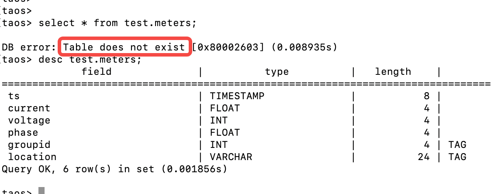 1. 显示子表，1000 个子表只剩 500 多个了，应该是被破坏的 VNODE 下子表都没有了 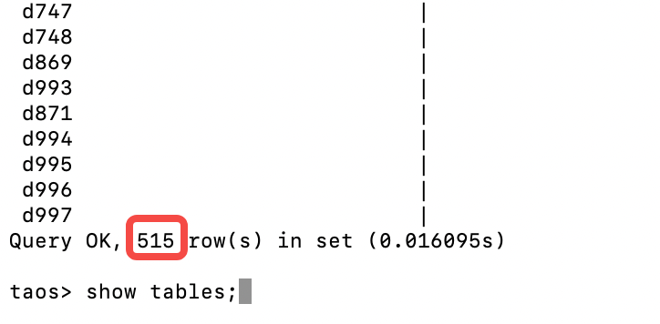 1. 查看子表数据都正常。 | 查询正常 部分数据丢失 | 不通过 超级表无法查询，期望能通过超级表查询剩下正常的子表数据 |
| 2 | META 文件被删除 | 同上一样 |  |  |
| 3 | META 文件结尾 | 1. 改写 VNODE4 的 META 文件 main.tdb 结尾 16 字节，大小保持不变 1. 服务启动正常 1. 所有通过超级表查询都正常 1. 查询子表数据也正确 1. 不需要修复 | 查询正常 | 不需要修复 |
| 4 | META 为之前版本 | 1. 复制 3.3.0.0 的 vnode 下 main.tdb 文件过来替换现有版本文件 1. 启动服务，正常 1. 查询报超级表文件不存在 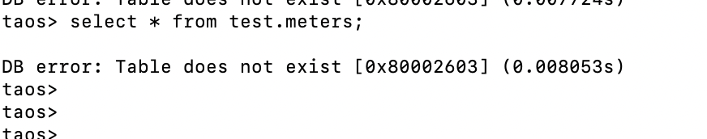 1. 使用修复模式，服务报错无法启动 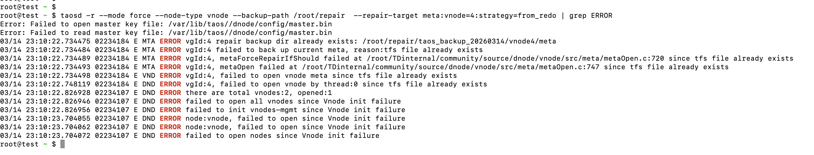 | 服务正常 查询正常 | 不通过 服务无法启动 |


### 4.4 STT 文件（192W 数据在 STT 中）

| 序号 | 破坏场景 | 步骤表现 | 修复预期 | 结果 |
| --- | --- | --- | --- | --- |
| 1 | STT 文件头部被破坏 | 1. VNODE4 下v4f1736ver6.stt 前 16 字节被修改（全头部有数据开始） 1. 正常模式启动服务，报有STT 文件损坏 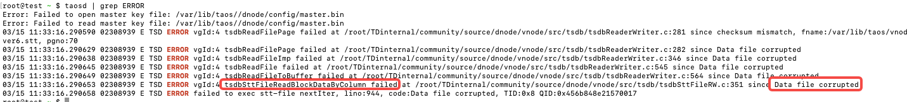 1. 查询超级表行数无变化，但遍历数据少了： 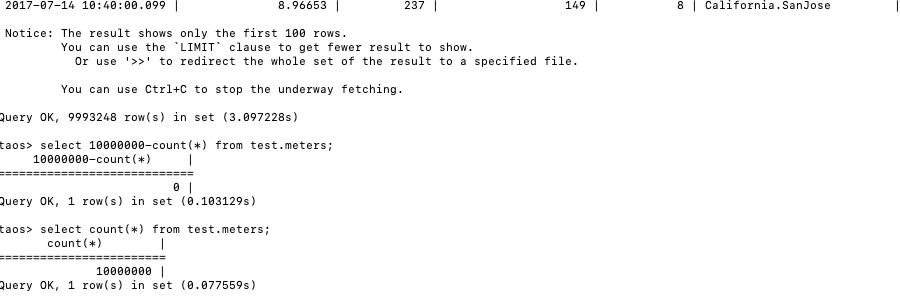 1. 修复模式启动服务，报有文件损坏 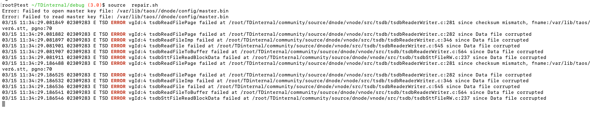 1. 查询超级表，修复后丢失 4096 行数据（1 block） 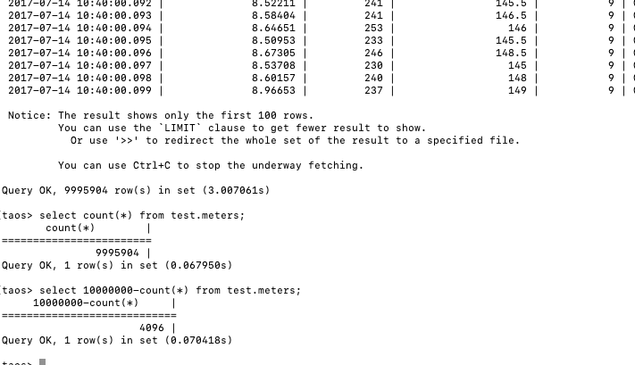 1. 修复后正常启动服务，并向修复 VNODE 写入数据，写入正常，COUNT 统计也正常 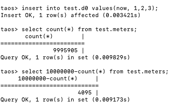 | 服务正常 查询正常 写入正常 有部分数据丢失 | 通过 |
| 2 | STT 文件结尾破坏 | 1. VNODE4 下v4f1736ver6.stt 结尾 16 字节被修改 1. 正常模式启动服务，启动成功，有检查到文件被损坏 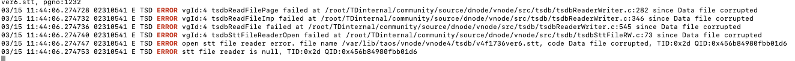 1. 查询超级表，没有报错，但数据少了 96W, 可能整个 STT 文件数据都不能用了 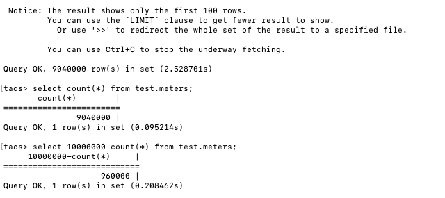 1. 修复模式启动服务，启动正常，有报损坏错误 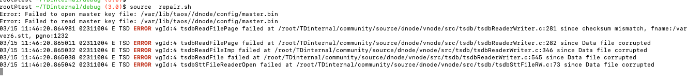 1. 查询超级表，修复后丢失 96w 行数据, 与正常启动模式相同 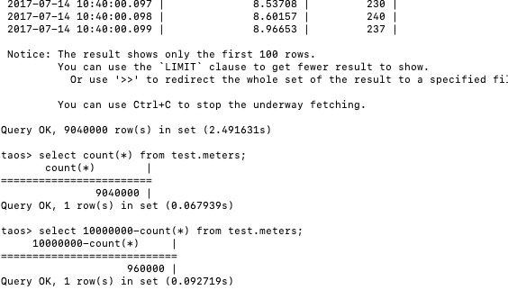 1. 向修复的 VNODE4 节点上的表 d0 写入数据，成功  | 服务正常 查询正常 写入正常 有部分数据丢失 | 通过 |

### 4.5 WAL 文件（40W 数据在 WAL中）

| 序号 | 破坏场景 | 步骤表现 | 修复预期 | 结果 |
| --- | --- | --- | --- | --- |
| 1 | 删除 IDX 文件 | 1. VNODE4 下删除序号最大的一个 IDX 文件 1. 正常模式启动服务，没有报错 1. 查询超级表，行数都正常，无数据丢失。  1. 写入文件也正常  1. 查看文件，被删除的IDX 文件已自动重建出来  1. 结论：删除 IDX 文件无需修复，正常启动即会建出被删除的IDX文件 | 服务正常 查询正常 写入正常 | 通过 |
| 2 | IDX 文件头部破坏 | 1. VNODE4 WAL下修改序号最大的一个 IDX 文件头部 16 字节 1. 启动服务，报有部分错误，启动成功  1. 查询时报 sync leader is restoring 错误:  1. 修复模式启动服务，和正常启动报差不多错  1. 查询时也和正常启动报相同错误 1. 查看 VNODE 状态  | 服务启动正常 查询/写入正常 丢失部分数据 | 不通过 （服务无法启动） |
| 3 | 删除 LOG 文件 | 1. 删除 NODE4 WAL 目录下序号最大的 LOG 文件 1. 正常模式启动服务，启动正常，无报错 1. 查询，丢失 5 W 数据  1. 向被损坏的 VNODE 写入数据，正常  1. 启动修复模式，能报 LOG 文件找不到  | 服务正常 查询正常 写入正常 有部分数据丢失 | 通过 注：无需修复，正常模式启动即可 |
| 4 | IDX 和 LOG 文件同时删除 | 1. 删除 VNODE4 WAL 目录下序号最大的 IDX 及 LOG 文件 1. 正常模式启动服务，正常无报错 1. 查询，丢失了 5W 数据  1. 写入正常  1. 结论，除了丢失数据，其它一切正常，无需修复模式 | 服务正常 查询正常 写入正常 有部分数据丢失 | 通过 注：无需修复，正常模式启动即可 |
| 5 | 破坏 LOG 文件头部 | 1. WAL 下序号最大 LOG 文件修改头部 16 字节 1. 正常启动服务，能启动，有报错提示：  1. 查询，长时间不返回，后台有持续报错：   1. 使用修复模式启动，服务能启动，有检查到报错：  1. 查询，很长时间后返回 错误  1. 修复模式也无法解决查询报错的问题 | 服务正常启动 查询正常 丢失部分数据 | 不通过 （查询报错） |
| 6 | 破坏 LOG 文件结尾 | 1. WAL 下序号最大 LOG 文件修改结尾 16 字节 1. 启动服务，有报错 WAL LOG 文件 checksum 失败，启动失败：  1. 修复模式启动服务，报错相同，无法启动：  | 服务启动正常 查询/写入正常 丢失部分数据 | 不通过 （服务无法启动） |
| 7 | 删除 meta-ver 文件 | 1. WAL 目录下删除 meta-ver15 文件 1. 启动服务，启动正常，有一个报错信息：  1. 查询/写入正常  1. 查询 WAL 目录，恢复出了 meta-ver0 文件 | 服务启动正常 查询/写入正常 无数据丢失 | 通过 （无需修复模式） |
| 8 | 修改 meta-ver 文件 | 1. WAL 目录下修改 meta-ver16 文件多处位置，改错版本号值，删除某个行等破坏行为 1. 启动服务，服务启动成功，有错抛出：  1. 查询/写入都正常， VNODE 状态正常  1. 查看 WAL 目录，删除了 meta-ver15 文件，并自动生成了 meta-ver16, 原来修改及删除的痕迹已被清除，所有数据都重建且正确。 | 服务启动正常 查询/写入正常 无数据丢失 | 通过 （无需修复模式） |
| 9 | WAL 使用旧版本文件 | 1. 目录下全部更换为3.3.0.0 版本 WAL 文件，包括 meta-ver ，整个目录 COPY 过来 1. 启动服务成功，但报多处错误：  1. 查询时抛出错误：   1. 启动修复模式，并查询，报错与正常模式一样：  | 服务启动正常 查询/写入正常 WAL 中数据丢失 | 不通过 （查询报错） |

1. 任何修改 LOG 及 IDX 都会导致服务报 Sync leading is restoring ， 修复模式也一样，无效。
2. 删除 LOG IDEX 文件，无需修复模式，正常启动也会修复完成。
3. LOG 文件丢了数据就真丢了，IDX 文件丢了可以重建。

## 5. 性能

1. 测试环境
机器：192.168.2.164  
硬件：64G 12核  SSD
操作系统： LINUX UBUNTU 22.04 
对比分支： 3.0 VS feat/hzcheng/data_repair 
1. 数据生成 
  taosBenchmark 8 线程生成一个超级表，1W 子表，每子表 10W 数据, 8 个 VGROUPS
  ```plaintext
  taosBenchmark -t 10000 -n 100000 -T 8 -v 8 -y
  ```

1. 测试结果：

  | 指标 | 有修复功能分支 | 3.0分支 | 说明 |
| --- | --- | --- | --- |
| 写入用时 | 356 秒 | 347 | taosBenchmark |
| 投影查询 | 402 秒 | 409 秒 | select * from meters |
| 聚合查询 | 194 毫秒 | 192 毫秒 | Select count(*) from meters |

**    结论:  数据为正常波动，对写入/查询性影响不大**

## 6. 总结

1. DATA 文件后面有些位置损坏及旧版本混合情况下会导致查询超级表报错，修复无效
2. VNODE 下的 META 文件损坏后会出现超级表不存在，desc 却可以显示表，修复无效
3. WAL 处理 IDX LOG 文件不存在时效果很好，但文件被损坏时，一部分情况修复无效
4. 简单测试性能，改动对性能影响不大
5. 整体评价修复功能非常不错，大部分情况下文件损坏致功能无法使用可得到有效解决。
6. 测试过程也发现了与修复无关的一些产品问题，算是意外收获，已建 BUG 单。

## 7. 未来版本建议

1. **挽回更多数据**
  上面测试有些场景损坏字节数很小，但由于关键信息损坏，导致整个数据都丢了，后面版本可考虑重要信息冗余设计，挽回更多数据。
1. **增加自动修复参数**
目前修复参数较多，参数意义技术性较强，不熟悉引擎存储结构理解很困难，不利于功能推广使用，方便用户独立解决更多问题。 建议新增 -auto 参数自动发现问题并修复，为了安全，自动修复强制备份，在修复完生成一份修复报告。
