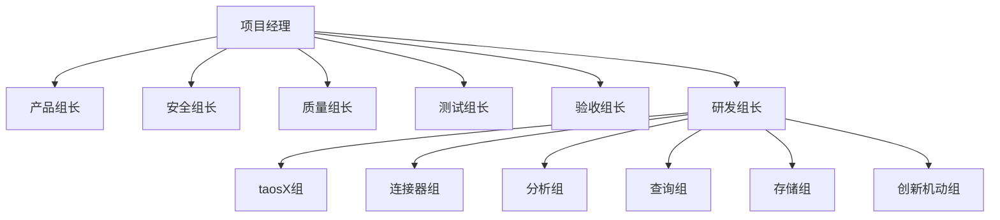
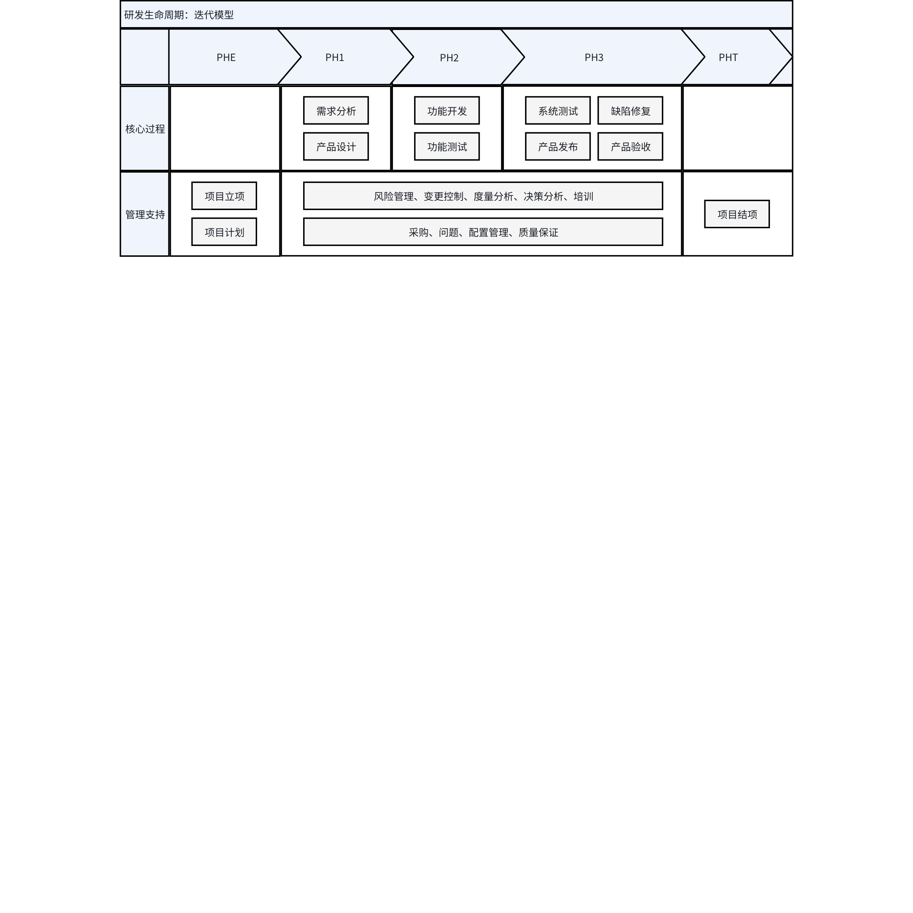

# TSDB v3.4.2 项目计划文档

## 1. 修订记录

| 编写日期 | 发布日期 | 版本 | 修订人 | 主要修改内容 |
| --- | --- | --- | --- | --- |
| 2026-3-11 | - | 1.0 | 关胜亮 | 项目计划、详细的工作范围 |
| 2026-3-20 | 2026-3-20 | 1.1 | 霍琳贺、肖波、关胜亮 | 按评审结果调整工作项 |

## 2. 项目目标

本项目聚焦于开发与发布 TDengine v3.4.2，致力于达成以下核心目标：
1. 引擎
  1. 窗口函数和 OVER 子句
  2. 虚拟表继承机制
  3. 联合查询（与其他数据库）的演示版本
  4. 数据缓存在并发查询、写入、多列等场景的性能提升
  5. TDgpt 支持模型生命周期的管理
2. 工具
  1. TSDB Explorer 支持 Data Out 到 Parquet/Kafka/MQTT 的导出能力
  2. taosX 高可用与负载均衡继续完善和增强
  3. 连接器能力补齐与兼容增强
  4. 测试与质量保障
    1. XNODE高可用异常自动化测试
    2. 连接器负载均衡测试
    3. 订阅测试工具与其他工具测试等，保障交付质量。
3. 平台
  1. 建立日志周期性检查机制
  2. crash-gen 优化及增强
  3. GitHub Internal/Private 仓库迁移至 GitLab
  4. IDMP稳定性测试框架

## 3. 项目范围

### 3.1 业务

#### 3.1.1 引擎

| 名称 | 优先级 | 报告人 | 链接 |
| --- | --- | --- | --- |
| [售前][冠德] 流计算 external window 和多分组优化支持 JOIN 语句 | P3 | Jack Dong | [链接](https://project.feishu.cn/taosdata_td/feature/detail/6923487183) |
| [交付][领储宇能] ServerPort 修改后订阅内部记录应同步更新 | P3 | Kian Wang | [链接](https://project.feishu.cn/taosdata_td/feature/detail/6923036499) |
| [交付][郑煤机] 共享存储支持配置华为 obs | P3 | Kian Wang | [链接](https://project.feishu.cn/taosdata_td/68d89fc0cfbfe8e03b718ac7/detail/6918805473) |
| [交付][社区] 订阅功能开源版本可以修改 topic 数量 | P3 | Steven Zhang | [链接](https://project.feishu.cn/taosdata_td/feature/detail/6914731989) |
| [交付] 全局参数修改专用工具 | P3 | Steven Zhang | [链接](https://project.feishu.cn/taosdata_td/feature/detail/6914845502) |
| [交付][领储宇能] k8s 部署时无法获得正常的容器资源信息 | P3 | Steven Zhang | [链接](https://project.feishu.cn/taosdata_td/feature/detail/6861626512?node=28332479) |
| [交付][疆海] TO_ISO8601 支持夏令时的转化 | P3 | Raistlin Chen | [链接](https://project.feishu.cn/taosdata_td/feature/detail/6849686611?node=28332479) |
| [交付][博创联动] 子查询数据扫描时，取子查询与外层时间范围的交集进行扫描 | P3 | Kian Wang | [链接](https://project.feishu.cn/taosdata_td/feature/detail/6772914536?node=28332479) |
| [交付] 规范化数据库重要操作开始结束标志信息输出 | P3 | Steven Zhang | [链接](https://project.feishu.cn/taosdata_td/feature/detail/6672111997?node=28332479) |
| [售前][上海电气中央研究院] 虚拟表支持引用不同数据库精度的表 | P3 | Tyler Liu | [链接](https://project.feishu.cn/taosdata_td/feature/detail/6671971734?node=28332479) |
| [交付][新奥新智] 大量查询不存在表导致 mnode CPU 高 | P3 | Zee Lv | [链接](https://project.feishu.cn/taosdata_td/feature/detail/6671837225?node=28332479) |
| [交付][河北电力] 希望增加日志里重要 ERROR 告警 | P3 | Zee Lv | [链接](https://project.feishu.cn/taosdata_td/feature/detail/6670886193?node=28332479) |
| [售前][南网 CEP] show local/dnode variables增加一参数列：是否需要重启生效、当前参数未生效 | P3 | Bo Xiao | [链接](https://project.feishu.cn/taosdata_td/feature/detail/6599966995?node=28332479) |
| [交付][河北电力]优化频繁 use db 导致 mnode read 线程压力过大 | P3 | Zee Lv | [链接](https://project.feishu.cn/taosdata_td/feature/detail/6589436029?node=28332479) |
| [交付][天合富家] 增加缓存强制刷新功能 | P3 | Yanqiong Dong | [链接](https://project.feishu.cn/taosdata_td/feature/detail/6574020760?node=28332479) |
| [售前][南网数研院][南瑞电网] 提升 Interp 查询性能 | P4 | Bo Xiao | [链接](https://project.feishu.cn/taosdata_td/feature/detail/6514083018?node=28332479) |
| [售前][三峡集团]需要支持ROW_NUMBER() OVER()函数 | P4 | Jack Dong | [链接](https://project.feishu.cn/taosdata_td/feature/detail/6513771567?node=28332479) |
| [售前][神东集团]单副本变三副本支持共享存储 | P3 | Simon Guan | [链接](https://project.feishu.cn/taosdata_td/feature/detail/6511323203?node=28332479) |
| [交付] Audit 库可以记录客户端 IP | P3 | Hui Li | [链接](https://project.feishu.cn/taosdata_td/feature/detail/6511301953?node=26742312) |
| [交付][拾贝云] Greatest/Least 与 MySQL 对齐，支持忽略 NULL | P3 | Raistlin Chen | [链接](https://project.feishu.cn/taosdata_td/feature/detail/6511294180?node=28332479) |
| [交付][中冶京诚] insert into file 错误信息优化提升 | P3 | Steven Zhang | [链接](https://project.feishu.cn/taosdata_td/feature/detail/6510958760?node=28332479) |
| [售前][上科信息] 分组查询 partition by 支持组内排序 | P3 | Richard Li | [链接](https://project.feishu.cn/taosdata_td/feature/detail/6510119993?node=28332479) |
| [售前][陕西中烟] 缺少排名函数，如rank() | P3 | Abraham Liu | [链接](https://project.feishu.cn/taosdata_td/feature/detail/6507156244?node=28332479) |
| [交付] 查询函数 Sleep(duration) 用于超时问题模拟 | P3 | Raistlin Chen | [链接](https://project.feishu.cn/taosdata_td/feature/detail/6507136288?node=28332479) |
| [交付][海澜智云] 社区版在执行企业版专有功能时有报错提醒 | P3 | Tyler Liu | [链接](https://project.feishu.cn/taosdata_td/feature/detail/6507051705?node=28332479) |
| [交付][南网储能-拾贝云] 节点启动过程中应用需要正常使用不报错 | P3 | Raistlin Chen | [链接](https://project.feishu.cn/taosdata_td/feature/detail/6506113427?node=28332479) |
| [交付] show table distribute 格式化显示，便于过滤 | P3 | Raistlin Chen | [链接](https://project.feishu.cn/taosdata_td/feature/detail/6506025858?node=28332479) |
| [交付] 支持指定列进行最新数据缓存 | P3 | Beryl Bao | [链接](https://project.feishu.cn/taosdata_td/feature/detail/6491198599?node=28332479) |
| [交付] 禁止删除正在被订阅使用的子表的对应的超级表 | P3 | Simon Guan | [链接](https://project.feishu.cn/taosdata_td/feature/detail/6491115004?node=28332479) |
| [交付][爱动] 支持分钟级别的时区 | P3 | Kian Wang | [链接](https://project.feishu.cn/taosdata_td/feature/detail/6491037879?node=28332479) |
| [交付][中国电建] 副本变更不影响数据订阅 | P3 | Tyler Liu | [链接](https://project.feishu.cn/taosdata_td/feature/detail/6490727766?node=28332479) |

#### 3.1.2 工具

| 名称 | 优先级 | 报告人 | 链接 |
| --- | --- | --- | --- |
| [售前][上海电气中央研究院] 希望 taosX 能够主动控制资源占用 | P3 | Tyler Liu | [链接](https://project.feishu.cn/taosdata_td/feature/detail/6617536550) |
| [售前][上海电气中央研究院] MQTT 数据源能够获取报文头信息 | P3 | Tyler Liu | [链接](https://project.feishu.cn/taosdata_td/feature/detail/6617550569) |
| [售前][上海电气中央研究院] 通过 taosX 上传大量 csv 文件并导入的行为改进 | P3 | Tyler Liu | [链接](https://project.feishu.cn/taosdata_td/feature/detail/6617617575) |
| [河北电力新一代调度项目] taosX 归档的 archive 文件读取工具 | P3 | Tyler Liu | [链接](https://project.feishu.cn/taosdata_td/feature/detail/6662862362) |
| [公共] taosx支持进行数据transformer的导入及导出 | P3 | Steven Zhang | [链接](https://project.feishu.cn/taosdata_td/feature/detail/6662978465) |
| [explorer] 数据订阅的示例代码页面，步骤条显示错误 | P5 | Yuanpai Zhang | [链接](https://project.feishu.cn/taosdata_td/feature/detail/6663226836) |
| [Shape Digital] Rolling full-backup | P3 | Leo Huo | [链接](https://project.feishu.cn/taosdata_td/feature/detail/6861580736) |
| [长飞光纤]AVEVA Historian数据源任务数据实时同步优化 | P3 | Kian Wang | [链接](https://project.feishu.cn/taosdata_td/feature/detail/6751085739) |
| [沃太能源]taosx支持指定表的备份恢复 | P3 | Yanqiong Dong | [链接](https://project.feishu.cn/taosdata_td/feature/detail/6751395113) |

#### 3.1.3 平台

| 名称 | 优先级 | 报告人 | 链接 |
| --- | --- | --- | --- |
| 生成TDgpt在Windows上的安装包，并测试运行 | P3 | Haoran Chen | [链接](https://project.feishu.cn/taosdata_td/feature/detail/6856808946?parentUrl=%2Ftaosdata_td%2Ffeature%2Fhomepage) |
| [安全] 为发布版本生成 SBOM 文件 | P3 | Haoran Chen | [链接](https://project.feishu.cn/taosdata_td/feature/detail/6776375399?parentUrl=%2Ftaosdata_td%2Ffeature%2Fhomepage) |
| 【售前】统一非root用户和root用户安装后启动taos cli的行为 | P3 | Haoran Chen | [链接](https://project.feishu.cn/taosdata_td/feature/detail/6668113757?parentUrl=%2Ftaosdata_td%2Ffeature%2Fhomepage) |

### 3.2 IDMP

#### 3.2.1 引擎

| 名称 | 优先级 | 报告人 | 链接 |
| --- | --- | --- | --- |
| [IDMP] 模型生命周期管理—训练、存储、部署、更新 | P3 | Haojun Liao | [链接](https://project.feishu.cn/taosdata_td/feature/detail/6876850920?node=28332517) |
| [IDMP] 查询中支持按自然周、月、季、年 | P3 | Simon Guan | [链接](https://project.feishu.cn/taosdata_td/feature/detail/6661700117?node=28332517) |
| [IDMP] 元数据更新支持事务（演示版本） | P3 | Yaqiang Li | [链接](https://project.feishu.cn/taosdata_td/feature/detail/6661525203?node=28332517) |
| [IDMP] 元数据更新支持事务（虚拟表变更） | P3 | Yaqiang Li | [链接](https://project.feishu.cn/taosdata_td/feature/detail/6659965197?node=28332517) |
| [IDMP] 放宽窗口查询限制（不仅是聚合） | P3 | Yaqiang Li | [链接](https://project.feishu.cn/taosdata_td/feature/detail/6659773700?node=28332517) |
| [IDMP] CSUM 支持在窗口查询中使用 | P3 | Yaqiang Li | [链接](https://project.feishu.cn/taosdata_td/feature/detail/6598098782?node=28332517) |
| [IDMP][一汽红旗] 事件窗口的结束条件也能够设置持续时间判断 | P3 | Tyler Liu | [链接](https://project.feishu.cn/taosdata_td/feature/detail/6592836563?node=28332517) |
| [IDMP][北美] 虚拟表支持引用虚拟表 | P1 | Yaqiang Li | [链接](https://project.feishu.cn/taosdata_td/feature/detail/6589380578?node=28332517) |
| [IDMP] 删除数据库不加 force 应该告知客户真实原因 | P3 | Yaqiang Li | [链接](https://project.feishu.cn/taosdata_td/feature/detail/6572940279?node=28332517) |
| [IDMP] 支持修改虚拟超级表列名 | P4 | Simon Guan | [链接](https://project.feishu.cn/taosdata_td/feature/detail/6570504710?node=28332517) |
| [IDMP] 支持窗口函数和 OVER 子句 | P3 | Simon Guan | [链接](https://project.feishu.cn/taosdata_td/feature/detail/6549502576?node=28332517) |

#### 3.2.2 工具

| 名称 | 优先级 | 报告人 | 链接 |
| --- | --- | --- | --- |
| 无 | | | |

#### 3.2.3 平台

| 名称 | 优先级 | 报告人 | 链接 |
| --- | --- | --- | --- |
| IDMP稳定性测试框架 | P3 | Mia Nie | [链接](https://project.feishu.cn/taosdata_td/job/detail/6923408041?parentUrl=%2Ftaosdata_td%2Fjob%2Fhomepage) |
| IDMP快速发版 | P3 | Mia Nie | [链接](https://project.feishu.cn/taosdata_td/job/detail/6923338474?parentUrl=%2Ftaosdata_td%2Fjob%2Fhomepage) |
| 建立IDMP发版性能基线 | P3 | Mia Nie | [链接](https://project.feishu.cn/taosdata_td/job/detail/6923126003?parentUrl=%2Ftaosdata_td%2Fjob%2Fhomepage) |
| IDMP每两周的发版，需要增加windows 以及mac 版本的测试 | P3 | Mia Nie | [链接](https://project.feishu.cn/taosdata_td/job/detail/6854423609?parentUrl=%2Ftaosdata_td%2Fjob%2Fhomepage) |
| IDMP 安装文档改进 | P1 | Mia Nie | [链接](https://project.feishu.cn/taosdata_td/job/detail/6660076218?parentUrl=%2Ftaosdata_td%2Fjob%2Fhomepage) |

### 3.3 规划

#### 3.3.1 引擎

| 名称 | 优先级 | 报告人 | 链接 |
| --- | --- | --- | --- |
| [Windows] UDF 适配 | P3 | Simon Guan | [链接](https://project.feishu.cn/taosdata_td/feature/detail/6876989393?node=28332476) |
| [Windows] 分析不支持的功能小项并适配 | P3 | Simon Guan | [链接](https://project.feishu.cn/taosdata_td/feature/detail/6862269465?node=28332476) |
| [Windows] 共享存储适配 | P3 | Simon Guan | [链接](https://project.feishu.cn/taosdata_td/feature/detail/6862220600?node=28332476) |
| [Windows] MQTT 订阅适配 | P3 | Simon Guan | [链接](https://project.feishu.cn/taosdata_td/feature/detail/6862031345?node=28332476) |
| [规划] 流计算支持 ANY/SOME/ALL/EXISTS/NOT EXISTS 运算符 | P3 | Wei Pan | [链接](https://project.feishu.cn/taosdata_td/feature/detail/6751417338?node=28332476) |
| [安全可靠测评] 强制访问控制，主体级别、客体级别（1-5） | P3 | Beryl Bao | [链接](https://project.feishu.cn/taosdata_td/feature/detail/6671585124?node=28332476) |
| [安全可靠测评] 引擎侧支持三员权限 | P3 | Beryl Bao | [链接](https://project.feishu.cn/taosdata_td/feature/detail/6670071929?node=28332476) |
| [规划] 完善数据修复工具 | P3 | Simon Guan | [链接](https://project.feishu.cn/taosdata_td/feature/detail/6661410964?node=28332476) |
| [规划] TDgpt 预测性维护 | P3 | Simon Guan | [链接](https://project.feishu.cn/taosdata_td/feature/detail/6660040972?node=28332476) |
| [规划] 联合查询（演示版本） | P3 | Simon Guan | [链接](https://project.feishu.cn/taosdata_td/feature/detail/6660036900?node=28332476) |
| [规划] 流计算多个客户场景的性能提升 | P3 | Simon Guan | [链接](https://project.feishu.cn/taosdata_td/feature/detail/6660030137?node=28332476) |
| [规划] 缩短多副本切主后集群恢复时间 | P3 | Simon Guan | [链接](https://project.feishu.cn/taosdata_td/feature/detail/6660003972?node=28332476) |
| [规划] 缩短离线节点恢复的时间（不阻塞写入） | P3 | Simon Guan | [链接](https://project.feishu.cn/taosdata_td/feature/detail/6659897268?node=28332476) |
| [规划] 流计算多测点场景的性能优化 | P3 | Simon Guan | [链接](https://project.feishu.cn/taosdata_td/feature/detail/6659810600?node=28332476) |
| [规划] 流计算进一步降低资源消耗 | P3 | Simon Guan | [链接](https://project.feishu.cn/taosdata_td/feature/detail/6659796573?node=28332476) |
| [规划] 流计算支持虚拟超级表聚合查询优化 | P3 | Joey Sima | [链接](https://project.feishu.cn/taosdata_td/feature/detail/6619755141?node=28332476) |
| [规划] 流计算 vnode 切主 reader tablelist 更新逻辑（虚拟表和非虚拟表） | P3 | Mark Wang | [链接](https://project.feishu.cn/taosdata_td/feature/detail/6616784073?node=28332476) |
| [规划] dataOrderLevel 使用及 table merge scan 有序传递 | P3 | Xinsheng Ren | [链接](https://project.feishu.cn/taosdata_td/feature/detail/6581335366?node=28332476) |
| [规划] show streams 支持不指定 dbname | P3 | Bo Xiao | [链接](https://project.feishu.cn/taosdata_td/feature/detail/6579574893?node=28332476) |
| [规划] lastrow 并发查询性能优化 | P3 | Bo Xiao | [链接](https://project.feishu.cn/taosdata_td/feature/detail/6570698058?node=28332476) |
| [规划] taosc API 在 stdout 不应有输出 | P3 | Leo Huo | [链接](https://project.feishu.cn/taosdata_td/feature/detail/6551339451?node=28332476) |
| [规划] 子查询涉及主键列排序场景的性能优化 | P3 | Wei Pan | [链接](https://project.feishu.cn/taosdata_td/feature/detail/6544826545?node=28332476) |
| [规划] 优化需要 TS 主键列函数的执行条件 | P3 | Wei Pan | [链接](https://project.feishu.cn/taosdata_td/feature/detail/6536374390?node=28332476) |
| [规划] 允许失败时，流的通知发送改成异步进行 | P3 | Kane Kuang | [链接](https://project.feishu.cn/taosdata_td/feature/detail/6503261141?node=28332476) |
| [规划] 虚拟表继承 | P3 | Simon Guan | [链接](https://project.feishu.cn/taosdata_td/feature/detail/6492554061?node=28332476) |
| [规划] 流计算删除 snode 时的 checkpoint 同步与校验 | P3 | Wei Pan | [链接](https://project.feishu.cn/taosdata_td/feature/detail/6491292920?node=28332476) |
| [规划] 流计算虚拟表触发计算性能优化 | P3 | Wei Pan | [链接](https://project.feishu.cn/taosdata_td/feature/detail/6490982243?node=28332476) |
| [规划] 提升开启 Last 缓存时多列场景的写入性能 | P3 | Beryl Bao | [链接](https://project.feishu.cn/taosdata_td/feature/detail/6490743340?node=28332476) |
| [规划] 流计算 checkpoint 各类失败问题处理 | P3 | Mark Wang | [链接](https://project.feishu.cn/taosdata_td/feature/detail/6490739879?node=28332476) |
| [规划] 流计算历史计算性能优化 | P3 | Kane Kuang | [链接](https://project.feishu.cn/taosdata_td/feature/detail/6490635370?node=28332476) |
| [规划] 支持季度时间单位 | P3 | Tony Zhang | [链接](https://project.feishu.cn/taosdata_td/feature/detail/6474961364?node=28332476) |

#### 3.3.2 工具

| 名称 | 优先级 | 报告人 | 链接 |
| --- | --- | --- | --- |
| [安全] jwt token secret 变为动态发送给 xnoded | P3 | Joe Zhang | [链接](https://project.feishu.cn/taosdata_td/feature/detail/6669980852) |
| [规划] Data Out 支持导出到 Parquet | P3 | Leo Huo | [链接](https://project.feishu.cn/taosdata_td/feature/detail/6755452428) |
| [规划] TSDB taosX/Explorer 数据导出 | P3 | Leo Huo | [链接](https://project.feishu.cn/taosdata_td/feature/detail/6755509969) |
| [规划] Data Out 支持导出到 Kafka | P3 | Leo Huo | [链接](https://project.feishu.cn/taosdata_td/feature/detail/6755550481) |
| [规划] Data Out 支持导出到 MQTT | P3 | Leo Huo | [链接](https://project.feishu.cn/taosdata_td/feature/detail/6755725378) |
| 数据备份支持备份虚拟表和流计算 | P3 | Yaqiang Li | [链接](https://project.feishu.cn/taosdata_td/feature/detail/6590611316) |
| Explorer 可配置 Agent 服务地址 | P3 | Jim Fan | [链接](https://project.feishu.cn/taosdata_td/feature/detail/6622744595) |
| taosX 高可用异常测试自动化 | P3 | Leo Huo | [链接](https://project.feishu.cn/taosdata_td/feature/detail/6635149921) |
| taosX：PostgreSQL 支持负载均衡 | P3 | Leo Huo | [链接](https://project.feishu.cn/taosdata_td/feature/detail/6646214948) |
| taosX: 数据迁移支持负载均衡 | P3 | Leo Huo | [链接](https://project.feishu.cn/taosdata_td/feature/detail/6646294822) |
| taosX: Oracle 支持负载均衡 | P3 | Leo Huo | [链接](https://project.feishu.cn/taosdata_td/feature/detail/6646341320) |
| taosx: MQTT 共享主题支持负载均衡 | P3 | Leo Huo | [链接](https://project.feishu.cn/taosdata_td/feature/detail/6646349319) |
| taosx 高可用：支持同一任务下多个 agent 节点故障转移 | P3 | Leo Huo | [链接](https://project.feishu.cn/taosdata_td/feature/detail/6646475807) |
| taosx: MySQL 支持负载均衡 | P3 | Leo Huo | [链接](https://project.feishu.cn/taosdata_td/feature/detail/6646545784) |
| taosx：Agent 支持高可用 | P3 | Leo Huo | [链接](https://project.feishu.cn/taosdata_td/feature/detail/6646814636) |
| taosX: TDengine 数据订阅支持负载均衡 | P3 | Leo Huo | [链接](https://project.feishu.cn/taosdata_td/feature/detail/6646964092) |
| taosX: MSSQL 支持查询负载均衡 | P3 | Leo Huo | [链接](https://project.feishu.cn/taosdata_td/feature/detail/6647002003) |
| [文档] Transform 文档优化 | P3 | Leo Huo | [链接](https://project.feishu.cn/taosdata_td/feature/detail/6658905956) |
| [测试] 连接器负载均衡测试 | P5 | Leo Huo | [链接](https://project.feishu.cn/taosdata_td/feature/detail/6658950467) |
| [测试] taosx xnode 稳定性测试 | P3 | Leo Huo | [链接](https://project.feishu.cn/taosdata_td/feature/detail/6659281143) |
| [规划] taosx 写入性能优化 | P3 | Leo Huo | [链接](https://project.feishu.cn/taosdata_td/feature/detail/6659287657) |
| [规划] taosx 性能指标可观测性优化 | P3 | Leo Huo | [链接](https://project.feishu.cn/taosdata_td/feature/detail/6659306656) |
| TSDB 全链路认证 | P1 | Leo Huo | [链接](https://project.feishu.cn/taosdata_td/feature/detail/6659784159) |
| TSDB 全链路高可用 | P1 | Leo Huo | [链接](https://project.feishu.cn/taosdata_td/feature/detail/6659802637) |
| TSDB 全链路传输安全 | P1 | Leo Huo | [链接](https://project.feishu.cn/taosdata_td/feature/detail/6659839665) |
| TSDB 订阅测试工具 | P3 | Leo Huo | [链接](https://project.feishu.cn/taosdata_td/feature/detail/6659848104) |
| taosx: 新增数据源 开发指南 | P3 | Leo Huo | [链接](https://project.feishu.cn/taosdata_td/feature/detail/6659972286) |
| C# WebSocket 参数绑定支持 decimal 类型和 blob 类型 | P3 | Yanjie She | [链接](https://project.feishu.cn/taosdata_td/feature/detail/6662861855) |
| JDBC 支持 Adapter 高可用 | P3 | Leo Huo | [链接](https://project.feishu.cn/taosdata_td/feature/detail/6662868645) |
| [生态-IOT] 添加 Ignition 文档 | P3 | Leo Huo | [链接](https://project.feishu.cn/taosdata_td/feature/detail/6662886210) |
| TDinsight增加统计指标 | P3 | Leo Huo | [链接](https://project.feishu.cn/taosdata_td/feature/detail/6662891539) |
| Go 支持 Adapter 高可用 | P3 | Leo Huo | [链接](https://project.feishu.cn/taosdata_td/feature/detail/6662936374) |
| go 支持上报连接器类型和版本，方便交付排查版本兼容性 | P3 | Leo Huo | [链接](https://project.feishu.cn/taosdata_td/feature/detail/6662936399) |
| taosd的监控面板中加上taosd和taosadapter重启次数的面板 | P3 | Leo Huo | [链接](https://project.feishu.cn/taosdata_td/feature/detail/6662957126) |
| TAOS-CLI 云服务版支持 CTRL + C stop 查询的功能 | P5 | Leo Huo | [链接](https://project.feishu.cn/taosdata_td/feature/detail/6662965148) |
| C# 支持 Adapter 高可用 | P3 | Leo Huo | [链接](https://project.feishu.cn/taosdata_td/feature/detail/6663137799) |
| go WebSocket 参数绑定支持 decimal 类型和 blob 类型 | P3 | Yanjie She | [链接](https://project.feishu.cn/taosdata_td/feature/detail/6663140766) |
| C# websocket 支持 blob 类型 | P3 | Yanjie She | [链接](https://project.feishu.cn/taosdata_td/feature/detail/6663148353) |
| [产品] taosShell/Dump/taosGen 全流程测试 | P3 | Leo Huo | [链接](https://project.feishu.cn/taosdata_td/feature/detail/6663182678) |
| C# 支持上报连接器类型和版本，方便交付排查版本兼容性 | P3 | Yanjie She | [链接](https://project.feishu.cn/taosdata_td/feature/detail/6663218839) |
| jdbc 连接器优化超时情况下的 poll 处理 | P3 | Leo Huo | [链接](https://project.feishu.cn/taosdata_td/feature/detail/6663229168) |
| 绑定 vGroup 进一步提升 taosgen 写入性能 | P3 | Yanjie She | [链接](https://project.feishu.cn/taosdata_td/feature/detail/6664912304) |
| Go 连接器 Websocket 支持 stmt2 接口 | P3 | Yanjie She | [链接](https://project.feishu.cn/taosdata_td/feature/detail/6664967521) |
| Python 连接器支持 UTC-8 格式设置时区，方便 CI 验证 TDengine 时区 | P3 | Yanjie She | [链接](https://project.feishu.cn/taosdata_td/feature/detail/6665037631) |
| nodejs 支持 blob 类型 | P3 | Yanjie She | [链接](https://project.feishu.cn/taosdata_td/feature/detail/6665098131) |
| 命令行方便查看订阅数据的工具 | P3 | Leo Huo | [链接](https://project.feishu.cn/taosdata_td/feature/detail/6665124593) |
| TDengine CLI 中无法中断查询显示错误提示 | P3 | Yanjie She | [链接](https://project.feishu.cn/taosdata_td/feature/detail/6665149073) |
| C 支持 Adapter 高可用 | P3 | Leo Huo | [链接](https://project.feishu.cn/taosdata_td/feature/detail/6665209146) |
| python WebSocket 参数绑定支持 decimal 类型和 blob 类型 | P3 | Yanjie She | [链接](https://project.feishu.cn/taosdata_td/feature/detail/6665209157) |
| rust 连接器参数绑定支持 decimal 类型和 blob 类型 | P3 | Yanjie She | [链接](https://project.feishu.cn/taosdata_td/feature/detail/6665220606) |
| python 连接器支持 Adapter 高可用 | P3 | Leo Huo | [链接](https://project.feishu.cn/taosdata_td/feature/detail/6665221613) |
| taos shell不支持以16进制显示查询结果 | P3 | Yanjie She | [链接](https://project.feishu.cn/taosdata_td/feature/detail/6665254525) |
| Nodejs 支持 Adapter 高可用 | P3 | Leo Huo | [链接](https://project.feishu.cn/taosdata_td/feature/detail/6665270968) |
| nodejs WebSocket 参数绑定支持 decimal 类型和 blob 类型 | P3 | Yanjie She | [链接](https://project.feishu.cn/taosdata_td/feature/detail/6665271129) |
| 完成 taosdump WebSocket 性能测试，输出测试报告 | P3 | Leo Huo | [链接](https://project.feishu.cn/taosdata_td/feature/detail/6665478959) |
| taosgen 支持输出到 CSV | P3 | Leo Huo | [链接](https://project.feishu.cn/taosdata_td/feature/detail/6665540510) |
| nodejs 连接器性能压测工具开发 | P3 | Leo Huo | [链接](https://project.feishu.cn/taosdata_td/feature/detail/6665840988) |
| rust 连接器支持 Adapter 高可用 | P3 | Leo Huo | [链接](https://project.feishu.cn/taosdata_td/feature/detail/6666030630) |
| python 连接器性能压测工具开发 | P3 | Leo Huo | [链接](https://project.feishu.cn/taosdata_td/feature/detail/6666030663) |
| taosgen 优化CSV文件读入的方式 | P3 | Yanjie She | [链接](https://project.feishu.cn/taosdata_td/feature/detail/6666686250) |
| taosdump 支持查询 TDengine | P3 | Yanjie She | [链接](https://project.feishu.cn/taosdata_td/feature/detail/6666995190) |
| create xnode task 的 database 类型支持创建默认 token | P3 | Joe Zhang | [链接](https://project.feishu.cn/taosdata_td/feature/detail/6755732199) |
| JDBC 驱动缓存 preparedStatement 对象，以提高性能 | P3 | Yanjie She | [链接](https://project.feishu.cn/taosdata_td/feature/detail/6778286253) |
| Explorer 生成任务配置优化，global 字段默认不传或内部字段默认为空 | P3 | Astro Yan | [链接](https://project.feishu.cn/taosdata_td/feature/detail/6793571117) |
| JDBC stmt2 序列化优化 | P3 | Yanjie She | [链接](https://project.feishu.cn/taosdata_td/feature/detail/6860938390) |
| taosx 支持导入导出配置文件 | P3 | Zhiyu Yang | [链接](https://project.feishu.cn/taosdata_td/feature/detail/6862666522) |

#### 3.3.3 平台

| 名称 | 优先级 | 报告人 | 链接 |
| --- | --- | --- | --- |
| GitHub Internal/Private 仓库迁移至 GitLab | P3 | Xu Wang | [链接](https://project.feishu.cn/taosdata_td/job/detail/6923512114?parentUrl=%2Ftaosdata_td%2Fjob%2Fhomepage) |
| 一键部署工具持续优化 | P3 | Jayden Jia | [链接](https://project.feishu.cn/taosdata_td/job/detail/6923543772?parentUrl=%2Ftaosdata_td%2Fjob%2Fhomepage) |
| crash-gen 优化及增强 | P3 | Jayden Jia | [链接](https://project.feishu.cn/taosdata_td/job/detail/6921486960?parentUrl=%2Ftaosdata_td%2Fjob%2Fhomepage) |
| [公共] 主线版本需要常态化集成测试与长稳测试 | P3 | Jayden Jia | [链接](https://project.feishu.cn/taosdata_td/feature/detail/6668127609?parentUrl=%2Ftaosdata_td%2Ffeature%2Fhomepage) |
| aiberm token 管理工具开发 | P3 | Xu Wang | [链接](https://project.feishu.cn/taosdata_td/job/detail/6912603063?parentUrl=%2Ftaosdata_td%2Fjob%2Fhomepage) |
| TSDB CD 性能优化 | P3 | Haoran Chen | [链接](https://project.feishu.cn/taosdata_td/job/detail/6659829721?parentUrl=%2Ftaosdata_td%2Fjob%2Fhomepage) |
| 安可环境支持 | P3 | Leon Yang | [链接](https://project.feishu.cn/taosdata_td/job/detail/6604167195?parentUrl=%2Ftaosdata_td%2Fjob%2Fhomepage) |
| CI 中添加预检测，避免使用内存不安全的函数 | P3 | Haoran Chen | [链接](https://project.feishu.cn/taosdata_td/feature/detail/6764403764?parentUrl=%2Ftaosdata_td%2Ffeature%2Fhomepage) |
| 检查并更新TDengine, TDinternal, TDasset, taosX等几个大的项目的README文件 | P3 | Xu Wang | [链接](https://project.feishu.cn/taosdata_td/feature/detail/6869917412?parentUrl=%2Ftaosdata_td%2Ffeature%2Fhomepage) |
| 我们几个主要的项目在GitHub对应的首页，README的上方，要呈现Release, Testing, Coverage等Badge，便于公司任何人查看当前状态 | P3 | Xu Wang | [链接](https://project.feishu.cn/taosdata_td/feature/detail/6869885321?parentUrl=%2Ftaosdata_td%2Ffeature%2Fhomepage) |
| [Platform] 内部软件仓库 | P3 | Xu Wang | [链接](https://project.feishu.cn/taosdata_td/feature/detail/6775003566?parentUrl=%2Ftaosdata_td%2Ffeature%2Fhomepage) |
| [内部] 界面化License自助发码 | P3 | Xu Wang | [链接](https://project.feishu.cn/taosdata_td/feature/detail/6668116586?parentUrl=%2Ftaosdata_td%2Ffeature%2Fhomepage) |
| 建立日志周期性检查机制 | P3 | Bo Xiao | [链接](https://project.feishu.cn/taosdata_td/job/detail/6924085514) |

## 4. 项目计划

### 4.1 项目组织结构

| 职务 | 负责人 |
| --- | --- |
| 项目经理 | 关胜亮 |
| 产品组长 | 关胜亮 |
| 安全组长 | 霍琳贺 |
| 质量组长 | 王旭 |
| 测试组长 | 肖波 |
| 验收组长 | 张心治 |
| 研发组长 | 关胜亮 |
| taosX组 | 霍琳贺 |
| 连接器组 | 佘彦杰 |
| 分析组 | 邝金清 |
| 查询组 | 潘魏 |
| 存储组 | 鲍之骁 |
| 创新机动组 | 关胜亮 |

### 4.2 项目管理策略

1. 计划管理：在每个里程碑后，根据情况，重新调整项目进度计划
2. 监控策略：通过周报查看组员工作进行情况和完成情况
3. 沟通及汇报策略：每个里程碑结束，提交月度总结
4. 决策机制：由项目经理和 “[技术评审与决策委员会](https://taosdata.feishu.cn/wiki/ARNCwJazTi9qRfkqHWAcbUfKnMh)” 共同完成，涉及重大变更的，撰写决策报告
5. 问题管理：发现的问题报告到任务管理工具（当前为飞书），跟踪纠正至关闭
6. 变更控制：按照 “[项目变更规则](https://taosdata.feishu.cn/wiki/JcOZwqhO3iE3qIkGTrVccER8nIf)” 进行

### 4.3 项目生命周期模型

### 4.4 项目进度计划

项目总工期为 4 个月，自 2026-04-01 至 2026-07-30。项目进度计划遵循经典的“设计-开发-测试”瀑布模型，但各子功能的开发可以敏捷迭代，确保在紧凑的工期内高效交付。
1. 需求与设计阶段：2026-04-01 ~ 2026-04-31，完成需求分析和功能设计。
2. 开发及功能测试阶段：2026-05-01 ~ 2026-06-30，完成代码开发和功能测试，发布可测试的软件版本。
3. 系统测试与验收阶段：2026-07-01 ~ 2026-07-25，完成系统测试和缺陷修复，完成软件版本的验收。
4. 项目总结阶段：2026-07-25 ~ 2026-07-30，项目成果评审、文档归档、经验总结与复盘。

### 4.5 风险管理计划

风险的状态跟踪，及新增风险，将在项目进度跟踪表 中描述。截止项目计划时，已经识别的风险如下
1. 漏洞扫描服务器的采购时间
2. 漏洞修复的研发工作量超过人均两周

### 4.6 配置管理计划

本项目的配置项管理方法参照 “[配制管理制度](https://taosdata.feishu.cn/wiki/Cq7AwqC99iVRgOkjT3gcZnFzn7d)”，不需要额外说明。

### 4.7 质量保证计划

本项目的质量保证方法参照 “[质量保证制度](https://taosdata.feishu.cn/wiki/Jiw3wmLZAi3DUZkM5nEcfkpGnNg)”，计划文档参见 “[TSDB v3.4.2 质量管理计划](https://taosdata.feishu.cn/wiki/LcSiwn47TipAa6k6unkcEKc1nZg)”。

### 4.8 安全管理计划

本项目的质量保证方法参照 “[质量保证制度](https://taosdata.feishu.cn/wiki/Jiw3wmLZAi3DUZkM5nEcfkpGnNg)”，计划文档参见 “[TSDB v3.4.2 安全管理计划](https://taosdata.feishu.cn/wiki/W1i2wokvpiILuUkRwhucm7KinWh)”。

### 4.9 项目干系人参与计划

研发中心之外其他部门的主要参与人如下，在评审节点时参与。

| 姓名 | 部门 | 主要职责 |
| --- | --- | --- |
| 陈肃 | 解决方案中心 | 需求澄清与技术评审 |
| 张心治 | 交付中心 | 需求澄清与技术评审，产品验收 |
| 李广 | 销售一组 | 项目范围变更评审 |
| 侯江燚 | 销售二组 | 项目范围变更评审 |
| 张文健 | 销售三组 | 项目范围变更评审 |
| 魏明慧 | 销售四组 | 项目范围变更评审 |
| 王寅 | 中国业务部 | 项目范围变更评审 |

### 4.10 采购计划

漏洞扫描服务器，已由平台部进入采购流程。

### 4.11 项目度量计划

在每个自然月的第三个周四，对项目进行度量，参照 “[度量指标规范](https://taosdata.feishu.cn/wiki/L50dwsyiciOW8TkkbFZcZEpnn9e)”。其中最为关注的指标有：
1. 缺陷关闭周期
2. 各类缺陷数目
3. 需求增加率

### 4.12 评审及决策计划

1. 项目立项评审：在项目立项时完成，参与者 “项目立项委员会”。
2. 项目计划评审：在项目计划时完成，参与者 “项目立项委员会”。
3. 项目进度评审：在每个自然月的第三个周五，召开项目进度讨论会，汇报当前项目进度，并讨论可能的范围变更，参与者 “项目立项委员会”。
4. 研发文档评审：按照 “[研发任务管理制度](https://taosdata.feishu.cn/wiki/Ap8iwYFY8iOcMgkrHAacHxEXnmO)”，对标记需要编写需求、设计、测试等文档的任务，当文档编写完成后组织评审，包括需求评审、设计评审、测试评审。由各个功能的开发人员组织， “需求评审委员会”、“设计评审委员会”、“测试评审委员会” 参与。
5. 质量评审：按照 “[质量保证制度](https://taosdata.feishu.cn/wiki/Jiw3wmLZAi3DUZkM5nEcfkpGnNg)” 进行。
6. 安全评审：按照 “[安全开发管理制度](https://taosdata.feishu.cn/wiki/Pjw6wknqQiFCPTksFUvcHI21nFf)” 进行。
7. 系统测试评审：在系统测试开始前和结束时，分别进行测试计划、测试报告的评审，参与者 “测试评审委员会”、“投产发布委员会”。
8. 项目结项评审：项目结束后，汇总所有资料进行总结，参与者 “项目立项委员会”。

### 4.13 培训计划

本项目的人员知识技能培训参照 “[培训制度](https://taosdata.feishu.cn/wiki/Fc46wcr8Di3YO8kvfcOcu2iEnFg)”。对应的产品版本进入测试阶段后，还需要进行如下培训，培训对象包括售前部门、交付部门、研发部门的所有员工。计划如下：
1. 2026-07-01 ~ 2026-07-10：
  1. 制作培训材料，以在线 PPT 方式呈现。
  2. 组织线下会议培训，不在公司的员工可以线上参与。
2. 2026-07-11 ~ 2025-07-15：制作考试题目，并为考试题目编写参考答案。
3. 2026-07-16 ~ 2025-07-20：组织考试并进行评分，考试不通过的要继续参加考试，直到通过为止。

### 4.14 办公网络及项目工作环境

本项目的办公网络及项目工作环境参照 “[开发环境制度](https://taosdata.feishu.cn/wiki/Ci4Aw6TnRiCAXqkg36GcMurQnPc)”，不需要进行额外说明。
