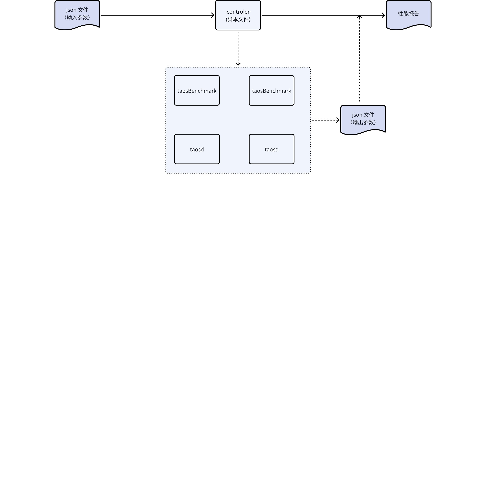

# 数据订阅性能测试 RS

## 1. 引言

### 1.1 术语与缩写名词

1. throughput：                     吞吐量
2. latency：                            延迟    
3. taosbenchmark                  TDengine 性能测试工具
4. consume                             数据订阅里的消费数据
5. produce                               数据订阅里的生成数据，TDengine 里写数据的操作

### 1.2 相关文档

<mention-doc token="WgdrwlVFQidX59kQdECcUJt5nyd" type="wiki">如何评判数据订阅的性能？——抓住关键，简化问题</mention-doc>
JIRA: [TS-6025](https://jira.taosdata.com:18080/browse/TS-6025)
JIRA: [TS-6121](https://jira.taosdata.com:18080/browse/TS-6121)

## 2. 优先级要求

期望排在 20250630 版本里开发完成。

## 3. 变更历史

| 日期 | 版本 | 负责人 | 主要修改内容 |
| --- | --- | --- | --- |
| 2025/02/26 | 0.1 | 王明明 | 首次编写 |
| 2025/02/28 | 0.2 | 王明明 | 补充输入参数，细化测试场景报告 |

## 4. 当前问题

1. 数据订阅功能没有完善的性能测试框架。
2. 没有基准的性能测试报告。
3. 目前都是针对每个用户需求，单独测试得到结论，导致效率低下。
4. 没有性能报告，导致数据订阅在某些情况下潜在的性能问题被隐藏。

## 5. 需求目标

针对上面的问题，期望通过本需求，可以达成以下目标。
1. 自动定时输出基准性能测试报告，通过集成到 github workflow 里实现，也有利于通过版本对比，及时发现性能问题。
2. 通过修改参数可以快速为特定用户场景生成类似的性能测试报告。
3. 性能测试报告以图标的形式输出，便于查看，同时输出资源占用图表。
4. 建立完整的数据订阅性能测试框架。

## 6. 性能指标

最终性能指标有两个主要指标和资源占用参考指标。

### 6.1 主要指标

1. 吞吐量（throughput）
2. 延迟    （latency）

### 6.2 资源占用参考指标

1. Cpu
2. Memory
3. Disk
4. Network (如果需要，非单机情况）

## 7. 性能需求

### 7.1 框架流程

基本的性能框架流程如下图：


1. 控制中心根据给出的输入参数（json 形式，如下），调度 taosBenchmark 和 taosd 进行测试，taosBenchmark 会输出测试结果（json 形式，如下），控制中心根据输出结果以图表的形式生成测试报告
2. 控制中心通过脚本来实现，然后集成到 github workflow 一键自动运行。
3. 控制中心主要负责，根据输入参数，部署集群，启动 taosBenchmark 进行写入，启动一个或多个 taosBenchmark 进行消费。
4. taosBenchmark 支持基础的写入，订阅性能测试，对于多消费者组并发，多节点集群，同时写入订阅的场景，控制中心来实现。

### 7.2 输入输出

#### 7.2.1 参数说明

1. 输入参数主要包括写入消费的控制参数，以及模式，可以通过修改输入参数得到相应的性能结果。
2. 输出结果包含整个测试过程（开始，平稳，结束）吞吐量和延迟与时间的关系，同时需要输出资源占用图表。

#### 7.2.2 输入参数

throughput_unit：                     吞吐量单位，固定MB/s，其他无效
        latency_unit：                            延迟单位，固定 ms，其他无效
        latency_type：                           延迟类型，可选值（produce/consume/end-to-end），其他无效     
        insert_sub_mode：                   写入订阅模式，可选值（simultaneous/sequential），其他无效。表示同时写入                                                              订阅还是写入完再订阅**。** 
        dnode_num:                               节点个数，用于创建集群。大于0
        data_info:                                   用于创建数据
        vgroups:                                       db 的 vgroups 数量（同taosBenchmark参数），大于0
        childtable_count：                     子表的数量（同taosBenchmark参数），用于控制数据规模，大于0
        each_table_insert_rows：        每个子表的数据量（同taosBenchmark参数），用于控制数据规模，大于0   
        interlace_rows:                           交叉写入的条数（同taosBenchmark参数），大于0，大部分用户情况 = 1
        row_size：                                   每行数据的大小，可通过 schema 来实现，用于控制数据规模，大于0      
        auto_create_table：                每次写入是否是自动建表写入（同taosBenchmark参数），影响写入订阅性能
        insert_mode：                            写入模式（同taosBenchmark参数）
        num_of_records_per_req：      每批次写入数据的条数 （同taosBenchmark参数）
subscribe_info：                          数据订阅相关参数，可以配置多个topic，每个topic 多个consumer_group
consumers：                                一个消费者组里消费者的数量，大于0
       
```java
{
  "throughput_unit": "MB/s",
  "latency_unit": "ms",
  "latency_type": "end-to-end",
  "insert_sub_mode":"simultaneous",
  "dnode_num": 3,
  "data_info":[
      {
          "db_name":"test",
          "stable_name":"stb1",
          "replica":1,
          "vgroups":16,
          "childtable_count":100000,
          "each_table_insert_rows": 1000,
          "interlace_rows": 1,
          "row_size": 10000,
          "auto_create_table": "yes",
          "insert_mode": "taosc",
          "num_of_records_per_req": 10
      },
      {
          "db_name":"test",
          "stable_name":"stb2",
          "replica":3,
          "vgroups":16,
          "childtable_count":100000,
          "each_table_insert_rows": 1000,
          "interlace_rows": 1,
          "row_size": 10000,
          "auto_create_table": "yes",
          "insert_mode": "taosc",
          "num_of_records_per_req": 10
      }
  ],
  "subscribe_info": [
      {
          "topic":"create topic t1 as select * from test.stb1",
          "consume_info":[
              {
                  "consumer_group":"g1",
                  "consumers":8
              },
              {
                  "consumer_group":"g2",
                  "consumers":4
              }
          ]
      },
      {
          "topic":"create topic t2 as database test",
          "consume_info":[
              {
                  "consumer_group":"g1",
                  "consumers":32
              },
              {
                  "consumer_group":"g2",
                  "consumers":16
              }
          ]
      }
  ],
 }
```

#### 7.2.3 输出参数

throughput_name： 吞吐量图表名字
        latency_name：        延迟图表的名字
        meters :  生成图表需要的数据，是个数组，根据数据生成一条曲线
          time： 时间
                  data：当前时间的参数
                              throughput : 吞吐量
                              latency :        延迟，分别对应 p50/p90/p99 三种情况      
```java
{
  "throughput_name": "Throughput (MB/s)",
  "latency_name": "End-to-End Latency (ms)",
  "meters":[
      {
          "time": 18989889000,
          "data": {
              "throughput":1,
              "latency":[
                  {   
                      "name":"p50",
                      "latency": 3
                  },
                  {   
                      "name":"p90",
                      "latency": 7
                  },
                  {   
                      "name":"p99",
                      "latency": 9
                  }
              ]
          }
      },
      {
          "time": 18989889001,
          "data": {
              "throughput":5,
              "latency":[
                  {   
                      "name":"p50",
                      "latency": 4
                  },
                  {   
                      "name":"p90",
                      "latency": 7
                  },
                  {   
                      "name":"p99",
                      "latency": 10
                  }
              ]
          }
      },
      {
          "time": 18989889002,
          "data": {
              "throughput":10,
              "latency":[
                  {   
                      "name":"p50",
                      "latency": 3
                  },
                  {   
                      "name":"p90",
                      "latency": 7
                  },
                  {   
                      "name":"p99",
                      "latency": 9
                  }
              ]
          }
      },
      {
          "time": 18989889003,
          "data": {
              "throughput":10,
              "latency":[
                  {   
                      "name":"p50",
                      "latency": 3
                  },
                  {   
                      "name":"p90",
                      "latency": 6
                  },
                  {   
                      "name":"p99",
                      "latency": 10
                  }
              ]
          }
      },
      {
          "time": 18989889004,
          "data": {
              "throughput":2,
              "latency":[
                  {   
                      "name":"p50",
                      "latency": 4
                  },
                  {   
                      "name":"p90",
                      "latency": 5
                  },
                  {   
                      "name":"p99",
                      "latency": 7
                  }
              ]
          }
      }
  ]
}
```

## 8. 测试报告模板

参考：https://www.taosdata.com/iot-performance-comparison-influxdb-and-timescaledb-vs-tdengine
测试报告需给出每个场景的测试结果图，以及控制单个关键参数变化时的对比图。

### 8.1 期望测试场景

1. 场景一：写入订阅同时进行，一个 topic，一个 consumer_group，其他参数待定
2. 场景二：写入订阅分开，单独测试订阅性能，一个 topic，一个 consumer_group，其他参数待定
3. 场景三：写入订阅分开，一个 topic，一个 consumer_group，topic 类型的 query。   
4. 场景四：写入订阅分开，一个 topic，一个 consumer_group，topic 类型的 db。
5. 场景四：写入订阅分开，一个 topic，多个 consumer_group，topic 类型的 db。
6. 其他场景： 多节点多副本测试（可以不放在基础测试里，根据用户需求测试）

### 8.2 单场景的测试结果

对于每个场景，给出数据参数说明和对应的结果图（类似如下）
<image token="Xhidbl8XkoSpxExSiACcYaBFnmh" width="1200" height="600" align="center"/>

<image token="DzoPbRCtfohD6nxsz4ScBlFunrH" width="1200" height="600" align="center"/>


<image token="WwXZb7lR6o9NX3xJrM7ctYu7nVe" width="2302" height="1516" align="center"/>

<image token="PZ0DbXWUboIlDoxKLzdc0t3Lngf" width="2302" height="1516" align="center"/>

<image token="ErdnbwgfsoYh5JxPNK0cJh03nib" width="2302" height="1516" align="center"/>

### 8.3 场景对比

    控制单个关键参数变化时的对比图（比如 consumer 个数）
<image token="OzJObjqiPof7SfxTDLmcFgJCn0f" width="2302" height="1516" align="center"/>

## 9. 性能指标分析

参考 ChatGPT 和 DeepSeek，分析如下

### 9.1 性能指标

1. 吞吐量 （rows/s 或者 bytes/s)
2. 延迟   (p50 p90 p99)
   - (end-to-end) 从开始写入到订阅出来
   - (produce) 写入延迟
   - (consume) 消费延迟

### 9.2 影响性能的因素

1. 水平扩展
   - 一个 topic，一个消费者组 （Vgroups 数量 / Consumer 数量）
   - 一个 topic，多个消费者组
   - 多个 topic，多个消费者组
2. 垂直扩展（固定资源情况下测试性能）
   - Cpu 
   - 内存
   - 网络
   - 磁盘
3. 持久化、容错性（由集群决定）
4. 写入订阅模式 
   - 写入完数据再订阅
   - 边写入边订阅 （资源受限情况下，写入会影响订阅性能）
5. 写入数据方式 （非常影响数据订阅的性能，因为决定消费时是否可以合并多条数据，建议采用最快的 stmt 方式写入）
   - 交叉写入 （真实用户基本都是这种写入方式）
   - 写入
6. 写入数据行长度 （非常影响写入订阅的性能）
   - 100字节
   - 1k 字节
   - 10k 字节  （这种情况单行数据量太大，性能可能很慢）
7. Topic 类型 
   - Query （这种topic，需要做数据过滤，不是标准数据订阅的情况，性能不确定）
   - Db  （这种topic，和标准的数据订阅类似，建议测试这种情况）
   - stable （这种topic，如果一个db里很多 stable，也会做数据过滤，性能不确定）
8. Vgroup 数量 （vgroup 数据影响数据水平分布）
   - 4
   - 8
   - 16
   - 32
9. Consumer 数量 （同一个消费组里，consumer 平均分配消费vgroup，多个consumer 用于水平扩展消费，超过vgroup 数据的consumer 不消费数据）
   - 和 vgroup 数量相同
   - 1/2 vgroup数量
   - 1/4 vgroup 数量
   - 1/8 vgroup 数量
10. 吞吐量计算：
   - taosBenchmark 固定每次写入数据的条数，最后通过 消费消息速度*条数 计算
11. 延迟计算
   - 需要开发 

## 10. 参考文档

### 10.1 ChatGPT:

<image token="W2qEbtNJpoWZ6dxCDiRcGt9tn0c" width="1496" height="1370" align="center"/>

<image token="LbZBbi4WfoMHhixocSqc3jeZnKb" width="1508" height="1226" align="center"/>

### 10.2 DeepSeek

<image token="D8KObyCZ9oGVuuxETwPcapTdnag" width="956" height="956"/>

<image token="GA8DbnHXToCXQSxnJoqcIO6Hnvb" width="915" height="1026"/>

### 10.3 画图python 代码

```java
import json
import matplotlib.pyplot as plt
from datetime import datetime

## 11. 假设 JSON 数据存储在一个字符串中

json_data = '''
{
  "throughput_name": "Throughput (MB/s)",
  "latency_name": "End-to-End Latency (ms)",
  "meters": [
      {
          "time": 18989889000,
          "data": {
              "throughput": 10,
              "latency": [
                  { "name": "p50", "latency": 10 },
                  { "name": "p90", "latency": 20 },
                  { "name": "p99", "latency": 40 }
              ]
          }
      },
      {
          "time": 18989889001,
          "data": {
              "throughput": 13,
              "latency": [
                  { "name": "p50", "latency": 10 },
                  { "name": "p90", "latency": 22 },
                  { "name": "p99", "latency": 41 }
              ]
          }
      },
      {
          "time": 18989889002,
          "data": {
              "throughput": 15,
              "latency": [
                  { "name": "p50", "latency": 11 },
                  { "name": "p90", "latency": 21 },
                  { "name": "p99", "latency": 40 }
              ]
          }
      },
      {
          "time": 18989889003,
          "data": {
              "throughput": 16,
              "latency": [
                  { "name": "p50", "latency": 10 },
                  { "name": "p90", "latency": 21 },
                  { "name": "p99", "latency": 41 }
              ]
          }
      },
      {
          "time": 18989889004,
          "data": {
              "throughput": 16,
              "latency": [
                  { "name": "p50", "latency": 10 },
                  { "name": "p90", "latency": 20 },
                  { "name": "p99", "latency": 40 }
              ]
          }
      },
      {
          "time": 18989889005,
          "data": {
              "throughput": 16,
              "latency": [
                  { "name": "p50", "latency": 11 },
                  { "name": "p90", "latency": 20 },
                  { "name": "p99", "latency": 42 }
              ]
          }
      },
      {
          "time": 18989889006,
          "data": {
              "throughput": 14,
              "latency": [
                  { "name": "p50", "latency": 10 },
                  { "name": "p90", "latency": 21 },
                  { "name": "p99", "latency": 41 }
              ]
          }
      },
       {
          "time": 18989889007,
          "data": {
              "throughput": 11,
              "latency": [
                  { "name": "p50", "latency": 10 },
                  { "name": "p90", "latency": 19 },
                  { "name": "p99", "latency": 40 }
              ]
          }
      }
  ]
}
'''

## 12. 解析 JSON 数据

data = json.loads(json_data)

## 13. 提取时间戳、吞吐量和不同百分位的延迟

times = []
throughputs = []
p50_latencies = []
p90_latencies = []
p99_latencies = []

for entry in data['meters']:
    times.append(entry['time'])
    throughputs.append(entry['data']['throughput'])
    for latency_entry in entry['data']['latency']:
        if latency_entry['name'] == 'p50':
            p50_latencies.append(latency_entry['latency'])
        elif latency_entry['name'] == 'p90':
            p90_latencies.append(latency_entry['latency'])
        elif latency_entry['name'] == 'p99':
            p99_latencies.append(latency_entry['latency'])

## 14. 转换时间戳为小时和分钟

time_strings = [datetime.fromtimestamp(t).strftime('%M:%S') for t in times]


## 15. 绘制吞吐量随时间的变化图

plt.figure(figsize=(12, 6))
plt.plot(time_strings, throughputs, marker='o', linestyle='-', label='Throughput')
plt.title('Throughput (MB/s)')
plt.xlabel('time')
plt.ylabel('MB/s')
plt.ylim(0, 30)  # 自定义 y 轴范
plt.legend()
plt.grid(False)
plt.show()

## 16. 绘制 p50, p90, p99 延迟随时间的变化图

plt.figure(figsize=(12, 6))
plt.plot(time_strings, p50_latencies, marker='o', linestyle='-', label='p50')
plt.plot(time_strings, p90_latencies, marker='x', linestyle='-', label='p90')
plt.plot(time_strings, p99_latencies, marker='^', linestyle='-', label='p99')
plt.title('End-to-End Latency (ms)')
plt.xlabel('time')
plt.ylabel('ms')
plt.ylim(0, 60)  # 自定义 y 轴范
plt.legend()
plt.grid(False)
plt.show()
```

### 16.1 OpenMessaging Benchmark Framework（OMB）测试框架参考：

https://weibo.com/ttarticle/p/show?id=2309404552363951391301
