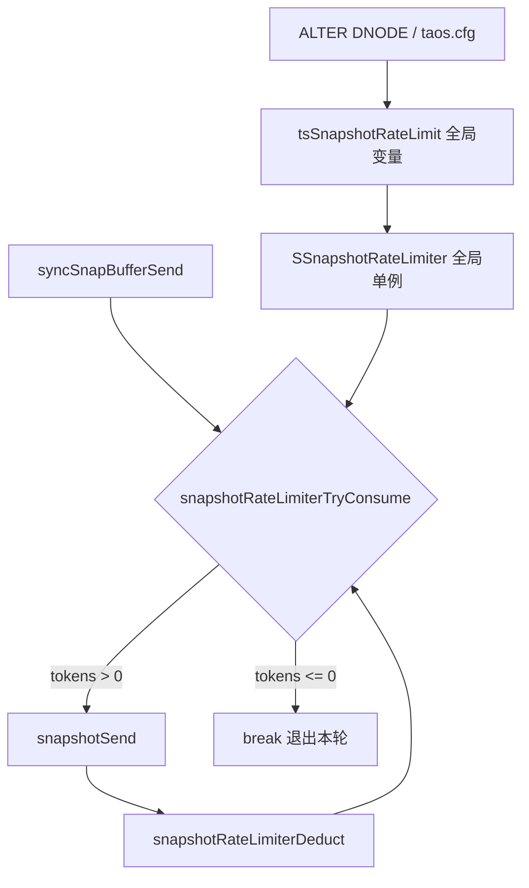
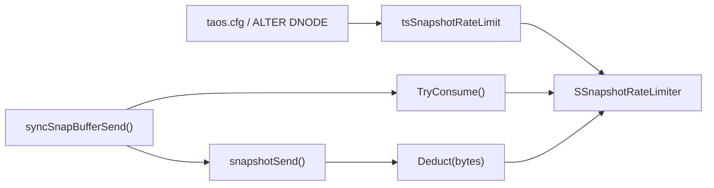
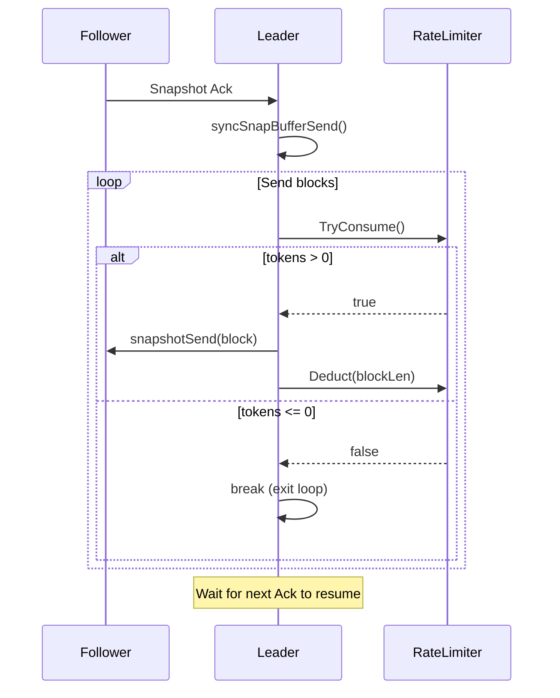

# Snapshot 限速功能 DS

## 1. 修订记录

| 编写日期 | 发布日期 | 版本 | 修订人 | 主要修改内容 |
| --- | --- | --- | --- | --- |
| 2026-05-14 |2026-05-26 | 1.0 | - | 初稿 |

## 2. 引言

1. **目的**：详细描述 Snapshot 限速功能的技术实现方案，为开发和代码评审提供参考。
2. **范围**：涵盖令牌桶限速器的数据结构设计、API 接口、生命周期管理及发送路径集成。
3. **受众**：sync 模块开发人员、代码评审人员、测试人员。

## 3. 术语

| 术语 | 定义 |
|------|------|
| Token Bucket | 令牌桶算法，按固定速率产生令牌，消费时扣减令牌，令牌耗尽则限速 |
| syncSnapBufferSend | sync 模块中快照发送的核心函数，leader 收到 follower ack 后触发 |
| snapshotSend | 发送单个快照 block 的函数 |
| snapshotReSend | 快照重传函数，用于丢包恢复 |

## 4. 概述

### 4.1 架构



限速器作为 sync 模块的全局单例，位于 dnode 进程级别。所有 vgroup 的 leader 在发送快照时共享同一个限速器实例。

### 4.2 技术

- 语言：C
- 算法：Token Bucket（令牌桶），非阻塞模式
- 同步原语：`TdThreadMutex`（pthread_mutex 封装）

### 4.3 依赖项

- `community/source/libs/sync/` — sync 模块
- `community/include/common/tglobal.h` — 全局配置变量
- `community/source/common/src/tglobal.c` — 配置注册与动态更新

## 5. 设计考虑

### 5.1 假设和限制

- 假设快照发送的 block 大小不固定，限速精度为 block 粒度
- 假设 `tsSnapshotRateLimit` 的读取是原子的（int32_t 在主流平台上读取为原子操作）
- 限速器实例全局唯一，所有 vgroup 共享

### 5.2 设计模式和原则

- **全局单例**：一个 dnode 进程内只有一个 `SSnapshotRateLimiter` 实例
- **非阻塞**：sync 线程不能因等待令牌而阻塞，否则影响 Raft 消息处理
- **惰性填充**：不使用定时器线程，而是在每次消费调用时根据时间差补充令牌
- **后置扣减**：先发送再扣减，因为 block 大小需要发送后才知道

### 5.3 风险和缓解措施

| 风险 | 缓解措施 |
|------|---------|
| 多线程并发访问令牌 | 使用 mutex 保护令牌状态 |
| 长时间无快照后突发大量令牌 | 令牌上限为 1 秒配额，防止 burst |
| 限速导致快照复制超时 | 限速不阻塞，只控制速度；快照协议有超时重试机制 |

## 6. 详细设计

### 6.1 组件设计

#### 6.1.1 配置参数注册

在 `tglobal.c` 中注册新参数：

```c
// 声明
extern int32_t tsSnapshotRateLimit;

// 定义
int32_t tsSnapshotRateLimit = 0;

// 注册
cfgAddInt32(pCfg, "snapshotRateLimit", tsSnapshotRateLimit, 0, 10240, CFG_SCOPE_SERVER, CFG_DYN_SERVER);

// 动态更新（taosCfgDynamicOptionsForServer）
if (strcasecmp(name, "snapshotRateLimit") == 0) {
    tsSnapshotRateLimit = cfgGetItem(pCfg, "snapshotRateLimit")->i32;
}
```

#### 6.1.2 令牌桶限速器

```c
typedef struct SSnapshotRateLimiter {
  TdThreadMutex mutex;       // 保护令牌状态的互斥锁
  int64_t       tokens;      // 当前可用令牌（字节）
  int64_t       lastFillMs;  // 上次令牌填充时间戳（毫秒）
} SSnapshotRateLimiter;
```

#### 6.1.3 发送路径集成

在 `syncSnapBufferSend()` 的发送循环中插入限速检查：

```c
while (pSender->seq != SYNC_SNAPSHOT_SEQ_END &&
       pSender->seq - pSndBuf->start < tsSnapReplMaxWaitN) {
    if (!snapshotRateLimiterTryConsume()) {
      break;  // 令牌耗尽，退出本轮发送
    }
    if ((code = snapshotSend(pSender)) != 0) {
      goto _out;
    }
    snapshotRateLimiterDeduct(lastSentBlockLen);
}
```

### 6.2 关键数据结构

| 结构体 | 说明 | 生命周期 |
|--------|------|---------|
| `SSnapshotRateLimiter` | 全局令牌桶实例 | `syncInit()` 创建，`syncCleanUp()` 销毁 |

### 6.3 数据库设计

不适用。本功能不涉及数据持久化。

### 6.4 设计图

#### 数据流图



#### 消息序列图



#### 流程图 — TryConsume

```mermaid
flowchart TD
    Start[TryConsume 调用] --> CheckRate{tsSnapshotRateLimit == 0?}
    CheckRate -->|是| ReturnTrue[return true]
    CheckRate -->|否| Lock[加锁 mutex]
    Lock --> CalcElapsed[计算 elapsed = now - lastFillMs]
    CalcElapsed --> Refill[refill = elapsed * rate * 1024 * 1024 / 1000]
    Refill --> AddTokens[tokens = min(tokens + refill, rate * 1MB)]
    AddTokens --> UpdateTime[lastFillMs = now]
    UpdateTime --> CheckTokens{tokens > 0?}
    CheckTokens -->|是| Unlock1[解锁] --> ReturnTrue2[return true]
    CheckTokens -->|否| Unlock2[解锁] --> ReturnFalse[return false]
```

## 7. 接口规范

### 7.1 API 文档

#### 初始化/销毁

```c
// 创建全局限速器实例（在 syncInit 中调用）
int32_t snapshotRateLimiterInit(void);

// 销毁全局限速器实例（在 syncCleanUp 中调用）
void snapshotRateLimiterCleanUp(void);
```

#### 运行时接口

```c
// 尝试消费令牌。填充令牌后检查是否有余量。
// 返回 true：允许发送；返回 false：令牌不足，应退出本轮发送
bool snapshotRateLimiterTryConsume(void);

// 扣减已发送的字节数。发送后调用。
// bytes: 本次发送的 block 字节数
void snapshotRateLimiterDeduct(int32_t bytes);
```

### 7.2 用户界面

不适用。本功能通过 SQL 命令 `ALTER DNODE` 配置，无 UI 变更。

## 8. 安全考虑

- `ALTER DNODE` 操作需要管理员权限，非管理员无法修改限速参数
- 限速器内部使用 mutex 保护共享状态，无竞态条件风险
- 不涉及敏感数据处理

## 9. 性能和可扩展性

### 9.1 性能要求

- 不限速时（默认）：零额外开销，`TryConsume` 直接判断全局变量后返回
- 限速时：每次发送增加一次 mutex lock/unlock 和时间戳获取，开销可忽略（纳秒级）

### 9.2 可扩展性

- 当前为 per-dnode 限速，足够满足需求
- 如果未来需要 per-vgroup 限速，可扩展为每个 vgroup 一个限速器实例
- 如果需要集群级限速，需引入 mnode 协调机制（当前不在范围内）

## 10. 部署和配置

### 10.1 部署流程

无特殊部署步骤。功能随 TDengine 服务端升级自动可用。

### 10.2 配置管理

- 配置文件方式：在 `taos.cfg` 中添加 `snapshotRateLimit 50`
- 动态修改：`ALTER DNODE <id> 'snapshotRateLimit' '<value>'`
- 动态修改立即生效，无需重启

### 10.3 版本控制

- 向后兼容：默认值 0 保持旧行为
- 升级无需特殊处理
- 回滚：降级后参数被忽略，无副作用

## 11. 监控和维护

### 11.1 监控

当前版本不暴露监控指标。未来可考虑通过 `SHOW DNODE VARIABLES` 查看当前限速值。

### 11.2 日志记录和诊断

- 首次触发限速时输出 `sInfo` 级别日志：`"snapshot rate limited, current rate: %d MB/s"`
- 不逐 block 记录，避免日志洪泛
- 诊断方法：检查日志中是否出现限速提示，结合 IO 监控判断限速效果

### 11.3 维护

- 无定期维护需求
- 参数调整通过 `ALTER DNODE` 随时进行

## 12. 参考资料

1. [Snapshot Rate Limit Design](./2026-05-14-snapshot-rate-limit-design.md) — 原始设计文档
2. [概要设计说明书](./snapshot-rate-limit-概要设计说明书.md) — 功能规格说明

---

## 附录：涉及文件变更清单

| 文件 | 变更内容 |
|------|---------|
| `community/include/common/tglobal.h` | 声明 `tsSnapshotRateLimit` |
| `community/source/common/src/tglobal.c` | 定义、注册、获取、动态更新 |
| `community/source/libs/sync/inc/syncSnapshot.h` | `SSnapshotRateLimiter` 结构体及函数声明 |
| `community/source/libs/sync/src/syncSnapshot.c` | 令牌桶实现 + 发送循环集成 |
| `community/source/libs/sync/src/syncMain.c` | 在 `syncInit()` / `syncCleanUp()` 中创建/销毁限速器 |
