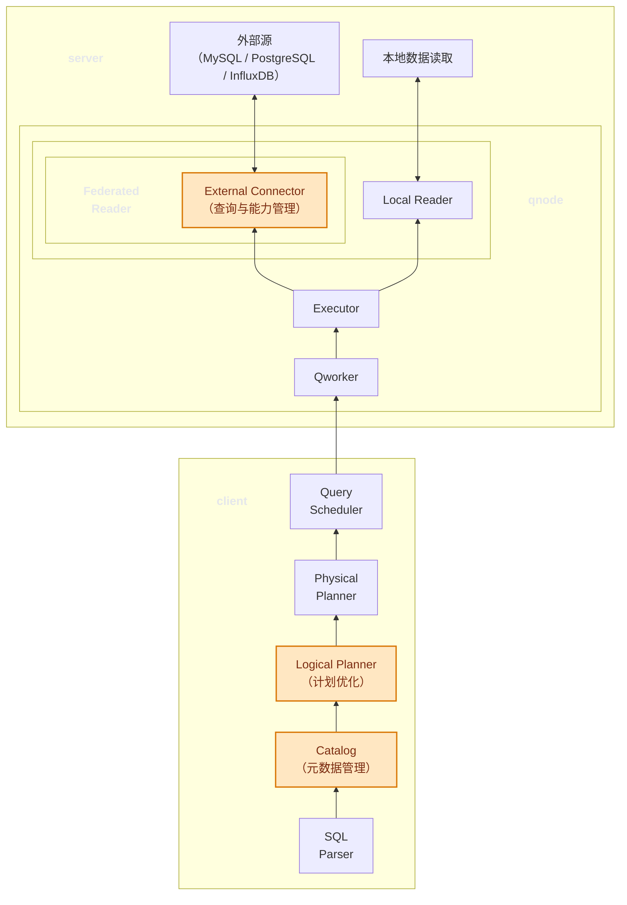

# TDengine 支持联邦查询

# 修订记录

| 编写日期 | 发布日期 | 版本 | 修订人 | 主要修改内容 |
| --- | --- | --- | --- | --- |
| 2026-04-07 | 2026-04-07 | 0.1 | wpan | 初稿 |
| 2026-04-10 | 2026-04-10 | 0.2 | — | 合入虚拟表设计（§5.5） |
| 2026-04-13 | 2026-04-13 | 1.0 | Simon Guan | 评审后发布 |

# 1 引言

## 1.1 目的

本文档给出 TDengine 支持联邦查询（Federated Query）的详细实现设计，目标是：

- 支持 FS 文档中描述的所有功能；
- 定义 TDengine 联邦查询功能的实现架构、设计原则、组件、流程、接口等；
- 定义虚拟表通过外部列引用访问外部数据源的完整设计。

## 1.2 范围

本文覆盖以下内容：

- 架构设计。
- 设计模式与原则。
- 组件设计。
- 流程设计。
- 接口与关键数据结构。

## 1.3 受众

- TSDB 内核研发。
- 其它感兴趣的人员。

# 2 术语

- 联邦查询（Federated Query）：查询执行期按需访问外部源并与本地计算链路融合。
- 外部数据源（External Source）：承载连接信息、命名空间默认值。
- 外部连接器（External Connector）：外部源适配器类型实现（SPI 插件）。
- 外部连接（External Connection）：某个外部源实例的访问配置（地址、认证、超时等）。
- 外部源能力（External Capability）：外部源数据库具备的处理能力。

# 3 概述

## 3.1 架构

整个联邦查询依然延用目前的 TSDB 架构与查询流程，需要增加的功能主要包括：
- 外部数据源的注册与管理（client、mnode）；
- 外部数据源的查询与能力管理（连接器模块）；
- 外部对象的元数据缓存与管理（Catalog 模块）；
- 联邦查询的计划优化（client）；
- 虚拟表外部列引用（SColRef 扩展 + FederatedScan 算子作为 VirtualTableScan 下游，详见 §5.5）。

主要的功能承载节点依然是目前 TSDB 中已经存在的 client、mnode、vnode、qnode，不新增节点。

### 3.1.1 查询流程示意图



注：图中橙色节点表示重点修改模块，包括 Catalog、Logical Planner 和 External Connector。

## 3.2 技术

- C 语言内核模块：Parser、Catalog、Planner、Executor、Scheduler、Qworker。
- External Connector 模块：使用第三方库官方提供的客户端库。

## 3.3 依赖项

- 现有 TDengine 查询引擎模块（Planner / Executor / Catalog / Scheduler / Qworker）。
- 外部数据库驱动或协议客户端：

| 数据库 | 客户端库名称 | 版本范围 | 协议 | 备注 |
|---|---|---|---|---|
| MySQL | mysql-connector-c / libmysqlclient | 5.7+ / 8.0+ | TCP/SSL | C 语言原生驱动，支持连接池 |
| PostgreSQL | libpq | 9.6+ | TCP/SSL | PostgreSQL 官方客户端库，POSIX/Windows 兼容 |
| InfluxDB | HTTP API 客户端 / Apache Arrow Flight | v3.x+ | HTTP/gRPC | 推荐使用 Flight SQL 获得更好性能 |
| TDengine | libtaos | 3.x+ | TCP/TLS | 预留（详见 FS 文档） |

# 4 设计考虑

## 4.1 假设和限制

- 外部源中参与查询的表必须有且只有一个可转换为 TDengine timestamp 类型的主键列。


## 4.2 设计模式和原则

- Provider 模式：Catalog 中按照 local/external provider 进行分开管理。
- Strategy 模式：不同 External Connector 采用统一 SPI，不同实现策略。
- Pipeline 模式：External Connector 统一输出 `SSDataBlock` 后复用上层 operator。
- Correctness First：正确性优先于性能，性能优化失败时回退到底线模式。

## 4.3 风险和缓解措施

| 风险 | 描述 | 缓解措施 |
| --- | --- | --- |
| 语义不一致 | 源端函数或类型语义与 TDengine 不一致 | 下推白名单 + explain 原因 + 本地 fallback |
| 元数据漂移 | 外部 schema 变更导致映射失效 | 缓存 TTL + REFRESH + 运行时 mismatch 检测 |
| 性能抖动 | 外部网络波动和慢查询影响整体时延 | 连接超时、并发阈值、重试上限 |
| 密码泄漏 | 连接信息暴露到日志/系统表 | mnode 加密存储 + 展示脱敏 + 日志屏蔽 |
| 多节点不一致 | 节点间 External Connector 能力或版本不一致 | 启动期校验 + 能力版本上报 + 调度约束 |

# 5 详细设计

## 5.1 节点功能划分

- Mnode 负责所有外部源的持久化与管理功能。
- vnode/qnode 负责查询执行层的所有功能，当查询涉及某个 TSDB 库的 vnode 时（例如虚拟表场景）优先使用 vnode，否则优先使用 qnode。
- 客户端负责外部源元数据缓存（Catalog）、计划优化以及调度执行工作。

## 5.2 模块功能划分

### 5.2.1 Parser 模块

职责：

- 解析外部源操作 SQL 语句并转换为 Mnode 消息处理。
- 解析联邦查询语句，对于其中的外部路径表达式，按 `TYPE` 固定规则映射到目标库的命名空间层级。
- 将外部对象引用转换为统一语法树节点。
- 根据需要调用 Catalog 接口获取外部表原始元数据、能力画像；
- 按照类型映射规则将外部列类型映射为 TDengine 内部类型——不可映射的类型在此阶段即报错拒绝。
- 执行时间戳主键约束校验（详见§4.1），视图豁免此约束。
- 其他外部源不支持的功能校验与拦截。

关键约束：

- Parser 是联邦查询唯一的合法性门槛——所有语义不合法的查询必须在此阶段拦截，不流入 Planner 阶段。
- 语法合法但语义不可解析时，返回明确错误码。

### 5.2.2 Catalog 模块

职责：

- 缓存 External Source 对象信息及能力画像。
- 缓存外部源原始元数据——按 source → db → schema（如有）→ table 层级管理，存储外部表原始元数据。
- 缓存外部源能力画像，在 source 层级下管理，提供接口支持能力画像的构建与更新流程。
- 提供提供缓存查询、更新、删除接口。
- 支持外部源可用性状态管理和更新，由运行时错误反馈驱动状态变更。

关键边界：

- Catalog 仅保存稳定或半稳定外部源元数据与能力摘要。
- 运行时错误仅更新可用性状态，不修改能力字段（详见 §5.3.10.1）。

实现说明：

- Catalog 内部元数据存储按照 external、local 两种模式分别存储。
- external 元数据按照 source、db、schema（如有）、table 层级管理。
- 缓存建立、存储、更新、删除功能沿用目前架构，更新策略保持不变（定时、强刷、版本比较、错误驱动）。
- 外部源能力缓存在 source 层级下面（详见 §5.3.10.1）。
- 外部源的元数据和能力信息由 Catalog 直接调用 External Connector 模块接口完成。

### 5.2.3 Planner 模块

职责：

- 为外部源对象查询生成逻辑与物理计划节点。
- 结合语句与外部源能力做性能优化决策，根据最终优化结果生成完整计划。

关键边界：

- 到达 Planner 意味着查询在语义上合法——Planner 仅做性能优化决策（下推 vs 本地执行），不再做合法性判断。
- 下推失败不得影响查询正确性——不可下推的算子保持为标准本地算子节点。
- Planner 不生成目标库 SQL——产出是物理计划（含远端子计划），SQL 生成在 Executor 阶段由 External Connector 完成。

### 5.2.4 Executor 模块

职责：

- 引入统一 federated reader 抽象，解耦 TSDB 内部与外部 reader，本地 reader 与 federated reader 按统一格式（`SSDataBlock`）输出 ，上层算子无需感知数据来源。
- 读取外部源扫描物理计划节点，将远端子计划（`pRemotePlan`）交 External Connector 执行并返回结果（详见 §5.3.10.2）。
- 不可下推的上层本地算子（Agg、Sort、Window、Fill、Interp 等）从 `SSDataBlock` 读取数据后在本地执行，复用现有算子实现。
- 负责下推执行失败时的错误分类：根据错误码分组判断错误类型（SQL 转换遗漏、连接失败、认证错误等），将错误返回 Qworker 由 Scheduler 和客户端统一处理。

### 5.2.5 Scheduler/Qworker 模块

职责：

- 沿用现有框架，调度与任务执行流程无差异。
- 联邦查询相关的额外行为：Qworker 捕获 Executor 返回的错误后停止当前 Task，将错误通过 RPC 返回 Scheduler；Scheduler 根据错误类型决定重试或终止或继续向上交由客户端处理。

### 5.2.6 External Connector 模块

职责：

- 支持外部源所有功能操作，包括：元数据获取、能力探测、查询执行、SQL 转换、结果转换等。
- **元数据获取**：从外部源拉取库/表/列元数据返回给 Catalog 缓存和管理。
- **能力探测**：执行轻量级 probe 验证外部源能力（详见 §5.3.10.1）。
- **SQL 生成**：遍历远端子计划（`pRemotePlan`），按目标库方言生成下推 SQL（详见 §5.3.3–§5.3.8）。
- **查询执行**：使用第三方库官方客户端向外部源发送 SQL 并接收结果集。
- **结果转换**：将外部源返回数据按 §5.3.2 类型映射规则转换为 `SSDataBlock` 内部列类型。
- **错误映射**：将外部源原始错误码封装为 TDengine 统一错误码族，保留远端原始错误信息（`remote_code`、`remote_sqlstate`、`remote_message`）供排障。
- 支持外部源连接池功能，能够自适应增删物理连接。

要求：

- 支持单节点内全局外部连接共享。
- 支持多线程操作。
- 采用第三方库的官方客户端实现功能。

实现说明：

- 模块既可以在算子内调用，也可以在 Catalog 内部调用。
- 模块需要在客户端与服务端分别完成模块初始化、销毁。
- 外部源连接通过句柄（`SExtConnectorHandle`）管理，句柄资源通过 tref 模块管理；
- 相同 `source_name` 的并发查询共享同一连接池。
- 所有公开接口线程安全，可被 Executor 多线程并发调用。
- 接口函数声明见§6.2 External Connector 接口。
- 关键数据结构定义见§6.2.6。


## 5.3 功能设计

> **术语约定**：本章按「支持能力」和「处理方式」两个维度对联邦查询中的每项功能进行分类，全文统一使用以下术语：
>
> | 支持能力 | 含义 | 对应处理方式 | 处理方式含义 |
> | --- | --- | --- | --- |
> | **可下推** | 该功能可交由外部数据源执行 | **直接下推** | 目标库存在语法和语义完全一致的表达，可直接写入下推 SQL |
> | | | **转换下推** | 目标库无相同语法，但可通过等价表达式或函数改写后下推 |
> | **不可下推** | 该功能无法在外部数据源执行，但 TDengine 本地引擎可完成 | **本地计算** | 从外部源拉取原始数据后，由 TDengine 在本地执行该功能 |
> | **不支持** | 该功能在联邦查询场景下无法执行 | **报错处理** | Parser 阶段拦截，返回错误码，查询不进入 Planner |
>
> **判读规则**：
> - 后续各节映射表中，每个功能在每个目标库下的标注均为上述四种处理方式之一。表头列名统一为「处理方式」。
> - 「可下推」的功能必须明确标注是「直接下推」还是「转换下推」（含转换细节）。
> - 当处理方式附带前置条件时，使用「处理方式（有条件）」标注，如「转换下推（有条件）」「直接下推（有条件）」，并在表格下方的「可下推条件 / 不可下推条件 / 不支持条件」中详细列出判断规则。
> - 「不可下推」≠「不支持」——不可下推仅影响性能（需拉取更多原始数据），不影响查询正确性；不支持则直接报错。
> - 「不支持」仅用于 TDengine 自身对外部表明确禁止的场景（§5.3.10.2），而非目标库能力不足。目标库能力不足时，对应功能为「不可下推」，走本地计算路径。

**重要约束**
- 联邦查询中生成远端投影数据查询时，通常应该对时间戳主键列应用 `ORDER BY` 以保证数据有序。

### 5.3.1 概念映射

本节将 MySQL、PostgreSQL、InfluxDB v3 的核心数据模型概念映射到 TDengine 概念体系，确保联邦查询在元数据获取和对象引用时有明确的转换关系。

#### 5.3.1.1 MySQL → TDengine

| MySQL 概念 | TDengine 映射 | 说明 |
| --- | --- | --- |
| 数据库（Database / Schema） | 数据库（Database） | 一一对应，作为命名空间 |
| 表（Table） | 普通表（Normal Table） | MySQL 表通过 External Connector 获取原始 schema 后，Catalog 以 `SExtTableMeta` 缓存，Parser 完成类型映射后在 TDengine 侧作为普通表使用 |
| 视图（View） | 普通表（Normal Table） | MySQL 视图以普通表结构表达；视图不受时间戳主键约束限制，其结果集中可以不包含时间戳列 |
| 列（Column） | 列（Column） | 一一对应，通过 `SSchema` 表达 |
| 时间戳类型主键列 | 时间戳主键（ts） | 外部表必须有且仅有一个可转换为 TDengine `TIMESTAMP` 类型的主键列，作为时间戳主键|
| 索引（Index） | 无映射 | 索引信息不导入 TDengine，仅影响外部源侧查询性能 |
| 存储过程 / 触发器 | 无映射 | 不参与联邦查询 |

#### 5.3.1.2 PostgreSQL → TDengine

| PostgreSQL 概念 | TDengine 映射 | 说明 |
| --- | --- | --- |
| 数据库（Database）+ 模式（Schema） | 数据库（Database） | PG 有两层命名空间；外部连接配置时需指定 database + schema，在 TDengine 侧映射为单一命名空间 |
| 表（Table） | 普通表（Normal Table） | PG 表以 `SExtTableMeta` 存储原始 schema，Parser 完成类型映射后作为普通表使用 |
| 视图（View） | 普通表（Normal Table） | PG 视图以普通表结构表达；视图不受时间戳主键约束限制 |
| 外部表（Foreign Table） | 普通表（Normal Table） | PG FDW 外部表同样以普通表结构表达 |
| 继承表（Inheritance） | 普通表（Normal Table） | PG 表继承仅在结构层面相似于超级表，映射时作为独立普通表处理 |
| 列（Column） | 列（Column） | 一一对应 |
| 时间戳类型列 | 时间戳主键（ts） | 同 MySQL，外部表必须有且仅有一个可转换为 `TIMESTAMP` 类型的主键列作为时间戳主键 |
| 索引 / 序列 / 触发器 | 无映射 | 不参与联邦查询 |

#### 5.3.1.3 InfluxDB v3 → TDengine

| InfluxDB v3 概念 | TDengine 映射 | 说明 |
| --- | --- | --- |
| Database | 数据库（Database） | 一一对应 |
| Measurement | 超级表（Super Table） | InfluxDB Measurement 按 Tag Set 自动分组形成多条时间线，与超级表按标签值区分子表的模型语义一致 |
| Tag | 标签（Tag） | InfluxDB Tag 直接映射为超级表的标签列，保留索引和分组语义 |
| Field | 列（Column） | InfluxDB Field 映射为超级表的数据列 |
| time 列 | 时间戳主键（ts） | InfluxDB 强制的 `time` 列自动映射为时间戳主键列 |
| Tag Set（时间线） | 子表（Child Table） | 每个唯一的 Tag 组合对应一张子表，与 InfluxDB 中按 Tag Set 区分时间线的模型一致 |
| Bucket / Retention Policy | 无映射 | 存储策略为 InfluxDB 内部概念，不影响联邦查询 |

#### 5.3.1.4 概念映射的影响

- **时间戳主键约束**：TDengine 要求每张表有且仅有一个时间戳主键列，因此外部源中参与联邦查询的表也必须有且仅有一个可转换为 TDengine `TIMESTAMP` 类型的主键列。
- **视图不受此约束限制**——视图的结果集中可以不包含时间戳类型列，此时该视图仅支持不依赖时间线的查询操作。
- **命名规范差异**：MySQL 标识符默认不区分大小写；PG 标识符默认折叠为小写（引号内保留原始大小写）；InfluxDB v3 标识符区分大小写。SQL 改写时需按目标库规则处理标识符引用。

### 5.3.2 类型映射

#### 5.3.2.1 类型映射规则

联邦查询执行期将外部源类型转换为 TDengine 内部类型。能降级转换的均支持，标注说明精度/语义损失；完全无法表达的标注"不支持"，translate 阶段报错 `TSDB_CODE_EXT_TYPE_MISMATCH`。

**MySQL → TDengine：**

| MySQL 类型 | TDengine 映射类型 | 说明 |
| --- | --- | --- |
| `TINYINT` | `TINYINT` | 精确对应 |
| `TINYINT UNSIGNED` | `TINYINT UNSIGNED` | 精确对应 |
| `SMALLINT` | `SMALLINT` | 精确对应 |
| `SMALLINT UNSIGNED` | `SMALLINT UNSIGNED` | 精确对应 |
| `MEDIUMINT` | `INT` | 值域 [-8388608, 8388607] ⊆ INT |
| `MEDIUMINT UNSIGNED` | `INT UNSIGNED` | 值域 [0, 16777215] ⊆ INT UNSIGNED |
| `INT` / `INTEGER` | `INT` | 精确对应 |
| `INT UNSIGNED` / `INTEGER UNSIGNED` | `INT UNSIGNED` | 精确对应 |
| `BIGINT` | `BIGINT` | 精确对应 |
| `BIGINT UNSIGNED` | `BIGINT UNSIGNED` | 精确对应 |
| `BIT(n)`（n≤64） | `BIGINT` | 位掩码语义丢失 |
| `BIT(n)`（n>64） | `VARBINARY` | 位语义丢失 |
| `YEAR` | `SMALLINT` | 值范围 1901–2155 |
| `BOOLEAN` / `BOOL` / `TINYINT(1)` | `BOOL` | 精确对应 |
| `FLOAT` | `FLOAT` | 精确对应 |
| `DOUBLE` / `DOUBLE PRECISION` / `REAL` | `DOUBLE` | 精确对应 |
| `DECIMAL` / `NUMERIC` | `DECIMAL(p,s)` | precision≤38 精确；超出截断并记录日志 |
| `DATE` | `TIMESTAMP` | 补零点 `00:00:00`，精度信息丢失，记录日志 |
| `DATETIME` / `DATETIME(n)` / `TIMESTAMP` | `TIMESTAMP` | 精确对应 |
| `TIME` | `BIGINT` | 存储午夜起的毫秒数（MySQL TIME 精度为毫秒），时间语义丢失，记录日志 |
| `CHAR`（ASCII） | `BINARY(n)` | 单字节字符集 |
| `CHAR`（多字节） | `NCHAR(n)` | utf8 / utf8mb4 字符集 |
| `NCHAR` / `NVARCHAR` | `NCHAR(n)` | 精确对应 |
| `VARCHAR`（ASCII） | `VARCHAR(n)` | 单字节字符集 |
| `VARCHAR`（多字节） | `NCHAR(n)` | utf8mb4 字符集 |
| `TINYTEXT` / `TEXT`（ASCII） | `VARCHAR(n)` | 按实际长度 |
| `TEXT`（多字节） / `MEDIUMTEXT` / `LONGTEXT` | `NCHAR(n)` | 按实际长度 |
| `BINARY(n)` | `BINARY(n)` | 精确对应 |
| `VARBINARY(n)` | `VARBINARY` | 精确对应 |
| `TINYBLOB` | `BINARY(n)` | ≤255B |
| `BLOB` | `VARBINARY` | ≤65535B |
| `MEDIUMBLOB` | `VARBINARY` | ≤16MB，超出 TDengine VARBINARY 上限时记录日志 |
| `LONGBLOB` | `BLOB` | TDengine BLOB 上限 4MB，超出报错 |
| `ENUM(...)` | `VARCHAR` / `NCHAR` | 枚举约束语义丢失 |
| `SET(...)` | `VARCHAR` / `NCHAR` | 序列化为逗号分隔字符串，集合约束语义丢失，记录日志 |
| `JSON` | `JSON`（Tag 列）/ `NCHAR`（普通列） | JSON 仅支持 Tag 列 |
| `GEOMETRY` / `POINT` / `LINESTRING` / `POLYGON` | `GEOMETRY` | 精确对应 |

**PostgreSQL → TDengine：**

| PostgreSQL 类型 | TDengine 映射类型 | 说明 |
| --- | --- | --- |
| `boolean` / `bool` | `BOOL` | 精确对应 |
| `smallint` / `int2` | `SMALLINT` | 精确对应 |
| `integer` / `int4` / `int` | `INT` | 精确对应 |
| `bigint` / `int8` | `BIGINT` | 精确对应 |
| `smallserial` | `SMALLINT` | 自增语义丢失 |
| `serial` / `serial4` | `INT` | 自增语义丢失 |
| `bigserial` / `serial8` | `BIGINT` | 自增语义丢失 |
| `real` / `float4` | `FLOAT` | 精确对应 |
| `double precision` / `float8` / `float` | `DOUBLE` | 精确对应 |
| `numeric` / `decimal` | `DECIMAL(p,s)` | precision≤38 精确；超出截断并记录日志 |
| `money` | `DECIMAL(18,2)` | 货币精度通常 2 位 |
| `char(n)` / `character(n)`（ASCII） | `BINARY(n)` | 单字节字符集 |
| `char(n)` / `character(n)`（UTF-8） | `NCHAR(n)` | UTF-8 字符集 |
| `varchar(n)` / `character varying`（ASCII） | `VARCHAR(n)` | |
| `varchar(n)` / `character varying`（UTF-8） | `NCHAR(n)` | |
| `text` | `NCHAR` | 按实际长度 |
| `bytea` | `VARBINARY` | 精确对应 |
| `timestamp` / `timestamp without time zone` | `TIMESTAMP` | 精确对应 |
| `timestamptz` / `timestamp with time zone` | `TIMESTAMP` | 丢弃时区信息，统一转换为 UTC 时区 |
| `date` | `TIMESTAMP` | 补零点 `00:00:00`，精度信息丢失，记录日志 |
| `time` / `timetz` | `BIGINT` | 存储午夜起的微秒数（PG time 精度为微秒，高于 MySQL TIME 的毫秒精度），时区信息丢失，记录日志 |
| `interval` | `BIGINT` | 存储微秒总量，区间语义丢失，记录日志 |
| `uuid` | `VARCHAR(36)` | UUID 标准字符串形式，约束语义丢失 |
| `json` / `jsonb` | `JSON`（Tag 列）/ `NCHAR`（普通列） | JSON 仅支持 Tag 列 |
| `xml` | `NCHAR` | XML 结构语义丢失 |
| `inet` / `cidr` / `macaddr` / `macaddr8` | `VARCHAR` | 地址语义丢失，按字面字符串存储 |
| `bit(n)` / `bit varying(n)` | `VARBINARY` | 位语义丢失 |
| `geometry` / `point` / `path` / `polygon`（PostGIS） | `GEOMETRY` | 需安装 PostGIS 扩展 |
| 用户自定义 `ENUM` | `VARCHAR` / `NCHAR` | 枚举约束语义丢失 |
| `hstore` | `VARCHAR` | key-value 文本形式，结构语义丢失 |
| `array` 类型（如 `integer[]`、`text[]`） | `NCHAR` / `VARCHAR` | JSON 序列化存储，数组结构语义丢失，记录日志 |
| `range` 类型（如 `int4range`、`tsrange`） | `VARCHAR` | 序列化为字符串（如 `[1,10)`），区间语义丢失，记录日志 |
| `tsvector` / `tsquery` | `VARCHAR` / `NCHAR` | 存储文本表示字符串，全文索引语义丢失，记录日志 |

**InfluxDB 3.x（Arrow 类型）→ TDengine：**

| InfluxDB 3.x 类型 | TDengine 映射类型 | 说明 |
| --- | --- | --- |
| `Timestamp` | `TIMESTAMP` | 精确对应，纳秒精度 |
| `Int64` | `BIGINT` | 精确对应 |
| `UInt64` | `BIGINT UNSIGNED` | 精确对应 |
| `Float64` | `DOUBLE` | 精确对应 |
| `Utf8` / `LargeUtf8`（string） | `NCHAR` / `VARCHAR` | 按实际长度 |
| `Boolean` | `BOOL` | 精确对应 |
| `Binary` / `LargeBinary`（bytes） | `VARBINARY` | 精确对应 |
| `Decimal128` | `DECIMAL(p,s)`（p≤38） | precision>38 时截断，记录日志 |
| `Decimal256` | `DECIMAL(38,s)` | 截断并记录日志 |
| `Dictionary` | `VARCHAR` / `NCHAR` | 枚举约束语义丢失 |
| `Date32` / `Date64` | `TIMESTAMP` | 补零点 `00:00:00`，时间精度信息丢失，记录日志 |
| `Time32` / `Time64` | `BIGINT` | 存储午夜起的毫秒/微秒数，时间语义丢失，记录日志 |
| `Duration` / `Interval` | `BIGINT` | 存储纳秒总量，区间语义丢失，记录日志 |
| `List` / `LargeList` | `NCHAR` / `VARCHAR` | JSON 序列化存储，数组结构语义丢失，记录日志 |
| `Struct` / `Map` | `NCHAR` / `VARCHAR` | JSON 序列化存储，结构语义丢失，记录日志 |

补充约束：

- `timestamptz` 转换时统一转换为UTC 时区，丢弃时区信息。
- PostgreSQL 无原生 unsigned 整型，如外部源通过 CHECK 约束模拟，连接器需做范围校验，越界报错。
- `JSON` 仅支持 TDengine Tag 列；普通数据列须将 JSON 序列化为字符串存入 `NCHAR`/`VARCHAR`。

#### 5.3.2.2 类型映射使用场景

类型映射规则至少用于以下场景：

- Parser 语义校验：判断外部列类型能否映射为 TDengine 类型，不可映射时拒绝查询（§5.3.10.2）。
- 计划阶段下推决策：判断表达式、函数、谓词是否可安全下推，不兼容时回退本地执行。
- 执行阶段结果转换：将 MySQL/PG/Influx 返回值转换为 `SSDataBlock` 的内部列类型。
- 跨源计算类型对齐：用于 `JOIN/UNION/聚合` 前的公共类型推导与一致化处理。
- 谓词比较与常量绑定：例如时间比较、数值比较、字符串转数值等隐式/显式转换路径。
- 错误分类与返回：识别并统一上报类型不匹配、溢出、转换失败等错误。

### 5.3.3 运算符功能

本节列出 TDengine 支持的运算符在 MySQL、PostgreSQL、InfluxDB v3 中的映射行为，分类标准遵循 §5.3。

#### 5.3.3.1 运算符映射

##### 5.3.3.1.1 算术运算符

**默认策略：** MySQL → 直接下推；PostgreSQL → 直接下推；InfluxDB v3 → 直接下推。

| TDengine 运算符 | 说明 | MySQL | PostgreSQL | InfluxDB v3 | 备注 |
| --- | --- | --- | --- | --- | --- |
| `+` `-`（一元） | 正号、负号 | 直接下推 | 直接下推 | 直接下推 | 标准 SQL |
| `+` `-`（二元） | 加法、减法 | 直接下推 | 直接下推 | 直接下推 | 标准 SQL |
| `*` `/` | 乘法、除法 | 直接下推 | 直接下推 | 直接下推 | 标准 SQL；注意除以零行为差异：MySQL 返回 NULL，PG 报错 |
| `%` | 取余 | 直接下推 | 直接下推 | 直接下推 | 标准 SQL |

##### 5.3.3.1.2 比较运算符

**默认策略：** MySQL → 直接下推；PostgreSQL → 直接下推；InfluxDB v3 → 直接下推。

| TDengine 运算符 | 说明 | MySQL | PostgreSQL | InfluxDB v3 | 备注 |
| --- | --- | --- | --- | --- | --- |
| `=` | 相等 | 直接下推 | 直接下推 | 直接下推 | 标准 SQL |
| `<>` `!=` | 不相等 | 直接下推 | 直接下推 | 直接下推 | 标准 SQL |
| `>` `<` `>=` `<=` | 大小比较 | 直接下推 | 直接下推 | 直接下推 | 标准 SQL |
| `IS [NOT] NULL` | 空值判断 | 直接下推 | 直接下推 | 直接下推 | 标准 SQL |
| `ISNULL(expr)` | 空值判断（函数式） | 转换 `expr IS NULL` | 转换 `expr IS NULL` | 转换 `expr IS NULL` | TDengine 专有语法，下推时转换为标准 `IS NULL` |
| `ISNOTNULL(expr)` | 非空判断（函数式） | 转换 `expr IS NOT NULL` | 转换 `expr IS NOT NULL` | 转换 `expr IS NOT NULL` | TDengine 专有语法，下推时转换为标准 `IS NOT NULL` |
| `[NOT] BETWEEN ... AND ...` | 闭区间比较 | 直接下推 | 直接下推 | 直接下推 | 标准 SQL |
| `[NOT] IN (...)` | 集合成员判断 | 直接下推 | 直接下推 | 直接下推 | 标准 SQL |
| `LIKE` `NOT LIKE` | 通配符匹配 | 直接下推 | 直接下推 | 直接下推 | 标准 SQL；TDengine 支持 `%` 和 `_` 通配符，与三方语义一致 |
| `MATCH` / `REGEXP` | 正则匹配 | 转换 `REGEXP` | 转换 `~` | 本地计算 | MySQL 使用 `REGEXP`；PG 使用 `~` 运算符；DataFusion 无内置正则运算符 |
| `NMATCH` / `NOT REGEXP` | 正则不匹配 | 转换 `NOT REGEXP` | 转换 `!~` | 本地计算 | MySQL 使用 `NOT REGEXP`；PG 使用 `!~` 运算符 |
| `CONTAINS` | JSON 键存在判断 | 本地计算 | 转换 `? ` 运算符 | 本地计算 | TDengine/PG 用于 JSON 类型；MySQL 无直接等价运算符 |
| `EXISTS` / `NOT EXISTS` | 子查询存在判断 | 直接下推 | 直接下推 | 本地计算 | 标准 SQL；InfluxDB v3 不支持子查询 |
| `COALESCE(...)` | 返回第一个非空值 | 直接下推 | 直接下推 | 直接下推 | 标准 SQL 函数，三方均支持 |

##### 5.3.3.1.3 逻辑运算符

**默认策略：** MySQL → 直接下推；PostgreSQL → 直接下推；InfluxDB v3 → 直接下推。

| TDengine 运算符 | 说明 | MySQL | PostgreSQL | InfluxDB v3 | 备注 |
| --- | --- | --- | --- | --- | --- |
| `AND` | 逻辑与 | 直接下推 | 直接下推 | 直接下推 | 标准 SQL |
| `OR` | 逻辑或 | 直接下推 | 直接下推 | 直接下推 | 标准 SQL |
| `NOT` | 逻辑非 | 直接下推 | 直接下推 | 直接下推 | 标准 SQL |

##### 5.3.3.1.4 位运算符

**默认策略：** MySQL → 直接下推；PostgreSQL → 直接下推；InfluxDB v3 → 本地计算。

| TDengine 运算符 | 说明 | MySQL | PostgreSQL | InfluxDB v3 | 备注 |
| --- | --- | --- | --- | --- | --- |
| `&` | 按位与 | 直接下推 | 直接下推 | 本地计算 | DataFusion 无内置位运算符 |
| `\|` | 按位或 | 直接下推 | 直接下推 | 本地计算 | DataFusion 无内置位运算符 |

> **注意**：TDengine 官方文档仅列出 `&` 和 `|` 两个位运算符。

##### 5.3.3.1.5 JSON 运算符

**默认策略：** MySQL → 转换下推；PostgreSQL → 转换下推；InfluxDB v3 → 本地计算。

| TDengine 运算符 | 说明 | MySQL | PostgreSQL | InfluxDB v3 | 备注 |
| --- | --- | --- | --- | --- | --- |
| `->` | JSON 按键取值 | 转换 `JSON_EXTRACT(col, '$.key')` 或 `col->'$.key'` | 转换 `col->>'key'` | 本地计算 | MySQL 5.7+/PG 9.3+ 支持 JSON 操作；语法路径表达式有差异，须按目标库改写 |

> **注意**：JSON 运算符映射时需注意路径表达式差异。TDengine 使用 `col->'key'`，MySQL 使用 JSON Path `'$.key'`，PostgreSQL 使用文本键 `'key'`。

##### 5.3.3.1.6 集合运算符

**默认策略：** MySQL → 直接下推；PostgreSQL → 直接下推；InfluxDB v3 → 转换下推（需逐个判断）。

| TDengine 运算符 | 说明 | MySQL | PostgreSQL | InfluxDB v3 | 备注 |
| --- | --- | --- | --- | --- | --- |
| `UNION ALL` | 合并结果集（不去重） | 直接下推 | 直接下推 | 直接下推 | 标准 SQL，三方均支持 |
| `UNION` | 合并结果集（去重） | 直接下推 | 直接下推 | 直接下推 | 标准 SQL，三方均支持 |

> **注意**：集合运算符仅在单源场景（查询涉及的所有子查询均指向同一外部源）时可下推。若子查询分别指向不同外部源或混合本地表，则集合运算在本地执行。

#### 5.3.3.2 实现方式

- 新增运算符属性 `OP_EXT_SOURCE_SUPPORTED`、`OP_EXT_SOURCE_NEED_CONVERT`、`OP_EXT_SOURCE_NOT_SUPPORTED`，分别代表可直接下推、需要转换后下推、不可下推（本地计算）。
- 每个运算符都需要指定其中一项属性，未指定则默认为不可下推。
- "需要转换"的运算符（如 `ISNULL`→`IS NULL`、`MATCH`→`REGEXP`/`~`、`->`→JSON Path 改写）从全局转换列表中获取目标库对应的转换规则，在生成下推 SQL 时进行改写。
- "不可下推"的运算符走本地计算路径，包含该运算符的表达式不下推，从数据源拉取原始数据后由 TDengine 在本地进行计算。

### 5.3.4 函数功能

#### 5.3.4.1 函数映射

本节列出 TDengine 所有内置函数在 MySQL、PostgreSQL、InfluxDB 中的映射行为。映射对象分为四类：

分类标准遵循 §5.3。各目标库列标注为「直接下推」「转换下推」「不可下推」之一；标注含具体函数名或表达式时代表「转换下推」。

> **InfluxDB 说明**：映射以 InfluxDB v3 为基准。v3 使用 SQL 接口（基于 Apache DataFusion），支持标准 SQL 函数，覆盖面与 PostgreSQL 接近。不再使用 InfluxQL 映射。

每个分类设有**默认策略**。分类中大部分函数直接遵循默认策略；后续新增函数若无特殊说明，也采用默认策略。仅语义或名称有差异的函数在"特殊映射"表中单独列出。

##### 5.3.4.1.1 数学函数

**默认策略：** MySQL → 直接下推；PostgreSQL → 直接下推；InfluxDB v3 → 直接下推。

**遵循默认策略的函数：**`ABS`、`ACOS`、`ASIN`、`ATAN`、`CEIL`、`COS`、`DEGREES`、`EXP`、`FLOOR`、`LN`、`PI`、`POW`、`RADIANS`、`ROUND`、`SIGN`、`SIN`、`SQRT`、`TAN`

**特殊映射：**

| TDengine 函数 | MySQL | PostgreSQL | InfluxDB v3 | 备注 |
| --- | --- | --- | --- | --- |
| `LOG(expr)` | `LOG(expr)` | `LN(expr)` | `LN(expr)` | 单参数时为自然对数；PG/DataFusion 的 `LOG()` 默认以 10 为底，须映射为 `LN()` |
| `LOG(expr1, expr2)` | `LOG(expr2, expr1)` | `LOG(expr2, expr1)` | `LOG(expr2, expr1)` | TDengine 语义为 log\_{expr2}(expr1)，其余三方参数顺序为 `LOG(base, value)`，参数须交换 |
| `TRUNCATE(expr, digits)` | `TRUNCATE(expr, digits)` | `TRUNC(expr, digits)` | `TRUNC(expr, digits)` | PG/DataFusion 函数名为 `TRUNC` |
| `RAND([seed])` | `RAND([seed])` | `RANDOM()` | `RANDOM()` | PG/DataFusion `RANDOM()` 不接受 seed 参数 |
| `MOD(expr1, expr2)` | `MOD(expr1, expr2)` | `MOD(expr1, expr2)` | 表达式 `expr1 % expr2` | DataFusion 无 `MOD()` 函数，用取余运算符 |
| `GREATEST(e1, e2, ...)` | `GREATEST(e1, e2, ...)` | `GREATEST(e1, e2, ...)` | `GREATEST(e1, e2, ...)` | DataFusion v33+ 已内置 `GREATEST` |
| `LEAST(e1, e2, ...)` | `LEAST(e1, e2, ...)` | `LEAST(e1, e2, ...)` | `LEAST(e1, e2, ...)` | DataFusion v33+ 已内置 `LEAST` |
| `CORR(expr1, expr2)` | 本地计算 | `CORR(expr1, expr2)` | `CORR(expr1, expr2)` | MySQL 无内置相关系数函数 |

---

##### 5.3.4.1.2 字符串函数

**默认策略：** MySQL → 直接下推；PostgreSQL → 直接下推；InfluxDB v3 → 直接下推。

**遵循默认策略的函数：**`ASCII`、`CHAR_LENGTH`、`CONCAT`、`CONCAT_WS`、`LOWER`、`LTRIM`、`REPEAT`、`REPLACE`、`RTRIM`、`TRIM`、`UPPER`

**特殊映射：**

| TDengine 函数 | MySQL | PostgreSQL | InfluxDB v3 | 备注 |
| --- | --- | --- | --- | --- |
| `CHAR(expr1, ...)` | `CHAR(expr1, ...)` | `CHR(expr)` | `CHR(expr)` | PG/DataFusion `CHR()` 仅接受单参数；多参数须拆分为 `CHR(e1) \|\| CHR(e2) \|\| ...` |
| `LENGTH(expr)` | `LENGTH(expr)` | `OCTET_LENGTH(expr)` | `OCTET_LENGTH(expr)` | TDengine/MySQL `LENGTH` 返回字节数；PG/DataFusion `LENGTH` 返回字符数，须用 `OCTET_LENGTH` 对齐语义 |
| `POSITION(e1 IN e2)` | `POSITION(e1 IN e2)` | `POSITION(e1 IN e2)` | 表达式 `STRPOS(e2, e1)` | DataFusion 使用 `STRPOS(string, substring)`，参数顺序相反 |
| `SUBSTRING(expr, pos[, len])` | `SUBSTRING(expr, pos, len)` | `SUBSTRING(expr FROM pos FOR len)` | `SUBSTR(expr, pos, len)` | DataFusion 使用 `SUBSTR` |
| `SUBSTRING_INDEX(expr, delim, count)` | `SUBSTRING_INDEX(expr, delim, count)` | 本地计算 | 本地计算 | PG/DataFusion 无等价函数，本地计算 |
| `FIND_IN_SET(expr1, expr2[, expr3])` | `FIND_IN_SET(expr1, expr2)` | 本地计算 | 本地计算 | TDengine 支持自定义分隔符（第 3 参数），MySQL 仅支持逗号分隔；PG/DataFusion 无等价函数 |
| `LIKE_IN_SET` | 本地计算 | 本地计算 | 本地计算 | TDengine 专有函数 |
| `REGEXP_IN_SET` | 本地计算 | 本地计算 | 本地计算 | TDengine 专有函数 |

---

##### 5.3.4.1.3 编码函数

**默认策略：** MySQL → 直接下推；PostgreSQL → 转换下推（需映射函数名）；InfluxDB v3 → 本地计算。

| TDengine 函数 | MySQL | PostgreSQL | InfluxDB v3 | 备注 |
| --- | --- | --- | --- | --- |
| `TO_BASE64(expr)` | `TO_BASE64(expr)` | `ENCODE(expr::bytea, 'base64')` | 本地计算 | PG 须先转 bytea 再编码；DataFusion 无内置编码函数 |
| `FROM_BASE64(expr)` | `FROM_BASE64(expr)` | `DECODE(expr, 'base64')` | 本地计算 | |

---

##### 5.3.4.1.4 哈希函数

**默认策略：** MySQL → 直接下推；PostgreSQL → 仅 MD5 可直接下推，其余本地计算；InfluxDB v3 → 转换下推。

| TDengine 函数 | MySQL | PostgreSQL | InfluxDB v3 | 备注 |
| --- | --- | --- | --- | --- |
| `MD5(expr)` | `MD5(expr)` | `MD5(expr)` | `MD5(expr)` | DataFusion 内置 `MD5` |
| `SHA1(expr)` / `SHA(expr)` | `SHA1(expr)` | 本地计算 | 本地计算 | PG 需 pgcrypto 扩展；DataFusion 无内置 SHA1 |
| `SHA2(expr, hash_length)` | `SHA2(expr, hash_length)` | 本地计算 | `SHA256(expr)` / `SHA512(expr)` | DataFusion 仅支持 SHA-224/256/384/512 的独立函数，须按 hash_length 映射；不支持统一的 SHA2 接口 |

---

##### 5.3.4.1.5 位运算函数

**默认策略：** MySQL → 直接下推；PostgreSQL → 本地计算；InfluxDB v3 → 本地计算。

| TDengine 函数 | MySQL | PostgreSQL | InfluxDB v3 | 备注 |
| --- | --- | --- | --- | --- |
| `CRC32(expr)` | `CRC32(expr)` | 本地计算 | 本地计算 | PG/DataFusion 无内置 CRC32 |

---

##### 5.3.4.1.6 脱敏函数

**默认策略：** 全部本地计算。TDengine 专有函数。

**函数列表：**`MASK_FULL`、`MASK_PARTIAL`、`MASK_NONE`

---

##### 5.3.4.1.7 加密函数

**默认策略：** MySQL → 本地计算；PostgreSQL → 本地计算；InfluxDB v3 → 本地计算。

| TDengine 函数 | MySQL | PostgreSQL | InfluxDB v3 | 备注 |
| --- | --- | --- | --- | --- |
| `AES_ENCRYPT(str, key[, iv])` | 本地计算 | 本地计算 | 本地计算 | MySQL 密钥填充采用 XOR-folding 算法、默认模式为 aes-128-ecb，与 TDengine（AES-128-CBC/ECB，密钥处理方式不同）结果不可互通，无法通过参数转换对齐 |
| `AES_DECRYPT(str, key[, iv])` | 本地计算 | 本地计算 | 本地计算 | 同上 |
| `SM4_ENCRYPT` | 本地计算 | 本地计算 | 本地计算 | 国密算法，外部源无内置支持 |
| `SM4_DECRYPT` | 本地计算 | 本地计算 | 本地计算 | 同上 |

---

##### 5.3.4.1.8 类型转换函数

**默认策略：** MySQL/PG/InfluxDB v3 → 转换下推（需逐个映射）。

| TDengine 函数 | MySQL | PostgreSQL | InfluxDB v3 | 备注 |
| --- | --- | --- | --- | --- |
| `CAST(expr AS type)` | `CAST(expr AS type)` | `CAST(expr AS type)` | `CAST(expr AS type)` | 目标类型名须翻译为对应方言（如 TDengine `BIGINT` → MySQL `SIGNED`）；DataFusion 支持标准 SQL CAST |
| `TO_CHAR(ts, fmt)` | 表达式 `DATE_FORMAT(ts, fmt')` | `TO_CHAR(ts, fmt')` | 表达式 `TO_CHAR(ts, fmt')` | DataFusion 支持 `TO_CHAR`，格式字符串须翻译 |
| `TO_TIMESTAMP(str, fmt)` | 表达式 `STR_TO_DATE(str, fmt')` | `TO_TIMESTAMP(str, fmt')` | `TO_TIMESTAMP(str, fmt')` | DataFusion 支持 `TO_TIMESTAMP`，格式字符串须翻译 |
| `TO_UNIXTIMESTAMP(expr)` | `UNIX_TIMESTAMP(expr)` | 表达式 `EXTRACT(EPOCH FROM expr::timestamp)` | 表达式 `EXTRACT(EPOCH FROM expr)` | DataFusion 支持 `EXTRACT(EPOCH FROM ...)` |
| `TO_ISO8601(expr[, tz])` | 本地计算 | 本地计算 | 本地计算 | TDengine 专有格式 |
| `TO_JSON(str)` | 表达式 `CAST(str AS JSON)` | 表达式 `str::json` | 本地计算 | DataFusion 无 JSON 类型 |

---

##### 5.3.4.1.9 时间和日期函数

**默认策略：** MySQL/PG/InfluxDB v3 → 转换下推（需逐个映射）。

| TDengine 函数 | MySQL | PostgreSQL | InfluxDB v3 | 备注 |
| --- | --- | --- | --- | --- |
| `NOW()` | `NOW()` | `NOW()` | `NOW()` | DataFusion 支持 `NOW()` |
| `TODAY()` | `CURDATE()` | `CURRENT_DATE` | `CURRENT_DATE` | DataFusion 支持 `CURRENT_DATE` |
| `TIMEZONE()` | 本地计算 | 本地计算 | 本地计算 | TDengine 专有 |
| `DATE(expr)` | `DATE(expr)` | `expr::date` | 表达式 `CAST(expr AS DATE)` | DataFusion 支持 `CAST` 为 `DATE` |
| `DAYOFWEEK(expr)` | `DAYOFWEEK(expr)` | 表达式 `EXTRACT(DOW FROM expr) + 1` | 表达式 `EXTRACT(DOW FROM expr) + 1` | TDengine/MySQL 1=周日；DataFusion DOW 0=周日，须 +1 |
| `WEEKDAY(expr)` | `WEEKDAY(expr)` | 表达式 `EXTRACT(ISODOW FROM expr) - 1` | 本地计算 | DataFusion 无 `ISODOW` |
| `WEEK(expr[, mode])` | `WEEK(expr, mode)` | 表达式 `EXTRACT(WEEK FROM expr)` | 表达式 `EXTRACT(WEEK FROM expr)` | PG/DataFusion 无 mode 参数，仅等价 mode=3 (ISO 周)，其余 mode 不可下推 |
| `WEEKOFYEAR(expr)` | `WEEKOFYEAR(expr)` | 表达式 `EXTRACT(WEEK FROM expr)` | 表达式 `EXTRACT(WEEK FROM expr)` | 等价 `WEEK(expr, 3)` |
| `TIMEDIFF(e1, e2[, unit])` | 表达式 `TIMESTAMPDIFF(unit, e2, e1)` | 表达式 `EXTRACT(EPOCH FROM (e1 - e2))` | 表达式 `EXTRACT(EPOCH FROM (e1 - e2))` | DataFusion 返回秒数须按 unit 换算 |
| `TIMETRUNCATE(expr, unit)` | 本地计算 | `DATE_TRUNC(unit', expr)` | `DATE_TRUNC(unit', expr)` | MySQL 无通用截断函数；PG/DataFusion unit 须翻译 |

---

##### 5.3.4.1.10 聚合函数 — 基础聚合

**默认策略：** MySQL → 直接下推；PostgreSQL → 直接下推；InfluxDB v3 → 直接下推。

**遵循默认策略的函数：**`AVG`、`COUNT`、`SUM`、`STDDEV_SAMP`、`VAR_POP`、`VAR_SAMP`

**特殊映射：**

| TDengine 函数 | MySQL | PostgreSQL | InfluxDB v3 | 备注 |
| --- | --- | --- | --- | --- |
| `STDDEV(expr)` / `STD` / `STDDEV_POP` | `STDDEV_POP(expr)` | `STDDEV_POP(expr)` | `STDDEV_POP(expr)` | DataFusion 支持 `STDDEV_POP` |
| `VARIANCE(expr)` / `VAR_POP` | `VAR_POP(expr)` | `VAR_POP(expr)` | `VAR_POP(expr)` | DataFusion 支持 `VAR_POP` |
| `SPREAD(expr)` | 表达式 `MAX(expr) - MIN(expr)` | 表达式 `MAX(expr) - MIN(expr)` | 表达式 `MAX(expr) - MIN(expr)` | 三方均无同名函数，用表达式替代 |
| `GROUP_CONCAT(...)` | `GROUP_CONCAT(...)` | `STRING_AGG(...)` | `STRING_AGG(...)` | PG/DataFusion 函数名为 `STRING_AGG`，分隔符参数语法不同 |
| `LEASTSQUARES(expr, start, step)` | 本地计算 | 本地计算 | 本地计算 | TDengine 专有 |

---

##### 5.3.4.1.11 聚合函数 — 分位数与近似统计

**默认策略：** 全部转换下推（需逐个映射）。

| TDengine 函数 | MySQL | PostgreSQL | InfluxDB v3 | 备注 |
| --- | --- | --- | --- | --- |
| `PERCENTILE(expr, p)` | 本地计算 | `PERCENTILE_CONT(p/100.0) WITHIN GROUP (ORDER BY expr)` | 本地计算 | PG 使用有序集聚合语法；DataFusion 仅有近似分位数函数 `APPROX_PERCENTILE_CONT`，精度不等价，违反正确性原则，不可下推 |
| `APERCENTILE(expr, p[, algo])` | 本地计算 | 本地计算 | 表达式 `APPROX_PERCENTILE_CONT(expr, p/100.0)` | DataFusion 内置近似分位数；TDengine 的 t-digest 算法细节可能不同 |

---

##### 5.3.4.1.12 聚合函数 — 特殊聚合

**默认策略：** 全部本地计算。TDengine 专有函数。

**函数列表：**`ELAPSED`、`HISTOGRAM`、`HYPERLOGLOG`

---

##### 5.3.4.1.13 选择函数

**默认策略：** MySQL/PG/InfluxDB v3 → 本地计算。大多数选择函数为 TDengine 专有语义，仅 MAX/MIN（直接下推）、LAG/LEAD（窗口函数，直接下推）、MODE（PG 可下推）为例外。

| TDengine 函数 | MySQL | PostgreSQL | InfluxDB v3 | 备注 |
| --- | --- | --- | --- | --- |
| `MAX(expr)` | `MAX(expr)` | `MAX(expr)` | `MAX(expr)` | 三方均支持 |
| `MIN(expr)` | `MIN(expr)` | `MIN(expr)` | `MIN(expr)` | 三方均支持 |
| `FIRST(expr)` | 本地计算 | 本地计算 | 本地计算 | 三方均需 `ORDER BY ts ASC LIMIT 1`，聚合语义不一致 |
| `LAST(expr)` | 本地计算 | 本地计算 | 本地计算 | 三方均需 `ORDER BY ts DESC LIMIT 1` |
| `LAST_ROW(expr)` | 本地计算 | 本地计算 | 本地计算 | TDengine 专有（含 NULL 行） |
| `TOP(expr, k)` | 本地计算 | 本地计算 | 本地计算 | 可用 `ORDER BY expr DESC LIMIT k`，但返回行为不完全等价 |
| `BOTTOM(expr, k)` | 本地计算 | 本地计算 | 本地计算 | 同 TOP |
| `TAIL(expr, k[, offset])` | 本地计算 | 本地计算 | 本地计算 | TDengine 专有 |
| `LAG(expr, offset[, default])` | `LAG(expr, offset, default)` | `LAG(expr, offset, default)` | `LAG(expr, offset, default)` | TDengine 隐式按时间戳排序，下推时须补充 `OVER (ORDER BY ts_col)` 子句 |
| `LEAD(expr, offset[, default])` | `LEAD(expr, offset, default)` | `LEAD(expr, offset, default)` | `LEAD(expr, offset, default)` | TDengine 隐式按时间戳排序，下推时须补充 `OVER (ORDER BY ts_col)` 子句 |
| `MODE(expr)` | 本地计算 | `MODE() WITHIN GROUP (ORDER BY expr)` | 本地计算 | MySQL/DataFusion 无内置 MODE |
| `COLS(func, ...)` | 本地计算 | 本地计算 | 本地计算 | TDengine 专有 |
| `UNIQUE(expr)` | 本地计算 | 本地计算 | 本地计算 | 语义为取最早行的去重，三方均无等价语义 |

---

##### 5.3.4.1.14 比较函数

**默认策略：** MySQL → 转换下推（需逐个映射）；PostgreSQL → 转换下推（`CASE WHEN`/`COALESCE`/`NULLIF`）；InfluxDB v3 → 转换下推（`CASE WHEN`/`COALESCE`/`NULLIF`）。

| TDengine 函数 | MySQL | PostgreSQL | InfluxDB v3 | 备注 |
| --- | --- | --- | --- | --- |
| `IF(e1, e2, e3)` | `IF(e1, e2, e3)` | 表达式 `CASE WHEN e1 THEN e2 ELSE e3 END` | 表达式 `CASE WHEN e1 THEN e2 ELSE e3 END` | PG/DataFusion 无 `IF()` 函数，用 `CASE WHEN` 表达 |
| `IFNULL(e1, e2)` / `NVL` | `IFNULL(e1, e2)` | `COALESCE(e1, e2)` | `COALESCE(e1, e2)` | DataFusion 支持 `COALESCE` |
| `NULLIF(e1, e2)` | `NULLIF(e1, e2)` | `NULLIF(e1, e2)` | `NULLIF(e1, e2)` | 三方均支持，语义一致 |
| `NVL2(e1, e2, e3)` | 表达式 `IF(e1 IS NOT NULL, e2, e3)` | 表达式 `CASE WHEN e1 IS NOT NULL THEN e2 ELSE e3 END` | 表达式 `CASE WHEN e1 IS NOT NULL THEN e2 ELSE e3 END` | DataFusion 用 `CASE WHEN` 表达 |

---

##### 5.3.4.1.15 时序函数

**默认策略：** 全部本地计算。时序函数是 TDengine 专有能力，MySQL/PostgreSQL/InfluxDB v3 (DataFusion SQL) 均无法表达等价语义。

**函数列表：**`CSUM`、`DERIVATIVE`、`DIFF`、`IRATE`、`FILL_FORWARD`、`MAVG`、`STATECOUNT`、`STATEDURATION`、`TWA`、`INTERP`、`SAMPLE`

> **注意**：InfluxDB v3 使用 DataFusion SQL 引擎，不再支持 InfluxQL 时序函数（如 `DERIVATIVE`、`DIFFERENCE`、`CUMULATIVE_SUM` 等）。所有时序函数统一走本地计算路径。

---

##### 5.3.4.1.16 系统与元信息函数

**默认策略：** 全部本地计算。这些函数返回 TDengine 系统信息，对外部源无意义。

**函数列表：**`CLIENT_VERSION`、`CURRENT_USER`、`DATABASE`、`SERVER_VERSION`、`SERVER_STATUS`

---

##### 5.3.4.1.17 地理信息函数

**默认策略：** MySQL → 直接下推（需 InnoDB + 空间索引）；PostgreSQL → 直接下推（需 PostGIS 扩展）；InfluxDB v3 → 本地计算。

| TDengine 函数 | MySQL | PostgreSQL | InfluxDB v3 | 备注 |
| --- | --- | --- | --- | --- |
| `ST_GeomFromText(wkt)` | `ST_GeomFromText(wkt)` | `ST_GeomFromText(wkt)` | 本地计算 | PG 需 PostGIS 扩展 |
| `ST_AsText(geom)` | `ST_AsText(geom)` | `ST_AsText(geom)` | 本地计算 | |
| `ST_Contains(A, B)` | `ST_Contains(A, B)` | `ST_Contains(A, B)` | 本地计算 | |
| `ST_ContainsProperly(A, B)` | 本地计算 | `ST_ContainsProperly(A, B)` | 本地计算 | MySQL 无此函数 |
| `ST_Covers(A, B)` | 本地计算 | `ST_Covers(A, B)` | 本地计算 | MySQL 无此函数 |
| `ST_Equals(A, B)` | `ST_Equals(A, B)` | `ST_Equals(A, B)` | 本地计算 | |
| `ST_Intersects(A, B)` | `ST_Intersects(A, B)` | `ST_Intersects(A, B)` | 本地计算 | |
| `ST_Touches(A, B)` | `ST_Touches(A, B)` | `ST_Touches(A, B)` | 本地计算 | |

> **注意**：MySQL 空间函数需 InnoDB + 空间索引；PostgreSQL 需安装 PostGIS 扩展。能力探测时应检查扩展可用性，不可用时走本地计算路径。

---

##### 5.3.4.1.18 用户自定义函数（UDF）

**默认策略：** 全部本地计算。UDF 仅在 TDengine 本地注册和执行，外部数据源无法识别用户自定义函数，统一拉取原始数据后在本地计算。

> **注意**：无论用户通过 `CREATE FUNCTION` 注册的是标量函数还是聚合函数，只要函数名不在内置函数映射表中，均走本地计算路径，不生成下推 SQL。

#### 5.3.4.2 实现方式

- 在函数分类属性中增加 `FUNC_MGT_EXT_SOURCE_SUPPORTED`、`FUNC_MGT_EXT_SOURCE_NEED_CONVERT`、`FUNC_MGT_EXT_SOURCE_NOT_SUPPORTED` 三类属性，分别代表可直接下推、需转换下推、不可下推（本地计算）。
- 每个函数都需要指定其中一项属性，未指定则默认为不可下推。
- “需要转换”的函数从全局转换列表中获取转换信息并据此进行转换处理。
- “不可下推”的函数走本地计算路径，从数据源拉取数据后由 TDengine 在本地执行。

### 5.3.5 特色查询功能

本节列出 TDengine 特色查询语法在 MySQL、PostgreSQL、InfluxDB v3 中的映射行为，包含数据切分查询和窗口切分查询两大类。

#### 5.3.5.1 特色查询映射

##### 5.3.5.1.1 数据切分查询

| 目标库 | 处理方式 | 备注 |
| --- | --- | --- |
| MySQL | 转换下推（有条件） | 当后续仅跟聚合子句（SELECT 中含聚合函数，无窗口子句）时，`PARTITION BY expr` 可转换为 `GROUP BY expr` 下推 |
| PostgreSQL | 转换下推（有条件） | 同 MySQL，`PARTITION BY expr` 可转换为 `GROUP BY expr` 下推 |
| InfluxDB v3 | 转换下推（有条件） | 同上，DataFusion SQL 支持标准 `GROUP BY` |

**可下推条件：**
- `PARTITION BY` 后续仅跟聚合计算（`SELECT` 中包含聚合函数），无窗口子句（`INTERVAL`、`STATE_WINDOW`、`SESSION`、`EVENT_WINDOW`、`COUNT_WINDOW`）。此场景下 `PARTITION BY` 与 `GROUP BY` 语义等价，可直接转换为 `GROUP BY` 下推。
- `PARTITION BY` 的切分键为普通列或标量表达式（非 `TBNAME` 伪列和非 TDengine 专有标签列）。
- **InfluxDB v3 特例**：`PARTITION BY TBNAME` 可转换为 `GROUP BY tag1, tag2, ...`（按所有 Tag 列分组）下推；`PARTITION BY tag_col` 同样可直接转换为 `GROUP BY tag_col` 下推。

**不可下推条件（本地计算）：**
- `PARTITION BY` 后续跟窗口子句（`INTERVAL`、`STATE_WINDOW` 等），形成"先切分再窗口聚合"的二阶语义，三方数据库无法用单条 SQL 表达。
- 切分键包含 TDengine 专有函数（可在本地执行，但不可下推到目标库）。

**不支持条件（报错处理）：**
- 切分键为 `TBNAME` 或 TDengine 标签列，且目标库为 MySQL/PostgreSQL（无超级表/子表/标签概念，`TBNAME` 在外部表上属于不支持伪列，Parser 直接报错）。注意 InfluxDB v3 为例外——`PARTITION BY TBNAME` 可转换为 `GROUP BY tag1, tag2, ...` 下推（见可下推条件中的特例）。

> **实现策略：** 满足下推条件时，将 `PARTITION BY expr` 转换为 `GROUP BY expr`，聚合函数按 §5.3.4 函数映射规则转换后整体下推。不满足下推条件时，仅下推过滤条件和列裁剪，拉取原始数据后在本地按 `PARTITION BY` 键重新切分并执行后续计算。

##### 5.3.5.1.2 时间窗口

| 目标库 | 处理方式 | 备注 |
| --- | --- | --- |
| MySQL | 转换下推（有条件） | 可转换为 `GROUP BY` + 时间截断表达式，如 `GROUP BY UNIX_TIMESTAMP(ts) DIV interval_seconds`；不支持 `SLIDING`（滑动窗口）和 `FILL` |
| PostgreSQL | 转换下推（有条件） | 可转换为 `GROUP BY date_trunc('unit', ts)` 或 `GROUP BY time_bucket('interval', ts)`（需 TimescaleDB 扩展）；原生 PG 不支持 `SLIDING` 和 `FILL` |
| InfluxDB v3 | 转换下推（有条件） | 可转换为 `GROUP BY DATE_BIN(INTERVAL 'N unit', ts, '1970-01-01T00:00:00Z')`；不支持 `SLIDING` 和 `FILL` |

**可下推条件：**
- 仅翻滚窗口（`SLIDING` = `INTERVAL` 或无 `SLIDING`）。
- 无 `FILL` 子句或 `FILL(NONE)`。
- 无 `interval_offset` 或 offset 可被转换为目标库的时间截断偏移。

**不可下推条件（本地计算）：**
- 滑动窗口（`SLIDING` ≠ `INTERVAL`）——拉取原始数据后在本地执行窗口计算。
- 带 `FILL` 填充——`FILL` 为 TDengine 专有语义（详见 §5.3.8.8）。
- 使用 `AUTO` 偏移。
- 窗口伪列 `_wstart`、`_wend`、`_wduration`、`_qstart`、`_qend`（目标库无等价伪列，在本地计算时生成）。

##### 5.3.5.1.3 状态窗口

| 目标库 | 处理方式 | 备注 |
| --- | --- | --- |
| MySQL | 本地计算 | 无等价语义 |
| PostgreSQL | 本地计算 | 可通过 `LAG()` + 累计求和模拟分组，但语义复杂度高且不支持 `extend`/`zeroth_state`/`TRUE_FOR`，不建议下推 |
| InfluxDB v3 | 本地计算 | DataFusion 无状态窗口语义 |

##### 5.3.5.1.4 会话窗口

| 目标库 | 处理方式 | 备注 |
| --- | --- | --- |
| MySQL | 本地计算 | 无等价语义 |
| PostgreSQL | 本地计算 | 可通过 `LAG()` + 条件累计求和模拟，但语义不完全等价，不建议下推 |
| InfluxDB v3 | 本地计算 | DataFusion 无会话窗口语义 |

##### 5.3.5.1.5 事件窗口

| 目标库 | 处理方式 | 备注 |
| --- | --- | --- |
| MySQL | 本地计算 | 无等价语义 |
| PostgreSQL | 本地计算 | 无等价语义 |
| InfluxDB v3 | 本地计算 | DataFusion 无事件窗口语义 |

##### 5.3.5.1.6 计数窗口

| 目标库 | 处理方式 | 备注 |
| --- | --- | --- |
| MySQL | 本地计算 | 无等价语义；可通过用户变量 + `FLOOR()` 模拟分组，但不可靠，不推荐 |
| PostgreSQL | 本地计算 | 可通过 `ROW_NUMBER()` + 整除模拟分组，但不支持 `sliding_val` 和 `col_name` 非空约束 |
| InfluxDB v3 | 本地计算 | DataFusion 无计数窗口语义 |

##### 5.3.5.1.7 窗口伪列

| 目标库 | 处理方式 | 备注 |
| --- | --- | --- |
| MySQL | 本地计算 | 无等价伪列；仅在翻滚时间窗口下推时可通过时间截断表达式推算 `_wstart` |
| PostgreSQL | 本地计算 | 同 MySQL |
| InfluxDB v3 | 本地计算 | 同 MySQL |

> **注意**：窗口伪列仅在时间窗口可下推且为翻滚窗口时，可通过目标库的时间截断结果推算 `_wstart` 和 `_wend`。其余情况均在本地计算时生成。

#### 5.3.5.2 实现方式

- 在 Planner 中识别特色查询语法节点（`PARTITION BY`、`INTERVAL`、`STATE_WINDOW`、`SESSION`、`EVENT_WINDOW`、`COUNT_WINDOW`），判断是否满足下推条件。
- 可下推时调用对应外部源的转换函数进行下推处理，不可下推时统一走本地计算路径：仅下推过滤条件和列裁剪，拉取原始数据后在本地执行窗口切分和聚合计算。
- `PARTITION BY` 不可下推时的处理：按切分键值生成多个子查询（如按标签值过滤），分别下推获取原始数据后在本地重组分片。若切分键为 `TBNAME` 或标签列，可提前从 Catalog 获取子表列表以并行下推。对于 InfluxDB v3，`PARTITION BY TBNAME` 可转换为按所有 Tag 列进行 `GROUP BY` 下推。
- 窗口伪列（`_wstart`、`_wend`、`_wduration`、`_qstart`、`_qend`）在翻滚时间窗口下推成功时由时间截断表达式的结果推算，其余情况均在本地窗口计算时生成。

### 5.3.6 关联查询功能

本节列出 TDengine 支持的关联查询（JOIN）类型在 MySQL、PostgreSQL、InfluxDB v3 中的映射行为。

TDengine 支持以下 JOIN 类型：Inner Join、Left/Right Outer Join、Left/Right Semi Join、Left/Right Anti-Semi Join、Left/Right ASOF Join、Left/Right Window Join、Full Outer Join。其中 ASOF Join 和 Window Join 是 TDengine 时序特色语义，标准 SQL 数据库无等价实现。

> **核心约束**：TDengine 所有 JOIN 都要求主键时间戳列作为主连接条件（ASOF/Window Join 除外可隐式）。联邦查询场景下，跨源 JOIN（左右表分别来自不同外部源或本地表与外部源混合）不下推，在本地执行。仅单源场景（两表均来自同一外部源；MySQL 允许跨库，PostgreSQL/InfluxDB v3 要求同一数据库）下，可考虑标准 JOIN 类型的下推。

#### 5.3.6.1 关联查询映射

##### 5.3.6.1.1 Inner Join

| 目标库 | 处理方式 | 备注 |
| --- | --- | --- |
| MySQL | 转换下推 | 标准 SQL `INNER JOIN`；TDengine 主键时间戳等值条件转换为普通列等值条件 `ON t1.ts = t2.ts`；`timetruncate` 函数须按 §5.3.4 映射转换 |
| PostgreSQL | 转换下推 | 同 MySQL |
| InfluxDB v3 | 转换下推 | DataFusion 支持标准 `INNER JOIN` |

**可下推条件：**
- 单源场景（两表来自同一外部源）。
- 连接条件中仅含标准 SQL 可表达的等值/比较条件（无 TDengine 专有函数或伪列）。
- `timetruncate` 函数可按目标库转换（MySQL: `UNIX_TIMESTAMP(ts) DIV N`，PG: `date_trunc()`，v3: `DATE_TRUNC()`）。

**不可下推条件（本地计算）：**
- 跨源 JOIN（左右表来自不同外部源）——各侧独立下推过滤和列裁剪，在本地执行 JOIN。
- 连接条件含 TDengine 专有函数（可在本地求值，但不可下推）。

**不支持条件（报错处理）：**
- 连接条件含 `TBNAME` 伪列——`TBNAME` 在外部表上不支持（§5.3.8.11），Parser 直接报错。

##### 5.3.6.1.2 Left/Right Outer Join

| 目标库 | 处理方式 | 备注 |
| --- | --- | --- |
| MySQL | 转换下推 | 标准 SQL `LEFT/RIGHT [OUTER] JOIN` |
| PostgreSQL | 转换下推 | 同 MySQL |
| InfluxDB v3 | 转换下推 | DataFusion 支持标准 `LEFT/RIGHT OUTER JOIN` |

**下推条件**同 Inner Join。

##### 5.3.6.1.3 Full Outer Join

| 目标库 | 处理方式 | 备注 |
| --- | --- | --- |
| MySQL | 本地计算 | MySQL 不支持 `FULL OUTER JOIN`；可通过 `LEFT JOIN UNION RIGHT JOIN` 模拟，但语义复杂度高且性能差，不建议下推 |
| PostgreSQL | 转换下推 | 标准 SQL `FULL [OUTER] JOIN` |
| InfluxDB v3 | 转换下推 | DataFusion 支持 `FULL OUTER JOIN` |

##### 5.3.6.1.4 Left/Right Semi Join

| 目标库 | 处理方式 | 备注 |
| --- | --- | --- |
| MySQL | 转换下推 | 无原生 `SEMI JOIN` 语法；可转换为 `WHERE EXISTS (SELECT 1 FROM t2 WHERE t2.ts = t1.ts AND ...)` 或 `WHERE t1.ts IN (SELECT ts FROM t2 WHERE ...)` |
| PostgreSQL | 转换下推 | 同 MySQL，使用 `EXISTS` 或 `IN` 子查询 |
| InfluxDB v3 | 本地计算 | DataFusion 不支持相关子查询 `EXISTS`/`IN (subquery)` |

##### 5.3.6.1.5 Left/Right Anti-Semi Join

| 目标库 | 处理方式 | 备注 |
| --- | --- | --- |
| MySQL | 转换下推 | 转换为 `WHERE NOT EXISTS (SELECT 1 FROM t2 WHERE t2.ts = t1.ts AND ...)` 或 `LEFT JOIN ... WHERE t2.ts IS NULL` |
| PostgreSQL | 转换下推 | 同 MySQL |
| InfluxDB v3 | 本地计算 | DataFusion 不支持相关子查询 |

##### 5.3.6.1.6 Left/Right ASOF Join

| 目标库 | 处理方式 | 备注 |
| --- | --- | --- |
| MySQL | 本地计算 | 无 ASOF Join 语义 |
| PostgreSQL | 本地计算 | 原生 PG 无 ASOF Join；TimescaleDB 有 `asof_join` 但非标准 SQL，不作为下推目标 |
| InfluxDB v3 | 本地计算 | DataFusion 无 ASOF Join 语义 |

> **实现策略**：分别从左右表拉取原始数据（可下推过滤和列裁剪），在本地按 TDengine ASOF Join 算法执行匹配。

##### 5.3.6.1.7 Left/Right Window Join

| 目标库 | 处理方式 | 备注 |
| --- | --- | --- |
| MySQL | 本地计算 | 无等价语义 |
| PostgreSQL | 本地计算 | 无等价语义；可通过 `LATERAL JOIN` 部分模拟，但不支持 `JLIMIT` 且性能差，不建议下推 |
| InfluxDB v3 | 本地计算 | DataFusion 无 Window Join 语义 |

> **实现策略**：分别从左右表拉取原始数据（可下推过滤和列裁剪），在本地按 TDengine Window Join 算法执行窗口匹配和聚合。

#### 5.3.6.2 实现方式

- 在 Planner 中识别 JOIN 节点类型，判断是否满足下推条件：
  - **单源判断**：左右表必须来自同一外部源，跨源或本地-外部混合 JOIN 一律本地执行。MySQL 允许跨库下推，PostgreSQL/InfluxDB v3 要求同一数据库。
  - **JOIN 类型判断**：Inner Join、Left/Right Outer Join 为标准 SQL JOIN，可下推；Full Outer Join 对 PG/v3 直接下推，对 MySQL 通过 `LEFT JOIN UNION ALL RIGHT JOIN ... WHERE IS NULL` 改写下推；Semi/Anti-Semi Join 需转换为 `EXISTS`/`NOT EXISTS` 子查询后下推（仅 MySQL/PG）；ASOF Join 和 Window Join 为 TDengine 专有语义，一律本地执行。
  - **连接条件判断**：主连接条件中的 `timetruncate` 按 §5.3.4 函数映射转换；其他连接条件须不含 TDengine 专有函数/伪列（`TBNAME` 等）。
- 可下推时，将 TDengine JOIN 语法转换为目标库 SQL：
  - 主键时间戳等值条件转换为普通列等值条件。
  - `timetruncate(ts, interval)` 按目标库转换。
  - Semi Join → `EXISTS` 子查询；Anti-Semi Join → `NOT EXISTS` 子查询或 `LEFT JOIN ... WHERE IS NULL`。
  - Full Outer Join 对 MySQL 通过 `LEFT JOIN UNION ALL RIGHT JOIN ... WHERE IS NULL` 改写下推。
- 不可下推时，分别向左右表所在外部源下推独立的 `SELECT` 查询（含过滤条件和列裁剪），拉取原始数据后在本地执行 JOIN 运算。
- ASOF Join 和 Window Join 始终在本地执行，利用 TDengine 内置的时序 JOIN 算法保证语义正确性。

### 5.3.7 子查询功能

本节列出 TDengine 支持的子查询类型在 MySQL、PostgreSQL、InfluxDB v3 中的映射行为，子查询功能包括：嵌套查询、非相关标量子查询和子查询表达式。

#### 5.3.7.1 子查询映射

##### 5.3.7.1.1 嵌套查询

| 目标库 | 处理方式 | 备注 |
| --- | --- | --- |
| MySQL | 转换下推 | 标准 SQL 特性，MySQL 完整支持 FROM 子查询 |
| PostgreSQL | 转换下推 | 标准 SQL 特性，PG 完整支持 FROM 子查询 |
| InfluxDB v3 | 转换下推 | DataFusion 支持标准 FROM 子查询 |

**可下推条件：**
- 内层查询自身可下推（不含 TDengine 专有语法如窗口子句、`PARTITION BY TBNAME` 等）。
- 外层查询对内层结果的操作可用标准 SQL 表达。

**不可下推条件（本地计算）：**
- 内层查询含 TDengine 专有窗口子句（`INTERVAL`/`STATE_WINDOW`/`SESSION` 等）——内层在本地执行，外层做二次处理。
- 内层查询含 TDengine 专有伪列（`_wstart`、`_wend`、`_rowts` 等）——这些伪列在本地计算时生成。
- 外层查询使用了依赖时间线的 TDengine 专有函数（`INTERP`、`DERIVATIVE`、`TWA` 等）。

**不支持条件（报错处理）：**
- 内层或外层查询引用了 `TBNAME` 伪列——`TBNAME` 在外部表上不支持（§5.3.8.11），Parser 直接报错。

##### 5.3.7.1.2 非相关标量子查询

| 目标库 | 处理方式 | 备注 |
| --- | --- | --- |
| MySQL | 转换下推 | 标准 SQL 特性，MySQL 完整支持标量子查询 |
| PostgreSQL | 转换下推 | 标准 SQL 特性，PG 完整支持标量子查询 |
| InfluxDB v3 | 转换下推（有条件） | DataFusion 支持部分标量子查询；不支持相关子查询；复杂聚合组合可能不支持 |

**可下推条件：**
- 子查询内容可用标准 SQL 表达（聚合函数已按 §5.3.4 映射）。
- 子查询中引用的表与外层查询属于同一外部源。

**不可下推条件（本地计算）：**
- 子查询中含 TDengine 专有函数或窗口语法——先独立执行子查询获取标量值，代入外层查询。
- 子查询和外层查询分别引用不同外部源的表（跨源标量子查询）。

##### 5.3.7.1.3 IN / NOT IN 子查询

| 目标库 | 处理方式 | 备注 |
| --- | --- | --- |
| MySQL | 转换下推 | 标准 SQL，MySQL 完整支持 `[NOT] IN (subquery)` |
| PostgreSQL | 转换下推 | 标准 SQL，PG 完整支持 `[NOT] IN (subquery)` |
| InfluxDB v3 | 本地计算 | DataFusion 对 `IN (subquery)` 支持有限，不建议下推 |

##### 5.3.7.1.4 EXISTS / NOT EXISTS 子查询

| 目标库 | 处理方式 | 备注 |
| --- | --- | --- |
| MySQL | 转换下推 | 标准 SQL，MySQL 完整支持 `[NOT] EXISTS` |
| PostgreSQL | 转换下推 | 标准 SQL，PG 完整支持 `[NOT] EXISTS` |
| InfluxDB v3 | 本地计算 | DataFusion 不支持 `EXISTS` 子查询 |

##### 5.3.7.1.5 ALL / ANY / SOME 子查询

| 目标库 | 处理方式 | 备注 |
| --- | --- | --- |
| MySQL | 转换下推 | 标准 SQL，MySQL 支持 `ALL`/`ANY`/`SOME` |
| PostgreSQL | 转换下推 | 标准 SQL，PG 支持 `ALL`/`ANY`/`SOME` |
| InfluxDB v3 | 本地计算 | DataFusion 不支持 `ALL`/`ANY`/`SOME` 子查询表达式 |

#### 5.3.7.2 实现方式

- 在 Planner 中识别子查询节点类型（FROM 子查询、标量子查询、子查询表达式），逐层判断是否满足下推条件。
- **FROM 子查询**（嵌套查询）：先判断内层查询是否可下推，若内层可下推则将整个嵌套结构转换为目标库 SQL 下推；若内层不可下推（含 TDengine 专有语法），则内层在本地执行，外层查询对内层结果进行二次处理。
- **标量子查询**：若子查询和外层查询引用的表均属于同一外部源，且子查询内容可用标准 SQL 表达，则将标量子查询直接嵌入下推 SQL 中；否则先独立执行子查询获取标量值，将结果作为常量代入外层查询后再下推。
- **子查询表达式**（`IN`/`NOT IN`/`EXISTS`/`NOT EXISTS`/`ALL`/`ANY`/`SOME`）：MySQL/PG 支持全部标准子查询表达式，可直接转换下推；InfluxDB v3 不支持子查询表达式，由于不可下推子查询表达式，先执行子查询获取结果集，再将结果集改写为等价的常量列表（如 `IN (v1, v2, v3)`）或布尔条件后代入外层查询下推，若结果集过大则走本地计算路径。
- 跨源子查询（子查询和外层查询引用不同外部源）一律分别执行，在本地组合结果。

### 5.3.8 其他查询功能

本节覆盖 §5.3.3–§5.3.7 尚未涉及的其他查询子句和语法特性在联邦查询场景下的映射与处理规则。

#### 5.3.8.1 DISTINCT

| 目标库 | 处理方式 | 备注 |
| --- | --- | --- |
| MySQL | 直接下推 | 标准 SQL，MySQL 完整支持 `DISTINCT` |
| PostgreSQL | 直接下推 | 标准 SQL，PG 完整支持 `DISTINCT` |
| InfluxDB v3 | 直接下推 | DataFusion 支持标准 `DISTINCT` |

**实现说明：**
- `DISTINCT` 作为标准 SQL 关键字，三方数据库均完整支持，可直接保留在下推 SQL 中。
- TDengine 通过 `maxNumOfDistinctRes` 参数限制去重结果行数上限，该限制为 TDengine 侧行为，下推 SQL 中不体现。

#### 5.3.8.2 GROUP BY / HAVING

| 目标库 | 处理方式 | 备注 |
| --- | --- | --- |
| MySQL | 直接下推 | 标准 SQL 特性，MySQL 支持列名、位置、别名分组 |
| PostgreSQL | 直接下推 | 标准 SQL 特性，PG 支持列名和位置分组（别名分组需排除歧义） |
| InfluxDB v3 | 直接下推 | DataFusion 支持标准 `GROUP BY`，支持位置语法 |

**实现说明：**
- `GROUP BY` / `HAVING` 子句若引用的列和聚合函数均可映射（按 §5.3.4 规则），则整体下推。
- 按别名分组在 PG 中若别名与列名冲突时会取列名优先，需注意避免歧义；通常不影响正确性。
- `GROUP BY` 中使用 TDengine 专有函数或伪列时，不可下推，在本地计算。

#### 5.3.8.3 ORDER BY

| 目标库 | 处理方式 | 备注 |
| --- | --- | --- |
| MySQL | 转换下推（有条件） | MySQL 8.0 支持 `ORDER BY` 但不支持 `NULLS FIRST/LAST` 语法，需转换 |
| PostgreSQL | 直接下推 | PG 完整支持 `ORDER BY ... NULLS FIRST/LAST` |
| InfluxDB v3 | 直接下推 | DataFusion 完整支持 `ORDER BY ... NULLS FIRST/LAST` |

**实现说明：**
- 当 `ORDER BY` 为整体查询的最终排序（非中间步骤），且所有排序表达式可映射时，可下推。
- **MySQL `NULLS FIRST/LAST` 处理**：MySQL 不支持 `NULLS FIRST/LAST` 语法，需转换为等价表达式：
  - `NULLS FIRST`（升序场景）：转换为 `ORDER BY ISNULL(expr) DESC, expr ASC`（先输出 NULL 行）。
  - `NULLS LAST`（降序场景）：转换为 `ORDER BY ISNULL(expr) ASC, expr DESC`（后输出 NULL 行）。
  - 当排序方向与 `NULLS` 位置为默认组合（`ASC NULLS LAST` 或 `DESC NULLS FIRST`）时，可省略 `NULLS` 子句直接下推，因为 MySQL 默认行为与此一致。
- `ORDER BY` 中使用 TDengine 专有函数或伪列时，不可下推，在本地排序。

#### 5.3.8.4 LIMIT / OFFSET

| 目标库 | 处理方式 | 备注 |
| --- | --- | --- |
| MySQL | 直接下推（有条件） | MySQL 支持 `LIMIT ... OFFSET ...`（标准模式）和 `LIMIT offset, count`（简写模式） |
| PostgreSQL | 直接下推（有条件） | PG 支持 `LIMIT ... OFFSET ...` |
| InfluxDB v3 | 直接下推（有条件） | DataFusion 支持 `LIMIT ... OFFSET ...` |

**可下推条件：**
- 查询无 `PARTITION BY` 子句：`LIMIT` / `OFFSET` 语义为全局限制，可直接转换为目标库 `LIMIT ... OFFSET ...` 下推。
- 完整查询链整体下推时，`LIMIT` 作为查询末尾子句自然包含在下推 SQL 中。

**不可下推条件（本地计算）：**
- 查询含 `PARTITION BY` 子句：TDengine 的 `LIMIT` 作用于每个分片（per-partition limit），三方数据库的 `LIMIT` 为全局限制。此场景下 `LIMIT` 不可下推，需在本地对每个分片独立执行 limit 截断。
- 查询链中仅部分下推时（如聚合在本地执行），`LIMIT` 仅在本地最终结果上生效。

**实现说明：**
- 下推 SQL 的语法统一为 `LIMIT count OFFSET offset` 形式，MySQL 亦支持此标准写法。
- 当仅下推数据拉取（无完整语义下推）时，可将 `LIMIT + OFFSET` 作为 `LIMIT (limit_val + offset_val)` 下推以减少传输量，在本地再做精确截断。

#### 5.3.8.5 SLIMIT / SOFFSET

| 目标库 | 处理方式 | 备注 |
| --- | --- | --- |
| MySQL | 本地计算 | 无等价语法 |
| PostgreSQL | 本地计算 | 无等价语法 |
| InfluxDB v3 | 本地计算 | 无等价语法 |

**实现说明：**
- `SLIMIT` / `SOFFSET` 为 TDengine 专有的分片层级限制，三方数据库无等价语义，统一在本地执行。
- 下推时忽略 `SLIMIT` / `SOFFSET` 子句，拉取完整分片数据后在本地按分片顺序截取。

#### 5.3.8.6 UNION ALL

| 目标库 | 处理方式 | 备注 |
| --- | --- | --- |
| MySQL | 直接下推（有条件） | MySQL 支持 `UNION [ALL]`（标准 SQL） |
| PostgreSQL | 直接下推（有条件） | PG 支持 `UNION [ALL]`（标准 SQL） |
| InfluxDB v3 | 直接下推（有条件） | DataFusion 支持 `UNION [ALL]`（标准 SQL） |

**可下推条件：**
- `UNION` 的所有分支查询引用的表均属于同一外部源，且各分支查询自身均可下推。此时将完整的 `UNION` 语句作为单条下推 SQL 发送。

**不可下推条件（本地计算）：**
- `UNION` 的不同分支引用不同外部源的表（跨源 UNION）。
- 某分支查询含 TDengine 专有语法不可下推。

**实现说明：**
- 跨源 `UNION`：各分支分别向各自外部源下推执行，在本地合并结果集。`UNION ALL` 直接追加；`UNION`（去重模式）在本地对合并后的结果集执行去重。
- 同源 `UNION`：整体作为一条 SQL 下推，保留原 `UNION [ALL]` 语义。

#### 5.3.8.7 CASE 表达式

| 目标库 | 处理方式 | 备注 |
| --- | --- | --- |
| MySQL | 直接下推 | 标准 SQL 特性，MySQL 完整支持两种 `CASE` 语法 |
| PostgreSQL | 直接下推 | 标准 SQL 特性，PG 完整支持两种 `CASE` 语法 |
| InfluxDB v3 | 直接下推 | DataFusion 支持标准 `CASE` 表达式 |

**实现说明：**
- `CASE` 为标准 SQL 表达式，三方数据库均完整支持，可直接保留在下推 SQL 中。
- `CASE` 内引用的函数或运算符需按 §5.3.3 / §5.3.4 规则逐一检查可映射性。若任一分支含不可映射表达式，则整个 `CASE` 表达式不可下推，走本地计算路径。

#### 5.3.8.8 FILL 子句

| 目标库 | 处理方式 | 备注 |
| --- | --- | --- |
| MySQL | 本地计算 | MySQL 无内置窗口填充语法 |
| PostgreSQL | 本地计算 | PG 无内置窗口填充语法（需 `generate_series` + `LEFT JOIN` 等复杂改写，不通用）|
| InfluxDB v3 | 本地计算 | DataFusion 无内置窗口填充语法 |

**实现说明：**
- `FILL` 为 TDengine 专有的时间窗口填充语义（含 `PREV`/`NEXT`/`NEAR`/`LINEAR`/`VALUE`/`NULL` 以及强制填充模式 `NULL_F`/`VALUE_F`），三方数据库无等价统一语法。
- 下推 SQL 中不包含 `FILL` 子句；数据拉取后在本地按填充模式对缺失窗口进行填充。
- `SURROUND` 子句仅影响本地填充的搜寻范围，不影响下推行为。

#### 5.3.8.9 INTERP 子句

| 目标库 | 处理方式 | 备注 |
| --- | --- | --- |
| MySQL | 本地计算 | MySQL 无等价插值语法 |
| PostgreSQL | 本地计算 | PG 无内置时间截面插值语法（需借助 `generate_series` + 窗口函数模拟，但语义不完全等价）|
| InfluxDB v3 | 本地计算 | DataFusion 无等价插值语法 |

**实现说明：**
- `INTERP` 及其配套的 `RANGE`/`EVERY`/`FILL` 子句为 TDengine 专有的时序插值功能，语义上依赖时间线有序数据和特有的插值算法，三方数据库无法表达。
- Planner 识别到 `INTERP` 查询时，仅将数据拉取部分（`WHERE` 过滤、列裁剪）下推，`INTERP` 插值计算在本地执行。
- 下推时可利用 `RANGE` 中的时间范围作为 `WHERE ts BETWEEN ...` 条件下推，减少拉取的数据量。

#### 5.3.8.10 Hints

| 目标库 | 处理方式 | 备注 |
| --- | --- | --- |
| MySQL | 本地计算 | MySQL 有自己的 Hint 体系（`/*+ ... */`），TDengine Hint 语义不兼容，不应传递 |
| PostgreSQL | 本地计算 | PG 不支持内联 Hint（需 `pg_hint_plan` 扩展），TDengine Hint 语义不兼容 |
| InfluxDB v3 | 本地计算 | DataFusion 不支持 Hint 语法 |

**实现说明：**
- TDengine 的 Hints 全部为内部执行优化指令，仅作用于本地执行引擎。
- SQL 改写为下推 SQL 时，统一剥离 Hint 注释块（`/*+ ... */`），不下推给目标库。
- Hints 仅在含本地计算的执行阶段生效。

#### 5.3.8.11 伪列

窗口伪列（`_WSTART`/`_WEND`/`_WDURATION`）已在 §5.3.5 特色查询功能中覆盖。本节列出其他 TDengine 伪列的处理规则。

| 伪列 | 语义 | 处理方式 | 备注 |
| --- | --- | --- | --- |
| `TBNAME` | 子表表名（超级表查询）| 报错处理 | MySQL/PG 无超级表/子表概念；InfluxDB v3 Tag Set 虽对应子表但无子表名概念，三方均不支持返回 `TBNAME` |
| `_ROWTS` / `_c0` | 主键时间戳列别名 | 本地计算 | TDengine 专有伪列；若下推查询已包含时间戳列，可在本地映射 |
| `_QSTART` / `_QEND` | 查询输入时间范围的起止时间戳 | 本地计算 | 由 Planner 从 `WHERE` 条件中解析的查询时间范围，与外部源无关 |
| `_IROWTS` | `INTERP` 插值结果时间戳 | 本地计算 | 仅与 `INTERP` 函数配合使用，`INTERP` 本身不可下推 |
| `_IROWTS_ORIGIN` | `INTERP` 原始数据时间戳 | 本地计算 | 仅与 `INTERP` 函数及 `FILL(PREV/NEXT/NEAR)` 配合使用 |

**实现说明：**
- `TBNAME` 对所有外部源均无法映射，查询外部表时使用 `TBNAME` 将直接返回错误。
- 其他伪列（`_ROWTS`、`_QSTART`、`_IROWTS` 等）在下推 SQL 中不出现，Planner 在列裁剪阶段剔除；其值在本地执行阶段由本地引擎生成或从元数据中获取。

#### 5.3.8.12 TAGS 关键字查询

| 目标库 | 处理方式 | 备注 |
| --- | --- | --- |
| MySQL | 报错处理 | MySQL 无超级表/子表/标签概念 |
| PostgreSQL | 报错处理 | PG 无超级表/子表/标签概念 |
| InfluxDB v3 | 转换下推 | Measurement 映射为超级表、Tag 映射为标签，`SELECT TAGS tag1, tag2 FROM stb` 可转换为 `SELECT DISTINCT tag1, tag2 FROM measurement` 下推 |

**实现说明：**
- MySQL/PG：`TAGS` 为 TDengine 超级表模型的专有查询方式，若查询对象为 MySQL/PG 外部表，则返回错误（外部表无标签元数据）。
- **InfluxDB v3**：由于 Measurement 映射为超级表、Tag 映射为标签，`TAGS` 查询可转换为对 Tag 列的 `SELECT DISTINCT` 查询下推到 InfluxDB，返回所有唯一的 Tag 组合（即所有子表的标签值）。
- **语义差异说明**：TDengine 的 `TAGS` 查询是纯元数据操作，即使子表无任何数据行也会返回其 Tag 值；而 InfluxDB 中 Tag Set 是从实际数据点推导的，无数据的 Tag 组合在 InfluxDB 中不存在，因此 `SELECT DISTINCT tag1, tag2 FROM measurement` 仅返回至少有一条数据的 Tag 组合。此语义差异在实际使用中影响较小——InfluxDB 数据模型本身不支持"空子表"概念，Tag Set 的存在性与数据点绑定，因此下推结果与 InfluxDB 的数据模型保持一致。


### 5.3.9 性能优化与兜底策略

#### 5.3.9.1 实施优先级

- 优先保证兜底流程实现全部功能覆盖。
- 第二阶段实现下推流程。
- 后续引入更多数据库类型连接器与高级下推能力。

#### 5.3.9.2 兜底流程

外部源数据库只执行投影查询，只下推必要信息：
- 条件过滤。
- 列裁剪。
- 限制行数。
- 排序。

#### 5.3.9.3 下推规则

- 能下推则下推。
- 不可安全下推、下推出错则采用兜底流程。
- 下推失败只能影响性能，不影响正确性。

### 5.3.10 功能下推

#### 5.3.10.1 外部源能力

##### 5.3.10.1.1 能力定义列表

所有支持的第三方库都必须含有以下能力字段定义：

| 字段 | MySQL | PostgreSQL | InfluxDB | 第一阶段口径 |
| --- | --- | --- | --- | --- |
| `ext_can_pushdown_filter` | `true` | `true` | `true` | 过滤下推为基础能力 |
| `ext_can_pushdown_projection` | `true` | `true` | `true` | 列裁剪下推为基础能力 |
| `ext_can_pushdown_limit` | `true` | `true` | `true` | limit 下推为基础能力 |
| `ext_can_pushdown_agg` | `true`（基础聚合） | `true`（基础聚合） | `true`（基础聚合） | 仅保证基础聚合函数 |
| `ext_can_pushdown_order` | `true` | `true` | `true` | 排序语义一致时允许下推 |

##### 5.3.10.1.2 能力构建与更新

外部源的能力构建与更新流程如下：

1. 按照外部源类型读取静态能力声明（编译期/版本内置能力）。
2. 结合外部源实例信息进行约束收敛（类型、版本、对象结构、配置）。
3. （必要时）执行轻量能力探测（probe）验证关键能力。
4. 处理运行时错误反馈（仅更新可用性状态与转换缺陷事件，不修改能力字段）。
5. 结果生成或更新写入 Catalog 中外部源能力缓存。

前四步细化如下：

| 步骤 | 触发时机 | 实施方式（具体实施流程） | 结果处理 |
| --- | --- | --- | --- |
| 第1步：读取静态能力声明 | 连接器初始化；`CREATE/REFRESH EXTERNAL SOURCE`；连接器版本变更后首次访问 | 加载连接器内置能力清单；读取该连接器支持的能力位；校验清单版本和必需字段完整性 | 生成静态能力声明结果（用于后续合取计算）；若清单缺失或不合法则按保守默认值（全部 `false`） |
| 第2步：实例约束收敛 | `CREATE/ALTER EXTERNAL SOURCE` 后；目标库版本、配置、对象结构变化后 | 读取 source 配置和目标库版本；按数据库类型规则过滤能力位；结合 schema 与对象属性做能力裁剪（如类型/排序语义约束） | 生成实例约束收敛结果（用于后续合取计算）；裁剪后的不可用能力置 `false` 并记录原因 |
| 第3步：轻量能力探测 | 首次建档；`REFRESH EXTERNAL SOURCE`; 缓存过期后重算；显式探测任务触发 | 对关键能力执行最小代价探测（filter/projection/limit/order/agg）；探测请求带超时与重试策略；禁止重负载探测 | 生成能力探测结果（用于后续合取计算）；探测成功能力置 `true`；探测失败能力置 `false` 并记录探测错误 |
| 第4步：运行时反馈分类处理 | 查询运行时出现错误映射命中；连续失败达到阈值；人工触发状态修复 | 将运行时错误映射为统一错误类别；连接/认证/权限类仅更新 `SExtSourceAvailability`；SQL 语法/类型不匹配类记录诊断日志并保留能力字段不变 | 生成可用性更新事件与诊断日志；能力字段保持第3步探测结果不变 |

第4步运行时错误处理清单（不驱动能力字段变更）：

| 错误类别 | 典型外部错误 | 处理动作 | 可用性状态变更 | 能力字段变更 | 后续动作 |
| --- | --- | --- | --- | --- | --- |
| 连接失败/网络超时 | 连接拒绝、连接重置、超时、网关超时 | 记录失败计数并触发探活；暂停新派发 | 置为 `degraded`，阈值超限后置 `unavailable` | 否 | 自动重试与探活恢复 |
| 认证失败 | 用户名密码错误、token 无效 | 立即阻断该 source 调度 | 置为 `unavailable` | 否 | 修复密码后人工/自动探活恢复 |
| 权限不足 | 对象无读权限、函数无执行权限 | 立即阻断该 source 调度 | 置为 `unavailable` | 否 | 修复权限后人工/自动探活恢复 |
| 对象不存在/schema 漂移 | 表不存在、列不存在、类型变化 | 触发元数据失效和刷新；当前查询回退或失败 | 通常不变（保持 `available`） | 否 | 重新拉取 schema 并重试 |
| 语法/方言不兼容 | SQL/函数语法不支持 | 标记 SQL 转换遗漏事件，保存原 SQL、生成 SQL、远端报错 | 不变（保持 `available`） | 否 | 进入转换链路排查，定位遗漏转换点 |
| 类型不匹配/转换失败 | 类型转换异常、精度溢出 | 标记 SQL 转换遗漏事件，保存表达式映射与类型信息 | 不变（保持 `available`） | 否 | 进入转换链路排查，修复类型映射规则 |
| 资源限制 | 并发超限、内存不足、限流 | 启用退避与限流策略 | 临时置为 `degraded` | 否 | 资源恢复后自动回升 |
| 远端内部错误 | 5xx、未知内部错误 | 按重试策略处理 | 临时置为 `degraded`；持续失败可置 `unavailable` | 否 | 观察窗口内自动恢复或人工介入 |

逐字段取值规则如下：

| 字段 | 初始值来源 | 计算方式 | 更新时机 | 失败处理 |
| --- | --- | --- | --- | --- |
| `ext_can_pushdown_filter` | 连接器静态声明 | 第1步结果 ∩ 第2步结果 ∩ 第3步结果 | 创建/变更/刷新外部源、连接器版本变化、能力探测重跑 | 仅探测失败时按保守策略置 `false`；运行时错误不改值 |
| `ext_can_pushdown_projection` | 连接器静态声明 | 第1步结果 ∩ 第2步结果 ∩ 第3步结果 | 创建/变更/刷新外部源、schema 变更后探测重跑 | 仅探测失败时按保守策略置 `false`；运行时错误不改值 |
| `ext_can_pushdown_limit` | 连接器静态声明 | 第1步结果 ∩ 第2步结果 ∩ 第3步结果 | 创建/变更/刷新外部源、目标库版本变化后探测重跑 | 仅探测失败时按保守策略置 `false`；运行时错误不改值 |
| `ext_can_pushdown_agg` | 连接器静态声明 | 第1步结果 ∩ 第2步结果 ∩ 第3步结果 | 创建/变更/刷新外部源、函数白名单变更后探测重跑 | 仅探测失败时按保守策略置 `false`；运行时错误不改值 |
| `ext_can_pushdown_order` | 连接器静态声明 | 第1步结果 ∩ 第2步结果 ∩ 第3步结果 | 创建/变更/刷新外部源、排序语义配置变化后探测重跑 | 仅探测失败时按保守策略置 `false`；运行时错误不改值 |


#### 5.3.10.2 联邦查询执行流程概览

联邦查询沿用 TDengine 现有查询管线（Parser → Catalog → Logical Planner → Physical Planner → Scheduler → Executor），各阶段与联邦查询相关的职责如下：

| 阶段 | 模块 | 联邦查询相关职责 |
| --- | --- | --- |
| 解析与语义校验 | Parser | 解析 SQL，识别外部路径表达式；从 Catalog 读取外部表原始元数据（`SExtTableMeta`），按 §5.3.2 类型映射规则将外部类型映射为 TDengine 类型；完成全部合法性校验（详见下方"Parser 阶段校验清单"）；读取外部源能力画像（`SExtSourceCapability`）写入语法树供 Planner 使用 |
| 元数据 | Catalog | 缓存外部源原始元数据（含外部类型名，不做类型映射）与能力画像；响应 Parser 和 Planner 的元数据查询请求 |
| 逻辑计划与优化 | Logical Planner + Optimizer | 生成含 `SScanLogicNode`（`SCAN_TYPE_EXTERNAL`）的逻辑计划树；Optimizer 执行全部优化规则（含既有规则和联邦下推规则），联邦规则执行过程中同步构建远端子计划 `pRemotePlan`，规则执行完毕后远端子计划即已完整（§5.3.10.3） |
| 物理计划 | Physical Planner | 将逻辑计划转为物理计划；将 Optimizer 已构建的 `pRemotePlan` 封装进 `SFederatedScanPhysiNode`；不可下推的算子保持为标准本地算子节点 |
| 调度 | Scheduler / Qworker | 沿用现有框架，无差异 |
| 执行 | Executor | 读取 `SFederatedScanPhysiNode`，将 `pRemotePlan` 交 External Connector；Connector 遍历子计划生成目标库 SQL/协议请求，执行查询并返回 `SSDataBlock`；若下推执行失败，按恢复流程回退（§5.3.10.3.5）；不可下推的上层本地算子从 `SSDataBlock` 读取数据后在本地执行 |

**Parser 阶段校验清单：**

Parser 是联邦查询唯一的合法性门槛（详见§5.2.1）。以下情况直接报错：

| 校验项 | 报错时机 | 说明 |
| --- | --- | --- |
| 外部源不存在 | 表解析时通过 Catalog 获取外部源元数据失败 | 返回 `TSDB_CODE_EXT_SOURCE_NOT_FOUND` |
| 外部源不可用 | Catalog 返回 `source_status = UNAVAILABLE` | 返回 `TSDB_CODE_EXT_SOURCE_UNAVAILABLE` |
| 列数据类型无法映射 | 列引用解析时，从 `SExtTableMeta` 读取该列的外部原始类型名，按 §5.3.2 类型映射规则判断能否映射为 TDengine 类型 | §5.3.2 中标注"不支持"的类型（如 PG BOX/CIRCLE 等）无法映射为合法的 TDengine 类型，Parser 检测到此类列被引用即报错 |
| 不支持的伪列 | 列解析时检测到外部表使用 `TBNAME` 伪列 | 外部表无超级表/子表概念，`TBNAME` 无法映射，返回 `TSDB_CODE_EXT_SYNTAX_UNSUPPORTED`。其他伪列（`_ROWTS`、`_QSTART`、`_QEND`、`_IROWTS` 等）为不可下推（本地计算），不报错 |
| 不支持的函数（保留项） | 函数调用解析时检测到语义上必须在数据源侧完成的函数（当前无此情况） | 绝大多数 TDengine 专有函数（`APERCENTILE`、`ELAPSED`、`INTERP` 等）为不可下推（本地计算），不报错。此校验项为安全兜底，当前不会触发 |
| 外部表上的 DDL/写入操作 | 写入/DDL 语句处理时检测到目标为外部表 | 外部表只读，不支持 INSERT/CREATE/DROP 等操作 |

**到达 Planner 意味着：** 查询在语义上合法且可执行（详见§5.2.3）。

**核心要点：**

- **`SFederatedScanPhysiNode` 包含远端执行子计划**（`pRemotePlan`）：完整的物理计划子树，详见 §6.2.6.5。
- **远端子计划在 Optimizer 阶段构建**：联邦优化规则同步追加节点到 `pRemotePlan`，Physical Planner 仅做封装，详见 §5.3.10.3.4。
- **Planner 不生成目标库 SQL**：SQL 生成在 Executor 阶段由 External Connector 完成，详见§5.2.6。


#### 5.3.10.3 下推过程

下推决策在 Optimizer 阶段执行，遵循现有优化规则框架。Optimizer 从语法树上下文中获取 `SExtSourceCapability`，通过一组联邦下推优化规则对逻辑计划树进行遍历和改写，规则执行过程中同步构建远端子计划。

总体原则：

- 能下推则下推，不可下推则走本地计算路径。
- 下推失败只影响性能，不影响结果正确性。

##### 5.3.10.3.1 获取能力画像

Optimizer 从语法树上下文中读取目标外部源的能力画像（Parser 阶段已获取并写入），取得可用的能力位：`ext_can_pushdown_filter`、`ext_can_pushdown_projection`、`ext_can_pushdown_limit`、`ext_can_pushdown_agg`、`ext_can_pushdown_order`。

若所有能力位均为 `false`，跳过全部联邦下推优化规则，直接进入兜底路径：仅生成基础 `SFederatedScanPhysiNode` 拉取原始数据（含过滤和列裁剪），全部上层算子在本地执行。

##### 5.3.10.3.2 联邦查询使用独立的优化规则列表

TDengine 的 Optimizer 根据查询类型选择不同的优化规则列表。逻辑计划生成后，Optimizer 检查计划树中是否包含 `SCAN_TYPE_EXTERNAL` 扫描节点：若不包含，使用现有本地规则列表（31 条既有规则）；若包含，使用联邦规则列表。两个列表独立维护，互不影响。

**联邦规则列表的构成：**

联邦规则列表 = 通用结构优化规则（从既有规则中复用）+ 8 条联邦下推规则（新增）。

通用结构优化规则是从既有 31 条规则中挑选的、不依赖 TSDB 内部机制的规则，用于优化联邦计划树中 `SFederatedScanPhysiNode` 上方的本地算子链。以下为复用的通用规则：

| 通用规则 | 说明 |
| --- | --- |
| MergeProjects | 合并连续投影算子，减少冗余计算 |
| EliminateProject | 消除不必要的投影算子 |
| EliminateSetOperator | 消除冗余的集合算子（如单分支 UNION） |
| sortNonPriKeyOptimize | 非主键排序优化 |
| PartitionCols | 将分区节点合并进聚合或转为排序 |

**不复用的规则（依赖 TSDB 内部机制）：**

剩余 26 条既有规则均依赖 TSDB 特有机制（vnode 分布、SMA 预聚合、LAST/LAST_ROW 缓存、超级表子表分区、TSMA 物化视图、主键存储序等），对外部扫描路径无意义，不纳入联邦规则列表。

**规则执行顺序：**

联邦规则列表中，先执行通用结构优化规则（优化本地算子链结构），再执行 8 条联邦下推规则（处理外部扫描路径下推决策）。联邦下推规则内部的执行顺序见 §5.3.10.3.4。

##### 5.3.10.3.3 表达式可映射性判断

各联邦优化规则在决定是否下推某个算子时，需要判断算子内的表达式（过滤谓词、聚合函数、排序键等）能否在目标库中正确求值。此判断逻辑作为各规则内部共用的能力，并非独立的执行阶段。

**执行时机**：由每条联邦优化规则在其处理流程中按需调用。例如条件下推规则对每个谓词表达式调用此判断，聚合下推规则对每个聚合函数和分组键调用。

**判断逻辑**：对待检查的表达式树进行递归遍历，逐节点检查：

- **函数**：须在 §5.3.4 映射白名单内；需转换的函数须有目标库等价表达式。
- **运算符**：须在 §5.3.3 映射白名单内；需转换的运算符须有目标库方言改写规则（如 `MATCH` → `REGEXP`/`~`，`ISNULL` → `IS NULL`）。
- **列引用**：须为外部源物理列，不含投影表达式中隐含引用的 TDengine 伪列。
- **常量/值**：数据类型须可映射到目标库（见 §5.3.2 类型映射）。

**输出结果**：

- **可映射**：表达式树全部节点均有目标库对应表达，该表达式可安全纳入远端子计划。
- **不可映射**：存在至少一个不可映射节点，该表达式所在的算子不可下推。

**与优化规则的关系**：映射判断是各规则做下推决策的前提之一（另一个前提是能力位允许）。两个前提同时满足时，规则才会将算子吸收到远端子计划中；任一不满足，则算子保留在本地执行。

##### 5.3.10.3.4 优化规则

以下联邦优化规则按顺序注册在 Optimizer 规则数组中。每条规则先判断是否适用（查找目标节点类型），再执行优化逻辑。

每条规则在决定下推时，同步将对应节点追加到 `pRemotePlan` 子树中（构建机制详见 §5.3.10.2）。

---

**规则 1：FederatedCondPushdown（联邦条件下推）**

适用场景：逻辑计划树中存在 `SScanLogicNode`（`SCAN_TYPE_EXTERNAL`），其上方链路中存在过滤条件。

处理流程：

1. 遍历逻辑计划树，查找 `SCAN_TYPE_EXTERNAL` 扫描节点。
2. 检查 `ext_can_pushdown_filter`，若为 `false` → 所有条件保留在本地，结束。
3. 收集扫描节点上方链路中的所有过滤条件（含当前节点条件和父 Filter 节点条件）。
4. 对每个谓词表达式调用映射判断（§5.3.10.3.3）：
   - 可映射 → 标记为可下推。
   - 不可映射 → 标记为保留本地。
5. 将可下推条件移入扫描节点，构建远端 Filter 节点追加到 `pRemotePlan` 子树。
6. 不可下推条件保留在父 Filter 节点。若父 Filter 无剩余条件则删除该节点。
7. 设置 `FQ_PUSHDOWN_FILTER` 位。

不可下推时：条件全部不可映射时，外部源执行全表扫描，本地 Filter 逐行过滤。

---

**规则 2：FederatedAggPushdown（联邦聚合下推）**

适用场景：逻辑计划树中 Agg 节点的子节点链通向外部扫描节点，且中间无窗口节点。

处理流程：

1. 查找 Agg 节点，确认子树包含外部扫描节点。
2. 检查 `ext_can_pushdown_agg`，若为 `false` → 结束。
3. 逐个检查聚合函数列表：
   - 函数须在 §5.3.4 映射白名单内且有目标库等价表达式。
   - TDengine 专有聚合函数（`APERCENTILE`、`ELAPSED`、`LEASTSQUARES`、`SPREAD`、`HYPERLOGLOG`、`SAMPLE`、`TAIL`、`UNIQUE`、`MODE`、`IRATE`、`TWA` 等，见 §5.3.4.1.13）→ 不可映射。
4. 对全部 GROUP BY 表达式调用映射判断。
5. 若聚合函数和 GROUP BY 表达式**全部可映射**：
   - 从计划树中删除 Agg 节点，将聚合信息吸收到扫描节点。
   - 构建远端 Agg 节点（含函数列表和分组键）追加到 `pRemotePlan` 子树中 Filter 节点之上。
   - 设置 `FQ_PUSHDOWN_AGG` 位。
6. **任一不可映射** → 整个 Agg 不下推（聚合是整体操作，不可部分下推）。

不可下推时：Agg 保留在本地。外部源仅执行过滤和列裁剪，拉取原始行数据后在本地聚合。

---

**规则 3：FederatedOrderPushdown（联邦排序下推）**

适用场景：逻辑计划树中 Sort 节点的子节点链通向外部扫描节点。

处理流程：

1. 查找 Sort 节点，确认子树包含外部扫描节点。
2. 检查 `ext_can_pushdown_order`，若为 `false` → 结束。
3. 逐个检查排序键表达式：
   - 对每个排序键调用映射判断。
   - `NULLS FIRST` / `NULLS LAST` 语义：MySQL 不直接支持此语法，需按 §5.3.8.3 规则判断可否通过等价表达式转换。不可转换 → 不可映射。
4. 全部可映射 → 从计划树中删除 Sort 节点，将排序信息吸收到扫描节点。构建远端 Sort 节点追加到 `pRemotePlan` 子树中 Agg 节点（若有）之上。设置 `FQ_PUSHDOWN_ORDER` 位。

不可下推时：Sort 保留在本地。外部源返回无序数据，本地执行排序。

---

**规则 4：FederatedLimitPushdown（联邦限制下推）**

适用场景：逻辑计划树中 Limit 节点的子节点链通向外部扫描节点。

处理流程：

1. 查找带 Limit 的节点，确认子树包含外部扫描节点。
2. 检查 `ext_can_pushdown_limit`，若为 `false` → 结束。
3. 检查前置条件：
   - 计划树中无 `PARTITION BY` 节点（per-partition limit 语义不可下推到远端整体 LIMIT）。
   - 若 Agg 节点仍在本地（未被规则 2 下推）→ LIMIT 语义是限制聚合结果行数，聚合在本地执行，因此 LIMIT 也保留在本地，结束。
   - 若 Sort 节点仍在本地（未被规则 3 下推）→ 排序在本地执行，LIMIT 也保留在本地，结束。
4. 前置条件满足 → 从计划树中删除 Limit 节点，将限制信息吸收到扫描节点。构建远端 Limit 节点追加到 `pRemotePlan` 子树最上层。设置 `FQ_PUSHDOWN_LIMIT` 位。

不可下推时：LIMIT 保留在本地。外部源返回全量数据，本地执行截断。

---

**规则 5：FederatedPartitionConvert（联邦分组转换）**

适用场景：逻辑计划树中 Partition 节点后续紧跟 Agg 节点，子树包含外部扫描节点，且无窗口子句。

处理流程：

1. 查找 Partition 节点，确认：父节点为 Agg 节点、子树包含外部扫描节点、Partition 与 Agg 之间无 Window 节点。
2. 检查 `ext_can_pushdown_agg`（转换结果依赖聚合下推能力），若为 `false` → 结束。
3. 判断分组键类型：
   - **普通列分组**（`PARTITION BY col1, col2`）：对各分组键调用映射判断，通过 → 可转为 `GROUP BY col1, col2`。
   - **TBNAME 分组**（`PARTITION BY TBNAME`）：仅 InfluxDB v3 支持——从 Catalog 读取外部超级表全部 Tag 列，转为 `GROUP BY tag1, tag2, ...`（详见 §5.3.5.1.1）。MySQL/PostgreSQL 无超级表概念，不可下推。
4. 转换成功 → 将分组键合并进 Agg 节点的 GROUP BY 列表中，删除 Partition 节点。后续由规则 2 统一处理整个 Agg 的下推。

不可下推时：Partition 保留在本地。外部源返回未分组的原始数据，本地执行分组。

> 注：此规则本身不直接构建远端子计划节点。转换后的 GROUP BY 信息随 Agg 节点在规则 2 中一并构建为远端 Agg 节点。

---

**规则 6：FederatedWindowConvert（联邦窗口转换）**

适用场景：逻辑计划树中 Window 节点为 INTERVAL 类型，子树包含外部扫描节点。

处理流程：

1. 查找 Window 节点，确认窗口类型为 INTERVAL，子树包含外部扫描节点。
2. 检查 `ext_can_pushdown_agg`（转换结果依赖聚合能力），若为 `false` → 结束。
3. 检查可转换条件（详见 §5.3.5.1.2）：
   - 必须为翻滚窗口（无 SLIDING 子句或 SLIDING 等于 INTERVAL）。
   - 无 FILL 子句（详见 §5.3.8.8）。
   - 滑动窗口、STATE_WINDOW、SESSION、EVENT_WINDOW、COUNT_WINDOW → 不可转换，结束。
4. 翻滚窗口按目标库转为等效 GROUP BY 表达式：
   - MySQL → `FLOOR(UNIX_TIMESTAMP(ts) / interval_seconds)` 作为分组表达式。
   - PostgreSQL → `date_trunc()` 或 `date_bin()` 作为分组表达式。
   - InfluxDB v3 → `DATE_BIN(INTERVAL 'Xs', time)` 作为分组表达式。
5. 将 Window 节点转为等效 Agg 节点（带上述 GROUP BY），删除 Window 节点。后续由规则 2 统一处理。

不可下推时：Window 保留在本地。外部源返回原始行数据，本地执行窗口聚合。所有 TDengine 专有窗口类型均走此路径。

> 注：与规则 5 相同，此规则不直接构建远端子计划节点，转换后的信息在规则 2 中构建。

---

**规则 7：FederatedJoinPushdown（联邦 JOIN 下推）**

适用场景：逻辑计划树中 Join 节点**两侧子节点均为**外部扫描节点且指向**同一外部源**（MySQL 允许跨库；PostgreSQL/InfluxDB v3 要求同一数据库）。

处理流程：

1. 查找 Join 节点，检查：
   - 左右子节点均为 `SCAN_TYPE_EXTERNAL` 扫描节点。
   - 两侧 `sourceName` 相同（同一外部源）。
   - MySQL 源：允许跨库，仅要求同一外部源实例。
   - PostgreSQL / InfluxDB v3 源：要求 `tableName.dbname` 相同（同一数据库），跨库不支持下推。
   - 跨源 → 不适用，结束。
2. 检查 `ext_can_pushdown_filter`（JOIN 条件本质是过滤），若为 `false` → 结束。
3. 检查 JOIN 类型：
   - INNER JOIN、LEFT JOIN、RIGHT JOIN → 直接下推。
   - FULL OUTER JOIN → PostgreSQL/InfluxDB v3 直接下推；MySQL 通过 `LEFT JOIN UNION ALL RIGHT JOIN ... WHERE IS NULL` 改写后下推。
   - Semi Join → 转换为 `EXISTS` 子查询后下推（仅 MySQL/PG）；InfluxDB v3 不支持子查询，本地执行。
   - Anti-Semi Join → 转换为 `NOT EXISTS` 子查询或 `LEFT JOIN ... WHERE IS NULL` 后下推（仅 MySQL/PG）；InfluxDB v3 本地执行。
   - TDengine 专有 JOIN 类型（ASOF JOIN、WINDOW JOIN）→ 不可下推，结束。
4. 对 ON 子句和 WHERE 条件中所有表达式调用映射判断，参考 §5.3.6 下推条件判断矩阵。
5. 全部通过 → 将 Join 节点及两个子扫描节点合并为单个外部扫描节点，保存 JOIN 信息（类型、条件、两侧表引用）。构建远端 Join 节点追加到 `pRemotePlan` 子树。设置 `FQ_PUSHDOWN_JOIN` 位。

不可下推时：Join 保留在本地。各分支独立下推各自的过滤和列裁剪，拉取数据后在本地 Join 算子执行连接。跨源 JOIN 始终走此路径。

---

**规则 8：FederatedSubqueryPushdown（联邦子查询下推）**

适用场景：逻辑计划树中存在子查询结构（FROM 子查询或标量子查询），内层涉及外部扫描节点。

处理流程：

1. 识别子查询节点，确认内层包含外部扫描节点。
2. **递归处理**：对内层逻辑计划树依次运行规则 1-7，确定内层下推范围。
3. 判断外层操作是否为标准 SQL 可表达（详见 §5.3.7）：
   - 外层仅包含标准 SQL 算子（Filter、Agg、Sort、Limit、Project）且全部可映射 → 内外层合并为单个下推计划，构建远端子查询节点追加到 `pRemotePlan`。
   - 外层包含 TDengine 专有语义（INTERP、特色窗口等）→ 仅下推内层，外层在本地执行。

不可下推时：内层尽可能独立下推，外层保留在本地。

---

**规则执行完毕后的计划树示例：**

部分下推（仅条件可下推）：

```
[本地 Sort]                           ← 不可下推
  └─ [本地 Agg]                       ← 不可下推（含 TDengine 专有聚合函数）
       └─ SFederatedScanPhysiNode     ← 本地计划树的叶子节点
            ├─ pRemotePlan:           ← 远端执行子计划（规则 1 构建）
            │    [Remote Filter]
            │      └─ [Remote Scan]
            ├─ pScanCols              ← 兜底用基础列列表
            └─ pushdown_flags = FQ_PUSHDOWN_FILTER | FQ_PUSHDOWN_PROJECTION
```

全部下推：

```
SFederatedScanPhysiNode
  └─ pRemotePlan:                     ← 各规则逐步构建
       [Remote Limit]                 ← 规则 4 构建
         └─ [Remote Sort]            ← 规则 3 构建
              └─ [Remote Agg]        ← 规则 2 构建
                   └─ [Remote Filter] ← 规则 1 构建
                        └─ [Remote Scan]  ← 首条生效规则创建
```

全部不可下推（兜底路径）：

```
[本地 Sort]
  └─ [本地 Agg]
       └─ [本地 Filter]
            └─ SFederatedScanPhysiNode
                 ├─ pRemotePlan = NULL  ← 无下推子计划
                 └─ pScanCols           ← 仅用基础列列表拉取原始数据
```

##### 5.3.10.3.5 下推执行失败恢复流程

当 Executor 通过 External Connector 执行远端子计划失败时，无法在扫描算子内部自行恢复——因为远端子计划包含聚合、排序、限制等语义，仅回退到基础扫描并不能使上方的本地算子链产出正确结果（本地算子链是按"部分下推"的语义生成的，与"零下推"方案的算子链结构不同）。因此，恢复流程需要将错误返回客户端，由客户端触发重新规划。

**恢复流程：**

1. **Executor 层**：联邦扫描算子将 `pRemotePlan` 交 External Connector 执行。Connector 遍历子计划生成目标库 SQL，发送至远端。远端返回错误。
2. **错误分类**：Connector 将远端错误封装为统一错误码，含远端原始错误信息（`remote_code`、`remote_sqlstate`、`remote_message`）。联邦扫描算子根据 §5.3.11.1 错误分类判断错误类型：
   - **语法/方言不兼容**（`TSDB_CODE_EXT_SYNTAX_UNSUPPORTED`）或**类型不匹配**（`TSDB_CODE_EXT_TYPE_MISMATCH`）→ 判定为 SQL 转换遗漏，记录诊断日志（原始 SQL、远端 SQL、远端错误、`pushdown_flags`），返回专用错误码 `TSDB_CODE_EXT_PUSHDOWN_FAILED`。
   - **连接/网络错误** → 保持原有错误码返回。
   - **认证/权限错误** → 保持原有错误码返回。
3. **Qworker → Scheduler**：Qworker 捕获错误，停止当前 Task，将错误响应通过 RPC 返回 Scheduler。
4. **Scheduler 判断**：
   - **网络/连接错误** → 可重试。重置 Task 状态，延迟后重新调度（默认延迟 2000ms），Executor 重新获取连接执行。重试超过最大次数 → Job 失败，错误返回客户端。
   - **认证/权限错误** → 不可重试。更新外部源可用性状态为 `UNAVAILABLE`，Job 失败，错误返回客户端。
   - **资源限制**（远端并发超限、限流）→ 可重试。退避延迟后重试。
   - **SQL 转换类错误**（`TSDB_CODE_EXT_PUSHDOWN_FAILED`）→ 不可重试。Job 失败，错误返回客户端，错误信息中包含 `pushdown_flags` 和远端原始错误，供客户端判断是否发起重规划。
5. **客户端重规划**：客户端收到 `TSDB_CODE_EXT_PUSHDOWN_FAILED` 错误后，可选择发起重规划请求——在请求中标记"禁用下推"（将目标外部源的所有能力位临时置为 `false`），重新走 Parser → Planner → Executor 全流程。此次 Optimizer 因所有能力位为 `false` 而跳过全部联邦下推规则，生成零下推方案（仅基础扫描 + 本地计算），等效于全量拉取后本地执行。

**正确性保证**：

- 零下推方案是所有联邦查询的通用兜底路径：全部算子在本地执行，结果正确性与数据源无关。
- 网络/连通性错误通过 Scheduler 重试机制自动恢复，策略与现有 TSDB 任务重试一致。
- SQL 转换遗漏通过客户端重规划恢复，不依赖扫描算子内部的状态回退。
- 完整的诊断日志（含远端原始错误和下推上下文）记录在服务端日志中，供后续排查和修复转换规则。

##### 5.3.10.3.6 验收标准

| 验收项 | 说明 |
| --- | --- |
| 正确性保证 | 任何查询在全部下推、部分下推、零下推（兜底）三种路径下，返回结果一致 |
| 兜底全覆盖 | 所有 TDengine SQL 功能在零下推路径（仅拉取原始数据 + 本地计算）下均可正确执行 |
| Parser 拦截完备 | 所有必须报错的场景（不可映射类型、不支持的伪列、外部表写入操作）在 Parser 阶段拦截，不流入 Planner |
| 能力位决定论 | 给定同一外部源能力画像和同一 SQL，下推决策结果确定性相同，不受运行时状态影响 |
| 规则互不冲突 | 联邦查询使用独立的优化规则列表（通用结构规则 + 联邦下推规则），本地查询使用既有规则列表；两个列表独立维护 |
| 远端子计划逐步构建 | 每条联邦规则下推时同步构建远端子计划节点，规则全部执行后 `pRemotePlan` 完整，Physical Planner 仅做封装 |
| 运行时失败恢复 | 下推执行失败时错误返回客户端，客户端可发起禁用下推的重规划请求，走零下推兜底路径；诊断日志记录在服务端 |
| Scheduler 重试 | 网络/连接类错误通过 Scheduler 重试机制自动恢复，策略与现有 TSDB 任务重试一致 |
| 单测覆盖 | 每条优化规则的下推判断和不可下推处理均有单元测试覆盖，包括能力位组合与表达式映射的边界情况 |

### 5.3.11 错误处理

联邦查询错误处理采用“统一错误码族 + 外部错误保留”的策略，不采用“一外部错误码对应一个新的 TDengine 错误码”。

映射原则：

- 优先映射到 TDengine 联邦统一错误码族，保证稳定、可统计、可监控。
- 映射结果需包含重试语义（`retryable`/`non-retryable`），用于执行层重试决策。
- 映射结果用于重试、回退和外部源可用性状态更新，不直接回写能力字段。
- SQL 语法/类型相关错误优先归因为 SQL 转换链路问题（转换遗漏点），进入转换问题排查队列。
- 必须保留远端原始错误信息用于排障：`source_type`、`remote_code`、`remote_sqlstate`、`http_status`、`remote_message`、`remote_request_id`。
- 对未知外部错误采用兜底分类，不因未识别错误码导致不可解释错误。

最终错误信息需包含以下内容：

- source_type
- vendor_code/sqlstate/http_status
- message_pattern

兜底策略建议：

- 第一阶段覆盖高频错误；未命中的错误进入兜底码（`TSDB_CODE_EXT_REMOTE_INTERNAL`）。
- 线上高频未知错误回灌映射表，增量补齐映射规则，保证规则可演进。

#### 5.3.11.1 错误码分组

- 连接失败类：`TSDB_CODE_EXT_CONNECT_FAILED`
- 认证失败类：`TSDB_CODE_EXT_AUTH_FAILED`
- 权限不足类：`TSDB_CODE_EXT_ACCESS_DENIED`
- 超时类：`TSDB_CODE_EXT_QUERY_TIMEOUT`
- 对象不存在类：`TSDB_CODE_EXT_OBJECT_NOT_FOUND`
- 语法/方言不兼容类：`TSDB_CODE_EXT_SYNTAX_UNSUPPORTED`
- 类型不匹配/转换失败类：`TSDB_CODE_EXT_TYPE_MISMATCH`
- 资源限制类：`TSDB_CODE_EXT_RESOURCE_EXHAUSTED`
- 事务/锁冲突类：`TSDB_CODE_EXT_TXN_CONFLICT`
- 远端内部/未知错误类：`TSDB_CODE_EXT_REMOTE_INTERNAL`
- 约束类：`TSDB_CODE_EXT_CONSTRAINT_VIOLATED`（本地约束检查，如外部表无时间戳主键列）

#### 5.3.11.2 高频错误类别与外部码集合

说明：该表用于首版映射，不是穷举全集；InfluxDB 以 HTTP 状态码和客户端网络错误为主。

| 类别 | MySQL（常见） | PostgreSQL（常见 SQLSTATE） | InfluxDB（常见） |
| --- | --- | --- | --- |
| 连接失败 | 2002, 2003, 2006, 2013, 2055 | 08001, 08003, 08006, 57P01 | ECONNREFUSED/ETIMEDOUT/ECONNRESET/ENOTFOUND，或 HTTP 503/504 |
| 认证失败 | 1045 (28000), 1698 (28000) | 28P01, 28000 | HTTP 401 |
| 权限不足 | 1044, 1142, 1227 | 42501 | HTTP 403 |
| 超时 | 1205, 2013 | 57014, 55P03 | HTTP 408/504 |
| 对象不存在 | 1049, 1146, 1054 | 3D000, 3F000, 42P01, 42703 | HTTP 404 |
| 语法/方言不兼容 | 1064 (42000) | 42601, 42883 | HTTP 400（parse/query error） |
| 类型不匹配/转换失败 | 1366, 1292, 1265, 1406 | 22P02, 22007, 22003, 42804 | HTTP 400/422 |
| 资源限制 | 1040, 1114, 1206, 1021 | 53300, 53200, 53100, 53400 | HTTP 429, 413, 503 |
| 事务/锁冲突 | 1213, 1205 | 40P01, 40001, 55P03 | 通常不提供事务锁语义，按远端冲突类或不支持类映射 |
| 远端内部/未知错误 | 1105 (HY000) 等兜底 | XX000 及其他未分类错误 | HTTP 500/503 + 远端错误消息 |


## 5.4 系统表

在系统库 information_schema 中增加系统表 ins_ext_sources，用于存储所有外部数据源的定义信息。

**表名宏：** `TSDB_INS_TABLE_EXT_SOURCES`（值为 `"ins_ext_sources"`）

**列定义：**

| 列名 | 类型 | 字节数 | sysInfo | 说明 |
| --- | --- | --- | --- | --- |
| `source_name` | VARCHAR | 193 + VARSTR_HEADER_SIZE | false | 外部数据源名称，全局唯一。 |
| `type` | VARCHAR | 16 + VARSTR_HEADER_SIZE | false | 外部源类型：`mysql` / `postgresql` / `influxdb` / `tdengine`。 |
| `host` | VARCHAR | 256 + VARSTR_HEADER_SIZE | false | 外部数据源地址（主机名或 IP）。 |
| `port` | INT | 4 | false | 外部数据源监听端口。 |
| `user` | VARCHAR | 24 + VARSTR_HEADER_SIZE | true | 外部数据源访问账号。 |
| `password` | VARCHAR | 24 + VARSTR_HEADER_SIZE | true | 外部数据源访问密码，脱敏显示（如 `******`）。 |
| `database` | VARCHAR | 65 + VARSTR_HEADER_SIZE | false | 默认数据库名，未配置时为空字符串。 |
| `schema` | VARCHAR | 65 + VARSTR_HEADER_SIZE | false | 默认 schema 名，未配置时为空字符串。 |
| `options` | VARCHAR | 1024 + VARSTR_HEADER_SIZE | false | 可选参数，JSON 格式存储（敏感值脱敏）。 |
| `create_time` | TIMESTAMP | 8 | false | 外部源创建时间。 |

**实现方式：** 系统表和外部源对象操作的实现方式与目前系统中其他对象类同，沿袭目前的实现方式即可。


## 5.5 虚拟表

### 5.5.1 概述与设计原则

#### 5.5.1.1 目标

扩展 TDengine 虚拟表的列引用（`SColRef`）机制，使虚拟表的列不仅可以引用 TDengine 内部表的列，也可以引用外部数据库（MySQL、PostgreSQL 等）的表列。用户在 TDengine 内使用统一 SQL 即可透明查询本地时序数据 + 远程关系型数据，无需感知数据的物理位置。

#### 5.5.1.2 设计原则

1. **语义一致性**：外部列引用与内部列引用在语义上完全相同——都是"虚拟表的一列对应源表的一列"。内部引用通过 vnode RPC 获取数据，外部引用通过 External Connector（§6.1.2）获取数据，上层查询引擎对此透明。
2. **最小侵入**：不引入新的表类型（无 Foreign Table），完全复用现有虚拟表体系。仅扩展 `SColRef` 增加 `refType` + `refSourceName` 两个字段。
3. **子表独立性**：虚拟超级表不存储列引用，列引用完全属于子表。不同子表可引用不同的外部数据源（`SExtSource`，§6.2.1）、不同的外部 database、不同的外部表。
4. **向后兼容序列化**：所有序列化格式采用追加方式，旧版虚拟表数据反序列化后 `refType` 默认为 0（内部引用），行为不变。
5. **内部库归属**：虚拟表必须创建在 TDengine 内部库中。即使所有数据列都引用外部数据源，虚拟表本身仍必须归属于一个 TDengine 内部数据库。

---

### 5.5.2 现有虚拟表架构

本节基于代码分析，描述当前虚拟表体系的关键数据结构和执行流程，作为后续设计变更的基线。

#### 5.5.2.1 表类型体系

```c
// taosdef.h
typedef enum {
  TSDB_SUPER_TABLE          = 1,
  TSDB_CHILD_TABLE          = 2,
  TSDB_NORMAL_TABLE         = 3,
  TSDB_VIRTUAL_NORMAL_TABLE = 8,   // 虚拟普通表
  TSDB_VIRTUAL_CHILD_TABLE  = 9,   // 虚拟子表
  TSDB_TABLE_MAX            = 10
} ETableType;
```

虚拟超级表复用 `TSDB_SUPER_TABLE` + `virtualStb=1` 标志位。**不单独定义虚拟超级表类型。**

#### 5.5.2.2 SColRef 结构（列引用核心）

```c
// tmsg.h:787-802
typedef struct {
  bool     hasRef;
  col_id_t id;
  char     refDbName[TSDB_DB_NAME_LEN];      // 引用的数据库名
  char     refTableName[TSDB_TABLE_NAME_LEN]; // 引用的表名
  char     refColName[TSDB_COL_NAME_LEN];     // 引用的列名
  char     colName[TSDB_COL_NAME_LEN];        // 虚拟表列名（用于 tmq JSON）
} SColRef;

typedef struct {
  int32_t  nCols;
  int32_t  version;
  SColRef* pColRef;     // 列引用数组
  int32_t  nTagRefs;
  SColRef* pTagRef;     // Tag 引用数组
} SColRefWrapper;
```

#### 5.5.2.3 SColRef 序列化路径

SColRef 有三条独立的序列化/反序列化路径，**三条路径必须同步修改**：

| 路径 | 文件 | 函数 | 用途 |
|---|---|---|---|
| 内联序列化 | `tmsg.h:1188-1209` | `tEncodeSColRef()` / `tDecodeSColRef()` | RPC 消息传输 |
| Wrapper 序列化 | `tmsg.c:14627-14698` | `tEncodeSColRefWrapper()` / `tDecodeSColRefWrapperEx()` | RPC 批量传输 |
| Meta 持久化 | `metaEntry.c:51-240` | `meteEncodeColRefEntry()` / `meteDecodeColRefEntry()` | Vnode 元数据落盘 |

三条路径的编码顺序一致：`hasRef → id → (if hasRef) refDbName → refTableName → refColName`。Tag 引用在 Meta 路径中使用 `tDecodeIsEnd()` 做向后兼容。

#### 5.5.2.4 Parser 列引用解析

```yaml
# sql.y 语法
column_name_triplet ::= NK_ID                                   # 单段：col
column_name_triplet ::= column_name_triplet NK_DOT NK_ID        # 递归：a.b, a.b.c

column_ref ::= column_name_triplet                              # 用于 FROM 子句
specific_column_ref ::= column_name(B) FROM column_ref(C)       # col_name FROM db.table.col
```

AST 节点：

```c
// querynodes.h:115-121
typedef struct SColumnRefNode {
  ENodeType type;
  char      colName[TSDB_COL_NAME_LEN];
  char      refDbName[TSDB_DB_NAME_LEN];
  char      refTableName[TSDB_TABLE_NAME_LEN];
  char      refColName[TSDB_COL_NAME_LEN];
} SColumnRefNode;
```

`createColumnRefNodeByName()` 根据 token 数量区分引用方式：
- 1 段 `col` → 仅 `refColName`
- 2 段 `table.col` → `refTableName` + `refColName`（`refDbName` 取当前 DB）
- 3 段 `db.table.col` → 三个字段全填

#### 5.5.2.5 虚拟超级表查询执行流程

```sql
SELECT device_id, ts, temperature, humidity
FROM virtual_super_table
WHERE device_type = 'sensor' AND temperature > 50;
```

**Parser 阶段：**

```
translateVirtualSuperTable()
  ├─ setVSuperTableVgroupList()         → 虚拟超级表所在 DB 的所有 vgroup
  ├─ setVSuperTableRefScanVgroupList()  → 遍历所有子表引用的源 DB 的 vgroup
  │     └─ getVStbRefDbsFromCache()  → 拿到所有被引用的 DB 名列表
  │     └─ getDBVgInfoImpl()         → 拿到每个 DB 的 vgroup 列表
  ├─ makeVtableMetaScanTable()          → 引用 ins_vc_cols 系统表
  └─ refTables: [RealTable, InsColumns]
```

**Planner 阶段：**

```
DynQueryCtrlLogicNode (DYN_QTYPE_VTB_SCAN)
  ├─ VirtualTableScanLogicNode
  │     ├─ RealTableScan (源表数据扫描)
  │     └─ TagScan (标签扫描)
  └─ InsColumnsScan (ins_vc_cols 元数据扫描)
```

**Executor 阶段：**

```
vtbScanOpen()
  └─ buildVirtualSuperTableScanChildTableMap()
       └─ 扫描 ins_vc_cols → 发现所有虚拟子表 + 每个子表的 SColRefInfo
            输出: childTableList[i] = SArray<SColRefInfo>

vtbScanNext() — 逐子表串行循环 (batchProcessChild)
  └─ for each childTable in childTableList:
       ├─ virtualTableScanProcessColRefInfo(childTable.colRefArray)
       │     for each colRef:
       │       extractColRefName() → 提取 db/table/col
       │       getDbVgInfo()       → 获取 DB 的 vgroup 信息
       │       getVgId()           → 路由到具体 vnode
       │       → 填充 otbNameToOtbInfoMap: 源表全名 → {vgId, colMap}
       │
       ├─ buildRefSlotGroupsFromRefMap()            → 去重同源列
       ├─ virtualTableScanBuildDownStreamOpParam()   → 构建下游 Exchange 参数
       └─ VirtualTableScanMerge
             ├─ Exchange → 从 vnode 拉取数据列
             ├─ TagScan  → 拉取标签列
             └─ SortHandle 按 ts 排序归并 → 输出 SSDataBlock
                  注: ts 列不来自某个特定源表的引用，
                  而是所有源表 Exchange 返回的 ts 的并集。
                  每遇到一个新 ts 值就输出一行。
```

#### 5.5.2.6 SVtbScanDynCtrlInfo 关键数据结构

```c
// dynqueryctrl.h
typedef struct SVtbScanDynCtrlInfo {
  // ... 省略非关键字段 ...
  SArray*   childTableList;          // 虚拟超级表的所有子表列表
  SArray*   colRefInfo;              // 单个虚拟表的列引用信息
  SHashObj* otbNameToOtbInfoMap;     // key: 源表全名 → value: SOrgTbInfo{vgId, colMap}
  SHashObj* otbVgIdToOtbInfoArrayMap; // key: vgId → value: SArray<SOrgTbInfo>
  int32_t   curTableIdx;             // 当前处理的子表索引
  bool      batchProcessChild;       // 是否逐子表批处理
  // ...
} SVtbScanDynCtrlInfo;

typedef struct SOrgTbInfo {
  int32_t vgId;
  char    tbName[TSDB_TABLE_FNAME_LEN];
  SArray* colMap;  // SArray<SColIdNameKV>  列ID→列名映射
} SOrgTbInfo;
```

#### 5.5.2.7 现有执行计划节点

```c
// plannodes.h
typedef struct SScanPhysiNode {
  SPhysiNode node;
  SNodeList* pScanCols;
  SNodeList* pScanPseudoCols;
  uint64_t   uid;
  uint64_t   suid;
  int8_t     tableType;
  SName      tableName;
  bool       groupOrderScan;
  bool       virtualStableScan;
} SScanPhysiNode;

typedef struct SVirtualScanPhysiNode {
  SScanPhysiNode scan;
  SNodeList*     pGroupTags;
  bool           groupSort;
  bool           scanAllCols;
  SNodeList*     pTargets;
  SNodeList*     pTags;
  SNode*         pSubtable;
  // ...
} SVirtualScanPhysiNode;
```

#### 5.5.2.8 优化器规则（与虚拟表相关）

**6 个优化规则：**

| 规则 | EDynQueryType | 作用 |
|---|---|---|
| `EliminateVirtualScan` | VTB_SCAN | 单子节点 + 无条件 → 消除虚拟表包装层 |
| `PushDownAgg` (vtable) | VTB_AGG | 将聚合分解到各源表独立执行 |
| `VtableWindow` | VTB_WINDOW | STATE/SESSION/EVENT 窗口分解 |
| `VStableWindow` | VTB_INTERVAL / VTB_WINDOW | INTERVAL 批处理 / 窗口扩展 |
| `VStableAgg` | VTB_AGG | 超级表分组聚合 |
| `VtableTagScan` | — | 仅访问 Tag 时消除 TABLE_SCAN |

**4 种 Plan Splitter：**

| 分裂规则 | 作用 |
|---|---|
| `VirtualtableSplit` | 虚拟表 Scan 拆为子计划 |
| `DynVirtualScanSplit` | DYN_QUERY_CTRL 拆分 |
| `VStbIntervalSplit` | 超级表 INTERVAL 批处理拆分 |
| `VStbAggSplit` | 超级表聚合拆分 |

---

### 5.5.3 DDL 验证

虚拟表 DDL（`CREATE VTABLE` / `ALTER VTABLE`）中引用外部列时，Parser 是唯一的合法性门槛，与联邦查询 Parser 校验（§5.3.10.2）保持一致的设计原则。

#### 5.5.3.1 DDL 验证流程概览

虚拟表 DDL 验证沿用联邦查询的 Parser 校验管线，各阶段职责如下：

| 阶段 | 模块 | 虚拟表 DDL 相关职责 |
| --- | --- | --- |
| 解析与语义校验 | Parser | 解析 `CREATE VTABLE` / `ALTER VTABLE` DDL；对每个外部的列引用，通过 Catalog 获取 `SExtSource` 元数据，经 External Connector 获取外部表元数据（`SExtTableMeta`），完成全部合法性校验（详见下方"DDL 校验清单"） |
| 元数据 | Catalog | 缓存外部源元数据（`SExtSource`）；响应 Parser 的元数据查询请求 |
| 外部连接 | External Connector | 提供 `extConnectorOpen/Close`、`extConnectorGetTableSchema` 接口（§6.1.2），DDL 验证通过这些接口获取远端表结构 |

**DDL 校验清单：**

Parser 对每个外部数据源的列引用执行以下校验，任一失败即拒绝创建：

| 校验项 | 报错时机 | 说明 |
| --- | --- | --- |
| 外部数据源不存在 | 列引用解析时通过 Catalog 获取 `SExtSource` 失败 | 返回 `TSDB_CODE_FOREIGN_SERVER_NOT_EXIST` |
| 外部 database/schema 不存在 | 调用 `extConnectorGetTableSchema()` 失败且错误码为 DB 不存在 | 返回 `TSDB_CODE_FOREIGN_DB_NOT_EXIST`；三段式引用时使用 `SExtSource.default_database`（§6.1.3） |
| 外部表不存在 | 调用 `extConnectorGetTableSchema()` 失败且错误码为表不存在 | 返回 `TSDB_CODE_FOREIGN_TABLE_NOT_EXIST` |
| 外部列不存在 | 遍历 `SExtTableMeta.pCols` 未找到匹配列名 | 返回 `TSDB_CODE_FOREIGN_COLUMN_NOT_EXIST` |
| 列类型不兼容 | 外部列类型按 §5.3.2 映射后与虚拟表声明类型不兼容 | 返回 `TSDB_CODE_FOREIGN_TYPE_MISMATCH`，错误信息包含外部列类型、声明类型及映射结果（详见 §5.5.3.2） |
| 外部表无时间戳主键 | 遍历 `SExtTableMeta.pCols` 未找到可映射为 `TIMESTAMP` 的主键列 | 返回 `TSDB_CODE_FOREIGN_NO_TS_KEY`；时间戳主键是归并排序的前提（详见 §5.5.3.3） |

**到达 Mnode 执行意味着：** DDL 在语义上合法，外部源存在且可连接，列引用均已验证。

**核心要点：**

- **验证通过 External Connector 统一接口完成**：`extConnectorOpen()` → `extConnectorGetTableSchema()` → 本地校验 → `extConnectorClose()`。连接池由 External Connector 模块内部管理（§5.2.6），相同 `source_name` 的并发 DDL 和查询共享连接池。
- **验证发生在 Translator 阶段**：因为需要查询 Catalog 确认外部源信息，与联邦查询中 Parser 校验的时机一致（§5.3.10.2）。
- **`ALTER EXTERNAL SOURCE` 修改连接参数后不重新验证已有虚拟表**：用户需自行确保修改后连接有效，运行时查询失败返回连接错误。

**验证时机汇总：**

| 操作 | 验证内容 | 时机 |
|---|---|---|
| `CREATE VTABLE` (普通表) | 全部校验清单 | Parser 阶段 |
| `CREATE VTABLE ... USING` (子表) | 全部校验清单 | Parser 阶段 |
| `ALTER VTABLE` 修改列引用 | 对变更的列执行全部校验清单 | Parser 阶段 |
| `ALTER EXTERNAL SOURCE` 修改连接参数 | 不重新验证已有虚拟表 | — |

#### 5.5.3.2 类型兼容性

虚拟表声明类型与外部列实际类型的兼容性判断与联邦查询类型映射行为保持一致，详见§5.3.2。不兼容时返回 `TSDB_CODE_FOREIGN_TYPE_MISMATCH`，错误信息包含外部列类型、虚拟表声明类型及映射结果。

#### 5.5.3.3 外部表时间戳主键的要求

虚拟表的数据对齐依赖时间戳归并排序（`SORT_MULTISOURCE_TS_MERGE`）。被引用的外部表必须具备时间戳语义的主键或索引列，以保证：

1. **数据可按时间排序**：FederatedScan 生成的远程 SQL 需要 `ORDER BY ts_col`
2. **数据可对齐归并**：不同源的数据按 ts 对齐合并为虚拟表的一行

时间戳主键列识别通过遍历 `SExtTableMeta.pCols`（§6.2.6.6）数组完成：检查每个主键列的 `SExtColumnDef.extTypeName` 是否可映射为 TDengine `TIMESTAMP` 类型（依据§5.3.2 类型映射规则）。

---

### 5.5.4 Parser 变更

虚拟表查询在 Parser/Translator 阶段需要根据表类型执行不同的元数据收集逻辑，为后续 Planner 构建正确的逻辑计划提供完整信息。

#### 5.5.4.1 虚拟超级表

虚拟超级表查询时，Parser 需要收集所有可能被子表引用的原始表所在的 database 和 External Source：

1. **收集内部 database 列表**：遍历虚拟超级表 schema 中所有 `SColRef`，对 `refType=0` 的列引用提取 `refDbName`，去重后得到需要访问的内部 database 集合，通过 Catalog 获取对应的 `SVgroupInfo`。
2. **收集 External Source 列表**：对 `refType=1` 的列引用提取 `refSourceName`，去重后得到需要访问的外部数据源集合，通过 Catalog 获取对应的 `SExtSource` 元数据。
3. **结果写入语法树上下文**：供 Planner 的 Logic Creator 和 Physi Creator 使用。

> 虚拟超级表不在 Parser 阶段获取具体子表的外部表 meta，因为子表信息在运行时由 DynQueryCtrl 动态确定。

#### 5.5.4.2 虚拟普通表 / 虚拟子表

虚拟普通表和虚拟子表查询时，Parser 需要获取虚拟表自身的 meta，并根据 meta 中的 `SColRef` 列引用获取所有原始表的 meta：

1. **获取虚拟表 meta**：通过 Catalog 获取虚拟普通表或虚拟子表的 `STableMeta`，其中包含完整的 `SColRef` 数组。
2. **获取内部原始表 meta**：遍历 `SColRef` 数组，对 `refType=0` 的列引用，按 `refDbName.refTableName` 去重后，通过 Catalog 获取每个内部原始表的 `STableMeta`（含 vgId 信息）。
3. **获取外部原始表 meta**：对 `refType=1` 的列引用，按 `refSourceName.refDbName.refTableName` 去重后，通过 Catalog 获取对应的 `SExtSource` 元数据和 `SExtTableMeta`（§6.2.6.6）。若 Catalog 无缓存，则通过 `extConnectorGetTableSchema()`（§6.1.2.3）实时获取并缓存。
4. **结果写入语法树上下文**：内部表 meta 和外部表 meta 均写入语法树，供 Planner 直接使用，Logic Creator 无需再做元数据查询。

---

### 5.5.5 Planner 变更

#### 5.5.5.1 Logic Creator

`createVirtualTableLogicNode()` 在为虚拟表构建逻辑计划时，需要识别外部列引用并生成 `SScanLogicNode(SCAN_TYPE_EXTERNAL)`（§6.2.6.4）逻辑节点。

**`SScanLogicNode` 外部扫描扩展字段（§6.2.6.4）：**

| 字段 | 类型 | 说明 |
| --- | --- | --- |
| `scanType` | `EScanType` | 设置为 `SCAN_TYPE_EXTERNAL` |
| `sourceName` | `char[TSDB_TABLE_NAME_LEN]` | 外部数据源名称，来自 `SColRef.refSourceName` |
| `schemaName` | `char[TSDB_DB_NAME_LEN]` | schema 层级（MySQL 置空） |
| `tableName.dbname` | 复用现有字段 | 远程 database 名，来自 `SColRef.refDbName` |
| `tableName.tname` | 复用现有字段 | 远程 table 名，来自 `SColRef.refTableName` |
| `pScanCols` | `SNodeList*` | 该外部表需要扫描的列列表 |
| `pushdown_flags` | `uint32_t` | 第一版为 0（不做下推） |

**扩展逻辑：**

遍历虚拟表的 `SColRef` 列表，按 `refType` 分流：

1. `refType=0`（内部引用）→ 创建 `TableScan` 子节点（现有流程不变）。
2. `refType=1`（外部引用）→ 创建或复用 `SScanLogicNode(SCAN_TYPE_EXTERNAL)` 子节点。**同一 `source.db.table` 的多列合并为一个节点**（以 `refSourceName.refDbName.refTableName` 为 key 做去重），将列追加到该节点的 `pScanCols`。

所有 `SCAN_TYPE_EXTERNAL` 节点加入 `VirtualTableScan` 的 `pChildren` 列表。

**关键设计要点：**

- **同表列合并**：指向同一 `source.db.table` 的多列合并为一个 `SScanLogicNode(SCAN_TYPE_EXTERNAL)` 节点，避免重复查询。
- **字段复用**：`tableName.dbname`/`tableName.tname` 复用 `SScanLogicNode` 现有字段存储远程数据库名和表名，`interval`、`sliding`、`pVgroupList` 等 TSDB 特有字段保持零值（§6.2.6.4）。

#### 5.5.5.2 Optimizer

第一版策略：含外部引用时统一跳过所有优化（详见§5.5.8）。

```c
// planOptimizer.c — 各优化规则的 match 函数增加前置检查

bool hasExternalColRef(SLogicNode* pNode) {
  // 检查当前节点是否为 SCAN_TYPE_EXTERNAL
  if (nodeType(pNode) == QUERY_NODE_LOGIC_PLAN_SCAN) {
    SScanLogicNode* pScan = (SScanLogicNode*)pNode;
    if (pScan->scanType == SCAN_TYPE_EXTERNAL) return true;
  }
  // 递归检查子节点
  SNode* pChild = NULL;
  FOREACH(pChild, pNode->pChildren) {
    if (hasExternalColRef((SLogicNode*)pChild)) return true;
  }
  return false;
}

// 示例：PushDownCondition
static bool pdcMatchVirtualTable(..., SLogicNode* pNode) {
  if (hasExternalColRef(pNode)) return false;  // 跳过
  // ... 原有匹配逻辑
}

// EliminateVirtualScan, PushDownAgg, VtableWindow, VStableWindow,
// VStableAgg, PartitionTags, PushDownLimit, VStableWindowSort
// 同理增加 hasExternalColRef 前置检查
```

#### 5.5.5.3 Plan Splitter

`virtualTableSplit()` 在拆分子计划时，现有逻辑将 VirtualTableScan 的每个子节点（TableScan）拆为独立子计划并插入 Exchange。新增的 `SScanLogicNode(SCAN_TYPE_EXTERNAL)` 子节点**不需要拆分**，因为它部署在 VirtualTableScan 同一节点，无需通过 Exchange 跨节点拉取数据。

```c
// planSpliter.c — virtualTableSplit() 扩展

static int32_t virtualTableSplit(SSplitContext* pCxt, SLogicSubplan* pSubplan) {
  // ...
  SNode* pChild = NULL;
  FOREACH(pChild, info.pVirtual->node.pChildren) {
    if (nodeType(pChild) == QUERY_NODE_LOGIC_PLAN_SCAN) {
      SScanLogicNode* pScan = (SScanLogicNode*)pChild;
      if (pScan->scanType == SCAN_TYPE_EXTERNAL) {
        // 外部引用子节点 → 不拆分，保留在当前子计划
        // FederatedScan 直接作为 VirtualTableScan 的下游，在同一节点执行
        continue;
      }
    }

    // 内部引用子节点 → 原有逻辑：拆分并插入 Exchange
    SExchangeLogicNode* pExchange = NULL;
    splCreateExchangeNode(pCxt, (SLogicNode*)pChild, &pExchange);
    // ...
  }
}
```

**拆分后的计划结构：**

```
子计划 A（VirtualTableScan 所在节点）:
  VirtualTableScan
    ├─ Exchange ← 从子计划 B 拉取内部数据
    ├─ FederatedScan ← 本地执行，直接访问外部数据库
    └─ [TagScan]

子计划 B（vnode）:
  TableScan ← 读本地数据
```

---

### 5.5.6 Executor 变更

> **适用范围：** 本节描述的 Executor 变更仅适用于**虚拟超级表**查询路径（经 DynQueryCtrl(VTB_SCAN) 算子）。虚拟普通表 / 虚拟子表的查询不经过 DynQueryCtrl，其 FederatedScan 由 VirtualTableScan 直接作为下游算子调用，流程见 §5.5.7.1。

#### 5.5.6.1 ColRef 分流与 foreignSourceMap 构建

这是外部引用接入的**核心插入点**：

```c
// dynqueryctrloperator.c — 修改后的逻辑
virtualTableScanProcessColRefInfo(colRefArray):
  for each colRef:
    if colRef.hasRef:
      if colRef.refType == 0:   // 内部引用 → 原有逻辑完全不变
        extractColRefName() → getDbVgInfo() → getVgId()
        otbNameToOtbInfoMap[fullName] = {vgId, colMap}

      if colRef.refType == 1:   // 外部引用 → 新路径
        key = refSourceName + "." + refDbName + "." + refTableName
        foreignSourceMap[key].addCol(refColName, slotId)
        // 不走 getVgId()，不加入 otbNameToOtbInfoMap
```

**新增数据结构 `foreignSourceMap`：**

```c
typedef struct SForeignSourceInfo {
  char    sourceName[TSDB_TABLE_NAME_LEN];
  char    dbName[TSDB_DB_NAME_LEN];
  char    tableName[TSDB_TABLE_NAME_LEN];
  SArray *colMap;  // SArray<SColIdNameKV>  列ID→列名映射
} SForeignSourceInfo;

// SVtbScanDynCtrlInfo 新增字段:
SHashObj *foreignSourceMap;  // key: "source.db.table" → value: SForeignSourceInfo
```

#### 5.5.6.2 FederatedScan 参数注入

`virtualTableScanBuildDownStreamOpParam()` 负责为当前子表的所有源表构建下游算子参数，推入 `pOpParamArray`。现有逻辑仅处理内部源表（Exchange 参数），需要扩展以支持外部源表（FederatedScan 参数）。

**扩展后的流程（内部 + 外部引用）：**

在现有流程的 Step 2（内部源表 Exchange 参数）和 Step 3（TagScan 参数）之间，新增对 `foreignSourceMap` 的遍历，为每个外部源表构建 FederatedScan 参数并推入 `pOpParamArray`。

| 步骤 | 内容 | 变更 |
| --- | --- | --- |
| Step 1 | `buildVtbScanOperatorParam(uid)` | 不变 |
| Step 2 | 遍历 `otbNameToOtbInfoMap`，构建 Exchange 参数 | 不变 |
| **Step 3** | **遍历 `foreignSourceMap`，调用 `buildFederatedScanOperatorParam()` 构建参数** | **新增** |
| Step 4 | `buildExchangeOperatorParamForVTagScan(vgId, uid)` | 不变（原 Step 3） |

**新增接口：**

```c
// 为外部源表构建 FederatedScan 下游算子参数。
// 从 pForeignInfo 中提取 sourceName/dbName/tableName/colMap，
// 封装为 SForeignScanOperatorParam，设置 opType = QUERY_NODE_PHYSICAL_PLAN_FEDERATED_SCAN。
// 输出的 SOperatorParam 推入 pOpParamArray，供 createSortHandleFromParam() 消费。
static int32_t buildFederatedScanOperatorParam(SOperatorParam** ppRes,
                                                int32_t downstreamIdx,
                                                SForeignSourceInfo* pForeignInfo);
```

**新增运行时参数结构体：**

```c
// 运行时参数，非计划节点。DynQueryCtrl 在子表切换时动态构建此参数传递给 FederatedScan 算子。
typedef struct SForeignScanOperatorParam {
  char    sourceName[TSDB_TABLE_NAME_LEN];   // 外部数据源名称
  char    dbName[TSDB_DB_NAME_LEN];          // 外部数据库名
  char    tableName[TSDB_TABLE_NAME_LEN];    // 外部表名
  SArray* colMap;                             // SArray<SColIdNameKV> 列映射
} SForeignScanOperatorParam;
```

**`pOpParamArray` 下游消费：**

`createSortHandleFromParam()` 遍历 `pOpParamArray` 为每个参数创建 `SSortSource`，注册到 `SORT_MULTISOURCE_TS_MERGE` 排序句柄。现有逻辑不变，仅在数据拉取回调 `virtualScanloadNextDataBlockFromParam()` 中新增分发分支：

```c
// 数据拉取回调 — 根据 opType 分发到不同下游算子
// opType == QUERY_NODE_PHYSICAL_PLAN_TABLE_SCAN   → 原有路径，Exchange 算子拉取内部数据
// opType == QUERY_NODE_PHYSICAL_PLAN_FEDERATED_SCAN → 新路径，FederatedScan 算子拉取外部数据
int32_t virtualScanloadNextDataBlockFromParam(void* param, SSDataBlock** ppBlock);
```

**关键变更点：**
- `pCtx->pOperator` 根据参数类型指向不同的下游算子实例。内部源指向 Exchange 算子，外部源指向 FederatedScan 算子。
- `createSortHandleFromParam()` 在构建 `SLoadNextCtx` 时，需根据 `pOpParam->opType` 选择正确的下游算子。
- FederatedScan 算子在收到 `getNextExtFn` 调用时，从 `SForeignScanOperatorParam` 提取目标表信息，通过 External Connector 接口（§6.1.2）执行远程查询，将结果转为 `SSDataBlock` 返回。

#### 5.5.6.3 FederatedScan 算子接口

Executor 接收 `SFederatedScanPhysiNode`（§6.2.6.5）后，通过 External Connector 接口（§6.1.2）完成外部数据拉取。

**算子创建接口：**

```c
// 从 SFederatedScanPhysiNode 创建 FederatedScan 算子。
// 保存物理节点引用（含 pExtTable 和 pScanCols），创建输出 SSDataBlock。
// 注册算子函数集：getNextFn（常规拉取）、getNextExtFn（参数化拉取，VtbScan 调用此入口）、closeFn。
int32_t createFederatedScanOperatorInfo(SFederatedScanPhysiNode* pPhyNode,
                                         SExecTaskInfo* pTaskInfo,
                                         SOperatorInfo** ppOperator);
```

**参数化拉取接口（核心）：**

```c
// VirtualTableScan 通过 getNextExtFn 调用此接口拉取外部数据。
// 流程：
//   1. 检查参数是否变化（子表切换场景），若变化则关闭旧 query/handle 并重新初始化连接
//   2. 从 Catalog 获取 SExtSource，组装 SExtSourceCfg，调用 extConnectorOpen() 打开连接
//   3. 调用 extConnectorExecQuery() 执行远程查询（Connector 根据 pScanCols 或 pRemotePlan 生成目标库 SQL）
//   4. 调用 extConnectorFetchBlock() 逐批获取结果，返回 SSDataBlock（类型映射由 Connector 内部完成）
//   5. 数据耗尽时返回 NULL
int32_t federatedScanGetNextExtFn(SOperatorInfo* pOperator,
                                   SOperatorParam* pParam,
                                   SSDataBlock** ppRes);
```

**算子关闭接口：**

```c
// 关闭远程查询句柄和连接句柄，释放输出 SSDataBlock。
void federatedScanCloseFn(SOperatorInfo* pOperator);
```


**子表切换场景：** 当 DynQueryCtrl 从子表 d1 切换到子表 d2 时，`foreignSourceMap` 内容可能完全不同（d2 可能引用不同的外部数据源或不同的外部表）。`virtualScanloadNextDataBlockFromParam` 传递新的 `SForeignScanOperatorParam` 给 FederatedScan，检测参数变化后执行完整的关闭→重新打开→执行查询流程。

---

### 5.5.7 完整执行流程

#### 5.5.7.1 虚拟普通表 / 虚拟子表流程

虚拟普通表和虚拟子表**不经过 DynQueryCtrl 算子**。Logic Creator 直接将所有源表的 TableScan 作为 VirtualTableScan 的子节点，经 Splitter 拆分后变为 Exchange。FederatedScan 作为 VirtualTableScan 的另一类子节点，不经 Exchange。

**逻辑计划：**
```
VirtualTableScan
  ├─ TableScan (内部源表 1)
  ├─ TableScan (内部源表 2)
  ├─ SScanLogicNode(SCAN_TYPE_EXTERNAL) (外部源表 1)    ← 新增
  ├─ SScanLogicNode(SCAN_TYPE_EXTERNAL) (外部源表 2)    ← 新增
  └─ [TagScan]
```

**经 Splitter 拆分后的物理计划：**
```
子计划 A（VirtualTableScan 所在节点）:
  VirtualTableScan
    ├─ Exchange ← 从子计划 B 拉取内部源表 1
    ├─ Exchange ← 从子计划 C 拉取内部源表 2
    ├─ FederatedScan ← 本地执行，访问外部源表 1
    ├─ FederatedScan ← 本地执行，访问外部源表 2
    └─ [TagScan]

子计划 B（vnode 1）: TableScan (内部源表 1)
子计划 C（vnode 2）: TableScan (内部源表 2)
```

**执行流程：**
```
VirtualTableScanMerge — createSortHandle():
  │
  ├─ 遍历 pOperator->pDownstream[]:
  │     ├─ Exchange     → openFn() 建立 RPC 通道
  │     └─ FederatedScan  → openFn() 建立 Connector 连接
  │
  ├─ 为每个下游创建 SSortSource { param = pDownstream }
  │     使用 virtualScanloadNextDataBlock 拉取数据
  │
  ├─ SortHandle(SORT_MULTISOURCE_TS_MERGE) 按 ts 归并所有源
  │
  └─ 输出结果块，一次执行完毕
```

#### 5.5.7.2 虚拟超级表流程

虚拟超级表通过 **DynQueryCtrl(VTB_SCAN)** 算子管理。Logic Creator 创建 `DynQueryCtrl → [VirtualTableScan, InsColumnsScan]` 结构。DynQueryCtrl 在运行时扫描 `ins_vc_cols` 获取所有子表列表，逐子表串行处理，动态为每个子表构建下游参数。

**逻辑计划：**
```
DynQueryCtrl(VTB_SCAN)
  ├─ VirtualTableScan       ← 动态计划，运行时填充下游
  └─ InsColumnsScan         ← 扫描 ins_vc_cols 获取子表列表
```

**执行流程：**
```
DynQueryCtrl(VTB_SCAN) — virtualTableScanGetNext():
  │
  ├─ vtbScanOpen()
  │     └─ buildVirtualSuperTableScanChildTableMap()
  │          └─ 通过 InsColumnsScan 扫描 ins_vc_cols
  │               → 发现所有子表 + 每个子表的 SColRefInfo
  │
  └─ vtbScanNext() — while(curTableIdx < childTableCount):
       │
       ├─ colRefInfo = childTableList[curTableIdx]
       │   每个子表有独立的 SColRef 数组，可能引用不同的外部数据源
       │
       ├─ virtualTableScanProcessColRefInfo(colRefInfo)
       │     ├─ refType=0 的列 → 填充 otbNameToOtbInfoMap
       │     └─ refType=1 的列 → 填充 foreignSourceMap（§5.5.6.1 新增）
       │     注: 每次切换子表时 otbNameToOtbInfoMap 和 foreignSourceMap 都会清空重建
       │
       ├─ virtualTableScanBuildDownStreamOpParam(uid, vgId)
       │     ├─ 内部源: buildExchangeOperatorParamForVScan() → pOpParamArray
       │     └─ 外部源: buildFederatedScanOperatorParam()    → pOpParamArray（§5.5.6.2 新增）
       │
       ├─ VirtualTableScanMerge — createSortHandleFromParam()
       │     ├─ Exchange param  → 拉取内部数据
       │     ├─ FederatedScan param → 拉取外部数据
       │     │   FederatedScan 检测参数变化后:
       │     │     extConnectorCloseQuery() → extConnectorClose()
       │     │     extConnectorOpen() → extConnectorExecQuery()
       │     └─ SortHandle 按 ts 归并
       │
       ├─ 输出当前子表的结果块
       │     if 有结果 → lastTableIdx = curTableIdx, 返回结果
       │     if 无结果 → curTableIdx++, 继续下一子表
       │
       └─ 所有子表处理完毕 → setOperatorCompleted()

子表切换时的关键行为:
  - 子表 d1 引用 mysql_svr.db1.t1   → FederatedScan 连接 mysql_svr, 查询 db1.t1
  - 子表 d2 引用 pg_svr.db2.t2      → FederatedScan 检测参数变化, reinit 连接到 pg_svr
  - 子表 d3 纯内部引用               → foreignSourceMap 为空, 无 FederatedScan 参数
```

---

### 5.5.8 优化器策略

#### 5.5.8.1 第一版策略：含外部引用时统一跳过优化

第一版实现中，若虚拟表存在任何外部列引用（`refType == 1`），**所有优化规则统一跳过**，不做逐规则的精细化适配。

**判断方式：** 在优化器入口处增加全局检查函数 `hasExternalColRef()`，扫描逻辑计划树中是否存在 `SCAN_TYPE_EXTERNAL` 类型的 `SScanLogicNode`。若存在，则对以下规则直接跳过：

```
含外部引用时跳过的优化规则:
  ├─ PushDownCondition     — 不做外部列条件路由
  ├─ EliminateVirtualScan  — 不消除虚拟表包装层
  ├─ PushDownAgg           — 不做 agg split
  ├─ VtableWindow          — 不做源级窗口分解
  ├─ VStableWindow         — 不做窗口 split
  ├─ VStableAgg            — 不做超级表 agg split
  ├─ PartitionTags         — 不合并 partition 到 scan
  ├─ PushDownLimit         — 不下推 LIMIT
  └─ VStableWindowSort     — 不做窗口排序优化
```

**不受影响的规则：** `VtableTagScan`（自然降级，无需修改）。

#### 5.5.8.2 未来优化方向

以下为第一版跳过但后续可精细化适配的优化场景：

| 优化规则 | 未来适配方向 |
|---|---|
| PushDownCondition | 新增 `COND_TYPE_FOREIGN` 分类，将外部列条件路由到 FederatedScan 的远程 SQL WHERE |
| EliminateVirtualScan | 纯内部引用的单源虚拟表仍可消除，仅存在外部列时阻止 |
| PushDownAgg | 对外部数据库已知支持的聚合函数（如 COUNT/SUM）做选择性下推 |
| VtableWindow / VStableWindow | STATE_WINDOW 中 state 列来自内部时，仍可将窗口计算下推到各源表独立执行 |
| VStableAgg | WITHOUT PARTITION 场景，内部子表的局部聚合仍可 split |
| PushDownLimit | 无本地 Filter 时安全下推 LIMIT 到 FederatedScan |
| 聚合函数下推 | 将完整聚合（非 split 中间函数）下推到外部数据库执行，复用 `SFederatedScanPhysiNode.pRemotePlan` |
| FederatedScan 结果缓存 | 多子表引用同一外部表时，缓存结果避免重复拉取 |


# 6 接口规范

## 6.1 接口定义

### 6.1.1 外部源 SQL 接口

#### 6.1.1.1 创建外部数据源

```sql
CREATE EXTERNAL SOURCE [IF NOT EXISTS] source_name
TYPE = 'tdengine' | 'mysql' | 'postgresql' | 'influxdb'
HOST = 'hostname'
PORT = port_number
USER = 'username'
PASSWORD = 'password'
[DATABASE = database_name]
[SCHEMA = schema_name]
[OPTIONS (
    'option_key' = 'option_value'
    [, ...]
)];
```

**字段说明：**

| 字段 | 是否必填 | 取值/格式 | 说明 |
| --- | --- | --- | --- |
| `IF NOT EXISTS` | 否 | 固定关键字 | 当对象已存在时不报错，返回成功。 |
| `source_name` | 是 | 标识符 | 外部数据源名称，需全局唯一，不允许与 TSDB 中的库名同名。 |
| `TYPE` | 是 | `tdengine` / `mysql` / `postgresql` / `influxdb` | 外部源类型，决定连接器实现与路径解析规则。 |
| `HOST` | 是 | 主机名或 IP | 外部数据源地址。 |
| `PORT` | 是 | 整数端口 | 外部数据源监听端口。 |
| `USER` | 是 | 字符串 | 外部数据源访问账号。 |
| `PASSWORD` | 是 | 字符串 | 外部数据源访问密码。 |
| `DATABASE` | 否 | 标识符 | 默认数据库名，未指定时没有默认数据库名，所有查询必须带数据库名。 |
| `SCHEMA` | 否 | 标识符 | 默认 schema 名，未指定时没有默认 schema 名，必要时所有查询必须带 schema 名。 |
| `OPTIONS` | 否 | key-value 列表 | 可选连接参数，用于传递基础字段之外的扩展配置。支持的选项分为通用选项和外部源专属选项，详见下方 OPTIONS 支持的选项列表。 |

**其它说明：**
- 所有标识符规则与现有数据库名、表名相同，即默认限制字符类型且不区分大小写，转义后放宽字符限制且区分大小写。

**OPTIONS 支持的选项列表：**

OPTIONS 子句中的所有 key 和 value 均为字符串类型。连接器在解析时按实际语义进行类型转换（如 `'true'` → 布尔值）。未识别的 key 将被忽略并记录警告日志。

> **证书存储设计说明：** External Connector 同时运行在客户端（Catalog 元数据获取）和服务端（vnode/qnode 查询执行），分布式部署下可能有多个节点需要连接外部源。若证书采用文件路径，则需在所有节点的相同路径下部署证书文件，运维负担大。因此证书类选项直接接受 **PEM 文本内容**（而非文件路径），由 mnode 随外部源元数据一起加密存储并分发到所有节点。Connector 建连时直接从内存加载证书（通过 OpenSSL 内存 BIO 或临时文件），无需手动部署证书文件。

**通用选项（所有 TYPE 均适用）：**

| 选项 key | 取值 / 格式 | 默认值 | 说明 |
| --- | --- | --- | --- |
| `tls_enabled` | `true` / `false` | `false` | 是否启用 TLS 加密连接。 |
| `tls_ca_cert` | PEM 文本内容 | 空（使用系统默认 CA） | CA 证书 PEM 内容，用于验证服务端证书。mnode 加密存储，随元数据分发。仅在 `tls_enabled = true` 时生效。 |
| `tls_client_cert` | PEM 文本内容 | 空 | 客户端证书 PEM 内容，用于双向 TLS 认证。mnode 加密存储。仅在 `tls_enabled = true` 时生效。 |
| `tls_client_key` | PEM 文本内容 | 空 | 客户端私钥 PEM 内容。mnode 加密存储，`SHOW`/`DESCRIBE` 时脱敏显示。仅在 `tls_enabled = true` 时生效。 |
| `connect_timeout_ms` | 正整数 | 沿用全局配置 | 单次连接建立超时（毫秒），覆盖全局 `federatedQueryConnectTimeoutMs` 配置。 |
| `read_timeout_ms` | 正整数 | 沿用全局配置 | 单次查询读取超时（毫秒），覆盖全局 `federatedQueryQueryTimeoutMs` 配置。 |

**MySQL 专属选项：**

| 选项 key | 取值 / 格式 | 默认值 | 说明 |
| --- | --- | --- | --- |
| `charset` | 字符集名称 | `utf8mb4` | 连接字符集，对应 `SET NAMES` 语句。 |
| `ssl_mode` | `disabled` / `preferred` / `required` / `verify_ca` / `verify_identity` | `preferred` | MySQL SSL 连接模式。当同时设置 `tls_enabled = true` 时，`ssl_mode` 不得为 `disabled`。 |

**PostgreSQL 专属选项：**

| 选项 key | 取值 / 格式 | 默认值 | 说明 |
| --- | --- | --- | --- |
| `sslmode` | `disable` / `allow` / `prefer` / `require` / `verify-ca` / `verify-full` | `prefer` | libpq SSL 连接模式。当同时设置 `tls_enabled = true` 时，`sslmode` 不得为 `disable`。 |
| `application_name` | 字符串 | `TDengine` | 设置 PG 会话的 `application_name`，便于在 `pg_stat_activity` 中识别来源。 |
| `search_path` | 字符串 | 空 | 设置 PG 会话的 `search_path`，多个 schema 以逗号分隔。 |

**InfluxDB 专属选项：**

| 选项 key | 取值 / 格式 | 默认值 | 说明 |
| --- | --- | --- | --- |
| `api_token` | 字符串 | 空 | InfluxDB API Token，用于身份认证。InfluxDB v3 必填（此时 `USER`/`PASSWORD` 可留空）。`SHOW`/`DESCRIBE` 时脱敏显示。 |
| `protocol` | `flight_sql` / `http` | `flight_sql` | 与 InfluxDB 通信的协议。`flight_sql` 使用 Arrow Flight SQL (gRPC)，性能更优；`http` 使用 HTTP API，兼容性更广。 |

#### 6.1.1.2 查看外部数据源列表

```sql
SHOW EXTERNAL SOURCES;
```

**输出字段说明：**

| 字段 | 说明 |
| --- | --- |
| `source_name` | 外部数据源名称。 |
| `TYPE` | 外部源类型。 |
| `HOST` | 外部源地址。 |
| `PORT` | 外部源端口。 |
| `USER` | 外部源访问账号。 |
| `PASSWORD` | 外部源访问密码，脱敏显示。 |
| `DATABASE` | 默认数据库名，未配置时为空。 |
| `SCHEMA` | 默认 schema 名，未配置时为空。 |
| `OPTIONS` | 已配置的可选参数（key-value 形式展示，敏感值脱敏）。 |
| `create_time` | 外部源创建时间。 |

#### 6.1.1.3 查看外部数据源定义

```sql
DESCRIBE EXTERNAL SOURCE source_name;
```

**输出字段说明：**

| 字段 | 说明 |
| --- | --- |
| `source_name` | 外部数据源名称。 |
| `TYPE` | 外部源类型。 |
| `HOST` | 外部源地址。 |
| `PORT` | 外部源端口。 |
| `USER` | 外部源访问账号。 |
| `PASSWORD` | 外部源访问密码，脱敏显示。 |
| `DATABASE` | 默认数据库定义值，未配置时为空。 |
| `SCHEMA` | 默认 schema 定义值，未配置时为空。 |
| `OPTIONS` | 已配置的可选参数（key-value 形式展示，敏感值脱敏）。 |
| `create_time` | 外部源创建时间。 |

#### 6.1.1.4 修改外部数据源

```sql
ALTER EXTERNAL SOURCE source_name
SET HOST = 'mysql-ro.example.com',
    PORT = 3306;
```

**字段说明：**

| 字段 | 是否可改 | 说明 |
| --- | --- | --- |
| `source_name` | 否（定位对象） | 指定要修改的外部数据源名称。 |
| `HOST` | 是 | 修改外部源地址。 |
| `PORT` | 是 | 修改外部源端口。 |
| `USER` | 是 | 修改访问账号。 |
| `PASSWORD` | 是 | 修改访问密码。 |
| `DATABASE` | 是 | 修改默认数据库。 |
| `SCHEMA` | 是 | 修改默认 schema。 |
| `OPTIONS` | 是 | 修改可选参数（整体替换）。 |
| `TYPE` | 否 | 不允许修改；需删除后重建。 |

#### 6.1.1.5 删除外部数据源

```sql
DROP EXTERNAL SOURCE [IF EXISTS] source_name;
```

**字段说明：**

| 字段 | 是否必填 | 说明 |
| --- | --- | --- |
| `IF EXISTS` | 否 | 对象不存在时不报错。 |
| `source_name` | 是 | 指定要删除的外部数据源名称。 |

**行为说明：**
- 若存在活跃查询或被对象引用，删除有可能造成当前查询失败。

#### 6.1.1.6 刷新外部源元数据

```sql
REFRESH EXTERNAL SOURCE source_name;
```

用于显式强制刷新外部源相关元数据与缓存信息，适用于外部源有变更时的强制更新处理。

#### 6.1.1.7 外部路径解析

查询语句中的路径解析按数据源类型固定，规则如下：

- MySQL：`source_name.table` 或 `source_name.database.table`。
- PostgreSQL：`source_name.table` 或 `source_name.schema.table`。
- InfluxDB：`source_name.table` 或 `source_name.database.table`。
- TDengine 外部集群：`source_name.table` 或 `source_name.database.table`。

**路径字段说明：**

| 路径字段 | 说明 |
| --- | --- |
| `source_name` | 外部数据源名称。 |
| `database` | 数据库名，适用于支持数据库层级的数据源。 |
| `schema` | schema 名，适用于支持 schema 层级的数据源。 |
| `table` | 目标表名。 |

**示例：**

```sql
SELECT * FROM mysql_prod.meters;
SELECT * FROM mysql_prod.power.meters;
SELECT * FROM pg_prod.devices;
SELECT * FROM pg_prod.public.devices;
```


### 6.1.2 External Connector 接口

接口分为五组：模块生命周期、连接句柄生命周期、元数据接口、查询执行接口、容错与恢复接口。

#### 6.1.2.1 模块生命周期

```c
/* 模块全局初始化，进程启动时调用一次。
 * cfg：模块级配置（线程池大小、连接池上限等），见 §6.2.6.1。
 * 约束：重复调用返回错误；初始化失败不得留下部分状态。 */
int32_t extConnectorModuleInit(const SExtConnectorModuleCfg* cfg);

/* 模块全局销毁，进程退出时调用，等待所有句柄关闭后释放资源。
 * 约束：仍有打开句柄时阻塞等待，超时后强制释放并记录日志。 */
void extConnectorModuleDestroy(void);
```

#### 6.1.2.2 连接句柄生命周期

```c
/* 为指定外部源打开连接池句柄。
 * cfg：外部源连接配置，见 §6.2.6.2。
 * handle：输出参数，返回句柄指针；相同 source_name 的句柄由连接池全局共享，引用计数 +1。
 * 约束：cfg 中 password 字段不得落日志；连接池已满时返回 TSDB_CODE_EXT_RESOURCE_EXHAUSTED。 */
int32_t extConnectorOpen(const SExtSourceCfg* cfg, SExtConnectorHandle** handle);

/* 归还连接池句柄，引用计数 -1；归零时关闭底层连接。
 * 约束：handle 归还后不得再使用；重复 close 行为未定义。 */
void extConnectorClose(SExtConnectorHandle* handle);
```

#### 6.1.2.3 元数据接口

```c
/* 获取指定对象的表结构定义（返回外部源原始类型，不做类型映射）。
 * pTable：外部表节点，含 sourceName/schemaName/dbName/tableName。
 * out：输出参数，返回外部源原始 schema 信息（含外部类型名），
 *       内存由被调方分配，调用方负责释放（调用 extConnectorFreeTableSchema）。
 * 约束：优先返回缓存値；缓存未命中或已过期时发起远端探测；
 *        探测超时返回 TSDB_CODE_EXT_QUERY_TIMEOUT。 */
int32_t extConnectorGetTableSchema(SExtConnectorHandle*   handle,
                                const SExtTableNode*   pTable,
                                SExtTableMeta**        out);

void extConnectorFreeTableSchema(SExtTableMeta* meta);

/* 获取外部源能力画像，见 §6.2.2。
 * 约束：返回缓存计算値，不触发实时探测；
 *        强制刷新须通过 REFRESH EXTERNAL SOURCE 命令触发。 */
int32_t extConnectorGetCapabilities(SExtConnectorHandle*   handle,
                                 const SExtTableNode*   pTable,
                                 SExtSourceCapability*  out);
```

#### 6.1.2.4 查询执行接口

```c
/* 对外部源发起一次联邦扫描查询，返回查询句柄。
 * pNode：联邦扫描物理计划节点，Connector 负责将其反向转换为目标数据库查询语句。
 * out：输出查询句柄，生命周期限于单次查询，须通过 extConnectorCloseQuery() 释放。
 * 约束：首次调用可能阻塞直至远端开始返回首批数据；
 *        超时返回 TSDB_CODE_EXT_QUERY_TIMEOUT；认证类错误直接返回错误码不产生句柄。 */
int32_t extConnectorExecQuery(SExtConnectorHandle*           handle,
                              const SFederatedScanPhysiNode* pNode,
                              SExtQueryHandle**              out);

/* 拉取下一个结果块。
 * out：输出 SSDataBlock 指针；*out == NULL 表示数据已全部返回（EOF）。
 * 约束：内存由 Connector 管理，下次调用 extConnectorFetchBlock 或
 *        extConnectorCloseQuery 前有效，调用方不得释放 *out。 */
int32_t extConnectorFetchBlock(SExtQueryHandle* qHandle, SSDataBlock** out);

/* 关闭并释放查询句柄，取消未完成的远端查询。
 * 约束：不论查询是否完成均可调用；重复调用行为未定义。 */
void extConnectorCloseQuery(SExtQueryHandle* qHandle);
```

#### 6.1.2.5 容错与恢复接口

```c
/* 判断错误码是否可重试（网络/超时类返回 true；认证/权限类返回 false）。 */
bool extConnectorIsRetryable(int32_t errCode);

```


### 6.1.3 虚拟表 SQL 接口

#### 6.1.3.1 虚拟普通表

```sql
CREATE VTABLE [IF NOT EXISTS] [db_name.]vtb_name
    (create_definition [, create_definition] ...)

create_definition:
    ts_col_name TIMESTAMP
  | vtb_col_name type_name [FROM column_reference]

column_reference:
    table_name.col_name                                          -- 内部引用（二段式，当前库）
  | db_name.table_name.col_name                                  -- 内部引用（三段式，跨库）
  | source_name.table_name.col_name                              -- 外部引用（三段式，使用默认 database/schema）
  | source_name.{database|schema}.table_name.col_name            -- 外部引用（四段式，显式指定 database/schema）
```

**⚠️ 虚拟表必须创建在 TDengine 内部库中。** 需要先 `CREATE DATABASE` 或 `USE` 一个已有库。

**外部列路径格式（与 FS §3.5.2 对齐）：**

虚拟表 DDL 中列引用路径解析到列级别，在外部表路径基础上追加 `.column`：

- MySQL：`source_name.table.column` 或 `source_name.database.table.column`。
- PostgreSQL：`source_name.table.column` 或 `source_name.schema.table.column`。
- InfluxDB：`source_name.table.column` 或 `source_name.database.table.column`。

短路径（三段式）使用创建外部数据源时指定的默认 `DATABASE` / `SCHEMA`；未指定默认值时必须使用完整路径（四段式）。

内部列引用路径不变：`table.column`（当前库）或 `db.table.column`（跨库）。

**完整路径格式汇总（虚拟表 DDL 列引用 FROM 子句）：**

| 段数 | 格式 | 适用场景 | 示例 |
| --- | --- | --- | --- |
| 二段 | `table.column` | 内部列引用，当前库 | `d1001.current` |
| 三段 | `db.table.column` | 内部列引用，跨库 | `power.d1001.current` |
| 三段 | `source.table.column` | 外部列引用，使用默认 database/schema | `mysql_prod.meters.current` |
| 四段 | `source.{database\|schema}.table.column` | 外部列引用，显式指定 database/schema | `pg_prod.public.devices.temp` |

**三段式消歧规则：**

三段式路径 `A.B.C` 在虚拟表 DDL 列引用上下文中可能为外部引用 `source_name.table.column` 或内部引用 `db.table.column`，按以下规则消歧：

1. **按首段名称区分外部与内部：**
    - 首段匹配已注册的外部数据源名称 → 外部引用 `source_name.table.column`，使用该外部数据源的默认 `DATABASE` / `SCHEMA`。
    - 首段匹配本地数据库名称 → 内部引用 `db.table.column`。
    - 由于创建外部数据源时已禁止与本地库同名，两者不会冲突。
    - 首段均不匹配 → 报错。
2. **按数据源 TYPE 确定中间段含义（仅四段式）：**
    - MySQL / InfluxDB / TDengine → 中间段为 `database`。
    - PostgreSQL → 中间段为 `schema`。

   **示例——混合引用（时序数据来自 TDengine，台账数据来自 MySQL）：**

```sql
CREATE EXTERNAL SOURCE meter_mysql
  TYPE = 'mysql'
  HOST = '10.0.0.1'
  PORT = 3306
  USER = 'reader'
  PASSWORD = '***'
  DATABASE = asset_db;            -- 指定默认 database

CREATE VTABLE v_d1001 (
  ts        TIMESTAMP,
  current   FLOAT        FROM power.d1001.current,                       -- 内部引用（三段式跨库）
  voltage   INT          FROM power.d1001.voltage,                       -- 内部引用（三段式跨库）
  owner     VARCHAR(64)  FROM meter_mysql.meter_asset.owner,             -- 外部引用（三段式，使用默认 database=asset_db）
  addr      VARCHAR(128) FROM meter_mysql.asset_db.meter_asset.install_addr  -- 外部引用（四段式，显式指定 database）
);
```

#### 6.1.3.2 虚拟超级表 + 虚拟子表

虚拟超级表只定义 schema，**不包含任何列引用**。子表各自指定引用。

```sql
-- 超级表：只定义 schema，不指定列引用
CREATE STABLE [IF NOT EXISTS] [db_name.]stb_name
    (create_definition [, create_definition] ...)
    TAGS (create_definition [, create_definition] ...)
    VIRTUAL 1

-- 子表：继承超级表 schema，指定列引用和 TAG 值
CREATE VTABLE [IF NOT EXISTS] [db_name.]vtb_name
    USING [db_name.]stb_name (col_name [, col_name] ...)
    TAGS (tag_value [, tag_value] ...)

create_definition:
    col_name type_name

tag_value:
    literal_value
  | column_reference

column_reference:
    table_name.col_name                                          -- 内部引用（二段式，当前库）
  | db_name.table_name.col_name                                  -- 内部引用（三段式，跨库）
  | source_name.table_name.col_name                              -- 外部引用（三段式，使用默认 database/schema）
  | source_name.{database|schema}.table_name.col_name            -- 外部引用（四段式，显式指定 database/schema）
```

**示例：**

```sql
-- 超级表：仅定义 schema
CREATE STABLE v_meters (
  ts          TIMESTAMP,
  current     FLOAT,
  voltage     INT,
  phase       FLOAT,
  owner       VARCHAR(64),
  install_addr VARCHAR(128)
) TAGS (location VARCHAR(64), group_id INT) VIRTUAL 1;

-- 子表 d1001：current/voltage 来自内部，owner/install_addr 来自外部
CREATE VTABLE v_d1001 USING v_meters (
  current     FROM power.d1001.current,
  voltage     FROM power.d1001.voltage,
  phase       FROM power.d1001.phase,
  owner       FROM meter_mysql.asset_db.meter_001.owner,
  install_addr FROM meter_mysql.asset_db.meter_001.install_addr
) TAGS ('California.SanFrancisco', 2);

-- 子表 d1002：引用不同的内部源表和不同的外部表
CREATE VTABLE v_d1002 USING v_meters (
  current     FROM power.d1002.current,
  voltage     FROM power.d1002.voltage,
  phase       FROM power.d1002.phase,
  owner       FROM meter_mysql.asset_db.meter_002.owner,
  install_addr FROM pg_svr.infra_db.locations.address     -- 引用不同 EXTERNAL SOURCE
) TAGS ('California.LosAngeles', 3);
```

**关键性质：** 同一个虚拟超级表下的子表可以引用不同的 EXTERNAL SOURCE。


## 6.2 关键数据结构

### 6.2.1 外部数据源元数据结构

```c
/* 外部源类型枚举（多处共用） */
typedef enum EExtSourceType {
  EXT_SOURCE_MYSQL      = 0,  // MySQL / MariaDB
  EXT_SOURCE_POSTGRESQL = 1,  // PostgreSQL
  EXT_SOURCE_INFLUXDB   = 2,  // InfluxDB v3
  EXT_SOURCE_TDENGINE   = 3,  // TDengine（预留，首版不交付，详见 FS 文档）
} EExtSourceType;

/* 外部源元数据，存储于 mnode ext_source 表。
 * 通过 CREATE/ALTER/DROP EXTERNAL SOURCE 语句管理，
 * Catalog 缓存此结构的快照，刷新时递增版本号。 */
typedef struct SExtSource {
  char*          source_name;        // 外部源全局唯一名称（用户通过 DDL 指定）
  EExtSourceType type;               // 源类型
  bool           enabled;            // false 时禁止向此源派发新查询
  char*          host;               // 目标主机地址
  int32_t        port;               // 目标端口
  char*          user;               // 访问账号
  char*          password;           // 访问密码（mnode 加密存储，不得明文落日志）
  char*          default_database;   // 默认库名（NULL 表示未配置）
  char*          default_schema;     // 默认 schema（NULL 表示未配置；MySQL 无 schema 层级）
  SHashObj*      options;            // 可选参数（来自 OPTIONS 子句，key-value；证书类值为 PEM 内容，mnode 加密存储）
  int64_t        meta_version;       // 元数据版本，每次 schema 刷新后自增
} SExtSource;
```

### 6.2.2 外部源能力画像结构

```c
/* 外部源能力画像（详见 §5.3.10.1 与 §6.2.3）。 */
typedef struct SExtSourceCapability {
  bool    ext_can_pushdown_filter;        // 是否支持过滤条件下推
  bool    ext_can_pushdown_projection;    // 是否支持列裁剪下推
  bool    ext_can_pushdown_limit;         // 是否支持 LIMIT 下推
  bool    ext_can_pushdown_agg;           // 是否支持聚合函数下推
  bool    ext_can_pushdown_order;         // 是否支持排序下推
} SExtSourceCapability;
```

能力字段口径约束详见 §5.3.10.1。

### 6.2.3 外部源可用性状态

```c
/* 外部源可用性状态枚举 */
typedef enum EExtSourceStatus {
  EXT_SOURCE_STATUS_AVAILABLE   = 0,  // 正常，可接受查询调度
  EXT_SOURCE_STATUS_DEGRADED    = 1,  // 降级，部分失败但仍可尝试
  EXT_SOURCE_STATUS_UNAVAILABLE = 2,  // 不可用，阻断所有调度
} EExtSourceStatus;

/* 外部源运行时可用性状态，与 SExtSourceCapability 解耦（详见§5.2.2）。 */
typedef struct SExtSourceAvailability {
  bool             source_available;    // 当前外部源是否可用（false 时禁止调度派发）
  EExtSourceStatus source_status;       // 可用性状态
  char*            status_reason_code;  // 最近一次状态变更原因码（如 "CONNECT_TIMEOUT"）
  char*            last_error_category; // 最近一次错误类别（如 "AUTH_FAILED"）
  int64_t          status_updated_at;   // 状态更新时间（unix ms）
  char*            recovery_policy;     // 恢复策略："auto" / "manual"
} SExtSourceAvailability;
```


### 6.2.4 Catalog 外部源缓存条目

Catalog 按 `source_name` 为键在内存哈希表中维护外部源的聚合缓存条目，将外部源快照、能力画像、可用性状态及缓存时间戳集中存储。

```c
/* Catalog 外部源缓存条目（详见§5.2.2）。
 * 进程内常驻，按需刷新，整体替换不做字段级原地更新。 */
typedef struct SExtSourceCacheEntry {
  SExtSource             source;               // 外部源元数据快照（含 source_name、type、conn_options 等）
  SExtSourceCapability   capability;           // 外部源能力画像
  SExtSourceAvailability availability;         // 运行时可用性状态
  int64_t                meta_fetched_at;      // 元数据最近拉取时间（unix ms）
  int64_t                meta_expire_at;       // 元数据缓存过期时间（unix ms）
  int64_t                cap_fetched_at;       // 能力最近探测时间（unix ms）
  int64_t                cap_expire_at;        // 能力缓存过期时间（unix ms）
} SExtSourceCacheEntry;
```

约束：

- `SExtSourceCacheEntry` 仅存于 Catalog 内存，不序列化、不落盘。
- 元数据与能力 TTL 独立，分别由 `federatedQueryMetaCacheTtlSeconds` 和 `federatedQueryCapabilityCacheTtlSeconds` 配置控制。
- 刷新采用"先读旧值、后台异步替换"策略，避免阻塞查询热路径。
- `availability` 字段由运行时错误处理路径直接原地更新（加锁），不触发整体条目替换。


### 6.2.5 系统表结构


systable.h:
```c
#define TSDB_INS_TABLE_EXT_SOURCES  "ins_ext_sources"
```

systable.c:
```c
static const SSysDbTableSchema extSourcesSchema[] = {
    {.name = "source_name",       .bytes = 193 + VARSTR_HEADER_SIZE,  .type = TSDB_DATA_TYPE_VARCHAR,   .sysInfo = false},
    {.name = "type",              .bytes = 16 + VARSTR_HEADER_SIZE,   .type = TSDB_DATA_TYPE_VARCHAR,   .sysInfo = false},
    {.name = "host",              .bytes = 256 + VARSTR_HEADER_SIZE,  .type = TSDB_DATA_TYPE_VARCHAR,   .sysInfo = false},
    {.name = "port",              .bytes = 4,                         .type = TSDB_DATA_TYPE_INT,       .sysInfo = false},
    {.name = "user",              .bytes = 24 + VARSTR_HEADER_SIZE,   .type = TSDB_DATA_TYPE_VARCHAR,   .sysInfo = true},
    {.name = "password",          .bytes = 24 + VARSTR_HEADER_SIZE,   .type = TSDB_DATA_TYPE_VARCHAR,   .sysInfo = true},
    {.name = "database",          .bytes = 65 + VARSTR_HEADER_SIZE,   .type = TSDB_DATA_TYPE_VARCHAR,   .sysInfo = false},
    {.name = "schema",            .bytes = 65 + VARSTR_HEADER_SIZE,   .type = TSDB_DATA_TYPE_VARCHAR,   .sysInfo = false},
    {.name = "options",           .bytes = 4096 + VARSTR_HEADER_SIZE, .type = TSDB_DATA_TYPE_VARCHAR,   .sysInfo = false},
    {.name = "create_time",       .bytes = 8,                         .type = TSDB_DATA_TYPE_TIMESTAMP, .sysInfo = false},
};
```

infosMeta[] 注册：
```c
{TSDB_INS_TABLE_EXT_SOURCES, extSourcesSchema, tListLen(extSourcesSchema), false, PRIV_CAT_BASIC},
```

**权限说明：**
- 表级 `sysInfo = false`，权限类别 `PRIV_CAT_BASIC`，普通用户可查询。
- `user` 和 `password` 列的 `sysInfo = true`，非管理员用户查询时这两列返回 NULL。
- `password` 列始终脱敏显示，即使管理员查询也显示为 `******`。

**SHOW 语句映射：**
- `SHOW EXTERNAL SOURCES` 由 Parser 改写为 `SELECT * FROM information_schema.ins_ext_sources`。
- `DESCRIBE EXTERNAL SOURCE source_name` 由 Parser 改写为 `SELECT * FROM information_schema.ins_ext_sources WHERE source_name = 'source_name'`。

#### 6.2.5.1 系统表行结构

以下结构用于 mnode 填充 `ins_ext_sources` 系统表行数据，由 mnode retrieve 接口在处理 `SHOW EXTERNAL SOURCES` 或 `SELECT ... FROM information_schema.ins_ext_sources` 时逐行填充。

```c
/* ins_ext_sources 系统表单行数据，用于 mnode retrieve 阶段逐行填充后序列化返回客户端。
 * 字段与 extSourcesSchema[] 列定义一一对应。
 * 注意：password 字段在填充时必须脱敏处理，不得返回明文密码。 */
typedef struct SExtSourceRow {
  char    source_name[TSDB_TABLE_NAME_LEN];   // 外部源名称
  char    type[17];                            // 外部源类型字符串
  char    host[257];                           // 主机名或 IP
  int32_t port;                                // 端口
  char    user[25];                            // 访问账号（sysInfo 列，非管理员不可见）
  char    password[25];                        // 脱敏密码，始终显示 "******"（sysInfo 列）
  char    database[TSDB_DB_NAME_LEN];          // 默认数据库名
  char    schema_name[TSDB_DB_NAME_LEN];       // 默认 schema 名
  char    options[1025];                       // 可选参数 JSON（敏感值脱敏）
  int64_t create_time;                         // 创建时间（unix ms）
} SExtSourceRow;
```

### 6.2.6 External Connector 接口关键数据结构

以下结构供 §6.1.2使用。


#### 6.2.6.1 模块全局配置结构

```c
/* External Connector 模块全局配置，进程启动时由 extConnectorModuleInit() 传入一次，进程级单例。
 * 所有字段由调用方（配置文件/启动参数）填充，模块本身不假设字段的具体取值。 */
typedef struct SExtConnectorModuleCfg {
  int32_t max_pool_size_per_source; // 每个外部源允许的最大连接池连接数
  int32_t conn_timeout_ms;          // 建立连接超时（ms）
  int32_t query_timeout_ms;         // 单次查询/读取超时（ms）
  int32_t idle_conn_ttl_s;          // 空闲连接保活时长（s），超过后连接被回收
  int32_t thread_pool_size;         // External Connector 内部异步任务线程池大小
  int32_t probe_timeout_ms;         // 能力探测超时（ms）
} SExtConnectorModuleCfg;
```

#### 6.2.6.2 外部源连接配置结构

```c
/* 外部源连接配置，传入 extConnectorOpen()；password 及证书内容不得记录到日志。
 * 此结构不是计划节点，由 Catalog 从 SExtSource 中提取并组装后传入。
 * 证书类字段（tls_ca_cert 等）存储 PEM 文本内容，Connector 通过 OpenSSL
 * 内存 BIO 或临时文件加载，不依赖节点本地文件系统。 */
typedef struct SExtSourceCfg {
  char*          source_name;      // 外部源全局唯一名称
  EExtSourceType source_type;      // 源类型
  char*          host;             // 目标主机地址
  int32_t        port;             // 目标端口
  char*          user;             // 访问账号
  char*          password;         // 访问密码（从 SExtSource 解密后填入，不得落日志）
  char*          default_database; // 默认库名（NULL 表示未配置）
  char*          default_schema;   // 默认 schema（NULL 表示未配置；MySQL 无 schema 层级）
  SHashObj*      options;          // 可选参数（来自 OPTIONS 子句，含 tls_enabled、tls_ca_cert PEM 内容、charset 等，可为 NULL）
} SExtSourceCfg;
```

#### 6.2.6.3 外部表节点结构

```c
/* 外部表节点，继承 STableNode。
 * 对应 QUERY_NODE_EXTERNAL_TABLE（待注册到 ENodeType）。
 * STableNode.dbName/tableName 复用为数据库名/表名，与现有 Planner/Executor
 * 元数据接口保持兼容；
 * sourceName 为外部数据源名称（CREATE EXTERNAL DATASOURCE 指定）；
 * schemaName 为 schema 层级（PostgreSQL 等三层路径），MySQL 无此层级时置空字符串。 */
typedef struct SExtTableNode {
  STableNode table;                           // QUERY_NODE_EXTERNAL_TABLE
  char       sourceName[TSDB_TABLE_NAME_LEN]; // 外部数据源名称
  char       schemaName[TSDB_DB_NAME_LEN];    // schema 层级（MySQL 无此层级时为空字符串）
  SExtTableMeta* pExtMeta;                    // 外部表原始元数据（Catalog 缓存，Parser 读取做类型映射）
} SExtTableNode;
```

#### 6.2.6.4 扫描逻辑计划节点扩展

联邦查询不新建独立逻辑节点，而是在现有 `SScanLogicNode` 上做最小扩展，与 `virtualStableScan`、`groupOrderScan` 等既有 flag 风格保持一致。

**`EScanType` 新增枚举值：**

```c
typedef enum EScanType {
  // ... 现有值 ...
  SCAN_TYPE_TABLE_COUNT,
  SCAN_TYPE_EXTERNAL,   // 新增：联邦查询外部源扫描
} EScanType;
```

**`SScanLogicNode` 尾部追加三个字段（仅 `scanType == SCAN_TYPE_EXTERNAL` 时有效）：**

```c
  // --- 外部扫描扩展 ---
  char     sourceName[TSDB_TABLE_NAME_LEN]; // 外部数据源名称
  char     schemaName[TSDB_DB_NAME_LEN];    // schema 层级（MySQL 置空）
  uint32_t pushdown_flags;                  // Planner 决策的下推位掩码（FQ_PUSHDOWN_*）
```

`tableName.dbname` 和 `tableName.tname` 复用现有字段，不额外重复。`interval`、`sliding`、`pVgroupList`、`pTagCond` 等 TSDB 特有字段在 `SCAN_TYPE_EXTERNAL` 分支保持零值，Planner 不访问。

**Optimizer 下推标记扩展字段（仅 `scanType == SCAN_TYPE_EXTERNAL` 时有效）：**

Optimizer 的联邦下推优化规则（§5.3.10.3.3）执行后，会在 `SScanLogicNode` 上追加以下标记，供 Physical Planner 构建远端子计划时读取：

```c
  // --- 联邦下推标记（Optimizer 阶段设置，Physical Planner 阶段读取） ---
  SNodeList* pFqAggFuncs;    // 可下推的聚合函数列表（规则 2 设置）
  SNodeList* pFqGroupKeys;   // 可下推的 GROUP BY 键列表（规则 2/5 设置）
  SNodeList* pFqSortKeys;    // 可下推的排序键列表（规则 3 设置）
  SNode*     pFqLimit;       // 可下推的 LIMIT 节点（规则 4 设置）
  SNodeList* pFqJoinTables;  // 可下推的 JOIN 表列表和条件（规则 7 设置）
```

**Logical → Physical 字段映射：**

| 逻辑节点字段 | 物理节点字段 |
| --- | --- |
| `tableName` + `sourceName` + `schemaName` | → 构造 `SExtTableNode`，赋给 `pExtTable` |
| `pushdown_flags` | → `pushdown_flags`（直接复制） |
| `pScanCols` | → `pScanCols`（兜底用基础列列表） |
| `node.pConditions` + `pFqAggFuncs` + `pFqGroupKeys` + `pFqSortKeys` + `pFqLimit` + `pFqJoinTables` | → Physical Planner 根据这些标记构建完整的远端物理计划子树，赋给 `pRemotePlan`（详见 §5.3.10.3.4） |

#### 6.2.6.5 联邦扫描物理计划节点结构

```c
/* pushdown 能力位掩码，编码实际下推内容，Planner 依据 SExtSourceCapability 填充。 */
#define FQ_PUSHDOWN_FILTER     (1u << 0)  // 过滤条件下推
#define FQ_PUSHDOWN_PROJECTION (1u << 1)  // 列裁剪下推
#define FQ_PUSHDOWN_LIMIT      (1u << 2)  // LIMIT 下推
#define FQ_PUSHDOWN_AGG        (1u << 3)  // 聚合函数下推
#define FQ_PUSHDOWN_ORDER      (1u << 4)  // 排序下推
#define FQ_PUSHDOWN_JOIN       (1u << 5)  // JOIN 下推

/* 联邦扫描物理计划节点，对应 QUERY_NODE_PHYSICAL_PLAN_FEDERATED_SCAN（待注册）。
 * 继承 SPhysiNode，包含远端执行子计划 pRemotePlan（详见 §5.3.10.3.4）。
 * 兜底与恢复机制详见 §5.3.10.3.5。 */
typedef struct SFederatedScanPhysiNode {
  SPhysiNode      node;           // 继承基础物理节点（作为本地计划树的叶子节点，输出 SSDataBlock）
  SExtTableNode*  pExtTable;      // 外部表节点（含 sourceName/schemaName/dbName/tableName）
  SNodeList*      pScanCols;      // 基础扫描列列表（兜底时使用，等同于 SELECT col1, col2, ... FROM ext_table）
  SPhysiNode*     pRemotePlan;    // 远端执行子计划根节点（完整物理计划子树，详见 §5.3.10.3.4）
  uint32_t        pushdown_flags; // 实际下推位掩码（FQ_PUSHDOWN_* 组合，用于快速判断）
} SFederatedScanPhysiNode;
```

`pRemotePlan` 示例（聚合 + 过滤 + 排序全部下推时）：

```
pRemotePlan → SLimitPhysiNode
               └─ SSortPhysiNode (pSortKeys)
                    └─ SAggPhysiNode (pAggFuncs, pGroupKeys)
                         └─ SScanPhysiNode (pConditions, pScanCols)
```

`pRemotePlan` 为 `NULL` 时（兜底路径）：Executor 仅使用 `pScanCols` 向 External Connector 发起基础查询请求。

#### 6.2.6.6 外部表结构

`SExtTableMeta` 存储外部源返回的**原始 schema 信息**——列名和外部源原始类型名称——不做任何类型映射或转换。类型映射在 Parser 阶段完成（详见§5.2.1 及 §5.3.2）。

```c
/* 外部列定义，存储外部源返回的原始列信息（不做类型转换）。 */
typedef struct SExtColumnDef {
  char     colName[TSDB_COL_NAME_LEN]; // 列名
  char     extTypeName[64];             // 外部源原始类型名（如 "varchar(255)"、"float8"、"string"）
  bool     nullable;                    // 是否允许 NULL
  bool     isTag;                       // 是否为标签列（仅 InfluxDB：Tag 列为 true）
} SExtColumnDef;

/* 外部表结构，由 extConnectorGetTableSchema() 返回，Catalog 原样缓存。
 * 内存由被调方分配，调用方须通过 extConnectorFreeTableSchema() 释放。 */
typedef struct SExtTableMeta {
  SExtColumnDef* pCols;                      // 外部列定义数组
  int32_t        numOfCols;                  // 列数量（含标签列）
  int8_t         tableType;                  // 表类型（普通表 / 超级表，由连接器根据外部源模型确定）
  SName          name;                       // 对象标识（dbname + tname，复用 SName 结构）
  char           sourceName[TSDB_TABLE_NAME_LEN]; // 外部数据源名称
  char           schemaName[TSDB_DB_NAME_LEN];    // schema 层级（MySQL 置空）
  int64_t        fetched_at;                 // schema 获取时间戳（unix ms）
} SExtTableMeta;
```


### 6.2.7 SColRef 外部引用扩展

虚拟表列引用结构 `SColRef` 扩展两个字段以支持外部数据源列引用：

```c
typedef struct {
  bool     hasRef;
  col_id_t id;
  int8_t   refType;                                // 新增: 0=内部引用, 1=外部引用
  char     refSourceName[TSDB_TABLE_NAME_LEN];     // 新增: refType=1 时为外部数据源名称
                                                    //       refType=0 时为空
  char     refDbName[TSDB_DB_NAME_LEN];            // 内部: TDengine DB 名 / 外部: 远程 DB 名
  char     refTableName[TSDB_TABLE_NAME_LEN];      // 源表名（内部或外部）
  char     refColName[TSDB_COL_NAME_LEN];          // 源列名（内部或外部）
  char     colName[TSDB_COL_NAME_LEN];
} SColRef;
```

**序列化兼容策略：** 新字段追加在现有字段之后，解码时通过 `tDecodeIsEnd()` 检测是否存在新字段，旧版数据 `refType` 默认为 0（内部引用）。三条序列化路径（tmsg.h、tmsg.c、metaEntry.c）均需同步修改。

**语义映射：**

| 字段 | refType=0 (内部) | refType=1 (外部) |
|---|---|---|
| `refSourceName` | 空字符串 | `SExtSource.source_name`（§6.2.1） |
| `refDbName` | TDengine 数据库名 | 外部数据库实例上的 database 名 |
| `refTableName` | TDengine 表名 | 外部数据库的表名 |
| `refColName` | TDengine 列名 | 外部数据库的列名 |

### 6.2.8 SColumnRefNode 扩展

Parser AST 节点 `SColumnRefNode` 扩展两个字段以支持外部列引用：

```c
typedef struct SColumnRefNode {
  ENodeType type;
  char      colName[TSDB_COL_NAME_LEN];
  int8_t    refType;                               // 新增: 0=内部, 1=外部
  char      refSourceName[TSDB_TABLE_NAME_LEN];    // 新增: 四段式第一段（外部数据源名称）
  char      refDbName[TSDB_DB_NAME_LEN];
  char      refTableName[TSDB_TABLE_NAME_LEN];
  char      refColName[TSDB_COL_NAME_LEN];
} SColumnRefNode;
```

`createColumnRefNodeByName()` 扩展为支持 4 段 token 解析：

| token 数量 | 格式 | refType | refSourceName |
|---|---|---|---|
| 1 段 | `col` | 0 | 空 |
| 2 段 | `table.col` | 0 | 空 |
| 3 段 | `db.table.col` | 0 | 空 |
| 4 段 | `source.db.table.col` | 1 | 第 1 段 |


# 7 安全考虑

## 7.1 安全要求

- 密码加密存储：外部源密码在 mnode 中加密存储，展示时脱敏，日志中不记录明文。
- 权限校验：所有数据库进行独立的权限校验。
- 传输安全：外部连接支持 TLS/证书校验（通过 OPTIONS 配置）。

## 7.2 漏洞缓解与敏感数据处理

- 日志/审计/错误信息统一脱敏。
- 输入路径和外部返回数据做严格校验，防止 crash 与注入。
- 连接器异常隔离，不允许污染全局执行状态。

# 8 性能和可扩展性

## 8.1 性能要求

- 在确保正确性的前提下，尽量能下推就下推。
- 优先完成兜底方案实现，性能优化在第二阶段实施。
- 可通过 `EXPLAIN` 命令查看联邦查询计划与执行信息查看分析。

## 8.2 可扩展性

- 支持连接池、重试策略与负载分布。

# 9 部署和配置

## 9.1 部署流程

- 企业版安装包包含联邦查询核心模块与 External Connector 组件。

## 9.2 配置管理

| 参数名 | 说明 | 类型 | 默认值 | 最小值 | 最大值 | 参数类型 | 作用端 | 动态修改 |
| --- | --- | --- | --- | --- | --- | --- | --- | --- |
| `federatedQueryEnable` | 联邦查询总开关，关闭后不支持联邦查询。 | 布尔 | `false` | - | - | 全局配置参数 | 两端参数 | 支持 |
| `federatedQueryConnectTimeoutMs` | 外部连接建立超时时间，单位毫秒。 | 整数 | `30000` | `100` | `600000` | 全局配置参数 | 服务端参数 | 支持 |
| `federatedQueryMetaCacheTtlSeconds` | 外部元数据缓存有效期，单位秒。 | 整数 | `300` | `1` | `86400` | 全局配置参数 | 两端参数 | 支持 |
| `federatedQueryCapabilityCacheTtlSeconds` | 外部源能力画像缓存有效期，单位秒。 | 整数 | `300` | `1` | `86400` | 全局配置参数 | 服务端参数 | 支持 |
| `federatedQueryQueryTimeoutMs` | 外部查询读取超时时间，单位毫秒。可被 OPTIONS 中的 `read_timeout_ms` 覆盖。 | 整数 | `60000` | `100` | `600000` | 全局配置参数 | 服务端参数 | 支持 |

## 9.3 版本控制

- 发布说明需列出支持源类型与语义边界。
- 发生严重问题时可通过开关快速回滚到纯本地路径。

# 10 监控和维护

## 10.1 监控

核心指标：

- 联邦查询总次数与失败总次数。
- 外部请求延迟（毫秒）。
- 下推命中率（成功下推查询占比）。
- 元数据缓存命中率。
- 外部查询超时总次数。

## 10.2 日志记录和诊断

- 每次联邦查询记录 query id、source、object path、pushdown summary。
- 错误日志记录错误类别、源端错误码映射与重试结果。
- 支持按 query id 串联 Parser / Planner / Executor / External Connector 日志。

## 10.3 维护

- 定期刷新能力缓存与 schema 缓存。
- 维护支持矩阵（版本、协议、限制）。
- 持续扩展 External Connector 并保持 SPI 向后兼容。

# 11 标识符索引

本文涉及的自定义标识符汇总如下。仅收录关键数据结构、代码既有结构扩展及宏定义；标准 SQL 关键字、数据类型名、内置函数名不在此列。

## 11.1 新增结构体与枚举

| 标识符 | 类型 | 说明 | 定义位置 |
| --- | --- | --- | --- |
| `EExtSourceType` | 枚举 | 外部源类型（MySQL / PostgreSQL / InfluxDB / TDengine） | §5.2.1 |
| `SExtSource` | 结构体 | 外部源元数据，存储于 mnode `ext_source` 表 | §5.2.1 |
| `SExtSourceCapability` | 结构体 | 外部源能力画像，5 个布尔能力位 | §5.2.2 |
| `EExtSourceStatus` | 枚举 | 外部源运行时可用性状态（available / degraded / unavailable） | §5.2.3 |
| `SExtSourceAvailability` | 结构体 | 外部源运行时可用性状态，与能力画像解耦 | §5.2.3 |
| `SExtSourceCacheEntry` | 结构体 | Catalog 外部源缓存条目，聚合快照、能力、可用性 | §5.2.4 |
| `SExtSourceRow` | 结构体 | `ins_ext_sources` 系统表单行数据 | §5.2.5 |
| `SExtConnectorModuleCfg` | 结构体 | External Connector 模块全局配置 | §6.2.6.1 |
| `SExtSourceCfg` | 结构体 | 外部源连接配置，传入 `extConnectorOpen()` | §6.2.6.2 |
| `SExtTableNode` | 结构体 | 外部表 AST 节点，继承 `STableNode` | §6.2.6.3 |
| `SExtColumnDef` | 结构体 | 外部列定义，存储外部源返回的原始列信息 | §6.2.6.6 |
| `SExtTableMeta` | 结构体 | 外部表原始 schema，由 External Connector 获取后 Catalog 缓存 | §6.2.6.6 |
| `SFederatedScanPhysiNode` | 结构体 | 联邦扫描物理计划节点，包含远端执行子计划 `pRemotePlan` | §6.2.6.5 |
| `SExtConnectorHandle` | 不透明指针 | External Connector 连接句柄 | §5.2.6 |

## 11.2 既有结构扩展

| 标识符 | 类型 | 说明 | 扩展位置 |
| --- | --- | --- | --- |
| `EScanType` | 枚举（既有） | 扫描类型枚举，新增 `SCAN_TYPE_EXTERNAL` 值 | §6.2.6.4 |
| `SCAN_TYPE_EXTERNAL` | 枚举值 | 联邦查询外部源扫描类型 | §6.2.6.4 |
| `SScanLogicNode` | 结构体（既有） | 扫描逻辑计划节点，尾部追加 `sourceName`、`schemaName`、`pushdown_flags`、`pFqAggFuncs`、`pFqGroupKeys`、`pFqSortKeys`、`pFqLimit`、`pFqJoinTables` 等字段 | §6.2.6.4 |
| `SSDataBlock` | 结构体（既有） | TDengine 统一数据块，External Connector 输出格式 | — |
| `SSchema` | 结构体（既有） | TDengine 列 schema 描述 | — |

## 11.3 能力画像字段（`SExtSourceCapability` 成员）

| 标识符 | 说明 |
| --- | --- |
| `ext_can_pushdown_filter` | 是否支持过滤条件下推 |
| `ext_can_pushdown_projection` | 是否支持列裁剪下推 |
| `ext_can_pushdown_limit` | 是否支持 LIMIT 下推 |
| `ext_can_pushdown_agg` | 是否支持聚合函数下推 |
| `ext_can_pushdown_order` | 是否支持排序下推 |

## 11.4 计划节点字段

| 标识符 | 所属结构 | 说明 |
| --- | --- | --- |
| `pRemotePlan` | `SFederatedScanPhysiNode` | 远端执行子计划根节点（完整物理计划子树） |
| `pScanCols` | `SFederatedScanPhysiNode` | 兜底用基础列列表 |
| `pExtTable` | `SFederatedScanPhysiNode` / `SScanLogicNode` | 外部表节点引用 |
| `pFqAggFuncs` | `SScanLogicNode`（扩展） | Optimizer 下推标记：可下推的聚合函数列表 |
| `pFqGroupKeys` | `SScanLogicNode`（扩展） | Optimizer 下推标记：可下推的 GROUP BY 键列表 |
| `pFqSortKeys` | `SScanLogicNode`（扩展） | Optimizer 下推标记：可下推的排序键列表 |
| `pFqLimit` | `SScanLogicNode`（扩展） | Optimizer 下推标记：可下推的 LIMIT 节点 |
| `pFqJoinTables` | `SScanLogicNode`（扩展） | Optimizer 下推标记：可下推的 JOIN 表列表和条件 |

## 11.5 宏定义

| 标识符 | 说明 |
| --- | --- |
| `FQ_PUSHDOWN_FILTER` | 下推位标志：过滤条件已下推 |
| `FQ_PUSHDOWN_PROJECTION` | 下推位标志：列裁剪已下推 |
| `FQ_PUSHDOWN_LIMIT` | 下推位标志：LIMIT 已下推 |
| `FQ_PUSHDOWN_AGG` | 下推位标志：聚合函数已下推 |
| `FQ_PUSHDOWN_ORDER` | 下推位标志：排序已下推 |
| `FQ_PUSHDOWN_JOIN` | 下推位标志：JOIN 已下推 |
| `OP_EXT_SOURCE_SUPPORTED` | 运算符属性：可直接下推至外部源 |
| `OP_EXT_SOURCE_NEED_CONVERT` | 运算符属性：需转换后下推 |
| `OP_EXT_SOURCE_NOT_SUPPORTED` | 运算符属性：不可下推（本地计算） |
| `FUNC_MGT_EXT_SOURCE_SUPPORTED` | 函数属性：可直接下推至外部源 |
| `FUNC_MGT_EXT_SOURCE_NEED_CONVERT` | 函数属性：需转换后下推 |
| `FUNC_MGT_EXT_SOURCE_NOT_SUPPORTED` | 函数属性：不可下推（本地计算） |

# 12 参考资料

1. 功能规格说明：`TDengine支持联邦查询FS.md`
