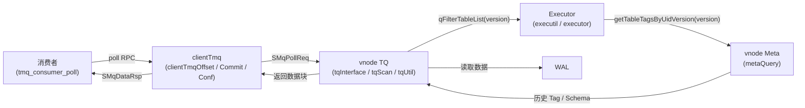
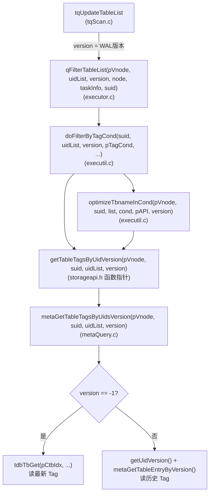
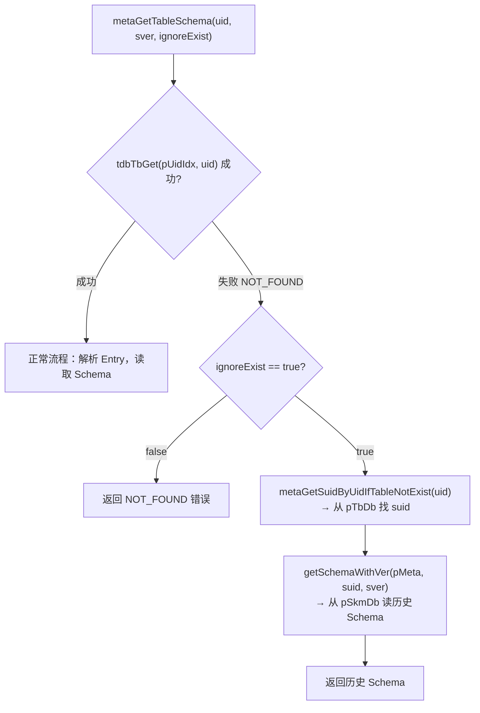
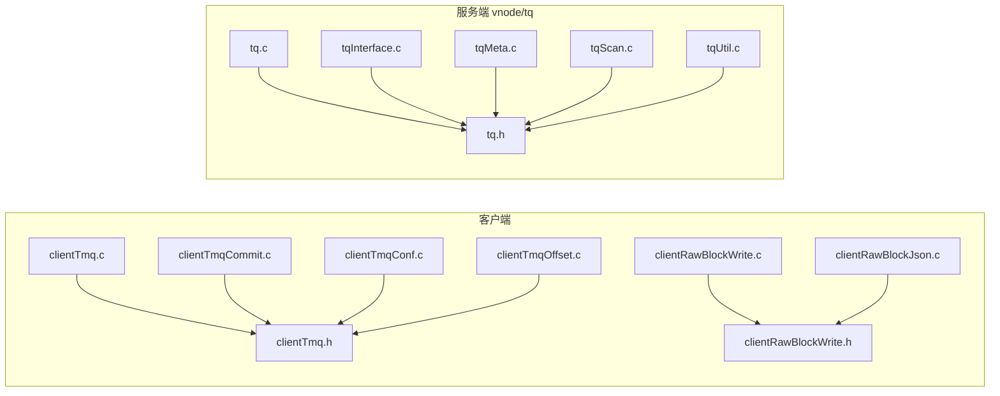

# 超级表订阅表列表变更逻辑优化

# 修订记录

| 编写日期 | 发布日期 | 版本 | 修订人 | 主要修改内容 |
| --- | --- | --- | --- | --- |
| 2026-04-15 | 2026-04-24 | 1.0 | wangmm0220 | 初稿 |

# 1 引言

## 1.1 目的

本文档描述 TDengine TMQ 超级表订阅（STB Subscription）在子表动态变化场景下，表列表（table list）更新逻辑的详细设计。目标是：

- 修复订阅过程中子表 Tag 被修改或子表被删除后，过滤结果不正确的问题；
- 使已删除子表在 WAL 中的历史写操作仍能被正确解析；
- 在满足上述正确性目标的前提下，完成相关代码的重构与拆分，提升可维护性。

## 1.2 范围

本文覆盖以下内容：

- 版本化 Tag 读取机制的设计与实现。
- 已删除表 Schema 容错机制的设计与实现。
- `clientTmq`、`tq`、`clientRawBlockWrite` 模块的代码拆分方案。
- 冗余消息类型 `SMqSeekReq` 的移除方案。
- 涉及的关键数据结构与接口变更。

## 1.3 受众

- TSDB 内核研发（TMQ 模块、Meta 模块、Executor 模块）。
- QA 团队。

---

# 2 术语

| 术语 | 含义 |
|------|------|
| TMQ | TDengine Message Queue，数据订阅模块 |
| STB | Super Table，超级表 |
| CTB | Child Table，子表 |
| WAL | Write-Ahead Log，预写日志 |
| TQ | 服务端 TMQ 处理模块（`source/dnode/vnode/src/tq/`） |
| Tag | 子表的静态标签列，用于超级表订阅的过滤条件 |
| table list | 订阅句柄持有的、当前应消费的子表 UID 集合 |
| `ctbIdx` | child table index，存储子表**最新** Tag 值的 TDB 索引 |
| `pTbDb` | table database，存储表**历史版本** Entry 的 TDB 数据库 |
| `pSkmDb` | schema database，存储表历史 Schema 的 TDB 数据库 |
| WAL version | WAL 提交版本号（`int64_t`），全局单调递增，用于标识数据写入时刻 |

---

# 3 概述

## 3.1 架构

超级表订阅的核心链路如下图所示。本次改动主要涉及 vnode 内部的 **TQ 模块**、**Meta 模块**和客户端 **Executor 模块**中的 tag 过滤路径。



## 3.2 技术

- C 语言内核模块：TQ、Meta、Executor。
- TDB（TDengine 嵌入式 KV 存储）：`pTbDb`、`pCtbIdx`、`pSkmDb` 的读取操作。
- WAL Reader：顺序回放日志，版本号用于定位历史状态。

## 3.3 依赖项

- TDB 存储接口（`tdb.h`）：游标读取、Key 精确查询。
- Meta 内部接口（`meta.h`）：`metaGetTableEntryByVersion`、`getUidVersion`。
- Executor 表列表管理（`executor.h`、`executil.h`）：`qFilterTableList`、`doFilterByTagCond`。
- Storage API 函数指针表（`storageapi.h`）：`getTableTagsByUidVersion`。

---

# 4 设计考虑

## 4.1 假设和限制

- WAL version 单调递增，可唯一标识任意时刻的元数据快照。
- `pTbDb` 对已删除表保留历史条目，不立即清除（现有行为，本改动不修改）。
- 普通查询（非订阅场景）不受本次改动影响，仍读取最新 Tag（`version = -1`）。
- 本次不修改任何外部消费者 API（`taos_tmq.h`）的语义。

## 4.2 设计模式和原则

- **版本透传（Version Propagation）**：`version` 参数沿调用链向下传递，调用方显式控制读取时刻，不在底层函数内部隐式判断。
- **向后兼容（Backward Compatibility）**：`version = -1` 作为哨兵值，表示"读最新"，使所有非订阅场景零改动。
- **容错降级（Graceful Degradation）**：表不存在时，`ignoreExist = true` 使 Schema 读取降级为从历史记录中查找，而非直接报错中断消费。
- **单一职责（SRP）**：大型源文件按功能职责拆分，每个新文件只负责一项核心功能。

## 4.3 风险和缓解措施

| 风险 | 描述 | 缓解措施 |
|------|------|---------|
| version 漏传 | 调用链某处遗漏 version 参数，回退为读最新 Tag，导致过滤结果仍然错误 | Code Review 严格检查所有 `doFilterByTagCond` 调用点；`test_tmq_update_tablelist` 专项回归验证 |
| pTbDb 扫描性能 | `metaGetSuidByUidIfTableNotExist` 使用全量游标扫描，子表极多时可能耗时 | 仅在 `ignoreExist=true` 且表已删除时触发（容错路径），频率极低；后续可考虑加辅助索引 |
| getUidVersion 性能 | 从 `pTbDb` 游标逆向查找历史版本，大版本数时扫描量大 | 仅在 STB 订阅 tag 过滤路径调用，非查询热路径；通过 CI 性能测试监控 |
| 代码拆分引入编译错误 | 大量文件重命名/拆分可能遗漏头文件或 CMakeLists.txt 更新 | CMakeLists.txt 同步更新，CI 全量编译验证 |
| STqExecDb 移除影响 DB 订阅 | 删除 `pFilterOutTbUid` 后 DB 类型订阅过滤路径是否完整 | Code Review 确认 DB 订阅已有完整替代过滤路径 |

---

# 5 详细设计

## 5.1 问题根因分析

### 5.1.1 Tag 版本读取错误

超级表订阅在每次 poll 时，若检测到子表集合发生变化，会调用以下链路重新过滤表列表：

```
tqUpdateTableList
  → qFilterTableList
    → doFilterByTagCond
      → getTableTagsByUid          ← 原实现：始终读 pCtbIdx（最新 Tag）
```

`pCtbIdx` 存储的是当前最新 Tag 值。当子表 Tag 被修改时，`pCtbIdx` 中的值已更新为修改后的 Tag，而消费进度对应的 WAL 版本早于此次修改。若用修改后的 Tag 评估原来的 tag filter 条件，可能导致：

- 原本满足条件的子表在 Tag 修改后不再满足，被错误排除出表列表，该子表的历史数据无法被消费。
- 原本不满足条件的子表在 Tag 修改后满足条件，被错误纳入表列表，消费到不应消费的数据。

### 5.1.2 已删除表的 Schema 读取失败

消费 WAL 日志时，若某子表在订阅期间被删除，WAL 中仍可能存在该表尚未被消费的写操作。此时 `metaGetTableSchema` 通过 `pUidIdx` 查询，由于表已从索引中移除，直接返回 `TSDB_CODE_NOT_FOUND`，导致该条 WAL 记录无法解析，消费中断。

## 5.2 版本化 Tag 读取

### 5.2.1 核心思路

在整个 tag 过滤调用链中引入 `version` 参数：

- **`version = -1`**：读取最新 Tag（原有行为，适用于普通查询）。
- **`version = WAL 提交版本号`**：读取指定版本时刻的 Tag（适用于 STB 订阅更新表列表场景）。

### 5.2.2 调用链版本传递



### 5.2.3 Meta 层实现：`metaGetTableTagByUidVersion`

```c
// metaQuery.c
static int32_t metaGetTableTagByUidVersion(SMeta* pMeta, int64_t suid, int64_t uid,
                                           int64_t version, void** tag) {
  if (version != -1) {
    // 1. 从 pTbDb 游标找到 uid 在 <= version 区间内最新一条记录的实际版本号
    SMetaReader mr = {0};
    metaReaderDoInit(&mr, pMeta, META_READER_NOLOCK);
    if (getUidVersion(&mr, &version, uid) != 0) {
      // 找不到则降级为读最新（容错）
      version = -1;
    }
    if (version != -1) {
      // 2. 按该版本号读取历史 Entry，提取 ctbEntry.pTags
      int32_t ret = metaGetTableEntryByVersion(&mr, version, uid);
      if (ret == 0) {
        void*   val = mr.me.ctbEntry.pTags;
        int32_t len = ((STag*)val)->len;
        *tag = taosMemoryMalloc(len);
        if (*tag) memcpy(*tag, val, len);
        else ret = terrno;
      }
      metaReaderClear(&mr);
      return ret;
    }
    metaReaderClear(&mr);
  }
  // version == -1：从 pCtbIdx 读最新 Tag（原实现路径）
  SCtbIdxKey ctbIdxKey = {.suid = suid, .uid = uid};
  void*   val = NULL;
  int32_t len = 0;
  int32_t ret = tdbTbGet(pMeta->pCtbIdx, &ctbIdxKey, sizeof(SCtbIdxKey), &val, &len);
  if (ret == 0) {
    *tag = taosMemoryMalloc(len);
    if (*tag) memcpy(*tag, val, len);
    else ret = terrno;
    tdbFree(val);
  }
  return ret;
}
```

### 5.2.4 `getUidVersion` 修复

原实现在定位游标后误用 `>= version` 判断方向，导致对某些边界情况无法找到正确版本。修复后逻辑：

1. 将游标移动到 `(uid, version)` 附近。
2. 直接读取当前游标位置的 Key（`STbDbKey`），若 `tmp->uid == uid` 则直接使用该版本。
3. 否则向前（`tdbTbcPrev`）遍历，找到最近一条 `uid` 相同的记录。

## 5.3 已删除表的 Schema 容错

### 5.3.1 核心思路

为 `metaGetTableSchema` 增加 `bool ignoreExist` 参数：

- `false`（原语义）：表不存在直接返回错误。
- `true`（容错模式）：若表不在 `pUidIdx`（已删除），通过 `metaGetSuidByUidIfTableNotExist` 从 `pTbDb` 历史条目中找到该表所属 suid，再通过 `getSchemaWithVer` 加载历史 Schema。

### 5.3.2 新增辅助函数

#### `getSchemaWithVer`（内部）

从 `pSkmDb`（和可选的 `pSkmExtDb`）按 `(uid, sver)` 读取 Schema，解码为 `SSchemaWrapper`。将原 `metaGetTableSchema` 中重复的 Schema 读取逻辑提取为独立函数，供多处复用。

#### `metaGetSuidByUidIfTableNotExist`

从 `pTbDb` 历史记录中扫描，找到第一条 `uid` 匹配的 Entry，提取 `ctbEntry.suid` 并返回。用于已删除表的 suid 回溯。

#### `metaGetTbnameByIdIfTableNotExist`

从 `pTbDb` 历史记录中扫描，找到第一条 `uid` 匹配的 Entry，提取 `me.name` 并返回。用于已删除表的表名回溯（日志、错误信息等）。

### 5.3.3 容错流程



## 5.4 模块代码拆分

### 5.4.1 客户端 TMQ 模块拆分

原 `clientTmq.c`（约 6000 行）按功能职责拆分为：

| 新文件 | 职责 |
|--------|------|
| `clientTmq.c` | poll 主循环、subscribe/unsubscribe、位移查询 |
| `clientTmqCommit.c` | 同步/异步 commit、自动 commit 定时器 |
| `clientTmqConf.c` | `tmq_conf_t` 创建/销毁、配置项解析 |
| `clientTmqOffset.c` | offset 操作（seek、position、beginning/end） |
| `clientTmq.h`（新） | 共享结构体（`tmq_t`、`tmq_conf_t`、`tmq_list_t`）及内部宏定义 |

### 5.4.2 客户端 Raw Block 写模块拆分

| 新文件 | 职责 |
|--------|------|
| `clientRawBlockWrite.c` | 二进制格式 raw block 写入 |
| `clientRawBlockJson.c`（新） | JSON 格式 raw block 写入 |
| `clientRawBlockWrite.h`（新） | 两个文件共享的宏（`RAW_RETURN_CHECK`、`RAW_NULL_CHECK` 等） |

### 5.4.3 服务端 TQ 模块拆分

| 变更 | 说明 |
|------|------|
| `tq.c` | 仅保留 `tqOpen` / `tqClose` / `tqInitialize` 三个函数 |
| `tqInterface.c`（新） | `tqProcessPollReq`、`tqProcessOffsetCommitReq` 等所有 RPC 处理函数 |
| `tqRead.c` | 删除，内容并入 `tqInterface.c` |
| `tqSink.c` | 删除，Stream sink 相关逻辑迁移至 Stream 模块 |
| `tqMeta.c` | 新增 `tqDestroySTqHandle`（原 `tqDestroyTqHandle`）、`tqEncodeSTqHandle`、`tqDecodeSTqHandle` |

### 5.4.4 拆分后文件依赖关系



## 5.5 其他变更

### 5.5.1 移除 `SMqSeekReq`

`TDMT_VND_TMQ_SEEK` 消息原用于客户端向 vnode 发送 seek 请求，但实际消费路径已不经此消息，属于死代码。本次清理：

- 删除 `tmsg.h` 中 `SMqSeekReq` 结构体定义。
- 删除 `tmsg.c` 中 `tSerializeSMqSeekReq` / `tDeserializeSMqSeekReq` 实现（共 51 行）。
- 删除 `vmHandle.c` 中对应消息处理注册。
- `tmsgdef.h` 中保留枚举值（避免破坏消息序号），添加注释 `// no longer used`。

### 5.5.2 枚举重命名

```c
// 原名 WITH_DATA 含义模糊，误导为"包含数据"
// 实际语义为"只含数据（不含 Meta）"，修正为：
ONLY_DATA = 0   // 原 WITH_DATA
WITH_META = 1   // 不变
ONLY_META = 2   // 不变
```

### 5.5.3 `STqExecDb` 移除

DB 类型订阅原通过 `STqExecDb.pFilterOutTbUid`（`SHashObj*`）维护一个"排除表"集合。此逻辑已由通用的 `qFilterTableList` 机制替代，不再需要独立维护。移除该结构体及 `tqDestroyTqHandle` 中对应的清理代码。

### 5.5.4 API 重命名

#### Executor 层（去除 `Tmq` 特指，改为通用 `QuerySub`）

| 原名 | 新名 |
|------|------|
| `qUpdateTableListForTmqScanner` | `qUpdateTableListForQuerySub` |
| `qDeleteTableListForTmqScanner` | `qDeleteTableListForQuerySub` |
| `qAddTableListForTmqScanner` | `qAddTableListForQuerySub` |
| `qUpdateTableTagCacheForTmq` | `qUpdateTableTagCacheForQuerySub` |

#### TQ Meta 层（统一 `tq` 前缀）

| 原名 | 新名 |
|------|------|
| `tEncodeSTqHandle` | `tqEncodeSTqHandle` |
| `tDecodeSTqHandle` | `tqDecodeSTqHandle` |
| `tqDestroyTqHandle` | `tqDestroySTqHandle` |

---

# 6 接口规范

## 6.1 Storage API 接口变更

```c
// storageapi.h — SStoreMeta 函数指针
// 原：
int32_t (*getTableTagsByUid)(void* pVnode, int64_t suid, SArray* uidList);
// 新：
int32_t (*getTableTagsByUidVersion)(void* pVnode, int64_t suid, SArray* uidList, int64_t version);
// version = -1 表示读最新 Tag，保持原有语义；version >= 0 表示读历史 Tag
```

## 6.2 Executor 公开接口变更

```c
// executor.h
// 新增 version 参数
int32_t qFilterTableList(void* pVnode, SArray* uidList, int64_t version,
                         SNode* node, void* pTaskInfo, uint64_t suid);

// 函数重命名（executor.h）
void    qUpdateTableTagCacheForQuerySub(qTaskInfo_t tinfo, const SArray* tableIdList,
                                        SArray* cids, SArray* cidListArray);
int32_t qUpdateTableListForQuerySub(qTaskInfo_t tinfo, const SArray* tableIdList);
int32_t qDeleteTableListForQuerySub(qTaskInfo_t tinfo, const SArray* tableIdList);
int32_t qAddTableListForQuerySub(qTaskInfo_t tinfo, const SArray* tableIdList);
```

## 6.3 executil 内部接口变更

```c
// executil.h
// 新增 version 参数
int32_t doFilterByTagCond(int64_t suid, SArray* pUidList, int64_t version,
                          SNode* pTagCond, void* pVnode,
                          SIdxFltStatus status, SStorageAPI* pAPI, void* pStreamInfo);
```

## 6.4 Meta 接口变更

```c
// meta.h
// 新增 ignoreExist 参数
SSchemaWrapper* metaGetTableSchema(SMeta* pMeta, tb_uid_t uid, int32_t sver, int lock,
                                   SExtSchema** extSchema, int8_t type, bool ignoreExist);

// 新增：从历史记录查找已删除表的 suid
int64_t metaGetSuidByUidIfTableNotExist(SMeta* pMeta, int64_t uid);

// 新增：从历史记录查找已删除表的表名
int32_t metaGetTbnameByIdIfTableNotExist(SMeta* pMeta, int64_t uid, char* tbname);

// 重命名：原 metaGetTableTagsByUids
int32_t metaGetTableTagsByUidsVersion(void* pVnode, int64_t suid, SArray* uidList, int64_t version);
```

## 6.5 删除的接口

| 接口 | 原所在文件 | 原因 |
|------|---------|------|
| `SMqSeekReq`（结构体） | `tmsg.h` | 无调用，移除死代码 |
| `tSerializeSMqSeekReq` | `tmsg.c` | 同上 |
| `tDeserializeSMqSeekReq` | `tmsg.c` | 同上 |
| `STqExecDb`（结构体） | `tq.h` | 逻辑已由通用过滤替代 |

---

# 7 安全考虑

本次改动不涉及认证、授权、加密等安全功能，无安全风险。版本号参数为 `int64_t`，不接受用户直接输入，不存在注入风险。

---

# 8 性能和可扩展性

## 8.1 性能影响分析

| 场景 | 原实现 | 新实现 | 影响 |
|------|--------|--------|------|
| 普通查询 tag 过滤 | `tdbTbGet(pCtbIdx)` 精确查找 | 同原实现（`version=-1` 路径） | **无影响** |
| STB 订阅 tag 过滤（版本路径） | `tdbTbGet(pCtbIdx)` | `getUidVersion`（游标逆扫）+ `metaGetTableEntryByVersion` | 轻微增加，仅在子表动态变化时触发 |
| 已删除表 Schema 读取 | 直接报错 | `metaGetSuidByUidIfTableNotExist`（全量游标扫描）+ `getSchemaWithVer` | 仅在表已删除时触发（容错路径），频率极低 |

## 8.2 可扩展性

- `version` 参数机制可平滑扩展至其他需要历史快照读取的场景（如 Stream 快照订阅）。
- `getSchemaWithVer` 提取为独立函数后，可被未来的历史 Schema 查询功能直接复用。

---

# 9 部署和配置

## 9.1 部署流程

本次改动为纯代码逻辑优化，不新增配置项、不修改持久化格式、不变更消息协议（仅删除未使用的 `SMqSeekReq`）。滚动升级时无需特殊处理。

## 9.2 版本控制与兼容性

- `SMqSeekReq` 消息类型枚举值保留（`TDMT_VND_TMQ_SEEK`），仅标注为 `// no longer used`，避免破坏消息序号的向后兼容性。
- `pTbDb` 和 `pSkmDb` 的读取方式为只读，不修改任何持久化数据格式，无需数据迁移。

---

# 10 监控和维护

## 10.1 日志

- `metaGetTableTagByUidVersion` 在读取历史 Tag 失败时，输出 `metaError`，包含 `vgId`、`suid`、`uid`、`version`、错误码，便于排障。
- `metaGetTbnameByIdIfTableNotExist` 在找不到历史记录时静默返回（已删除表的表名不可用属于正常情况）。

## 10.2 维护

- 代码拆分后，各文件行数均控制在合理范围（≤ 2000 行），便于后续维护和 Code Review。
- `clientTmq.h` 统一管理 TMQ 内部共享结构体，避免跨文件依赖循环。

---

# 11 参考资料

1. PR #35133：[feat(tmq): optimize the logic of changing tablelist for stb sub](https://github.com/taosdata/TDengine/pull/35133)
2. Feishu 需求：[6935517365](https://project.feishu.cn/taosdata_td/feature/detail/6935517365)
3. 概要设计模板：`docs/templates/03-设计文档模版/概要设计说明书（Functional Spec）- 模板.md`
4. TDB 接口文档：`source/libs/tdb/inc/tdb.h`
5. Meta 内部接口：`source/dnode/vnode/src/inc/meta.h`
