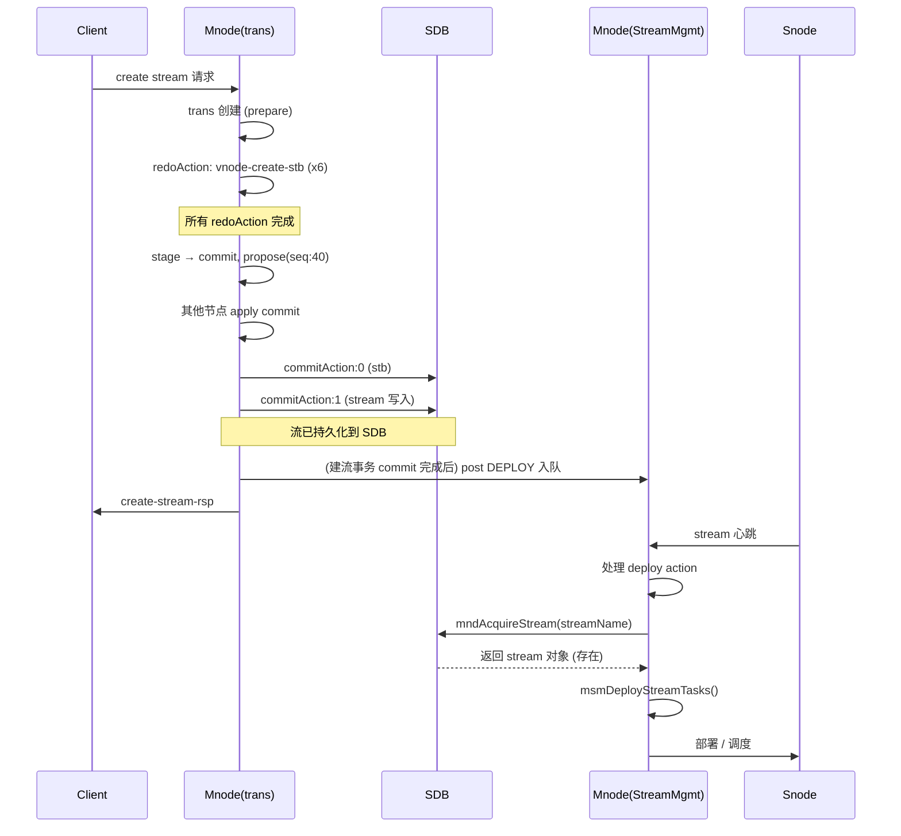
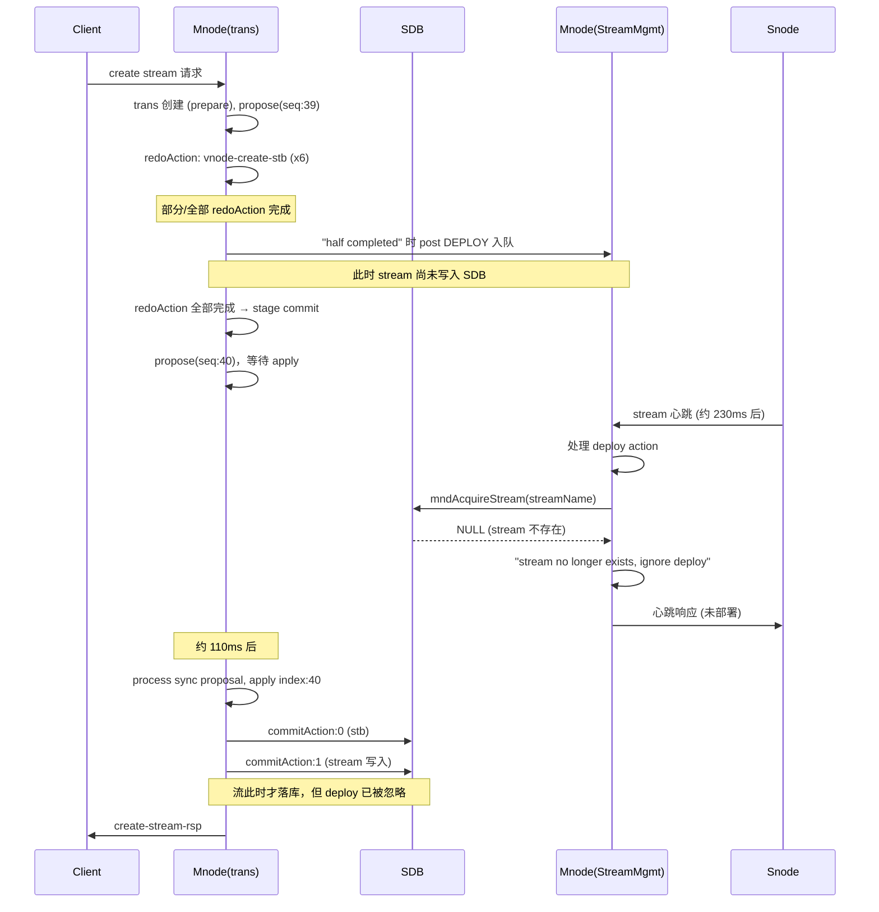

# 建流与部署时序：正常 vs 异常

## 1. 正常情况（流先落 SDB，再被部署）

**要点**：DEPLOY 入队发生在 **commitAction 执行之后**（即 stream 已写入 SDB 之后），心跳处理 deploy 时 `mndAcquireStream` 能查到流。

---

## 2. 本次异常情况（DEPLOY 先入队，流尚未落 SDB）

**要点**：DEPLOY 在 **redoAction 阶段 / half completed** 就入队，而 stream 要等到 **commit 被 apply 后** 才写入 SDB。心跳先于 commit 处理了 deploy，此时 SDB 里还没有该流，于是 “no longer exists, ignore deploy”，导致该流本次不会再被部署。
