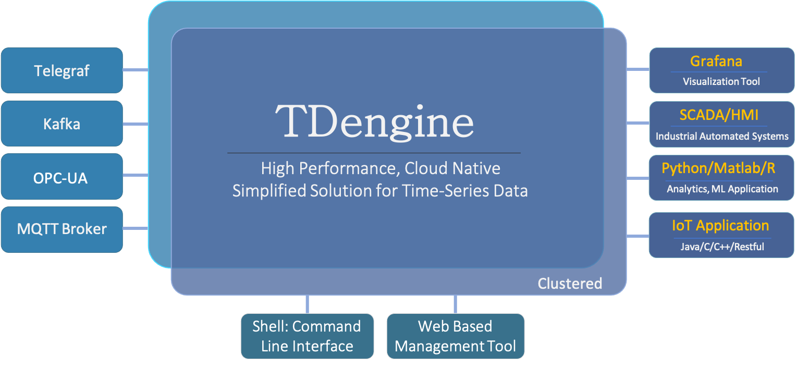

TDengine 是一款专为物联网、工业互联网等场景设计并优化的大数据平台，它能安全高效地将大量设备、数据采集器每天产生的高达 TB 甚至 PB 级的数据进行汇聚、存储、分析和分发，对业务运行状态进行实时监测、预警，提供实时的商业洞察。其核心模块是高性能、集群开源、云原生、极简的时序数据库 TDengine OSS。

本节介绍 TDengine OSS 的主要产品和功能、竞争优势、适用场景、与其他数据库的对比测试等等，让大家对 TDengine OSS 有个整体了解

## 主要功能

TDengine OSS 的主要功能如下：

1. 写入数据，支持
   - [SQL 写入](../develop/insert-data/sql-writing)
   - [无模式（Schemaless）写入](../reference/schemaless/)，支持多种标准写入协议
     - [InfluxDB Line 协议](../develop/insert-data/influxdb-line)
     - [OpenTSDB Telnet 协议](../develop/insert-data/opentsdb-telnet)
     - [OpenTSDB JSON 协议](../develop/insert-data/opentsdb-json)
   - 与多种第三方工具的无缝集成，它们都可以仅通过配置而无需任何代码即可将数据写入 TDengine
     - [Telegraf](../third-party/telegraf)
     - [Prometheus](../third-party/prometheus)
     - [StatsD](../third-party/statsd)
     - [collectd](../third-party/collectd)
     - [Icinga2](../third-party/icinga2)
     - [TCollector](../third-party/tcollector)
     - [EMQX](../third-party/emq-broker)
     - [HiveMQ](../third-party/hive-mq-broker)
2. 查询数据，支持
   - [标准 SQL](../taos-sql)，含嵌套查询
   - [时序数据特色函数](../taos-sql/function/#time-series-extensions)
   - [时序数据特色查询](../taos-sql/distinguished)，例如降采样、插值、累加和、时间加权平均、状态窗口、会话窗口等
   - [用户自定义函数（UDF）](../taos-sql/udf)
3. [缓存](../develop/cache)，将每张表的最后一条记录缓存起来，这样无需 Redis 就能对时序数据进行高效处理
4. [流式计算（Stream Processing）](../develop/stream)，TDengine 不仅支持连续查询，还支持事件驱动的流式计算，这样在处理时序数据时就无需 Flink 或 Spark 这样流式计算组件
5. [数据订阅](../develop/tmq)，应用程序可以订阅一张表或一组表的数据，提供与 Kafka 相同的 API，而且可以指定过滤条件
6. 可视化
   - 支持与 [Grafana](../third-party/grafana/) 的无缝集成
   - 支持与 Google Data Studio 的无缝集成
7. 集群
   - [集群部署](../deployment/)，可以通过增加节点进行水平扩展以提升处理能力
   - 可以通过 [Kubernetes 部署 TDengine](../deployment/k8s/)
   - 通过多副本提供高可用能力
8. 管理
   - [监控](../operation/monitor)运行中的 TDengine 实例
   - 多种[数据导入](../operation/import)方式
   - 多种[数据导出](../operation/export)方式
9. 工具
   - 提供[交互式命令行程序（CLI）](../reference/taos-shell)，便于管理集群，检查系统状态，做即席查询
   - 提供压力测试工具 [taosBenchmark](../reference/taosbenchmark)，用于测试 TDengine 的性能
10. 编程
    - 提供各种语言的[连接器（Connector）](../connector): 如 [C/C++](../connector/cpp)、[Java](../connector/java)、[Go](../connector/go)、[Node.js](../connector/node)、[Rust](../connector/rust)、[Python](../connector/python)、[C#](../connector/csharp) 等
    - 支持 [REST 接口](../connector/rest-api/)

更多细节功能，请阅读整个文档。

## 竞争优势

由于 TDengine 充分利用了[时序数据特点](https://www.taosdata.com/blog/2019/07/09/105.html)，比如结构化、无需事务、很少删除或更新、写多读少等等，因此与其他时序数据库相比，TDengine 有以下特点：

- **[高性能](https://www.taosdata.com/tdengine/fast)**：TDengine 是唯一一个解决了时序数据存储的高基数难题的时序数据库，支持上亿数据采集点，并在数据插入、查询和数据压缩上远胜其它时序数据库。

- **[极简时序数据平台](https://www.taosdata.com/tdengine/simplified_solution_for_time-series_data_processing)**：TDengine 内建缓存、流式计算和数据订阅等功能，为时序数据的处理提供了极简的解决方案，从而大幅降低了业务系统的设计复杂度和运维成本。

- **[云原生](https://www.taosdata.com/tdengine/cloud_native_time-series_database)**：通过原生的分布式设计、数据分片和分区、存算分离、RAFT 协议、Kubernetes 部署和完整的可观测性，TDengine 是一款云原生时序数据库并且能够部署在公有云、私有云和混合云上。

- **[简单易用](https://www.taosdata.com/tdengine/ease_of_use)**：对系统管理员来说，TDengine 大幅降低了管理和维护的代价。对开发者来说， TDengine 提供了简单的接口、极简的解决方案和与第三方工具的无缝集成。对数据分析专家来说，TDengine 提供了便捷的数据访问能力。

- **[分析能力](https://www.taosdata.com/tdengine/easy_data_analytics)**：通过超级表、存储计算分离、分区分片、预计算和其它技术，TDengine 能够高效地浏览、格式化和访问数据。

- **[核心开源](https://www.taosdata.com/tdengine/open_source_time-series_database)**：TDengine 的核心代码包括集群功能全部在开源协议下公开。全球超过 140k 个运行实例，GitHub Star 20k，且拥有一个活跃的开发者社区。

采用 TDengine，可将典型的物联网、车联网、工业互联网大数据平台的总拥有成本大幅降低。表现在几个方面：

1. 由于其超强性能，它能将系统所需的计算资源和存储资源大幅降低
2. 因为支持 SQL，能与众多第三方软件无缝集成，学习迁移成本大幅下降
3. 因为是一款极简的时序数据平台，系统复杂度、研发和运营成本大幅降低

## 技术生态

在整个时序大数据平台中，TDengine 扮演的角色如下：

<figure>

<figcaption>图 1. TDengine 技术生态图</figcaption>

</figure>

上图中，左侧是各种数据采集或消息队列，包括 OPC-UA、MQTT、Telegraf、也包括 Kafka，他们的数据将被源源不断的写入到 TDengine。右侧则是可视化、BI 工具、组态软件、应用程序。下侧则是 TDengine 自身提供的命令行程序（CLI）以及可视化管理工具。

## 典型适用场景

作为一个高性能、分布式、支持 SQL 的时序数据库（Time-series Database），TDengine 的典型适用场景包括但不限于 IoT、工业互联网、车联网、IT 运维、能源、金融证券等领域。需要指出的是，TDengine 是针对时序数据场景设计的专用数据库和专用大数据处理工具，因其充分利用了时序大数据的特点，它无法用来处理网络爬虫、微博、微信、电商、ERP、CRM 等通用型数据。下面本文将对适用场景做更多详细的分析。

### 数据源特点和需求

从数据源角度，设计人员可以从下面几个角度分析 TDengine 在目标应用系统里面的适用性。

| 数据源特点和需求             | 不适用 | 可能适用 | 非常适用 | 简单说明                                                                                                                        |
| ---------------------------- | ------ | -------- | -------- | ------------------------------------------------------------------------------------------------------------------------------- |
| 总体数据量巨大               |        |          | √        | TDengine 在容量方面提供出色的水平扩展功能，并且具备匹配高压缩的存储结构，达到业界最优的存储效率。                               |
| 数据输入速度偶尔或者持续巨大 |        |          | √        | TDengine 的性能大大超过同类产品，可以在同样的硬件环境下持续处理大量的输入数据，并且提供很容易在用户环境里面运行的性能评估工具。 |
| 数据源数目巨大               |        |          | √        | TDengine 设计中包含专门针对大量数据源的优化，包括数据的写入和查询，尤其适合高效处理海量（千万或者更多量级）的数据源。           |

### 系统架构要求

| 系统架构要求           | 不适用 | 可能适用 | 非常适用 | 简单说明                                                                                              |
| ---------------------- | ------ | -------- | -------- | ----------------------------------------------------------------------------------------------------- |
| 要求简单可靠的系统架构 |        |          | √        | TDengine 的系统架构非常简单可靠，自带消息队列，缓存，流式计算，监控等功能，无需集成额外的第三方产品。 |
| 要求容错和高可靠       |        |          | √        | TDengine 的集群功能，自动提供容错灾备等高可靠功能。                                                   |
| 标准化规范             |        |          | √        | TDengine 使用标准的 SQL 语言提供主要功能，遵守标准化规范。                                            |

### 系统功能需求

| 系统功能需求               | 不适用 | 可能适用 | 非常适用 | 简单说明                                                                                                                  |
| -------------------------- | ------ | -------- | -------- | ------------------------------------------------------------------------------------------------------------------------- |
| 要求完整的内置数据处理算法 |        | √        |          | TDengine 实现了通用的数据处理算法，但是还没有做到妥善处理各行各业的所有需求，因此特殊类型的处理需求还需要在应用层面解决。 |
| 需要大量的交叉查询处理     |        | √        |          | 这种类型的处理更多应该用关系型数据库处理，或者应该考虑 TDengine 和关系型数据库配合实现系统功能。                          |

### 系统性能需求

| 系统性能需求           | 不适用 | 可能适用 | 非常适用 | 简单说明                                                                                           |
| ---------------------- | ------ | -------- | -------- | -------------------------------------------------------------------------------------------------- |
| 要求较大的总体处理能力 |        |          | √        | TDengine 的集群功能可以轻松地让多服务器配合达成处理能力的提升。                                    |
| 要求高速处理数据       |        |          | √        | TDengine 专门为 IoT 优化的存储和数据处理设计，一般可以让系统得到超出同类产品多倍数的处理速度提升。 |
| 要求快速处理小粒度数据 |        |          | √        | 这方面 TDengine 性能可以完全对标关系型和 NoSQL 型数据处理系统。                                    |

### 系统维护需求

| 系统维护需求           | 不适用 | 可能适用 | 非常适用 | 简单说明                                                                                                              |
| ---------------------- | ------ | -------- | -------- | --------------------------------------------------------------------------------------------------------------------- |
| 要求系统可靠运行       |        |          | √        | TDengine 的系统架构非常稳定可靠，日常维护也简单便捷，对维护人员的要求简洁明了，最大程度上杜绝人为错误和事故。         |
| 要求运维学习成本可控   |        |          | √        | 同上。                                                                                                                |
| 要求市场有大量人才储备 | √      |          |          | TDengine 作为新一代产品，目前人才市场里面有经验的人员还有限。但是学习成本低，我们作为厂家也提供运维的培训和辅助服务。 |

## 与其他数据库的对比测试

- [用 InfluxDB 开源的性能测试工具对比 InfluxDB 和 TDengine](https://www.taosdata.com/blog/2020/01/13/1105.html)
- [TDengine 与 OpenTSDB 对比测试](https://www.taosdata.com/blog/2019/08/21/621.html)
- [TDengine 与 Cassandra 对比测试](https://www.taosdata.com/blog/2019/08/14/573.html)
- [TDengine VS InfluxDB ，写入性能大 PK ！](https://www.taosdata.com/2021/11/05/3248.html)
- [TDengine 和 InfluxDB 查询性能对比测试报告](https://www.taosdata.com/2022/02/22/5969.html)
- [TDengine 与 InfluxDB、OpenTSDB、Cassandra、MySQL、ClickHouse 等数据库的对比测试报告](https://www.taosdata.com/downloads/TDengine_Testing_Report_cn.pdf)

## 主要产品

TDengine 有两个主要产品：TDengine Enterprise （即 TDengine 企业版）和 TDengine Cloud，关于它们的具体定义请参考 
- [TDengine 企业版](https://www.taosdata.com/tdengine-pro)
- [TDengine 云服务](https://cloud.taosdata.com/?utm_source=menu&utm_medium=webcn)
