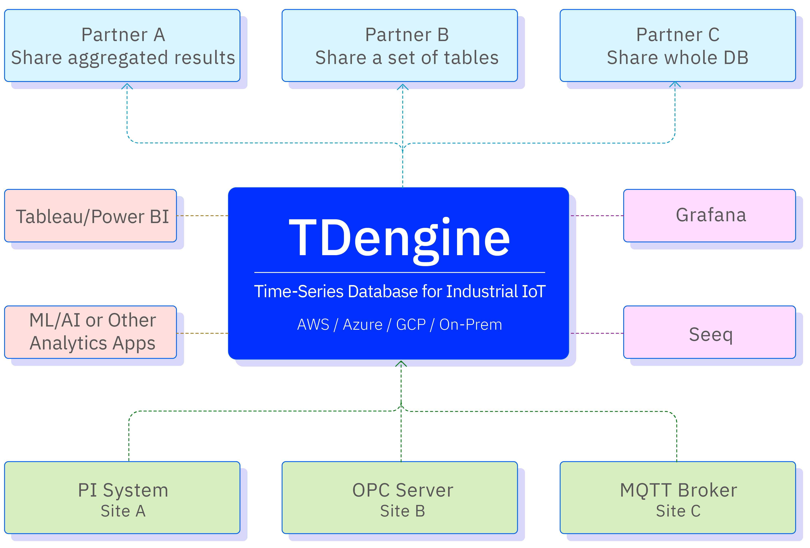

TDengine TSDB 核心是一款高性能、集群开源、云原生的时序数据库（Time Series Database，TSDB），专为物联网（IoT）平台、工业互联网、电力、IT 运维等场景设计并优化，具备较强的弹性伸缩能力。同时内建缓存、流式计算、数据订阅等系统功能，可显著降低系统设计复杂度以及研发与运营成本。作为高性能、分布式的物联网与工业大数据平台，它能够安全、高效地汇聚、存储、分析与分发海量设备与数据采集器每日产生的 TB 乃至 PB 级数据，支撑业务运行状态的实时监测与预警，并提供实时商业洞察。

2019 年 7 月，涛思数据将 TDengine TSDB 单机版开源；随后于 2020 年 8 月与 2022 年 8 月，分别将集群版与云原生版开源。开源后，TDengine 迅速获得全球开发者关注，多次位居 GitHub 全球趋势排行榜首位。最新动态参见 [涛思数据首页](https://www.taosdata.com/)。

## 产品分类

TDengine 包括开源版 TDengine TSDB-OSS、企业版 TDengine TSDB-Enterprise 以及云服务 TDengine Cloud。

- TDengine TSDB-OSS 是一款开源、高性能、云原生的时序数据库，具备较强的弹性伸缩能力，同时内建缓存、流式计算、数据订阅等功能，可显著降低系统设计复杂度以及研发与运营成本，是一个极简的时序数据处理平台。更多信息参见 [TDengine TSDB-OSS](https://www.taosdata.com/tdengine-oss)。
- TDengine TSDB-Enterprise 是私有化部署版本，可部署在边缘侧、本地以及公有云 / 私有云上，具备开源版本所不具备的多项企业级功能。更多信息参见 [TDengine TSDB-Enterprise](https://www.taosdata.com/tdengine-enterprise)。
- TDengine Cloud 是全托管的物联网与工业大数据云服务平台，尤其适合中小规模用户。更多信息参见 [TDengine Cloud](https://cloud.taosdata.com)。

## 主要功能与特性

TDengine TSDB 既不依赖任何第三方软件，也不是对既有开源数据库或流式计算产品的简单优化或封装，而是基于涛思数据团队对传统关系型数据库、NoSQL 数据库、流式计算引擎、消息队列等软件的深入吸收与自主创新。它具备时序数据汇聚、存储、分析与分发能力，并拥有独特的技术优势。

- **数据汇聚**：可汇聚 MQTT、OPC UA、OPC DA、Kafka、CSV，以及传统实时数据库（如 PI System、Wonderware）等多种数据源，并进行清洗、加工与转换，确保入库数据质量，便于集中监测与整体分析。
- **数据存储**：对汇聚数据进行高效存储，通过列式存储、两级压缩以及按数据类型选用压缩算法等手段，实现高于通用数据库十倍以上的压缩率。同时通过按时间段分区、按设备分片、存算分离等技术，提供较强的水平扩展能力。
- **数据分析**：支持标准 SQL 查询，并提供时序扩展函数（如时间加权平均）；亦支持嵌套查询、UDF 与实时流式计算。通过标准 JDBC、ODBC 接口，可与 Grafana、Power BI 等可视化、BI、AI/ML 工具无缝集成，便于开展更深入的数据分析。
- **数据分发**：提供数据订阅能力，可将一个数据库、一张超级表、一组表或单张表的数据，以及经特定时间段聚合、过滤与加工后的数据，实时分发给第三方应用。该能力在分发粒度上精细可控，并可通过权限控制与加密等措施保障分发安全。

## 与典型时序数据库的区别

由于充分利用时序数据特点，并采用“一个数据采集点一张表”与“超级表”的创新数据模型，与其他时序数据库相比，TDengine TSDB 具有以下特点：

1. **快 10 倍以上的读写性能**：充分利用时序大数据特点，设计了新颖的存储引擎，显著提升写入与查询速度，并提高数据压缩率。相对通用数据库，读、写与压缩性能至少高出十倍；TSBS 基准测试结果显示，相对 TimescaleDB、InfluxDB 亦明显领先。
2. **不到 1/10 的存储成本**：提供多种压缩算法，压缩比业界领先，可将数据集压缩至原始大小的约 1/10。同时支持数据分级存储与 S3 存储，将不同时间段的数据存放于不同介质目录，使不同“热度”的数据落在相应存储介质上，从而降低存储成本。
3. **强大的水平扩展能力**：自设计之初即面向水平扩展，可支持 10 亿数据采集点。自 3.0 起支持云原生，能够充分利用云平台在存储、计算与网络方面的弹性能力。在 10 亿时间线、100 个数据节点的规模下，仍可保持良好性能，有效缓解时序场景中的“高基数”问题。
4. **零代码的高效数据汇聚**：可将 PI System、MQTT、OPC 等工业数据源汇聚到一起，并进行清洗、加工与转换，以保证入库数据质量，便于集中监测与总体分析。作为零代码平台，仅需少量配置即可完成工业数据源的 ETL 流程。
5. **全栈时序数据处理平台**：为降低系统设计复杂度与运行成本，充分利用时序数据特点，内建缓存、流式计算与数据订阅能力，在高效存储与分析之外，提供极简的时序数据处理方案。
6. **开放的生态系统**：核心代码开源，支持标准 SQL，并提供标准化接口，可通过 ODBC、JDBC 及多语言连接器集成可视化与 AI/BI 工具。支持 PI System、MQTT、OPC 等工业数据接口，简化工业数据 ETL；同时通过数据订阅实现便捷、安全的数据共享，降低厂商锁定风险。

## 技术生态

在整个时序大数据平台中，TDengine TSDB 扮演的角色如下：

<figure>

<figcaption>技术生态图</figcaption>
</figure>

## 典型适用场景

作为基础软件，TDengine TSDB 的应用领域十分广泛。原则上，凡涉及机器、设备、传感器采集数据的场景均可适用，包括但不限于 IoT、工业互联网、车联网、IT 运维、能源、金融证券等领域。需要说明的是，它是面向时序数据场景的专用数据库与数据处理工具；正因其充分利用时序数据特点，不适用于网络爬虫、微博、微信、电商、ERP、CRM 等通用型数据场景。下文将进一步分析适用条件。

### 数据源特点和需求

从数据源角度，设计人员可从以下几方面评估其在目标应用系统中的适用性。

| 数据源特点和需求             | 不适用 | 可能适用 | 非常适用 | 简单说明                                                                                                                        |
| ---------------------------- | ------ | -------- | -------- | ------------------------------------------------------------------------------------------------------------------------------- |
| 总体数据量巨大               |        |          | √        | 在容量方面具备出色的水平扩展能力，并采用高压缩存储结构，存储效率达到业界领先水平。                               |
| 数据输入速度偶尔或者持续巨大 |        |          | √        | 性能显著优于同类产品，可在相同硬件条件下持续处理大量写入，并提供便于在用户环境中运行的性能评估工具。 |
| 数据源数目巨大               |        |          | √        | 针对海量数据源的写入与查询做了专门优化，尤其适合千万级乃至更高量级的数据源。           |

### 系统架构要求

| 系统架构要求           | 不适用 | 可能适用 | 非常适用 | 简单说明                                                                                              |
| ---------------------- | ------ | -------- | -------- | ----------------------------------------------------------------------------------------------------- |
| 要求简单可靠的系统架构 |        |          | √        | 架构简洁可靠，内建消息队列、缓存、流式计算、监控等能力，无需额外集成第三方产品。 |
| 要求容错和高可靠       |        |          | √        | 集群功能可自动提供容错、灾备等高可用能力。                                                   |
| 标准化规范             |        |          | √        | 以标准 SQL 提供主要功能，符合标准化规范。                                            |

### 系统功能需求

| 系统功能需求               | 不适用 | 可能适用 | 非常适用 | 简单说明                                                                                                                  |
| -------------------------- | ------ | -------- | -------- | ------------------------------------------------------------------------------------------------------------------------- |
| 要求完整的内置数据处理算法 |        | √        |          | 已实现通用数据处理算法，但尚未覆盖各行业全部需求；特殊处理逻辑仍需在应用层实现。 |
| 需要大量的交叉查询处理     |        | √        |          | 此类处理更适合由关系型数据库承担，或与关系型数据库配合完成。                          |

### 系统性能需求

| 系统性能需求           | 不适用 | 可能适用 | 非常适用 | 简单说明                                                                                           |
| ---------------------- | ------ | -------- | -------- | -------------------------------------------------------------------------------------------------- |
| 要求较大的总体处理能力 |        |          | √        | 可通过集群将多台服务器协同扩展，提升总体处理能力。                                    |
| 要求高速处理数据       |        |          | √        | 针对 IoT 场景优化的存储与处理设计，通常可带来数倍于同类产品的吞吐提升。 |
| 要求快速处理小粒度数据 |        |          | √        | 在小粒度数据处理性能上可对标关系型与 NoSQL 系统。                                    |

### 系统维护需求

| 系统维护需求           | 不适用 | 可能适用 | 非常适用 | 简单说明                                                                                                              |
| ---------------------- | ------ | -------- | -------- | --------------------------------------------------------------------------------------------------------------------- |
| 要求系统可靠运行       |        |          | √        | 架构稳定可靠，日常维护简便，运维门槛清晰，有助于降低人为失误风险。         |
| 要求运维学习成本可控   |        |          | √        | 同上。                                                                                                                |
| 要求市场有大量人才储备 | √      |          |          | 作为较新的产品形态，市场上具备相关经验的人员仍相对有限；但学习成本较低，厂商亦提供运维培训与支持服务。 |

## 与其他数据库的对比测试

- [用 InfluxDB 开源的性能测试工具对比 InfluxDB 和 TDengine](https://www.taosdata.com/blog/2020/01/13/1105.html)
- [TDengine 与 OpenTSDB 对比测试](https://www.taosdata.com/blog/2019/08/21/621.html)
- [TDengine 与 Cassandra 对比测试](https://www.taosdata.com/blog/2019/08/14/573.html)
- [TDengine VS InfluxDB，写入性能大 PK！](https://www.taosdata.com/2021/11/05/3248.html)
- [TDengine 和 InfluxDB 查询性能对比测试报告](https://www.taosdata.com/2022/02/22/5969.html)
- [TDengine 与 InfluxDB、OpenTSDB、Cassandra、MySQL、ClickHouse 等数据库的对比测试报告](https://www.taosdata.com/downloads/TDengine_Testing_Report_cn.pdf)
