## 简介

为了易于企业版用户更容易使用和管理数据库，TDengine 3.0 企业版提供了一个全新的可视化组件 taosExplorer。用户能够在其中方便地管理数据库管理系统中中各元素（数据库、超级表、子表）的生命周期，执行查询，监控系统状态，管理用户和授权，完成数据备份和恢复，与其它集群之间进行数据同步，导出数据，管理主题和流计算。

### 部署服务

@zhengqin，请 review 并修改本节内容

#### 准备工作

1.  taosExplorer 没有独立的安装包，请使用 TDegnine 企业版安装包进行安装。
2.  在启动 taosExplorer 之前，请先确认 TDengine 集群已经正确设置并运行（即 taosd 服务），taosAdapter 也已经正确设置和运行并与 TDengine 集群保持连接状态。如果想要使用数据备份和恢复或者数据同步功能，请确保 taosX 服务和 Agent 服务也已经正确设置和运行。

#### 配置

在启动 taosExplorer 之前，请确保配置文件中的内容正确。

```TOML
listen = "0.0.0.0:6060"
log_level = "info"
cluster = "http://localhost:6041"
x_api = "http://localhost:6050"
```

说明：

-   listen - taosExplorer 对外提供服务的地址
-   log_level - 日志级别，可选值为 "debug", "info", "warn", "error", "fatal"
-   cluster - TDengine集群的 taosadapter 地址 
-   x_api - taosX 的服务地址

#### 启动

然后启动 taosExplorer，可以直接在命令行执行 taos-explorer 或者使用下面的 systemctl 脚本用 systemctl 来启动 taosExplorer 服务

```TOML
[Unit]
Description=Explorer for TDengine
After=network-online.target
Wants=network-online.target

[Service]
Type=simple
ExecStart=/usr/bin/taos-explorer
Restart=always

[Install]
WantedBy=multi-user.target
```

#### 问题排查

@zhengqin，此处添加如何查看 taosExplorer 的日志并举例常见错误

### 登录

打开浏览器，输入正确的用户名和密码（注：这里的用户名和密码是所连接的 TDengine 中的用户名和密码）

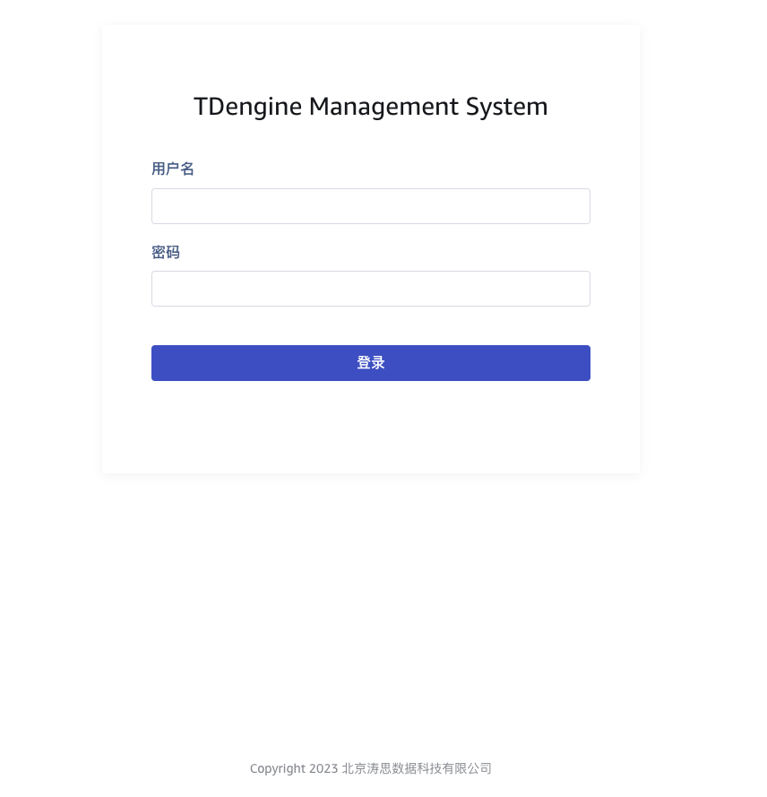

点击登录按钮进入主界面，主界面功能展示如下：

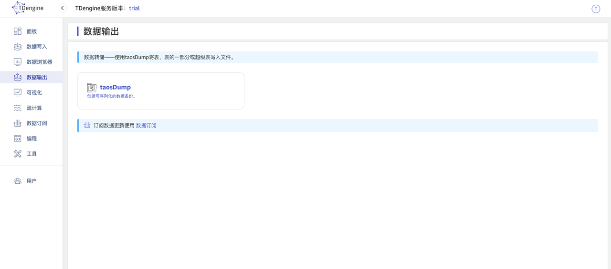

### 面板

taosExplorer 内置了一个简单的仪表盘展示以下集群信息，点击左侧功能列表中的 "面板" 可以启用此功能。

- 默认的仪表盘会返回对应 Grafana 的安装配置向导
- 配置过 Grafana 的仪表盘在点击' 面板' 时会跳转到对应的配置地址（该地址来源于 /profile 接口的返回值）

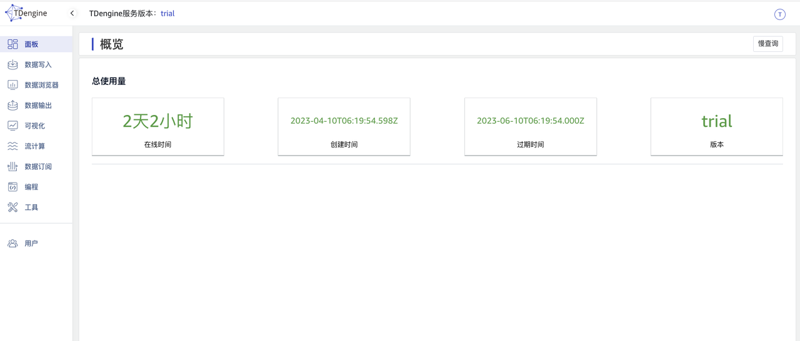

### 数据浏览器

点击功能列表的“数据浏览器”入口，在“数据浏览器”中可以创建和删除数据库、创建和删除超级表和子表，执行SQL语句，查看SQL语句的执行结果。此外，超级管理员还有对数据库的管理权限，其他用户不提供该功能。

具体权限有：

1.查看（提供数据库/超级表/普通表的基本信息）

2.编辑 (编辑数据库/超级表/普通表的信息)

3.数据库管理权限 （仅限超级管理员，该操作可以给指定用户配置数据库管理权限）

4.删除 （删除数据库/超级表/普通表）

5.追加 （选择对应的数据库/超级表/普通表名称直接追加到右侧sql输入区域，避免了手工输入）

例：图为超级管理员权限，展示所有可操作内容

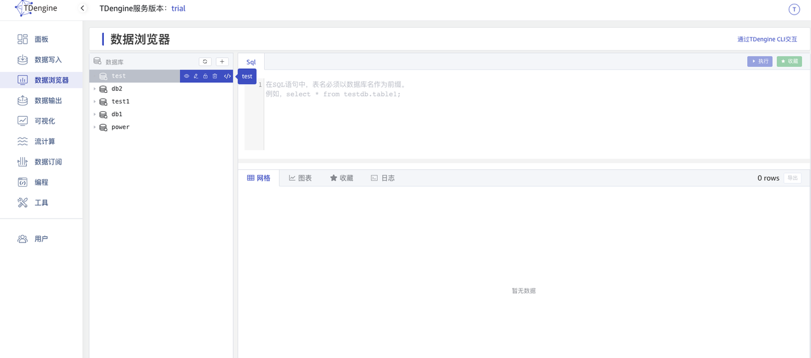

每个数据库下只有一个 STables 和 Tables 文件夹，分别用来添加超级表和普通表

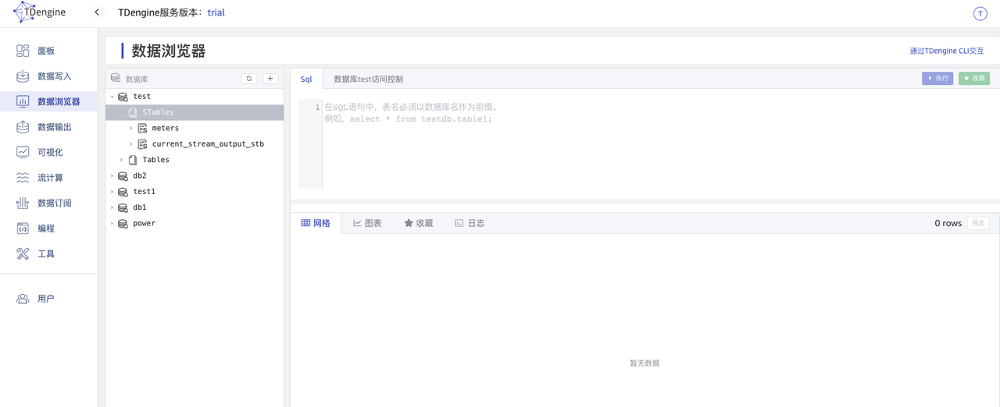

### 系统管理

点击功能列表中的“系统管理”入口，可以创建用户、对用户进行访问授权、以及删除用户。还能够对当前所管理的集群中的数据进行备份和恢复。也可以配置一个远程 TDengine 的地址进行数据同步。同时也提供了集群信息和许可证的信息以及代理信息以供查看。系统管理 菜单只有 root 用户才有权限看到

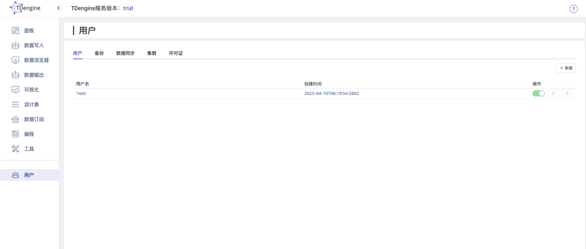

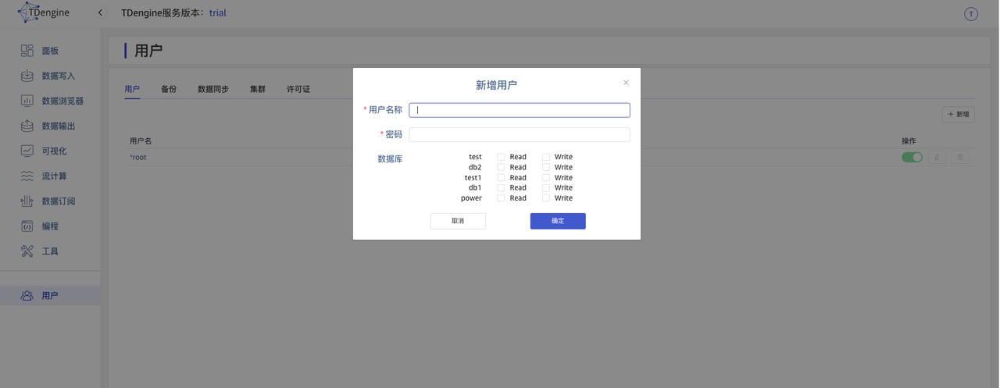

### 数据写入

点击功能列表中的 "数据写入"，可以配置不同类型的数据源，包括 TDengine Subscription, PI, OPC-UA, OPC-DA, InfluxDB和MQTT，将它们的数据写入到当前正在被管理的 TDengine 集群中。

1.可以对已有的数据源进行删除和编辑操作，以及状态修改的操作

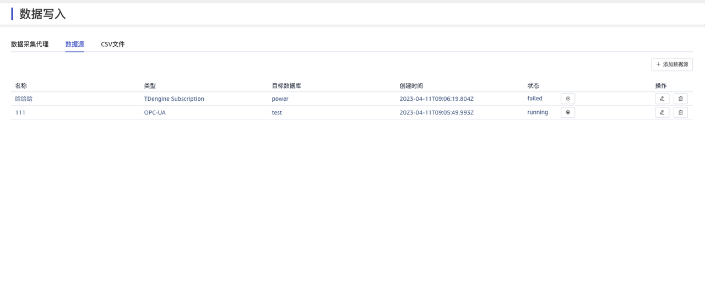

2.目前可以通过启用代理和常规方式添加数据源，代理方式添加只限于当前用户是  root 的情况下。目前提供六种可添加的数据源类型，如图：

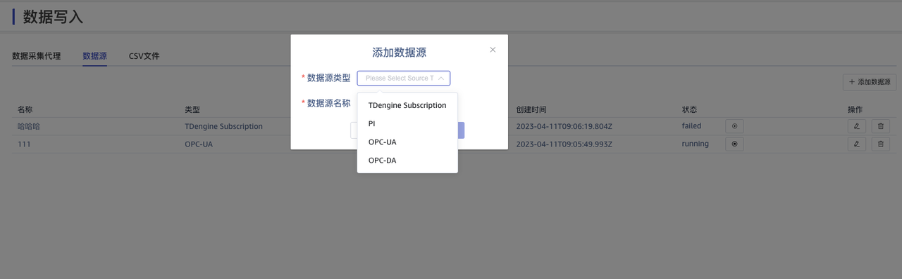

3.添加PI数据类型如图：有红色星号的为必输项，其他的根据需求填写，点击 Submit 即可创建一条新的通过PI数据写入

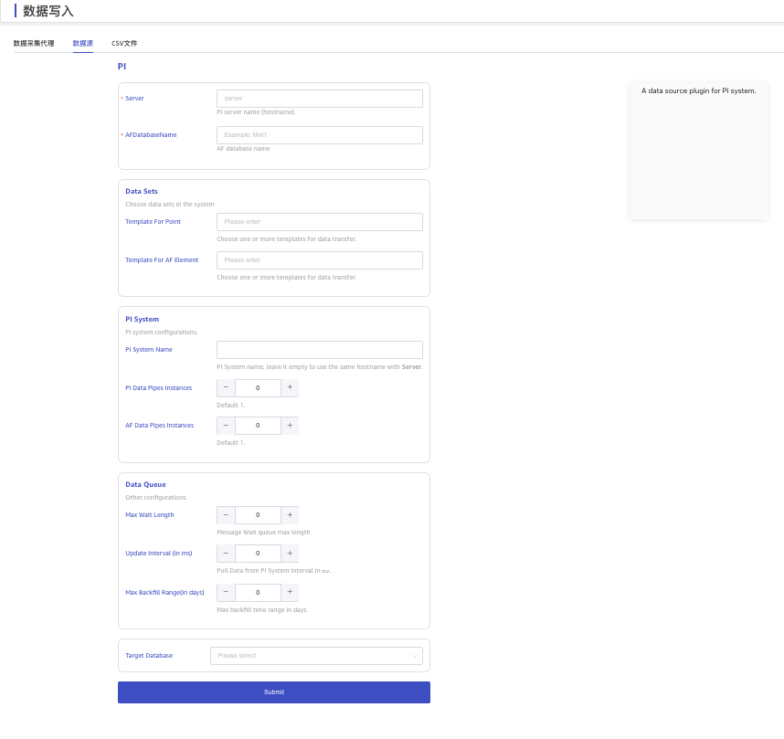

4.新增 opcua 如下。红色星号为必输项，填写对应数据点击 Submit 即可创建一条线的 opcua

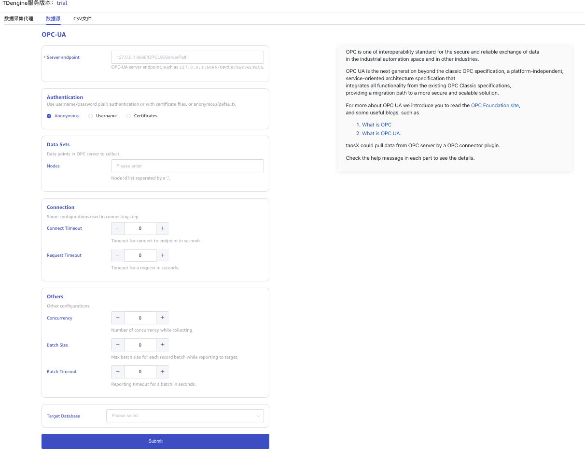

5.创建opcda如下：

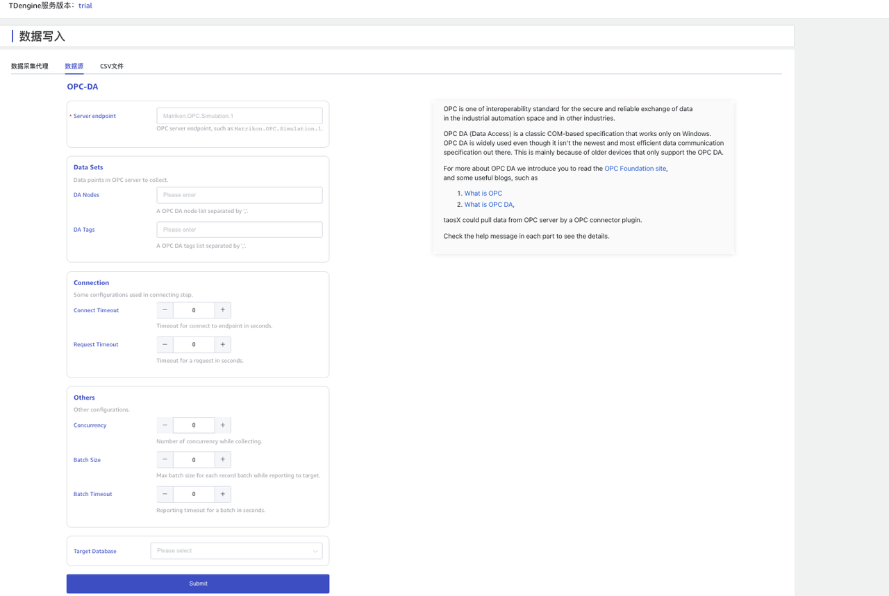

6.创建InfluxDB如下：

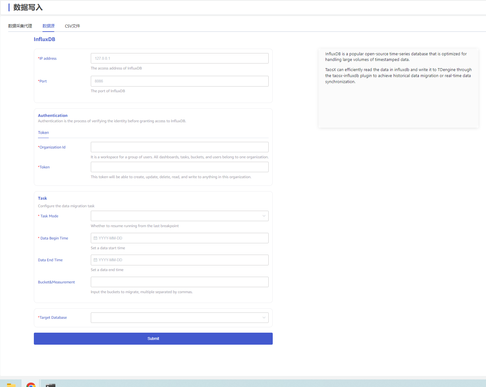


#### 从 TDengine 备份数据文件到本地

@zhengqin，在这里描述简单的操作步骤，以及对图形界面上关键参数的说明（下同）

#### 从本地数据文件恢复到 TDengine

@zhengqin

#### 从 OPC-UA 同步数据到 TDengine

1. 在 OPC-UA页面，配置 OPC-server 的地址，输入格式为 127.0.0.1:6666/OPCUA/ServerPath。
2. 在认证栏，选择访问方式。可以选择匿名访问、用户名密码访问、证书访问。使用证书访问时，需配置证书文件信息、私钥文件信息、OPC-UA 安全协议和 OPC-UA 安全策略
3. 在 Data Sets 栏，配置点位信息。
4. 在连接配置栏，配置连接超时间隔和采集超时间隔（单位：秒），默认值为10秒。
5. 在采集配置栏，配置采集间隔（单位：秒）、点位数量、采集模式。采集模式可选择observe（轮询模式）和subscribe（订阅模式），默认值为observe。
6. 在库表配置栏，配置目标 TDengine 中存储数据的超级表、子表结构信息。
7. 在其他配置栏，配置并行度、单次采集上报批次（默认值100）、上报超时时间（单位：秒，默认值10）、是否开启debug级别日志。
8. 在目标数据库栏，选择需要写入的 TDengine 数据库，点击 submit，即可启动一个 OPC-UA 数据接入任务。

#### 从 OPC-DA 同步数据到 TDengine (Windows)

1. 在 OPC-DA页面，配置 OPC-server 的地址，输入格式为 127.0.0.1<,localhost>/Matrikon.OPC.Simulation.1。
2. 在数据点栏，配置 OPC-DA 采集点信息。
3. 在连接栏，配置连接超时时间（单位：秒，默认值为10秒）、采集超时时间（单位：秒，默认值为10秒）。
4. 在库表配置栏，配置目标 TDengine 中存储数据的超级表、子表结构信息。
5. 在其他配置栏，配置并行度、单次采集上报批次（默认值100）、上报超时时间（单位：秒，默认值10）、是否开启debug级别日志。
6. 在目标数据库栏，选择需要写入的 TDengine 数据库，点击 submit，即可启动一个 OPC-DA 数据接入任务。


#### 从 Pi 同步数据到 TDengine (Windows)

1. 在 PI 数据接入页面，设置 PI 服务器的名称、AF 数据库名称。
2. 在监测点集栏，可以配置选择 Point 模式监测点集合、Point 模式监测的 AF 模板、AF 模式监测的 AF 模板。
3. 在 PI 系统设置栏，可以配置 PI 系统名，默认为 PI 服务器名。
4. 在 Data Queue 栏，可以配置 PI 连接器运行参数：MaxWaitLen（数据最大缓冲条数），默认值为 1000 ,有效取值范围为 [1,10000]；UpdateInterval（PI System 取数据频率），默认值为 10000(毫秒：ms),有效取值范围为 [10,600000]；重启补偿时间（Max Backfill Range，单位：天），每次重启服务时向前补偿该天数的数据，默认为1天。
5. 在目标数据库栏，选择需要写入的 TDengine 数据库，点击 submit ，即可启动一个 PI 数据接入任务。

#### 从 InfluxDB 同步数据到 TDengine

@zhengqin

#### 从 MQTT 同步数据到 TDengine

@xuwang

### 数据订阅

包括主题，消费者，共享主题和示例代码

1.主题：该区域可以进行主题的创建和管理

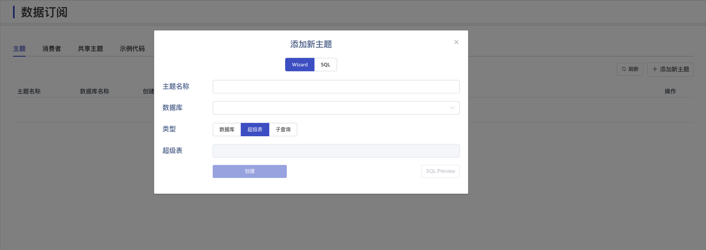

2.消费者：展示消费者信息

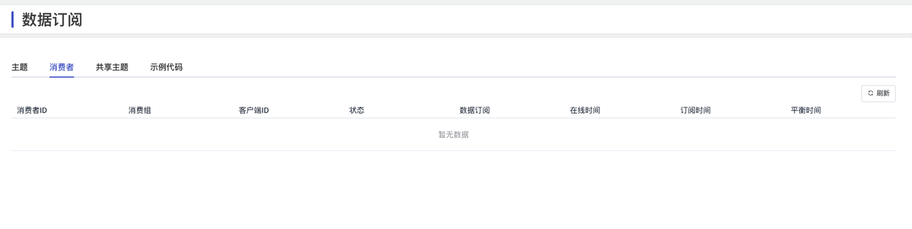

3.共享主题：可将用户添加到共享的主题

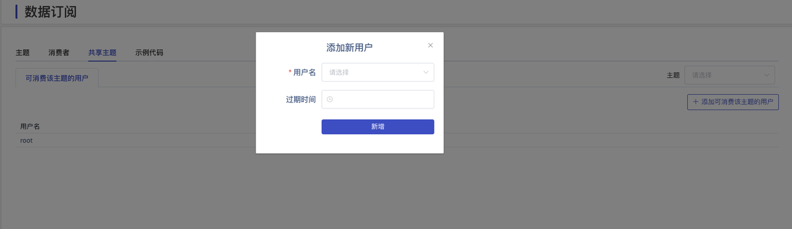

4.示例代码：以文档形式展现

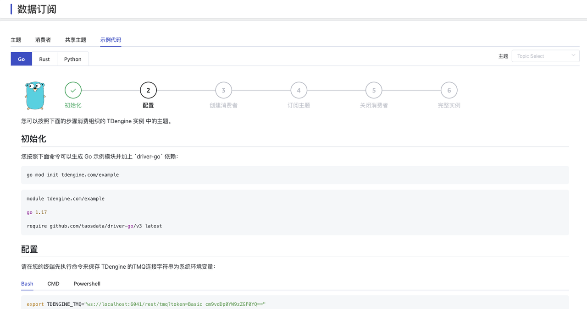

### 流计算

点击功能列表中的“流计算”入口，可以创建和管理流计算。

可通过向导和sql语句两种方式进行流计算的创建。向导目前不支持分组

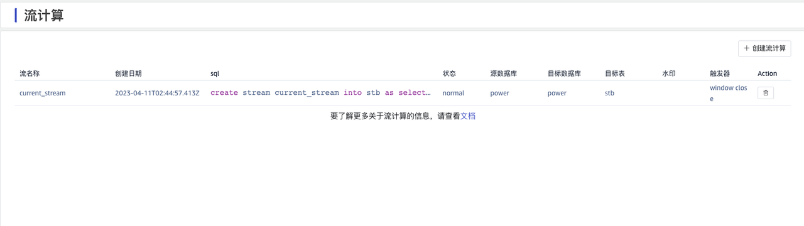

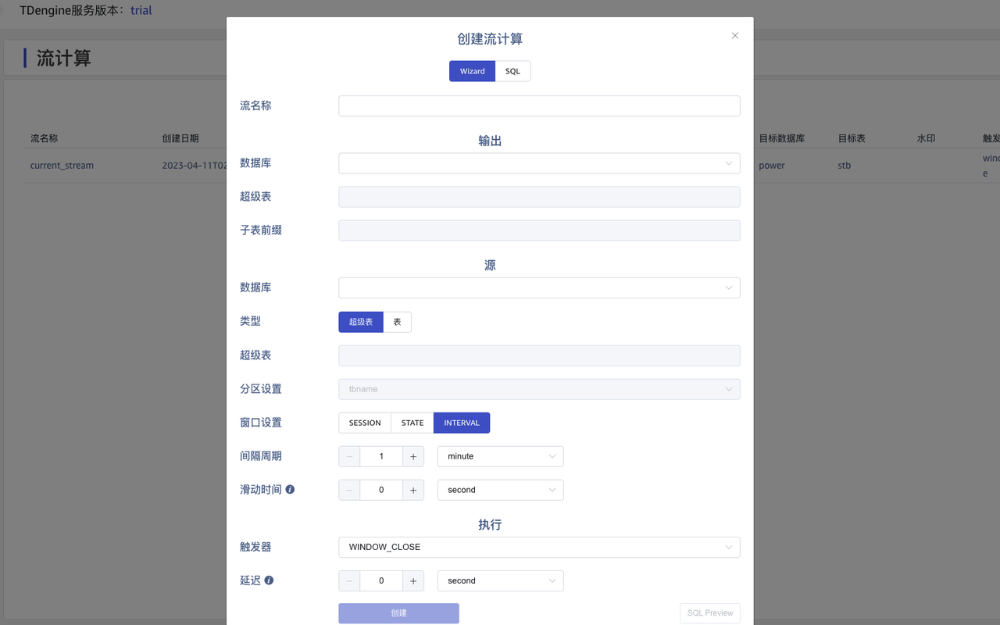

### 可视化

展示grafana和google data studio文档

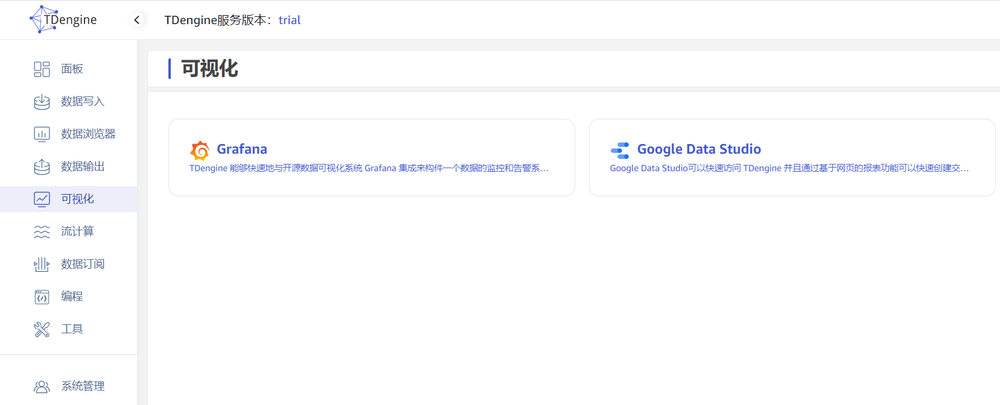

### 编程

展示不同连接器语言的文档

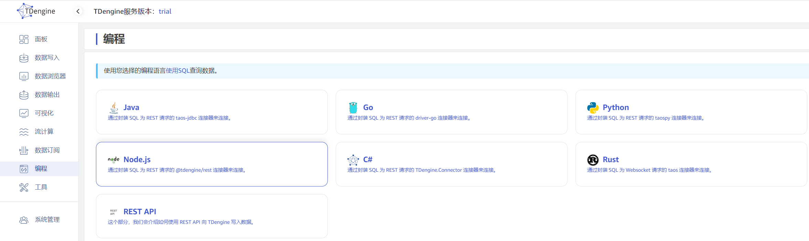

### 工具

展示工具文档

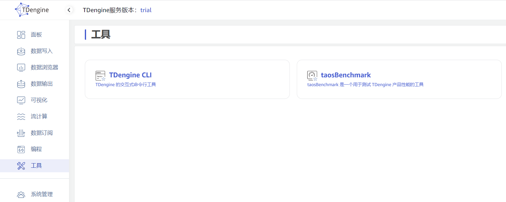

### 数据输出

展示taosdump文档

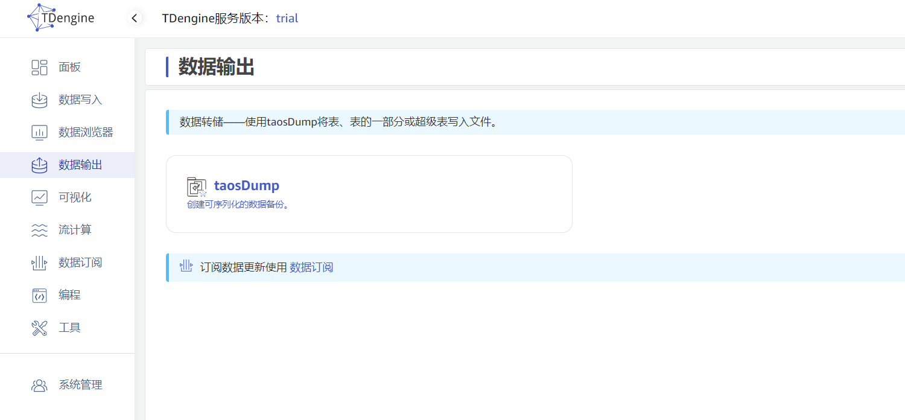

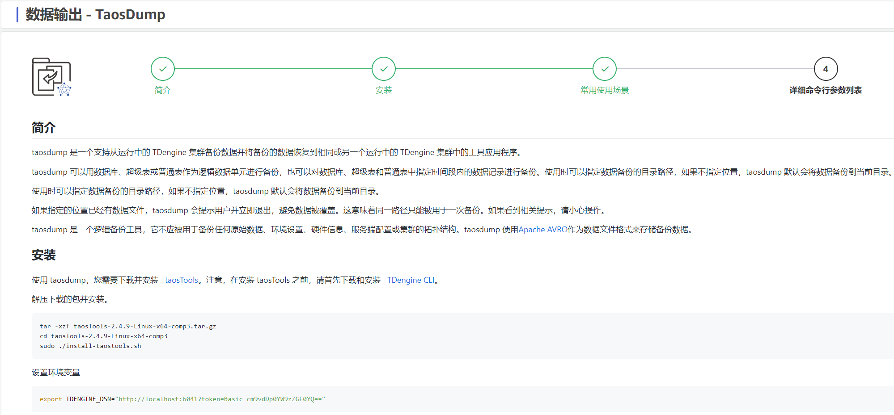
