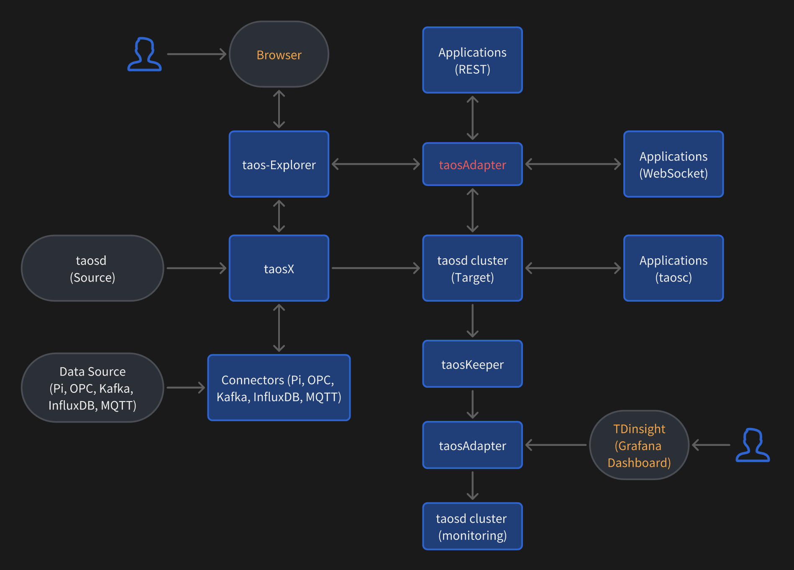

## 简介

本节讲述如何部署 TDengine Pro Tools，TDengine Pro Tools 包含的核心组件在【安装与配置】(../install)中已经做过详细说明。如果只是使用可视化工具管理 TDengine 集群并进行查询等基本操作，则只需要部署 taos-explorer。如果要使用数据接入，数据同步等功能，则需要部署 taosX 和 taos-agent，在此种情况下 taos-explorer 依赖 taosX 完成数据接入和同步，所以下面的服务部署中以 taosX, taos-agent, taos-explorer 的顺利进行。

## 部署架构

下图展示了整个 TDengine 产品生态的部署架构，其所有核心组件都来自于前面章节中讲述过的 TDengine server 安装包以及 TDengine Pro Tools 安装包。



对上图中各组件解释如下：
1. taosd cluster (target) 是指数据写入的目标集群，它也是监控数据产生的源头，同时还是 taos explorer 可视化工具管理的对象
2. taosAdapter 是为 TDengine 集群提供 RESTful 和 Websocket 访问接口的服务
3. taosKeeper 是将监控数据产生的源头产生的监控数据转入存储监控数据的 TDengine 集群的服务
4. taosd cluster (monitor) 是存储监控数据的 TDengine 集群，它既可以和 taosd cluster (target) 在物理上是同一集群，也可以是不同集群，可以按需选择。例如，如果有多个 TDengine 集群需要监控，建议部署一个独立的集群用于存储监控数据，独立于任何存储业务数据的集群。如果受限于资源环境，且只有一套业务系统集群，则可以复用该集群来存储自己的监控数据。
5. taosX 是用于在不同数据源和 TDengine 集群之间传输数据的零代码平台，它可以调用各种数据源的连接器完成数据传输任务。
6. taos explroer 是便于使用和管理 TDengine 集群以及各种数据传输任务的可视化工具。


## 部署 taosX

### 配置

taosX 仅支持通过命令行参数进行配置。服务模式下，taosX 支持的命令行参数可以通过以下方式查看：

```
taosx serve --help
```

建议通过 Systemd 的方式，启动 taosX 的服务模式，其 Systemd 的配置文件位于：`/etc/systemd/system/taosx.service`. 如需修改 taosX 的启动参数，可以编辑该文件中的以下行：

```
ExecStart=/usr/bin/taosx serve -v
```

修改后，需执行以下命令重启 taosX 服务，使配置生效：

```
systemctl daemon-reload
systemctl restart taosx
```

### 启动

Linux 系统上以 Systemd 的方式启动 taosX 的命令如下：

```shell
systemctl start taosx
```

Windows 系统上，请在 "Services" 系统管理工具中找到 "taosX" 服务，然后点击 "启动这个服务"。

### 问题排查

1. 如何修改 taosX 的日志级别？

taosX 的日志级别是通过命令行参数指定的，默认的日志级别为 Info, 具体参数如下：
- INFO: `taosx serve -v`
- DEBUG: `taosx serve -vv`
- TRACE: `taosx serve -vvv`

Systemd 方式启动时，如何修改命令行参数，请参考“配置”章节。

2. 如何查看 taosX 的日志？

以 Systemd 方式启动时，可通过 journalctl 命令查看日志。以滚动方式，实时查看最新日志的命令如下：

```
journalctl -u taosx -f
```

## 部署 Agent 

### 配置

Agent 默认的配置文件位于`/etc/taos/agent.toml`, 包含以下配置项：
- endpoint: 必填，taosX 的 GRPC endpoint
- token: 必填，在 taosExplorer 上创建 agent 时，产生的token
- debug_level: 非必填，默认为 info, 还支持 debug, trace 等级别

如下所示：

```TOML
endpoint = "grpc://<taosx-ip>:6055"
token = "<token>"
log_level = "debug"
```

日志保存时间设置
日志保存的天数可以通过环境变量进行设置 TAOSX_LOGS_KEEP_DAYS， 默认为 30 天。

```shell
export TAOSX_LOGS_KEEP_DAYS=7
```

### 启动

Linux 系统上 Agent 可以通过 Systemd 命令启动：

```
systemctl start taosx-agent
```

Windows 系统上通过系统管理工具 "Services" 找到 taosx-agent 服务，然后启动它。

### 问题排查

可以通过 journalctl 查看 Agent 的日志

```
journalctl -u taosx-agent -f
```

## 部署 taosExplorer

### 准备工作

在启动 taosExplorer 之前，请先确认 TDengine 集群已经正确设置并运行（即 taosd 服务），taosAdapter 也已经正确设置和运行并与 TDengine 集群保持连接状态。如果想要使用数据备份和恢复或者数据同步功能，请确保 taosX 服务和 Agent 服务也已经正确设置和运行。

### 配置

在启动 taosExplorer 之前，请确保配置文件中的内容正确。

```TOML
listen = "0.0.0.0:6060"
log_level = "info"
cluster = "http://localhost:6041"
x_api = "http://localhost:6050"
```

说明：

-   listen - taosExplorer 对外提供服务的地址
-   log_level - 日志级别，可选值为 "debug", "info", "warn", "error", "fatal"
-   cluster - TDengine集群的 taosadapter 地址 
-   x_api - taosX 的服务地址

### 启动

然后启动 taosExplorer，可以直接在命令行执行 taos-explorer 或者使用下面的 systemctl 脚本用 systemctl 来启动 taosExplorer 服务

```shell
[Unit]
Description=Explorer for TDengine
After=network-online.target
Wants=network-online.target

[Service]
Type=simple
ExecStart=/usr/bin/taos-explorer
Restart=always

[Install]
WantedBy=multi-user.target
```

### 问题排查

1. 当通过浏览器打开taosExplorer站点遇到“无法访问此网站”的错误信息时，请通过命令行登录taosExplorer所在机器，并使用命令systemctl status taos-explorer.service检查服务的状态，如果返回的状态是inactive，请使用命令systemctl start taos-explorer.service启动服务。
2. 如果需要获取taosExplorer的详细日志，可通过命令journalctl -u taos-explorer
