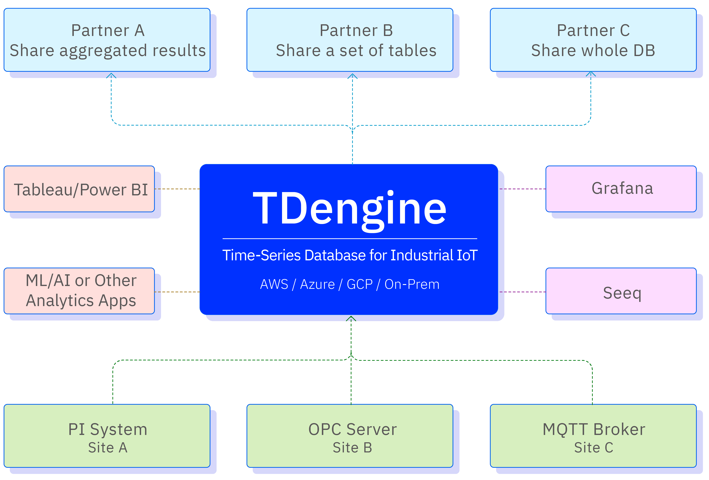

TDengine TSDB 核心是一款高性能、集群开源、云原生的时序数据库（Time Series Database，TSDB），专为物联网 IoT 平台、工业互联网、电力、IT 运维等场景设计并优化，具有极强的弹性伸缩能力。同时它还带有内建的缓存、流式计算、数据订阅等系统功能，能大幅减少系统设计的复杂度，降低研发和运营成本。作为一款高性能、分布式的物联网 IoT、工业大数据平台，TDengine TSDB 能安全高效地将大量设备、数据采集器每天产生的高达 TB 甚至 PB 级的数据进行汇聚、存储、分析和分发，对业务运行状态进行实时监测、预警，提供实时的商业洞察。

2019 年 7 月，涛思数据将 TDengine TSDB 单机版开源，又分别在 2020 年 8 月和 2022 年 8 月，将 TDengine TSDB 集群版和云原生版开源。开源后，TDengine 迅速获得了全球开发者的关注，多次登上 GitHub 全球趋势排行榜首位。最新的关注热度见[涛思数据首页](https://www.taosdata.com/)。

## TDengine TSDB 产品分类

TDengine 包括开源版 TDengine TSDB-OSS、企业版 TDengine TSDB-Enterprise 以及云服务 TDengine Cloud。
- TDengine TSDB-OSS 是一款开源、高性能、云原生的时序数据库，具有极强的弹性伸缩能力，同时带有内建的缓存、流式计算、数据订阅等功能，能大幅减少系统设计的复杂度，降低研发和运营成本，是一个极简的时序数据处理平台。更多细节请看 [TDengine TSDB-OSS](https://www.taosdata.com/tdengine-oss)。
- TDengine TSDB-Enterprise 是私有化部署的 TDengine TSDB，可部署在边缘侧、本地、公有云/私有云上，具备开源版本所不具备的诸多企业版功能，细节请看 [TDengine TSDB-Enterprise](https://www.taosdata.com/tdengine-enterprise)。
- TDengine Cloud 是一个全托管的物联网、工业大数据云服务平台，尤其适合尤其适合中小规模的用户使用，细节请看 [TDengine Cloud](https://cloud.taosdata.com)。

## TDengine TSDB 主要功能与特性

TDengine TSDB 既不依赖任何第三方软件，也不是优化或包装了一个开源的数据库或流式计算产品，而是基于涛思数据团队对众多传统关系型数据库、NoSQL 数据库、流式计算引擎、消息队列等软件的深入吸收和自主创新。TDengine TSDB 具备时序数据汇聚、存储、分析与分发的功能，并拥有独特的技术优势。

- **数据汇聚：**TDengine TSDB 能将各种类型的数据源，包括 MQTT、OPC UA、OPC DA、Kafka、CSV，传统实时数据库如 PI System、Wonderware 等数据进行汇聚，并进行数据的清洗、加工和转换，确保入库数据的质量、便于集中监测和数据整体分析。
- **数据存储：**TDengine TSDB 将汇聚的数据进行高效存储，通过列式存储、两级压缩以及针对不同数据类型的不同压缩算法等技术手段，实现了比通用数据库高十倍以上的压缩率。同时，通过按时间段分区、按设备分片、存算分离等技术，TDengine TSDB 提供了强大的水平扩展能力。
- **数据分析：**TDengine TSDB 支持标准的 SQL 查询，并提供时序数据扩展函数 (如时间加权平均)。它还支持嵌套查询、UDF 和实时流式计算。通过标准的 JDBC、ODBC 接口，TDengine TSDB 能与众多的可视化、BI、AI/ML 工具，如 Grafana、Power BI 等无缝集成，方便用户进行更高级的数据分析。
- **数据分发：**TDengine TSDB 提供数据订阅功能，允许将一个数据库、一张超级表、一组表或单张表的数据、以及在特定时间段聚合、过滤加工处理后的数据实时分发给第三方应用。这一功能不仅实现了数据分发的颗粒度精细可控，而且通过权限控制及加密等措施确保了数据分发的安全。

## TDengine TSDB 与典型时序数据库的区别

由于充分利用了时序数据特点，并采用独特创新的“一个数据采集点一张表” “超级表”的属于模型，与其他时序数据库相比，TDengine TSDB 拥有以下特点：

1. **快 10 倍以上的读写性能：**充分利用时序大数据的特点，TDengine TSDB 设计了新颖的存储引擎，大幅提升了数据的写入和查询速度，同时也大幅提高了数据压缩率。相对通用数据库，读、写、数据压缩性能至少高十倍以上；TSBS 基准测试结果显示，相对于 TimescaleDB、InfluxDB，性能也是远超。
2. **不到 1/10 的存储成本：**TDengine TSDB 提供多种压缩算法，压缩比业界领先，能将数据集压缩至原始大小的 1/10。并且提供了数据分级存储、S3 存储等功能，将不同时间段的数据存储在挂载的不同介质上的目录里，从而实现不同“热度”的数据存储在不同的存储介质上，充分利用压缩、存储，节约成本。支持 10 亿数据采集点的水平扩展能力，TDengine TSDB 从设计的第一天起，就是水平扩展的。从 3.0 起，TDengine TSDB 支持云原生，能充分利用云平台的存储、计算、网络资源的弹性能力。在 10 亿时间线，100 个数据节点的情况下，TDengine TSDB 性能也能得到很好的保证。时序数据处理中的“高基数”问题完全得到了解决。零代码的高效数据汇聚，TDengine TSDB 能将来自各种类型数据源（如 PI System、MQTT、OPC 等）的工业数据汇聚到一起，并可以进行数据的清洗、加工、转换工作，以保证入库数据的质量，便于集中监测、进行总体数据分析。TDengine TSDB 是一个零代码平台，只需很少的配置，即可实现工业数据源的 ETL 流程。
3. **全栈时序数据处理平台：**为了降低系统设计复杂度和运行成本，TDengine TSDB 充分利用时序数据的特点，构建了自己的缓存、流式计算和数据订阅功能。它不仅提供了一种高效的时序数据存储和分析方式，还为时序数据的处理提供了一种极简的解决方案。
4. **开放的生态系统：**不仅核心代码开源，支持标准 SQL 查询，还提供标准化接口，可以通过 ODBC、JDBC 及各种编程语言连接器集成可视化、AI/BI 工具。支持 PI System、MQTT、OPC 等工业数据接口，简化工业数据的 ETL 流程。高效的数据订阅工具实现便捷、安全的数据共享，避免被厂商绑定。

## 技术生态

在整个时序大数据平台中，TDengine TSDB 扮演的角色如下：

<figure>

<figcaption>TDengine TSDB 的技术生态图</figcaption>
</figure>

## 典型适用场景

作为一款基础软件，TDengine TSDB 的应用领域极其广泛。原则上，所有涉及机器、设备、传感器采集数据的场景都适用，包括但不限于 IoT、工业互联网、车联网、IT 运维、能源、金融证券等领域。需要指出的是，TDengine TSDB 是针对时序数据场景设计的专用数据库和专用大数据处理工具，因其充分利用了时序大数据的特点，它无法用来处理网络爬虫、微博、微信、电商、ERP、CRM 等通用型数据。下面本文将对适用场景做更多详细的分析。

### 数据源特点和需求

从数据源角度，设计人员可以从下面几个角度分析 TDengine TSDB 在目标应用系统里面的适用性。

| 数据源特点和需求             | 不适用 | 可能适用 | 非常适用 | 简单说明                                                                                                                        |
| ---------------------------- | ------ | -------- | -------- | ------------------------------------------------------------------------------------------------------------------------------- |
| 总体数据量巨大               |        |          | √        | TDengine TSDB 在容量方面提供出色的水平扩展功能，并且具备匹配高压缩的存储结构，达到业界最优的存储效率。                               |
| 数据输入速度偶尔或者持续巨大 |        |          | √        | TDengine TSDB 的性能大大超过同类产品，可以在同样的硬件环境下持续处理大量的输入数据，并且提供很容易在用户环境里面运行的性能评估工具。 |
| 数据源数目巨大               |        |          | √        | TDengine TSDB 设计中包含专门针对大量数据源的优化，包括数据的写入和查询，尤其适合高效处理海量（千万或者更多量级）的数据源。           |

### 系统架构要求

| 系统架构要求           | 不适用 | 可能适用 | 非常适用 | 简单说明                                                                                              |
| ---------------------- | ------ | -------- | -------- | ----------------------------------------------------------------------------------------------------- |
| 要求简单可靠的系统架构 |        |          | √        | TDengine TSDB 的系统架构非常简单可靠，自带消息队列，缓存，流式计算，监控等功能，无需集成额外的第三方产品。 |
| 要求容错和高可靠       |        |          | √        | TDengine TSDB 的集群功能，自动提供容错灾备等高可靠功能。                                                   |
| 标准化规范             |        |          | √        | TDengine TSDB 使用标准的 SQL 语言提供主要功能，遵守标准化规范。                                            |

### 系统功能需求

| 系统功能需求               | 不适用 | 可能适用 | 非常适用 | 简单说明                                                                                                                  |
| -------------------------- | ------ | -------- | -------- | ------------------------------------------------------------------------------------------------------------------------- |
| 要求完整的内置数据处理算法 |        | √        |          | TDengine TSDB 实现了通用的数据处理算法，但是还没有做到妥善处理各行各业的所有需求，因此特殊类型的处理需求还需要在应用层面解决。 |
| 需要大量的交叉查询处理     |        | √        |          | 这种类型的处理更多应该用关系型数据库处理，或者应该考虑 TDengine TSDB 和关系型数据库配合实现系统功能。                          |

### 系统性能需求

| 系统性能需求           | 不适用 | 可能适用 | 非常适用 | 简单说明                                                                                           |
| ---------------------- | ------ | -------- | -------- | -------------------------------------------------------------------------------------------------- |
| 要求较大的总体处理能力 |        |          | √        | TDengine TSDB 的集群功能可以轻松地让多服务器配合达成处理能力的提升。                                    |
| 要求高速处理数据       |        |          | √        | TDengine TSDB 专门为 IoT 优化的存储和数据处理设计，一般可以让系统得到超出同类产品多倍数的处理速度提升。 |
| 要求快速处理小粒度数据 |        |          | √        | 这方面 TDengine TSDB 性能可以完全对标关系型和 NoSQL 型数据处理系统。                                    |

### 系统维护需求

| 系统维护需求           | 不适用 | 可能适用 | 非常适用 | 简单说明                                                                                                              |
| ---------------------- | ------ | -------- | -------- | --------------------------------------------------------------------------------------------------------------------- |
| 要求系统可靠运行       |        |          | √        | TDengine TSDB 的系统架构非常稳定可靠，日常维护也简单便捷，对维护人员的要求简洁明了，最大程度上杜绝人为错误和事故。         |
| 要求运维学习成本可控   |        |          | √        | 同上。                                                                                                                |
| 要求市场有大量人才储备 | √      |          |          | TDengine TSDB 作为新一代产品，目前人才市场里面有经验的人员还有限。但是学习成本低，我们作为厂家也提供运维的培训和辅助服务。 |

## 与其他数据库的对比测试

- [用 InfluxDB 开源的性能测试工具对比 InfluxDB 和 TDengine](https://www.taosdata.com/blog/2020/01/13/1105.html)
- [TDengine 与 OpenTSDB 对比测试](https://www.taosdata.com/blog/2019/08/21/621.html)
- [TDengine 与 Cassandra 对比测试](https://www.taosdata.com/blog/2019/08/14/573.html)
- [TDengine VS InfluxDB，写入性能大 PK！](https://www.taosdata.com/2021/11/05/3248.html)
- [TDengine 和 InfluxDB 查询性能对比测试报告](https://www.taosdata.com/2022/02/22/5969.html)
- [TDengine 与 InfluxDB、OpenTSDB、Cassandra、MySQL、ClickHouse 等数据库的对比测试报告](https://www.taosdata.com/downloads/TDengine_Testing_Report_cn.pdf)