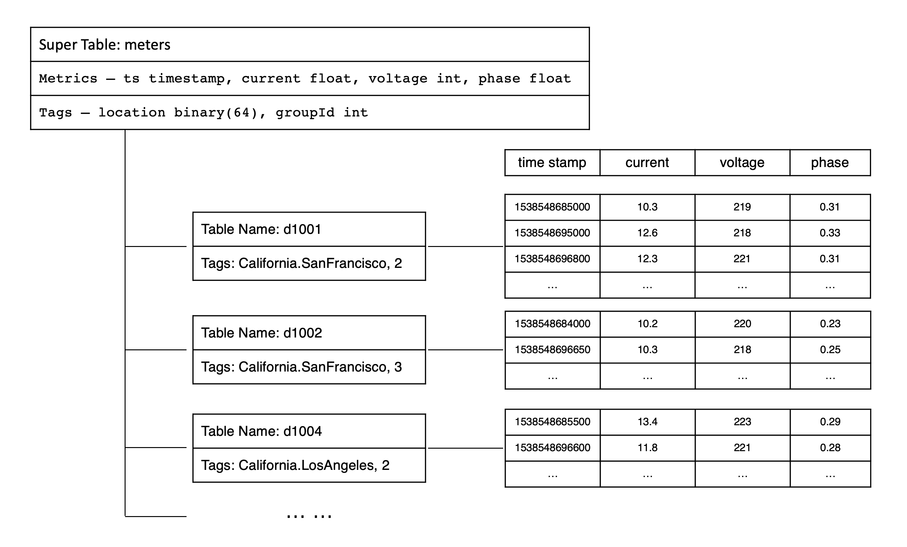

为了便于解释基本概念，便于撰写示例程序，整个 TDengine 文档以智能电表作为典型时序数据场景。假设每个智能电表采集电流、电压、相位三个量，有多个智能电表，每个电表有位置 Location 和分组 Group ID 的静态属性. 其采集的数据类似如下的表格：

<table>
  <thead>
    <tr>
      <th rowSpan="2">Device ID</th>
      <th rowSpan="2">Timestamp</th>
      <th colSpan="3">Collected Metrics</th>
      <th colSpan="2">Tags</th>
    </tr>
    <tr>
      <th>current</th>
      <th>voltage</th>
      <th>phase</th>
      <th>location</th>
      <th>groupid</th>
    </tr>
  </thead>
  <tbody>
    <tr>
      <td>d1001</td>
      <td>1538548685000</td>
      <td>10.3</td>
      <td>219</td>
      <td>0.31</td>
      <td>California.SanFrancisco</td>
      <td>2</td>
    </tr>
    <tr>
      <td>d1002</td>
      <td>1538548684000</td>
      <td>10.2</td>
      <td>220</td>
      <td>0.23</td>
      <td>California.SanFrancisco</td>
      <td>3</td>
    </tr>
    <tr>
      <td>d1003</td>
      <td>1538548686500</td>
      <td>11.5</td>
      <td>221</td>
      <td>0.35</td>
      <td>California.LosAngeles</td>
      <td>3</td>
    </tr>
    <tr>
      <td>d1004</td>
      <td>1538548685500</td>
      <td>13.4</td>
      <td>223</td>
      <td>0.29</td>
      <td>California.LosAngeles</td>
      <td>2</td>
    </tr>
    <tr>
      <td>d1001</td>
      <td>1538548695000</td>
      <td>12.6</td>
      <td>218</td>
      <td>0.33</td>
      <td>California.SanFrancisco</td>
      <td>2</td>
    </tr>
    <tr>
      <td>d1004</td>
      <td>1538548696600</td>
      <td>11.8</td>
      <td>221</td>
      <td>0.28</td>
      <td>California.LosAngeles</td>
      <td>2</td>
    </tr>
    <tr>
      <td>d1002</td>
      <td>1538548696650</td>
      <td>10.3</td>
      <td>218</td>
      <td>0.25</td>
      <td>California.SanFrancisco</td>
      <td>3</td>
    </tr>
    <tr>
      <td>d1001</td>
      <td>1538548696800</td>
      <td>12.3</td>
      <td>221</td>
      <td>0.31</td>
      <td>California.SanFrancisco</td>
      <td>2</td>
    </tr>
  </tbody>
</table>
<a name="#model_table1">表 1. 智能电表数据示例</a>

每一条记录都有设备 ID、时间戳、采集的物理量（如上表中的 `current`、`voltage` 和 `phase`）以及每个设备相关的静态标签（`location` 和 `groupid`）。每个设备是受外界的触发，或按照设定的周期采集数据。采集的数据点是时序的，是一个数据流。

## 采集量（Metric）

采集量是指传感器、设备或其他类型采集点采集的物理量，比如电流、电压、温度、压力、GPS 位置等，是随时间变化的，数据类型可以是整型、浮点型、布尔型，也可是字符串。随着时间的推移，存储的采集量的数据量越来越大。智能电表示例中的电流、电压、相位就是采集量。

## 标签（Label/Tag）

标签是指传感器、设备或其他类型采集点的静态属性，不是随时间变化的，比如设备型号、颜色、设备的所在地等，数据类型可以是任何类型。虽然是静态的，但 TDengine 容许用户修改、删除或增加标签值。与采集量不一样的是，随时间的推移，存储的标签的数据量不会有什么变化。智能电表示例中的 `location` 与 `groupid` 就是标签。

## 数据采集点（Data Collection Point）

数据采集点是指按照预设时间周期或受事件触发采集物理量的硬件或软件。一个数据采集点可以采集一个或多个采集量，**但这些采集量都是同一时刻采集的，具有相同的时间戳**。对于复杂的设备，往往有多个数据采集点，每个数据采集点采集的周期都可能不一样，而且完全独立，不同步。比如对于一台汽车，有数据采集点专门采集 GPS 位置，有数据采集点专门采集发动机状态，有数据采集点专门采集车内的环境，这样一台汽车就有三个数据采集点。智能电表示例中的 d1001、d1002、d1003、d1004 等就是数据采集点。

## 表（Table）

因为采集量一般是结构化数据，同时为降低学习门槛，TDengine 采用传统的关系型数据库模型管理数据。用户需要先创建库，然后创建表，之后才能插入或查询数据。

为充分利用其数据的时序性和其他数据特点，TDengine 采取**一个数据采集点一张表**的策略，要求对每个数据采集点单独建表（比如有一千万个智能电表，就需创建一千万张表，上述表格中的 d1001，d1002，d1003，d1004 都需单独建表），用来存储这个数据采集点所采集的时序数据。这种设计有几大优点：

1. 由于不同数据采集点产生数据的过程完全独立，每个数据采集点的数据源是唯一的，一张表也就只有一个写入者，这样就可采用无锁方式来写，写入速度就能大幅提升。
2. 对于一个数据采集点而言，其产生的数据是按照时间排序的，因此写的操作可用追加的方式实现，进一步大幅提高数据写入速度。
3. 一个数据采集点的数据是以块为单位连续存储的。如果读取一个时间段的数据，它能大幅减少随机读取操作，成数量级的提升读取和查询速度。
4. 一个数据块内部，采用列式存储，对于不同数据类型，采用不同压缩算法，而且由于一个数据采集点的采集量的变化是缓慢的，压缩率更高。

如果采用传统的方式，将多个数据采集点的数据写入一张表，由于网络延时不可控，不同数据采集点的数据到达服务器的时序是无法保证的，写入操作是要有锁保护的，而且一个数据采集点的数据是难以保证连续存储在一起的。**采用一个数据采集点一张表的方式，能最大程度的保证单个数据采集点的插入和查询的性能是最优的。**

TDengine 建议用数据采集点的名字（如上表中的 d1001）来做表名。每个数据采集点可能同时采集多个采集量（如上表中的 `current`、`voltage` 和 `phase`），每个采集量对应一张表中的一列，数据类型可以是整型、浮点型、字符串等。除此之外，表的第一列必须是时间戳，即数据类型为 Timestamp。对采集量，TDengine 将自动按照时间戳建立索引，但对采集量本身不建任何索引。数据用列式存储方式保存。

对于复杂的设备，比如汽车，它有多个数据采集点，那么就需要为一辆汽车建立多张表。

## 超级表（STable）

由于一个数据采集点一张表，导致表的数量巨增，难以管理，而且应用经常需要做采集点之间的聚合操作，聚合的操作也变得复杂起来。为解决这个问题，TDengine 引入超级表（Super Table，简称为 STable）的概念。

超级表是指某一特定类型的数据采集点的集合。同一类型的数据采集点，其表的结构是完全一样的，但每个表（数据采集点）的静态属性（标签）是不一样的。描述一个超级表（某一特定类型的数据采集点的集合），除需要定义采集量的表结构之外，还需要定义其标签的 Schema，标签的数据类型可以是整数、浮点数、字符串、JSON，标签可以有多个，可以事后增加、删除或修改。如果整个系统有 N 个不同类型的数据采集点，就需要建立 N 个超级表。

在 TDengine 的设计里，**表用来代表一个具体的数据采集点，超级表用来代表一组相同类型的数据采集点集合**。智能电表示例中，我们可以创建一个超级表 `meters`.

## 子表（Subtable）

当为某个具体数据采集点创建表时，用户可以使用超级表的定义做模板，同时指定该具体采集点（表）的具体标签值来创建该表。**通过超级表创建的表称之为子表**。正常的表与子表的差异在于：

1. 子表就是表，因此所有正常表的 SQL 操作都可以在子表上执行。
2. 子表在正常表的基础上有扩展，它是带有静态标签的，而且这些标签可以事后增加、删除、修改，而正常的表没有。
3. 子表一定属于一张超级表，但普通表不属于任何超级表
4. 普通表无法转为子表，子表也无法转为普通表。

超级表与基于超级表建立的子表之间的关系表现在：

1. 一张超级表包含有多张子表，这些子表具有相同的采集量 Schema，但带有不同的标签值。
2. 不能通过子表调整数据或标签的模式，对于超级表的数据模式修改立即对所有的子表生效。
3. 超级表只定义一个模板，自身不存储任何数据或标签信息。因此，不能向一个超级表写入数据，只能将数据写入子表中。

查询既可以在表上进行，也可以在超级表上进行。针对超级表的查询，TDengine 将把所有子表中的数据视为一个整体数据集进行处理，会先把满足标签过滤条件的表从超级表中找出来，然后再扫描这些表的时序数据，进行聚合操作，这样需要扫描的数据集会大幅减少，从而显著提高查询的性能。本质上，TDengine 通过对超级表查询的支持，实现了多个同类数据采集点的高效聚合。

TDengine 系统建议给一个数据采集点建表，需要通过超级表建表，而不是建普通表。在智能电表的示例中，我们可以通过超级表 meters 创建子表 d1001、d1002、d1003、d1004 等。

为了更好地理解采集量、标签、超级与子表的关系，可以参考下面关于智能电表数据模型的示意图。

<figure>

<figcaption>图 1. 智能电表数据模型示意图</figcaption>

</figure>

## 库（Database）

库是指一组表的集合。TDengine 容许一个运行实例有多个库，而且每个库可以配置不同的存储策略。不同类型的数据采集点往往具有不同的数据特征，包括数据采集频率的高低，数据保留时间的长短，副本的数目，数据块的大小，是否允许更新数据等等。为了在各种场景下 TDengine 都能最大效率的工作，TDengine 建议将不同数据特征的超级表创建在不同的库里。

一个库里，可以有一到多个超级表，但一个超级表只属于一个库。一个超级表所拥有的子表全部存在一个库里。

## FQDN & Endpoint

FQDN（Fully Qualified Domain Name，完全限定域名）是 Internet 上特定计算机或主机的完整域名。FQDN 由两部分组成:主机名和域名。例如，假设邮件服务器的 FQDN 可能是 mail.tdengine.com。主机名是 mail，主机位于域名 tdengine.com 中。DNS（Domain Name System），负责将 FQDN 翻译成 IP，是互联网应用的寻址方式。对于没有 DNS 的系统，可以通过配置 hosts 文件来解决。

TDengine 集群的每个节点是由 Endpoint 来唯一标识的，Endpoint 是由 FQDN 外加 Port 组成，比如 h1.tdengine.com:6030。这样当 IP 发生变化的时候，我们依然可以使用 FQDN 来动态找到节点，不需要更改集群的任何配置。而且采用 FQDN，便于内网和外网对同一个集群的统一访问。

TDengine 不建议采用直接的 IP 地址访问集群，不利于管理。不了解 FQDN 概念，请看博文[《一篇文章说清楚 TDengine 的 FQDN》](https://www.taosdata.com/blog/2020/09/11/1824.html)。
