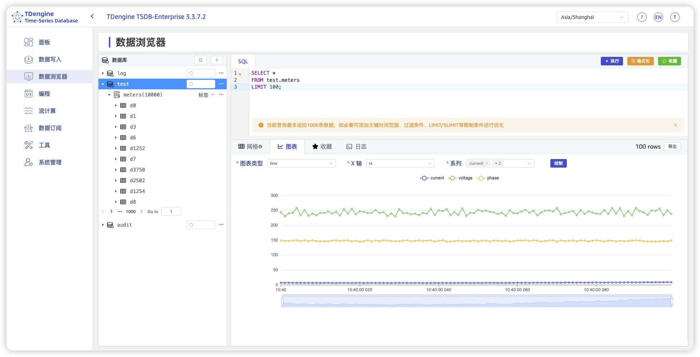
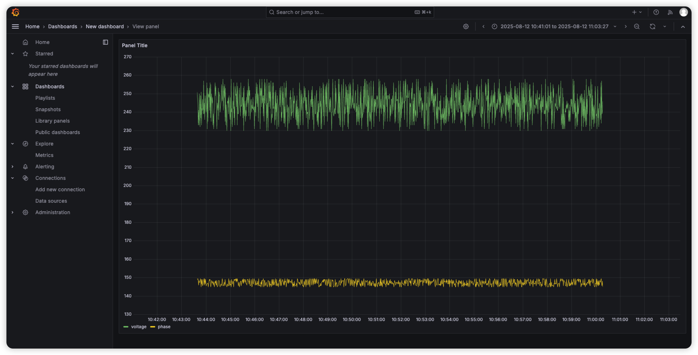

## 快速体验

### 体验 TDengine TSDB 命令行

为便于检查 TDengine 的状态，执行数据库（Database）的各种即席（Ad Hoc）查询，TDengine TSDB 提供一命令行应用程序（以下简称为 TDengine TSDB CLI）taos。要进入 TDengine 命令行，您只要在终端执行 `taos` (Linux/Mac) 或 `taos.exe` (Windows) 即可。TDengine CLI 的提示符号如下：

```cmd
taos>
```

在 TDengine TSDB CLI 中，用户可以通过 SQL 命令来创建/删除数据库、表等，并进行数据库（Database）插入查询操作。在终端中运行的 SQL 语句需要以分号（;）结束来运行。示例：

```sql
CREATE DATABASE demo;
USE demo;
CREATE TABLE t (ts TIMESTAMP, speed INT);
INSERT INTO t VALUES ('2019-07-15 00:00:00', 10);
INSERT INTO t VALUES ('2019-07-15 01:00:00', 20);
SELECT * FROM t;

           ts            |    speed    |
========================================
 2019-07-15 00:00:00.000 |          10 |
 2019-07-15 01:00:00.000 |          20 |

Query OK, 2 row(s) in set (0.003128s)
```

除执行 SQL 语句外，系统管理员还可以从 TDengine TSDB CLI 进行检查系统运行状态、添加删除用户账号等操作。TDengine TSDB CLI 连同应用驱动也可以独立安装在机器上运行，更多细节请参考 [TDengine TSDB 命令行](../../reference/tools/taos-cli/)。

### 体验写入

taosBenchmark 是一个专为测试 TDengine 性能而设计的工具，它能够全面评估 TDengine 在写入、查询和订阅等方面的功能表现。该工具能够模拟大量设备产生的数据，并允许用户灵活控制数据库、超级表、标签列的数量和类型、数据列的数量和类型、子表数量、每张子表的数据量、写入数据的时间间隔、工作线程数量以及是否写入乱序数据等策略。

启动 TDengine 的服务，在终端中执行如下命令

```shell
taosBenchmark -y
```

系统将自动在数据库 test 下创建一张名为 meters 的超级表。这张超级表将包含 10,000 张子表，表名从 d0 到 d9999，每张表包含 10,000 条记录。每条记录包含 ts（时间戳）、current（电流）、voltage（电压）和 phase（相位）4 个字段。时间戳范围从“2017-07-14 10:40:00 000”到“2017-07-14 10:40:09 999”。每张表还带有 location 和 groupId 两个标签，其中，groupId 设置为 1 到 10，而 location 则设置为 California.Campbell、California.Cupertino 等城市信息。

执行该命令后，系统将迅速完成 1 亿条记录的写入过程。实际所需时间取决于硬件性能，但即便在普通 PC 服务器上，这个过程通常也只需要十几秒。

taosBenchmark 提供了丰富的选项，允许用户自定义测试参数，如表的数目、记录条数等。要查看详细的参数列表，请在终端中输入如下命令

```shell
taosBenchmark --help
```

有关 taosBenchmark 的详细使用方法，请参考 [taosBenchmark 参考手册](../../reference/tools/taosbenchmark)

### 体验查询

使用上述 taosBenchmark 插入数据后，可以在 TDengine CLI（taos）输入查询命令，体验查询速度。

1. 查询超级表 meters 下的记录总条数

```shell
SELECT COUNT(*) FROM test.meters;
```

2. 查询 1 亿条记录的平均值、最大值、最小值

```shell
SELECT AVG(current), MAX(voltage), MIN(phase) FROM test.meters;
```

3. 查询 location = "California.SanFrancisco" 的记录总条数

```shell
SELECT COUNT(*) FROM test.meters WHERE location = "California.SanFrancisco";
```

4. 查询 groupId = 10 的所有记录的平均值、最大值、最小值

```shell
SELECT AVG(current), MAX(voltage), MIN(phase) FROM test.meters WHERE groupId = 10;
```

5. 对表 d1001 按每 10 秒进行平均值、最大值和最小值聚合统计

```shell
SELECT _wstart, AVG(current), MAX(voltage), MIN(phase) FROM test.d1001 INTERVAL(10s);
```

在上面的查询中，使用系统提供的伪列 _wstart 来给出每个窗口的开始时间。

### 体验 taosExplorer

taosExplorer 是一个可视化工具，使用户可以通过浏览器，以直观地方式使用和管理 TDeninge.

1. 打开浏览器，访问 taosExplorer 的地址，默认端口为 `6060`，如果您在本地运行 TDengine, 可以直接访问 [http://localhost:6060](http://localhost:6060).
2. 进入“TDengine 管理系统”页面，输入用户名和密码（默认为：`root/taosdata`），点击“登录”按钮，即可登录。
3. 登录后，您将进入“数据浏览器”页面。在这里，您可以查看数据库、超级表、子表等信息，并执行 SQL 查询。



除此以外，在“编程”页面，可以查看 TDengine 所支持的各种编程语言（包括：Java, Go, Python, JavaScript/Node.js, C#, Rust, R 等）创建连接的方式，所有的示例代码都可以通过“复制/粘贴”一键执行；在“工具”页面，列举了能够与 TDengine 进行交互的各种工具，包括：Grafana, Seeq, Looker Studio, PowerBI, 永洪 BI, Superset, Excel, Tableau 等，您可以按照页面上提示的步骤，快速地创建出可视化报表和仪表盘。

:::tip

通过点击 taosExplorer 界面的右上角的 ? 图标，无需联网，即可方便地查看 TDengine 的官方文档。

:::

### 体验与 Grafana 集成

[Grafana](https://grafana.com/grafana/) 是一个流行的开源数据可视化和监控平台，TDengine 能够与 Grafana 快速集成，搭建数据可视化和监控告警系统，整个过程无需任何代码开发。下面将以使用 `taosBenchmark` 生成的智能电表数据为例，介绍如何使用 Grafana 创建一个展示电流 (current) 波动情况的面板。

#### 前置准备

1. 请先安装并启动 Grafana, 目前 TDengine 支持 Grafana 7.5 及以上的版本
2. 使用以下命令写入测试数据，这个命令将在名为 test 的数据库下，创建超级表 meters, 这个超级表包含 100 个子表，每个子表 1000 条记录，记录的开始时间为 1 小时前：

    ```bash
    taosBenchmark --start-timestamp=$(date --date="1 hours ago" +%s%3N) \
        --time-step=1000 --records=1000 \
        --tables=100 --answer-yes
    ```

#### 安装 Grafana 插件

Grafana 与 TDengine 之间的交互，需要通过 [TDengine Datasource](https://github.com/taosdata/grafanaplugin) 插件来完成。在 Linux 平台，该插件可以通过以下命令一键安装。

```bash
bash -c "$(curl -fsSL https://raw.githubusercontent.com/taosdata/grafanaplugin/master/install.sh)"
```

其它平台的安装可参考插件 Github 仓库中的[安装指南](https://github.com/taosdata/grafanaplugin/blob/master/INSTALLATION.md)。

在安装完成后，请重启 Grafana 服务。

```bash
sudo systemctl restart grafana-server.service
```

#### 创建连接

安装插件后，请进入 Connections - Add new connection 页面，搜索 "TDengine", 即可查询到 TDengine Datasource 插件。点击 Add new data source 按钮，进入数据源配置页面，并完成以下配置：

- TDengine Host: 填写 taosAdapter 的地址和端口号，如果是在本地运行，可输入 [http://localhost:6041](http://localhost:6041)
- TDengine Authentication: 配置 TDengine 数据库的认证方式，默认使用用户名、密码的认证方式（默认的用户名、密码为：`root/taosdata`）

填写以上信息后，请点击 Save & test 按钮，如果看到以下消息：TDengine Data source is working, 即表示 TDengine 与 Grafana 的连接已创建成功。点击提示消息下方的 building a dashboard 链接，就可以创建 Dashboard 了。

#### 创建 Dashboard

具体步骤如下所示：

1. 点击 building a dashboard -> Add visualization, 并选择刚刚添加的 data source
2. 在 Input SQL 文本框，输入以下 SQL 语句后，点击 Apply 按钮，即可查看到平均电流变化情况的曲线图。

```sql
SELECT _wstart AS ts, avg(voltage) AS voltage, avg(phase) AS phase FROM test.meters
WHERE groupid =1 and ts > $from AND ts < $to interval($interval) fill(null)
```



更多细节，请参考：[与 Grafana 集成](../../third-party/visual/grafana)。

### 体验零代码数据写入

通过 taosX 组件，TDengine 支持从各种数据源导入数据到 TDengine 中。taosExplorer 组件提供了一个统一的界面，用户通过简单的配置和操作，就可以将数据从不同的数据源导入到 TDengine 中。已支持的数据源包括：TDengine, PI, OPC, InfluxDB, MQTT, Kafka, CSV, MySQL, PostgreSQL, Oracle, MongoDB 等。如果您期望 TDengine 新增对某个数据源的支持，欢迎与我们的支持团队联系。

下面，以 MQTT 为例，介绍如何使用 taosExplorer 创建数据写入任务，从 MQTT Broker 中订阅数据，并写入到 TDengine 中。

#### 配置任务的基本信息

1. 打开 taosExplorer，点击左侧导航栏中的“数据写入”页面
1. 在“数据写入任务”标签页，点击“+ 新增数据源”按钮，即可进入任务配置页面
1. 配置 MQTT 任务的基本信息：
    - 输入任务的名称，例如：test-mqtt
    - 选择任务的类型：MQTT
    - 选择目标数据库：test-mqtt, 如果不存在，可以直接点击“+ 创建数据库”进行创建

#### 配置任务的连接和认证信息

1. MQTT Broker 地址：broker.emqx.io, 这里使用的是 EMQ 提供的[公共 MQTT 服务器](https://www.emqx.com/zh/mqtt/public-mqtt5-broker)
1. MQTT 端口：1883
1. TLS 校验：不开启
1. 用户名和密码不需要填写，因为公共 MQTT 服务器不需要认证

#### 配置 MQTT 协议相关的信息

1. MQTT 协议：3.1
1. 客户端 ID: MQTT 客户端 ID, 以 taosx 为前缀，可以随意填写，例如：tdengine-1234
1. 订阅主题及 QoS 配置：主题和 QoS 之间必须以 `::` 分隔，例如：tdengine-topic1::0
1. 其它配置项使用默认配置即可
1. 完成以上配置后，请点击“检查连通性”按钮，如果按钮下方会展示“数据源可用”，即表示连通性检查通过

#### 配置 Payload 转换

1. 为了简化配置，请直接在文本框中输入以下 JSON 格式的示例消息，它代表的是北京市 id 为 1 的智能电表的电压、电流、相位值：

```json
{ "id": 1, "current": 10.42, "phase": 1.38, "voltage":200, "groupid": 7, "location": "beijing" }
```

2. TDengine 支持对 MQTT 消息进行解析、提取、过滤后，映射至 TDengine 数据库的超级表中
3. 在“解析”环节，直接点击解析配置行最右侧的预览按钮，即可在页面的右侧预览解析结果
4. 在“映射”环节，可以在当前数据库中选择欲写入 MQTT 消息的超级表，如果不存在，可点击“创建超级表”按钮
5. 点击“创建超级表”按钮，按照以下字段、标签信息，创建超级表 meters, taosExplorer 会根据 JSON 解析的结果，自动填充列名，仅需根据示例数据，选择匹配的数据类型和字段类型（字段或标签）即可，详见下表

    | 数据类型 | 名称 | 说明 |
    |-----|------|-----|
    | TIMESTAMP | ts | 时间戳 |
    | INT | id | 字段，电表 id |
    | DOUBLE | current | 字段，电流值 |
    | DOUBLE | phase | 字段，相位值 |
    | INT | voltage | 字段，电压值 |
    | INT | groupid | 标签，组 id |
    | VARCHAR(128) | location | 标签，位置 |

6. 创建并选择超级表后，即可点击“提交”按钮

#### 查看任务状态

任务提交后，会自动跳转至数据写入任务的列表页，观察任务的状态，如果状态切换至“运行中”，即可开始消费 MQTT 主题中的数据，并写入 TDengine.

#### 发送测试数据

推荐使用 EMQ 提供 MQTT 客户端工具 [MQTTX](https://mqttx.app/zh), 发送测试数据，详情可参考：[MQTTX 快速验证](https://docs.emqx.com/zh/emqx/latest/getting-started/getting-started.html#%E9%80%9A%E8%BF%87-mqttx-%E5%BF%AB%E9%80%9F%E9%AA%8C%E8%AF%81)。

MQTT Broker 及主题应与以上 MQTT 任务的配置保持一致，详情如下所示：

- MQTT Broker 地址：broker.emqx.io
- MQTT Broker 端口：1883
- MQTT 主题：tdengine-topic1
- 示例数据：与上方配置“Payload 转换”时，填写的示例数据格式保持一致：

```json
{ "id": 1, "current": 10.42, "phase": 1.38, "voltage":200, "groupid": 7, "location": "beijing" }
```

#### 查看数据

1. 发送测试数据后，您可以通过 taosExplorer 查看数据是否成功写入 TDengine
2. 在 taosExplorer 中，切换至“数据浏览器”页面，选择相应的数据库和超级表
3. 执行 SQL 查询，查看数据是否存在，例如：

```sql
SELECT * FROM `test-mqtt`.`meters`;
```

4. 如果有数据返回，说明数据已从 MQTT 主题成功写入到 TDengine 中。
5. 在“数据写入”任务列表中，您还可以当前任务的运行状态、数据写入速率、错误信息等。

## 下一步

在完成上述快速体验后，您可以进一步探索 TDengine 的更多功能和特性。
