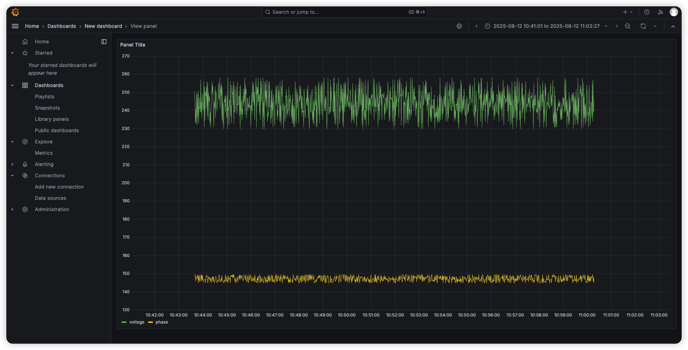

[Grafana](https://grafana.com/grafana/) 是常用的开源可视化和监控平台。
TDengine 可以通过 Grafana 数据源插件接入 Grafana，把数据库中的时序数据展示为折线图、仪表盘和告警面板。

本章使用快速体验中 `taosBenchmark -y` 写入的 `test` 库电表数据，带你完成一次最小可用的集成流程：确认数据、安装 TDengine 数据源插件、配置 Grafana 数据源，并创建一个展示平均电流变化的面板。

## 前提条件

请先确认已经完成以下准备：

1. TDengine 服务已经启动。
2. taosAdapter 已经启动，Grafana 可以访问其 WebSocket/REST 端口，默认是 `6041`。
3. Grafana 已经安装并启动。TDengine 当前支持 Grafana 8.0 及以上版本。
4. 已经在下载与安装章节的快速体验中执行过 `taosBenchmark -y`，生成了 `test` 数据库和 `meters` 超级表。若尚未生成，可先在终端执行 `taosBenchmark -y`。

如果你使用本快速上手中的 Docker 启动方式，容器已经映射 `6041` 端口，可以直接使用 `http://localhost:6041` 作为 TDengine 数据源地址。

## 准备示例数据

进入 shell 后，确认 `test.meters` 中已经有数据。

```sql
USE test;

SELECT tbname, ts, current, voltage
FROM meters
WHERE voltage > 250 and tbname = 'd1'
ORDER BY ts DESC
LIMIT 5;
```

返回结果类似如下。

```text
 tbname |           ts            | current  | voltage |
========================================================
 d1     | 2017-07-14 10:40:09.998 |  11.7984 |     253 |
 d1     | 2017-07-14 10:40:09.998 |  11.7984 |     253 |
 d1     | 2017-07-14 10:40:09.998 |  11.7984 |     253 |
 d1     | 2017-07-14 10:40:09.998 |  11.7984 |     253 |
 d1     | 2017-07-14 10:40:09.998 |  11.7984 |     253 |

Query OK, 5 row(s) in set
```

该数据集的时间戳范围为 `2017-07-14 10:40:00.000` 到 `2017-07-14 10:40:09.999`。在 Grafana 中查看曲线时，需要把时间范围调整到覆盖该区间，而不是默认的“最近 1 小时”。

## 安装 Grafana 插件

Grafana 需要通过 TDengine 数据源插件访问 TDengine。Linux 环境可以在 Grafana 服务器上执行下面的安装脚本。

```shell
bash -c "$(curl -fsSL   https://raw.githubusercontent.com/taosdata/grafanaplugin/master/install.sh)" --   -a http://localhost:6041   -u root   -p taosdata
```

安装完成后，重启 Grafana 服务。

```shell
sudo systemctl restart grafana-server.service
```

如果你使用 Docker 启动 Grafana，或者需要手动安装插件，请参见文末的 Grafana 集成文档。

## 配置 TDengine 数据源

打开浏览器，访问 Grafana。

```text
http://localhost:3000
```

首次登录 Grafana 时，默认用户名和密码通常为 `admin/admin`。登录后按以下步骤添加 TDengine 数据源：

1. 进入 **Connections** > **Add new connection**。
2. 搜索 `TDengine`，选择 TDengine 数据源插件。
3. 点击 **Add new data source**。
4. 在数据源配置页填写连接信息。

常用配置如下：

- **Host**：`http://localhost:6041`。如果 TDengine 部署在远程服务器上，请改为对应地址。
- **User**：`root`。
- **Password**：`taosdata`。

填写完成后，点击 **Save & test**。如果看到 `TDengine Data source is working`，说明 Grafana 已经可以访问 TDengine。

## 创建 Dashboard

数据源配置成功后，可以创建一个展示平均电流变化的面板。

1. 点击 **Build a dashboard** 或进入 **Dashboards** > **New dashboard**。
2. 点击 **Add visualization**。
3. 选择刚刚添加的 TDengine 数据源。
4. 在 SQL 输入框中填写下面的查询语句。

```sql
SELECT _wstart AS time, AVG(current) AS avg_current
FROM test.meters
WHERE groupId = 1 AND ts >= $from AND ts < $to
INTERVAL($interval)
FILL(NULL);
```

其中：

- `$from` 和 `$to` 是 Grafana 当前时间范围的起止时间。
- `$interval` 是 Grafana 根据当前时间范围自动计算的窗口大小。
- `INTERVAL($interval)` 表示按 Grafana 的窗口大小聚合数据点。
- 快速体验数据中的分组标签列为 `groupId`。

点击 **Run query** 或 **Apply** 前，先把 Grafana 右上角的时间范围设为绝对时间，例如：

- **From**：`2017-07-14 10:40:00`
- **To**：`2017-07-14 10:40:10`

然后再运行查询，Grafana 会展示该时间段内平均电流随时间变化的曲线。



如果图表为空，请确认时间范围已覆盖 `2017-07-14 10:40:00` 到 `2017-07-14 10:40:10`，并确认 `test.meters` 中已有快速体验写入的数据。

## 常见问题

如果 **Save & test** 失败，请先检查：

- taosAdapter 是否正常运行。
- Grafana 所在机器是否能访问 `http://localhost:6041`。如果 Grafana 不在 TDengine 所在机器上，不能继续使用 `localhost`，需要填写 TDengine 服务器地址。
- 用户名和密码是否正确，默认是 `root/taosdata`。
- Docker、云主机安全组或防火墙是否放通 `6041` 端口。

如果 Dashboard 没有数据，请检查：

- Grafana 时间范围是否覆盖 `2017-07-14 10:40:00` 到 `2017-07-14 10:40:10`。
- SQL 中的数据库、超级表和标签列是否与实际数据一致（标签列为 `groupId`）。
- `groupId = 1` 是否能匹配到数据；也可以先去掉该条件验证整体曲线。

## 继续阅读

本章只介绍最小可用的 Grafana 集成流程。更多插件安装方式、变量、Dashboard 使用技巧和性能建议，请继续阅读以下文档：

- [与 Grafana 集成](../13-ecosystem-integrations/02-visual/01-grafana.mdx)：完整插件安装、数据源配置和 Dashboard 使用指南。
- [taosAdapter 参考手册](../12-operations-and-tooling/03-components/03-taosadapter.md)：确认 WebSocket/REST 服务端口和配置。
- [数据查询](./05-query-and-aggregate.md)：了解 `INTERVAL`、`FILL`、`GROUP BY` 和时间范围查询。
- [可视化管理](./08-visual-management.md)：使用 taosExplorer 在浏览器中查询和管理数据。
