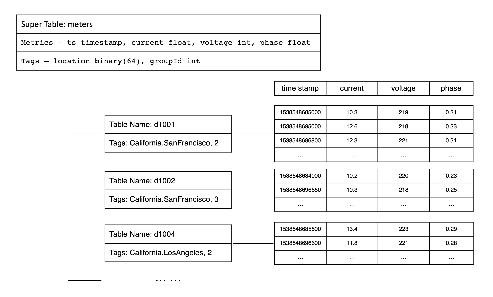

为了清晰地阐述时序数据的基本概念，并为示例程序的编写提供便利，整个文档都将以智能电表为例，探讨时序数据的典型应用场景。设想有一种型号的智能电表，它能够采集
电流、电压和相位这 3 个模拟量。此外，每块智能电表还具有位置和分组等静态属性。这些智能电表采集的数据示例如下表所示。

|Device ID| Timestamp | Current | Voltage | Phase | Location | Group ID |
|:-------:|:---------:|:-------:|:-------:|:-----:|:--------:|:--------:|
|d1001 |1538548685000 | 10.3 | 219 | 0.31 | California.SanFrancisco |2|
|d1002 | 1538548684000 | 10.2 | 220 | 0.23 | California.SanFrancisco |3|
|d1003 | 1538548686500 | 11.5 | 221 | 0.35 | California.LosAngeles | 3 |
|d1004 | 1538548685500 | 13.4 | 223 | 0.29 | California.LosAngeles | 2 |
|d1001 | 1538548695000 | 12.6 | 218 | 0.33 | California.SanFrancisco |2|
|d1004 | 1538548696600 | 11.8 | 221 | 0.28 | California.LosAngeles | 2 |
|d1002 | 1538548696650 | 10.3 | 218 | 0.25 | California.SanFrancisco | 3 |
|d1001 | 1538548696800 | 12.3 | 221 | 0.31 | California.SanFrancisco | 2 |

上表详细展示了各设备 ID（Device ID）对应的智能电表在特定时刻采集的物理量数据，涵盖电流（current）、电压（voltage）和相位（phase）等重要信息。除了动态采集的数据以外，每块智能电表还配备了一组静态标签（tag），例如位置（location）和分组 ID（Group ID）等。这些设备能够根据外部触发事件或预设的周期进行数据采集，确保数据的连续性和时序性，从而构成一个持续更新的数据流。

## 基本概念

### 采集量

采集量是指通过各种传感器、设备或其他类型的采集点所获取的物理量，如电流、电压、温度、压力、GPS 等。由于这些物理量随时间不断变化，因此采集的数据类型多
样，包括整型、浮点型、布尔型以及字符串等。随着时间的积累，存储的数据将持续增长。以智能电表为例，其中的 current、voltage 和 phase 便是典型的采集量。

### 标签

标签是指附着在传感器、设备或其他类型采集点上的静态属性，这些属性不会随时间发生变化，例如设备型号、颜色、设备所在地等。标签的数据类型可以是任意类型。尽管标签本身是静态的，但在实际应用中，用户可能需要对标签进行修改、删除或添加。与采集量不同，随着时间的推移，存储的标签数据量保持相对稳定，不会呈现明显的增长趋势。在智能电表的示例中，location 和 Group ID 就是典型的标签。

### 数据采集点

数据采集点是指在一定的预设时间周期内或受到特定事件触发时，负责采集物理量的硬件或软件设备。一个数据采集点可以同时采集一个或多个采集量，但这些采集量都是在同一时刻获取的，并拥有相同的时间戳。对于结构复杂的设备，通常会有多个数据采集点，每个数据采集点的采集周期可能各不相同，它们之间完全独立，互不干扰。以一辆汽车为例，可能有专门的数据采集点用于采集 GPS，有的数据采集点负责监控发动机状态，还有的数据采集点则专注于车内环境的监测。这样，一辆汽车就包含了 3 个不同类型的数据采集点。在智能电表的示例中，d1001、d1002、d1003、d1004 等标识符即代表了不同的数据采集点。

### 表

鉴于采集的数据通常是结构化数据，为了降低用户的学习难度，TDengine TSDB 采用传统的关系型数据库模型来管理数据。同时，为了充分发挥时序数据的特性，TDengine TSDB 采取了“一个数据采集点一张表”的设计策略，即要求为每个数据采集点单独建立一张表。例如，若有千万块智能电表，则在 TDengine TSDB 中需要创建相应数量的表。在智能电表的示例数据中，设备 ID 为 d1001 的智能电表对应着 TDengine TSDB 中的一张表，该电表采集的所有时序数据均存储于此表中。这种设计方式既保留了关系型数据库的易用性，又充分利用了时序数据的独特优势。

“一个数据采集点一张表”的设计有几大优点：

1. 由于不同数据采集点产生数据的过程完全独立，每个数据采集点的数据源是唯一的，一张表也就只有一个写入者，这样就可采用无锁方式来写数据，写入速度能大幅提升。

2. 对于一个数据采集点而言，其产生的数据是按照时间递增的，因此写的操作可用追加的方式实现，进一步大幅提高数据写入速度。

3. 一个数据采集点的数据是以块为单位连续存储的。这样，每次读取一个时间段的数据，能大幅减少随机读取操作，成数量级的提升读取和查询速度。

4. 一个数据块内部，采用列式存储，对于不同的数据类型，可以采用不同压缩算法来提高压缩率。并且，由于采集量的变化通常是缓慢的，压缩率会更高。

如果采用传统的方式，将多个数据采集点的数据写入一张表，由于网络延时不可控，不同数据采集点的数据到达服务器的时序是无法保证的，写入操作是要有锁保护的，而且一个数据采集点的数据是难以保证连续存储在一起的。采用一个数据采集点一张表的方式，能最大程度的保证单个数据采集点的插入和查询的性能是最优的，而且数据压缩率最高。

在 TDengine TSDB 中，通常使用数据采集点的名称（如 d1001）来做表名，每个数据采集点可以有多个采集量（如 current、voltage、phase 等），每个采集量对应一张表的一列。采集量的数据类型可以是整型、浮点型、字符串等。

此外，表的第一列必须是时间戳，即数据类型为 Timestamp。对于每个采集量，TDengine TSDB 将使用第一列时间戳建立索引，采用列式存储。对于复杂的设备，比如汽车，它有多个数据采集点，则需要为一辆汽车建立多张表。

### 超级表

TDengine TSDB 采用“一个数据采集点一张表”的设计虽然有利于高效地管理每个数据采集点，但随着设备数量不断增加，表的数量也会急剧增加，这给表的管理以及表之间的聚合带来了巨大的挑战。

为了解决这个问题，TDengine TSDB 引入超级表（Super Table，简称为 STable）的概念。超级表是一种数据结构，它能将某一特定类型的数据采集点聚集在一起，形成一张逻辑上的统一表。这些数据采集点具有相同的表结构，但各自的静态属性（如标签）可能不同。创建超级表时，除了定义采集量的结构之外，还需定义超级表的标签。一张超级表至少包含一个时间戳列、一个或多个采集量列以及一个或多个标签列。此外，超级表的标签可以灵活地进行增加、修改或删除操作。

在 TDengine TSDB 中，表代表具体的数据采集点，而超级表则代表一组具有相同属性的数据采集点集合。以智能电表为例，我们可以为该类型的电表创建一张超级表，其中包含了所有智能电表的共有属性，包括动态的时序数据以及静态的标签数据。这种设计不仅简化了表的管理，还便于进行跨数据采集点的聚合操作，从而提高数据处理的效率。

### 子表

子表是数据采集点在逻辑上的一种抽象表示，它是隶属于某张超级表的具体表。用户可以将超级表的定义作为模板，并通过指定子表的标签值来创建子表。这样，通过超级表生成的表便被称为子表。超级表与子表之间的关系主要体现在以下几个方面。

- 一张超级表包含多张子表，这些子表具有相同的表结构，但标签值各异。
- 子表的表结构不能直接修改，但可以修改超级表的列和标签，且修改对所有子表立即生效。
- 超级表定义了一个模板，自身并不存储任何数据或标签信息。

在 TDengine TSDB 中，查询操作既可以在子表上进行，也可以在超级表上进行。针对超级表的查询，TDengine TSDB 将所有子表中的数据视为一个整体，首先通过标签筛选出满足查询条件的表，然后在这些子表上分别查询时序数据，最终将各张子表的查询结果合并。本质上，TDengine TSDB 通过对超级表查询的支持，实现了多个同类数据采集点的高效聚合。为了更好地理解采集量、标签、超级表与子表之间的关系，这里以智能电表的数据模型为例进行说明。可以参考图 3-1 的数据模型，以便更直观地了解这些概念。

为了更好地理解采集量、标签、超级与子表的关系，以智能电表为例，可以参考下图



### 虚拟表

“一个数据采集点一张表”以及“超级表”的设计解决了工业和物联网等场景下的大多数时序数据管理和分析难题。但在真实的场景中，一个设备往往有多种传感器，数据采集频次还相差很大。比如对于一台风机，电气参数、环境参数、机械参数，各自的传感器和采集频次完全不一样。因此很难用一张表来描述一台设备，往往需要多张表。当需要综合多个传感器的数据进行分析计算时，只能通过多级关联查询的方式来进行，而这往往会导致易用性和性能方面的问题。从用户的角度来看，“一个设备一张表”更为直观、容易操作。但如果建模之初，直接采用“一个设备一张表的”的设计，由于采集频次的不同，会导致每一个具体时间戳，大量的列是空值，降低存储和查询的效率。

为了解决这个问题，TDengine TSDB 引入虚拟表（Virtual Table，简称为 VTable）的概念。虚拟表是一种不存储实际数据而可以用于分析计算的表，数据来源为其它真实存储数据的子表、普通表，通过将各个原始表的不同列的数据按照时间戳排序、对齐、合并的方式来生成虚拟表。同真实表类似，虚拟表也可以分为虚拟超级表、虚拟子表、虚拟普通表。虚拟超级表可以是一个设备或一组分析计算所需数据的完整集合，每个虚拟子表可以根据需要引用相同或不同的列，因此可以灵活地根据业务需要进行定义，最终达到“千人千面”的效果。虚拟表不能写入、删除数据，在查询使用上和真实表相同。TDengine TSDB 支持虚拟超级表、虚拟子表、虚拟普通表上的任何查询。唯一的区别在于虚拟表的数据是每次查询计算时动态生成的，只有一个查询中引用的列才会被合并进虚拟表中，因此同一个虚拟表在不同的查询中所呈现以及扫描的数据可能是完全不同的。

虚拟超级表的主要功能特点包括。

1. 列选择与拼接：用户可以从多个原始表中选择指定的列，按需组合到一张虚拟表中，形成统一的数据视图。
2. 基于时间戳对齐：以时间戳为依据对数据进行对齐，如果多个表在相同时间戳下存在数据，则对应列的值组合成同一行；若部分表在该时间戳下无数据，则对应列填充为 NULL。
3. 动态更新：虚拟表根据原始表的数据变化自动更新，确保数据的实时性。虚拟表不需实际存储，计算在生成时动态完成。

通过引入虚拟表的概念，TDengine TSDB 可以非常方便的管理更大更复杂的设备数据。无论每个采集点如何建模（单列 or 多列），无论这些采集点的数据是分布在一个或多个库中，都可以通过定义虚拟表的方式跨库跨表任意指定数据源，通过虚拟超级表的方式进行跨数据采集点、跨分析的聚合运算，从此“一个设备一张表”彻底成为现实。

### 库

库是 TDengine TSDB 中用于管理一组表的集合。TDengine TSDB 允许一个运行实例包含多个库，并且每个库都可以配置不同的存储策略。由于不同类型的数据采集点通常具有不同的数据特征，如数据采集频率、数据保留期限、副本数量、数据块大小等。为了在各种场景下确保 TDengine TSDB 能够发挥最大效率，建议将具有不同数据特征的超级表创建在不同的库中。

在一个库中，可以包含一到多张超级表，但每张超级表只能属于一个库。同时，一张超级表所拥有的所有子表也都将存储在该库中。这种设计有助于实现更细粒度的数据管理和优化，确保 TDengine TSDB 能够根据不同数据特征提供最佳的处理性能。

### 时间戳

时间戳在时序数据处理中扮演着至关重要的角色，特别是在应用程序需要从多个不同时区访问数据库时，这一问题变得更加复杂。在深入了解 TDengine TSDB 如何处理时间戳与时区之前，先介绍以下几个基本概念。

- 本地日期时间：指特定地区的当地时间，通常表示为 yyyy-MM-dd hh:mm:ss.SSS 格式的字符串。这种时间表示不包含任何时区信息，如“2021-07-21 12:00:00.000”。
- 时区：地球上不同地理位置的标准时间。协调世界时（Universal Time Coordinated，UTC）或格林尼治时间是国际时间标准，其他时区通常表示为相对于 UTC 的偏移量，如 "UTC+8" 代表东八区时间。UTC 时间戳：表示自 UNIX 纪元（即 UTC 时间 1970 年 1 月 1 日 0 点）起经过的毫秒数。例如，“1700000000000”对应的日期时间是“2023-11-14 22:13:20（UTC+0）”。在 TDengine TSDB 中保存时序数据时，实际上保存的是 UTC 时间戳。TDengine TSDB 在写入数据时，时间戳的处理分为如下两种情况。
- RFC-3339 格式：当使用这种格式时，TDengine TSDB 能够正确解析带有时区信息的时间字符串为 UTC 时间戳。例如，“2018-10-03T14:38:05.000+08:00”会被转换为 UTC 时间戳。
- 非 RFC-3339 格式：如果时间字符串不包含时区信息，TDengine TSDB 将使用应用程序所在的时区设置自动将时间转换为 UTC 时间戳。

在查询数据时，TDengine TSDB 客户端会根据应用程序当前的时区设置，自动将保存的 UTC 时间戳转换成本地时间进行显示，确保用户在不同时区下都能看到正确的时间信息。

## 数据建模

本节以智能电表为例，介绍如何在 TDengine TSDB 里使用 SQL 创建数据库、超级表、表的基本操作。

### 创建数据库

创建一个数据库以存储电表数据的 SQL 如下：

```sql
CREATE DATABASE power PRECISION 'ms' KEEP 3650 DURATION 10 BUFFER 16;
```

该 SQL 将创建一个名为 `power` 的数据库，各参数说明如下：

- `PRECISION 'ms'` ：这个数据库的时序数据使用毫秒（ms）精度的时间戳
- `KEEP 3650`：这个库的数据将保留 3650 天，超过 3650 天的数据将被自动删除
- `DURATION 10` ：每 10 天的数据放在一个数据文件中
- `BUFFER 16` ：写入使用大小为 16MB 的内存池。

在创建 power 数据库后，可以执行 USE 语句来使用切换数据库。

```sql
use power;
```

该 SQL 将当前数据库切换为 `power`，表示之后的插入、查询等操作，都在当前的 `power` 数据库中进行。

### 创建超级表

创建一张名为 `meters` 的超级表的 SQL 如下：

```sql
CREATE STABLE meters (
    ts timestamp, 
    current float, 
    voltage int, 
    phase float
) TAGS (
    location varchar(64), 
    group_id int
);
```

在 TDengine TSDB 中，创建超级表的 SQL 语句与关系型数据库类似。例如，上面的 SQL 中，`CREATE STABLE` 为关键字，表示创建超级表；接着，`meters` 是超级表的名称；在表名后面的括号中，定义超级表的列（列名、数据类型等），规则如下：

1. 第 1 列必须为时间戳列。例如：`ts timestamp` 表示，时间戳列名是 `ts`，数据类型为 `timestamp`；
2. 第 2 列开始是采集量列。采集量的数据类型可以为整型、浮点型、字符串等。例如：`current float` 表示，采集量电流 `current`，数据类型为 `float`。

最后，TAGS 是关键字，表示标签，在 TAGS 后面的括号中，定义超级表的标签（标签名、数据类型等）。

1. 标签的数据类型可以为整型、浮点型、字符串等。例如：`location varchar(64)` 表示，标签地区 `location`，数据类型为 `varchar(64)`；
2. 标签的名称不能与采集量列的名称相同。

### 创建表

通过超级表创建子表 `d1001` 的 SQL 如下：

```sql
CREATE TABLE d1001 
USING meters (
    location,
    group_id
) TAGS (
    "California.SanFrancisco", 
    2
);
```

上面的 SQL 中，`CREATE TABLE` 为关键字，表示创建表；`d1001` 是子表的名称；`USING` 是关键字，表示要使用超级表作为模版；`meters` 是超级表的名称；在超级表名后的括号中，`location`、`group_id` 表示，是超级表的标签列名列表；`TAGS` 是关键字，在后面的括号中指定子表的标签列的值。`"California.SanFrancisco"` 和 `2` 表示子表 `d1001` 的位置为 `California.SanFrancisco`，分组 ID 为 `2`。

当对超级表进行写入或查询操作时，用户可以使用伪列 tbname 来指定或输出对应操作的子表名。

### 自动建表

在 TDengine TSDB 中，为了简化用户操作并确保数据的顺利写入，即使子表尚不存在，用户也可以使用带有 using 关键字的自动建表 SQL 进行数据写入。这种机制允许系统在遇到不存在的子表时，自动创建该子表，然后再执行数据写入操作。如果子表已经存在，系统则会直接写入数据，不需要任何额外的步骤。

在写入数据的同时自动建表的 SQL 如下：

```sql
INSERT INTO d1002 
USING meters 
TAGS (
    "California.SanFrancisco", 
    2
) VALUES (
    NOW, 
    10.2, 
    219, 
    0.32
);
```

上面的 SQL 中，`INSERT INTO d1002` 表示，向子表 `d1002` 中写入数据；`USING meters` 表示，使用超级表 `meters` 作为模版；`TAGS ("California.SanFrancisco",  2)` 表示，子表 `d1002` 的标签值分别为 `California.SanFrancisco` 和 `2`；`VALUES (NOW, 10.2, 219, 0.32)` 表示，向子表 `d1002` 插入一行记录，值分别为 NOW（当前时间戳）、10.2（电流）、219（电压）、0.32（相位）。在 TDengine TSDB 执行这条 SQL 时，如果子表 `d1002` 已经存在，则直接写入数据；当子表 `d1002` 不存在，会先自动创建子表，再写入数据。

### 创建普通表

在 TDengine TSDB 中，除了具有标签的子表以外，还存在一种不带任何标签的普通表。这类表与普通关系型数据库中的表相似，用户可以使用 SQL 创建它们。

普通表与子表的区别在于：

1. 标签扩展性：子表在普通表的基础上增加了静态标签，这使得子表能够携带更多的元数据信息。此外，子表的标签是可变的，用户可以根据需要增加、删除或修改标签。
2. 表归属：子表总是隶属于某张超级表，它们是超级表的一部分。而普通表则独立存在，不属于任何超级表。
3. 转换限制：在 TDengine TSDB 中，普通表无法直接转换为子表，同样，子表也无法转换为普通表。这两种表类型在创建时就确定了它们的结构和属性，后期无法更改。

总结来说，普通表提供了类似于传统关系型数据库的表功能，而子表则通过引入标签机制，为时序数据提供了更丰富的描述能力和更灵活的管理方式。用户可以根据实际需求选择创建普通表还是子表。

创建不带任何标签的普通表的 SQL 如下：

```sql
CREATE TABLE d1003(
    ts timestamp,
    current float, 
    voltage int, 
    phase float,
    location varchar(64), 
    group_id int
);
```

上面的 SQL 表示，创建普通表 `d1003`，表结构包括 `ts`、`current`、`voltage`、`phase`、`location`、`group_id`，共 6 个列。这样的数据模型，与关系型数据库完全一致。

采用普通表作为数据模型意味着静态标签数据（如 location 和 group_id）会重复存储在表的每一行中。这种做法不仅增加了存储空间的消耗，而且在进行查询时，由于无法直接利用标签数据进行过滤，查询性能会显著低于使用超级表的数据模型。

### 多列模型 VS 单列模型

TDengine TSDB 支持灵活的数据模型设计，包括多列模型和单列模型。多列模型允许将多个由同一数据采集点同时采集且时间戳一致的物理量作为不同列存储在同一张超级表中。然而，在某些极端情况下，可能会采用单列模型，即每个采集的物理量都单独建立一张表。例如，对于电流、电压和相位这 3 种物理量，可能会分别建立 3 张超级表。

尽管 TDengine TSDB 推荐使用多列模型，因为这种模型在写入效率和存储效率方面通常更优，但在某些特定场景下，单列模型可能更为适用。例如，当一个数据采集点的采集量种类经常发生变化时，如果采用多列模型，就需要频繁修改超级表的结构定义，这会增加应用程序的复杂性。在这种情况下，采用单列模型可以简化应用程序的设计和管理，因为它允许独立地管理和扩展每个物理量的超级表。

总之，TDengine TSDB 提供了灵活的数据模型选项，用户可以根据实际需求和场景选择最适合的模型，以优化性能和管理复杂性。

### 创建虚拟表

无论是选择单列模型还是多列模型，TDengine TSDB 都可以通过使用虚拟表进行跨表的运算。为智能电表为例，这里介绍虚拟表的两种使用场景：

1. 单源多维度时序聚合
2. 跨源采集量对比分析

#### 单源多维度时序聚合

在单源多维度时序聚合场景中，“单源”并非指单一物理表，而是指来自**同一数据采集点**下的多个单列时序数据表。这些数据因业务需求或其他限制被拆分为多个单列存储的表，但通过设备标签和时间基准保持逻辑一致性。虚拟表在此场景中的作用是将一个采集点中“纵向“拆分的数据，还原为完整的“横向”状态。
例如，在建模时采用了单列模型，对于电流、电压和相位这 3 种物理量，分别建立 3 张超级表。在这种场景下，用户可以通过虚拟表将这 3 种不同的采集量聚合到一张表中，以便进行统一的查询和分析。

创建单列模型的超级表的 SQL 如下：

```sql

CREATE STABLE current_stb (
    ts timestamp, 
    current float
) TAGS (
    device_id varchar(64),
    location varchar(64), 
    group_id int
);

CREATE STABLE voltage_stb (
    ts timestamp, 
    voltage int
) TAGS (
    device_id varchar(64),
    location varchar(64), 
    group_id int
);
 
CREATE STABLE phase_stb (
    ts timestamp, 
    phase float
) TAGS (
    device_id varchar(64),
    location varchar(64), 
    group_id int
);
```

假设有 d1001、d1002、d1003、d1004 四个设备，为四个设备的电流、电压、相位采集量分别创建子表，SQL 如下：

```sql
create table current_d1001 using current_stb(deviceid, location, group_id) tags("d1001", "California.SanFrancisco", 2);
create table current_d1002 using current_stb(deviceid, location, group_id) tags("d1002", "California.SanFrancisco", 3);
create table current_d1003 using current_stb(deviceid, location, group_id) tags("d1003", "California.LosAngeles", 3);
create table current_d1004 using current_stb(deviceid, location, group_id) tags("d1004", "California.LosAngeles", 2);

create table voltage_d1001 using voltage_stb(deviceid, location, group_id) tags("d1001", "California.SanFrancisco", 2);
create table voltage_d1002 using voltage_stb(deviceid, location, group_id) tags("d1002", "California.SanFrancisco", 3);
create table voltage_d1003 using voltage_stb(deviceid, location, group_id) tags("d1003", "California.LosAngeles", 3);
create table voltage_d1004 using voltage_stb(deviceid, location, group_id) tags("d1004", "California.LosAngeles", 2);

create table phase_d1001 using phase_stb(deviceid, location, group_id) tags("d1001", "California.SanFrancisco", 2);
create table phase_d1002 using phase_stb(deviceid, location, group_id) tags("d1002", "California.SanFrancisco", 3);
create table phase_d1003 using phase_stb(deviceid, location, group_id) tags("d1003", "California.LosAngeles", 3);
create table phase_d1004 using phase_stb(deviceid, location, group_id) tags("d1004", "California.LosAngeles", 2);
```

可通过一张虚拟超级表来将这三种采集量聚合到一张表中，创建虚拟超级表 SQL 如下：

```sql
CREATE STABLE meters_v (
    ts timestamp, 
    current float, 
    voltage int, 
    phase float
) TAGS (
    location varchar(64), 
    group_id int
) VIRTUAL 1;
```

并且对四个设备 d1001、d1002、d1003、d1004 分别创建虚拟子表，SQL 如下：

```sql
CREATE VTABLE d1001_v (
    current from current_d1001.current,
    voltage from voltage_d1001.voltage, 
    phase from phase_d1001.phase
) 
USING meters_v 
TAGS (
    "California.SanFrancisco", 
    2
);
       
CREATE VTABLE d1002_v (
    current from current_d1002.current,
    voltage from voltage_d1002.voltage, 
    phase from phase_d1002.phase
) 
USING meters_v 
TAGS (
    "California.SanFrancisco", 
    3
);
       
CREATE VTABLE d1003_v (
    current from current_d1003.current,
    voltage from voltage_d1003.voltage, 
    phase from phase_d1003.phase
) 
USING meters_v 
TAGS (
    "California.LosAngeles", 
    3
);
       
CREATE VTABLE d1004_v (
    current from current_d1004.current,
    voltage from voltage_d1004.voltage, 
    phase from phase_d1004.phase
) 
USING meters_v 
TAGS (
    "California.LosAngeles", 
    2
);
```

以设备 d1001 为例，假设 d1001 设备的电流、电压、相位数据如下：

<table>
    <tr>
        <th colspan="2" align="center">current_d1001</th>
        <th rowspan="7" align="center"></th>  
        <th colspan="2" align="center">voltage_d1001</th>
        <th rowspan="7" align="center"></th>  
        <th colspan="2" align="center">phase_d1001</th>
    </tr>
    <tr>
        <td align="center">Timestamp</td>
        <td align="center">Current</td>
        <td align="center">Timestamp</td>
        <td align="center">Voltage</td>
        <td align="center">Timestamp</td>
        <td align="center">Phase</td>
    </tr>
    <tr>
        <td align="center">1538548685000</td>
        <td align="center">10.3</td>
        <td align="center">1538548685000</td>
        <td align="center">219</td>
        <td align="center">1538548685000</td>
        <td align="center">0.31</td>
    </tr>
    <tr>
        <td align="center">1538548695000</td>
        <td align="center">12.6</td>
        <td align="center">1538548695000</td>
        <td align="center">218</td>
        <td align="center">1538548695000</td>
        <td align="center">0.33</td>
    </tr>
    <tr>
        <td align="center">1538548696800</td>
        <td align="center">12.3</td>
        <td align="center">1538548696800</td>
        <td align="center">221</td>
        <td align="center">1538548696800</td>
        <td align="center">0.31</td>
    </tr>
    <tr>
        <td align="center">1538548697100</td>
        <td align="center">12.1</td>
        <td align="center">1538548697100</td>
        <td align="center">220</td>
        <td align="center">1538548697200</td>
        <td align="center">0.32</td>
    </tr>
    <tr>
        <td align="center">1538548697700</td>
        <td align="center">11.8</td>
        <td align="center">1538548697800</td>
        <td align="center">222</td>
        <td align="center">1538548697800</td>
        <td align="center">0.33</td>
    </tr>
</table>

虚拟表 d1001_v 中的数据如下：

|   Timestamp    | Current |  Voltage  |  Phase  |
|:--------------:|:-------:|:---------:|:-------:|
| 1538548685000  |  10.3   |    219    |  0.31   |
| 1538548695000  |  12.6   |    218    |  0.33   |
| 1538548696800  |  12.3   |    221    |  0.31   |
| 1538548697100  |  12.1   |    220    |  NULL   |
| 1538548697200  |  NULL   |   NULL    |  0.32   |
| 1538548697700  |  11.8   |   NULL    |  NULL   |
| 1538548697800  |  NULL   |    222    |  0.33   |

#### 跨源采集量对比分析

在跨源采集量对比分析中，“跨源”指数据来自**不同数据采集点**。在不同数据采集点中提取具有可比语义的采集量，通过虚拟表将这些采集量按照时间戳进行对齐和合并，并进行对比分析。
例如，用户可以将来自不同设备的电流数据聚合到一张虚拟表中，以便进行电流数据的对比分析。

以分析 d1001、d1002、d1003、d1004 四个设备的电流数据为例，创建虚拟表的 SQL 如下：

```sql
CREATE VTABLE current_v (
    ts timestamp,
    d1001_current float from current_d1001.current,
    d1002_current float from current_d1002.current, 
    d1003_current float from current_d1003.current,
    d1004_current float from current_d1004.current
);
```

假设 d1001, d1002, d1003, d1004 四个设备的电流数据如下：

<table>
    <tr>
        <th colspan="2" align="center">d1001</th>
        <th rowspan="7" align="center"></th>  
        <th colspan="2" align="center">d1002</th>
        <th rowspan="7" align="center"></th>  
        <th colspan="2" align="center">d1003</th>
        <th rowspan="7" align="center"></th>  
        <th colspan="2" align="center">d1004</th>
    </tr>
    <tr>
        <td align="center">Timestamp</td>
        <td align="center">Current</td>
        <td align="center">Timestamp</td>
        <td align="center">Current</td>
        <td align="center">Timestamp</td>
        <td align="center">Current</td>
        <td align="center">Timestamp</td>
        <td align="center">Current</td>
    </tr>
    <tr>
        <td align="center">1538548685000</td>
        <td align="center">10.3</td>
        <td align="center">1538548685000</td>
        <td align="center">11.7</td>
        <td align="center">1538548685000</td>
        <td align="center">11.2</td>
        <td align="center">1538548685000</td>
        <td align="center">12.4</td>
    </tr>
    <tr>
        <td align="center">1538548695000</td>
        <td align="center">12.6</td>
        <td align="center">1538548695000</td>
        <td align="center">11.9</td>
        <td align="center">1538548695000</td>
        <td align="center">10.8</td>
        <td align="center">1538548695000</td>
        <td align="center">11.3</td>
    </tr>
    <tr>
        <td align="center">1538548696800</td>
        <td align="center">12.3</td>
        <td align="center">1538548696800</td>
        <td align="center">12.4</td>
        <td align="center">1538548696800</td>
        <td align="center">12.3</td>
        <td align="center">1538548696800</td>
        <td align="center">10.1</td>
    </tr>
    <tr>
        <td align="center">1538548697100</td>
        <td align="center">12.1</td>
        <td align="center">1538548697200</td>
        <td align="center">12.2</td>
        <td align="center">1538548697100</td>
        <td align="center">11.1</td>
        <td align="center">1538548697200</td>
        <td align="center">11.7</td>
    </tr>
    <tr>
        <td align="center">1538548697700</td>
        <td align="center">11.8</td>
        <td align="center">1538548697700</td>
        <td align="center">11.4</td>
        <td align="center">1538548697800</td>
        <td align="center">12.1</td>
        <td align="center">1538548697800</td>
        <td align="center">12.6</td>
    </tr>
</table>

虚拟表 current_v 中的数据如下：

|   Timestamp    | d1001_current | d1002_current | d1003_current | d1004_current |
|:--------------:|:-------------:|:-------------:|:-------------:|:-------------:|
| 1538548685000  |     10.3      |     11.7      |     11.2      |     12.4      |
| 1538548695000  |     12.6      |     11.9      |     10.8      |     11.3      |
| 1538548696800  |     12.3      |     12.4      |     12.3      |     10.1      |
| 1538548697100  |     12.1      |     NULL      |     11.1      |     NULL      |
| 1538548697200  |     NULL      |     12.2      |     NULL      |     11.7      |
| 1538548697700  |     11.8      |     11.4      |     NULL      |     NULL      |
| 1538548697800  |     NULL      |     NULL      |     12.1      |     12.6      |
