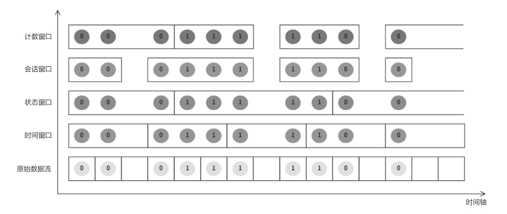
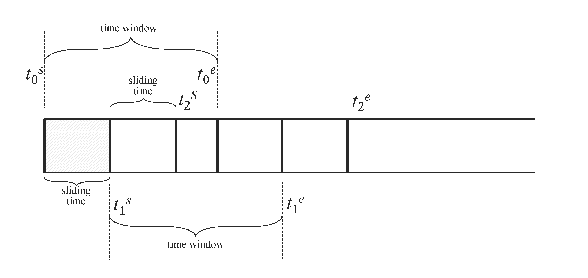
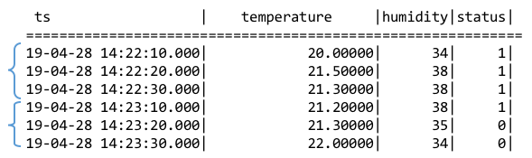
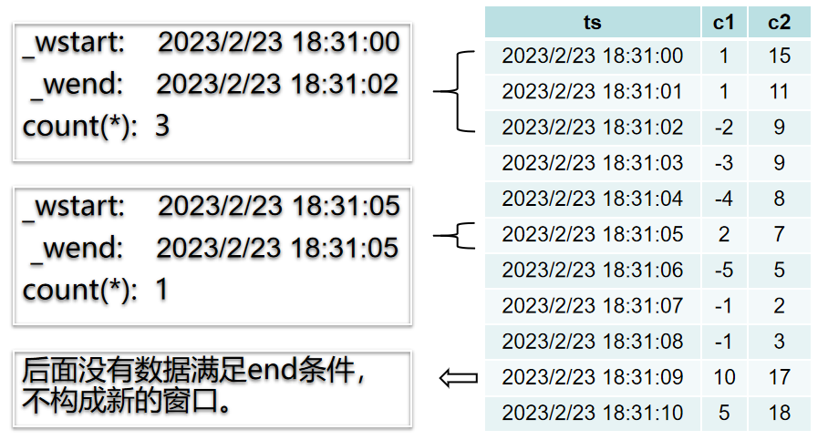

相较于其他众多时序数据库和实时数据库，TDengine 的一个独特优势在于，自其首个版本发布之初便支持标准的 SQL 查询功能。这一特性极大地降低了用户在使用过程中的学习难度。本章将以智能电表的数据模型为例介绍如何在 TDengine 中运用 SQL 查询来处理时序数据。如果需要进一步了解 SQL 语法的细节和功能，建议参阅 TDengine 的官方文档。通过本章的学习，你将能够熟练掌握 TDengine 的 SQL 查询技巧，进而高效地对时序数据进行操作和分析。

## 基本查询

为了更好的介绍 TDengine 数据查询，使用 如下 taosBenchmark 命令，生成本章内容需要的时序数据。

```shell
taosBenchmark --start-timestamp=1600000000000 --tables=100 --records=10000000 --time-step=10000
```

上面的命令，taosBenchmark 工具在 TDengine 中生成了一个用于测试的数据库，产生共 10 亿条时序数据。时序数据的时间戳从 `1600000000000`（2020-09-13T20:26:40+08:00）开始，包含 `100` 个设备（子表），每个设备有 `10000000` 条数据，时序数据的采集频率是 10 秒/ 条。

在 TDengine 中，用户可以通过 WHERE 语句指定条件，查询时序数据。以智能电表的数据为例

```sql
SELECT * FROM meters 
WHERE voltage > 230 
ORDER BY ts DESC
LIMIT 5;
```

上面的 SQL，从超级表 `meters` 中查询出电压 `voltage` 大于 230 的记录，按时间降序排列，且仅输出前 5 行。查询结果如下：

```text
          ts            |  current   | voltage |    phase    | groupid |          location        |
===================================================================================================
2023-11-15 06:13:10.000 | 14.0601978 |     232 | 146.5000000 |      10 | California.Sunnyvale     |
2023-11-15 06:13:10.000 | 14.0601978 |     232 | 146.5000000 |       1 | California.LosAngles     |
2023-11-15 06:13:10.000 | 14.0601978 |     232 | 146.5000000 |      10 | California.Sunnyvale     |
2023-11-15 06:13:10.000 | 14.0601978 |     232 | 146.5000000 |       5 | California.Cupertino     |
2023-11-15 06:13:10.000 | 14.0601978 |     232 | 146.5000000 |       4 | California.SanFrancisco  |
Query OK, 5 row(s) in set (0.145403s)
```

## 聚合查询

TDengine 支持通过 GROUP BY 子句，对数据进行聚合查询。SQL 语句包含 GROUP BY 子句时，SELECT 列表只能包含如下表达式：
1. 常量
2. 聚合函数
3. 与 GROUP BY 后表达式相同的表达式
4. 包含前面表达式的表达式

group by 子句用于对数据进行分组，并为每个分组返回一行汇总信息。在 group by 子句中，可以使用表或视图中的任何列作为分组依据，这些列不需要出现在 select 列表中。此外，用户可以直接在超级表上执行聚合查询，无须预先创建子表。以智能电表的数据模型为例，使用 group by 子句的 SQL 如下：

```sql
SELECT groupid, avg(voltage) 
FROM meters 
WHERE ts >= "2022-01-01T00:00:00+08:00" 
AND ts < "2023-01-01T00:00:00+08:00" 
GROUP BY groupid;
```

上面的 SQL，查询超级表 `meters` 中，时间戳大于等于 `2022-01-01T00:00:00+08:00`，且时间戳小于 `2023-01-01T00:00:00+08:00` 的数据，按照 `groupid` 进行分组，求每组的平均电压。查询结果如下：

```text
 groupid   |   avg(voltage)        |
======================================
         8 |   243.961981544901079 |
         5 |   243.961981544901079 |
         1 |   243.961981544901079 |
         7 |   243.961981544901079 |
         9 |   243.961981544901079 |
         6 |   243.961981544901079 |
         4 |   243.961981544901079 |
        10 |   243.961981544901079 |
         2 |   243.961981544901079 |
         3 |   243.961981544901079 |
Query OK, 10 row(s) in set (0.042446s)
```

**注意**: group by 子句在聚合数据时，并不保证结果集按照特定顺序排列。为了获得有序的结果集，可以使用 order by 子句对结果进行排序。这样，可以根据需要调整输出结果的顺序，以满足特定的业务需求或报告要求。

TDengine 提供了多种内置的聚合函数。如下表所示：

| 聚合函数                | 功能说明                                                       | 
|:----------------------:|:--------------------------------------------------------------:|
|APERCENTILE | 统计表/超级表中指定列的值的近似百分比分位数，与 PERCENTILE 函数相似，但是返回近似结果。 |
|AVG | 统计指定字段的平均值 |
|COUNT | 统计指定字段的记录行数 |
|ELAPSED|elapsed 函数表达了统计周期内连续的时间长度，和 twa 函数配合使用可以计算统计曲线下的面积。在通过 INTERVAL 子句指定窗口的情况下，统计在给定时间范围内的每个窗口内有数据覆盖的时间范围；如果没有 INTERVAL 子句，则返回整个给定时间范围内的有数据覆盖的时间范围。注意，ELAPSED 返回的并不是时间范围的绝对值，而是绝对值除以 time_unit 所得到的单位个数。|
|LEASTSQUARES | 统计表中某列的值的拟合直线方程。start_val 是自变量初始值，step_val 是自变量的步长值。 |
|SPREAD | 统计表中某列的最大值和最小值之差。|
|STDDEV | 统计表中某列的均方差。 |
|SUM | 统计表/超级表中某列的和。 |
|HYPERLOGLOG | 采用 hyperloglog 算法，返回某列的基数。该算法在数据量很大的情况下，可以明显降低内存的占用，求出来的基数是个估算值，标准误差（标准误差是多次实验，每次的平均数的标准差，不是与真实结果的误差）为 0.81%。在数据量较少的时候该算法不是很准确，可以使用 select count（data） from （select unique（col） as data from table） 的方法。 |
|HISTOGRAM | 统计数据按照用户指定区间的分布。 |
|PERCENTILE | 统计表中某列的值百分比分位数。|

## 数据切分查询

TDengine 支持 PARTITION BY 子句。当需要按一定的维度对数据进行切分，然后在切分出的数据空间内再进行一系列的计算时，可以使用 PARTITION BY 子句进行查询，语法如下：
```sql
PARTITION BY part_list
```

`part_list` 可以是任意的标量表达式，包括列、常量、标量函数和它们的组合。

TDengine 按如下方式处理数据切分子句。
1. 数据切分子句位于 WHERE 子句之后；
2. 数据切分子句将表数据按指定的维度进行切分，每个切分的分片进行指定的计算。计算由之后的子句定义（窗口子句、GROUP BY 子句或 SELECT 子句）；
3. 数据切分子句可以和窗口切分子句（或 GROUP BY 子句）一起使用，此时后面的子句作用在每个切分的分片上。

数据切分的 SQL 如下：s

```sql
SELECT location, avg(voltage) 
FROM meters 
PARTITION BY location;
```

上面的示例 SQL 查询超级表 `meters`，将数据按标签 `location` 进行分组，每个分组计算电压的平均值。查询结果如下：

```text
          location          |     avg(voltage)      |
======================================================
 California.SantaClara      |   243.962050000000005 |
 California.SanFrancisco    |   243.962050000000005 |
 California.SanJose         |   243.962050000000005 |
 California.LosAngles       |   243.962050000000005 |
 California.SanDiego        |   243.962050000000005 |
 California.Sunnyvale       |   243.962050000000005 |
 California.PaloAlto        |   243.962050000000005 |
 California.Cupertino       |   243.962050000000005 |
 California.MountainView    |   243.962050000000005 |
 California.Campbell        |   243.962050000000005 |
Query OK, 10 row(s) in set (2.415961s)
```

## 窗口切分查询

在 TDengine 中，你可以使用窗口子句来实现按时间窗口切分方式进行聚合结果查询，这种查询方式特别适用于需要对大量时间序列数据进行分析的场景，例如智能电表每 10s 采集一次数据，但需要查询每隔 1min 的温度平均值。

窗口子句允许你针对查询的数据集合按照窗口进行切分，并对每个窗口内的数据进行聚合，包含：
- 时间窗口（time window）
- 状态窗口（status window）
- 会话窗口（session window）
- 事件窗口（event window）

窗口划分逻辑如下图所示：



窗口子句语法如下：

```sql
window_clause: {
    SESSION(ts_col, tol_val)
  | STATE_WINDOW(col)
  | INTERVAL(interval_val [, interval_offset]) [SLIDING (sliding_val)] [FILL(fill_mod_and_val)]
  | EVENT_WINDOW START WITH start_trigger_condition END WITH end_trigger_condition
}
```

**注意** 在使用窗口子句时应注意以下规则：
1. 窗口子句位于数据切分子句之后，不可以和 GROUP BY 子句一起使用。
2. 窗口子句将数据按窗口进行切分，对每个窗口进行 SELECT 列表中的表达式的计算，SELECT 列表中的表达式只能包含：常量；伪列：_wstart 伪列、_wend 伪列和 _wduration 伪列；聚合函数（包括选择函数和可以由参数确定输出行数的时序特有函数）
3. WHERE 语句可以指定查询的起止时间和其他过滤条件。

### 时间戳伪列

在窗口聚合查询结果中，如果 SQL 中没有指定输出查询结果中的时间戳列，那么最终结果中将不会自动包含窗口的时间列信息。然而，如果你需要在结果中输出聚合查询结果所对应的时间窗口信息，可以在 select 子句中使用与时间戳相关的伪列，如时间窗口起始时间（_wstart）、时间窗口结束时间（_wend）、时间窗口持续时间（_wduration），以及与查询整体窗口相关的伪列，如查询窗口起始时间（_qstart）和查询窗口结束时间（_qend）。需要注意的是，时间窗口起始时间和结束时间均是闭区间，时间窗口持续时间是数据当前时间分辨率下的数值。例如，如果当前数据库的时间精度是毫秒（ms），那么结果中的 500 表示当前时间窗口的持续时间是 500ms。

### 时间窗口

时间窗口可分为：滑动时间窗口、翻转时间窗口。时间窗口子句的语法如下：

```sql
INTERVAL(interval_val [, interval_offset]) 
[SLIDING (sliding_val)] 
[FILL(fill_mod_and_val)]
```

时间窗口子句包括 3 个子句：
- INTERVAL 子句：用于产生相等时间周期的窗口，interval_val 指定每个时间窗口的大小，interval_offset 指定；
- SLIDING 子句：用于指定窗口向前滑动的时间；
- FILL：用于指定窗口区间数据缺失的情况下，数据的填充模式。

对于时间窗口，interval_val 和 sliding_val 都表示时间段， 语法上支持三种方式。例如：
1. INTERVAL(1s, 500a) SLIDING(1s)，带时间单位的形式，其中的时间单位是单字符表示， 分别为： a （毫秒）， b （纳秒）， d （天）， h （小时）， m （分钟）， n （月）， s （秒）， u （微秒）， w （周）， y （年）；
2. INTERVAL(1000, 500) SLIDING(1000)，不带时间单位的形式，将使用查询库的时间精度作为默认时间单位，当存在多个库时默认采用精度更高的库；
3. INTERVAL('1s', '500a') SLIDING('1s')，带时间单位的字符串形式，字符串内部不能有任何空格等其它字符。


示例 SQL 如下：
```sql
SELECT tbname, _wstart, _wend, avg(voltage) 
FROM meters 
WHERE ts >= "2022-01-01T00:00:00+08:00" 
AND ts < "2022-01-01T00:05:00+08:00" 
PARTITION BY tbname 
INTERVAL(1m, 5s) 
SLIMIT 2;
```

上面的 SQL，查询超级表 `meters` 中，时间戳大于等于 `2022-01-01T00:00:00+08:00`，且时间戳小于 `2022-01-01T00:05:00+08:00` 的数据；数据首先按照子表名 `tbname` 进行数据切分，再按照每 1 分钟的时间窗口进行切分，且每个时间窗口向后偏移 5 秒；最后，仅取前 2 个分片的数据作为结果。查询结果如下：

```text
 tbname |         _wstart         |          _wend          |     avg(voltage)      |
======================================================================================
 d2     | 2021-12-31 23:59:05.000 | 2022-01-01 00:00:05.000 |   253.000000000000000 |
 d2     | 2022-01-01 00:00:05.000 | 2022-01-01 00:01:05.000 |   244.166666666666657 |
 d2     | 2022-01-01 00:01:05.000 | 2022-01-01 00:02:05.000 |   241.833333333333343 |
 d2     | 2022-01-01 00:02:05.000 | 2022-01-01 00:03:05.000 |   243.166666666666657 |
 d2     | 2022-01-01 00:03:05.000 | 2022-01-01 00:04:05.000 |   240.833333333333343 |
 d2     | 2022-01-01 00:04:05.000 | 2022-01-01 00:05:05.000 |   244.800000000000011 |
 d26    | 2021-12-31 23:59:05.000 | 2022-01-01 00:00:05.000 |   253.000000000000000 |
 d26    | 2022-01-01 00:00:05.000 | 2022-01-01 00:01:05.000 |   244.166666666666657 |
 d26    | 2022-01-01 00:01:05.000 | 2022-01-01 00:02:05.000 |   241.833333333333343 |
 d26    | 2022-01-01 00:02:05.000 | 2022-01-01 00:03:05.000 |   243.166666666666657 |
 d26    | 2022-01-01 00:03:05.000 | 2022-01-01 00:04:05.000 |   240.833333333333343 |
 d26    | 2022-01-01 00:04:05.000 | 2022-01-01 00:05:05.000 |   244.800000000000011 |
Query OK, 12 row(s) in set (0.021265s)
```

#### 滑动窗口

每次执行的查询是一个时间窗口，时间窗口随着时间流动向前滑动。在定义连续查询的时候需要指定时间窗口（time window ）大小和每次前向增量时间（forward sliding times）。如下图，[t0s， t0e] ，[t1s ， t1e]， [t2s， t2e] 是分别是执行三次连续查询的时间窗口范围，窗口的前向滑动的时间范围 sliding time 标识 。查询过滤、聚合等操作按照每个时间窗口为独立的单位执行。



**注意** 

1. INTERVAL 和 SLIDING 子句需要配合聚合和选择函数来使用，因此，下面的 SQL 语句是非法的：
```sql
SELECT COUNT(*) FROM temp_tb_1 INTERVAL(1m) SLIDING(2m);
```

2. SLIDING 的向前滑动的时间不能超过一个窗口的时间范围，因此，下面的 SQL 语句也是非法的：
```sql
SELECT COUNT(*) FROM temp_tb_1 INTERVAL(1m) SLIDING(2m);
```

**使用时间窗口需要注意**
1. 聚合时间段的窗口宽度由关键词 INTERVAL 指定，最短时间间隔 10 毫秒（10a）；并且支持偏移 offset（偏移必须小于间隔），也即时间窗口划分与“UTC 时刻 0”相比的偏移量。SLIDING 语句用于指定聚合时间段的前向增量，也即每次窗口向前滑动的时长。
2. 使用 INTERVAL 语句时，除非极特殊的情况，都要求把客户端和服务端的 taos.cfg 配置文件中的 timezone 参数配置为相同的取值，以避免时间处理函数频繁进行跨时区转换而导致的严重性能影响。
3. 返回的结果中时间序列严格单调递增。

示例：

```sql
SELECT tbname, _wstart, avg(voltage)
FROM meters
WHERE ts >= "2022-01-01T00:00:00+08:00" 
AND ts < "2022-01-01T00:05:00+08:00" 
PARTITION BY tbname
INTERVAL(1m) SLIDING(30s)
SLIMIT 1;
```

上面的 SQL，查询超级表 `meters` 中，时间戳大于等于 `2022-01-01T00:00:00+08:00`，且时间戳小于 `2022-01-01T00:05:00+08:00` 的数据，数据首先按照子表名 `tbname` 进行数据切分，再按照每 1 分钟的时间窗口进行切分，且时间窗口按照 30 秒进行滑动；最后，仅取前 1 个分片的数据作为结果。查询结果如下：

```text
 tbname |         _wstart         |     avg(voltage)      |
=============================================================
 d2     | 2021-12-31 23:59:30.000 |   248.333333333333343 |
 d2     | 2022-01-01 00:00:00.000 |   246.000000000000000 |
 d2     | 2022-01-01 00:00:30.000 |   244.666666666666657 |
 d2     | 2022-01-01 00:01:00.000 |   240.833333333333343 |
 d2     | 2022-01-01 00:01:30.000 |   239.500000000000000 |
 d2     | 2022-01-01 00:02:00.000 |   243.833333333333343 |
 d2     | 2022-01-01 00:02:30.000 |   243.833333333333343 |
 d2     | 2022-01-01 00:03:00.000 |   241.333333333333343 |
 d2     | 2022-01-01 00:03:30.000 |   241.666666666666657 |
 d2     | 2022-01-01 00:04:00.000 |   244.166666666666657 |
 d2     | 2022-01-01 00:04:30.000 |   244.666666666666657 |
Query OK, 11 row(s) in set (0.013153s)
```

#### 翻转窗口

当 SLIDING 与 INTERVAL 相等的时候，滑动窗口即为翻转窗口。翻转窗口和滑动窗口的区别在于，滑动窗口因为 interval_val 和 sliding_val 不同，不同时间窗口之间，会存在数据重叠，翻转窗口则没有数据重叠。本质上，翻转窗口就是按照 interval_val 进行了时间窗口划分，INTERVAL(1m)和INTERVAL(1m) SLIDING(1m)是等效的。

示例：

```sql
SELECT tbname, _wstart, _wend, avg(voltage)
FROM meters
WHERE ts >= "2022-01-01T00:00:00+08:00" 
AND ts < "2022-01-01T00:05:00+08:00" 
PARTITION BY tbname
INTERVAL(1m) SLIDING(1m)
SLIMIT 1;
```

上面的 SQL，查询超级表 `meters` 中，时间戳大于等于 `2022-01-01T00:00:00+08:00`，且时间戳小于 `2022-01-01T00:05:00+08:00` 的数据，数据首先按照子表名 `tbname` 进行数据切分，再按照每 1 分钟的时间窗口进行切分，且时间窗口按照 1 分钟进行切分；最后，仅取前 1 个分片的数据作为结果。查询结果如下：

```text
 tbname |         _wstart         |          _wend          |     avg(voltage)      |
======================================================================================
 d2     | 2022-01-01 00:00:00.000 | 2022-01-01 00:01:00.000 |   246.000000000000000 |
 d2     | 2022-01-01 00:01:00.000 | 2022-01-01 00:02:00.000 |   240.833333333333343 |
 d2     | 2022-01-01 00:02:00.000 | 2022-01-01 00:03:00.000 |   243.833333333333343 |
 d2     | 2022-01-01 00:03:00.000 | 2022-01-01 00:04:00.000 |   241.333333333333343 |
 d2     | 2022-01-01 00:04:00.000 | 2022-01-01 00:05:00.000 |   244.166666666666657 |
Query OK, 5 row(s) in set (0.016812s)
```

#### FILL 子句

FILL 子句，用于指定某一窗口区间数据缺失的情况下的填充模式。填充模式包括以下几种：
1. 不进行填充：NONE（默认填充模式）。
2. VALUE 填充：固定值填充，此时需要指定填充的数值。例如：FILL（VALUE， 1.23）。这里需要注意，最终填充的值受由相应列的类型决定，如 FILL（VALUE， 1.23），相应列为 INT 类型，则填充值为 1。
3. PREV 填充：使用前一个非 NULL 值填充数据。例如：FILL（PREV）。
4. NULL 填充：使用 NULL 填充数据。例如：FILL（NULL）。
5. LINEAR 填充：根据前后距离最近的非 NULL 值做线性插值填充。例如：FILL（LINEAR）。
6. NEXT 填充：使用下一个非 NULL 值填充数据。例如：FILL（NEXT）。

以上填充模式中，除了 NONE 模式默认不填充值之外，其他模式在查询的整个时间范围内如果没有数据 FILL 子句将被忽略，即不产生填充数据，查询结果为空。这种行为在部分模式（PREV、NEXT、LINEAR）下具有合理性，因为在这些模式下没有数据意味着无法产生填充数值。

对另外一些模式（NULL、VALUE）来说，理论上是可以产生填充数值的，至于需不需要输出填充数值，取决于应用的需求。所以为了满足这类需要强制填充数据或 NULL 的应用的需求，同时不破坏现有填充模式的行为兼容性，TDengine 还支持两种新的填充模式：
1. NULL_F: 强制填充 NULL 值
2. VALUE_F: 强制填充 VALUE 值

NULL、 NULL_F、 VALUE、 VALUE_F 这几种填充模式针对不同场景区别如下：
1. INTERVAL 子句： NULL_F， VALUE_F 为强制填充模式；NULL， VALUE 为非强制模式。在这种模式下下各自的语义与名称相符
2. 流计算中的 INTERVAL 子句：NULL_F 与 NULL 行为相同，均为非强制模式；VALUE_F 与 VALUE 行为相同，均为非强制模式。即流计算中的 INTERVAL 没有强制模式
3. INTERP 子句：NULL 与 NULL_F 行为相同，均为强制模式；VALUE 与 VALUE_F 行为相同，均为强制模式。即 INTERP 中没有非强制模式。

**注意**
1. 使用 FILL 语句的时候可能生成大量的填充输出，务必指定查询的时间区间。
2. 针对每次查询，系统可返回不超过 1 千万条具有插值的结果。
3. 在时间维度聚合中，返回的结果中时间序列严格单调递增。
4. 如果查询对象是超级表，则聚合函数会作用于该超级表下满足值过滤条件的所有表的数据。如果查询中没有使用 PARTITION BY 语句，则返回的结果按照时间序列严格单调递增；如果查询中使用了 PARTITION BY 语句分组，则返回结果中每个 PARTITION 内按照时间序列严格单调递增。

示例：

```sql
SELECT tbname, _wstart, _wend, avg(voltage)
FROM meters
WHERE ts >= "2022-01-01T00:00:00+08:00" 
AND ts < "2022-01-01T00:05:00+08:00" 
PARTITION BY tbname
INTERVAL(1m) FILL(prev)
SLIMIT 2;
```

上面的 SQL，查询超级表 `meters` 中，时间戳大于等于 `2022-01-01T00:00:00+08:00`，且时间戳小于 `2022-01-01T00:05:00+08:00` 的数据；数据首先按照子表名 `tbname` 进行数据切分，再按照每 1 分钟的时间窗口进行切分，如果窗口内的数据出现缺失，则使用使用前一个非 NULL 值填充数据；最后，仅取前 2 个分片的数据作为结果。查询结果如下：

```text
 tbname |         _wstart         |          _wend          |     avg(voltage)      |
=======================================================================================
 d2     | 2022-01-01 00:00:00.000 | 2022-01-01 00:01:00.000 |   246.000000000000000 |
 d2     | 2022-01-01 00:01:00.000 | 2022-01-01 00:02:00.000 |   240.833333333333343 |
 d2     | 2022-01-01 00:02:00.000 | 2022-01-01 00:03:00.000 |   243.833333333333343 |
 d2     | 2022-01-01 00:03:00.000 | 2022-01-01 00:04:00.000 |   241.333333333333343 |
 d2     | 2022-01-01 00:04:00.000 | 2022-01-01 00:05:00.000 |   244.166666666666657 |
 d26    | 2022-01-01 00:00:00.000 | 2022-01-01 00:01:00.000 |   246.000000000000000 |
 d26    | 2022-01-01 00:01:00.000 | 2022-01-01 00:02:00.000 |   240.833333333333343 |
 d26    | 2022-01-01 00:02:00.000 | 2022-01-01 00:03:00.000 |   243.833333333333343 |
 d26    | 2022-01-01 00:03:00.000 | 2022-01-01 00:04:00.000 |   241.333333333333343 |
 d26    | 2022-01-01 00:04:00.000 | 2022-01-01 00:05:00.000 |   244.166666666666657 |
Query OK, 10 row(s) in set (0.022866s)
```

### 状态窗口

使用整数（布尔值）或字符串来标识产生记录时候设备的状态量。产生的记录如果具有相同的状态量数值则归属于同一个状态窗口，数值改变后该窗口关闭。TDengine 还支持将 CASE 表达式用在状态量，可以表达某个状态的开始是由满足某个条件而触发，这个状态的结束是由另外一个条件满足而触发的语义。以智能电表为例，电压正常范围是 225V 到 235V，那么可以通过监控电压来判断电路是否正常。

```sql
SELECT tbname, _wstart, _wend,_wduration, CASE WHEN voltage >= 225 and voltage <= 235 THEN 1 ELSE 0 END status 
FROM meters 
WHERE ts >= "2022-01-01T00:00:00+08:00" 
AND ts < "2022-01-01T00:05:00+08:00" 
PARTITION BY tbname 
STATE_WINDOW(
    CASE WHEN voltage >= 225 and voltage <= 235 THEN 1 ELSE 0 END
)
SLIMIT 2;
```

以上 SQL，查询超级表 meters 中，时间戳大于等于 2022-01-01T00:00:00+08:00，且时间戳小于 2022-01-01T00:05:00+08:00的数据；数据首先按照子表名 tbname 进行数据切分；根据电压是否在正常范围内进行状态窗口的划分；最后，取前 2 个分片的数据作为结果。查询结果如下：（由于数据是随机生成，结果集包含的数据条数会有不同）

```text
 tbname |         _wstart         |          _wend          |  _wduration   |    status     |
===============================================================================================
 d2     | 2022-01-01 00:00:00.000 | 2022-01-01 00:01:20.000 |         80000 |             0 |
 d2     | 2022-01-01 00:01:30.000 | 2022-01-01 00:01:30.000 |             0 |             1 |
 d2     | 2022-01-01 00:01:40.000 | 2022-01-01 00:01:40.000 |             0 |             0 |
 d2     | 2022-01-01 00:01:50.000 | 2022-01-01 00:01:50.000 |             0 |             1 |
 d2     | 2022-01-01 00:02:00.000 | 2022-01-01 00:02:20.000 |         20000 |             0 |
 d2     | 2022-01-01 00:02:30.000 | 2022-01-01 00:02:30.000 |             0 |             1 |
 d2     | 2022-01-01 00:02:40.000 | 2022-01-01 00:03:00.000 |         20000 |             0 |
 d2     | 2022-01-01 00:03:10.000 | 2022-01-01 00:03:10.000 |             0 |             1 |
 d2     | 2022-01-01 00:03:20.000 | 2022-01-01 00:03:40.000 |         20000 |             0 |
 d2     | 2022-01-01 00:03:50.000 | 2022-01-01 00:03:50.000 |             0 |             1 |
 d2     | 2022-01-01 00:04:00.000 | 2022-01-01 00:04:50.000 |         50000 |             0 |
 d26    | 2022-01-01 00:00:00.000 | 2022-01-01 00:01:20.000 |         80000 |             0 |
 d26    | 2022-01-01 00:01:30.000 | 2022-01-01 00:01:30.000 |             0 |             1 |
 d26    | 2022-01-01 00:01:40.000 | 2022-01-01 00:01:40.000 |             0 |             0 |
 d26    | 2022-01-01 00:01:50.000 | 2022-01-01 00:01:50.000 |             0 |             1 |
 d26    | 2022-01-01 00:02:00.000 | 2022-01-01 00:02:20.000 |         20000 |             0 |
 d26    | 2022-01-01 00:02:30.000 | 2022-01-01 00:02:30.000 |             0 |             1 |
 d26    | 2022-01-01 00:02:40.000 | 2022-01-01 00:03:00.000 |         20000 |             0 |
 d26    | 2022-01-01 00:03:10.000 | 2022-01-01 00:03:10.000 |             0 |             1 |
 d26    | 2022-01-01 00:03:20.000 | 2022-01-01 00:03:40.000 |         20000 |             0 |
 d26    | 2022-01-01 00:03:50.000 | 2022-01-01 00:03:50.000 |             0 |             1 |
 d26    | 2022-01-01 00:04:00.000 | 2022-01-01 00:04:50.000 |         50000 |             0 |
Query OK, 22 row(s) in set (0.153403s)
```

### 会话窗口

会话窗口根据记录的时间戳主键的值来确定是否属于同一个会话。如下图所示，如果设置时间戳的连续的间隔小于等于 12 秒，则以下 6 条记录构成 2 个会话窗口，分别是：[2019-04-28 14:22:10，2019-04-28 14:22:30]和[2019-04-28 14:23:10，2019-04-28 14:23:30]。因为 2019-04-28 14:22:30 与 2019-04-28 14:23:10 之间的时间间隔是 40 秒，超过了连续时间间隔（12 秒）。



在 tol_value 时间间隔范围内的结果都认为归属于同一个窗口，如果连续的两条记录的时间超过 tol_val，则自动开启下一个窗口。

```sql
SELECT COUNT(*), FIRST(ts) FROM temp_tb_1 SESSION(ts, tol_val);
```

示例：

```sql
SELECT tbname, _wstart, _wend, _wduration, count(*)
FROM meters 
WHERE ts >= "2022-01-01T00:00:00+08:00" 
AND ts < "2022-01-01T00:10:00+08:00" 
PARTITION BY tbname
SESSION(ts, 10m)
SLIMIT 10;
```

上面的 SQL，查询超级表 meters 中，时间戳大于等于 2022-01-01T00:00:00+08:00，且时间戳小于 2022-01-01T00:10:00+08:00的数据；数据先按照子表名 tbname 进行数据切分，再根据 10 分钟的会话窗口进行切分；最后，取前 10 个分片的数据作为结果，返回子表名、窗口开始时间、窗口结束时间、窗口宽度、窗口内数据条数。查询结果如下：
```text
 tbname |         _wstart         |          _wend          |  _wduration   |   count(*)    |
===============================================================================================
 d2     | 2022-01-01 00:00:00.000 | 2022-01-01 00:09:50.000 |        590000 |            60 |
 d26    | 2022-01-01 00:00:00.000 | 2022-01-01 00:09:50.000 |        590000 |            60 |
 d52    | 2022-01-01 00:00:00.000 | 2022-01-01 00:09:50.000 |        590000 |            60 |
 d64    | 2022-01-01 00:00:00.000 | 2022-01-01 00:09:50.000 |        590000 |            60 |
 d76    | 2022-01-01 00:00:00.000 | 2022-01-01 00:09:50.000 |        590000 |            60 |
 d28    | 2022-01-01 00:00:00.000 | 2022-01-01 00:09:50.000 |        590000 |            60 |
 d4     | 2022-01-01 00:00:00.000 | 2022-01-01 00:09:50.000 |        590000 |            60 |
 d88    | 2022-01-01 00:00:00.000 | 2022-01-01 00:09:50.000 |        590000 |            60 |
 d77    | 2022-01-01 00:00:00.000 | 2022-01-01 00:09:50.000 |        590000 |            60 |
 d54    | 2022-01-01 00:00:00.000 | 2022-01-01 00:09:50.000 |        590000 |            60 |
Query OK, 10 row(s) in set (0.043489s)
```

### 事件窗口

事件窗口根据开始条件和结束条件来划定窗口，当 start_trigger_condition 满足时则窗口开始，直到 end_trigger_condition 满足时窗口关闭。start_trigger_condition 和 end_trigger_condition 可以是任意 TDengine 支持的条件表达式，且可以包含不同的列。

事件窗口可以仅包含一条数据。即当一条数据同时满足 start_trigger_condition 和 end_trigger_condition，且当前不在一个窗口内时，这条数据自己构成了一个窗口。

事件窗口无法关闭时，不构成一个窗口，不会被输出。即有数据满足 start_trigger_condition，此时窗口打开，但后续数据都不能满足 end_trigger_condition，这个窗口无法被关闭，这部分数据不够成一个窗口，不会被输出。

如果直接在超级表上进行事件窗口查询，TDengine 会将超级表的数据汇总成一条时间线，然后进行事件窗口的计算。 如果需要对子查询的结果集进行事件窗口查询，那么子查询的结果集需要满足按时间线输出的要求，且可以输出有效的时间戳列。

以下面的 SQL 语句为例，事件窗口切分如下图所示。

```sql
select _wstart, _wend, count(*) from t event_window start with c1 > 0 end with c2 < 10 
```



示例 SQL:

```sql
SELECT tbname, _wstart, _wend, _wduration, count(*)
FROM meters 
WHERE ts >= "2022-01-01T00:00:00+08:00" 
AND ts < "2022-01-01T00:10:00+08:00" 
PARTITION BY tbname
EVENT_WINDOW START WITH voltage >= 225 END WITH voltage < 235
LIMIT 5;
```

上面的 SQL，查询超级表meters中，时间戳大于等于2022-01-01T00:00:00+08:00，且时间戳小于2022-01-01T00:10:00+08:00的数据；数据先按照子表名tbname进行数据切分，再根据事件窗口条件：电压大于等于 225V，且小于 235V 进行切分；最后，取每个分片的前 5 行的数据作为结果，返回子表名、窗口开始时间、窗口结束时间、窗口宽度、窗口内数据条数。查询结果如下：

```text
 tbname |         _wstart         |          _wend          |  _wduration   |   count(*)    |
==============================================================================================
 d0     | 2022-01-01 00:00:00.000 | 2022-01-01 00:01:30.000 |         90000 |            10 |
 d0     | 2022-01-01 00:01:40.000 | 2022-01-01 00:02:30.000 |         50000 |             6 |
 d0     | 2022-01-01 00:02:40.000 | 2022-01-01 00:03:10.000 |         30000 |             4 |
 d0     | 2022-01-01 00:03:20.000 | 2022-01-01 00:07:10.000 |        230000 |            24 |
 d0     | 2022-01-01 00:07:20.000 | 2022-01-01 00:07:50.000 |         30000 |             4 |
 d1     | 2022-01-01 00:00:00.000 | 2022-01-01 00:01:30.000 |         90000 |            10 |
 d1     | 2022-01-01 00:01:40.000 | 2022-01-01 00:02:30.000 |         50000 |             6 |
 d1     | 2022-01-01 00:02:40.000 | 2022-01-01 00:03:10.000 |         30000 |             4 |
 d1     | 2022-01-01 00:03:20.000 | 2022-01-01 00:07:10.000 |        230000 |            24 |
……
Query OK, 500 row(s) in set (0.328557s)
```

### 计数窗口

计数窗口是一种基于固定数据行数来划分窗口的方法。默认情况下，计数窗口首先将数据按照时间戳进行排序，然后根据 count_val 的值将数据划分为多个窗口，最后进行聚合计算。

count_val 表示每个计数窗口包含的最大数据行数。当总数据行数不能被 count_val 整除时，最后一个窗口的行数将小于 count_val。
sliding_val 是一个常量，表示窗口滑动的数量，类似于 interval 的滑动功能。通过调整 sliding_val，你可以控制窗口之间重叠的程度，从而实现对数据的细致分析。
以智能电表的数据模型为例，使用的查询 SQL 如下。

```sql
select _wstart, _wend, count(*)
from meters
where ts >= "2022-01-01T00:00:00+08:00" and ts < "2022-01-01T00:30:00+08:00"
count_window(1000);
```

上面的 SQL 查询超级表 meters 中时间戳大于等于 2022-01-01T00:00:00+08:00 且时间戳小于 2022-01-01T00:10:00+08:00 的数据。以每 1000 条数据为一组，返回每组的开始时间、结束时间和分组条数。查询结果如下：

```text
         _wstart         |          _wend          |   count(*)    |
=====================================================================
 2022-01-01 00:00:00.000 | 2022-01-01 00:01:30.000 |          1000 |
 2022-01-01 00:01:40.000 | 2022-01-01 00:03:10.000 |          1000 |
 2022-01-01 00:03:20.000 | 2022-01-01 00:04:50.000 |          1000 |
 2022-01-01 00:05:00.000 | 2022-01-01 00:06:30.000 |          1000 |
 2022-01-01 00:06:40.000 | 2022-01-01 00:08:10.000 |          1000 |
 2022-01-01 00:08:20.000 | 2022-01-01 00:09:50.000 |          1000 |
 2022-01-01 00:10:00.000 | 2022-01-01 00:11:30.000 |          1000 |
 2022-01-01 00:11:40.000 | 2022-01-01 00:13:10.000 |          1000 |
 2022-01-01 00:13:20.000 | 2022-01-01 00:14:50.000 |          1000 |
 2022-01-01 00:15:00.000 | 2022-01-01 00:16:30.000 |          1000 |
Query OK, 10 row(s) in set (0.062794s)
```

## 时序数据特有函数

时序数据特有函数是 TDengine 针对时序数据查询场景专门设计的一组函数。在通用数据库中，要实现类似的功能通常需要编写复杂的查询语句，而且效率较低。为了降低用户的使用成本和简化查询过程，TDengine 将这些功能以内置函数的形式提供，从而实现了高效且易于使用的时序数据处理能力。时序数据特有函数如下表所示。

| 函数            |   功能说明                                                              |
|:---------------:|:--------------------------------------------------------------------:|
|CSUM  | 累加和（Cumulative sum），忽略 NULL 值。 |
|DERIVATIVE | 统计表中某列数值的单位变化率。其中单位时间区间的长度可以通过 time_interval 参数指定，最小可以是 1 秒（1s）；ignore_negative 参数的值可以是 0 或 1，为 1 时表示忽略负值。 |
|DIFF | 统计表中某列的值与前一行对应值的差。 ignore_negative 取值为 0|1 ， 可以不填，默认值为 0。 不忽略负值。ignore_negative 为 1 时表示忽略负数。|
|IRATE | 计算瞬时增长率。使用时间区间中最后两个样本数据来计算瞬时增长速率；如果这两个值呈递减关系，那么只取最后一个数用于计算，而不是使用二者差值。 |
|MAVG | 计算连续 k 个值的移动平均数（moving average）。如果输入行数小于 k，则无结果输出。参数 k 的合法输入范围是 1≤ k ≤ 1000。|
|STATECOUNT | 返回满足某个条件的连续记录的个数，结果作为新的一列追加在每行后面。条件根据参数计算，如果条件为 true 则加 1，条件为 false 则重置为 -1，如果数据为 NULL，跳过该条数据。 |
|STATEDURATION | 返回满足某个条件的连续记录的时间长度，结果作为新的一列追加在每行后面。条件根据参数计算，如果条件为 true 则加上两个记录之间的时间长度（第一个满足条件的记录时间长度记为 0），条件为 false 则重置为 -1，如果数据为 NULL，跳过该条数据|
|TWA | 时间加权平均函数。统计表中某列在一段时间内的时间加权平均。 |

## 嵌套查询

嵌套查询，也称为 subquery（子查询），是指在一个 SQL 中，内层查询的计算结果可以作为外层查询的计算对象来使用。TDengine 支持在 from 子句中使用非关联 subquery。非关联是指 subquery 不会用到父查询中的参数。在 select 查询的 from 子句之后，可以接一个独立的 select 语句，这个 select 语句被包含在英文圆括号内。通过使用嵌套查询，你可以在一个查询中引用另一个查询的结果，从而实现更复杂的数据处理和分析。以智能电表为例进行说明，SQL 如下

```sql
SELECT max(voltage),* 
FROM (
    SELECT tbname,last_row(ts),voltage,current,phase,groupid,location 
    FROM meters 
    PARTITION BY tbname
) 
GROUP BY groupid;
```

上面的 SQL 在内层查询中查询超级表 meters，按照子表名进行分组，每个子表查询最新一条数据；外层查询将内层查询的结果作为输入，按照 groupid 进行聚合，查询每组中的最大电压。

TDengine 的嵌套查询遵循以下规则：
1. 内层查询的返回结果将作为“虚拟表”供外层查询使用，此虚拟表建议起别名，以便于外层查询中方便引用。
2. 外层查询支持直接通过列名或列名的形式引用内层查询的列或伪列。
3. 在内层和外层查询中，都支持普通的表间/超级表间 JOIN。内层查询的计算结果也可以再参与数据子表的 JOIN 操作。
4. 内层查询支持的功能特性与非嵌套的查询语句能力是一致的。内层查询的 ORDER BY 子句一般没有意义，建议避免这样的写法以免无谓的资源消耗。
5. 与非嵌套的查询语句相比，外层查询所能支持的功能特性存在如下限制：
6. 如果内层查询的结果数据未提供时间戳，那么计算过程隐式依赖时间戳的函数在外层会无法正常工作。例如：INTERP， DERIVATIVE， IRATE， LAST_ROW， FIRST， LAST， TWA， STATEDURATION， TAIL， UNIQUE。
7. 如果内层查询的结果数据不是按时间戳有序，那么计算过程依赖数据按时间有序的函数在外层会无法正常工作。例如：LEASTSQUARES， ELAPSED， INTERP， DERIVATIVE， IRATE， TWA， DIFF， STATECOUNT， STATEDURATION， CSUM， MAVG， TAIL， UNIQUE。
8. 计算过程需要两遍扫描的函数，在外层查询中无法正常工作。例如：此类函数包括：PERCENTILE。

## UNION 子句

TDengine 支持 UNION 操作符。也就是说，如果多个 SELECT 子句返回结果集的结构完全相同（列名、列类型、列数、顺序），那么可以通过 UNION 子句把这些结果集合并到一起。

示例：

```sql
(SELECT tbname,* FROM d1 limit 1) 
UNION ALL 
(SELECT tbname,* FROM d11 limit 2) 
UNION ALL 
(SELECT tbname,* FROM d21 limit 3);
```

上面的 SQL，分别查询：子表 d1 的 1 条数据，子表 d11 的 2 条数据，子表 d21 的 3 条数据，并将结果合并。返回的结果如下：

```text
 tbname |           ts            |    current     |   voltage   |    phase       |
====================================================================================
 d11    | 2020-09-13 20:26:40.000 |     11.5680809 |         247 |    146.5000000 |
 d11    | 2020-09-13 20:26:50.000 |     14.2392311 |         234 |    148.0000000 |
 d1     | 2020-09-13 20:26:40.000 |     11.5680809 |         247 |    146.5000000 |
 d21    | 2020-09-13 20:26:40.000 |     11.5680809 |         247 |    146.5000000 |
 d21    | 2020-09-13 20:26:50.000 |     14.2392311 |         234 |    148.0000000 |
 d21    | 2020-09-13 20:27:00.000 |     10.0999422 |         251 |    146.0000000 |
Query OK, 6 row(s) in set (0.006438s)
```

在同一个 sql 语句中，最多支持 100 个 UNION 子句。

## 关联查询

### Join 概念

1. 驱动表

在关联查询中，驱动表的角色取决于所使用的连接类型：在 Left Join 系列中，左表作为驱动表；而在 Right Join 系列中，右表作为驱动表。

2. 连接条件

在 TDengine 中，连接条件是指进行表关联所指定的条件。对于所有关联查询（除了ASOF Join 和 Window Join 以外），都需要指定连接条件，通常出现在 on 之后。在 ASOF Join 中，出现在 where 之后的条件也可以视作连接条件，而 Window Join 是通过 window_offset 来指定连接条件。

除了 ASOF Join 以外，TDengine 支持的所有 Join 类型都必须显式指定连接条件。ASOF Join 因为默认定义了隐式的连接条件，所以在默认条件可以满足需求的情况下，可以不必显式指定连接条件。

对于除了 ASOF Join 和 Window Join 以外的其他类型的连接，连接条件中除了包含主连接条件以外，还可以包含任意多个其他连接条件。主连接条件与其他连接条件之间必须是 and 关系，而其他连接条件之间则没有这个限制。其他连接条件中可以包含主键列、标签列、普通列、常量及其标量函数或运算的任意逻辑运算组合。

以智能电表为例，下面这几条 SQL 都包含合法的连接条件。

```sql
select a.* from meters a left join meters b on a.ts = b.ts and a.ts > '2023-10-18 10:00:00.000'；
select a.* from meters a left join meters b on a.ts = b.ts and (a.ts > '2023-10-18 10:00:00.000' or a.ts < '2023-10-17 10:00:00.000')；
select a.* from meters a left join meters b on timetruncate(a.ts, 1s) = timetruncate(b.ts, 1s) and (a.ts + 1s > '2023-10-18 10:00:00.000' or a.groupId > 0)；
select a.* from meters a left asof join meters b on timetruncate(a.ts, 1s) < timetruncate(b.ts, 1s) and a.groupId = b.groupId;
```

3. 主连接条件

作为一个时序数据库，TDengine 的所有关联查询都围绕主键列进行。因此，对于除了 ASOF Join 和 Window Join 以外的所有关联查询，都必须包含主键列的等值连接条件。在连接条件中首次出现的主键列等值连接条件将被视为主连接条件。ASOF Join 的主连接条件可以包含非等值的连接条件，而 Window Join 的主连接条件则是通过 window_offset 来指定的。

除了 Window Join 以外，TDengine 支持在主连接条件中进行 timetruncate 函数操作，如 on timetruncate(a.ts, 1s) = timetruncate(b.ts, 1s)。除此以外，目前暂不支持其他函数及标量运算。

4. 分组条件

具有时序数据库特色的 ASOF Join、Window Join 支持先对关联查询的输入数据进行分组，然后每个分组进行关联操作。分组只对关联查询的输入进行，输出结果将不包含分组信息。ASOF Join、Window Join 中出现在 on 之后的等值条件（ASOF Join 的主连接条件除外）将被作为分组条件。

5. 主键时间线

作为时序数据库 ,TDengine 要求每张表（子表）中必须有主键时间戳列，它将作为该表的主键时间线进行很多跟时间相关的运算，而在 subquery 的结果或者 Join 运算的结果中也需要明确哪一列将被视作主键时间线参与后续的与时间相关的运算。在 subquery 中，查询结果中存在的有序的第 1 个出现的主键列（或其运算）或等同主键列的伪列（_wstart、_wend）将被视作该输出表的主键时间线。Join 输出结果中主键时间线的选择遵从以下规则。
- Left Join、Right Join 系列中驱动表（subquery）的主键列将被作为后续查询的主键时间线。此外，在 Window Join 窗口内，因为左右表同时有序，所以在窗口内可以把任意一张表的主键列作为主键时间线，优先选择本表的主键列为主键时间线。
- Inner Join 可以把任意一张表的主键列作为主键时间线，当存在类似分组条件（标签列的等值条件且与主连接条件是 and 关系）时将无法产生主键时间线。
- Full Join 因为无法产生任何一个有效的主键时间序列，所以没有主键时间线，这也就意味着 Full Join 中无法进行与时间线相关的运算。

### 语法说明

在接下来的内容中，我们将通过统一的方式并行介绍 Left Join 和 Right Join 系列。因此，在后续关于 Outer、Semi、Anti-Semi、ASOF、Window 等系列内容的介绍中，我们采用了“ Left/Right”这种表述方式来同时涵盖 Left Join 和 Right Join 的相关知识。这里的“ /”符号前的描述专指应用于 Left Join，而“ /”符号后的描述则专指应用于 Right Join。通过这种表述方式，我们可以更加清晰地展示这两种 Join 操作的特点和用法。

例如，当我们提及“左 / 右表”时，对于 Left Join，它特指左表，而对于 Right Join，它则特指右表。同理，当我们提及“右 / 左表”时，对于 Left Join，它特指右表，而对于 Right Join，它则特指左表。

### Join 功能

下表列举了 TDengine 中所支持的 Join 类型和它们的定义。

| Join 类型                 | 定义                                                     |
|:------------------------:|:--------------------------------------------------------:|
|Inner Join | 内连接，只有左右表中同时符合连接条件的数据才会被返回，可以视为两张表符合连接条件的数据的交集 |
|Left/Right Outer Join | 左 / 右（外）连接，既包含左右表中同时符合连接条件的数据集合，也包括左 / 右表中不符合连接条件的数据集合 |
|Left/Right Semi Join | 左 / 右半连接，通常表达的是 in、exists 的含义，即对左 / 右表任意一条数据来说，只有当右 / 左表中存在任一符合连接条件的数据时才返回左 / 右表行数据 |
|Left/Right Anti-Semi Join | 左 / 右反连接，同左 / 右半连接的逻辑正好相反，通常表达的是 not in、not exists 的含义，即对左 / 右表任意一条数据来说，只有当右 / 左表中不存在任何符合连接条件的数据时才返回左 / 右表行数据 |
|left/Right ASOF Join | 左 / 右不完全匹配连接，不同于其他传统 Join 操作的完全匹配模式，ASOF Join 允许以指定的匹配模式进行不完全匹配，即按照主键时间戳最接近的方式进行匹配 |
|Left/Right Window Join | 左 / 右窗口连接，根据左 / 右表中每一行的主键时间戳和窗口边界构造窗口并据此进行窗口连接，支持在窗口内进行投影、标量和聚合操作 |
|Full Outer Join | 全（外）连接，既包含左右表中同时符合连接条件的数据集合，也包括左右表中不符合连接条件的数据集合 |

### 约束和限制

1. 输入时间线限制

目前，TDengine 中所有的 Join 操作都要求输入数据包含有效的主键时间线。对于所有表查询，这个要求通常可以满足。然而，对于 subquery，则需要注意输出数据是否包
含有效的主键时间线。

2. 连接条件限制

连接条件的限制包括如下这些。
- 除了 ASOF Join 和 Window Join 以外，其他 Join 操作的连接条件中必须含主键列的主连接条件。
- 主连接条件与其他连接条件之间只支持 and 运算。
- 作为主连接条件的主键列只支持 timetruncate 函数运算，不支持其他函数和标量运算，作为其他连接条件时则无限制。

3. 分组条件限制

分组条件的限制包括如下这些。
- 只支持除了主键列以外的标签列、普通列的等值条件。
- 不支持标量运算。
- 支持多个分组条件，条件间只支持 and 运算。

4. 查询结果顺序限制

查询结果顺序的限制包括如下这些。
- 普通表、子表、subquery 且无分组条件无排序的场景下，查询结果会按照驱动表的主键列顺序输出。
- 由于超级表查询、Full Join 或有分组条件无排序的场景下，查询结果没有固定的输出顺序，因此，在有排序需求且输出无固定顺序的场景下，需要进行排序操作。部分依赖时间线的函数可能会因为没有有效的时间线输出而无法执行。