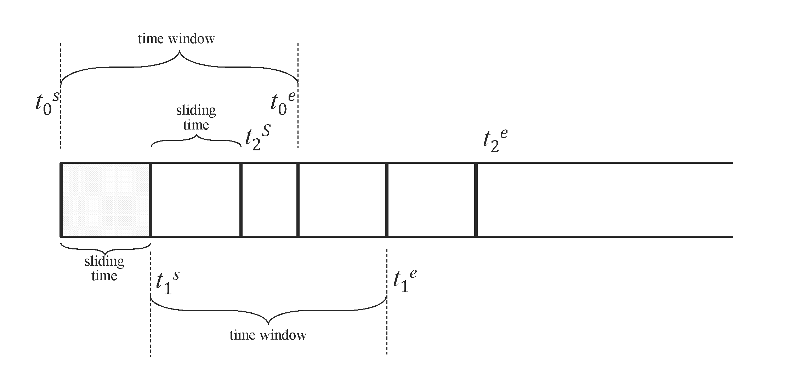
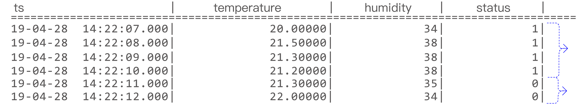
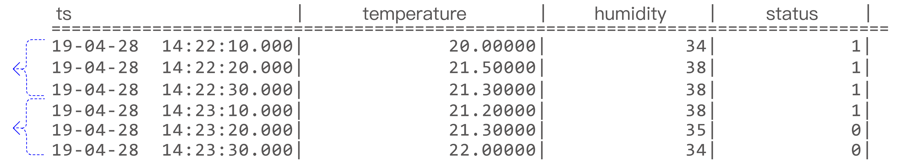
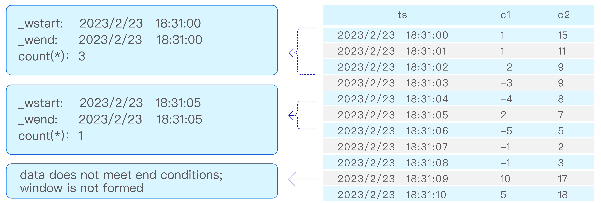
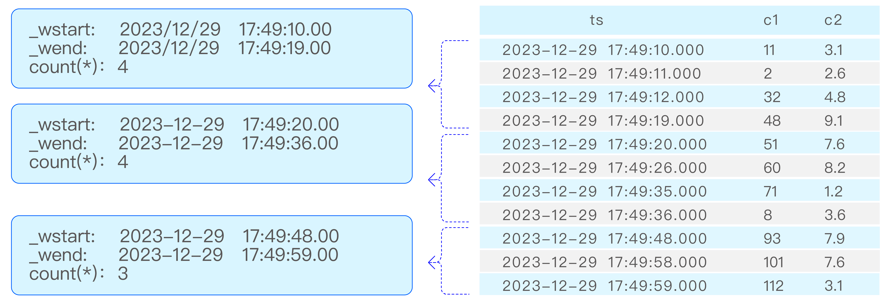

在支持标准 SQL 的基础上，TDengine 还提供一系列面向时序业务场景的特色查询语法，便于时序应用的开发。特色查询主要包括数据切分查询和窗口切分查询。

## 数据切分查询

当需要按一定维度对数据进行切分，并在切分出的数据空间内再进行计算时，可使用数据切分子句，语法如下：

```sql
PARTITION BY part_list
```

`part_list` 可以是任意标量表达式，包括列、常量、标量函数及其组合。例如，将数据按标签 `location` 分组，取每个分组内的电压平均值：

```sql
SELECT location, AVG(voltage) FROM meters PARTITION BY location
```

TDengine 按如下方式处理数据切分子句：

- 数据切分子句位于 `WHERE` 子句之后。
- 数据切分子句将表数据按指定的维度进行切分，每个切分的分片进行指定的计算。计算由之后的子句定义（窗口子句、`GROUP BY` 子句或 `SELECT` 子句）。
- 数据切分子句可以和窗口切分子句（或 `GROUP BY` 子句）一起使用，此时后面的子句作用在每个切分的分片上。例如，将数据按标签 `location` 分组，并对每个组按 10 分钟降采样，取其最大值。

```sql
SELECT _wstart, location, MAX(current) FROM meters PARTITION BY location INTERVAL(10m)
```

数据切分子句最常见的用法就是在超级表查询中，按标签将子表数据进行切分，然后分别进行计算。特别是 `PARTITION BY TBNAME` 用法，它将每个子表的数据独立出来，形成一条条独立的时间序列，极大地方便了各种时序场景的统计分析。例如，统计每个电表每 10 分钟内的电压平均值：

```sql
SELECT _wstart, tbname, AVG(voltage) FROM meters PARTITION BY tbname INTERVAL(10m)
```

## 窗口切分查询

TDengine 支持按时间窗口切分方式进行聚合结果查询，比如温度传感器每秒采集一次数据，但需查询每隔 10 分钟的温度平均值。这种场景下可以使用窗口子句来获得需要的查询结果。窗口子句用于针对查询的数据集合按照窗口切分成为查询子集并进行聚合，窗口包含时间窗口（time window）、状态窗口（state window）、会话窗口（session window）、事件窗口（event window）、计数窗口（count window）、外部窗口（external window）六种窗口。其中时间窗口又可划分为滑动时间窗口和翻转时间窗口。

窗口子句语法如下：

```sql
window_clause: {
    SESSION(ts_col, tol_val)
  | STATE_WINDOW(state_expr [, state_expr ...]) [EXTEND(extend_val)] [ZEROTH_STATE(zeroth_val [, zeroth_val ...])] [TRUE_FOR(true_for_expr)]
  | INTERVAL(interval_val [, interval_offset]) [SLIDING (sliding_val)] [fill_clause]
  | EXTERNAL_WINDOW ((subquery) window_alias) [fill_clause]
  | EVENT_WINDOW START WITH start_trigger_condition END WITH end_trigger_condition [TRUE_FOR(...)]
  | COUNT_WINDOW(count_val[, sliding_val][, col_name ...])
}
```

其中，`interval_val` 和 `sliding_val` 都表示时间段，`interval_offset` 表示窗口偏移量，且必须小于 `interval_val`。语法上支持三种写法，例如：

- `INTERVAL(1s, 500a) SLIDING(1s)`：自带时间单位，时间单位参见 [时间单位](../01-datatype.md#时间单位)。
- `INTERVAL(1000, 500) SLIDING(1000)`：不带时间单位，使用查询库的时间精度作为默认单位；存在多个库时默认采用精度更高的库。
- `INTERVAL('1s', '500a') SLIDING('1s')`：自带时间单位的字符串形式，字符串内部不能有空格等其它字符。

`EVENT_WINDOW` 的 `TRUE_FOR(...)` 除窗口整体过滤外，还可包含 `START(...)` / `END(...)` 连续满足条件，详见 [事件窗口](#事件窗口)。

### 窗口子句的规则

以下规则适用于 `SESSION`、`STATE_WINDOW`、`INTERVAL`、`EVENT_WINDOW`、`COUNT_WINDOW` 五种窗口。`EXTERNAL_WINDOW` 的规则与其他窗口有差异，详见 [外部窗口](#外部窗口)。

- 窗口子句位于数据切分子句之后，不可以和 `GROUP BY` 子句一起使用。
- 窗口子句将数据按窗口切分，并对每个窗口计算 `SELECT` 列表中的表达式。`SELECT` 列表中的表达式只能包含：
  - 常量。
  - `_wstart`、`_wend` 和 `_wduration` 伪列。
  - 聚集函数（包括选择函数、可以由参数确定输出行数的时序特有函数，以及时序函数中的窗口计算和时间加权统计函数）。
  - 包含上面表达式的表达式。
  - `v3.4.0.0` 之前还要求至少包含一个聚集函数；之后不再有该限制。
  - 列表达式和不定行函数（`v3.4.2.0` 起支持），此时查询将进入 [窗口投影模式](#窗口投影模式)，每个窗口输出全部原始行而非一行聚合结果。
- `WHERE` 子句可以指定查询的起止时间和其他过滤条件。

### 时间窗口

时间窗口又可分为滑动时间窗口和翻转时间窗口。

`INTERVAL` 子句用于产生等长时间周期的窗口，`SLIDING` 用于指定窗口向前滑动的时间。每次执行的查询对应一个时间窗口，窗口随时间向前滑动。定义连续查询时需指定时间窗口大小和前向增量。如图，`[t0s, t0e]`、`[t1s, t1e]`、`[t2s, t2e]` 分别是三次连续查询的时间窗口范围，前向滑动范围由 sliding time 标识。查询过滤、聚合等操作按每个时间窗口独立执行。当 `SLIDING` 与 `INTERVAL` 相等时，滑动窗口即为翻转窗口。默认情况下，窗口从 Unix time 0（`1970-01-01 00:00:00 UTC`）开始划分；若设置了 `interval_offset`，则从“Unix time 0 + interval_offset”开始划分。

查询对象是超级表时，聚合函数会作用于该超级表下满足过滤条件的所有表数据，返回结果按窗口起始时间严格单调递增；若使用 `PARTITION BY` 分组，则每个分组内按窗口起始时间严格单调递增。



`INTERVAL` 与 `SLIDING` 通常配合聚合函数和选择函数使用；在 [窗口投影模式](#窗口投影模式) 下，也可以输出原始列。

`SLIDING` 的向前滑动时间不能超过一个窗口的时间范围。以下语句非法：

```sql
SELECT COUNT(*) FROM temp_tb_1 INTERVAL(1m) SLIDING(2m);
```

`INTERVAL` 子句允许使用 `AUTO` 关键字指定窗口偏移量（`v3.3.5.0` 起支持）。若 `WHERE` 条件给出了明确可应用的起始时间限制，则会自动计算偏移量，使时间窗口从该时间点切分；否则不生效，仍以 `0` 作为偏移量。示例如下：

```sql
-- 有起始时间限制，从 '2018-10-03 14:38:05' 切分时间窗口
SELECT COUNT(*) FROM meters WHERE _rowts >= '2018-10-03 14:38:05' INTERVAL (1m, AUTO);

-- 无起始时间限制，不生效，仍以 0 为偏移量
SELECT COUNT(*) FROM meters WHERE _rowts < '2018-10-03 15:00:00' INTERVAL (1m, AUTO);

-- 起始时间限制不明确，不生效，仍以 0 为偏移量
SELECT COUNT(*) FROM meters WHERE _rowts - voltage > 1000000;
```

`INTERVAL` 子句支持使用 `FILL` 指定数据缺失时的填充方法，支持除 `NEAR` 外的所有填充模式。`FILL` 用法详见 [FILL 子句](01-query.md#fill-子句)。

使用时间窗口需要注意：

- 窗口宽度由 `INTERVAL` 指定，最小允许值受客户端配置参数 [`minIntervalTime`](../../12-operations-and-tooling/03-components/02-taosc.md#minintervaltime) 约束（默认值为 `1`，单位与数据库时间精度一致）；并支持偏移 `interval_offset`（必须小于间隔），即相对“UTC 时刻 0”的划分偏移。`SLIDING` 用于指定每次窗口向前滑动的时长。
- 使用 `INTERVAL` 时，除极特殊情况外，建议将客户端与服务端 `taos.cfg` 中的 `timezone` 配置为相同取值，以避免时间处理函数频繁跨时区转换带来的严重性能影响。
- 返回结果中的时间序列严格单调递增。
- 使用 `AUTO` 作为窗口偏移量时，如果 `WHERE` 时间条件较复杂（例如多个 `AND` / `OR` / `IN` 组合），`AUTO` 可能不生效，此时可手动指定窗口偏移量。
- 使用 `AUTO` 作为窗口偏移量时，若窗口宽度单位为 `d`（天）、`n`（月）、`w`（周）、`y`（年），例如 `INTERVAL(1d, AUTO)`、`INTERVAL(3w, AUTO)`，则 TSMA 优化无法生效。若目标表已手动创建 TSMA，语句会报错退出；此时可显式指定 Hint `SKIP_TSMA`，或不使用 `AUTO`。

### 状态窗口

状态窗口根据一个或多个状态键的连续性划分窗口（从 `v3.4.2.0` 版本开始支持多个状态键）。状态键支持整数、布尔值和字符串类型，也支持返回这些类型的表达式，例如 `CASE WHEN`、`IF`、比较表达式、`IN`、`BETWEEN`、`IS NULL` / `IS NOT NULL` 以及由 `AND`、`OR`、`NOT` 组合的逻辑表达式。相邻记录的状态键会按 SQL 中的书写顺序逐项比较，只要任意一项发生变化，就会关闭当前窗口并开启新窗口。如下图展示的是单状态键场景，对应的两个窗口分别是 [2019-04-28 14:22:07，2019-04-28 14:22:10] 和 [2019-04-28 14:22:11，2019-04-28 14:22:12]。



状态窗口语法如下：

```sql
STATE_WINDOW(state_expr [, state_expr ...])
  [EXTEND(extend_val)]
  [ZEROTH_STATE(zeroth_val [, zeroth_val ...])]
  [TRUE_FOR(true_for_expr)]
```

参数说明如下：

- `state_expr`：一个或多个状态键。可以是列引用或标签，也可以是 `CASE WHEN`、`IF`、`CAST`、比较表达式、`IN`、`BETWEEN`、`IS NULL` / `IS NOT NULL` 以及 `AND`、`OR`、`NOT` 组合的逻辑表达式；返回类型必须是整数、布尔值或 `VARCHAR`。
- `EXTEND(extend_val)`：可选，指定窗口边界扩展策略。`0` 为默认行为，窗口开始、结束时间取当前状态的第一条和最后一条记录，窗口间的全 `NULL` 行会被丢弃；`1` 保持窗口开始时间不变，并将窗口结束时间向后扩展到下一个窗口开始前；`2` 保持窗口结束时间不变，并将窗口开始时间向前扩展到上一个窗口结束后。
- `ZEROTH_STATE(...)`：可选，指定"零状态"。通过 `ZEROTH_STATE` 指定这些不关心的状态值后，匹配的窗口会被自动过滤，不参与计算也不输出，从而简化结果。参数个数必须与状态键个数一致；非 `NO_ZEROTH` 的参数必须是常量，且可以转换为对应状态键的数据类型；`NO_ZEROTH` 表示对应位置不参与零状态判断。只有所有已配置零状态的位置都等于对应值时，该窗口才会被过滤。
- `TRUE_FOR(true_for_expr)`：可选，指定窗口过滤条件。支持 `TRUE_FOR(duration_time)`、`TRUE_FOR(COUNT n)`、`TRUE_FOR(duration_time AND COUNT n)`、`TRUE_FOR(duration_time OR COUNT n)` 四种形式。

状态键中的 `NULL` 按下面的规则处理：

- 连续相同状态键（`NULL` 位置相同，且非 `NULL` 状态键也完全相同）的行会作为一个整体决定是并入前一个窗口、并入后一个窗口，还是独立成窗，其归属和扩展与 `EXTEND` 参数相关；
- 两个状态窗口互相兼容指：除 `NULL` 列外，这两个窗口其他状态键完全相同；兼容的窗口在 `EXTEND` 影响下可以合并；
- 被相同状态键包裹的全 `NULL` 行归入这个整体考虑；
- 当所有状态键列都是 `NULL` 时，该行不会触发状态变化，其归属受前后数据及 `EXTEND` 参数的影响；
- 当只有部分状态键列为 `NULL` 时（仅多列场景），这些 `NULL` 列不参与逐列比较，通过其他非 `NULL` 列决定窗口划分。

下表给出几种最常见的合并结果。表中“并入前窗 / 并入后窗 / 独立成窗”都指中间那段连续的部分 `NULL` 行：

| 输入序列（状态键） | `EXTEND(0)` | `EXTEND(1)` | `EXTEND(2)` |
| --- | --- | --- | --- |
| `(1, 10) -> (1, NULL) -> (1, 20)` | 并入前窗 | 并入前窗 | 并入后窗 |
| `(1, 'a') -> (1, NULL) -> (2, 'a')` | 并入前窗 | 并入前窗 | 独立成窗 |
| `(1, 'a') -> (NULL, 'b') -> (1, 'b')` | 并入后窗 | 独立成窗 | 并入后窗 |
| `(1, 'a') -> (NULL, 'b') -> (2, 'a')` | 独立成窗 | 独立成窗 | 独立成窗 |
| `(NULL, 'b') -> (1, 'b') -> (1, 'b')` | 并入后窗 | 独立成窗 | 并入后窗 |
| `(1, 'a') -> (1, 'a') -> (1, NULL)` | 并入前窗 | 并入前窗 | 独立成窗 |

如果连续多行都属于同一段部分 `NULL` 行，规则不变。例如 `(1, 'a') -> (1, NULL) -> (NULL, NULL) -> (1, NULL) -> (2, 'a')` 中间三行会一起处理：`EXTEND(0)` 和 `EXTEND(1)` 并入前窗，`EXTEND(2)` 独立成窗。

#### 状态键示例

单列状态窗口示例：

```sql
SELECT COUNT(*), FIRST(ts), status FROM temp_tb_1 STATE_WINDOW(status);
```

仅关心 `status = 2` 的窗口时，可以继续在外层过滤：

```sql
SELECT * FROM (SELECT COUNT(*) AS cnt, FIRST(ts) AS fst, status FROM temp_tb_1 STATE_WINDOW(status)) t WHERE status = 2;
```

多列状态窗口示例：

```sql
SELECT _wstart, _wend, COUNT(*), c_int, c_bool
FROM ntb1
STATE_WINDOW(c_int, c_bool);
```

上面的 SQL 使用 `c_int` 和 `c_bool` 共同定义状态键。只要 `c_int` 或 `c_bool` 任一值发生变化，就会关闭当前窗口并开启新窗口。

TDengine 还支持将 `CASE` 或 `IF` 表达式作为状态键。例如，智能电表的电压正常范围是 205V 到 235V，那么可以通过监控电压来判断电路是否正常；也可以把多个离散状态联合起来定义窗口边界。

```sql
SELECT tbname, _wstart, CASE WHEN voltage >= 205 AND voltage <= 235 THEN 1 ELSE 0 END status FROM meters PARTITION BY tbname STATE_WINDOW(CASE WHEN voltage >= 205 AND voltage <= 235 THEN 1 ELSE 0 END);
```

同样的逻辑也可以用 `IF` 表达式更简洁地表达：

```sql
SELECT tbname, _wstart, IF(voltage >= 205 AND voltage <= 235, 1, 0) AS status FROM meters PARTITION BY tbname STATE_WINDOW(IF(voltage >= 205 AND voltage <= 235, 1, 0));
```

在超级表查询或包含 tag 列的子查询中，状态表达式也可以引用当前查询上下文中可见的 tag 列，只要最终表达式结果类型仍为整型、布尔型或字符串类型。例如，可以根据 tag `groupId` 动态调整阈值：

```sql
SELECT tbname, _wstart, _wend,
       CASE WHEN voltage >= 220 + groupId THEN 'high' ELSE 'normal' END AS status
FROM meters
PARTITION BY tbname
STATE_WINDOW(CASE WHEN voltage >= 220 + groupId THEN 'high' ELSE 'normal' END);
```

从 `v3.4.2.0` 起也支持直接使用 tag 列或 `tbname` 作为状态键，例如 `STATE_WINDOW(groupId)` 或 `STATE_WINDOW(tbname)`。

从 `v3.4.2.0` 起也支持直接使用逻辑表达式作为状态键。例如，可按布尔条件切分窗口：

```sql
SELECT _wstart, _wend, COUNT(*)
FROM meters
PARTITION BY tbname
STATE_WINDOW(voltage > 235);
```

也支持更复杂的逻辑组合：

```sql
SELECT _wstart, _wend, COUNT(*)
FROM meters
PARTITION BY tbname
STATE_WINDOW(voltage BETWEEN 205 AND 235 AND current IS NOT NULL, phase IN ('A', 'B'));
```

#### EXTEND 参数

以如下数据为例，展示 `EXTEND` 参数对窗口划分及 `NULL` 行归属的影响。

```sql
taos> SELECT * FROM state_window_example;
           ts            |   status    |
========================================
 2025-01-01 00:00:00.000 | NULL        |
 2025-01-01 00:00:01.000 |           1 |
 2025-01-01 00:00:02.000 | NULL        |
 2025-01-01 00:00:03.000 |           1 |
 2025-01-01 00:00:04.000 | NULL        |
 2025-01-01 00:00:05.000 |           2 |
 2025-01-01 00:00:06.000 |           2 |
 2025-01-01 00:00:07.000 |           1 |
 2025-01-01 00:00:08.000 | NULL        |
```

Extend 参数可以设置窗口开始、结束时的扩展策略，可选值为 `0`（默认值）、`1`、`2`。

当 `EXTEND` 值为 `0` 时，窗口的开始和结束时间取当前状态的第一条和最后一条非 `NULL` 记录。首部和尾部的 `NULL` 行以及不同状态之间的 `NULL` 行均被丢弃，仅被同一状态值夹在中间的 `NULL` 行归入当前窗口。

```sql
taos> SELECT _wstart, _wduration, _wend, COUNT(*) FROM state_window_example STATE_WINDOW(status) EXTEND(0);
         _wstart         | _wduration |          _wend          | count(*) |
============================================================================
 2025-01-01 00:00:01.000 |       2000 | 2025-01-01 00:00:03.000 |        3 |
 2025-01-01 00:00:05.000 |       1000 | 2025-01-01 00:00:06.000 |        2 |
 2025-01-01 00:00:07.000 |          0 | 2025-01-01 00:00:07.000 |        1 |
```

当 `EXTEND` 值为 `1` 时，窗口开始时间不变，窗口结束时间向后扩展到下一个窗口开始前。不同状态之间的 `NULL` 行和尾部 `NULL` 行归入前一个窗口，首部 `NULL` 行被丢弃。

```sql
taos> SELECT _wstart, _wduration, _wend, COUNT(*) FROM state_window_example STATE_WINDOW(status) EXTEND(1);
         _wstart         | _wduration |          _wend          | count(*) |
============================================================================
 2025-01-01 00:00:01.000 |       3999 | 2025-01-01 00:00:04.999 |        4 |
 2025-01-01 00:00:05.000 |       1999 | 2025-01-01 00:00:06.999 |        2 |
 2025-01-01 00:00:07.000 |       1000 | 2025-01-01 00:00:08.000 |        2 |
```

当 `EXTEND` 值为 `2` 时，窗口结束时间不变，窗口开始时间向前扩展到上一个窗口结束后。不同状态之间的 `NULL` 行和首部 `NULL` 行归入后一个窗口，尾部 `NULL` 行被丢弃。

```sql
taos> SELECT _wstart, _wduration, _wend, COUNT(*) FROM state_window_example STATE_WINDOW(status) EXTEND(2);
         _wstart         | _wduration |          _wend          | count(*) |
============================================================================
 2025-01-01 00:00:00.000 |       3000 | 2025-01-01 00:00:03.000 |        4 |
 2025-01-01 00:00:03.001 |       2999 | 2025-01-01 00:00:06.000 |        3 |
 2025-01-01 00:00:06.001 |        999 | 2025-01-01 00:00:07.000 |        1 |
```

#### ZEROTH_STATE 参数

`ZEROTH_STATE` 用于指定“零状态”，即不关心的基线状态值。状态窗口查询往往会产生大量处于默认 / 空闲 / 正常状态的窗口，而业务通常更关注异常或特定状态。状态表达式结果为零状态的窗口将不会被计算和输出；输入必须是整型、布尔型或字符串常量。多列场景下，只有所有参与判断的位置都等于各自的零状态值时，该窗口才会被过滤；若某个位置写成 `NO_ZEROTH`，则该位置不参与零状态判断。

单列 `ZEROTH_STATE` 仍以相同数据为例。当零状态值为 `2` 时：

```sql
taos> SELECT _wstart, _wduration, _wend, COUNT(*) FROM state_window_example STATE_WINDOW(status) EXTEND(0) ZEROTH_STATE(2);
         _wstart         | _wduration |          _wend          | count(*) |
============================================================================
 2025-01-01 00:00:00.000 |       3000 | 2025-01-01 00:00:03.000 |         4 |
 2025-01-01 00:00:07.000 |       1000 | 2025-01-01 00:00:08.000 |         2 |
```

多列 `ZEROTH_STATE` 示例：

```sql
SELECT _wstart, _wend, COUNT(*), c1, c2
FROM ntb_null
STATE_WINDOW(c1, c2) EXTEND(0) ZEROTH_STATE(1, 10);
```

上面的 SQL 会过滤掉状态键同时满足 `(1, 10)` 的窗口，但会保留 `(1, 20)`、`(2, 20)` 等窗口。如果只想约束其中某个位置，可以使用 `NO_ZEROTH` 占位，例如 `ZEROTH_STATE(1, NO_ZEROTH)`。

#### TRUE_FOR 参数

状态窗口支持使用 `TRUE_FOR` 设定窗口过滤条件。只有满足条件的窗口才会返回计算结果。支持以下四种模式：

- `TRUE_FOR(duration_time)`：仅基于持续时长过滤，窗口持续时长必须大于等于 `duration_time`。
- `TRUE_FOR(COUNT n)`：仅基于数据行数过滤，窗口数据行数必须大于等于 `n`。
- `TRUE_FOR(duration_time AND COUNT n)`：同时满足持续时长和数据行数条件。
- `TRUE_FOR(duration_time OR COUNT n)`：满足持续时长或数据行数条件之一即可。

例如，设置最短持续时长为 3s：

```sql
SELECT COUNT(*), FIRST(ts), status FROM temp_tb_1 STATE_WINDOW(status) TRUE_FOR (3s);
```

或者设置最少行数为 100 行：

```sql
SELECT COUNT(*), FIRST(ts), status FROM temp_tb_1 STATE_WINDOW(status) TRUE_FOR (COUNT 100);
```

或者同时满足持续时长和行数条件：

```sql
SELECT COUNT(*), FIRST(ts), status FROM temp_tb_1 STATE_WINDOW(status) TRUE_FOR (3s AND COUNT 50);
```

### 会话窗口

会话窗口根据记录时间戳主键的值判断是否属于同一会话。如下图所示，若连续时间戳间隔小于等于 12 秒，则以下 6 条记录构成 2 个会话窗口，分别是 `[2019-04-28 14:22:10，2019-04-28 14:22:30]` 和 `[2019-04-28 14:23:10，2019-04-28 14:23:30]`。因为 `2019-04-28 14:22:30` 与 `2019-04-28 14:23:10` 的时间间隔为 40 秒，超过了连续时间间隔（12 秒）。



在 `tol_val` 时间间隔范围内的记录归属于同一窗口；若连续两条记录的时间间隔超过 `tol_val`，则自动开启下一个窗口。

```sql
SELECT COUNT(*), FIRST(ts) FROM temp_tb_1 SESSION(ts, tol_val);
```

### 事件窗口

事件窗口根据开始条件和结束条件划定窗口：当 `start_trigger_condition` 满足时窗口开始，直到 `end_trigger_condition` 满足时窗口关闭。开始/结束条件可以是任意 TDengine 支持的条件表达式，且可以包含不同列。

在超级表查询或包含 tag 列的子查询中，开始/结束条件表达式同样可以引用 tag 列。例如，可根据 tag `groupId` 使用不同的电压阈值：

```sql
SELECT tbname, _wstart, _wend, COUNT(*)
FROM meters
PARTITION BY tbname
EVENT_WINDOW START WITH voltage >= 220 + groupId END WITH voltage < 220 + groupId;
```

事件窗口可以仅包含一条数据：当一条数据同时满足开始和结束条件，且当前不在窗口内时，该数据单独构成一个窗口。

若窗口无法关闭，则不构成窗口、不会输出。即有数据满足开始条件使窗口打开，但后续数据始终不满足结束条件，这部分数据不会形成窗口。

若直接在超级表上做事件窗口查询，TDengine 会将超级表数据汇总为一条时间线再计算。若对子查询结果集做事件窗口查询，子查询结果需按时间线输出，并包含有效时间戳列。

以下面的 SQL 为例，事件窗口切分如图所示：

```sql
SELECT _wstart, _wend, COUNT(*) FROM t EVENT_WINDOW START WITH c1 > 0 END WITH c2 < 10;
```



事件窗口支持使用 `TRUE_FOR` 参数来设定窗口整体过滤条件，以及开窗/关窗连续满足门限。三种参数均可选，顺序任意，最多各出现一次：

**窗口整体过滤（`limit_expr`）**：对已完成的窗口按持续时长或行数过滤，只有满足条件的窗口才会返回计算结果：

- `TRUE_FOR(duration_time)`：仅基于持续时长过滤，窗口持续时长必须大于等于 `duration_time`。
- `TRUE_FOR(COUNT n)`：仅基于数据行数过滤，窗口数据行数必须大于等于 `n`。
- `TRUE_FOR(duration_time AND COUNT n)`：同时满足持续时长和数据行数条件。
- `TRUE_FOR(duration_time OR COUNT n)`：满足持续时长或数据行数条件之一即可。

**开窗连续满足条件（`start(limit_expr)`）**：指定开窗条件（`START WITH` 表达式）必须连续满足 `limit_expr` 指定的行数或时长后，窗口才真正打开。`_wstart` 取 streak 第一行的时间戳（streak 期间的"预热"行包含在窗口内）。streak 中途中断（出现不满足开窗条件的行）则重新计数。仅支持单开窗条件的 `EVENT_WINDOW`。

**关窗连续满足条件（`end(limit_expr)`）**：指定关窗条件（`END WITH` 表达式）必须连续满足 `limit_expr` 指定的行数或时长后，窗口才真正关闭。`_wend` 取关窗 streak 第一行的时间戳（streak 期间的后续行不计入窗口）。streak 中途中断（出现不满足关窗条件的行）则重新计数，窗口保持开启。仅支持单开窗条件的 `EVENT_WINDOW`。

例如，设置最短持续时长为 3s：

```sql
SELECT _wstart, _wend, COUNT(*) FROM t EVENT_WINDOW START WITH c1 > 0 END WITH c2 < 10 TRUE_FOR (3s);
```

或者设置最少行数为 100 行：

```sql
SELECT _wstart, _wend, COUNT(*) FROM t EVENT_WINDOW START WITH c1 > 0 END WITH c2 < 10 TRUE_FOR (COUNT 100);
```

或者同时满足持续时长和行数条件：

```sql
SELECT _wstart, _wend, COUNT(*) FROM t EVENT_WINDOW START WITH c1 > 0 END WITH c2 < 10 TRUE_FOR (3s AND COUNT 50);
```

或者要求开窗条件连续满足 2 行后才真正开窗：

```sql
SELECT _wstart, _wend, COUNT(*) FROM t EVENT_WINDOW START WITH c1 > 0 END WITH c2 < 10 TRUE_FOR (START(COUNT 2));
```

或者要求关窗条件连续满足 3s 后才真正关窗：

```sql
SELECT _wstart, _wend, COUNT(*) FROM t EVENT_WINDOW START WITH c1 > 0 END WITH c2 < 10 TRUE_FOR (END(3s));
```

或者同时设置开窗和关窗的连续满足条件，并过滤持续时长不足 5s 的窗口：

```sql
SELECT _wstart, _wend, COUNT(*) FROM t EVENT_WINDOW START WITH c1 > 0 END WITH c2 < 10 TRUE_FOR (5s, START(COUNT 2), END(COUNT 3));
```

### 计数窗口

计数窗口按固定的数据行数划分窗口。默认先按时间戳排序，再按 `count_val` 将数据划分为多个窗口并做聚合。`count_val` 表示每个计数窗口包含的最大行数；总行数不能整除 `count_val` 时，最后一个窗口行数会小于 `count_val`。`sliding_val` 为常量，表示窗口滑动的行数，类似 `INTERVAL` 的 `SLIDING`。`col_name` 参数自 `v3.3.7.0` 起支持，可指定一列或多列：计数时，每行在指定列中至少有一列非空才会计入窗口，否则不计入。未指定 `col_name` 时无非空限制。

以下面的 SQL 语句为例，计数窗口切分如图所示：

```sql
SELECT _wstart, _wend, COUNT(*) FROM t COUNT_WINDOW(4);
```



### 外部窗口

外部窗口（External Window）用于“先定义窗口，再在窗口内计算”。与 `INTERVAL`、`EVENT_WINDOW` 等内建窗口不同，外部窗口的时间范围由子查询显式给出，适合跨事件关联、窗口复用、分层过滤等复杂分析。

外部窗口的语法：

```sql
SELECT ...
FROM table_name
[PARTITION BY expr_list]
EXTERNAL_WINDOW (
    (subquery_that_defines_windows) window_alias
)
[FILL(fill_mode_and_val)]
[HAVING condition]
[ORDER BY ...]
```

其中：

- 子查询的前两列必须是 `TIMESTAMP` 类型，分别表示窗口开始时间和结束时间。
- 子查询第 3 列及之后的列会成为“窗口属性列”。
- 外部查询会在每个窗口范围内独立计算。

#### 核心特性

1. **子查询生成窗口的灵活性：** 定义窗口的子查询支持普通子查询、`INTERVAL`、`EVENT_WINDOW`、`SESSION` 等多种写法，可灵活生成所需窗口范围。

2. **窗口内聚合和计算：** 外部查询在每个窗口范围内独立计算，支持聚合和标量运算。

3. **窗口查询模式：** 外部窗口支持 `SCALAR` / `AGG` 关键字。与其他窗口不同，外部窗口在歧义场景下默认使用 **投影模式**（每窗口输出全部原始行），可使用 `AGG` 切换为聚合模式（每窗口输出一行）。详见 [窗口投影模式](#窗口投影模式)。

4. **伪列支持：** `_wstart`（窗口开始时间）、`_wend`（窗口结束时间）、`_wduration`（窗口时长）可在 `SELECT`、`HAVING`、`ORDER BY` 子句中使用。

5. **分组和对齐：**
    - 子查询可以使用 `PARTITION BY` 或 `GROUP BY` 进行分组，外部查询只能使用 `PARTITION BY` 进行分组。
    - 当子查询与外部查询都使用了分组时，按分组键对齐：同组数据只匹配同组窗口。
    - 若某个分组在某个窗口内没有匹配数据，则该分组在该窗口下不会产出结果行（会被自然忽略）。
    - 当子查询未使用分组时，内部子查询只生成一组共享窗口；若外部查询使用了分组，则每个外部分组都会在这同一组窗口上分别进行计算。
    - 当子查询使用了分组，但外部查询未使用分组时，语法禁止。
    - **当前限制与注意事项**：当内外查询都使用了分组，且窗口子查询中再使用 `ORDER BY` 时，排序可能打乱各分组窗口流的原有组织方式；外部查询可能作用于合并后的窗口流，表现为内部分组语义失效（等同未分组），不再按内外分组一一对齐。

6. **嵌套调用支持：** 支持多层外部窗口嵌套，即外部窗口的子查询本身也可以使用 `EXTERNAL_WINDOW`，从而实现分层聚合。例如：先用第一层外部窗口按事件划定时间范围并聚合出中间指标，再用第二层外部窗口在新的时间范围内对这些中间指标做二次聚合。

#### 窗口属性列引用规则

子查询中前两列之后的列（例如 `groupid`、`location`）会作为窗口属性列。引用规则如下：

1. 必须使用窗口别名按 `别名.列名` 的方式逐列引用：`window_alias.column_name`，例如 `w.groupid`、`w.location`。
2. 窗口属性列只能以 `w.column_name` 这种形式出现在外层查询的 `SELECT`、`HAVING`、`ORDER BY` 子句中。
3. **不能在 `WHERE` 子句中引用**（`WHERE` 用于过滤外部表记录，此时窗口尚未生成；窗口属性只有在窗口定义后才可用，应在 `HAVING` 中使用）。
4. 当前实现中，窗口别名并不是一张完整的“虚拟表”，**不支持使用 `w.*` 通配符展开全部窗口属性列**，也不能在 `FROM` / `JOIN` 中单独把 `w` 当作表来引用；如有需要请在子查询中显式选择，并在外层逐列引用。

#### 使用示例

**示例 1** - 以 INTERVAL 子查询生成窗口，统计窗口内的聚合值：

```sql
SELECT _wstart, _wend, COUNT(*), AVG(voltage)
FROM meters
EXTERNAL_WINDOW (
    (SELECT _wstart, _wend FROM meters INTERVAL(10m)) w
);
```

上面的 SQL，先通过内部子查询按 10 分钟时间窗口划分出窗口范围，再由外部查询在每个窗口范围内独立统计 `meters` 表中的记录总数和电压平均值。

**示例 2** - 以事件驱动方式生成窗口，跨表统计告警信息：

智能电表的建表语句如下：

```sql
CREATE TABLE meters (ts TIMESTAMP, current FLOAT, voltage INT, phase FLOAT) TAGS (location BINARY(64), groupId INT);
```

假设还有一张告警事件表 `alerts`（超级表），包含列 `ts`、`alert_code`、`alert_value`，标签为 `groupid` 和 `location`。

目标：以每组电表的电压异常事件为时间窗口（电压 >= 225V 的时刻起 60 秒内），统计该窗口内的告警情况。输出应包含：分组信息、窗口内告警数量和最大告警值，并过滤出"有告警产生"的窗口，按分组和时间排序。

```sql
SELECT
    w.groupid,
    w.location,
    _wstart                AS event_start_time,
    COUNT(*)               AS alert_count,
    MAX(a.alert_value)     AS max_alert_value,
    AVG(a.alert_value)     AS avg_alert_value
FROM alerts a
PARTITION BY a.groupid
EXTERNAL_WINDOW (
    (SELECT ts, ts + 60s, groupid, location
     FROM meters
     WHERE voltage >= 225
     PARTITION BY groupid
    ) w
)
HAVING COUNT(*) > 0
ORDER BY w.groupid, event_start_time;
```

**结果说明：**

- 每行代表一个电压异常事件窗口（由 `meters` 中 `voltage >= 225` 的记录驱动），窗口时长为事件发生后 60 秒。
- `alert_count`、`max_alert_value`、`avg_alert_value`：该窗口内来自 `alerts` 的统计指标。
- `w.groupid`、`w.location`：窗口属性列，来自子查询中的标签列，用于展示分组信息。
- `HAVING` 条件使用聚合函数 (`COUNT`) 过滤出至少有一条告警的窗口。
- `PARTITION BY` 对齐：内外查询均按 `groupid` 分组，确保每组电表的告警只与该组的异常窗口匹配。

#### 空窗口的 FILL

`EXTERNAL_WINDOW` 支持使用 `FILL` 控制空窗口的输出行为。默认情况下，如果某个窗口在外层查询表中没有匹配到任何数据行，该窗口不会产出结果行。增加 `FILL` 后，可以保留该窗口，并按指定模式填充聚合列。

`EXTERNAL_WINDOW` 支持的模式如下：

| 模式 | 行为 |
|:----:|:-----|
| `NONE` | 默认行为，空窗口不产出结果行 |
| `NULL` | 空窗口产出一行，聚合列填充为 `NULL`；若整个查询范围内都没有数据，则不产出 |
| `NULL_F` | 与 `NULL` 类似，但即使整个查询范围内都没有数据，也会产出空窗口行 |
| `VALUE` | 空窗口产出一行，聚合列填充为用户指定值；若整个查询范围内都没有数据，则不产出 |
| `VALUE_F` | 与 `VALUE` 类似，但即使整个查询范围内都没有数据，也会产出空窗口行 |
| `PREV` | 空窗口使用前一个非空窗口的聚合结果填充；若无前值则填充为 `NULL` |
| `NEXT` | 空窗口使用后一个非空窗口的聚合结果填充；若无后值则填充为 `NULL` |

`EXTERNAL_WINDOW` 暂不支持 `LINEAR`、`NEAR`、`SURROUND`。

`FILL` 的执行先于 `HAVING`，因此填充生成的结果行也会参与 `HAVING` 过滤。

关于 `FILL` 的通用语法，请参阅 [FILL 子句](01-query.md#fill-子句)。

示例：

```sql
SELECT _wstart, AVG(voltage) AS avg_vol, COUNT(*) AS cnt
FROM meters
EXTERNAL_WINDOW (
    (SELECT '2022-01-01 00:00:00'::TIMESTAMP,
       '2022-01-01 00:01:00'::TIMESTAMP
     UNION ALL
     SELECT '2022-01-01 00:01:00'::TIMESTAMP,
       '2022-01-01 00:02:00'::TIMESTAMP
     UNION ALL
     SELECT '2022-01-01 00:02:00'::TIMESTAMP,
       '2022-01-01 00:03:00'::TIMESTAMP
    ) w
)
FILL(VALUE, 0, 0)
ORDER BY _wstart;
```

上面的 SQL 定义了 3 个一分钟的外部窗口。如果某个窗口内没有 `meters` 表的数据，则 `avg_vol` 和 `cnt` 都会被填充为 `0`。

#### 约束与限制

- 暂时不支持在流式计算和订阅中使用。
- 窗口子查询的前两列必须为 `TIMESTAMP` 类型，分别表示窗口开始和结束时间。
- 子查询返回的窗口行需要保持有序：未分组场景按窗口开始时间（第一列）升序；分组场景在各分组内按窗口开始时间升序；不满足时执行报错。
- 若外部窗口（内部子查询）使用了分组，则外部查询必须同时使用 `PARTITION BY`，否则语法报错。
- 不支持窗口作用域内的不定行函数（如 `DIFF`、`INTERP`）。

### 窗口投影模式

从 `v3.4.2.0` 版本开始，窗口查询支持投影模式。在传统的窗口聚合模式下，每个窗口输出一行聚合结果；而在窗口投影模式下，每个窗口输出其包含的全部原始行，并可附带窗口伪列（如 `_wstart`、`_wend`）。

#### 模式推断

系统根据 `SELECT` 列表的内容自动推断查询模式：

- **聚合模式**：`SELECT` 列表中包含聚合函数，每个窗口输出一行。
- **投影模式**：`SELECT` 列表中包含列表达式或不定行函数（如 `DIFF`、`CSUM` 等），每个窗口输出全部原始行。
- **歧义场景**：`SELECT` 列表仅包含伪列（`_wstart`、`_wend` 等）、标签列、`tbname`、常量、分组键（group key）和/或状态键（state key）时，`INTERVAL`、`SESSION`、`STATE_WINDOW`、`EVENT_WINDOW`、`COUNT_WINDOW` 默认选择聚合模式，而 `EXTERNAL_WINDOW` 默认选择投影模式。

#### SCALAR / AGG 关键字

当查询处于歧义场景时，可使用 `SCALAR` 或 `AGG` 关键字显式指定模式：

- `SCALAR`：强制使用投影模式。
- `AGG`：强制使用聚合模式。

注意：对于 `EXTERNAL_WINDOW`，歧义场景的默认模式是投影模式（与其他窗口相反）。此时 `AGG` 可将其切换为聚合模式。

这两个关键字位于 `SELECT` 与选择列表之间，在 `TAGS` 之后。语法如下：

```sql
SELECT [SCALAR | AGG] select_list FROM ... INTERVAL(...) ...
```

示例：

```sql
-- 歧义场景：仅伪列 + 标签 + 常量，默认聚合模式（每窗口 1 行）
SELECT _wstart, _wend, tbname FROM d1001 INTERVAL(3s);

-- 使用 SCALAR 强制投影模式（每窗口 N 行）
SELECT SCALAR _wstart, _wend, tbname FROM d1001 INTERVAL(3s);

-- 非歧义场景：包含列表达式，自动进入投影模式（三种写法等价）
SELECT _wstart, ts, current FROM d1001 INTERVAL(3s);
SELECT SCALAR _wstart, ts, current FROM d1001 INTERVAL(3s);
SELECT AGG _wstart, ts, current FROM d1001 INTERVAL(3s);
```

`EXTERNAL_WINDOW` 歧义场景默认为投影模式，使用 `AGG` 切换为聚合模式：

```sql
-- 歧义场景：仅伪列 + 标签，EXTERNAL_WINDOW 默认投影模式（每窗口 N 行）
SELECT _wstart, _wend, location FROM d1001
  EXTERNAL_WINDOW((SELECT _wstart, _wend FROM d1001 INTERVAL(3s)) w);

-- 使用 AGG 强制聚合模式（每窗口 1 行）
SELECT AGG _wstart, _wend, location FROM d1001
  EXTERNAL_WINDOW((SELECT _wstart, _wend FROM d1001 INTERVAL(3s)) w);
```

#### FILL 支持

窗口投影模式支持 `FILL` 子句，但仅支持以下模式：`NONE`、`NULL`、`NULL_F`、`VALUE`、`VALUE_F`。不支持 `PREV`、`NEXT`、`LINEAR` 和 `NEAR`。

```sql
SELECT _wstart, ts, current FROM meters
  WHERE ts >= '2024-01-01' AND ts < '2024-01-02'
  PARTITION BY tbname
  INTERVAL(10m)
  FILL(NULL);
```

### 时间戳伪列

窗口聚合查询结果中，若 SQL 未指定输出时间戳列，最终结果不会自动包含窗口时间列。若需输出聚合结果对应的时间窗口信息，可在 `SELECT` 中使用时间戳伪列：时间窗口起始时间（`_wstart`）、结束时间（`_wend`）、持续时间（`_wduration`），以及查询整体窗口相关的 `_qstart`、`_qend`。除 `INTERVAL` 窗口的结束时间为开区间外，其他时间窗口的起止时间均为闭区间；持续时间是当前库时间精度下的数值。例如库精度为毫秒时，结果中的 `500` 表示窗口持续 500 毫秒（`500 ms`）。

### 示例

智能电表的建表语句如下：

```sql
CREATE TABLE meters (ts TIMESTAMP, current FLOAT, voltage INT, phase FLOAT) TAGS (location BINARY(64), groupId INT);
```

针对智能电表采集的数据，以 10 分钟为一个阶段，计算过去 24 小时电流的平均值、最大值和中位数；若无计算值，用前一个非 `NULL` 值填充：

```sql
SELECT _wstart, _wend, AVG(current), MAX(current), APERCENTILE(current, 50) FROM meters
  WHERE ts >= NOW - 1d AND ts <= NOW
  INTERVAL(10m)
  FILL(PREV);
```
