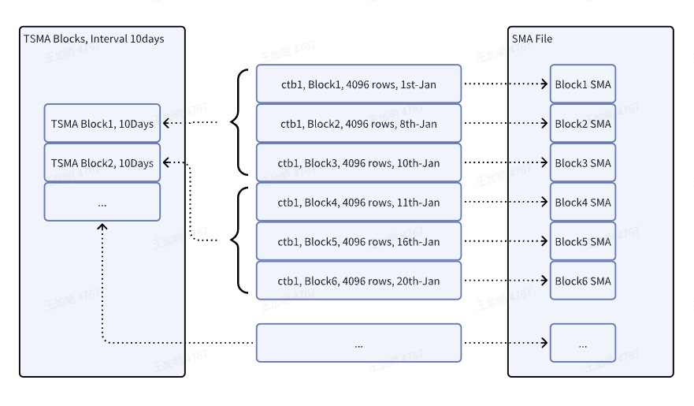

在大数据量场景下，经常需要查询某段时间内的汇总结果。历史数据变多或时间范围变大时，查询耗时也会增加。预聚集可将计算结果提前存储，后续查询直接读取聚集结果，而不必扫描全部原始数据。例如，当前数据块内的 SMA（Small Materialized Aggregates）信息即属此类。

块内 SMA 粒度较小；若查询时间范围为日、月甚至年，涉及的数据块会很多。TSMA（Time-Range Small Materialized Aggregates）支持按用户指定的时间窗口做预聚集：对固定时间窗口内的数据预计算并落盘，查询时优先使用预计算结果以提升性能。



## 创建 TSMA

```sql
-- 创建基于超级表或普通表的 TSMA
CREATE TSMA tsma_name ON [dbname.]table_name FUNCTION (func_name(func_param) [, ...] ) INTERVAL(time_duration);

-- 创建基于小窗口 TSMA 的大窗口 TSMA
CREATE RECURSIVE TSMA tsma_name ON [db_name.]tsma_name1 INTERVAL(time_duration);

time_duration:
    number unit
```

创建 TSMA 时需指定 TSMA 名称、表名、函数列表以及窗口大小。基于已有 TSMA 再创建时，须使用 `RECURSIVE` 关键字，且不能指定 `FUNCTION()`；新 TSMA 与所基于的 TSMA 拥有相同的函数列表。此时 `INTERVAL` 必须至少为所基于 TSMA 窗口长度的整数倍；按天创建时不能基于 `2h` 或 `3h`，只能基于 `1h`；按月创建时只能基于 `1d`，而不能基于 `2d`、`3d`。

TSMA 命名规则与表名类似。名称最大长度受表名长度上限减去输出表后缀长度约束：表名长度上限为 `193`，输出表后缀为 `_tsma_res_stb_`，因此 TSMA 名称最大长度为 `178`。

TSMA 只能基于超级表和普通表创建，不能基于子表创建。

函数列表中只能指定下文支持的聚集函数，且函数参数必须为 1 个（即使该函数本身支持多参数）；参数必须为普通列名，不能为标签列。函数列表中完全相同的函数与列会被去重，例如同时创建两个 `AVG(c1)` 时只会保留一个输出。

TSMA 计算会将所有函数中间结果输出到另一张超级表，该表还包含原始表的全部标签列。函数个数上限为：建表最大列数（含标签列）减去 TSMA 附加的四列（`_wstart`、`_wend`、`_wduration`，以及新增标签列 `tbname`），再减去原始表标签列数。超出限制时报 `Too many columns`。

由于输出为一张超级表，行长度受最大行长度限制。不同函数的中间结果大小不一，通常大于原始数据；若输出行长度超限，报 `Row length exceeds max length`。此时需减少函数个数，或将常用函数拆分到多个 TSMA。

窗口大小范围为 `[1m, 1y/12n]`。`INTERVAL` 的单位与查询中 `INTERVAL` 子句相同，参见 [时间单位](../01-datatype.md#时间单位)。

TSMA 为库内对象，但名称全局唯一。集群内可创建的 TSMA 个数受服务端参数 [`maxTsmaNum`](../../12-operations-and-tooling/03-components/01-taosd.md#maxtsmanum) 限制，默认值为 `10`，取值范围为 `[0, 10]`。TSMA 后台计算使用流式计算，每创建一条 TSMA 会对应创建一条流，因此实际可创建数量还受已有流数量与最大可创建流数量限制。

## 支持的函数

| 函数 | 备注 |
| -------- | --- |
| `MIN`    | |
| `MAX`    | |
| `SUM`    | |
| `FIRST`  | |
| `LAST`   | |
| `AVG`    | |
| `COUNT`  | 若需 `COUNT(*)`，应创建 `COUNT(ts)` |
| `SPREAD` | |
| `STDDEV` | |

## 删除 TSMA

```sql
DROP TSMA [db_name.]tsma_name;
```

若存在基于当前 TSMA 创建的 Recursive TSMA，删除会报 `Invalid drop base tsma, drop recursive tsma first`。须先删除所有 Recursive TSMA。

## TSMA 的计算

TSMA 的计算结果存放在与原始表同一数据库下的一张超级表中。该表对用户不可见、不可删除，在 `DROP TSMA` 时自动删除。计算由流式计算在后台异步完成；结果不保证实时性，但保证最终正确性。

若原始子表内没有数据，可能不会创建对应的输出子表，因此在 `COUNT` 查询中，即使配置了 `countAlwaysReturnValue`，也不会返回该表结果。

存在大量历史数据时，创建 TSMA 后流式计算会先计算历史数据，此期间新创建的 TSMA 不会被查询使用。数据更新、删除或过期数据到来时，会自动重算受影响部分；重算期间查询结果不保证实时性。若希望查询实时数据，可在 SQL 中添加 Hint `/*+ skip_tsma() */`，或将客户端参数 [`querySmaOptimize`](../../12-operations-and-tooling/03-components/02-taosc.md#querysmaoptimize) 设为 `0`，从原始数据查询。

## TSMA 的使用与限制

相关客户端配置参数：

- [`querySmaOptimize`](../../12-operations-and-tooling/03-components/02-taosc.md#querysmaoptimize)：是否在查询时使用 TSMA。`1` 表示使用预计算结果，`0` 表示不使用、从原始数据查询（默认值为 `0`）。
- [`maxTsmaCalcDelay`](../../12-operations-and-tooling/03-components/02-taosc.md#maxtsmacalcdelay)：单位为秒，控制可接受的 TSMA 计算延迟。若 TSMA 计算进度与最新时间的差距在该范围内则使用该 TSMA，超出则不使用。默认值 `600`（10 分钟），最小值 `600`，最大值 `86400`（1 天）。
- [`tsmaDataDeleteMark`](../../12-operations-and-tooling/03-components/02-taosc.md#tsmadatadeletemark)：单位为毫秒，与流式计算参数 `deleteMark` 一致，控制流式计算中间结果的保存时间。默认值 `1d`（`86400000` ms），最小值 `1h`。距最后一条数据的时间超过该配置的历史窗口不保存中间结果；若修改这些窗口内的数据，TSMA 结果可能不包含更新，从而与查询原始数据不一致。

### 查询时使用 TSMA

已在 TSMA 中定义的聚合函数，在多数查询场景下可直接使用。若存在多个可用 TSMA，优先使用大窗口 TSMA；未闭合窗口通过查询小窗口 TSMA 或原始数据计算。部分场景无法使用 TSMA（见下文），此时整条查询回退到原始数据计算。

未指定窗口大小的查询，默认优先使用“覆盖全部查询聚合函数、且窗口最大”的 TSMA。例如 `SELECT COUNT(*) FROM stable GROUP BY tbname` 会使用包含 `COUNT(ts)` 且窗口最大的 TSMA。若聚合查询频率高，应尽可能创建大窗口 TSMA。

指定窗口大小（即带 `INTERVAL`）时，使用最大的可整除窗口 TSMA。窗口查询中，`INTERVAL` 的窗口大小、`OFFSET` 以及 `SLIDING` 都会影响可用的 TSMA 窗口。可整除窗口 TSMA 是指其窗口大小能被查询语句的 `INTERVAL`、`OFFSET`、`SLIDING` 整除的 TSMA。若窗口查询较多，创建 TSMA 时需考虑常用窗口大小以及 `OFFSET`、`SLIDING`。

例如：已创建窗口为 `5m` 与 `10m` 的两条 TSMA，查询 `INTERVAL(30m)` 时优先使用 `10m`；查询 `INTERVAL(30m, 10m) SLIDING(5m)` 时仅可使用 `5m`。

### 查询限制

在 `querySmaOptimize` 为 `1` 且未使用 `skip_tsma()` Hint 时，以下场景无法使用 TSMA：

- 某个 TSMA 中定义的聚合函数不能覆盖当前查询的函数列表。
- 非 `INTERVAL` 的其他窗口，或 `INTERVAL` 查询窗口大小（含 `INTERVAL`、`SLIDING`、`OFFSET`）不是已定义窗口的整数倍。例如定义窗口为 `2m`，查询使用 `5m` 窗口时不可用；但若还存在 `1m` 窗口，则可以使用。
- 查询 `WHERE` 条件中包含任意普通列（非主键时间列）的过滤。
- `PARTITION BY` 或 `GROUP BY` 包含任意普通列或其表达式。
- 可以使用其他更快的优化路径时（例如 last cache 优化）。若符合 last 优化条件，优先走 last 优化；无法走 last 时，再判断是否可走 TSMA 优化。
- 当前 TSMA 计算进度延迟大于配置参数 `maxTsmaCalcDelay`。

示例如下：

```sql
SELECT agg_func_list [, pseudo_col_list] FROM stable WHERE exprs [GROUP/PARTITION BY [tbname] [, tag_list]] [HAVING ...] [INTERVAL(time_duration, offset) SLIDING(duration)]...;

-- 创建
CREATE TSMA tsma1 ON stable FUNCTION(COUNT(ts), SUM(c1), SUM(c3), MIN(c1), MIN(c3), AVG(c1)) INTERVAL(1m);

-- 查询
SELECT COUNT(*), SUM(c1) + SUM(c3) FROM stable; ---- use tsma1
SELECT COUNT(*), AVG(c1) FROM stable GROUP/PARTITION BY tbname, tag1, tag2;  --- use tsma1
SELECT COUNT(*), MIN(c1) FROM stable INTERVAL(1h);  --- use tsma1
SELECT COUNT(*), MIN(c1), SPREAD(c1) FROM stable INTERVAL(1h); ----- can't use, spread func not defined, although SPREAD can be calculated by MIN and MAX which are defined.
SELECT COUNT(*), MIN(c1) FROM stable INTERVAL(30s); ----- can't use tsma1, time_duration not fit. Normally, query_time_duration should be multiple of create_duration.
SELECT COUNT(*), MIN(c1) FROM stable WHERE c2 > 0; ---- can't use tsma1, can't do c2 filtering
SELECT COUNT(*) FROM stable GROUP BY c2; ---- can't use any tsma
SELECT MIN(c3), MIN(c2) FROM stable INTERVAL(1m); ---- can't use tsma1, c2 is not defined in tsma1.

-- 基于 tsma1 再创建窗口为 1h 的 tsma2
CREATE RECURSIVE TSMA tsma2 ON tsma1 INTERVAL(1h);
SELECT COUNT(*), SUM(c1) FROM stable; ---- use tsma2
SELECT COUNT(*), AVG(c1) FROM stable GROUP/PARTITION BY tbname, tag1, tag2;  --- use tsma2
SELECT COUNT(*), MIN(c1) FROM stable INTERVAL(2h);  --- use tsma2
SELECT COUNT(*), MIN(c1) FROM stable WHERE ts < '2023-01-01 10:10:10' INTERVAL(30m); -- use tsma1
SELECT COUNT(*), MIN(c1) + MIN(c3) FROM stable INTERVAL(30m);  --- use tsma1
SELECT COUNT(*), MIN(c1) FROM stable INTERVAL(1h) SLIDING(30m);  --- use tsma1
SELECT COUNT(*), MIN(c1), SPREAD(c1) FROM stable INTERVAL(1h); ----- can't use tsma1 or tsma2, spread func not defined
SELECT COUNT(*), MIN(c1) FROM stable INTERVAL(30s); ----- can't use tsma1 or tsma2, time_duration not fit. Normally, query_time_duration should be multiple of create_duration.
SELECT COUNT(*), MIN(c1) FROM stable WHERE c2 > 0; ---- can't use tsma1 or tsma2, can't do c2 filtering
```

### 使用限制

创建 TSMA 之后，对原始超级表有以下限制：

- 必须删除该表上的所有 TSMA 后，才能删除该表。
- 原始表的全部标签列不能删除，也不能修改标签列名或子表的标签值；须先删除 TSMA，再删除标签列。
- 若某些列被 TSMA 使用，则这些列不能删除，须先删除 TSMA。新增列不受影响，但新增列不在任何已有 TSMA 中；若要对新增列做预聚集，需另行创建 TSMA。

## 查看 TSMA

```sql
SHOW [db_name.]TSMAS;
SELECT * FROM information_schema.ins_tsma;
```

若创建时指定的函数较多且列名较长，显示函数列表时可能会被截断（当前最大输出约 256KB）。
