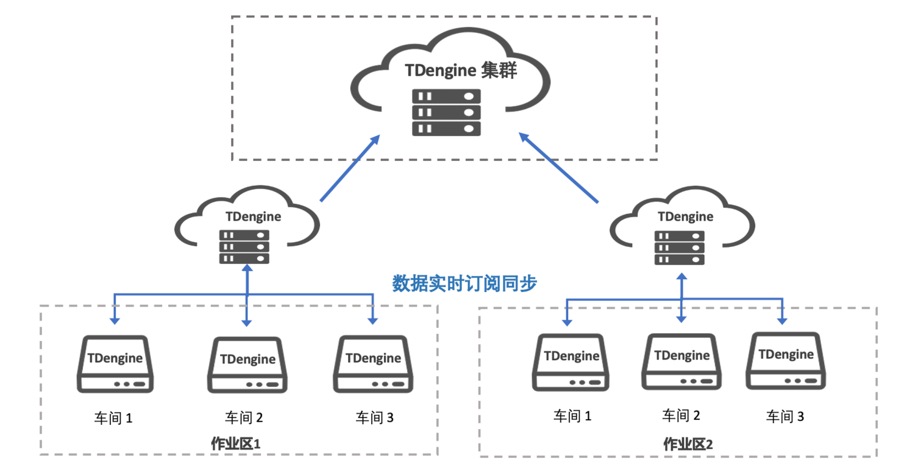

## 为什么需要边云协同

在工业互联网场景中，边缘设备只用来于处理局部数据，决策者无法只根据边缘设备采集的信息，形成对整个系统的全局认知。在实际应用中，边缘设备需要将数据上报给云计算平台（公有云或私有云），在云计算平台实现数据的汇聚与信息的融合，让决策者对整个数据有个全局的洞察。这种边云协同的架构，逐渐成为支撑工业互联网发展的重要支柱。

边缘设备主要是对生产线上的某一项或某几项数据，例如某个车间里的实时生产数据，进行监控和告警，然后将这些边缘侧的生产数据同步到位于云上大数据平台。
在边缘侧，对实时性的要求比较高，但其数据量可能并不大，一般一个生产车间的监测点数量，小到几千个，大到几万个。而在中心侧，往往计算资源比较充足，有能力将边缘侧的数据汇聚起来，进行分析计算。

要实现这一操作，对数据库或数据存储层的要求，就是要确保数据能够逐级上报，以及有选择地上报。在有些场景中，整体数据量非常大，因此必须要有选择地上报。例如，边缘侧一秒钟采集一次的原始记录，上报至中心侧时，降采样至一分钟一次，这种降采样极大地减少了数据量，但仍保留有关键信息，可用于长期数据的分析和预测。

在以前的工业数据采集流程中，数据是从工业逻辑控制器 PLC 中采集，然后进入 Historian，即工业实时库，再支撑业务应用。这种系统多采用主备架构，不易水平扩展，且严重依赖 Windows 生态，相对比较封闭。

## TDengine 的边云协同解决方案

TDengine Enterprise 致力于提供强大的边云协同能力，具备以下显著特性：
- 高效数据同步：支持每秒百万条数据的同步效率，确保数据在边缘侧和云端之间
快速、稳定地传输。
- 多数据源对接：兼容多种外部数据源，如 AVEVA PI System、OPC-UA、OPC-DA、MQTT 等，实现数据的广泛接入和整合。
- 灵活配置同步规则：提供可配置的同步规则，使用户能够根据实际需求自定义数据同步的策略和方式。
- 断线续传与重新订阅：支持断线续传和重新订阅功能，确保在网络不稳定或中断时数据同步的连续性和完整性。
- 历史数据迁移：支持历史数据的迁移，方便用户在升级或更换系统时，将历史数据无缝迁移到新系统中。

TDengine 的数据订阅功能为订阅方提供了极大的灵活性，允许用户根据需要配置订阅对象。用户可以订阅一个数据库、一张超级表，甚至是一个包含筛选条件的查询语句。这使得用户能够实现选择性的数据同步，将真正关心的数据（包括离线数据和乱序数据）从一个集群同步到另一个集群，以满足各种复杂场景下的数据需求。

下图以一个具体的生产车间的实例介绍了在 TDengine Enterprise 中实现边云协同架构。在生产车间，设备产生的实时数据存储至部署在边缘侧的 TDengine。部署在分厂的 TDengine 会去订阅生产车间的 TDengine 中的数据。为了更好地满足业务需求，需要由数据分析师设置一些订阅规则，例如将数据进行降采样，或者只同步超过指定阈值的数据。同理，部署在集团侧的 TDengine 再订阅来自各座分厂的数据，实现集团维度的数据汇聚后，即可进行下一步的分析和处理。

该实现思路主要有以下几点优势。

- 不需要一行代码，只须在边缘侧和云端进行简单配置即可。
- 数据跨区同步自动化程度大大提高，错误率降低。
- 数据无须缓存，减少批量发送，避免流量高峰阻塞带宽。
- 通过订阅方式同步数据，规则可配置，简单、灵活、实时性高。
- 边云均采用 TDengine，数据模型完全统一，降低数据治理难度。

制造业企业通常面临的一个痛点问题就是数据同步。很多企业目前采用离线方式来同步数据，但 TDengine Enterprise 实现了数据的实时同步，而且规则可配置。这种方式能够避免定期传输大数据量导致的资源浪费和带宽阻塞风险。

## 边云协同的优势

传统产业的 IT 和 OT（Operational Technology，运营技术）建设状况各异，相较于互联网行业，大多数企业在数字化方面的投入明显滞后。许多企业仍在使用过时的系统处理数据，而这些系统往往相互独立，形成了所谓的数据孤岛。

在这样的背景下，要让 AI 为传统产业注入新的活力，首要任务是整合分散在各个角落的系统及其采集的数据，打破数据孤岛的限制。然而，这一过程充满挑战，因为涉及多种系统和繁多的工业互联网协议，数据汇聚并非简单的合并工作。它要求对来自不同数据源的数据进行清洗、加工和处理，以便将其整合到一个统一的平台上。

当所有数据汇聚于一个系统时，访问和处理数据的效率将得到显著提高。企业在应对实时数据时能够更迅速地做出反应，更有效地解决问题。企业内外的工作人员也能实现高效合作，提高整体运营效率。

此外，数据汇聚之后，可以利用先进的第三方 AI 分析工具进行更优质的异常监测、实时告警，并为产能、成本、设备维护等方面提供更精准的预测。这将使决策者能够更好地把握整体宏观情况，为企业的发展提供有力支持，助力传统产业实现数字化转型和智能化升级。