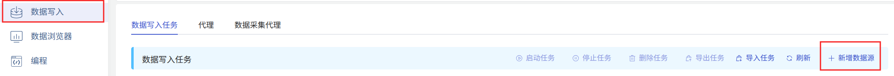

本节讲述如何通过 Explorer 界面创建数据迁移任务, 从旧版 TDengine2 迁移数据到当前集群。

## 功能概述

taosX 通过 SQL 查询源集群数据，并把查询结果写入到目标数据库。具体实现上， taosX 以一个子表的一个时间段的数据作为查询的基本单元，将要迁移的数据分批写入目标数据库。

taosX 支持三种迁移模式：
1. **history** 模式。指迁移指定时间范围内的数据，若不指定时间范围，则迁移截至创建任务前的所有数据。迁移完则任务停止。
2. **realtime** 模式。同步从任务创建时间起之后的数据，若不手动停止任务则任务会持续运行。
3. **both** 模式。先执行 history 模式，在执行 realtime 模式。

每种迁移模式下，都可以指定是否迁移表结构。如果选择了 “always”, 则会先同步表的结构到目标数据库再迁移数据。如果子表数量比较多这个过程可能会比较长。如果确定目标数据库已经有了和源数据库相同的表接口，建议选择 “none” 以节省时间。

任务在运行过程中会保存进度信息到硬盘上，因此如果暂停任务后重新启动，或任务自动从异常中自动恢复，任务并不会从头开始进行。

更多选项建议详细阅读创建任务页面每个表单字段的说明。

## 具体步骤

首先，点击左侧“数据写入”菜单，然后点击右侧新“增数据源”按钮。

然后输入任务名称，比如 “migrate-test”, 最后选择类型“TDengine2”。此时，表单切换为从 TDengine2 迁移数据专用的表单，包含了大量选项，每种选项都有详细的说明，如下图所示。

点击“提交”按钮提交任务后，回到“数据源”任务列表页面，可以监控任务的运行情况。