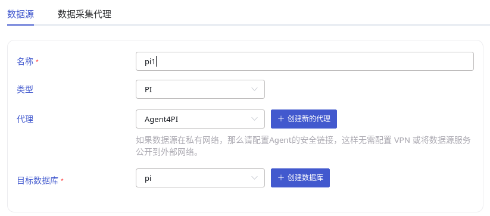
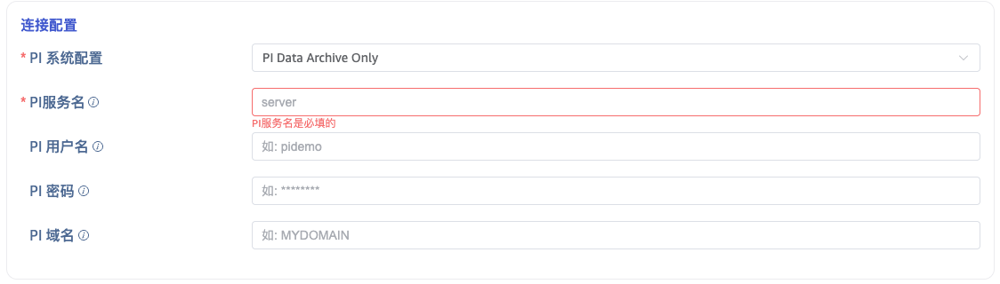
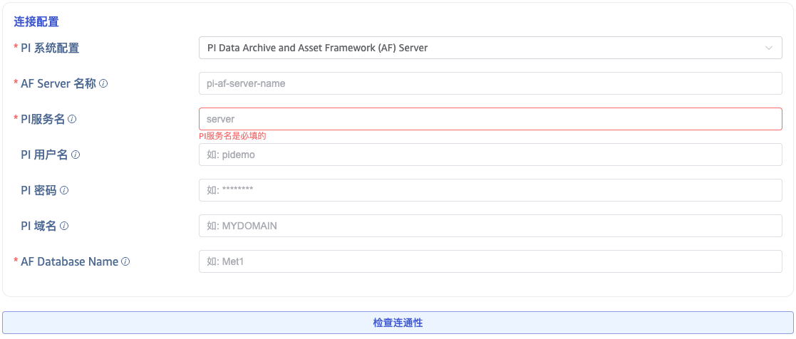

本节讲述如何通过 Explorer 界面创建数据迁移任务, 从 PI 系统迁移数据到当前 TDengine 集群。

## 功能概述

PI 系统是一套用于数据收集、查找、分析、传递和可视化的软件产品，可以作为管理实时数据和事件的企业级系统的基础架构。taosX 可以 PI 连接器插件从 PI 系统中提取实时数据或历史数据。

从数据的实时性角度来看 PI 数据源任务分为两类：**实时任务**和**回填任务**。在任务类型下拉列表两类任务分别对应名称： **PI** 和 **PI backfill**。
   
从数据模型角度来看， PI 数据源任务分为**单列模型**任务和**多列模型**任务：
1. **单列模型**任务将一个 PI Point 映射为 TDengine 一张表
2. **多列模型**任务将一个 PI AF 元素映射为一张表

从连接的数据源类型来讲，PI 数据源任务又分为 **Archive Server** 数据源和 **AF Server** 数据源。对于 **Archive Server** 数据源，只能使用**单列模型**。对于 **AF Server** 数据源，既可以选择**单列模型**，又可以选择**多列模型**。

用户通过一个 CSV 文件配置从 PI 到 TDengine 的数据映射规则，这个 CSV 文件称为**模型配置文件**：
1. 对于使用 AF Server 单列模型的任务，taosX 会自动识别元素的哪些属性是引用 PI Point 的数据，并把一个 PI Point 属性对应到一张表。
2. 对于使用 AF Server 的多列模型任务，一个元素对应一张表。taosX 默认会把 PI Point 属性映射到 TDengine Metric 列，把其它属性映射到 TDengine TAG 列。

## 创建任务

### 新增数据源

在数据写入页面中，点击 **+新增数据源** 按钮，进入新增数据源页面。


### 基本配置

在 **名称** 中输入任务名称，如：“test”；

在 **类型** 下拉列表中选择 **PI** 或 **PI backfill**。

如果 taosX 服务运行在 PI 系统所在或可直连的服务器上（依赖 PI AF SDK），**代理** 是不必须的，否则，需要配置 **代理** ：在下拉框中选择指定的代理，也可以先点击右侧的 **+创建新的代理** 按钮创建一个新的代理 ，跟随提示进行代理的配置。即：taosX 或其代理需要部署在可直接连接 PI 系统的主机上。

在 **目标数据库** 下拉列表中选择一个目标数据库，也可以先点击右侧的 **+创建数据库** 按钮创建一个新的数据库。



### 连接配置

PI 连接器支持两种连接方式：

1. **PI Data Archive Only**: 不使用 AF 模式。此模式下直接填写 **PI 服务名**（服务器地址，通常使用主机名）。

   
2. **PI Data Archive and Asset Framework (AF) Server**: 使用 AF SDK。此模式下除配置服务名外，还需要配置PI 系统(AF Server) 名称 (hostname) 和 AF 数据库名。

   

点击 **连通性检查** 按钮，检查数据源是否可用。

### 数据模型配置

这一部分有两个 Tab，分别对应单列模型的配置和多列模型的配置。如果你是第一次配置，无论选择单列模型还是多列模型，请务必点击“下载默认配置”按钮。这个操作会触发生成默认的**模型配置文件**，同时也会把**模型配置文件**下载到本地，你可以查看或编辑。编辑后还可以再上传，来覆盖默认的配置。

如果你想同步所有点位或所有模板的元素，那么用默认的配置就好了。如果你想要过滤特定命名模式的点位或元素模板，那么需要先填写过滤条件再点击“下载默认配置”。

#### 多列模型配置文件

下面是一个多列模型配置文件的示例。这个配置文件包含两个超级表的配置：一个是 metertemplate 表，它的数据来自模板 MeterTemplate 的元素；另一个是 farm 表，它的数据来自 Farm 模板的元素。

```csv
SuperTable,metertemplate
SubTable,${element_name}_${element_id}
Template,MeterTemplate
Filter,
ts,KEY,TIMESTAMP,$ts
voltage,COLUMN,DOUBLE,$voltage
voltage_status,COLUMN,INT,$voltage_status
current,COLUMN,DOUBLE,$current
current_status,COLUMN,INT,$current_status
element_id,TAG,VARCHAR(100),$element_id
element_name,TAG,VARCHAR(100),$element_name
path,TAG,VARCHAR(100),$path
categories,TAG,VARCHAR(100),$categories

SuperTable,farm
SubTable,${element_name}_${element_id}
Template,Farm
Filter,
ts,KEY,TIMESTAMP,$ts
wind_speed,COLUMN,FLOAT,$wind_speed
wind_speed_status,COLUMN,INT,$wind_speed_status
power_production,COLUMN,FLOAT,$power_production
power_production_status,COLUMN,INT,$power_production_status
lost_power,COLUMN,FLOAT,$lost_power
lost_power_status,COLUMN,INT,$lost_power_status
farm_lifetime_production__weekly_,COLUMN,FLOAT,$farm_lifetime_production__weekly_
farm_lifetime_production__weekly__status,COLUMN,INT,$farm_lifetime_production__weekly__status
farm_lifetime_production__hourly_,COLUMN,FLOAT,$farm_lifetime_production__hourly_
farm_lifetime_production__hourly__status,COLUMN,INT,$farm_lifetime_production__hourly__status
element_id,TAG,VARCHAR(100),$element_id
element_name,TAG,VARCHAR(100),$element_name
path,TAG,VARCHAR(100),$path
categories,TAG,VARCHAR(100),$categories
```

多列模型配置文件由一个或多个超级表的定义组成。每个超级表的配置都包括：

1. 超级表和模板的对应关系
2. 属性和 TDengine Metric 列的对应关系
3. 属性和 TDengine TAG 列的对应关系
4. 源数据过滤条件
5. 对于每一列，无论是 Metrics 列还是 TAG 列，都可以配置一个映射规则，详见[零代码第三方数据接入](../)“数据提取、过滤和转换”部分
   
#### 单列模型配置文件

下面是一个单列模型配置文件的示例。

```csv
SuperTable,volt_float32
SubTable,${point_name}
Filter,
ts,KEY,TIMESTAMP,$ts
value,COLUMN,FLOAT,$value
status,COLUMN,INT,$status
path,TAG,VARCHAR(200),$path
point_name,TAG,VARCHAR(100),$point_name
ptclassname,TAG,VARCHAR(100),$ptclassname
sourcetag,TAG,VARCHAR(100),$sourcetag
tag,TAG,VARCHAR(100),$tag
descriptor,TAG,VARCHAR(100),$descriptor
exdesc,TAG,VARCHAR(100),$exdesc
engunits,TAG,VARCHAR(100),$engunits
pointsource,TAG,VARCHAR(100),$pointsource
step,TAG,VARCHAR(100),$step
future,TAG,VARCHAR(100),$future
element_paths,TAG,VARCHAR(512),`$element_paths.replace("\\", ".")`

SuperTable,milliampere_float32
SubTable,${point_name}
Filter,
ts,KEY,TIMESTAMP,$ts
value,COLUMN,FLOAT,$value
status,COLUMN,INT,$status
path,TAG,VARCHAR(200),$path
point_name,TAG,VARCHAR(100),$point_name
ptclassname,TAG,VARCHAR(100),$ptclassname
sourcetag,TAG,VARCHAR(100),$sourcetag
tag,TAG,VARCHAR(100),$tag
descriptor,TAG,VARCHAR(100),$descriptor
exdesc,TAG,VARCHAR(100),$exdesc
engunits,TAG,VARCHAR(100),$engunits
pointsource,TAG,VARCHAR(100),$pointsource
step,TAG,VARCHAR(100),$step
future,TAG,VARCHAR(100),$future
element_paths,TAG,VARCHAR(512),`$element_paths.replace("\\", ".")`

Meter_1000004_Voltage,POINT,volt_float32
Meter_1000004_Current,POINT,milliampere_float32
Meter_1000001_Voltage,POINT,volt_float32
Meter_1000001_Current,POINT,milliampere_float32
Meter_1000474_Voltage,POINT,volt_float32
Meter_1000474_Current,POINT,milliampere_float32
```

单列模型配置文件分为两个部分，第一部分通多列模型配置文件，由若干个超级表的定义组成。第二部分是点位列表，这一部分配置了点位和超级表的映射关系。默认生成的配置把 UOM 相同且数据类型相同的点映射到同一个超级表。

### Backfill 配置

1. 对于 PI 任务，可配置“重启补偿时间”，如果任务意外中断，重启时配置这个参数非常有用，它会让 taosX 自动回填一段时间的数据。
2. 对于 PI backfill 任务，必须配置 backfill 的开始和结束时间。

### 高级选项

对于不同的任务类型高级选项部分有所不同。通用的高级选项有：
1. 连接器日志级别
2. 连接器查询和发送数据的批次大小
3. 单次读取最大延迟

对于**多列模型的实时任务**，还有以下开关选项：

1. 是否同步新增的元素。如果打开，则 PI 连接器会监听模板下新增的元素，无需重启任务，即可自动同步新增元素的数据。
2. 是否同步静态属性的变化。如果打开，PI 连接器会同步所有静态属性（非 PI Point 属性）的变化。也就是说如果在 PI AF Server 一个元素的静态属性值做了修改，那么 TDengine 表相应 TAG 的值也会修改。
3. 是否同步删除元素的操作。如果打开，则 PI 连接器会监听配置的模板下删除元素的事件，并同步删除 TDengine 对应子表。
4. 是否同步删除历史数据。如果打开，则对于某个元素的时序数据，如果在 PI 中某个时间的数据被删除了，TDengine 对应时间对应列的数据会被置空。
5. 是否同步修改历史数据。如果打开，则对于某个元素的时序数据，如果在 PI 中历史数据被修改了，TDengine 对应时间的数据也会更新。

