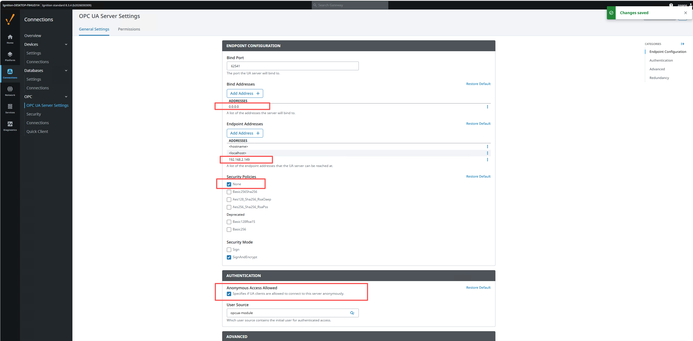
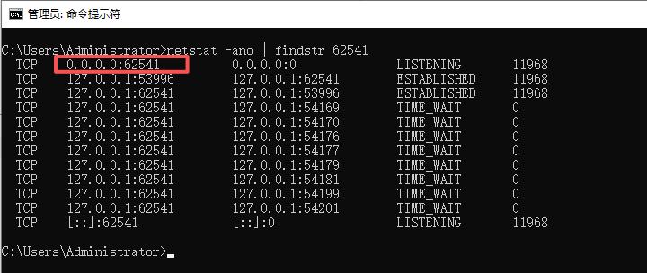
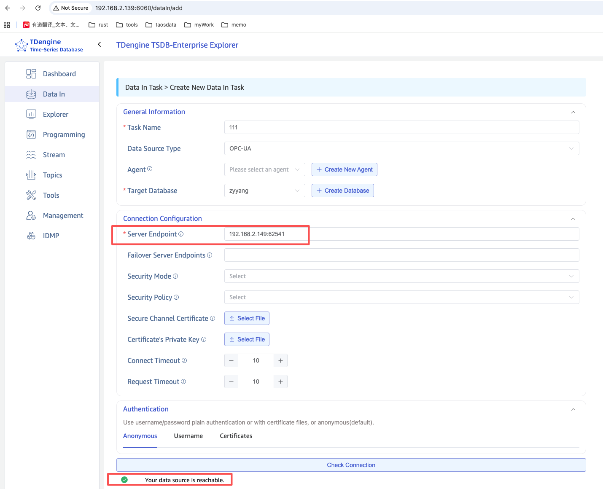
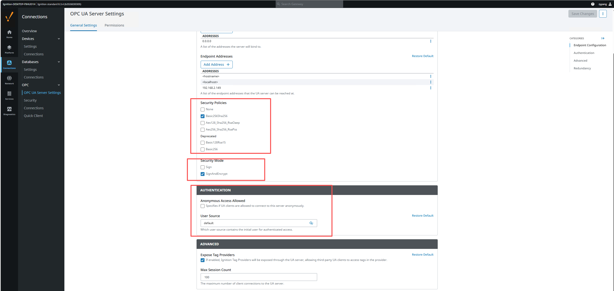
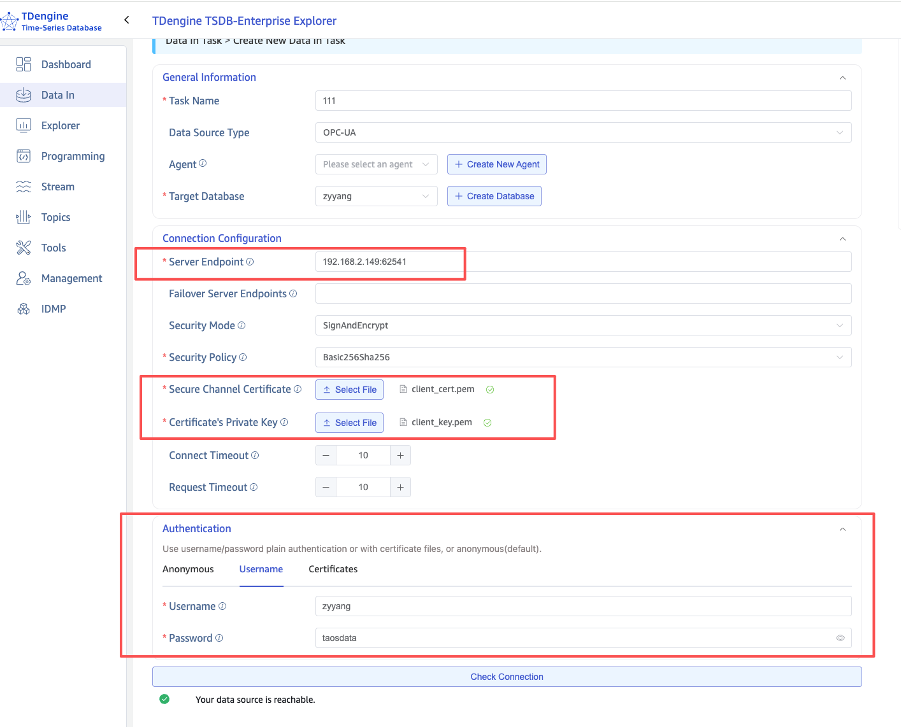

本页介绍如何让 TDengine TSDB 通过 OPC UA 协议接入 Ignition Gateway，覆盖两类典型场景：

- **场景 1：跨服务器匿名连接**（仅在内网做联调时使用）
- **场景 2：跨服务器证书加密 + 用户名认证**（推荐用于生产）

OPC UA 的安全体系分为两层，理解这一点有助于排查问题：

### 安全通道（Secure Channel）

负责 **传输层加密**，保护客户端与服务器之间的通信不被窃听或篡改。需要配置：

- **Secure Channel Certificate**：taosX 客户端自己的证书，发送给 OPC UA 服务器用于身份识别。
- **Certificate's Private Key**：上述证书对应的私钥，用于签名和解密。

### 用户认证（Authentication）

负责 **用户身份验证**，确认连接者的身份。支持三种方式：

- **Anonymous**：匿名访问（需服务器允许）。
- **Username**：用户名 + 密码。
- **Certificate**：证书认证（需服务器配置证书到用户的映射）。

:::tip
从 Ignition 下载的服务器证书（如 `ignition-server.der`）是 Ignition OPC UA 服务器自身的证书，**不能用作客户端证书**。请按 [生成 taosX OPC UA 客户端证书](./01-client-certificate.md) 自行生成客户端证书与私钥。
:::

## 1. Ignition 服务器侧配置

进入 Ignition Gateway → **Config** → **Connections** → **OPC** → **OPC UA Server Settings** → **General Settings**。

### 1.1 Endpoint 配置

| 配置项 | 推荐值 | 说明 |
| --- | --- | --- |
| Bind Port | `62541` | OPC UA 服务监听端口 |
| Bind Addresses | `0.0.0.0` | 如果 TDengine TSDB 与 Ignition 不在同一台服务器，必须改为 `0.0.0.0` |
| Endpoint Addresses | 添加服务器 IP | 例如 `192.168.2.149`，确保客户端可通过此地址访问 |
| Security Policies | ☑ `Basic256Sha256` | 勾选所需的安全策略 |
| Security Mode | ☑ `SignAndEncrypt` | 勾选签名并加密模式 |

### 1.2 认证配置

在同一页面的 **AUTHENTICATION** 部分：

- 如果使用 **Username 认证**：确保 User Source 设为 `default`（推荐），而非 `opcua-module`。

:::note
User Source 建议使用 `default`。默认的 `opcua-module` 是一个独立的用户源，需要额外配置用户和权限，容易导致 `StatusBadUserAccessDenied` 错误。
:::

### 1.3 权限配置

切换到 **Permissions** 标签页，确认 `AuthenticatedUser` 角色拥有所需权限：

| 角色 | Browse | Read | Write | Call |
| --- | --- | --- | --- | --- |
| AuthenticatedUser | ☑ | ☑ | ☑ | ☑ |

**Default Tag Provider Permissions** 也需要同样配置。

## 2. 场景 1：跨服务器匿名连接

完成 Ignition 安装并启动后，进入 **Connections > OPC > OPC server settings**。

Ignition 默认配置只绑定到 `localhost`，端点地址包含 `<hostname>` 和 `localhost`：

在这种状态下，如果 TDengine TSDB 与 Ignition 位于不同的服务器，会因为 Ignition 只在本地端口 `62541` 监听而连接失败。需要把 Bind Addresses 改为 `0.0.0.0`，并把 Ignition 服务器的 IP 添加到 Endpoint Addresses：

可以通过 `cmd` 命令 `netstat -ano | findstr 62541` 验证 Ignition 是否已监听在 `0.0.0.0:62541`：

完成上述配置后，在 TDengine TSDB Explorer 中以匿名模式即可与 Ignition OPC UA Server 建立连接：

:::warning
匿名模式不进行任何身份与传输层加密，**只建议在内网联调时短时间使用**，正式部署请使用场景 2。
:::

## 3. 场景 2：跨服务器证书加密 + 用户名认证

### 3.1 Ignition 端：开启 SignAndEncrypt

按照如下截图调整配置后保存：

- **Security Policy** 设为 `Basic256Sha256`
- **Security Mode** 设为 `SignAndEncrypt`
- **User Source** 设为 `default`

### 3.2 生成客户端证书

按 [生成 taosX OPC UA 客户端证书](./01-client-certificate.md) 中给出的脚本，在任意一台机器上生成 `client_cert.pem` 与 `client_key.pem`。

### 3.3 在 Ignition 中信任客户端证书

生成证书后，需要让 Ignition 信任该客户端证书：

1. 在 Explorer 中先用该证书进行一次连通性检查（**会失败，这是正常的**）。
2. 进入 Ignition Gateway → **Config** → **Connections** → **OPC** → **Security** → **Server** 标签页。
3. 在 **Quarantined Certificates** 中找到 `taosx-opc-client` 证书。
4. 点击右侧 **⋮** → **Trust**。
5. 确认证书已移至 **Trusted Certificates** 列表。

### 3.4 在 Explorer 中配置连接

进入 TDengine TSDB Explorer → **Data In** → **Create New Data In Task**，数据源类型选择 **OPC UA**。

#### 连接配置

| 配置项 | 值 | 说明 |
| --- | --- | --- |
| Server Endpoint | `192.168.2.149:62541` | Ignition 服务器 IP + 端口 |
| Security Mode | `SignAndEncrypt` | 与 Ignition 端配置一致 |
| Security Policy | `Basic256Sha256` | 与 Ignition 端配置一致 |
| Secure Channel Certificate | 上传 `client_cert.pem` | 客户端证书 |
| Certificate's Private Key | 上传 `client_key.pem` | 客户端私钥 |

#### 认证配置

选择 **Username** 标签页，填入 Ignition User Source 中已有的用户名与密码。

完成后再次点击 **Check Connection** 验证连通性：

## 4. 常见错误排查

| 错误信息 | 原因 | 解决方法 |
| --- | --- | --- |
| `StatusBadIdentityTokenInvalid (0x80200000)` | 用户身份令牌无效。通常是认证方式不匹配或证书未被服务器接受。 | 如果使用 Certificate 认证，改为 Username 认证；确认 Ignition User Source 配置正确。 |
| `StatusBadUserAccessDenied (0x801F0000)` | 用户名密码正确但无权限。通常是用户不在指定 User Source 中。 | 将 Ignition User Source 改为 `default`，确保用户存在于该用户源中。 |
| `StatusBadSecurityChecksFailed` | 安全通道建立失败。通常是证书未被 Trust 或 Security Policy 不匹配。 | 在 Ignition Security 页面 Trust 客户端证书；确认 Security Policy 两端一致。 |
| `StatusBadCertificateUriInvalid` | 证书 SAN 中的 URI 与客户端 Application URI 不匹配。 | 重新生成证书，确保 SAN 包含 `URI:urn:taosx-opc:client`。 |
| 连接超时 | 网络不通或 Ignition 未监听在正确的地址。 | 确认 Bind Address 为 `0.0.0.0`，Endpoint Addresses 包含服务器 IP，防火墙放通端口 `62541`。 |
