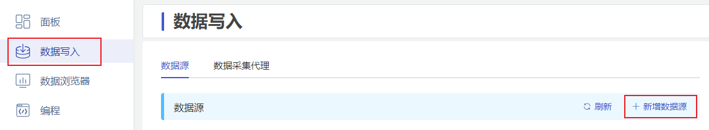
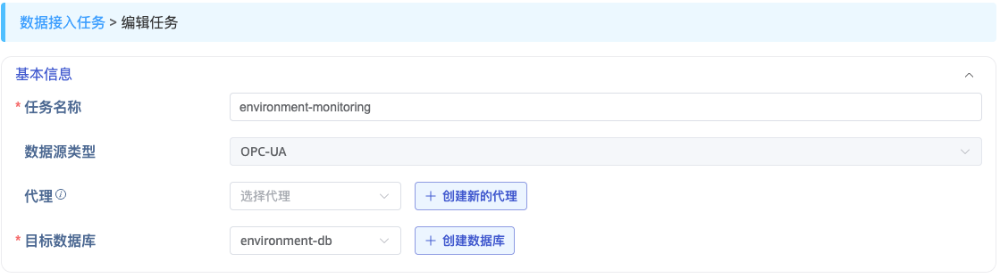
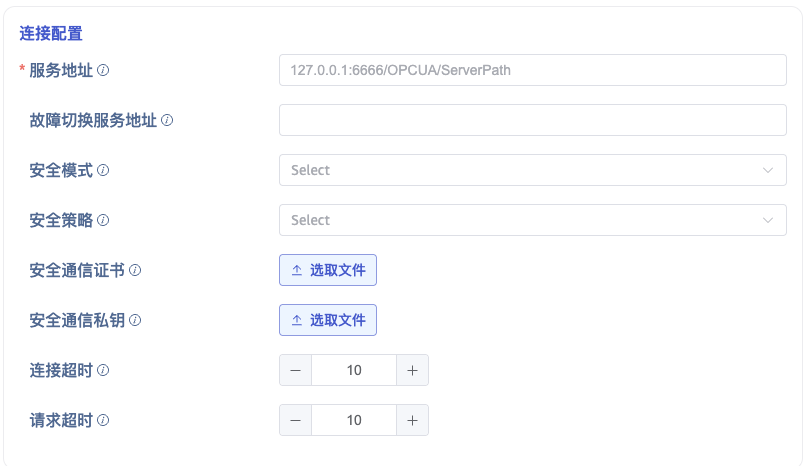
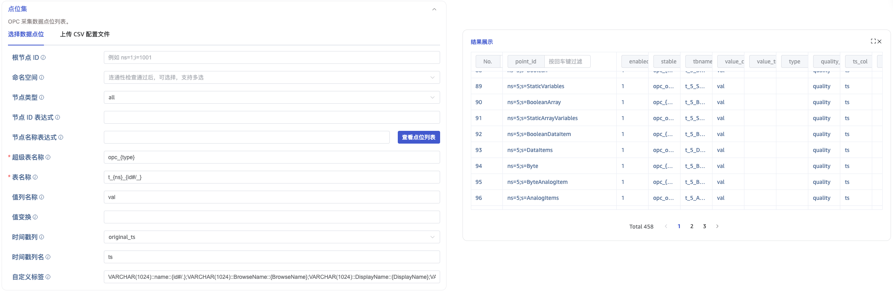
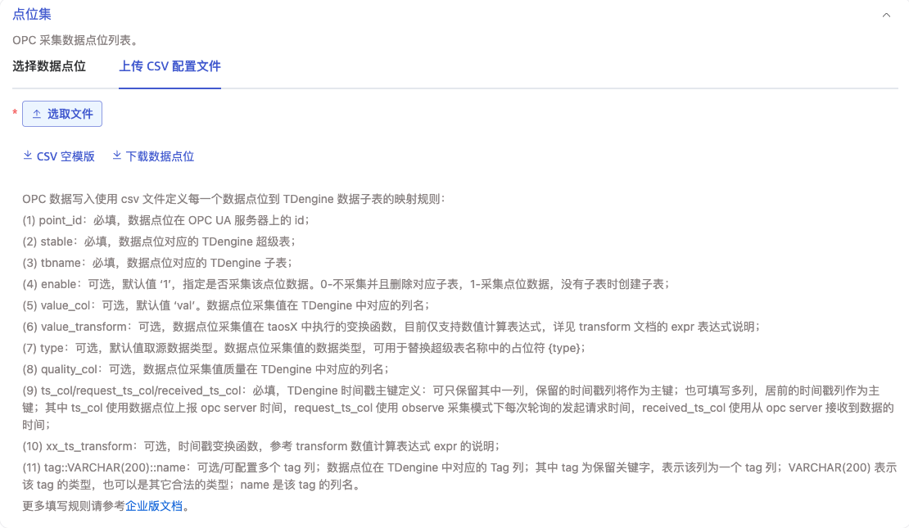
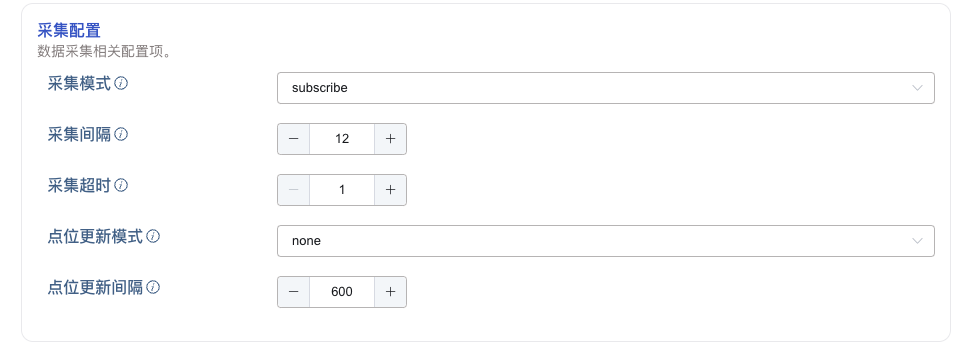
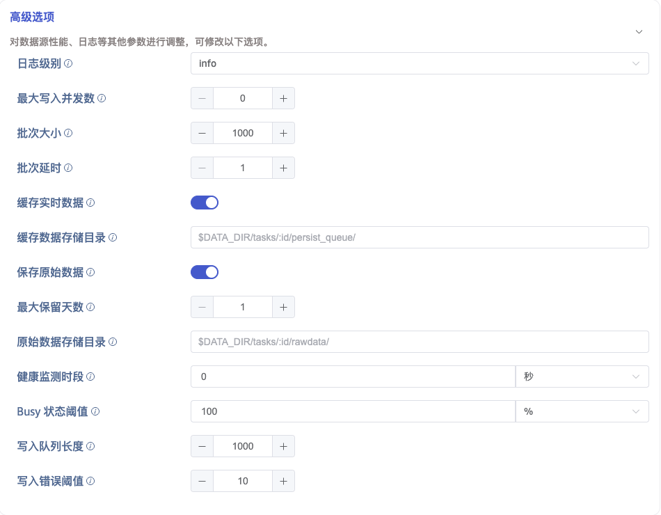
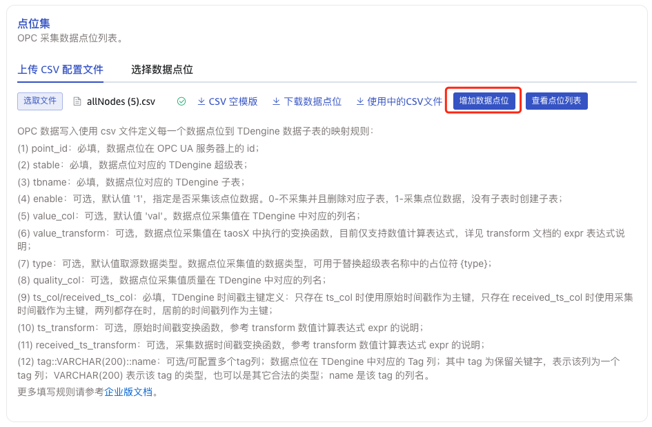
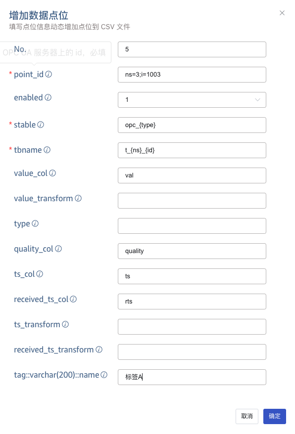

本节讲述如何通过 Explorer 界面创建数据迁移任务，从 OPC UA 服务器同步数据到当前 TDengine TSDB 集群。

## 功能概述

OPC 是工业自动化领域和其他行业中安全可靠地交换数据的互操作标准之一。

OPC UA 是经典 OPC 规范的下一代标准，是一个平台无关的面向服务的架构规范，集成了现有 OPC Classic 规范的所有功能，提供了一条迁移到更安全和可扩展解决方案的路径。

TDengine TSDB 可以高效地从 OPC UA 服务器读取数据并将其写入 TDengine TSDB，以实现实时数据入库。

## 数据接入

### 1. 新增数据源

在数据写入页面中，点击 **+新增数据源** 按钮，进入新增数据源页面。



### 2. 配置基本信息

在 **名称** 中输入任务名称，例如：针对环境温湿度监控的任务，取名为`environment-monitoring`。

在 **类型** 下拉列表中选择 **OPC UA**。

**代理** 是非必填项。当 taosX 与 OPC UA Server 之间网络不能直接连通时（例如 OPC UA Server 在隔离的工控网段、或 taosX 部署在公有云无法访问内网），可以在与 OPC UA Server 同一网段部署一个 taosx-agent，由 taosx-agent 代理转发数据 —— 此时只要 taosX ↔ taosx-agent、taosx-agent ↔ OPC UA Server 两段网络分别连通即可。如果 taosX 与 OPC UA Server 之间网络可直接连通，则无需配置代理。需要时，可以在下拉框中选择已有代理，或点击右侧的 **+创建新的代理** 按钮新建。

在 **目标数据库** 下拉列表中选择一个目标数据库，也可以先点击右侧的 **+创建数据库** 按钮。



### 3. 配置连接信息

在 **连接配置** 区域填写 **OPC UA 服务地址**，例如：`192.168.1.66:53530/OPCUA/SimulationServer`，并配置数据传输安全模式，有三种**安全模式**可选：

- **None**：通信数据以明文形式传输。
- **Sign**：使用数字签名对通信数据进行验证，保护数据完整性。
- **SignAndEncrypt**：使用数字签名对通信数据进行验证，并使用加密算法对数据进行加密，以保证数据的完整性、真实性和保密性。

如果安全模式选择了 `Sign` 或者 `SignAndEncrypt`，则必须选择有效的**安全策略**。安全策略定义了如何实现安全模式中的加密和验证机制，包括使用的加密算法、密钥长度、数字证书等。可选的安全策略有：

- None：只能在安全模式为 None 时可选。
- Basic128Rsa15：使用 RSA 算法和 128 位的密钥长度对通信数据进行签名或加密。
- Basic256：使用 AES 算法和 256 位的密钥长度对通信数据进行签名或加密。
- Basic256Sha256：使用 AES 算法和 256 位的密钥长度，并使用 SHA-256 算法对数字签名进行加密。
- Aes128Sha256RsaOaep：使用 AES-128 算法进行通信数据的加解密，并使用 SHA-256 算法对数字签名进行加密，并使用 RSA 算法和 OAEP 模式用于加解密对称通信密钥。
- Aes256Sha256RsaPss：使用 AES-256 算法进行通信数据的加解密，并使用 SHA-256 算法对数字签名进行加密，并使用 RSA 算法和 PSS 模式用于加解密对称通信密钥。



:::tip
当**安全模式**选择 `Sign` 或 `SignAndEncrypt` 时，**安全通信证书** 与 **安全通信私钥** 两个配置项都必须填写。证书与私钥的生成方法见 [生成 taosX OPC UA 客户端证书](./01-client-certificate.md)。
:::

不同厂商的 OPC UA Server 在端点格式、安全策略组合、客户端证书信任流程上存在差异。如果你使用下列任意一款 Server，**建议先阅读对应的专属指南** 获取经过验证的配置参考与服务端信任流程：

- [Ignition OPC UA Server 集成指南](./03-ignition.md)
- [GE Cimplicity OPC UA Server 集成指南](./04-ge-cimplicity.md)

其他厂商的 OPC UA Server，按本节通用步骤填写即可。

### 4. 选择认证方式

如下图所示，切换 tab 可选择不同的认证方式，可选的认证方式有：

1. 匿名
2. 用户名和密码
3. 证书访问：可以和安全通信证书相同，也可以用不同的证书。


配置好连接属性和认证方式后，点击 **连通性检查** 按钮，检查数据源是否可用。如果使用安全通信证书或认证证书，则证书必须在 OPC UA 服务端被信任，否则依然无法通过。

### 5. 配置点位集

**点位集** 可选择 **选择数据点位** 或 **上传 CSV 配置文件**，Explorer 默认显示前者。

#### 5.1. 选择数据点位



##### 筛选点位

通过配置 **根节点 ID**、**命名空间**、**节点类型**、**节点 ID 表达式**、**节点名称表达式** 等条件，对点位进行筛选。

点击 **查看点位列表** 可以在右侧预览符合筛选条件的 OPC UA 点位。

##### 超级表名

通过 **超级表名** 指定数据要写入的超级表。表达式中可使用占位符 `{type}`，替换为该点位值列的 TDengine TSDB 数据类型。

:::tip
表达式中的 `.` 会被自动替换为 `_`，以避免在超级表名中产生非法字符。例如 `opc.{type}` 实际生成的超级表名为 `opc_double`（点位为 `Float64` 时）。
:::

例如，`opc_{type}` 在点位类型为 `Float64` 时生成 `opc_double`，在点位类型为 `VARCHAR(64)` 时生成 `opc_varchar`。

##### 表名称

通过 **表名称** 指定数据要写入的子表。OPC UA 点位 ID 形如 `ns=<namespace>;<prefix>=<identifier>`（`prefix` 可为 `i`/`s`/`g`/`b`），表达式中可使用以下占位符：

| 占位符    | 说明                                                | 示例（point_id=`ns=2;s=Device/Type/Tag`） |
| --------- | --------------------------------------------------- | ----------------------------------------- |
| `{ns}`    | 命名空间，即 `ns=` 后的值                           | `2`                                       |
| `{id}`    | 标识符，去掉 `s=` / `i=` / `g=` / `b=` 前缀后的值   | `Device/Type/Tag`                         |
| `{id#/_}` | 将 `{id}` 中的所有 `/` 替换为 `_`，并修剪首尾的 `_` | `Device_Type_Tag`                         |
| `{id#-_}` | 将 `{id}` 中的所有 `-` 替换为 `_`，并修剪首尾的 `_` | （若 id 含 `-`）`A_B_C`                   |

:::tip

- 替换完成后，子表名中残留的 `.` 和反引号 `` ` `` 会被统一替换为 `_`，避免产生非法表名。
- 若点位 ID 不包含分号（无法拆出 `ns` / `id`），`{ns}` 替换为空字符串、`{id}` 替换为 `Objects`。
- 表达式可与静态文本任意拼接，如 `t_{ns}_{id#/_}`。

:::

##### 值列名称、值变换

- **值列名称**：写入 TDengine 时该点位值所对应的列名，默认 `val`。当一个超级表下有多个点位映射时，所有点位共享同一个 **值列名称**。
- **值变换**：对原始值进行二次计算，使用 [Rhai](https://rhai.rs/) 表达式语法，留空表示不做变换。表达式中通过 **值列名称** 引用原始值，例如默认列名为 `val` 时：

  | 表达式                          | 效果                  |
  | ------------------------------- | --------------------- |
  | `val * 1.8 + 32`                | 摄氏度转华氏度        |
  | `val / 1000`                    | 单位换算（毫秒 → 秒） |
  | `val + 0.5`                     | 偏移量校正            |
  | `if val < 0 { 0 } else { val }` | 负值截断为 0          |

  数值类型在传入表达式前会被统一转换为 `f64`，因此可以放心使用浮点运算。布尔、字符串、二进制等非数值类型当前不支持值变换。

##### 时间戳列

- **时间戳列**：可选 `origin_ts`、`request_ts`、`received_ts`。
  - `origin_ts`：使用 OPC 点位数据的原始时间戳作为 TDengine TSDB 中的时间戳列。
  - `request_ts`：使用数据的请求时间戳作为 TDengine TSDB 中的时间戳列。
  - `received_ts`：使用数据的接收时间戳作为 TDengine TSDB 中的时间戳列。

- **时间戳列名**：指定 TDengine TSDB 时间戳列的名称，默认 `ts`。

##### 自定义标签

**自定义标签** 可以为子表附加额外的标签列。每个标签由三部分组成，多个标签以 `;` 分隔：

```text
<DataType>::<TagName>::<Pattern>
```

- `<DataType>`：标签的 TDengine 数据类型，如 `VARCHAR(1024)`、`NCHAR(64)`、`INT`、`BIGINT`、`DOUBLE` 等。
- `<TagName>`：标签列名。
- `<Pattern>`：标签值，可为静态文本，或使用以下占位符在写入时动态生成。

###### OPC 节点属性占位符

| 占位符          | 说明                           |
| --------------- | ------------------------------ |
| `{BrowseName}`  | OPC 节点的 BrowseName 属性值   |
| `{DisplayName}` | OPC 节点的 DisplayName 属性值  |
| `{Description}` | OPC 节点的 Description 属性值  |
| `{Path}`        | OPC 节点在地址空间中的完整路径 |

仅支持以上四个属性；`NodeClass`、`ParentId` 等其他属性不可在表达式中引用。属性为空时替换为空字符串。

###### 属性值字符替换 `{Attr#XY}`

针对 `BrowseName` / `DisplayName` / `Description` / `Path`，可使用 `{Attr#XY}` 语法将属性值中所有的字符 `X` 替换为字符 `Y`，并修剪首尾的 `Y`：

| 占位符             | 属性值                  | 替换结果              |
| ------------------ | ----------------------- | --------------------- |
| `{DisplayName#_.}` | `zs_p1_unit1_float`     | `zs.p1.unit1.float`   |
| `{BrowseName#-.}`  | `zs-p1-unit1`           | `zs.p1.unit1`         |
| `{Path#/_}`        | `/Objects/Plant/Area1/` | `Objects_Plant_Area1` |
| `{DisplayName#./}` | `.Device.Type.Tag.`     | `Device/Type/Tag`     |

:::note
`{Attr#XY}` 的优先级高于普通 `{Attr}`，引擎会先处理 `{Attr#XY}`，再处理 `{Attr}`。
:::

###### 点位 ID 占位符

除节点属性外，自定义标签的 `<Pattern>` 还支持基于点位 ID 的占位符（OPC UA 场景），下表示例均以 `ns=6;s=Device/Type/TagName` 为例：

| 占位符     | 说明                                          | 示例                     |
| ---------- | --------------------------------------------- | ------------------------ |
| `{ns}`     | 命名空间                                      | `6`                      |
| `{id}`     | 标识符（去掉 `s=` / `i=` / `g=` / `b=` 前缀） | `Device/Type/TagName`    |
| `{id.}`    | id 去掉最后一个 `.` 及其后缀                  | （若 id=`A.B.C`）`A.B`   |
| `{id/}`    | id 去掉最后一个 `/` 及其后缀                  | `Device/Type`            |
| `{id_}`    | id 去掉最后一个 `_` 及其后缀                  | （类似逻辑）             |
| `{id..}`   | id 去掉最后两个 `.` 段                        | （若 id=`A.B.C.D`）`A.B` |
| `{..id.}`  | id 按 `.` 分割后的倒数第二段                  | （若 id=`A.B.C`）`B`     |
| `{id#/.}`  | `/` → `.`，并修剪首尾 `.`                     | `Device.Type.TagName`    |
| `{id#-.}`  | `-` → `.`，并修剪首尾 `.`                     | （若 id 含 `-`）`A.B.C`  |
| `{id#/_}`  | `/` → `_`，并修剪首尾 `_`                     | `Device_Type_TagName`    |
| `{id#-_}`  | `-` → `_`，并修剪首尾 `_`                     | （若 id 含 `-`）`A_B_C`  |
| `{id/#/.}` | 先执行 `{id/}`，再将 `/` → `.`                | `Device.Type`            |
| `{id_#_.}` | 先执行 `{id_}`，再将 `_` → `.`                | （若 id=`A_B_C`）`A.B`   |

###### 示例

```text
VARCHAR(1024)::name::{id#/.};VARCHAR(1024)::browse::{BrowseName};VARCHAR(200)::location::{Path#/_};INT::version::1
```

上述配置定义了四个标签：

- `name`：点位 ID 经 `/` → `.` 转换，例如 `Device.Type.TagName`。
- `browse`：节点的 BrowseName。
- `location`：节点 Path 经 `/` → `_` 转换。
- `version`：常量 `1`。

占位符可与静态文本自由组合，例如 `prefix_{id#/.}_suffix`、`{BrowseName}({Description})`、`ns{ns}_{id}` 等。

#### 5.2. 上传 CSV 配置文件

您可以下载 CSV 空模板并按模板配置点位信息，然后上传 CSV 配置文件来配置点位；或者根据所配置的筛选条件下载数据点位，并以 CSV 模板所制定的格式下载。



CSV 文件的核心规则：

- **文件编码**：必须为 UTF-8（with BOM 或 without BOM 均可）。
- **Header**：第一行；包含 `point_id`、`stable`、`tbname` 等列；`point_id` 在整个任务中唯一；至少配置 `ts_col` / `request_ts_col` / `received_ts_col` 中的一列作为时间戳。
- **Row**：每行配置一个 OPC 数据点；当 `point_id` 包含逗号时（字符串型节点 ID），必须用双引号包裹整列。

完整的列定义、推荐写法、`point_id` 中含逗号等保留字符的处理方法，参见 [OPC UA CSV 映射文件参考](./02-csv-reference.md)。

### 6. 采集配置

在采集配置中，配置当前任务的采集模式、采集间隔、采集超时等选项。



如上图所示，其中：

- **采集模式**：可以使用 `subscribe` 或 `observe` 模式。
  - `subscribe`：订阅模式，数据有变化时主动上报并写入 TDengine TSDB。
  - `observe`：根据 **采集间隔** 轮询数据点的最新值并写入 TDengine TSDB。
- **采集间隔**：当 **采集模式** 为 `observe` 时，默认为 10 秒。
- **采集超时**：向 OPC 服务器读取点位数据时如果超过设定时间未返回数据，则读取失败，默认为 10 秒。仅在 **采集模式** 为 `observe` 时可配置。

当 **点位集** 中使用 **选择数据点位** 方式时，采集配置中可以配置 **点位更新模式** 和 **点位更新间隔** 来启用动态点位更新。**动态点位更新** 是指，在任务运行期间，OPC Server 增加或删除了点位后，符合条件的点位会自动添加到当前任务中，不需要重启 OPC 任务。

- 点位更新模式：可选择 `None`、`Append`、`Update` 三种。
  - None：不开启动态点位更新；
  - Append：开启动态点位更新，但只追加；
  - Update：开启动态点位更新，追加或删除；
- 点位更新间隔：在 **点位更新模式** 为 `Append` 和 `Update` 时生效。单位：秒，默认值是 600，最小值：60，最大值：2147483647。

### 7. 高级选项



如上图所示，配置高级选项对性能、日志等进行更加详尽的优化。

**日志级别** 默认为 `info`，可选项有 `error`、`warn`、`info`、`debug`、`trace`。

在 **最大写入并发数** 中设置写入 taosX 的最大并发数限制。默认值：0，表示 auto，自动配置并发数。

在 **批次大小** 中设置每次写入的批次大小，即：单次发送的最大消息数量。

在 **批次延时** 中设置单次发送最大延时（单位为秒），当超时结束时，只要有数据，即使不满足 **批次大小**，也立即发送。

当 **缓存实时数据** 选项开启时，OPC 消费的数据会先存入本地文件中，本地文件的数据会被后台任务持续读出并发送给下游处理。当 OPC 数据流量巨大，下游无法及时处理造成数据消费卡顿导致数据丢弃时使用，即用于流量削峰，当数据消费完毕后，会自动清理文件。此功能默认关闭。

在 **缓存数据存储目录** 中可填写数据缓存的存储目录路径，默认为 taosX 启动时配置的数据目录，也可以填写自定义目录。此选项仅在 **缓存实时数据** 选项开启时有效。

在 **保存原始数据** 中选择是否保存原始数据。默认值：否。

当保存原始数据时，以下 2 个参数配置生效。

在 **最大保留天数** 中设置原始数据的最大保留天数。

在 **原始数据存储目录** 中设置原始数据保存路径。若使用 Agent，则存储路径指的是 Agent 所在服务器上路径，否则是 taosX 服务器上路径。路径中可使用占位符 `$DATA_DIR` 和 `:id` 作为路径中的一部分。

- Linux 平台，`$DATA_DIR` 为 `/var/lib/taos/taosx`，默认情况下存储路径为 `/var/lib/taos/taosx/tasks/<task_id>/rawdata`。
- Windows 平台，`$DATA_DIR` 为 `C:\TDengine\data\taosx`，默认情况下存储路径为 `C:\TDengine\data\taosx\tasks\<task_id>\rawdata`。

### 8. 提交任务

点击 **提交** 按钮，完成创建 OPC UA 到 TDengine TSDB 的数据同步任务，回到 **数据源列表** 页面可查看任务执行情况。

## 增加数据点位

在任务运行中，点击 **编辑**，点击 **增加数据点位** 按钮，可以手动在 CSV 配置文件中，追加一个 OPC UA 数据点位的规则。增加数据点位不需要任务重启，不会产生数据丢失。



在弹出的表单中，填写数据点位的信息。



点击 **确定** 按钮，完成数据点位的追加。
