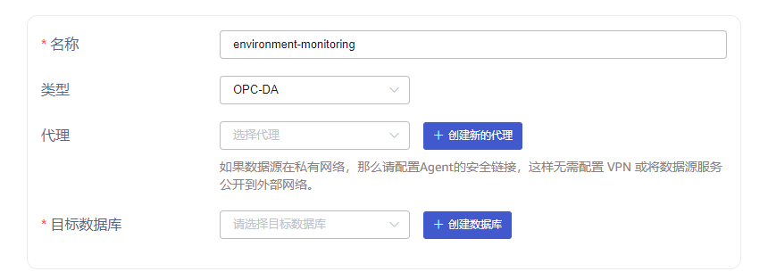
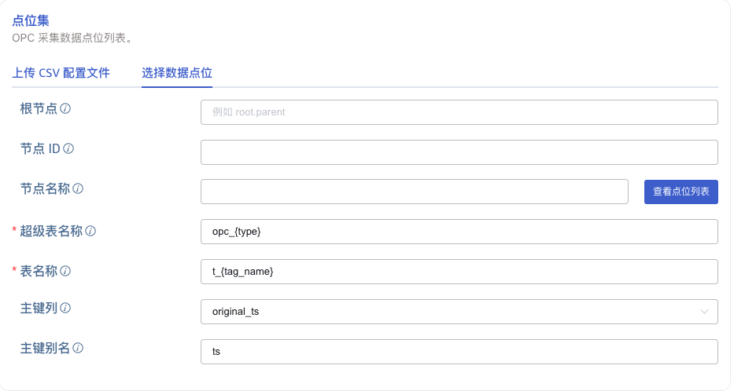
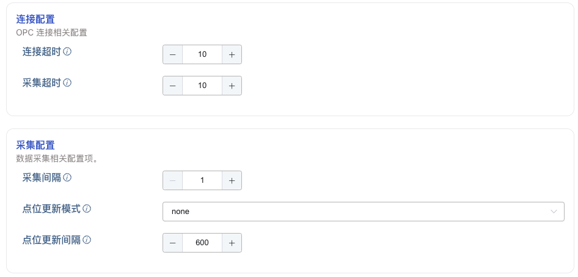
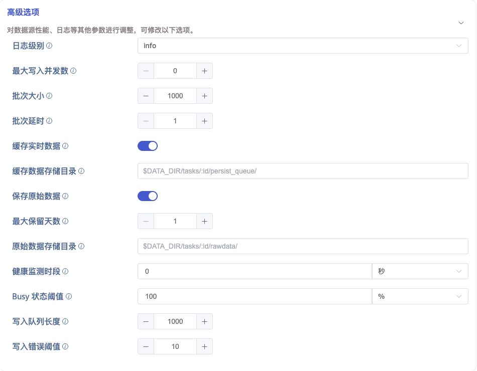

本节讲述如何通过 Explorer 界面创建数据迁移任务，从 OPC-DA 服务器同步数据到当前 TDengine 集群。

## 功能概述

OPC是工业自动化领域和其他行业中安全可靠地交换数据的互操作标准之一。

OPC DA（数据访问）是一种经典的基于COM的规范，仅适用于Windows。尽管OPC DA不是最新和最高效的数据通信规范，但它被广泛使用。这主要是因为一些旧设备只支持OPC DA。

TDengine 可以高效地从 OPC-DA 服务器读取数据并将其写入 TDengine，以实现实时数据入库。

## 创建任务

### 1. 新增数据源

在数据写入页面中，点击 **+新增数据源** 按钮，进入新增数据源页面。

### 2. 配置基本信息

在 **名称** 中输入任务名称，例如针对环境温湿度监控的任务，取名为 **environment-monitoring**。

在 **类型** 下拉列表中选择 **OPC-DA**。

如果 taosX 服务运行在 OPC-DA 所在服务器上，**代理** 不是必须的，否则需要配置 **代理** ：在下拉框中选择指定的代理，也可以先点击右侧的 **+创建新的代理** 按钮创建一个新的代理 ，跟随提示进行代理的配置。

在 **目标数据库** 下拉列表中选择一个目标数据库，也可以先点击右侧的 **+创建数据库** 按钮创建一个新的数据库。

### 3. 配置连接信息

在 **连接配置** 区域填写 **OPC-DA 服务地址**，例如：`127.0.0.1/Matrikon.OPC.Simulation.1`，并配置认证方式。

点击 **连通性检查** 按钮，检查数据源是否可用。

### 4. 配置点位集

**点位集** 可选择使用 CSV 文件模板或 **选择所有点位**。

#### 4.1. 上传 CSV 配置文件

您可以下载 CSV 空模板并按模板配置点位信息，然后上传 CSV 配置文件来配置点位；或者根据所配置的筛选条件下载数据点位，并以 CSV 模板所制定的格式下载。

CSV 文件有如下规则：

1. 文件编码

用户上传的 CSV 文件的编码格式必须为以下格式中的一种：

(1) UTF-8 with BOM

(2) UTF-8（即：UTF-8 without BOM）

2. Header 配置规则

Header 是 CSV 文件的第一行，规则如下：

(1) CSV 的 Header 中可以配置以下列：

| 序号 | 列名                    | 描述                                                                                                                                                                       | 是否必填 | 默认行为                                                                                                                                                                                                                                                                        |
| ---- | ----------------------- | -------------------------------------------------------------------------------------------------------------------------------------------------------------------------- | -------- | ------------------------------------------------------------------------------------------------------------------------------------------------------------------------------------------------------------------------------------------------------------------------------- |
| 1    | tag_name                | 数据点位在 OPC DA 服务器上的 id                                                                                                                                            | 是       | 无                                                                                                                                                                                                                                                                              |
| 2    | stable                  | 数据点位在 TDengine 中对应的超级表                                                                                                                                         | 是       | 无                                                                                                                                                                                                                                                                              |
| 3    | tbname                  | 数据点位在 TDengine 中对应的子表                                                                                                                                           | 是       | 无                                                                                                                                                                                                                                                                              |
| 4    | enable                  | 是否采集该点位的数据                                                                                                                                                       | 否       | 使用统一的默认值`1`作为 enable 的值                                                                                                                                                                                                                                             |
| 5    | value_col               | 数据点位采集值在 TDengine 中对应的列名                                                                                                                                     | 否       | 使用统一的默认值`val` 作为 value_col 的值                                                                                                                                                                                                                                       |
| 6    | value_transform         | 数据点位采集值在 taosX 中执行的变换函数                                                                                                                                    | 否       | 统一不进行采集值的 transform                                                                                                                                                                                                                                                    |
| 7    | type                    | 数据点位采集值的数据类型                                                                                                                                                   | 否       | 统一使用采集值的原始类型作为 TDengine 中的数据类型                                                                                                                                                                                                                              |
| 8    | quality_col             | 数据点位采集值质量在 TDengine 中对应的列名                                                                                                                                 | 否       | 统一不在 TDengine 添加 quality 列                                                                                                                                                                                                                                               |
| 9    | ts_col                  | 数据点位的原始时间戳在 TDengine 中对应的时间戳列                                                                                                                           | 否       | ts_col 和 received_ts_col 都非空时，使用前者作为时间戳列；ts_col 和 received_ts_col 有一列非空时，使用不为空的列作时间戳列；ts_col 和 received_ts_col 都为空时，使用数据点位原始时间戳作 TDengine 中的时间戳列，且列名为默认值ts。                                              |
| 10   | received_ts_col         | 接收到该点位采集值时的时间戳在 TDengine 中对应的时间戳列                                                                                                                   | 否       |                                                                                                                                                                                                                                                                                 |
| 11   | ts_transform            | 数据点位时间戳在 taosX 中执行的变换函数                                                                                                                                    | 否       | 统一不进行数据点位原始时间戳的 transform                                                                                                                                                                                                                                        |
| 12   | received_ts_transform   | 数据点位接收时间戳在 taosX 中执行的变换函数                                                                                                                                | 否       | 统一不进行数据点位接收时间戳的 transform                                                                                                                                                                                                                                        |
| 13   | tag::VARCHAR(200)::name | 数据点位在 TDengine 中对应的 Tag 列。其中`tag` 为保留关键字，表示该列为一个 tag 列；`VARCHAR(200)` 表示该 tag 的类型，也可以是其它合法的类型；`name` 是该 tag 的实际名称。 | 否       | 配置 1 个以上的 tag 列，则使用配置的 tag 列；没有配置任何 tag 列，且 stable 在 TDengine 中存在，使用 TDengine 中的 stable 的 tag；没有配置任何 tag 列，且 stable 在 TDengine 中不存在，则默认自动添加以下 2 个 tag 列：tag::VARCHAR(256)::point_idtag::VARCHAR(256)::point_name |

(2) CSV Header 中，不能有重复的列；

(3) CSV Header 中，类似`tag::VARCHAR(200)::name`这样的列可以配置多个，对应 TDengine 中的多个 Tag，但 Tag 的名称不能重复。

(4) CSV Header 中，列的顺序不影响 CSV 文件校验规则；

(5) CSV Header 中，可以配置不在上表中的列，例如：序号，这些列会被自动忽略。

3. Row 配置规则

CSV 文件中的每个 Row 配置一个 OPC 数据点位。Row 的规则如下：

(1) 与 Header 中的列有如下对应关系

| 序号 | Header 中的列           | 值的类型 | 值的范围                                                                                                                                                                                                                          | 是否必填 | 默认值                   |
| ---- | ----------------------- | -------- | --------------------------------------------------------------------------------------------------------------------------------------------------------------------------------------------------------------------------------- | -------- | ------------------------ |
| 1    | tag_name                | String   | 类似`root.parent.temperature`这样的字符串，要满足 OPC DA 的 ID 规范                                                                                                                                                               | 是       |                          |
| 2    | enable                  | int      | 0：不采集该点位，且在 OPC DataIn 任务开始前，删除 TDengine 中点位对应的子表；1：采集该点位，在 OPC DataIn 任务开始前，不删除子表。                                                                                                | 否       | 1                        |
| 3    | stable                  | String   | 符合 TDengine 超级表命名规范的任何字符串；如果存在特殊字符`.`，使用下划线替换如果存在`{type}`，则：CSV 文件的 type 不为空，使用 type 的值进行替换CSV 文件的 type 为空，使用采集值的原始类型进行替换                               | 是       |                          |
| 4    | tbname                  | String   | 符合 TDengine 子表命名规范的任何字符串；如果存在特殊字符`.`，使用下划线替换对于 OPC UA：如果存在`{ns}`，使用 point_id 中的 ns 替换如果存在`{id}`，使用 point_id 中的 id 替换对于 OPC DA：如果存在`{tag_name}`，使用 tag_name 替换 | 是       |                          |
| 5    | value_col               | String   | 符合 TDengine 命名规范的列名                                                                                                                                                                                                      | 否       | val                      |
| 6    | value_transform         | String   | 符合 Rhai 引擎的计算表达式，例如：`(val + 10) / 1000 * 2.0`，`log(val) + 10`等；                                                                                                                                                  | 否       | None                     |
| 7    | type                    | String   | 支持类型包括：b/bool/i8/tinyint/i16/smallint/i32/int/i64/bigint/u8/tinyint unsigned/u16/smallint unsigned/u32/int unsigned/u64/bigint unsigned/f32/floatf64/double/timestamp/timestamp(ms)/timestamp(us)/timestamp(ns)/json       | 否       | 数据点位采集值的原始类型 |
| 8    | quality_col             | String   | 符合 TDengine 命名规范的列名                                                                                                                                                                                                      | 否       | None                     |
| 9    | ts_col                  | String   | 符合 TDengine 命名规范的列名                                                                                                                                                                                                      | 否       | ts                       |
| 10   | received_ts_col         | String   | 符合 TDengine 命名规范的列名                                                                                                                                                                                                      | 否       | rts                      |
| 11   | ts_transform            | String   | 支持 +、-、*、/、% 操作符，例如：ts / 1000 * 1000，将一个 ms 单位的时间戳的最后 3 位置为 0；ts + 8 * 3600 * 1000，将一个 ms 精度的时间戳，增加 8 小时；ts - 8 * 3600 * 1000，将一个 ms 精度的时间戳，减去 8 小时；                | 否       | None                     |
| 12   | received_ts_transform   | String   | 否                                                                                                                                                                                                                                | None     |                          |
| 13   | tag::VARCHAR(200)::name | String   | tag 里的值，当 tag 的类型是 VARCHAR 时，可以是中文                                                                                                                                                                                | 否       | NULL                     |

(2) tag_name 在整个 DataIn 任务中是唯一的，即：在一个 OPC DataIn 任务中，一个数据点位只能被写入到 TDengine 的一张子表。如果需要将一个数据点位写入多张子表，需要建多个 OPC DataIn 任务；

(3) 当 tag_name 不同，但 tbname 相同时，value_col 必须不同。这种配置能够将不同数据类型的多个点位的数据写入同一张子表中不同的列。这种方式对应 “OPC 数据入 TDengine 宽表”的使用场景。

4. 其他规则

(1) 如果 Header 和 Row 的列数不一致，校验失败，提示用户不满足要求的行号；

(2) Header 在首行，且不能为空；

(3) Row 为 1 行以上；

#### 4.2. 选择数据点位

可以通过配置 **根节点ID** 和 **正则匹配** 作为过滤条件，对点位进行筛选。

通过配置 **超级表名**、**表名称**，指定数据要写入的超级表、子表。

配置**主键列**，选择 origin_ts 表示使用 OPC 点位数据的原始时间戳作 TDengine 中的主键；选择 received_ts 表示使用数据的接收时间戳作 TDengine 中的主键。配置**主键别名**，指定 TDengine 时间戳列的名称。

### 5. 采集配置
在采集配置中，配置当前任务的采集间隔、连接超时、采集超时等选项。

如图所示，其中：

- **连接超时**：配置连接 OPC 服务器超时时间，默认为 10 秒。
- **采集超时**：向 OPC 服务器读取点位数据时如果超过设定时间未返回数据，则读取失败，默认为 10 秒。
- **采集间隔**：默认为 10 秒，数据点位采集间隔，从上次采集数据结束后开始计时，轮询读取点位最新值并写入 TDengine。

当 **点位集** 中使用 **选择数据点位** 方式时，采集配置中可以配置 **点位更新模式** 和 **点位更新间隔** 来启用动态点位更新。**动态点位更新** 是指，在任务运行期间，OPC Server增加或删除了点位后，符合条件的点位会自动添加到当前任务中，不需要重启 OPC 任务。

- 点位更新模式：可选择 `None`、`Append`、`Update`三种。
  - None：不开启动态点位更新；
  - Append：开启动态点位更新，但只追加；
  - Update：开启动态点位更新，追加或删除；
- 点位更新间隔：在“点位更新模式”为 `Append` 和 `Update` 时生效。单位：秒，默认值是 600，最小值：60，最大值：2147483647。

### 6. 高级选项

如上图所示，配置高级选项对性能、日志等进行更加详尽的优化。

**日志级别** 默认为 `info`，可选项有 `error`、`warn`、`info`、`debug`、`trace`。

在 **最大写入并发数** 中设置写入 taosX 的最大并发数限制。默认值：0，表示 auto，自动配置并发数。

在 **批次大小** 中设置每次写入的批次大小，即：单次发送的最大消息数量。

在 **批次延时** 中设置单次发送最大延时（单位为秒），当超时结束时，只要有数据，即使不满足**批次大小**，也立即发送。

在 **保存原始数据** 中选择是否保存原始数据。默认值：否。

当保存原始数据时，以下 2 个参数配置生效。

在 **最大保留天数** 中设置原始数据的最大保留天数。

在 **原始数据存储目录** 中设置原始数据保存路径。若使用 Agent ，则存储路径指的是 Agent 所在服务器上路径，否则是 taosX 服务器上路径。路径中可使用占位符 `$DATA_DIR` 和 `:id` 作为路径中的一部分。

- Linux 平台，$DATA_DIR 为 /var/lib/taos/taosx，默认情况下存储路径为 `/var/lib/taos/taosx/tasks/<task_id>/rawdata` 。
- Widonws 平台， $DATA_DIR 为 C:\TDengine\data\taosx，默认情况下存储路径为 `C:\TDengine\data\taosx\tasks\<task_id>\rawdata` 。

### 7. 创建完成

点击 **提交** 按钮，完成创建 OPC DA 到 TDengine 的数据同步任务，回到**数据源列表**页面可查看任务执行情况。
