本节讲述如何通过 Explorer 界面创建数据迁移任务, 从 MQTT 迁移数据到当前 TDengine 集群。

## 功能概述

MQTT 表示 Message Queuing Telemetry Transport （消息队列遥测传输）。它是一种轻量级的消息协议，易于实现和使用。

TDengine 可以通过 MQTT 连接器从 MQTT 代理订阅数据并将其写入 TDengine，以实现实时数据流入库。

## 创建任务

### 1. 新增数据源

在数据写入页面中，点击 **+新增数据源** 按钮，进入新增数据源页面。

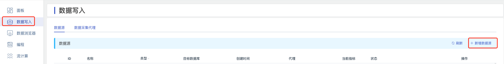

### 2. 配置基本信息

在 **名称** 中输入任务名称，如：“test_mqtt”；

在 **类型** 下拉列表中选择 **MQTT**。

**代理** 是非必填项，如有需要，可以在下拉框中选择指定的代理，也可以先点击右侧的 **+创建新的代理** 按钮

在 **目标数据库** 下拉列表中选择一个目标数据库，也可以先点击右侧的 **+创建数据库** 按钮

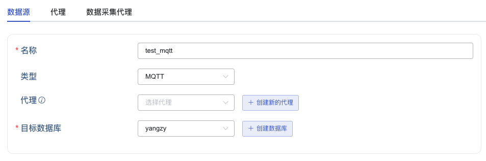

### 3. 配置连接和认证信息

在 **MQTT 地址** 中填写 MQTT 代理的地址，例如：`192.168.1.42`

在 **MQTT 端口** 中填写 MQTT 代理的端口，例如：`1883`

在 **用户** 中填写 MQTT 代理的用户名。

在 **密码** 中填写 MQTT 代理的密码。


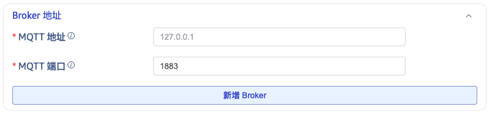

### 4. 配置 SSL 证书

如果 MQTT 代理使用了 SSL 证书，需要在 **SSL证书** 中上传证书文件。

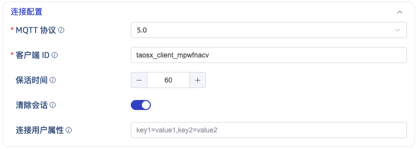

### 5. 配置采集信息

在 **采集配置** 区域填写采集任务相关的配置参数。

在 **MQTT 协议** 下拉列表中选择 MQTT 协议版本。有三个选项：`3.1`、`3.1.1`、`5.0`。 默认值为 3.1。

在 **Client ID** 中填写客户端标识，填写后会生成带有 `taosx` 前缀的客户端 id （例如，如果填写的标识为 `foo`，则生成的客户端 id 为 `taosxfoo`）。如果打开末尾处的开关，则会把当前任务的任务 id 拼接到 `taosx` 之后，输入的标识之前（生成的客户端 id 形如 `taosx100foo`）。连接到同一个 MQTT 地址的所有客户端 id 必须保证唯一。

在 **Keep Alive** 中输入保持活动间隔。如果代理在保持活动间隔内没有收到来自客户端的任何消息，它将假定客户端已断开连接，并关闭连接。
保持活动间隔是指客户端和代理之间协商的时间间隔，用于检测客户端是否活动。如果客户端在保持活动间隔内没有向代理发送消息，则代理将断开连接。

在 **Clean Session** 中，选择是否清除会话。默认值为 true。

在 **订阅主题及 QoS 配置** 中填写要消费的 Topic 名称。使用如下格式设置： `topic1::0,topic2::1`。

点击 **检查连通性** 按钮，检查数据源是否可用。

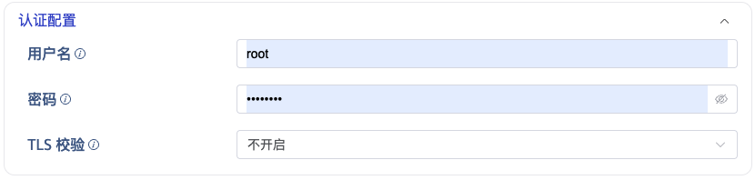

### 6. 配置 MQTT Payload 解析

在 **MQTT Payload 解析** 区域填写 Payload 解析相关的配置参数。

taosX 可以使用 JSON 提取器解析数据，并允许用户在数据库中指定数据模型，包括，指定表名称和超级表名，设置普通列和标签列等。

#### 6.1 解析

有三种获取示例数据的方法：

点击 **从服务器检索** 按钮，从 MQTT 获取示例数据。

点击 **文件上传** 按钮，上传 CSV 文件，获取示例数据。

在 **消息体** 中填写 MQTT 消息体中的示例数据。

json 数据支持 JSONObject 或者 JSONArray，使用 json 解析器可以解析一下数据：

``` json
{"id": 1, "message": "hello-word"}
{"id": 2, "message": "hello-word"}
```

或者

``` json
[{"id": 1, "message": "hello-word"},{"id": 2, "message": "hello-word"}]
```

解析结果如下所示：

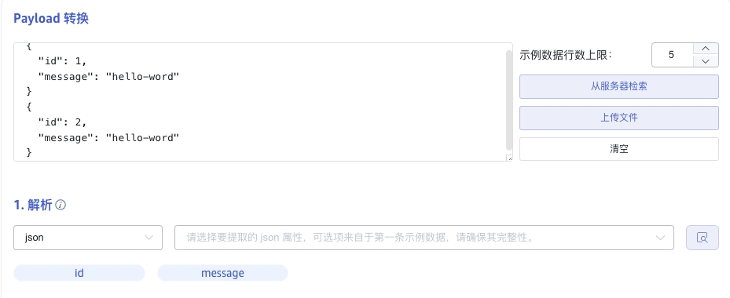

点击 **放大镜图标**  可查看预览解析结果。

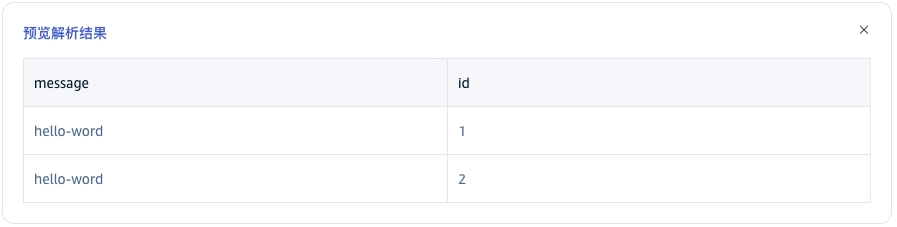

#### 6.2 字段拆分

在 **从列中提取或拆分** 中填写从消息体中提取或拆分的字段，例如：将 message 字段拆分成 `message_0` 和 `message_1` 这2 个字段，选择 split 提取器，seperator 填写 -, number 填写 2。

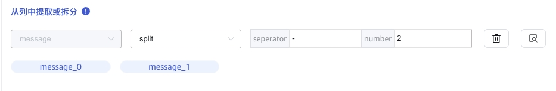

点击 **删除**，可以删除当前提取规则。

点击 **新增**，可以添加更多提取规则。

点击 **放大镜图标** 可查看预览提取/拆分结果。

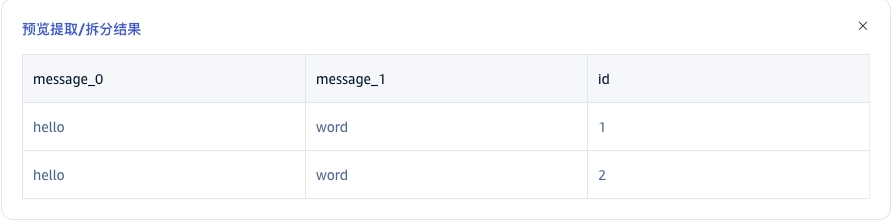

#### 6.3 数据过滤

在 **过滤** 中，填写过滤条件，例如：填写`id != 1`，则只有 id 不为 1 的数据才会被写入 TDengine。

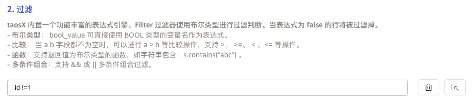

点击 **删除**，可以删除当前过滤规则。

点击 **放大镜图标** 可查看预览过滤结果。

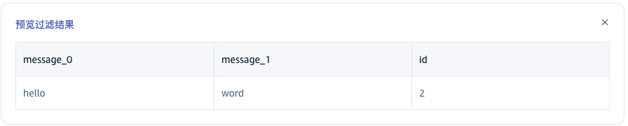

#### 6.4 表映射

在 **目标超级表** 的下拉列表中选择一个目标超级表，也可以先点击右侧的 **创建超级表** 按钮

在 **映射** 中，填写目标超级表中的子表名称，例如：`t_{id}`。根据需求填写映射规则，其中 mapping 支持设置缺省值。


点击 **预览**，可以查看映射的结果。

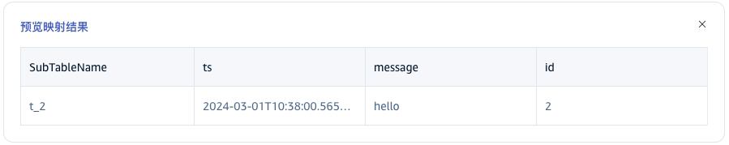

### 7. 高级选项

在 **日志级别** 下拉列表中选择日志级别。有五个选项：`TRACE`、`DEBUG`、`INFO`、`WARN`、`ERROR`。 默认值为 INFO。

当 **保存原始数据时**，以下2个参数配置生效。

在 **最大保留天数** 中设置原始数据的最大保留天数。

在 **原始数据存储目录** 中设置原始数据保存路径。

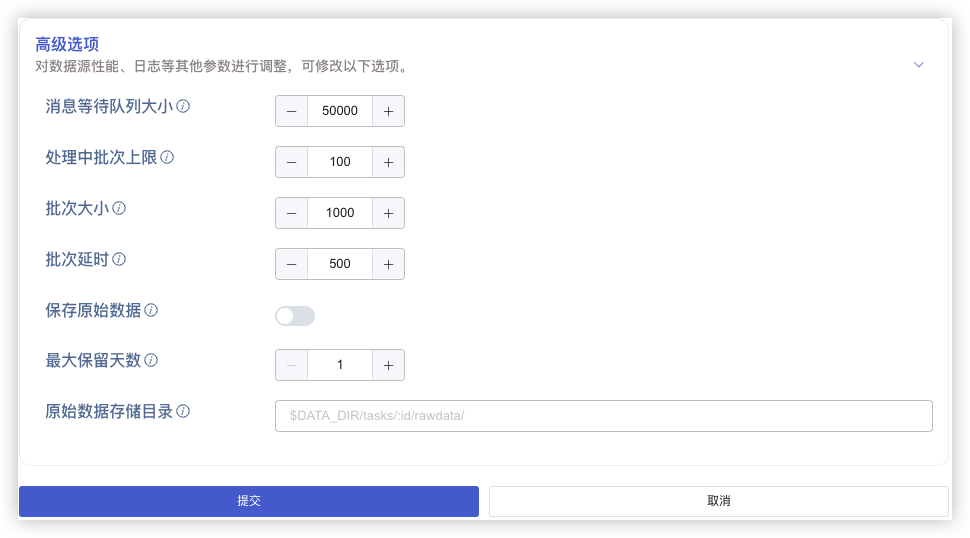

### 8. 创建完成

点击 **提交** 按钮，完成创建 MQTT 到 TDengine 的数据同步任务，回到**数据源列表**页面可查看任务执行情况。
