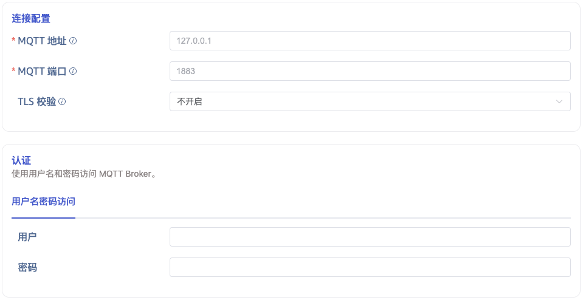
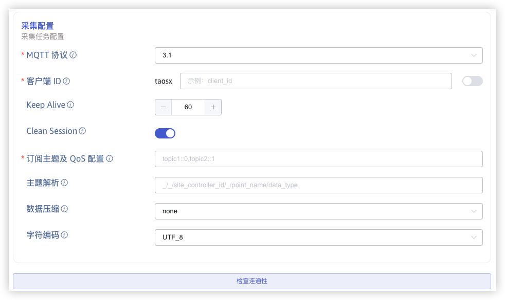
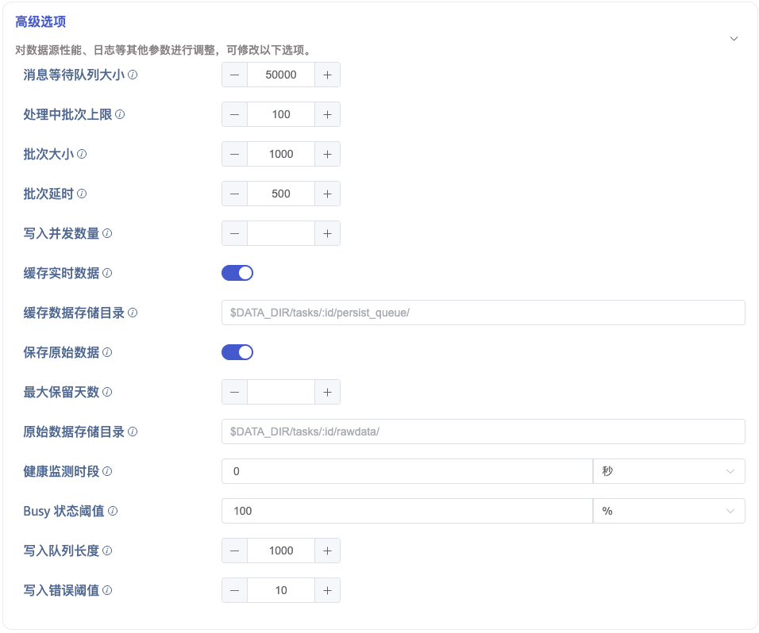

本节讲述如何通过 Explorer 界面创建数据迁移任务，从 MQTT 迁移数据到当前 TDengine TSDB 集群。

## 功能概述

MQTT 表示 Message Queuing Telemetry Transport（消息队列遥测传输）。它是一种轻量级的消息协议，易于实现和使用。

TDengine TSDB 可以通过 MQTT 连接器从 MQTT 代理订阅数据并将其写入 TDengine TSDB，以实现实时数据流入库。

## 创建任务

### 1. 新增数据源

在数据写入页面中，点击 **+新增数据源** 按钮，进入新增数据源页面。


### 2. 配置基本信息

在 **名称** 中输入任务名称，如：“test_mqtt”；

在 **类型** 下拉列表中选择 **MQTT**。

**代理** 是非必填项，如有需要，可以在下拉框中选择指定的代理，也可以先点击右侧的 **+创建新的代理** 按钮

在 **目标数据库** 下拉列表中选择一个目标数据库，也可以先点击右侧的 **+创建数据库** 按钮


### 3. 配置连接和认证信息

在 **MQTT 地址** 中填写 MQTT 代理的地址，例如：`192.168.1.42`

在 **MQTT 端口** 中填写 MQTT 代理的端口，例如：`1883`

在 **TLS 校验** 中选择 TLS 证书的校验方式

1. 不开启：表示不进行 TLS 证书认证。在连接 MQTT 时，会先进行 TCP 连接，如果连接失败，会进行无证书认证模式的 TLS 连接。

2. 单向认证：开启 TLS 连接，并验证服务端证书，此时需要上传 CA 证书。

3. 双向认证：开启 TLS 连接，并与服务端进行双向认证，此时需要上传 CA 证书，客户端证书以及客户端密钥。

在 **用户** 中填写 MQTT 代理的用户名。

在 **密码** 中填写 MQTT 代理的密码。



### 4. 配置采集信息

在 **采集配置** 区域填写采集任务相关的配置参数。

在 **MQTT 协议** 下拉列表中选择 MQTT 协议版本。有三个选项：`3.1`、`3.1.1`、`5.0`。默认值为`3.1`。

在 **Client ID** 中填写客户端标识，填写后会生成带有 `taosx` 前缀的客户端 id（例如，如果填写的标识为 `foo`，则生成的客户端 id 为 `taosxfoo`）。如果打开末尾处的开关，则会把当前任务的任务 id 拼接到 `taosx` 之后，输入的标识之前（生成的客户端 id 形如 `taosx100foo`）。连接到同一个 MQTT 地址的所有客户端 id 必须保证唯一。

在 **Keep Alive** 中输入保持活动间隔。如果代理在保持活动间隔内没有收到来自客户端的任何消息，它将假定客户端已断开连接，并关闭连接。
保持活动间隔是指客户端和代理之间协商的时间间隔，用于检测客户端是否活动。如果客户端在保持活动间隔内没有向代理发送消息，则代理将断开连接。

在 **Clean Session** 中，选择是否清除会话。默认值为 true。

在 **订阅主题及 QoS 配置** 中填写要消费的 Topic 名称和 QoS。使用如下格式设置： `{topic_name}::{qos}`（如：`my_topic::0`）。MQTT 协议 5.0 支持共享订阅，可以通过多个客户端订阅同一个 Topic 实现负载均衡，使用如下格式： `$share/{group_name}/{topic_name}::{qos}`，其中，`$share` 是固定前缀，表示启用共享订阅，`group_name` 是分组名称，类似 kafka 的消费者组。

在 **主题解析** 中填写 MQTT 主题解析规则，格式与 MQTT Topic 相同，将 MQTT Topic 各层级内容解析为对应变量名，`_` 表示解析时忽略当前层级。例如：MQTT Topic `a/+/c` 对应解析规则如果设置为 `v1/v2/_`，代表将第一层级的 `a` 赋值给变量 `v1`，第二层级的值（这里通配符 `+` 代表任意值）复制给变量 `v2`，第三层级的值 `c` 忽略，不会赋值给任何变量。在下方的 `payload 解析` 中，Topic 解析得到的变量同样可以参与各种转换和计算。

在 **数据压缩** 中，配置消息体压缩算法，taosX 在接收到消息后，使用对应的压缩算法对消息体进行解压缩获取原始数据。可选项 none(不压缩), gzip, snappy, lz4 和 zstd，默认为 none。

在 **字符编码** 中，配置消息体编码格式，taosX 在接收到消息后，使用对应的编码格式对消息体进行解码获取原始数据。可选项 UTF_8, GBK, GB18030, BIG5，默认为 UTF_8

点击 **检查连通性** 按钮，检查数据源是否可用。



### 5. 配置 MQTT Payload 解析

在 **MQTT Payload 解析** 区域填写 Payload 解析相关的配置参数。

taosX 可以使用 JSON 提取器解析数据，并允许用户在数据库中指定数据模型，包括，指定表名称和超级表名，设置普通列和标签列等。

#### 5.1 解析

有三种获取示例数据的方法：

点击 **从服务器检索** 按钮，从 MQTT 获取示例数据。

点击 **文件上传** 按钮，上传 CSV 文件，获取示例数据。

在 **消息体** 中填写 MQTT 消息体中的示例数据。

json 数据支持 JSONObject 或者 JSONArray，使用 json 解析器可以解析一下数据：

``` json
{"id": 1, "message": "hello-word"}
{"id": 2, "message": "hello-word"}
```

或者

``` json
[{"id": 1, "message": "hello-word"},{"id": 2, "message": "hello-word"}]
```

解析结果如下所示：


点击 **放大镜图标**  可查看预览解析结果。


#### 5.2 字段拆分

在 **从列中提取或拆分** 中填写从消息体中提取或拆分的字段，例如：将 message 字段拆分成 `message_0` 和 `message_1` 这 2 个字段，选择 split 提取器，separator 填写 -, number 填写 2。


点击 **删除**，可以删除当前提取规则。

点击 **新增**，可以添加更多提取规则。

点击 **放大镜图标** 可查看预览提取/拆分结果。


#### 5.3 数据过滤

在 **过滤** 中，填写过滤条件，例如：填写`id != 1`，则只有 id 不为 1 的数据才会被写入 TDengine TSDB。


点击 **删除**，可以删除当前过滤规则。

点击 **放大镜图标** 可查看预览过滤结果。


#### 5.4 表映射

在 **目标超级表** 的下拉列表中选择一个目标超级表，也可以先点击右侧的 **创建超级表** 按钮创建新的超级表。

当超级表需要根据消息动态生成时，可以选择 **创建模板**。其中，超级表名称，列名，列类型等均可以使用模板变量，当接收到数据后，程序会自动计算模板变量并生成对应的超级表模板，当数据库中超级表不存在时，会使用此模板创建超级表；对于已创建的超级表，如果缺少通过模板变量计算得到的列，也会自动创建对应列。


在 **映射** 中，填写目标超级表中的子表名称，例如：`t_{id}`。根据需求填写映射规则，其中 mapping 支持设置缺省值。


点击 **预览**，可以查看映射的结果。


如果超级表列为模板变量，在子表映射时会进行 pivot 操作，其中模板变量的值展开为列名，列的值为对应的映射列

例如：


预览结果为：


### 6. 高级选项

在 **消息等待队列大小** 中填写接收 MQTT 消息的缓存队列大小，当队列满时，如果没有设置 **缓存实时数据** 选项，新到达的数据会直接丢弃。可设置为 0，即不缓存。

在 **处理批次上限** 中填写可以同时进行数据处理流程的批次数量，当到达此上限后，不再从消息缓存队列中获取消息，会导致缓存队列的消息积压，最小值为 1。

在 **批次大小** 中填写每次发送给数据处理流程的消息数量，和 **批次延时** 配合使用，当读取的 MQTT 消息数量达到批次大小时，就算 **批次延时** 没有到达也立即向数据处理流程发送数据，最小值为 1。

在 **批次延时** 中填写每次生成批次消息的超时时间（单位：毫秒），从每批次接收到的第一个消息开始算起，和 **批次大小** 配合使用，当读取消息到达超时时间时，就算 **批次大小** 不满足数量也立即向数据处理流程发送数据，最小值为 1。

当 **缓存实时数据** 选项开启时，MQTT 消费的数据会先存入本地文件中，本地文件的数据会被后台任务持续读出并发送给下游处理。当 MQTT 数据流量巨大，下游无法及时处理造成数据消费卡顿导致数据丢弃时使用，即用于流量削峰，当数据消费完毕后，会自动清理文件。此功能默认关闭。

在 **缓存数据存储目录** 中可填写数据缓存的存储目录路径，默认为 taosX 启动时配置的数据目录，也可以填写自定义目录。此选项仅在 **缓存实时数据** 选项开启时有效。

当 **保存原始数据时** 选项开启时，以下 2 个参数配置生效。

在 **最大保留天数** 中设置原始数据的最大保留天数。

在 **原始数据存储目录** 中设置原始数据保存路径。



### 7. 异常处理策略

import Contributing from './_03-exception-handling-strategy.mdx'

<Contributing />

### 8. 创建完成

点击 **提交** 按钮，完成创建 MQTT 到 TDengine TSDB 的数据同步任务，回到**数据源列表**页面可查看任务执行情况。
