本节讲述如何通过 Explorer 界面创建数据迁移任务, 从 Kafka 迁移数据到当前 TDengine 集群。

## 功能概述
Apache Kafka 是一个用于流处理、实时数据管道和大规模数据集成的开源分布式流系统。

TDengine 可以高效地从 Kafka 读取数据并将其写入 TDengine，以实现历史数据迁移或实时数据流入库。

## 创建任务

### 1. 新增数据源

在数据写入页面中，点击 **+新增数据源** 按钮，进入新增数据源页面。

### 2. 配置基本信息

在 **名称** 中输入任务名称，如：“test_kafka”；

在 **类型** 下拉列表中选择 **Kafka**。

**代理** 是非必填项，如有需要，可以在下拉框中选择指定的代理，也可以先点击右侧的 **+创建新的代理**

在 **目标数据库** 下拉列表中选择一个目标数据库，也可以先点击右侧的 **+创建数据库** 按钮

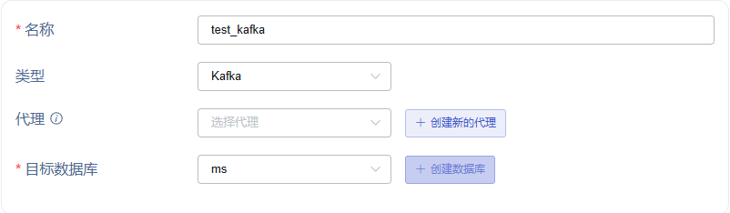

### 3. 配置连接信息

**bootstrap-server**，例如：`192.168.1.92`。

**服务端口**，例如：`9092`。

多个 broker 地址时，在连接配置右下增加 **新增 Broker** 按钮，成对增加 bootstrap-server 和服务端口。

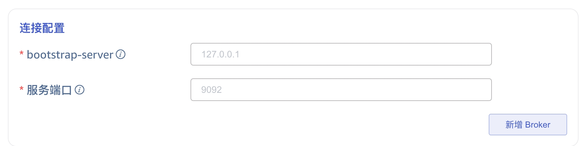

### 4. 配置 SASL 认证机制

如果服务端开启了 SASL 认证机制，此处需要启用 SASL 并配置相关内容，目前支持 PLAIN/SCRAM-SHA-256/GSSAPI 三种认证机制，请按实际情况进行选择。

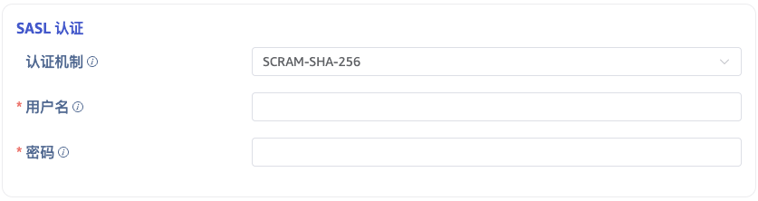

### 5. 配置 SSL 证书

如果服务端开启了 SSL 加密认证,此处需要启用 SSL 并配置相关内容。

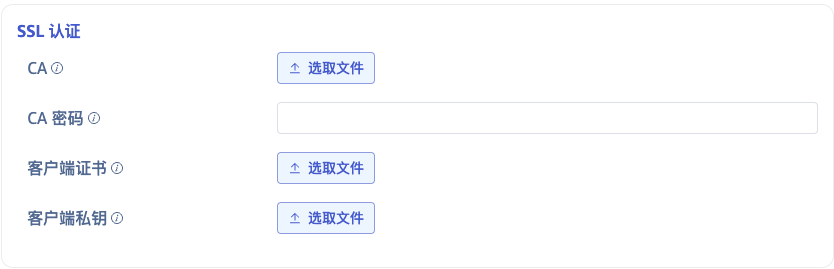

### 6. 配置采集信息

在 **采集配置** 区域填写采集任务相关的配置参数。

在 **超时时间** 中填写超时时间。当从 Kafka 消费不到任何数据，超过 timeout 后，数据采集任务会退出。默认值是 0 ms。 当 timeout 设置为 0 时，会一直等待，直到有数据可用，或者发生错误。

在 **主题** 中填写要消费的 Topic 名称。可以配置多个 Topic ， Topic 之间用逗号分隔。例如：`tp1,tp2`。

在 **Offset** 的下拉列表中选择从哪个 Offset 开始消费数据。有三个选项：`Earliest`、`Latest`、`ByTime(ms)`。 默认值为Earliest。

* Earliest：用于请求最早的 offset。
* Latest：用于请求最晚的 offset。

在 **获取数据的最大时长** 中设置获取消息时等待数据不足的最长时间（以毫秒为单位），默认值为 100ms。

点击 **连通性检查** 按钮，检查数据源是否可用。

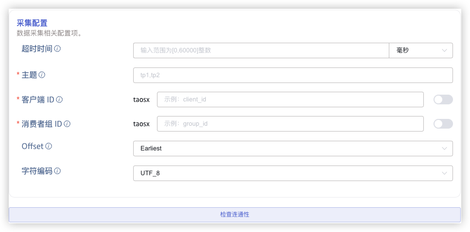

### 7. 配置 Payload 解析

在 **Payload 解析** 区域填写 Payload 解析相关的配置参数。

#### 7.1 解析
有三种获取示例数据的方法：

点击 **从服务器检索** 按钮，从 Kafka 获取示例数据。

点击 **文件上传** 按钮，上传 CSV 文件，获取示例数据。

在 **消息体** 中填写 Kafka 消息体中的示例数据，例如：`{"id": 1, "message": "hello-word"}{"id": 2, "message": "hello-word"}`。之后会使用这条示例数据来配置提取和过滤条件。

点击 **放大镜图标**  可查看预览解析结果。

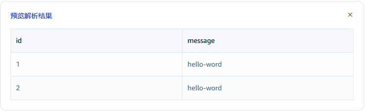

#### 7.2 字段拆分

在 **从列中提取或拆分** 中填写从消息体中提取或拆分的字段，例如：将 message 字段拆分成 `message_0` 和 `message_1` 这2个字段，选择 split 提取器，seperator 填写 -, number 填写2。

点击 **新增**，可以添加更多提取规则。

点击 **删除**，可以删除当前提取规则。

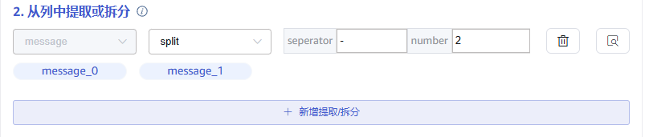

点击 **放大镜图标** 可查看预览提取/拆分结果。

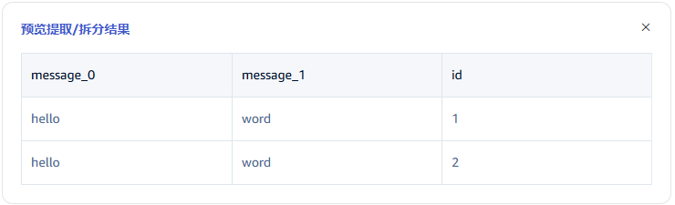

#### 7.3 数据过滤

在 **过滤** 中，填写过滤条件，例如：填写 `id != 1`，则只有 id 不为 1 的数据才会被写入 TDengine。

点击 **新增**，可以添加更多过滤规则。

点击 **删除**，可以删除当前过滤规则。

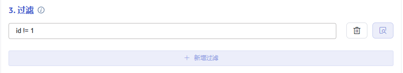

点击 **放大镜图标** 可查看预览过滤结果。

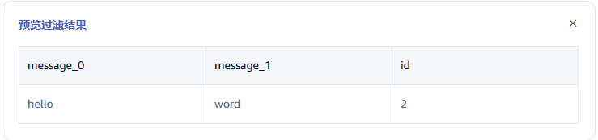

#### 7.4 表映射

在 **目标超级表** 的下拉列表中选择一个目标超级表，也可以先点击右侧的 **创建超级表** 按钮

在 **映射** 中，填写目标超级表中的子表名称，例如：`t_{id}`。根据需求填写映射规则，其中 mapping 支持设置缺省值。

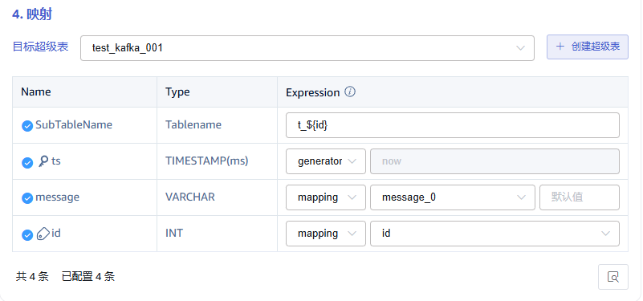

点击 **预览**，可以查看映射的结果。

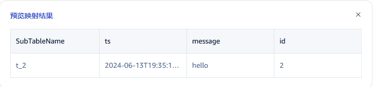

### 8. 配置高级选项

**高级选项** 区域是默认折叠的，点击右侧 `>` 可以展开，如下图所示：

### 9. 创建完成

点击 **提交** 按钮，完成创建 Kafka 到 TDengine 的数据同步任务，回到**数据源列表**页面可查看任务执行情况。