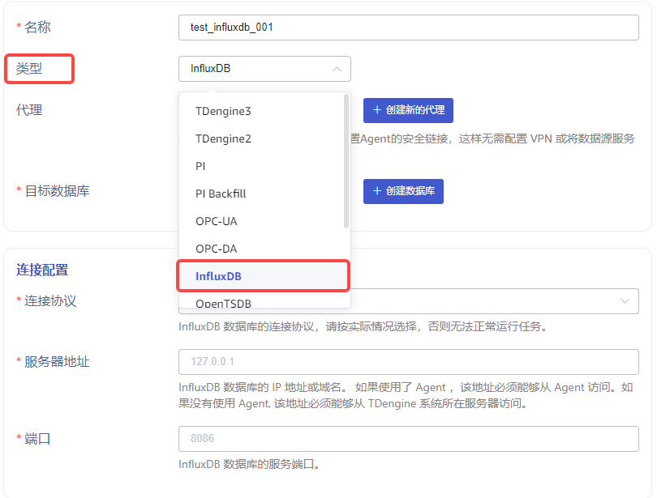
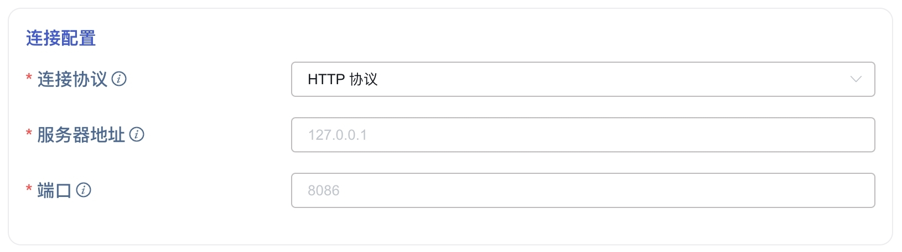
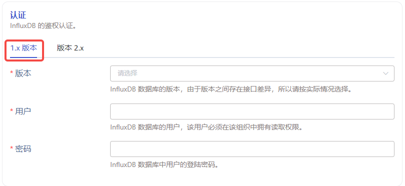
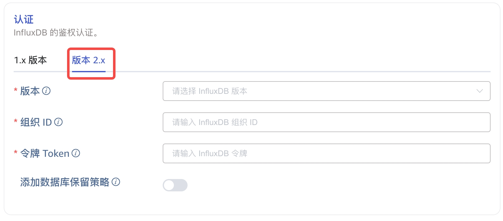
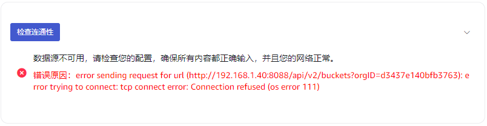
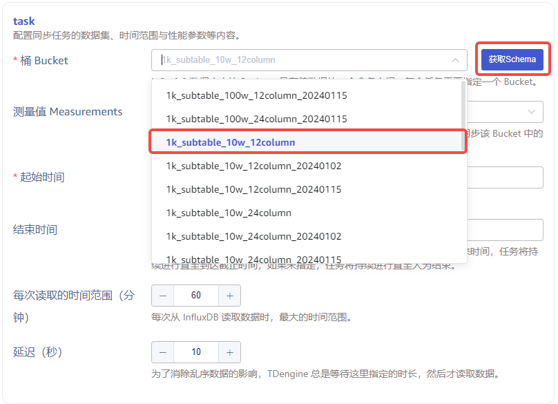
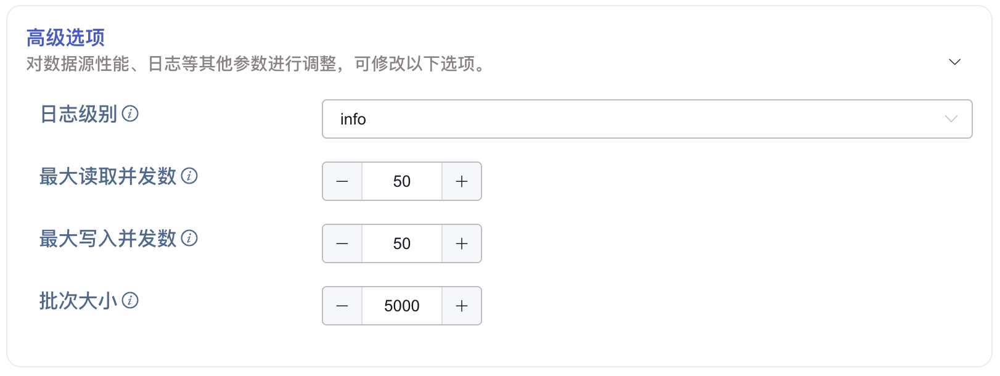

本节讲述如何通过 Explorer 界面创建数据迁移任务, 从 InfluxDB 迁移数据到当前 TDengine 集群。

## 功能概述

InfluxDB 是一种流行的开源时间序列数据库，它针对处理大量时间序列数据进行了优化。TDengine 可以通过 InfluxDB 连接器高效地读取 InfluxDB 中的数据，并将其写入 TDengine，以实现历史数据迁移或实时数据同步。

任务在运行过程中会保存进度信息到硬盘上，因此如果暂停任务后重新启动，或任务自动从异常中自动恢复，任务并不会从头开始进行。更多选项建议详细阅读创建任务页面每个表单字段的说明。

## 创建任务

### 1. 新增数据源

在数据写入页面中点击左上角的 **+新增数据源** 按钮进入新增数据源页面，如下图所示：

### 2. 配置基本信息

在 **名称** 字段中输入任务名称，例如 *`test_influxdb_01`* 。

选择 **类型** 下拉框中的 *`InfluxDB`* ，如下图所示（选择完成后页面中的字段会发生变化）。

**代理** 是非必填项，如有需要，可以在下拉框中选择指定的代理，也可以先点击右侧的 **+创建新的代理** 按钮

**目标数据库** 是必填项，由于 InfluxDB 存储数据的时间精度可以同时存在秒、毫秒、微秒与纳秒等，所以这里需要选择一个 *`纳秒精度的数据库`* ，也可以先点击右侧的 **+创建数据库** 按钮

### 3. 配置连接信息

在 **连接配置** 区域填写 *`源 InfluxDB 数据库的连接信息`*，如下图所示：

### 4. 配置认证信息

在 **认证** 区域有两个选项卡，*`1.x 版本`* 与 *`2.x 版本`* ，这是由于不同版本的 InfluxDB 数据库的鉴权参数不同且 API 存在较大差异，请根据实际情况进行选择：  
  *`1.x 版本`*  
  **版本** 在下拉框中选择源 InfluxDB 数据库的版本。  
  **用户** 输入源 InfluxDB 数据库的用户，该用户必须在该组织中拥有读取权限。  
  **密码** 输入源 InfluxDB 数据库中上方用户的登陆密码。  
    
  *`2.x 版本`*  
  **版本** 在下拉框中选择源 InfluxDB 数据库的版本。  
  **组织 ID** 输入源 InfluxDB 数据库的组织 ID，它是一个由十六进制字符组成的字符串，而不是组织名称，可以从 InfluxDB 控制台的 Organization->About 页面获取。  
  **令牌 Token**：输入源 InfluxDB 数据库的访问令牌，该令牌必须在该组织中拥有读取权限。  
  **添加数据库保留策略** 这是一个 *`是/否`* 的开关项，InfluxQL 需要数据库与保留策略（DBRP）的组合才能查询数据，InfluxDB 的 Cloud 版本及某些 2.x 版本需要人工添加这个映射关系，打开这个开关，连接器可以在执行任务时自动添加。  
  

在 **认证** 区域的下方有一个 **连通性检查** 按钮，用户可以点击此按钮检查上方填写的信息是否可以正常获取源 InfluxDB 数据库的数据，检查结果如下图所示：  
  **失败**  
    
  **成功**  
  

### 5. 配置任务信息

**桶 Bucket** 是 InfluxDB 数据库中存储数据的一个命名空间，每个任务需要指定一个 Bucket，用户需要先点击右侧的 **获取 Schema** 按钮获取当前源 InfluxDB 数据库的数据结构信息，然后在下拉框中进行选择，如下图所示：

**测量值 Measurements** 是非必填项，用户可以在下拉框中选择一个或多个需要同步的 Measurements，未指定则同步全部。

**起始时间** 是指源 InfluxDB 数据库中数据的起始时间，起始时间的时区使用 explorer 所选时区，此项为必填字段。

**结束时间** 是指源 InfluxDB 数据库中数据的截止时间，当不指定结束时间时，将持续进行最新数据的同步；当指定结束时间时，将只同步到这个结束时间为止，结束时间的时区使用 explorer 所选时区，此项为可选字段。

**每次读取的时间范围（分钟）** 是连接器从源 InfluxDB 数据库中单次读取数据时的最大时间范围，这是一个很重要的参数，需要用户结合服务器性能及数据存储密度综合决定。如果范围过小，则同步任务的执行速度会很慢；如果范围过大，则可能因内存使用过高而导致 InfluxDB 数据库系统故障。

**延迟（秒）** 是一个范围在 1 到 30 之间的整数，为了消除乱序数据的影响，TDengine 总是等待这里指定的时长，然后才读取数据。

### 6. 配置高级选项

**高级选项** 区域是默认折叠的，点击右侧 `>` 可以展开，如下图所示：

### 7. 创建完成

点击 **提交** 按钮，完成创建 InfluxDB 到 TDengine 的数据同步任务，回到**数据源列表**页面可查看任务执行情况。