本节讲述如何通过 Explorer 界面创建数据迁移任务，从 CSV 迁移数据到当前 TDengine 集群。

## 功能概述
导入一个或多个 CSV 文件数据到 TDengine。

## 创建任务
### 1. 新增数据源
在数据写入任务列表页面中，点击 **+新建任务** 按钮，进入新建任务页面。

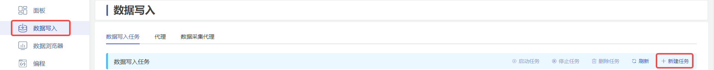

### 2. 配置基本信息
在 **名称** 中输入任务名称，如：“test_csv”。

在 **类型** 下拉列表中选择 **CSV**。

在 **目标数据库** 下拉列表中选择一个目标数据库，也可以先点击右侧的 **+创建数据库** 按钮。

### 3. 配置 CSV 选项
在 **包含表头** 区域点击开启或关闭，如果包含表头，则 CSV 文件内容第一行将被视为列信息。

在 **忽略前 N 行** 区域填写数字 N，表示忽略 CSV 文件的前 N 行。

在 **字段分隔符** 区域选择 CSV 字段分隔符，用于分隔行内容为多个字段，默认是 `,`。

在 **字段引用符** 区域选择 CSV 字段引用符，当 CSV 字段中包含分隔符或换行符时，用于包围字段内容，以确保整个字段被正确识别，默认是 `"`。

在 **注释前缀符** 区域选择 CSV 行注释前缀符，当 CSV 文件中某行以此处指定的字符开头，则忽略该行，默认是 `#`。

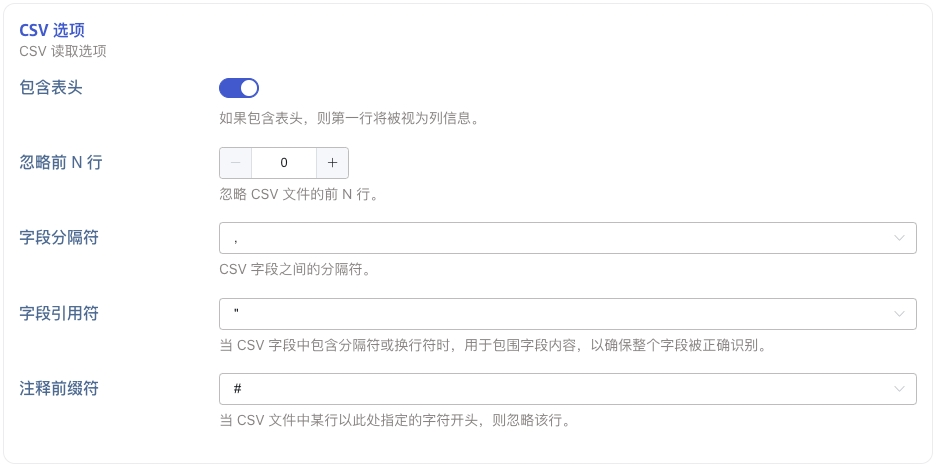

### 4. 配置解析 CSV 文件

#### 4.1 配置数据源

包含“上传 CSV 文件”与“监听文件目录”两种方式，“上传 CSV 文件”是指将本地文件通过浏览器上传到 taosx 所在服务器作为数据源，“监听文件目录”是指配置一个 taosx 所在服务器的绝对路径作为数据源，以下将分别进行介绍：

##### 4.1.1 上传 CSV 文件

在“上传 CSV 文件”标签页中：

点击 **选取文件** 按钮，选取一个或多个本地文件，上传到服务器作为数据源。

在 **保留已处理文件** 区域点击开启或关闭，如果开启，则文件被处理完成后仍会保留在服务器中，如果关闭，则将被删除。

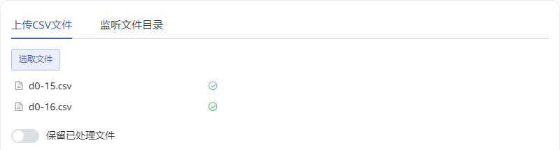

##### 4.1.2 监听文件目录

在“监听文件目录”标签页中：

在 **文件监听目录** 中输入一个 taosx 所在服务器的绝对路径，路径中包含的文件及子目录文件将作为数据源。

在 **匹配模式** 中输入一个正则表达式，用于筛选过滤目录中的文件。

在 **监听新文件** 区域点击开启或关闭，如果开启，则任务永不停止，且持续处理目录中新增的文件，如果关闭，则不处理新增文件，且初始文件处理结束后任务变为完成状态。

在 **监听间隔** 中输入一个数字，用于配置监听新文件的时间间隔。

在 **文件处理顺序** 区域选择“正序”或“倒序”，用于指定文件列表的处理先后顺序，“正序”将按照文件名的字典序正序处理，“倒序”将按照文件名的字典序倒序处理，与此同时，程序总是保持先处理文件后处理同级子目录的顺序。

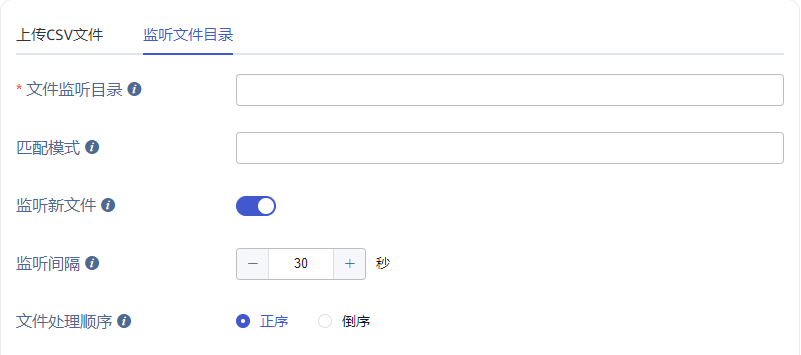

#### 4.2 解析

上传文件或配置监听目录后，点击解析按钮，页面将获取文件中的示例数据，同时得到识别的列与示例数据解析结果：

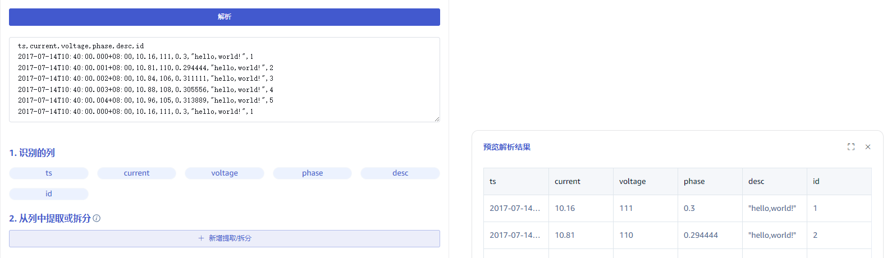

#### 4.2 从列中提取或拆分

在 **从列中提取或拆分** 中填写从消息体中提取或拆分规则，例如：将 `desc` 字段拆分为 `desc_0` 与 `desc_1` 两个字段，可以选择 split 规则，separator 填写 `,`，number 填写 2 即可。

点击 **删除** 可以删除当前提取规则。

点击 **预览** 可以预览提取或拆分结果。

点击 **新增提取/拆分** 可以添加更多提取规则。

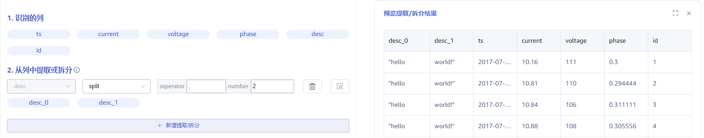

#### 4.3 过滤

在 **过滤** 中填写过滤条件，例如：填写 `id != "1"`，则只有 id 不为 1 的数据才会被处理。

点击 **删除** 可以删除当前过滤规则。

点击 **预览** 可以预览过滤结果。

点击 **新增过滤** 可以添加更多过滤规则。

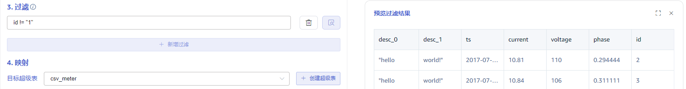

#### 4.4 映射

在 **目标超级表** 的下拉列表中选择一个目标超级表，也可以先点击右侧的 **创建超级表** 按钮

在映射规则中，填写目标超级表中的子表名称，例如：`csv_meter_${id}`，同时配置映射到超级表的列。

点击 **预览** 可以预览映射的结果。

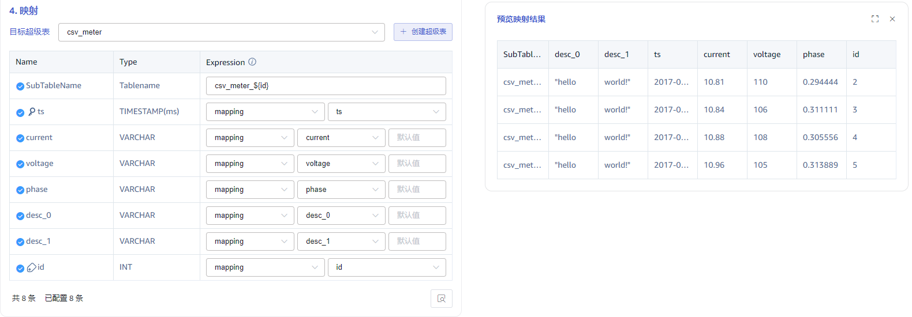

### 5. 创建完成

点击 **提交** 按钮，完成创建 CSV 到 TDengine 的数据同步任务，回到数据写入任务列表页面，可查看任务执行情况，也可以进行任务的“启动/停止”操作与“查看/编辑/删除/复制”操作。

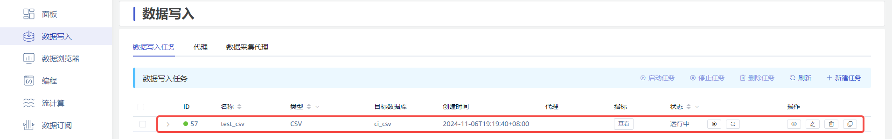

### 6. 查看运行指标

点击 **查看** 按钮，查看任务的运行指标，同时也可以查看任务中所有文件的处理情况。

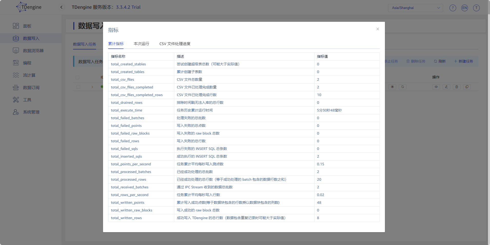

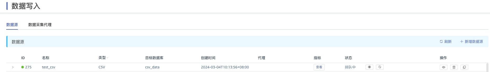

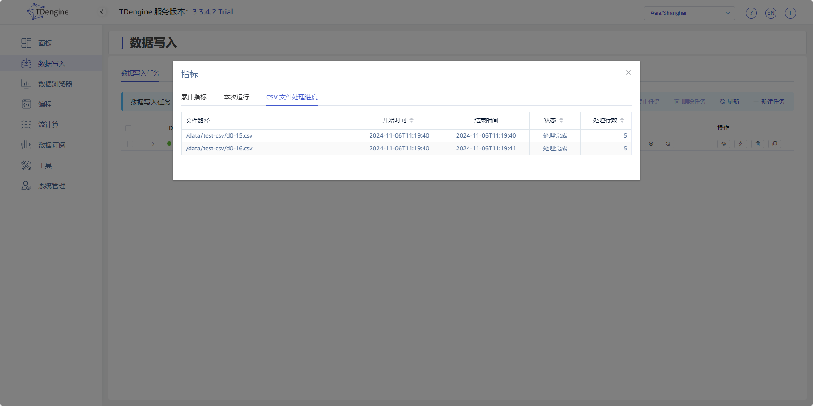