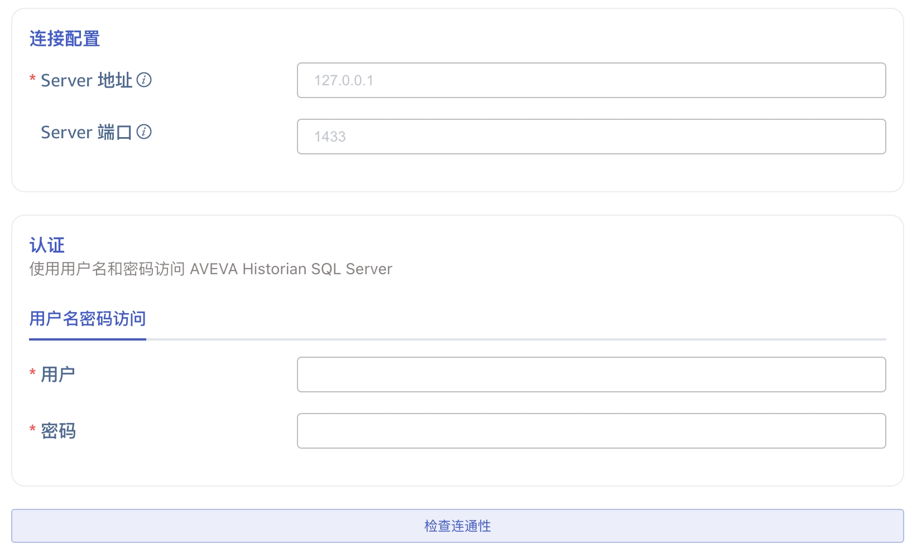

本节讲述如何通过 Explorer 界面创建数据迁移/数据同步任务, 从 AVEVA Historian 迁移/同步数据到当前 TDengine 集群。

## 功能概述

AVEVA Historian 是一款工业大数据分析软件，前身为 Wonderware。可以捕获并存储高保真工业大数据，释放受制约的潜力，从而改善运营。

TDengine 可以高效地从 AVEVA Historian 读取数据并将其写入 TDengine，以实现历史数据迁移或实时数据同步。

## 创建任务

### 1. 新增数据源

在数据写入页面中，点击 **+新增数据源** 按钮，进入新增数据源页面。

### 2. 配置基本信息

在 **名称** 中输入任务名称，如：“test_avevaHistorian”；

在 **类型** 下拉列表中选择 **AVEVA Historian**。

**代理** 是非必填项，如有需要，可以在下拉框中选择指定的代理，也可以先点击右侧的 **+创建新的代理** 按钮 

在 **目标数据库** 下拉列表中选择一个目标数据库，也可以先点击右侧的 **+创建数据库** 按钮

### 3. 配置连接信息

在 **连接配置** 区域填写 **Server 地址** 和 **Server 端口**。

在 **认证** 区域填写 **用户名** 和 **密码**。

点击 **连通性检查** 按钮，检查数据源是否可用。

### 4. 配置采集信息

在 **采集配置** 区域填写采集任务相关的配置参数。

#### 4.1. 迁移数据

如果要进行数据迁移，需要配置以下参数：

在 **采集模式** 下拉列表中选择 **migrate**。

在 **标签** 中，填写要迁移的标签列表，以逗号（,）分隔。

在 **标签组大小** 中，填写标签组的大小。

在 **任务开始时间** 中，填写数据迁移任务的开始时间。

在 **任务结束时间** 中，填写数据迁移任务的结束时间。

在 **查询的时间窗口** 中，填写一个时间间隔，数据迁移任务将按照这个时间间隔划分时间窗口。

#### 4.2. 同步 History 表的数据

如果要同步 **Runtime.dbo.History** 表中的数据到 TDengine，需要配置以下参数：

在 **采集模式** 下拉列表中选择 **synchronize**。

在 **表** 中选择 **Runtime.dbo.History**。

在 **标签** 中，填写要迁移的标签列表，以逗号（,）分隔。

在 **标签组大小** 中，填写标签组的大小。

在 **任务开始时间** 中，填写数据迁移任务的开始时间。

在 **查询的时间窗口** 中，填写一个时间间隔，历史数据部分将按照这个时间间隔划分时间窗口。

在 **实时同步的时间间隔** 中，填写一个时间间隔，实时数据部分将按照这个时间间隔轮询数据。

在 **乱序时间上限** 中，填写一个时间间隔，实时数据同步过程中，超过这个时间才入库的数据可能会丢失。

#### 4.3. 同步 Live 表的数据

如果要同步 **Runtime.dbo.Live** 表中的数据到 TDengine，需要配置以下参数：

在 **采集模式** 下拉列表中选择 **synchronize**。

在 **表** 中选择 **Runtime.dbo.Live**。

在 **标签** 中，填写要迁移的标签列表，以逗号（,）分隔。

在 **实时同步的时间间隔** 中，填写一个时间间隔，实时数据部分将按照这个时间间隔轮询数据。

### 5. 配置数据映射

在 **数据映射** 区域填写数据映射相关的配置参数。

点击 **从服务器检索** 按钮，从 AVEVA Historian 服务器获取示例数据。

在 **从列中提取或拆分** 中填写从消息体中提取或拆分的字段，例如：将 vValue 字段拆分成 `vValue_0` 和 `vValue_1` 这 2 个字段，选择 split 提取器，seperator 填写分割符 `,`, number 填写 2。

在 **过滤** 中，填写过滤条件，例如：填写`Value > 0`，则只有 Value 大于 0 的数据才会被写入 TDengine。

在 **映射** 中，选择要映射到 TDengine 的超级表，以及映射到超级表的列。

点击 **预览**，可以查看映射的结果。

### 6. 配置高级选项

在 **高级选项** 区域填写高级选项相关的配置参数。

在 **最大读取并发数** 中设置最大读取并发数。默认值：0，表示 auto，自动配置并发数。

在 **批次大小** 中设置每次写入的批次大小，即：单次发送的最大消息数量。

在 **保存原始数据** 中选择是否保存原始数据。默认值：否。

当保存原始数据时，以下2个参数配置生效。

在 **最大保留天数** 中设置原始数据的最大保留天数。

在 **原始数据存储目录** 中设置原始数据保存路径。

### 7. 创建完成

点击 **提交** 按钮，完成创建任务。提交任务后，回到**数据写入**页面可以查看任务状态。
