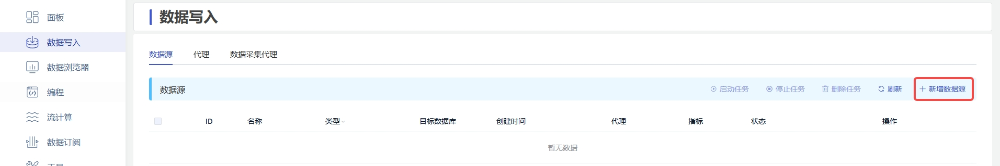
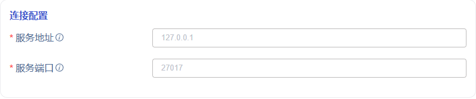
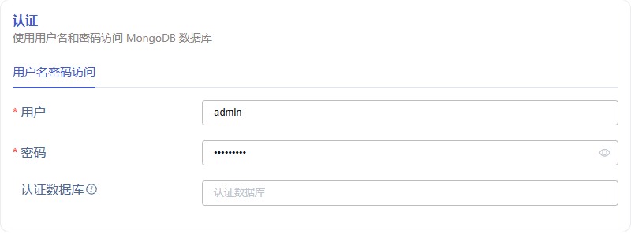
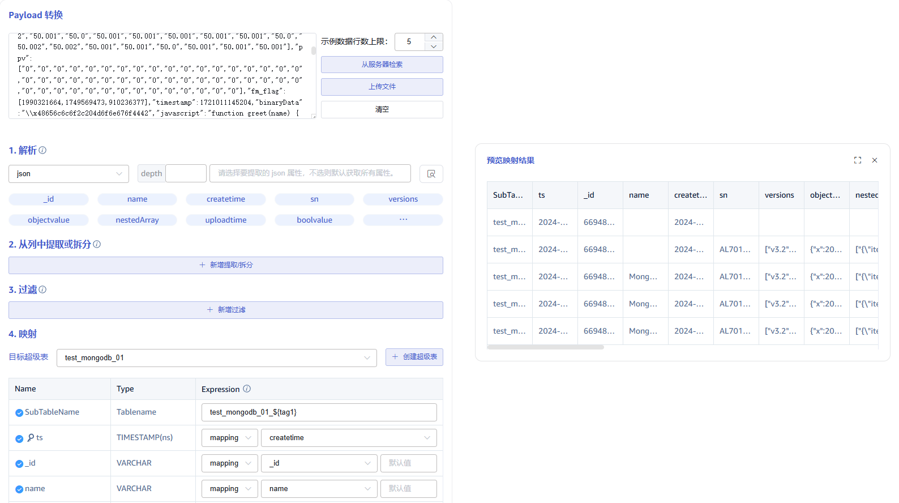

本节讲述如何通过 Explorer 界面创建数据迁移任务，从 MongoDB 迁移数据到当前 TDengine 集群。

## 功能概述

MongoDB 是一个介于关系型数据库与非关系型数据库之间的产品，被广泛应用于内容管理系统、移动应用与物联网等众多领域。从 TDengine 企业版 3.3.3.0 开始，TDengine 可以高效地从 MongoDB 读取数据并将其写入 TDengine，以实现历史数据迁移或实时数据同步，解决业务面临的技术痛点。

## 创建任务

### 1. 新增数据源

在数据写入页面中点击左上角的 **+新增数据源** 按钮进入新增数据源页面，如下图所示：

### 2. 配置基本信息

在 **名称** 字段中输入任务名称，例如 *`test_mongodb_01`* 。

选择 **类型** 下拉框中的 *`MongoDB`* ，如下图所示（选择完成后页面中的字段会发生变化）。

**代理** 是非必填项，如有需要，可以在下拉框中选择指定的代理，也可以先点击右侧的 **+创建新的代理** 按钮创建一个新的代理。

**目标数据库** 是必填项，可以在下拉框中选择指定的数据库，也可以先点击右侧的 **+创建数据库** 按钮创建一个新的数据库。

### 3. 配置连接信息

在 **连接配置** 区域填写 *`源 MongoDB 数据库的连接信息`*，如下图所示：

### 4. 配置认证信息

**用户** 输入源 MongoDB 数据库的用户，该用户必须在 MongoDB 系统中拥有读取权限。

**密码** 输入源 MongoDB 数据库中上方用户的登陆密码。

**认证数据库** MongoDB 中存储用户信息的数据库，默认为 admin。

### 5. 配置连接选项

**应用名称** 设置应用程序名称，用于标识连接的应用程序。

**SSL 证书** 设置是否使用加密连接，默认关闭，如果开启，需要上传以下两个文件：

&emsp; 1. **CA 文件** 上传 SSL 加密的证书授权文件。

&emsp; 2. **证书文件** 上传 SSL 加密的证书文件。

然后点击 **检查连通性** 按钮，用户可以点击此按钮检查上方填写的信息是否可以正常获取源 MongoDB 数据库的数据。

### 6. 配置数据查询

**数据库** MongoDB 中源数据库，可以使用占位符进行动态配置，例如 database_${Y}，可用占位符列表见下方表格。

**集合** MongoDB 中集合，可以使用占位符进行动态配置，例如 collection_${md}，可用占位符列表见下方表格。

|占位符|描述|示例数据|
|-|-|-|
|Y|完整的公历年表示，零填充的 4 位整数|2024|
|y|公历年除以 100，零填充的 2 位整数|24|
|M|整数月份（1 - 12）|1|
|m|整数月份（01 - 12）|01|
|B|月份英文全拼|January|
|b|月份英文的缩写（3 个字母）|Jan|
|D|日期的数字表示（1 - 31）|1|
|d|日期的数字表示（01 - 31）|01|
|J|一年中的第几天（1 - 366）|1|
|j|一年中的第几天（001 - 366）|001|
|F|相当于 ${Y}-${m}-${d}|2024-01-01|

**子表字段** 用于拆分子表的字段，通常与 transform 中的 tag 相对应，多个字段使用英文逗号分隔，例如 col_name1,col_name2。

**查询模板** 用于查询数据的查询语句，JSON格式，语句中必须包含时间范围条件，且开始时间和结束时间必须成对出现。模板中定义的时间范围由源数据库中的某个代表时间的列和下面定义的占位符组成。
> 使用不同的占位符表示不同的时间格式要求，具体有以下占位符格式：
> 1. `${start_datetime}`、`${end_datetime}`：对应后端 datetime 类型字段的筛选，如：`{"ddate":{"$gte":${start_datetime},"$lt":${end_datetime}}}` 将被转换为 `{"ddate":{"$gte":{"$date":"2024-06-01T00:00:00+00:00"},"$lt":{"$date":"2024-07-01T00:00:00+00:00"}}}`
> 2. `${start_timestamp}`、`${end_timestamp}`: 对应后端 timestamp 类型字段的筛选，如：`{"ttime":{"$gte":${start_timestamp},"$lt":${end_timestamp}}}` 将被转换为 `{"ttime":{"$gte":{"$timestamp":{"t":123,"i":456}},"$lt":{"$timestamp":{"t":123,"i":456}}}}`

**查询排序** 执行查询时的排序条件，JSON格式，它必须符合 MongoDB 排序条件的格式规范，使用示例如下：
> 1. `{"createtime":1}`：MongoDB 查询结果按 createtime 正序返回。
> 2. `{"createdate":1, "createtime":1}`：MongoDB 查询结果按 createdate 正序、createtime 正序返回。

**起始时间** 迁移数据的起始时间，此项为必填字段。

**结束时间** 迁移数据的结束时间，可留空。如果设置，则迁移任务执行到结束时间后，任务完成自动停止；如果留空，则持续同步实时数据，任务不会自动停止。

**查询间隔** 分段查询数据的时间间隔，默认1天。为了避免查询数据量过大，一次数据同步子任务会使用查询间隔分时间段查询数据。

**延迟时长** 实时同步数据场景中，为了避免延迟写入的数据丢失，每次同步任务会读取延迟时长之前的数据。

 

### 7. 配置数据映射

在 **Payload 转换** 区域填写数据映射相关的配置参数。

点击 **从服务器检索** 按钮，从 MongoDB 服务器获取示例数据。

在 **解析** 中选择 JSON/Regex/UDT 三种规则解析原始消息体，配置完成后点击右侧的 **预览** 按钮可以查看解析的结果。

在 **从列中提取或拆分** 中填写从消息体中提取或拆分的字段，例如：将 vValue 字段拆分成 `vValue_0` 和 `vValue_1` 这 2 个字段，选择 split 提取器，seperator 填写分割符 `,`, number 填写 2，配置完成后点击右侧的 **预览** 按钮可以查看转换的结果。

在 **过滤** 中，填写过滤条件，例如：填写`Value > 0`，则只有 Value 大于 0 的数据才会被写入 TDengine，配置完成后点击右侧的 **预览** 按钮可以查看过滤的结果。

在 **映射** 中，选择要映射到 TDengine 的超级表，以及映射到超级表的列，配置完成后点击右侧的 **预览** 按钮可以查看映射的结果。

### 8. 配置高级选项

**高级选项** 区域是默认折叠的，点击右侧 `>` 可以展开，如下图所示：

**最大读取并发数** 数据源连接数或读取线程数限制，当默认参数不满足需要或需要调整资源使用量时修改此参数。

**批次大小** 单次发送的最大消息数或行数。默认是 10000。

### 9. 创建完成

点击 **提交** 按钮，完成创建 MongoDB 到 TDengine 的数据同步任务，回到**数据源列表**页面可查看任务执行情况。
