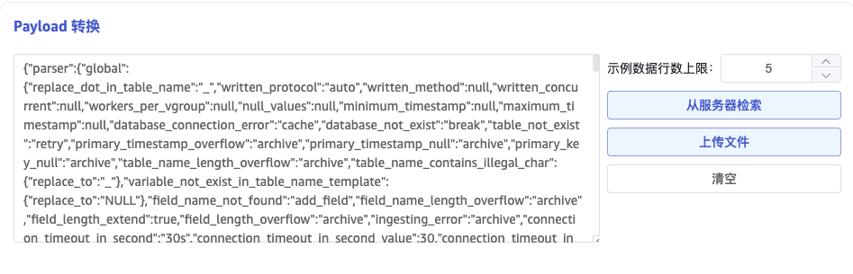

本节讲述如何通过 Explorer 界面创建数据迁移任务，从 SparkplugB 迁移数据到当前 TDengine 集群。

## 功能概述

SparkplugB 是一种开放消息规范，专为工业物联网 (IIoT) 应用设计，基于 MQTT 协议。

TDengine 可以通过 SparkplugB 连接器从 MQTT 代理订阅数据并将其写入 TDengine，以实现实时数据流入库。

## 创建任务

### 1. 新增数据源

在数据写入页面中，点击 **+新增数据源** 按钮，进入新增数据源页面。


### 2. 配置基本信息

在 **名称** 中输入任务名称，如：“test_spb”；

在 **类型** 下拉列表中选择 **SparkplugB**。

**代理** 是非必填项，如有需要，可以在下拉框中选择指定的代理，也可以先点击右侧的 **+创建新的代理** 按钮

在 **目标数据库** 下拉列表中选择一个目标数据库，也可以先点击右侧的 **+创建数据库** 按钮


### 3. 配置连接和认证信息

在 **Brokers** 中填写 MQTT 代理的地址，例如：`localhost:1883`, 可以填写多个，用 ',' 分隔，用于连接多个 broker。

在 **MQTT 协议** 中选择使用的 MQTT 协议版本，默认 5.0 版本。

在 **客户端 ID** 中填写连接到每个 broker 所使用的客户端标识符。

在 **Keep Alive** 中输入保持活动间隔。如果代理在保持活动间隔内没有收到来自客户端的任何消息，它将假定客户端已断开连接，并关闭连接。
保持活动间隔是指客户端和代理之间协商的时间间隔，用于检测客户端是否活动。如果客户端在保持活动间隔内没有向代理发送消息，则代理将断开连接。

在 **用户** 中填写 MQTT 代理的用户名。

在 **密码** 中填写 MQTT 代理的密码。

在 **TLS 校验** 中选择 TLS 证书的校验方式

1. 不开启：表示不进行 TLS 证书认证。在连接 MQTT 时，会先进行 TCP 连接，如果连接失败，会进行无证书认证模式的 TLS 连接。

2. 单向认证：开启 TLS 连接，并验证服务端证书，此时需要上传 CA 证书。

3. 双向认证：开启 TLS 连接，并与服务端进行双向认证，此时需要上传 CA 证书，客户端证书以及客户端密钥。

点击 **检查连通性** 按钮，检查数据源是否可用。


## 4. 订阅配置

在 **Group ID** 中填写 SparkplugB 规定的 group id 字段，通常一个 group id 代表一个集团/公司/工厂/流水线 等概念。

在 **节点/设备列表** 中填写需要订阅的节点和设备的列表，以逗号分隔，其中节点直接填写 ID 即可，设备需要按照 节点 ID/设备 ID 格式填写。

在 **消息类型** 中填写需要订阅的 SparkplugB 消息类型，以逗号分隔，有 NBIRTH/NDEATH/NDATA/NCMD/DBIRTH/DDEATH/DDATA/DCMD/STATE。在订阅时，NBIRTH/NDEATH/NDATA/NCMD 类型的消息只会匹配 "节点/设备列表" 中的节点，而 DBIRTH/DDEATH/DDATA/DCMD 只会匹配 "节点/设备列表" 中的设备。

当 **下发 REBIRTH 命令** 开启后，taosX 会自动下发 NCMD 中的 "Node Control/Rebirth" 命令，获取节点和设备的所有 metric 信息，从而可以获取 metric name 和 metric alias 的对应关系。如果节点/设备在上报数据时不使用 alias 别名机制，可以不开启此选项。


### 5. 配置 Payload 转换

在 **Payload 解析** 区域填写 Payload 解析相关的配置参数。

#### 5.1 解析

有三种获取示例数据的方法：

点击 **从服务器检索** 按钮，从 MQTT 获取示例数据。

点击 **文件上传** 按钮，上传 CSV 文件，获取示例数据。

在 **消息体** 中填写 MQTT 消息体中的示例数据，由于 SparkplugB 消息使用 protobuf 进行编码，因此从服务器检索的数据是经过编码为 json 格式的数据。

json 数据支持 JSONObject 或者 JSONArray，可以用于解析 SparkplugB 中的 metadata 和 properties 等 json 格式的字段。



点击 **放大镜图标**  可查看预览解析结果。


#### 5.2 字段拆分

在 **从列中提取或拆分** 中填写从消息体中提取或拆分的字段，例如：将 `datatype_str` 字段的值转换为 TDengine 类型，在 **rule** 输入框中填写如下 json 值，在 **name** 中填写 `td_datatype`

```json
{
    "Int8": "TINYINT",
    "UInt8": "TINYINT UNSIGNED",
    "Int16": "SMALLINT",
    "UInt16": "SMALLINT UNSIGNED",
    "Int32": "INT",
    "UInt32": "INT UNSIGNED",
    "Int64": "BIGINT",
    "UInt64": "BIGINT UNSIGNED",
    "Float": "FLOAT",
    "DOUBLE": "DOUBLE",
    "Boolean": "BOOL",
    "String": "VARCHAR(128)",
    "DateTime": "TIMESTAMP"
}
```

会将 `datatype_str` 列的字段的值如 "Int8" 转换为对应的 "TINYINT"，新的列命名为 `td_datatype`


点击 **删除**，可以删除当前提取规则。

点击 **新增**，可以添加更多提取规则。

点击 **放大镜图标** 可查看预览提取/拆分结果。


#### 5.3 数据过滤

在 **过滤** 中，填写过滤条件，例如：填写`datatype_str != "Int8"`，则只有 datatype_str 不为 `Int8` 的数据才会被写入 TDengine。


点击 **删除**，可以删除当前过滤规则。

点击 **放大镜图标** 可查看预览过滤结果。


#### 5.4 表映射

在 **目标超级表** 的下拉列表中选择一个目标超级表，也可以先点击右侧的 **创建超级表** 按钮创建新的超级表。

当超级表需要根据消息动态生成时，可以选择 **创建模板**。其中，超级表名称，列名，列类型等均可以使用模板变量，当接收到数据后，程序会自动计算模板变量并生成对应的超级表模板，当数据库中超级表不存在时，会使用此模板创建超级表；对于已创建的超级表，如果缺少通过模板变量计算得到的列，也会自动创建对应列。


在 **映射** 中，填写目标超级表中的子表名称，例如：`t_{id}`。根据需求填写映射规则，其中 mapping 支持设置缺省值。


点击 **预览**，可以查看映射的结果。


### 6. 高级选项

在 **处理批次上限** 中填写可以同时进行数据处理流程的批次数量，当到达此上限后，不再从消息缓存队列中获取消息，会导致缓存队列的消息积压，最小值为 1。

在 **批次大小** 中填写每次发送给数据处理流程的消息数量，和 **批次延时** 配合使用，当读取的 MQTT 消息数量达到批次大小时，就算 **批次延时** 没有到达也立即向数据处理流程发送数据，最小值为 1。

在 **批次延时** 中填写每次生成批次消息的超时时间（单位：毫秒），从每批次接收到的第一个消息开始算起，和 **批次大小** 配合使用，当读取消息到达超时时间时，就算 **批次大小** 不满足数量也立即向数据处理流程发送数据，最小值为 1。


### 7. 异常处理策略

import Contributing from './_03-exception-handling-strategy.mdx'

<Contributing />

### 8. 创建完成

点击 **提交** 按钮，完成创建 MQTT 到 TDengine 的数据同步任务，回到**数据源列表**页面可查看任务执行情况。
