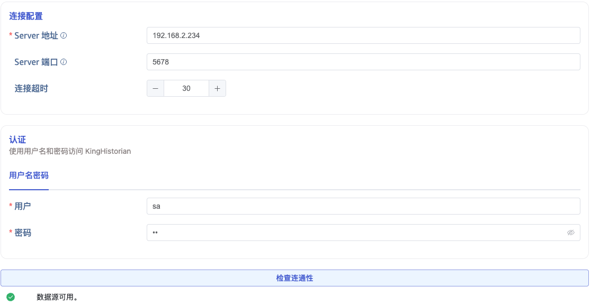
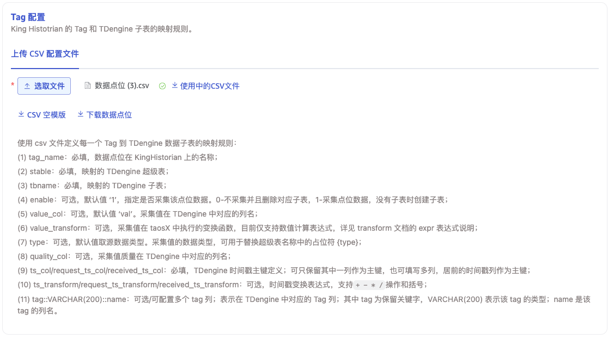
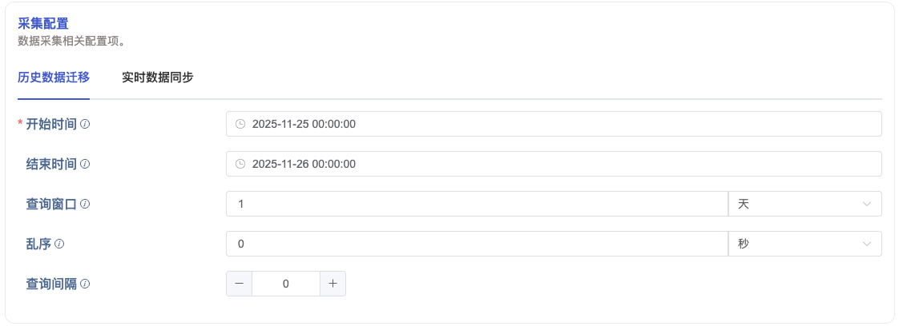

本节讲述如何通过 Explorer 界面创建数据迁移/数据同步任务，从 KingHistorian 迁移/同步数据到当前 TDengine TSDB 集群。

## 功能概述

TDengine TSDB 可以高效地从 KingHistorian 读取数据并将其写入 TDengine TSDB，以实现历史数据迁移或实时数据同步。

## 创建任务

### 1. 新增数据源

在数据写入页面中，点击 **+新增数据源** 按钮，进入新增数据源页面。

### 2. 配置基本信息

在 **名称** 中输入任务名称，如：“test_kinghistorian”；

在 **类型** 下拉列表中选择 **KingHistorian**。

**代理** 是非必填项，如果需要，可以在下拉框中选择指定的代理，也可以先点击右侧的 **+创建新的代理** 按钮

在 **目标数据库** 下拉列表中选择一个目标数据库，也可以先点击右侧的 **+创建数据库** 按钮。

### 3. 配置连接信息

在 **连接配置** 区域填写 **Server 地址** 和 **Server 端口**。

在 **认证** 区域填写 **用户名** 和 **密码**。

点击 **连通性检查** 按钮，检查数据源是否可用。

### 4. 配置 Tag

在 **上传 CSV 配置文件**中，点击 **下载数据点位**，选择需要 **测点组**、**测点**、**标签**，这会生成一个 CSV 配置文件并下载到本地。
按照需求，修改生成的 CSV 配置文件，并重新上传。

### 5. 配置采集信息

在 **采集配置** 区域填写采集任务相关的配置参数。

#### 5.1. 历史数据迁移

如果要进行历史数据迁移，需要配置以下参数：

在 **任务开始时间** 中，填写数据迁移任务的开始时间。

在 **任务结束时间** 中，填写数据迁移任务的结束时间。

在 **查询窗口** 中，填写一个时间间隔，数据迁移任务将按照这个时间间隔划分时间窗口。

在 **乱序** 中，填写一个时间间隔，每个查询窗口都会回溯这个时间间隔。

在 **查询间隔** 中，填写一个时间间隔，每个查询窗口之间会等待这个时间间隔。

#### 5.2. 实时数据同步

如果要进行实时数据同步，需要配置以下参数：

在 **最小间隔时间**中，填写一个时间间隔，订阅的最小间隔时间。

### 6. 配置高级选项

在 **高级选项** 区域根据需要配置其他相关参数。

### 7. 创建完成

点击 **提交** 按钮，完成创建任务。提交任务后，回到**数据写入**页面可以查看任务状态。
