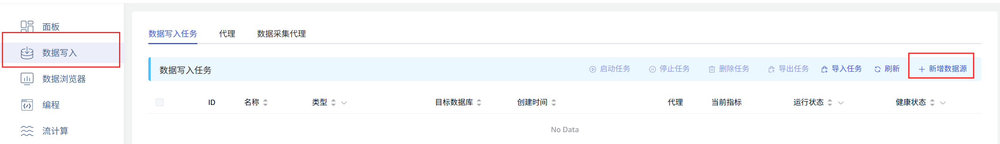
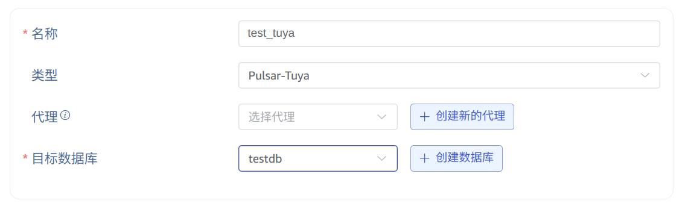
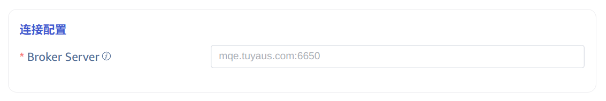
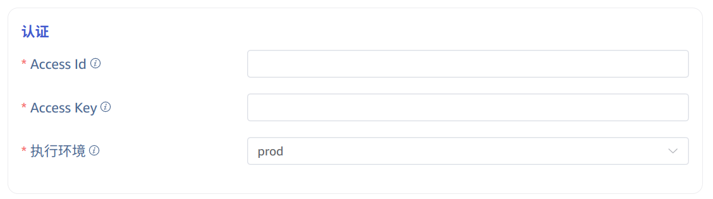
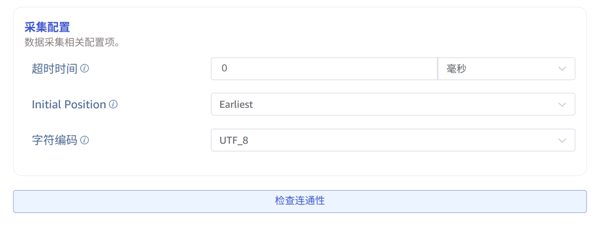

本节讲述如何通过 Explorer 界面创建数据迁移任务，从 Pulsar-Tuya 集群迁移数据到当前 TDengine TSDB 集群。

## 功能概述

Apache Pulsar 是一个云原生的开源分布式消息与流处理平台。Pulsar-Tuya 是涂鸦基于开源的 Pulsar 系统进行了定制的集群。

TDengine TSDB 可以高效地从 Pulsar-Tuya 读取数据并将其写入 TDengine TSDB，以实现历史数据迁移或实时数据流入库。

## 创建任务

### 1. 新增数据源

在数据写入页面中，点击 **+新增数据源** 按钮，进入新增数据源页面。



### 2. 配置基本信息

在 **名称** 中输入任务名称，如：“test_tuya”；

在 **类型** 下拉列表中选择 **Pulsar-Tuya**。

**代理** 是非必填项，如有需要，可以在下拉框中选择指定的代理，也可以先点击右侧的 **+创建新的代理**

在 **目标数据库** 下拉列表中选择一个目标数据库，也可以先点击右侧的 **+创建数据库** 按钮



### 3. 配置连接信息

**Broker Server**，例如：`mqe.tuyaus.com:6650`。

只需要填写一个有效的 broker server 地址。



### 4. 认证机制

此处需要涂鸦平台专有的认证信息，填写平台提供的 Access Id 和 Access Key，并选择对应的执行环境。



### 5. 配置采集信息

在 **采集配置** 区域填写采集任务相关的配置参数。Pulsar 需要的主题，消费者名称，订阅名称会自动根据涂鸦平台提供的 Access Id 和 Access Key 自动产生，只需要配置以下信息即可。

在 **超时时间** 中填写超时时间。当从 Pulsar 消费不到任何数据，超过 timeout 后，数据采集任务会退出。默认值是 0 ms。当 timeout 设置为 0 时，会一直等待，直到有数据可用，或者发生错误。

在 **Initial Position** 的下拉列表中选择从哪个位置开始消费数据。有两个选项：`Earliest`、`Latest`。默认值为 Earliest。

- Earliest：用于请求最早的位置。
- Latest：用于请求最晚的位置。

在 **字符编码** 中，配置消息体编码格式，taosX 在接收到消息后，使用对应的编码格式对消息体进行解码获取原始数据。可选项 UTF_8, GBK, GB18030, BIG5，默认为 UTF_8

点击 **连通性检查** 按钮，检查数据源是否可用。



### 6. 配置 Payload 解析

在 **Payload 解析** 区域填写 Payload 解析相关的配置参数。

#### 6.1 解析

有三种获取示例数据的方法：

点击 **从服务器检索** 按钮，从 Pulsar-Tuya 获取示例数据。

点击 **文件上传** 按钮，上传 CSV 文件，获取示例数据。

在 **消息体** 中填写 Pulsar-Tuya 消息体中的示例数据。

json 数据支持 JSONObject 或者 JSONArray，使用 json 解析器可以解析一下数据：

``` json
{"id": 1, "message": "hello-world"}
{"id": 2, "message": "hello-world"}
```

或者

``` json
[{"id": 1, "message": "hello-world"},{"id": 2, "message": "hello-world"}]
```

解析结果如下所示：


点击 **放大镜图标**  可查看预览解析结果。


#### 6.2 字段拆分

在 **从列中提取或拆分** 中填写从消息体中提取或拆分的字段，例如：将 message 字段拆分成 `message_0` 和 `message_1` 这 2 个字段，选择 split 提取器，separator 填写 -, number 填写 2。

点击 **新增**，可以添加更多提取规则。

点击 **删除**，可以删除当前提取规则。


点击 **放大镜图标** 可查看预览提取/拆分结果。


#### 6.3 数据过滤

在 **过滤** 中，填写过滤条件，例如：填写 `id != 1`，则只有 id 不为 1 的数据才会被写入 TDengine TSDB。

点击 **新增**，可以添加更多过滤规则。

点击 **删除**，可以删除当前过滤规则。


点击 **放大镜图标** 可查看预览过滤结果。


#### 6.4 表映射

在 **目标超级表** 的下拉列表中选择一个目标超级表，也可以先点击右侧的 **创建超级表** 按钮

在 **映射** 中，填写目标超级表中的子表名称，例如：`t_{id}`。根据需求填写映射规则，其中 mapping 支持设置缺省值。


点击 **预览**，可以查看映射的结果。


### 7. 配置高级选项

import AdvancedOptions from './_02-advanced_options.mdx'

<AdvancedOptions/>

### 8. 异常处理策略

import Contributing from './_03-exception-handling-strategy.mdx'

<Contributing />

### 9. 创建完成

点击 **提交** 按钮，完成创建 Pulsar-Tuya 到 TDengine TSDB 的数据同步任务，回到**数据源列表**页面可查看任务执行情况。
