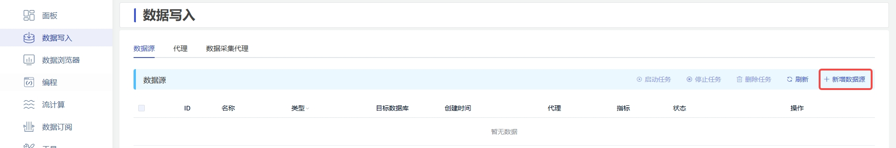
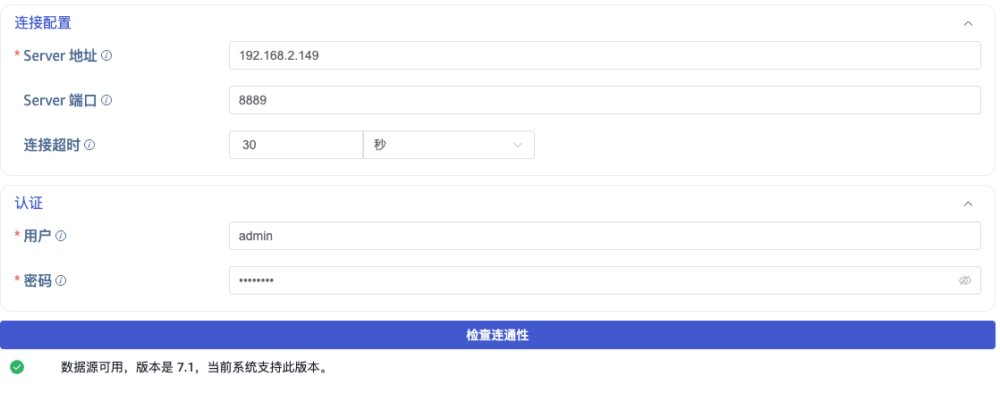
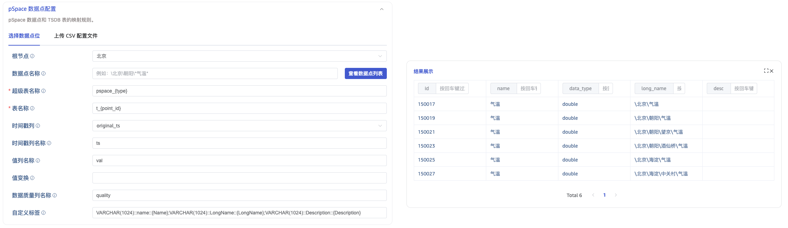
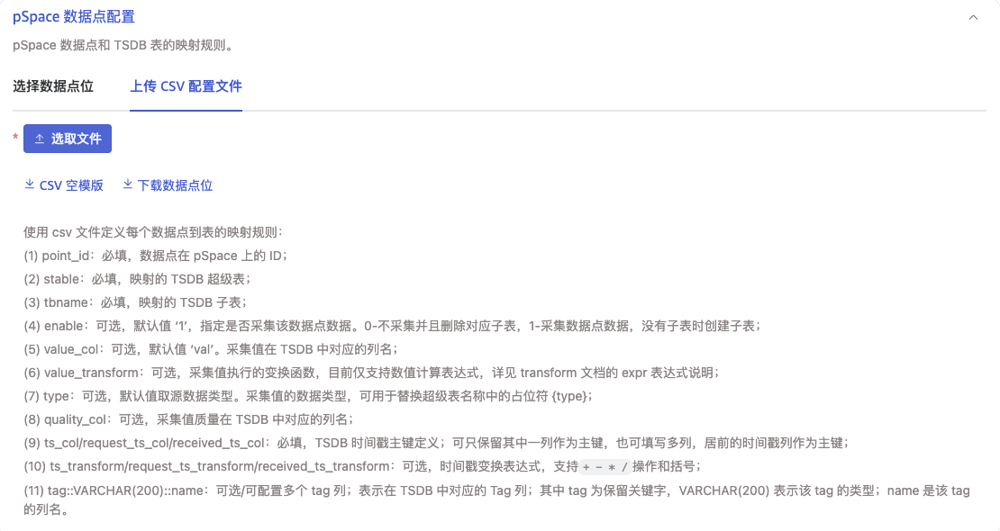

本节讲述如何通过 Explorer 界面创建数据迁移/数据同步任务，从 pSpace 迁移/同步数据到当前 TDengine TSDB 集群。

## 功能概述

TDengine TSDB 可以高效地从 pSpace 读取数据并将其写入 TDengine TSDB，以实现历史数据迁移或实时数据同步。

## 创建任务

### 1. 新增数据源

在数据写入页面中，点击 **+新增数据源** 按钮，进入新增数据源页面。

### 2. 配置基本信息

在 **名称** 中输入任务名称，如：“test_pspace”。

在 **类型** 下拉列表中选择 **pSpace**。

**代理** 是非必填项，如果需要，可以在下拉框中选择指定的代理，也可以先点击右侧的 **+创建新的代理** 按钮。

在 **目标数据库** 下拉列表中选择一个目标数据库，也可以先点击右侧的 **+创建数据库** 按钮。

### 3. 配置连接和认证信息

在 **连接配置** 区域填写 **Server 地址** 和 **Server 端口**。

在 **认证** 区域填写 **用户名** 和 **密码**。

点击 **连通性检查** 按钮，检查数据源是否可用。

### 4. 配置数据点

#### 4.1. 选择数据点位

在 **数据点位** 中，用户需要填写以下配置项：

1. **根节点（root）**：开始遍历的根节点，填写根节点的 LongName。例如：`\北京\朝阳\望京`，表示从 `\北京\朝阳\望京` 节点开始，向下遍历。默认从根节点开始遍历。
2. **数据点名称（point_name_pattern）**：支持根据数据点的 LongName 过滤。例如：`\北京\朝阳\望京\气温-*`，表示 `\北京\朝阳\望京` 下所有以“气温-”开头的数据点。
3. **超级表名称（super_table_expression）**：指定点位写入的超级表名称，支持 `{type}` 占位符。例如：`pspace_{type}`。
4. **表名称（child_table_expression）**：指定点位写入的子表名称，支持 `{point_id}` 占位符。例如：`t_{point_id}`。
5. **时间戳列（table_primary_key）**：选择目标表主时间戳来源，可选 `original_ts`、`request_ts`、`received_ts`。
6. **时间戳列名称（table_primary_key_alias）**：指定目标表时间戳列名称，默认 `ts`。
7. **值列名称（value_col）**：指定目标表中采集值的列名，默认 `val`。
8. **值变换（value_transform）**：对写入值执行表达式变换。例如：`(val-32)/1.8`。
9. **数据质量列名称（quality_col）**：指定目标表中数据质量列名称，默认 `quality`。
10. **自定义标签（custom_tags）**：配置写入子表的标签映射，支持静态值和点位属性动态提取（如 `{LongName}`）。

配置 **根节点** 和 **数据点名称** 后，可以点击 **查看数据点列表** 按钮，查看符合条件的点位，再继续配置其余映射规则。

#### 4.2. 上传 CSV 配置文件

在 **上传 CSV 配置文件**中，点击 **下载数据点位**，选择需要的 **根节点**、**数据点名称**，这会生成一个 CSV 配置文件并下载到本地。修改生成的 CSV 配置文件，并重新上传。

### 5. 配置采集

在 **采集配置** 区域填写采集任务相关的配置参数。

pSpace 支持三种采集模式：历史查询、实时订阅、查询同步。

- 历史查询：按时间范围批量查询历史数据，查询完成后任务结束。
- 实时订阅：订阅数据点的实时变化，持续运行直到取消。
- 查询同步：先完成历史数据的迁移，再以固定间隔轮询新数据，持续运行。

#### 5.1. 历史查询

选择 **历史查询** 模式，需要配置：开始时间、结束时间、查询窗口。

#### 5.2. 实时订阅

选择 **实时订阅** 模式，没有额外配置项。

#### 5.3. 查询同步

选择 **查询同步** 模式，需要配置：开始时间、查询窗口、乱序、查询间隔。

### 6. 配置高级选项

在 **高级选项** 区域根据需要配置其他相关参数。

### 7. 创建完成

点击 **提交** 按钮，完成创建任务。提交任务后，回到**数据写入**页面可以查看任务状态。
