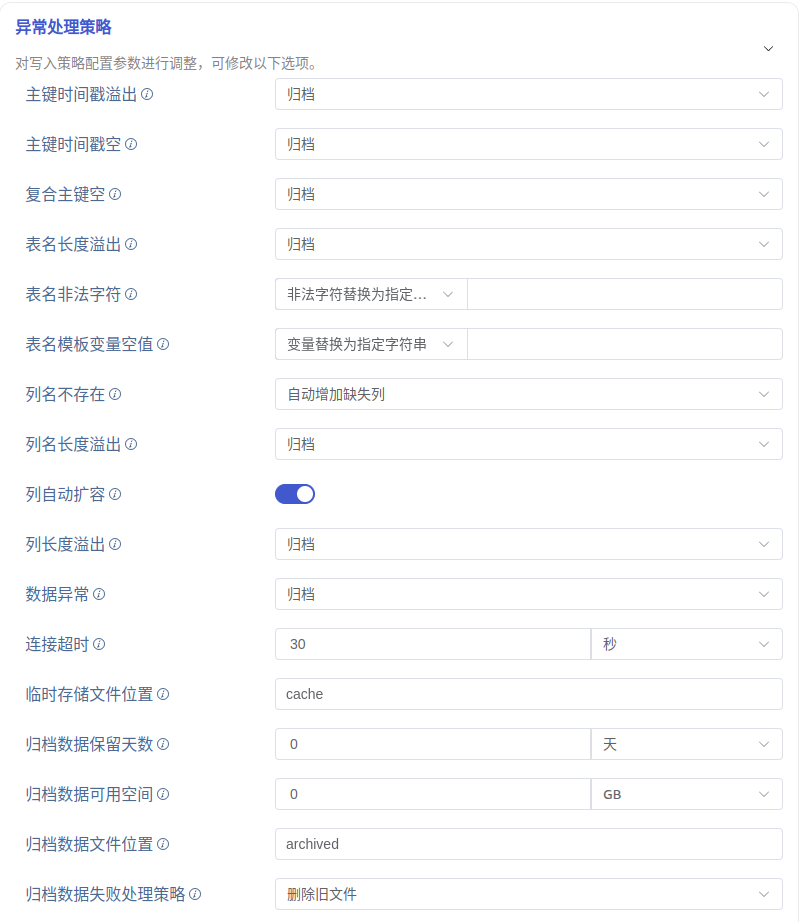

异常处理策略区域是对数据异常时的处理策略进行配置，默认折叠的，点击右侧 `>` 可以展开，如下图所示：

各异常项说明及相应可选处理策略如下：

> 通用处理策略说明：  
> 归档：将异常数据写入归档文件（默认路径为 `${data_dir}/tasks/_id/.datetime`），不写入目标库  
> 丢弃：将异常数据忽略，不写入目标库  
> 报错：任务报错

- **目标库连接超时** 目标库连接失败，可选处理策略：归档、丢弃、报错、缓存
  > 缓存：当目标库状态异常（连接错误或资源不足等情况）时写入缓存文件（默认路径为 `${data_dir}/tasks/_id/.datetime`），目标库恢复正常后重新入库
- **目标库不存在** 写入报错目标库不存在，可选处理策略：归档、丢弃、报错
- **表不存在** 写入报错表不存在，可选处理策略：归档、丢弃、报错、自动建表
  > 自动建表：自动建表，建表成功后重试
- **主键时间戳溢出** 检查数据中第一列时间戳是否在正确的时间范围内（now - keep1, now + 100y），可选处理策略：归档、丢弃、报错
- **主键时间戳空** 检查数据中第一列时间戳是否为空，可选处理策略：归档、丢弃、报错、使用当前时间
  > 使用当前时间：使用当前时间填充到空的时间戳字段中
- **复合主键空** 写入报错复合主键空，可选处理策略：归档、丢弃、报错
- **表名长度溢出** 检查子表表名的长度是否超出限制（最大 192 字符），可选处理策略：归档、丢弃、报错、截断、截断且归档
  > 截断：截取原始表名的前 192 个字符作为新的表名  
  > 截断且归档：截取原始表名的前 192 个字符作为新的表名，并且将此行记录写入归档文件
- **表名非法字符** 检查子表表名中是否包含特殊字符（符号 `.` 等），可选处理策略：归档、丢弃、报错、非法字符替换为指定字符串
  > 非法字符替换为指定字符串：将原始表名中的特殊字符替换为后方输入框中的指定字符串，例如 `a.b` 替换为 `a_b`
- **表名模板变量空值** 检查子表表名模板中的变量是否为空，可选处理策略：丢弃、留空、变量替换为指定字符串
  > 留空：变量位置不做任何特殊处理，例如 `a_{x}` 转换为 `a_`
  > 变量替换为指定字符串：变量位置使用后方输入框中的指定字符串，例如 `a_{x}` 转换为 `a_b`
- **列名不存在** 写入报错列名不存在，可选处理策略：归档、丢弃、报错、自动增加缺失列
  > 自动增加缺失列：根据数据信息，自动修改表结构增加列，修改成功后重试
- **列名长度溢出** 检查列名的长度是否超出限制（最大 64 字符），可选处理策略：归档、丢弃、报错
- **列自动扩容** 开关选项，打开时，列数据长度超长时将自动修改表结构并重试
- **列长度溢出** 写入报错列长度溢出，可选处理策略：归档、丢弃、报错、截断、截断且归档
  > 截断：截取数据中符合长度限制的前 n 个字符  
  > 截断且归档：截取数据中符合长度限制的前 n 个字符，并且将此行记录写入归档文件
- **数据异常** 其他数据异常（未在上方列出的其他异常）的处理策略，可选处理策略：归档、丢弃、报错
- **连接超时** 配置目标库连接超时时间，单位“秒”取值范围 1~600
- **临时存储文件位置** 配置缓存文件的位置，实际生效位置 `$DATA_DIR/tasks/:id/{location}`
- **归档数据保留天数** 非负整数，0 表示无限制
- **归档数据可用空间** 0~65535，其中 0 表示无限制
- **归档数据文件位置** 配置归档文件的位置，实际生效位置 `$DATA_DIR/tasks/:id/{location}`
- **归档数据失败处理策略** 当写入归档文件报错时的处理策略，可选处理策略：删除旧文件、丢弃、报错并停止任务
  > 删除旧文件：删除旧文件，如果删除旧文件后仍然无法写入，则报错并停止任务
  > 丢弃：丢弃即将归档的数据
  > 报错并停止任务：报错并停止当前任务
