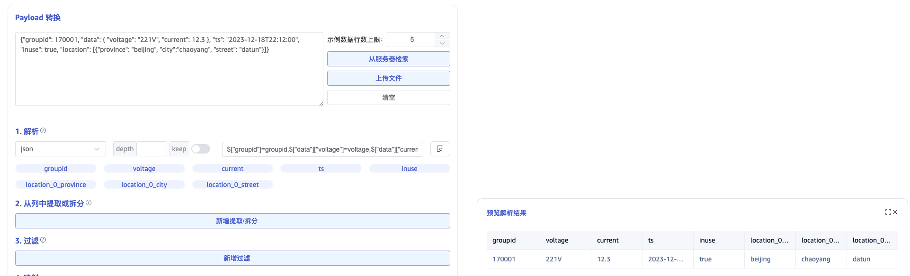

## 概述

TDengine Enterprise 配备了一个强大的可视化数据管理工具—taosExplorer。借助 taosExplorer，用户只须在浏览器中简单配置，就能轻松地向 TDengine 提交任务，实现以零代码方式将来自不同数据源的数据无缝导入 TDengine。在导入过程中，TDengine 会对数据进行自动提取、过滤和转换，以保证导入的数据质量。通过这种零代码数据源接入方式，TDengine 成功转型为一个卓越的时序大数据汇聚平台。用户无须部署额外的 ETL 工具，从而大大简化整体架构的设计，提高了数据处理效率。

下图展示了零代码接入平台的系统架构。


## 支持的数据源

目前 TDengine 支持的数据源如下表：

| 数据源 | 支持版本 | 描述 |
| --- | --- | --- |
| Aveva PI System | PI AF Server Version 2.10.9.593 或以上 | 工业数据管理和分析平台，前身为 OSIsoft PI System，它能够实时采集、整合、分析和可视化工业数据，助力企业实现智能化决策和精细化管理 |
| Aveva Historian | AVEVA Historian 2020 RS SP1 | 工业大数据分析软件，前身为 Wonderware Historian，专为工业环境设计，用于存储、管理和分析来自各种工业设备、传感器的实时和历史数据 |
| OPC DA |  Matrikon OPC version: 1.7.2.7433  | OPC 是 Open Platform Communications 的缩写，是一种开放式、标准化的通信协议，用于不同厂商的自动化设备之间进行数据交换。它最初由微软公司开发，旨在解决工业控制领域中不同设备之间互操作性差的问题；OPC 协议最初于 1996 年发布，当时称为 OPC DA （Data Access），主要用于实时数据采集和控制。 |
| OPC UA |  KeepWare KEPServerEx 6.5 | 2006 年，OPC 基金会发布了 OPC UA （Unified Architecture） 标准，它是一种基于服务的面向对象的协议，具有更高的灵活性和可扩展性，已成为 OPC 协议的主流版本 |
| MQTT | emqx: 3.0.0 到 5.7.1<br/> hivemq: 4.0.0 到 4.31.0<br/> mosquitto: 1.4.4 到 2.0.18 | Message Queuing Telemetry Transport 的缩写，一种基于发布/订阅模式的轻量级通讯协议，专为低开销、低带宽占用的即时通讯设计，广泛适用于物联网、小型设备、移动应用等领域。 |
| Kafka | 2.11 ~ 3.8.0  | 由 Apache 软件基金会开发的一个开源流处理平台，主要用于处理实时数据，并提供一个统一、高通量、低延迟的消息系统。它具备高速度、可伸缩性、持久性和分布式设计等特点，使得它能够在每秒处理数十万次的读写操作，支持上千个客户端，同时保持数据的可靠性和可用性。 |
| InfluxDB | 1.7、1.8、2.0-2.7 | InfluxDB 是一种流行的开源时间序列数据库，它针对处理大量时间序列数据进行了优化。|
| OpenTSDB | 2.4.1 | 基于 HBase 的分布式、可伸缩的时序数据库。它主要用于存储、索引和提供从大规模集群（包括网络设备、操作系统、应用程序等）中收集的指标数据，使这些数据更易于访问和图形化展示。 |
| MySQL | 5.6,5.7,8.0+ | MySQL是最流行的关系型数据库管理系统之一，由于其体积小、速度快、总体拥有成本低，尤其是开放源码这一特点，一般中小型和大型网站的开发都选择 MySQL 作为网站数据库。 |
| Oracle | 11G/12c/19c | Oracle 数据库系统是世界上流行的关系数据库管理系统，系统可移植性好、使用方便、功能强，适用于各类大、中、小微机环境。它是一种高效率的、可靠性好的、适应高吞吐量的数据库方案。 |
| PostgreSQL | v15.0+  | PostgreSQL 是一个功能非常强大的、源代码开放的客户/服务器关系型数据库管理系统， 有很多在大型商业RDBMS中所具有的特性，包括事务、子选择、触发器、视图、外键引用完整性和复杂锁定功能。|
| SQL Server | 2012/2022 | Microsoft SQL Server 是一种关系型数据库管理系统，由 Microsoft 公司开发，具有使用方便可伸缩性好与相关软件集成程度高等优点。 |
| MongoDB | 3.6+ | MongoDB 是一个介于关系型数据库与非关系型数据库之间的产品，被广泛应用于内容管理系统、移动应用与物联网等众多领域。 |
| CSV | -  | Comma Separated Values 的缩写，是一种以逗号分隔的纯文本文件格式，通常用于电子表格或数据库软件。 |
| TDengine 2.x | 2.4 或 2.6+ | TDengine 旧版本，已不再维护，推荐升级到 3.0 最新版本。 |
| TDengine 3.x | 源端版本+ | 使用 TMQ 进行 TDengine 指定从数据库或超级表的订阅。 |

## 数据提取、过滤和转换

因为数据源可以有多个，每个数据源的物理单位可能不一样，命名规则也不一样，时区也可能不同。为解决这个问题，TDengine 内置 ETL 功能，可以从数据源的数据包中解析、提取需要的数据，并进行过滤和转换，以保证写入数据的质量，提供统一的命名空间。具体的功能如下：

1. 解析：使用 JSON Path 或正则表达式，从原始消息中解析字段
2. 从列中提取或拆分：使用 split 或正则表达式，从一个原始字段中提取多个字段
3. 过滤：只有表达式的值为 true 时，消息才会被写入 TDengine
4. 转换：建立解析后的字段和 TDengine 超级表字段之间的转换与映射关系。

下面详细讲解数据转换规则

### 解析

仅非结构化的数据源需要这个步骤，目前 MQTT 和 Kafka 数据源会使用这个步骤提供的规则来解析非结构化数据，以初步获取结构化数据，即可以以字段描述的行列数据。在 explorer 中您需要提供示例数据和解析规则，来预览解析出以表格呈现的结构化数据。

#### 示例数据


如图，textarea 输入框中就是示例数据，可以通过三种方式来获取示例数据：

1. 直接在 textarea 中输入示例数据；
2. 点击右侧按钮 “从服务器检索” 则从配置的服务器获取示例数据，并追加到示例数据 textarea 中；
3. 上传文件，将文件内容追加到示例数据 textarea 中。

每一条示例数据以回车符结尾。

#### 解析<a name="parse"></a>

解析就是通过解析规则，将非结构化字符串解析为结构化数据。消息体的解析规则目前支持 JSON、Regex 和 UDT。

##### JSON 解析

JSON 解析支持 JSONObject 或者 JSONArray。 如下 JSON 示例数据，可自动解析出字段：`groupid`、`voltage`、`current`、`ts`、`inuse`、`location`。

``` json
{"groupid": 170001, "voltage": "221V", "current": 12.3, "ts": "2023-12-18T22:12:00", "inuse": true, "location": "beijing.chaoyang.datun"}
{"groupid": 170001, "voltage": "220V", "current": 12.2, "ts": "2023-12-18T22:12:02", "inuse": true, "location": "beijing.chaoyang.datun"}
{"groupid": 170001, "voltage": "216V", "current": 12.5, "ts": "2023-12-18T22:12:04", "inuse": false, "location": "beijing.chaoyang.datun"}
```

或者

``` json
[{"groupid": 170001, "voltage": "221V", "current": 12.3, "ts": "2023-12-18T22:12:00", "inuse": true, "location": "beijing.chaoyang.datun"},
{"groupid": 170001, "voltage": "220V", "current": 12.2, "ts": "2023-12-18T22:12:02", "inuse": true, "location": "beijing.chaoyang.datun"},
{"groupid": 170001, "voltage": "216V", "current": 12.5, "ts": "2023-12-18T22:12:04", "inuse": false, "location": "beijing.chaoyang.datun"}]
```

后续示例仅以JSONObject 为例说明。

如下嵌套结构的 JSON 数据，可自动解析出字段`groupid`、`data_voltage`、`data_current`、`ts`、`inuse`、`location_0_province`、`location_0_city`、`location_0_datun`，也可以选择要解析的字段，并设置解析的别名。

``` json
{"groupid": 170001, "data": { "voltage": "221V", "current": 12.3 }, "ts": "2023-12-18T22:12:00", "inuse": true, "location": [{"province": "beijing", "city":"chaoyang", "street": "datun"}]}
```



##### Regex 正则表达式<a name="regex"></a>

可以使用正则表达式的**命名捕获组**从任何字符串（文本）字段中提取多个字段。如图所示，从 nginx 日志中提取访问ip、时间戳、访问的url等字段。

``` re
(?<ip>\b(?:[0-9]{1,3}\.){3}[0-9]{1,3}\b)\s-\s-\s\[(?<ts>\d{2}/\w{3}/\d{4}:\d{2}:\d{2}:\d{2}\s\+\d{4})\]\s"(?<method>[A-Z]+)\s(?<url>[^\s"]+).*(?<status>\d{3})\s(?<length>\d+)
```


##### UDT 自定义解析脚本

自定义 rhai 语法脚本解析输入数据（参考 `https://rhai.rs/book/` ），脚本目前仅支持 json 格式原始数据。

**输入**：脚本中可以使用参数 data, data 是原始数据 json 解析后的 Object Map；

**输出**：输出的数据必须是数组。

例如对于数据，一次上报三相电压值，分别入到三个子表中。则需要对这类数据做解析

``` json
{
    "ts": "2024-06-27 18:00:00", 
    "voltage": "220.1,220.3,221.1", 
    "dev_id": "8208891"
}
```

那么可以使用如下脚本来提取三个电压数据。

```
let v3 = data["voltage"].split(",");

[
#{"ts": data["ts"], "val": v3[0], "dev_id": data["dev_id"]},
#{"ts": data["ts"], "val": v3[1], "dev_id": data["dev_id"]},
#{"ts": data["ts"], "val": v3[2], "dev_id": data["dev_id"]}
]
```

最终解析结果如下所示：


### 提取或拆分

解析后的数据，可能还无法满足目标表的数据要求。比如智能表原始采集数据如下（ json 格式）：

``` json
{"groupid": 170001, "voltage": "221V", "current": 12.3, "ts": "2023-12-18T22:12:00", "inuse": true, "location": "beijing.chaoyang.datun"}
{"groupid": 170001, "voltage": "220V", "current": 12.2, "ts": "2023-12-18T22:12:02", "inuse": true, "location": "beijing.chaoyang.datun"}
{"groupid": 170001, "voltage": "216V", "current": 12.5, "ts": "2023-12-18T22:12:04", "inuse": false, "location": "beijing.chaoyang.datun"}
```

使用 json 规则解析出的电压是字符串表达的带单位形式，最终入库希望能使用 int 类型记录电压值和电流值，便于统计分析，此时就需要对电压进一步拆分；另外日期期望拆分为日期和时间入库。

如下图所示可以对源字段`ts`使用 split 规则拆分成日期和时间，对字段`voltage`使用 regex 提取出电压值和电压单位。split 规则需要设置**分隔符**和**拆分数量**，拆分后的字段命名规则为`{原字段名}_{顺序号}`，Regex 规则同解析过程中的一样，使用**命名捕获组**命名提取字段。


### 过滤<a name="filter"></a>

过滤功能可以设置过滤条件，满足条件的数据行 才会被写入目标表。过滤条件表达式的结果必须是 boolean 类型。在编写过滤条件前，必须确定 解析字段的类型，根据解析字段的类型，可以使用判断函数、比较操作符（`>`、`>=`、`<=`、`<`、`==`、`!=`）来判断。

#### 字段类型及转换

只有明确解析出的每个字段的类型，才能使用正确的语法做数据过滤。

使用 json 规则解析出的字段，按照属性值来自动设置类型：

1. bool 类型："inuse": true
2. int 类型："voltage": 220
3. float 类型："current" : 12.2
4. String 类型："location": "MX001"

使用 regex 规则解析的数据都是 string 类型。
使用 split 和 regex 提取或拆分的数据是 string 类型。

如果提取出的数据类型不是预期中的类型，可以做数据类型转换。常用的数据类型转换就是把字符串转换成为数值类型。支持的转换函数如下：

|Function|From type|To type|e.g.|
|:----|:----|:----|:----|
| parse_int  | string | int | parse_int("56")  // 结果为整数 56 |
| parse_float  | string | float | parse_float("12.3")  // 结果为浮点数 12.3 |

#### 判断表达式

不同的数据类型有各自判断表达式的写法。

##### BOOL 类型

可以使用变量或者使用操作符`!`，比如对于字段 "inuse": true，可以编写以下表达式：

> 1. inuse
> 2. !inuse

##### 数值类型（int/float）

数值类型支持使用比较操作符`==`、`!=`、`>`、`>=`、`<`、`<=`。

##### 字符串类型

使用比较操作符，比较字符串。

字符串函数

|Function|Description|e.g.|
|:----|:----|:----|
| is_empty  | returns true if the string is empty | s.is_empty() |
| contains  | checks if a certain character or sub-string occurs in the string | s.contains("substring") |
| starts_with  | returns true if the string starts with a certain string | s.starts_with("prefix") |
| ends_with  | returns true if the string ends with a certain string | s.ends_with("suffix") |
| len  | returns the number of characters (not number of bytes) in the string，must be used with comparison operator | s.len == 5 判断字符串长度是否为5；len作为属性返回 int ，和前四个函数有区别，前四个直接返回 bool。 |

##### 复合表达式

多个判断表达式，可以使用逻辑操作符(&&、||、!)来组合。
比如下面的表达式表示获取北京市安装的并且电压值大于 200 的智能表数据。

> location.starts_with("beijing") && voltage > 200

### 映射

映射是将解析、提取、拆分的**源字段**对应到**目标表字段**，可以直接对应，也可以通过一些规则计算后再映射到目标表。

#### 选择目标超级表

选择目标超级表后，会加载出超级表所有的 tags 和 columns。
源字段根据名称自动使用 mapping 规则映射到目标超级表的 tag 和 column。
例如有如下解析、提取、拆分后的预览数据：

#### 映射规则 <a name="expression"></a>

支持的映射规则如下表所示：

|rule|description|
|:----|:----|
| mapping | 直接映射，需要选择映射源字段。|
| value | 常量，可以输入字符串常量，也可以是数值常量，输入的常量值直接入库。|
| generator | 生成器，目前仅支持时间戳生成器 now，入库时会将当前时间入库。|
| join | 字符串连接器，可指定连接字符拼接选择的多个源字段。|
| format | **字符串格式化工具**，填写格式化字符串，比如有三个源字段 year, month, day 分别表示年月日，入库希望以yyyy-MM-dd的日期格式入库，则可以提供格式化字符串为 `${year}-${month}-${day}`。其中`${}`作为占位符，占位符中可以是一个源字段，也可以是 string 类型字段的函数处理|
| sum | 选择多个数值型字段做加法计算。|
| expr | **数值运算表达式**，可以对数值型字段做更加复杂的函数处理和数学运算。|

##### format 中支持的字符串处理函数

|Function|description|e.g.|
|:----|:----|:----|
| pad(len, pad_chars) | pads the string with a character or a string to at least a specified length | "1.2".pad(5, '0') // 结果为"1.200" |
|trim|trims the string of whitespace at the beginning and end|"  abc ee ".trim() // 结果为"abc ee"|
|sub_string(start_pos, len)|extracts a sub-string，两个参数：<br />1. start position, counting from end if < 0<br />2. (optional) number of characters to extract, none if ≤ 0, to end if omitted|"012345678".sub_string(5)  // "5678"<br />"012345678".sub_string(5, 2)  // "56"<br />"012345678".sub_string(-2)  // "78"|
|replace(substring, replacement)|replaces a sub-string with another|"012345678".replace("012", "abc") // "abc345678"|

##### expr 数学计算表达式

基本数学运算支持加`+`、减`-`、乘`*`、除`/`。

比如数据源采集数值以设置度为单位，目标库存储华氏度温度值。那么就需要对采集的温度数据做转换。

解析的源字段为`temperature`，则需要使用表达式 `temperature * 1.8 + 32`。

数值表达式中也支持使用数学函数，可用的数学函数如下表所示：

|Function|description|e.g.|
|:----|:----|:----|
|sin、cos、tan、sinh、cosh|Trigonometry|a.sin()   |
|asin、acos、atan、 asinh、acosh|arc-trigonometry|a.asin()|
|sqrt|Square root|a.sqrt()  // 4.sqrt() == 2|
|exp|Exponential|a.exp()|
|ln、log|Logarithmic|a.ln()   // e.ln()  == 1<br />a.log()  // 10.log() == 1|
|floor、ceiling、round、int、fraction|rounding|a.floor() // (4.2).floor() == 4<br />a.ceiling() // (4.2).ceiling() == 5<br />a.round() // (4.2).round() == 4<br />a.int() // (4.2).int() == 4<br />a.fraction() // (4.2).fraction() == 0.2|

#### 子表名映射

子表名类型为字符串，可以使用映射规则中的字符串格式化 format 表达式定义子表名。

## 任务的创建

下面以 MQTT 数据源为例，介绍如何创建一个 MQTT 类型的任务，从 MQTT Broker 消费数据，并写入 TDengine。

1. 登录至 taosExplorer 以后，点击左侧导航栏上的“数据写入”，即可进入任务列表页面
2. 在任务列表页面，点击“+ 新增数据源”，即可进入任务创建页面
3. 输入任务名称后，选择类型为 MQTT， 然后可以创建一个新的代理，或者选择已创建的代理
4. 输入 MQTT broker 的 IP 地址和端口号，例如：192.168.1.100：1883
5. 配置认证和 SSL 加密：
  - 如果 MQTT broker 开启了用户认证，则在认证部分，输入 MQTT broker 的用户名和密码；
  - 如果 MQTT broker 开启了 SSL 加密，则可以打开页面上的 SSL 证书开关，并上传 CA 的证书，以及客户端的证书和私钥文件；
6. 在“采集配置“部分，可选择 MQTT 协议的版本，目前支持 3.1， 3.1.1， 5.0 三个版本；配置 Client ID 时要注意，如果对同一个 MQTT broker 创建了多个任务，Client ID 应不同，否则会造成 Client ID 冲突，导致任务无法正常运行；在对主题和 QoS 进行配置时，需要使用 `<topic name>::<QoS>` 的形式，即订阅的主题与 QoS 之间要使用两个冒号分隔，其中 QoS 的取值范围为 0， 1， 2， 分别代表 at most once， at lease once， exactly once；配置完成以上信息后，可以点击“检查连通性”按钮，对以上配置进行检查，如果连通性检查失败，请按照页面上返回的具体错误提示进行修改；
7. 在从 MQTT broker 同步数据的过程中，taosX 还支持对消息体中的字段进行提取，过滤、映射等操作。在位于 “Payload 转换”下方的文本框中，可以直接输入输入消息体样例，或是以上传文件的方式导入，以后还会支持直接从所配置的服务器中检索样例消息；
8. 对消息体字段的提取，目前支持 2 种方式：JSON 和正则表达式。对于简单的 key/value 格式的 JSON 数据，可以直接点击提取按钮，即可展示解析出的字段名；对于复杂的 JSON 数据，可以使用 JSON Path 提取感兴趣的字段；当使用正则表达式提取字段时，要保证正则表达式的正确性；
9. 消息体中的字段被解析后，可以基于解析出的字段名设置过滤规则，只有满足过滤规则的数据，才会写入 TDengine，否则会忽略该消息；例如：可以配置过滤规则为 voltage > 200，即只有当电压大于 200V 的数据才会被同步至 TDengine；
10. 最后，在配置完消息体中的字段和超级表中的字段的映射规则后，就可以提交任务了；除了基本的映射以外，在这里还可以对消息中字段的值进行转换，例如：可以通过表达式 （expr） 将原消息体中的电压和电流，计算为功率后再写入 TDengine；
11. 任务提交后，会自动返回任务列表页面，如果提交成功，任务的状态会切换至“运行中”，如果提交失败，可通过查看该任务的活动日志，查找错误原因；
12. 对于运行中的任务，点击指标的查看按钮，可以查看该任务的详细运行指标，弹出窗口划分为 2 个标签页，分别展示该任务多次运行的累计指标和本次运行的指标，这些指标每 2 秒钟会自动刷新一次。

## 任务管理

在任务列表页面，还可以对任务进行启动、停止、查看、删除、复制等操作，也可以查看各个任务的运行情况，包括写入的记录条数、流量等。

```mdx-code-block
import DocCardList from '@theme/DocCardList';
import {useCurrentSidebarCategory} from '@docusaurus/theme-common';

<DocCardList items={useCurrentSidebarCategory().items}/>
```