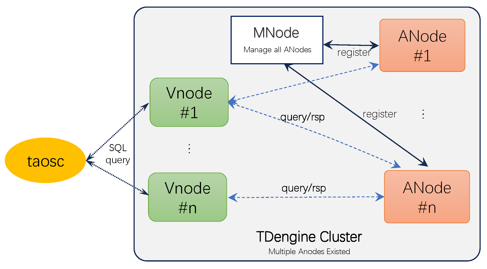

## 概述

ANode（Analysis Node）是 TDengine 提供数据分析功能的扩展组件，通过 Restful 接口提供分析服务，拓展 TDengine 的功能，支持时间序列高级分析。
ANode 是无状态的数据分析节点，集群中可以存在多个 ANode 节点，相互之间没有关联。将 ANode 注册到 TDengine 集群以后，通过 SQL 语句即可调用并完成时序分析任务。
下图是数据分析的技术架构示意图。



## 安装部署
### 环境准备
ANode 要求节点上准备有 Python 3.10 及以上版本，以及相应的 Python 包自动安装组件 Pip，同时请确保能够正常连接互联网。

### 安装及卸载
使用专门的 ANode 安装包 TDengine-enterprise-anode-1.x.x.tar.gz 进行 ANode 的安装部署工作，安装过程与 TDengine 的安装流程一致。

```bash
tar -xzvf TDengine-enterprise-anode-1.0.0.tar.gz
cd TDengine-enterprise-anode-1.0.0
sudo ./install.sh
```

卸载 ANode，执行命令 `rmtaosanode` 即可。

### 其他
为了避免 ANode 安装后影响目标节点现有的 Python 库。 ANode 使用 Python 虚拟环境运行，安装后的默认 Python 目录处于 `/var/lib/taos/taosanode/venv/`。为了避免反复安装虚拟环境带来的开销，卸载 ANode 并不会自动删除该虚拟环境，如果您确认不需要 Python 的虚拟环境，可以手动删除。

## 启动及停止服务
安装 ANode 以后，可以使用 `systemctl` 来管理 ANode 的服务。使用如下命令可以启动/停止/检查状态。

```bash
systemctl start  taosanoded
systemctl stop   taosanoded
systemctl status taosanoded
```

## 目录及配置说明
|目录/文件|说明|
|---------------|------|
|/usr/local/taos/taosanode/bin|可执行文件目录|
|/usr/local/taos/taosanode/resource|资源文件目录，链接到文件夹 /var/lib/taos/taosanode/resource/|
|/usr/local/taos/taosanode/lib|库文件目录|
|/var/lib/taos/taosanode/model/|模型文件目录，链接到文件夹 /var/lib/taos/taosanode/model|
|/var/log/taos/taosanode/|日志文件目录|
|/etc/taos/taosanode.ini|配置文件|

### 配置说明

Anode 提供的 RestFul 服务使用 uWSGI 驱动，因此 ANode 和 uWSGI 的配置信息存放在同一个配置文件中，具体如下：

```ini
[uwsgi]
# charset
env = LC_ALL = en_US.UTF-8

# ip:port
http = 127.0.0.1:6050

# the local unix socket file than communicate to Nginx
#socket = 127.0.0.1:8001
#socket-timeout = 10

# base directory
chdir = /usr/local/taos/taosanode/lib

# initialize python file
wsgi-file = /usr/local/taos/taosanode/lib/taos/app.py

# call module of uWSGI
callable = app

# auto remove unix Socket and pid file when stopping
vacuum = true

# socket exec model
#chmod-socket = 664

# uWSGI pid
uid = root

# uWSGI gid
gid = root

# main process
master = true

# the number of worker processes
processes = 2

# pid file
pidfile = /usr/local/taos/taosanode/taosanode.pid

# enable threads
enable-threads = true

# the number of threads for each process
threads = 4

# memory useage report
memory-report = true

# smooth restart
reload-mercy = 10

# conflict with systemctl, so do NOT uncomment this
# daemonize = /var/log/taos/taosanode/taosanode.log

# log directory
logto = /var/log/taos/taosanode/taosanode.log

# wWSGI monitor port
stats = 127.0.0.1:8387

# python virtual environment directory
virtualenv = /usr/local/taos/taosanode/venv/

[taosanode]
# default app log file
app-log = /var/log/taos/taosanode/taosanode.app.log

# model storage directory
model-dir = /usr/local/taos/taosanode/model/

# default log level
log-level = DEBUG

# draw the query results
draw-result = 0
```

**提示**
请勿设置 `daemonize` 参数，该参数会导致 uWSGI 与 systemctl 冲突，从而无法正常启动。


## ANode 基本操作
### 管理 ANode
#### 创建 ANode 
```sql 
CREATE ANODE {node_url}
```
node_url 是提供服务的 ANode 的 IP 和 PORT, 例如：`create anode 'http://localhost:6050'`。启动 ANode 以后如果不注册到 TDengine 集群中，则无法提供正常的服务。不建议 ANode 注册到两个或多个集群中。

#### 查看 ANode
列出集群中所有的数据分析节点，包括其 `FQDN`, `PORT`, `STATUS`。
```sql
SHOW ANODES;
```

#### 查看提供的时序数据分析服务

```SQL
SHOW ANODES FULL;
```

#### 强制刷新集群中的分析算法缓存
```SQL
UPDATE ANODE {node_id}
UPDATE ALL ANODES
```

#### 删除 ANode 
```sql
DROP ANODE {anode_id}
```
删除 ANode 只是将 ANode 从 TDengine 集群中删除，管理 ANode 的启停仍然需要使用`systemctl`命令。

### 时序数据分析功能

#### 白噪声检查

分析平台提供的 Restful 服务要求输入的时间序列不能是白噪声时间序列（White Noise Data, WND）和随机数序列 , 因此针对所有数据均默认进行白噪声检查。当前白噪声检查采用通行的 `Ljung-Box` 检验，`Ljung-Box` 统计量检查过程需要遍历整个输入序列并进行计算。
如果用户能够明确输入序列一定不是白噪声序列，那么可以通过输入参数，指定预测之前忽略该检查，从而节省分析过程的 CPU 计算资源。
同时支持独立地针对输入序列进行白噪声检测（该检测功能暂不独立对外开放）。


#### 数据重采样和时间戳对齐

分析平台支持将输入数据进行重采样预处理，从而确保输出结果按照用户指定的等间隔进行处理。处理过程分为两种类别：

- 数据时间戳对齐。由于真实数据可能并非严格按照查询指定的时间戳输入。此时分析平台会自动将数据的时间间隔按照指定的时间间隔进行对齐。例如输入时间序列 [11,  22,  29,  41]，用户指定时间间隔为 10，该序列将被对齐重整为以下序列 [10, 20, 30, 40]。
- 数据时间重采样。用户输入时间序列的采样频率超过了输出结果的频率，例如输入时间序列的采样频率是 5，输出结果的频率是 10，输入时间序列 [0， 5， 10， 15， 20， 25， 30] 将被重采用为间隔 为 10 的序列 [0, 10, 20，30]，[5, 15, 25] 处的数据将被丢弃。

需要注意的是，数据输入平台不支持缺失数据补齐后进行的预测分析，如果输入时间序列数据 [11, 22, 29, 49]，并且用户要求的时间间隔为 10，重整对齐后的序列是 [10, 20, 30, 50] 那么该序列进行预测分析将返回错误。


#### 时序数据异常检测
异常检测是针对输入的时序数据，使用预设或用户指定的算法确定时间序列中**可能**出现异常的时间序列点，对于时间序列中若干个连续的异常点，将自动合并成为一个连续的（闭区间）异常窗口。对于只有单个点的场景，异常窗口窗口退化成为一个起始时间和结束时间相同的点。
异常检测生成的异常窗口受检测算法和算法参数的共同影响，对于异常窗口范围内的数据，可以应用 TDengine 提供的聚合和标量函数进行查询或变换处理。
对于输入时间序列 (1, 20), (2, 22), (3, 91), (4, 120), (5, 18), (6, 19)。系统检测到 (3, 91), (4, 120) 为异常点，那么返回的异常窗口是闭区间 [3, 4]。


##### 语法

```SQL
ANOMALY_WINDOW(column_name, option_expr)

option_expr: {"
algo=expr1
[,wncheck=1|0]
[,expr2]
"}
```

1. `column`：进行时序数据异常检测的输入数据列，当前只支持单列，且只能是数值类型，不能是字符类型（例如：`NCHAR` `VARCHAR` `VARBINARY`等类型），**不支持函数表达式**。
2. `options`：字符串。其中使用 K=V 调用异常检测算法及与算法相关的参数。采用逗号分隔的 K=V 字符串表示，其中的字符串不需要使用单引号、双引号、或转义号等符号，不能使用中文及其他宽字符。例如：`algo=ksigma,k=2` 表示进行异常检测的算法是 ksigma，该算法接受的输入参数是 2。
3. 异常检测的结果可以作为外层查询的子查询输入，在 `SELECT` 子句中使用的聚合函数或标量函数与其他类型的窗口查询相同。
4. 输入数据默认进行白噪声检查，如果输入数据是白噪声，将不会有任何（异常）窗口信息返回。

**参数说明**
|参数|含义|默认值|
|---|---|---|
|algo|异常检测调用的算法|iqr|
|wncheck|对输入数据列是否进行白噪声检查|取值为 0 或者 1，默认值为 1，表示进行白噪声检查|

异常检测的返回结果以窗口形式呈现，因此窗口查询相关的伪列在这种场景下仍然可用。可以使用的伪列如下：
1. `_WSTART`： 异常窗口开始时间戳
2. `_WEND`：异常窗口结束时间戳
3. `_WDURATION`：异常窗口持续时间

**示例**
```SQL
--- 使用 iqr 算法进行异常检测，检测列 i32 列。
SELECT _wstart, _wend, SUM(i32) 
FROM ai.atb
ANOMALY_WINDOW(i32, "algo=iqr");

--- 使用 ksigma 算法进行异常检测，输入参数 k 值为 2，检测列 i32 列
SELECT _wstart, _wend, SUM(i32) 
FROM ai.atb
ANOMALY_WINDOW(i32, "algo=ksigma,k=2");
```

```
taos> SELECT _wstart, _wend, count(*) FROM ai.atb ANOMAYL_WINDOW(i32);
         _wstart         |          _wend          |   count(*)    |
====================================================================
 2020-01-01 00:00:16.000 | 2020-01-01 00:00:16.001 |             1 |
Query OK, 1 row(s) in set (0.028946s)
```


**可用异常检测算法**
- iqr
- ksigma
- grubbs
- lof
- shesd
- tac


#### 时序数据预测
数据预测以一段训练数据作为输入，预测接下来一个连续时间区间内，时序数据的趋势。

##### 语法
```SQL
FORECAST(column_expr, option_expr)

option_expr: {"
algo=expr1
[,wncheck=1|0]
[,conf=conf_val]
[,every=every_val]
[,rows=rows_val]
[,start=start_ts_val]
[,expr2]
"}

```
1. `column_expr`：预测的时序数据列。与异常检测相同，只支持数值类型输入。
2. `options`：异常检测函数的参数，使用规则与 anomaly_window 相同。预测还支持 `conf`, `every`, `rows`, `start`, `rows` 几个参数，其含义如下：

**参数说明**

|参数|含义|默认值|
|---|---|---|
|algo|预测分析使用的算法|holtwinters|
|wncheck|白噪声（white noise data）检查|默认值为 1，0 表示不进行检查|
|conf|预测数据的置信区间范围 ，取值范围 [0, 100]|95|
|every|预测数据的采样间隔|输入数据的采样间隔|
|start|预测结果的开始时间戳|输入数据最后一个时间戳加上一个采样时间段|
|rows|预测结果的记录数|10|

1. 预测查询结果新增了三个伪列，具体如下：`_FROWTS`：预测结果的时间戳、`_FLOW`：置信区间下界、`_FHIGH`：置信区间上界, 对于没有置信区间的预测算法，其置信区间同预测结果
2. 更改参数 `START`：返回预测结果的起始时间，改变起始时间不会影响返回的预测数值，只影响起始时间。
3. `EVERY`：可以与输入数据的采样频率不同。采样频率只能低于或等于输入数据采样频率，不能**高于**输入数据的采样频率。
4. 对于某些不需要计算置信区间的算法，即使指定了置信区间，返回的结果中其上下界退化成为一个点。

**示例**

```SQL
--- 使用 arima 算法进行预测，预测结果是 10 条记录（默认值），数据进行白噪声检查，默认置信区间 95%. 
SELECT  _flow, _fhigh, _frowts, FORECAST(i32, "algo=arima")
FROM ai.ftb;

--- 使用 arima 算法进行预测，输入数据的是周期数据，每 10 个采样点是一个周期。返回置信区间是 95%.
SELECT  _flow, _fhigh, _frowts, FORECAST(i32, "algo=arima,alpha=95,period=10")
FROM ai.ftb;
```
```
taos> select _flow, _fhigh, _frowts, forecast(i32) from ai.ftb;
        _flow         |        _fhigh        |       _frowts           | forecast(i32) |
========================================================================================
           10.5286684 |           41.8038254 | 2020-01-01 00:01:35.001 |            26 |
          -21.9861946 |           83.3938904 | 2020-01-01 00:01:36.001 |            30 |
          -78.5686035 |          144.6729126 | 2020-01-01 00:01:37.001 |            33 |
         -154.9797363 |          230.3057709 | 2020-01-01 00:01:38.001 |            37 |
         -253.9852905 |          337.6083984 | 2020-01-01 00:01:39.001 |            41 |
         -375.7857971 |          466.4594727 | 2020-01-01 00:01:40.001 |            45 |
         -514.8043823 |          622.4426270 | 2020-01-01 00:01:41.001 |            53 |
         -680.6343994 |          796.2861328 | 2020-01-01 00:01:42.001 |            57 |
         -868.4956665 |          992.8603516 | 2020-01-01 00:01:43.001 |            62 |
        -1076.1566162 |         1214.4498291 | 2020-01-01 00:01:44.001 |            69 |
```


**可用预测算法**
- arima
- holtwinters
