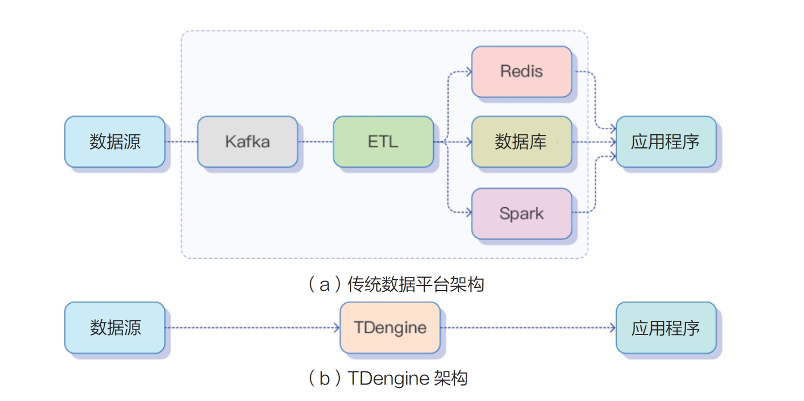

TDengine 不仅是一个高性能、分布式的时序数据库核心产品，而且集成了专为时序数据量身定制的一系列功能，包括数据订阅、缓存、流计算和 ETL 等。这些功能共同构成了一个完整的时序数据处理解决方案。因此，当你选择使用 TDengine 时，你的应用程序无须额外集成 Kafka、Redis、Spark 或 Flink 等第三方工具，从而极大地简化应用程序的设计复杂度，并显著降低运维成本。下图直观地展示了传统大数据平台架构与TDengine 架构之间的异同点，突显了 TDengine 在时序数据处理领域的独特优势。



本章主要介绍 TDengine 的一些高级功能，如数据订阅、缓存、流计算、边云协同和数据接入等。

```mdx-code-block
import DocCardList from '@theme/DocCardList';
import {useCurrentSidebarCategory} from '@docusaurus/theme-common';

<DocCardList items={useCurrentSidebarCategory().items}/>
```