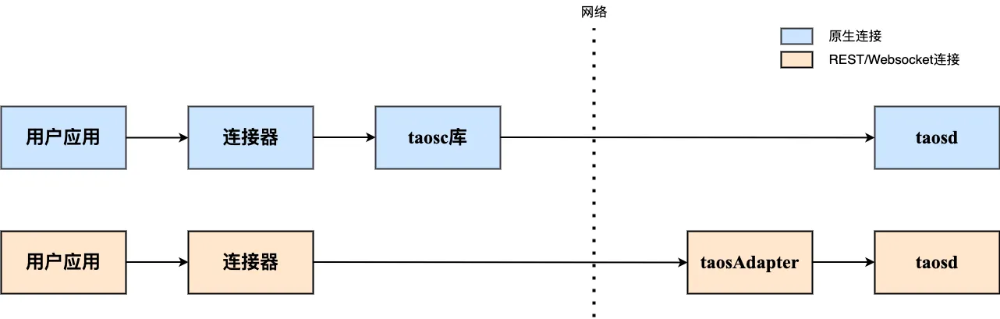

import Tabs from "@theme/Tabs";
import TabItem from "@theme/TabItem";
import ConnJava from "./_connect_java.mdx";
import ConnGo from "./_connect_go.mdx";
import ConnRust from "./_connect_rust.mdx";
import ConnNode from "./_connect_node.mdx";
import ConnPythonNative from "./_connect_python.mdx";
import ConnCSNative from "./_connect_cs.mdx";
import ConnC from "./_connect_c.mdx";
import ConnR from "./_connect_r.mdx";
import ConnPHP from "./_connect_php.mdx";
import InstallOnLinux from "../../08-connector/_linux_install.mdx";
import InstallOnWindows from "../../08-connector/_windows_install.mdx";
import InstallOnMacOS from "../../08-connector/_macos_install.mdx";
import VerifyLinux from "../../08-connector/_verify_linux.mdx";
import VerifyMacOS from "../../08-connector/_verify_macos.mdx";
import VerifyWindows from "../../08-connector/_verify_windows.mdx";

TDengine 提供了丰富的应用程序开发接口，为了便于用户快速开发自己的应用，TDengine 支持了多种编程语言的连接器，其中官方连接器包括支持 C/C++、Java、Python、Go、Node.js、C#、Rust、Lua（社区贡献）和 PHP （社区贡献）的连接器。这些连接器支持使用原生接口（taosc）和 REST 接口（部分语言暂不支持）连接 TDengine 集群。社区开发者也贡献了多个非官方连接器，例如 ADO.NET 连接器、Lua 连接器和 PHP 连接器。

## 连接器建立连接的方式

连接器建立连接的方式，TDengine 提供三种:

1. 通过客户端驱动程序 taosc 直接与服务端程序 taosd 建立连接，这种连接方式下文中简称 “原生连接”。
2. 通过 taosAdapter 组件提供的 REST API 建立与 taosd 的连接，这种连接方式下文中简称 “REST 连接”
3. 通过 taosAdapter 组件提供的 Websocket API 建立与 taosd 的连接，这种连接方式下文中简称 “Websocket 连接”



无论使用何种方式建立连接，连接器都提供了相同或相似的 API 操作数据库，都可以执行 SQL 语句，只是初始化连接的方式稍有不同，用户在使用上不会感到什么差别。

关键不同点在于：

1. 使用 原生连接，需要保证客户端的驱动程序 taosc 和服务端的 TDengine 版本配套。
2. 使用 REST 连接，用户无需安装客户端驱动程序 taosc，具有跨平台易用的优势，但是无法体验数据订阅和二进制数据类型等功能。另外与 原生连接 和 Websocket 连接相比，REST连接的性能最低。
3. 使用 Websocket 连接，用户也无需安装客户端驱动程序 taosc，但相比 原生连接 性能要下降 30% 左右。
4. 连接云服务实例，必须使用 REST 连接 或 Websocket 连接。

一般我们建议使用 **Websocket 连接**。

## 安装客户端驱动 taosc

如果选择原生连接，而且应用程序不在 TDengine 同一台服务器上运行，你需要先安装客户端驱动，否则可以跳过此一步。为避免客户端驱动和服务端不兼容，请使用一致的版本。

### 安装步骤

<Tabs defaultValue="linux" groupId="os">
  <TabItem value="linux" label="Linux">
    <InstallOnLinux />
  </TabItem>
  <TabItem value="windows" label="Windows">
    <InstallOnWindows />
  </TabItem>
  <TabItem value="macos" label="macOS">
    <InstallOnMacOS />
  </TabItem>
</Tabs>

### 安装验证

以上安装和配置完成后，并确认 TDengine 服务已经正常启动运行，此时可以执行安装包里带有的 TDengine 命令行程序 taos 进行登录。

<Tabs defaultValue="linux" groupId="os">
  <TabItem value="linux" label="Linux">
    <VerifyLinux />
  </TabItem>
  <TabItem value="windows" label="Windows">
    <VerifyWindows />
  </TabItem>
  <TabItem value="macos" label="macOS">
    <VerifyMacOS />
  </TabItem>
</Tabs>

## 安装连接器

<Tabs groupId="lang">
<TabItem label="Java" value="java">

如果使用 Maven 管理项目，只需在 pom.xml 中加入以下依赖。

```xml
<dependency>
  <groupId>com.taosdata.jdbc</groupId>
  <artifactId>taos-jdbcdriver</artifactId>
  <version>3.2.8</version>
</dependency>
```

</TabItem>
<TabItem label="Python" value="python">

使用 `pip` 从 PyPI 安装:

```
pip install taospy
```

从 Git URL 安装：

```
pip install git+https://github.com/taosdata/taos-connector-python.git
```

</TabItem>
<TabItem label="Go" value="go">

编辑 `go.mod` 添加 `driver-go` 依赖即可。

```go-mod title=go.mod
module goexample

go 1.17

require github.com/taosdata/driver-go/v3 latest
```

:::note
driver-go 使用 cgo 封装了 taosc 的 API。cgo 需要使用 GCC 编译 C 的源码。因此需要确保你的系统上有 GCC。

:::

</TabItem>
<TabItem label="Rust" value="rust">

编辑 `Cargo.toml` 添加 `taos` 依赖即可。

```toml title=Cargo.toml
[dependencies]
taos = { version = "*"}
```

:::info
Rust 连接器通过不同的特性区分不同的连接方式。默认同时支持原生连接和 Websocket 连接，如果仅需要建立 Websocket 连接，可设置 `ws` 特性：

```toml
taos = { version = "*", default-features = false, features = ["ws"] }
```

:::

</TabItem>
<TabItem label="Node.js" value="node">

Node.js 连接器通过不同的包提供不同的连接方式。

1. 安装 Node.js 原生连接器

```
npm install @tdengine/client
```

:::note
推荐 Node 版本大于等于 `node-v12.8.0` 小于 `node-v13.0.0`
:::

2. 安装 Node.js REST 连接器

```
npm install @tdengine/rest
```

</TabItem>
<TabItem label="C#" value="csharp">

编辑项目配置文件中添加 [TDengine.Connector](https://www.nuget.org/packages/TDengine.Connector/) 的引用即可：

```xml title=csharp.csproj {12}
<Project Sdk="Microsoft.NET.Sdk">

  <PropertyGroup>
    <OutputType>Exe</OutputType>
    <TargetFramework>net6.0</TargetFramework>
    <ImplicitUsings>enable</ImplicitUsings>
    <Nullable>enable</Nullable>
    <StartupObject>TDengineExample.AsyncQueryExample</StartupObject>
  </PropertyGroup>

  <ItemGroup>
    <PackageReference Include="TDengine.Connector" Version="3.1.0" />
  </ItemGroup>

</Project>
```

也可通过 dotnet 命令添加：

```
dotnet add package TDengine.Connector
```

:::note
以下示例代码，均基于 dotnet6.0，如果使用其它版本，可能需要做适当调整。

:::

</TabItem>
<TabItem label="R" value="r">

1. 下载 [taos-jdbcdriver-version-dist.jar](https://repo1.maven.org/maven2/com/taosdata/jdbc/taos-jdbcdriver/3.0.0/)。
2. 安装 R 的依赖包`RJDBC`：

```R
install.packages("RJDBC")
```

</TabItem>
<TabItem label="C" value="c">

如果已经安装了 TDengine 服务端软件或 TDengine 客户端驱动 taosc， 那么已经安装了 C 连接器，无需额外操作。
<br/>

</TabItem>
<TabItem label="PHP" value="php">

**下载代码并解压：**

```shell
curl -L -o php-tdengine.tar.gz https://github.com/Yurunsoft/php-tdengine/archive/refs/tags/v1.0.2.tar.gz \
&& mkdir php-tdengine \
&& tar -xzf php-tdengine.tar.gz -C php-tdengine --strip-components=1
```

> 版本 `v1.0.2` 只是示例，可替换为任意更新的版本，可在 [TDengine PHP Connector 发布历史](https://github.com/Yurunsoft/php-tdengine/releases) 中查看可用版本。

**非 Swoole 环境：**

```shell
phpize && ./configure && make -j && make install
```

**手动指定 TDengine 目录：**

```shell
phpize && ./configure --with-tdengine-dir=/usr/local/Cellar/tdengine/3.0.0.0 && make -j && make install
```

> `--with-tdengine-dir=` 后跟上 TDengine 目录。
> 适用于默认找不到的情况，或者 macOS 系统用户。

**Swoole 环境：**

```shell
phpize && ./configure --enable-swoole && make -j && make install
```

**启用扩展：**

方法一：在 `php.ini` 中加入 `extension=tdengine`

方法二：运行带参数 `php -d extension=tdengine test.php`

</TabItem>
</Tabs>

## 建立连接

在执行这一步之前，请确保有一个正在运行的，且可以访问到的 TDengine，而且服务端的 FQDN 配置正确。以下示例代码，都假设 TDengine 安装在本机，且 FQDN（默认 localhost） 和 serverPort（默认 6030） 都使用默认配置。

<Tabs groupId="lang" defaultValue="java">
  <TabItem label="Java" value="java">
    <ConnJava />
  </TabItem>
  <TabItem label="Python" value="python">
    <ConnPythonNative />
  </TabItem>
  <TabItem label="Go" value="go">
      <ConnGo />
  </TabItem>
  <TabItem label="Rust" value="rust">
    <ConnRust />
  </TabItem>
  <TabItem label="Node.js" value="node">
    <ConnNode />
  </TabItem>
  <TabItem label="C#" value="csharp">
    <ConnCSNative />
  </TabItem>
  <TabItem label="R" value="r">
    <ConnR/>
  </TabItem>
  <TabItem label="C" value="c">
    <ConnC />
  </TabItem>
  <TabItem label="PHP" value="php">
    <ConnPHP />
  </TabItem>
</Tabs>

:::tip
如果建立连接失败，大部分情况下是 FQDN 或防火墙的配置不正确，详细的排查方法请看[《常见问题及反馈》](https://docs.taosdata.com/train-faq/faq)中的“遇到错误 Unable to establish connection, 我怎么办？”

:::
