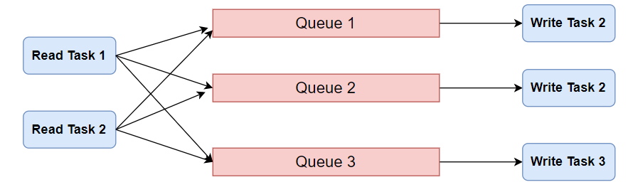

import Tabs from "@theme/Tabs";
import TabItem from "@theme/TabItem";

# 高效写入

## 高效写入原理 {#principle}


本节介绍如何高效地向 TDengine 写入数据。高效写入数据要考虑几个因素：数据在不同表（或子表）之间的分布，即要写入数据的相邻性；单次写入的数据量；并发连接数。一般来说，每批次只向同一张表（或子表）写入数据比向多张表（或子表）写入数据要更高效；每批次写入的数据量越大越高效（但超过一定阈值其优势会消失；同时写入数据的并发连接数越多写入越高效（但超过一定阈值反而会下降，取决于服务端处理能力）。

为了更高效地向 TDengine 写入数据，客户端程序要充分且恰当地利用以上几个因素。在单次写入中尽量只向同一张表（或子表）写入数据，每批次写入的数据量经过测试和调优设定为一个最适合当前系统处理能力的数值，并发写入的连接数同样经过测试和调优后设定为一个最适合当前系统处理能力的数值，以实现在当前系统中的最佳写入速度。同时，TDengine 还提供了独特的参数绑定写入，这也是一个有助于实现高效写入的方法。

为了使写入最高效，除了客户端程序的设计，服务端的配置也很重要。如果无论怎么调节客户端程序，taosd 进程的 CPU 使用率都很低，那很可能需要增加 vgroup 的数量。比如：数据库总表数是 1000 且 minTablesPerVnode 设置的也是 1000，那么这个数据至多有一个 vgroup。此时如果将 minTablesPerVnode 和 tablelncStepPerVnode 都设置成 100， 则这个数据库有可能用到 10 个 vgroup。更多性能调优参数请参考[配置参考](../../reference/config)性能调优部分。

## 场景设计 {#scenario}

下面的示例程序展示了如何高效写入数据：

- TDengine 客户端程序从消息队列或者其它数据源不断读入数据，在示例程序中采用生成模拟数据的方式来模拟读取数据源
- 单个连接向 TDengine 写入的速度无法与读数据的速度相匹配，因此客户端程序启动多个线程，每个线程都建立了与 TDengine 的连接，每个线程都有一个独占的固定大小的消息队列
- 客户端程序将接收到的数据根据所属的表名（或子表名）HASH 到不同的线程，即写入该线程所对应的消息队列，以此确保属于某个表（或子表）的数据一定会被一个固定的线程处理
- 各个子线程在将所关联的消息队列中的数据读空后或者读取数据量达到一个预定的阈值后将该批数据写入 TDengine，并继续处理后面接收到的数据



:::note
上图所示架构，每个写任务只负责写特定的表，体现了数据的相邻性原则。但是读任务所读的表，我们假设是随机的。这样一个队列有多个写入线程（或进程），队列内部可能产生锁的消耗。实际场景，如果能做到一个读任务对应一个写任务是最好的。
:::

## 示例代码

这一部分是针对以上场景的示例代码。建议先阅读此场景的示例代码，对于其它场景高效写入原理相同，不够代码需要适当修改。

<Tabs defaultValue="java" groupId="lang">
<TabItem label="Java" value="java">


</TabItem>
<TabItem label="Python" value="python">


</TabItem>
</Tabs>

## 其它场景

由于写入场景众多，无法一一列举，这一部分描述对于其它常用场景修改示例代码的方法。


## Java 示例程序 {#java-demo}

在 Java 示例程序中采用拼接 SQL 的写入方式。

### 主程序 {#java-demo-main}

主程序负责：

1. 创建消息队列
2. 启动写线程
3. 启动读线程
4. 每隔 10 秒统计一次写入速度

主程序默认暴露了 4 个参数，每次启动程序都可调节，用于测试和调优：

1. 读线程个数。默认为 1。
2. 写线程个数。默认为 3。
3. 模拟生成的总表数。默认为 1000。将会平分给各个读线程。
4. 每批最多写入记录数量。默认为 3000。

<details>
<summary>主程序</summary>

```java
{{#include docs/examples/java/src/main/java/com/taos/example/highvolume/FastWriteExample.java:main}}
```

</details>


队列容量(taskQueueCapacity)也是与性能有关的参数，可通过修改程序调节。一般来讲，队列容量越大，入队被阻塞的概率越小，队列的吞吐量越大，但是内存占用也会越大。

### 读任务的实现 {#java-demo-read}

读任务负责从数据源读数据。每个读任务都关联了一个模拟数据源。每个模拟数据源可生成一点数量表的数据。不同的模拟数据源生成不同表的数据。

读任务采用阻塞的方式写消息队列。也就是说，一旦队列满了，写操作就会阻塞。

<details>
<summary>读任务的实现</summary>

```java
{{#include docs/examples/java/src/main/java/com/taos/example/highvolume/ReadTask.java:ReadTask}}
```

</details>

### 写任务的实现 {#java-demo-write}

<details>
<summary>写任务的实现</summary>

```java
{{#include docs/examples/java/src/main/java/com/taos/example/highvolume/WriteTask.java:WriteTask}}
```

</details>

### SQLWriter 类的实现 {#java-demo-sql-writer}

SQLWriter 类封装了拼 SQL 和写数据的逻辑。注意，所有的表都没有提前创建，而是写入出错的时候，再以超级表为模板批量建表，然后重新执行 INSERT 语句。

<details>
<summary>SQLWriter 类的实现</summary>

```java
{{#include docs/examples/java/src/main/java/com/taos/example/highvolume/SQLWriter.java:SQLWriter}}
```

</details>

### 执行示例程序 {#run-java-demo}

<details>
<summary>执行 Java 示例程序</summary>


执行程序前需配置环境变量 `TDENGINE_JDBC_URL`。如果 TDengine Server 部署在本机，且用户名、密码和端口都是默认值，那么可配置：

```
TDENGINE_JDBC_URL="jdbc:TAOS://localhost:6030?user=root&password=taosdata"
```

#### 本地集成开发环境执行示例程序 {#java-demo-local-run}

1. clone TDengine 仓库
   ```
   git clone git@github.com:taosdata/TDengine.git --depth 1
   ```
2. 用集成开发环境打开 `docs/examples/java` 目录。
3. 在开发环境中配置环境变量 `TDENGINE_JDBC_URL`。如果已配置了全局的环境变量 `TDENGINE_JDBC_URL` 可跳过这一步。
4. 运行类 `com.taos.example.highvolume.FastWriteExample`。

#### 远程服务器上执行示例程序 {#java-demo-remote-run}

若要在服务器上执行示例程序，可按照下面的步骤操作：

1. 打包示例代码。在目录 TDengine/docs/examples/java 下执行：
   ```
   mvn package
   ```
2. 远程服务器上创建 examples 目录：
   ```
   mkdir -p examples/java
   ```
3. 复制依赖到服务器指定目录：
   - 复制依赖包，只用复制一次
      ```
      scp -r .\target\lib <user>@<host>:~/examples/java
      ```
      
   - 复制本程序的 jar 包，每次更新代码都需要复制
      ```
      scp -r .\target\javaexample-1.0.jar <user>@<host>:~/examples/java
      ```
4. 配置环境变量。
   编辑 `~/.bash_profile` 或 `~/.bashrc` 添加如下内容例如：
   ```
   export TDENGINE_JDBC_URL="jdbc:TAOS://localhost:6030?user=root&password=taosdata"
   ```
   以上使用的是本地部署 TDengine Server 时默认的 JDBC URL。你需要根据自己的实际情况更改。

5. 用 java 命令启动示例程序，命令模板：
   
   ```
   java -classpath lib/*:javaexample-1.0.jar  com.taos.example.highvolume.FastWriteExample <read_thread_count>  <white_thread_count> <total_table_count> <max_batch_size>
   ```

6. 结束测试程序。测试程序不会自动结束，在获取到当前配置下稳定的写入速度后，按 <kbd>CTRL</kbd> + <kbd>C</kbd> 结束程序。
   下面是一次实际运行的截图： 

   ```
   [testuser@vm95 java]$ java -classpath lib/*:javaexample-1.0.jar  com.taos.example.highvolume.FastWriteExample 1 9 1000 2000
   17:01:01.131 [main] INFO  c.t.e.highvolume.FastWriteExample - readTaskCount=1, writeTaskCount=9 tableCount=1000 maxBatchSize=2000
   17:01:01.286 [WriteThread-0] INFO  c.taos.example.highvolume.WriteTask - started
   17:01:01.354 [WriteThread-1] INFO  c.taos.example.highvolume.WriteTask - started
   17:01:01.360 [WriteThread-2] INFO  c.taos.example.highvolume.WriteTask - started
   17:01:01.366 [WriteThread-3] INFO  c.taos.example.highvolume.WriteTask - started
   17:01:01.433 [WriteThread-4] INFO  c.taos.example.highvolume.WriteTask - started
   17:01:01.438 [WriteThread-5] INFO  c.taos.example.highvolume.WriteTask - started
   17:01:01.443 [WriteThread-6] INFO  c.taos.example.highvolume.WriteTask - started
   17:01:01.448 [WriteThread-7] INFO  c.taos.example.highvolume.WriteTask - started
   17:01:01.454 [WriteThread-8] INFO  c.taos.example.highvolume.WriteTask - started
   17:01:01.454 [ReadThread-0] INFO  com.taos.example.highvolume.ReadTask - started
   17:01:11.615 [main] INFO  c.t.e.highvolume.FastWriteExample - count=18766442 speed=1876644
   17:01:21.775 [main] INFO  c.t.e.highvolume.FastWriteExample - count=38947464 speed=2018102
   17:01:32.428 [main] INFO  c.t.e.highvolume.FastWriteExample - count=58649571 speed=1970210
   17:01:42.577 [main] INFO  c.t.e.highvolume.FastWriteExample - count=79264890 speed=2061531
   17:01:53.265 [main] INFO  c.t.e.highvolume.FastWriteExample - count=99097476 speed=1983258
   17:02:04.209 [main] INFO  c.t.e.highvolume.FastWriteExample - count=119546779 speed=2044930
   17:02:14.935 [main] INFO  c.t.e.highvolume.FastWriteExample - count=141078914 speed=2153213
   17:02:25.617 [main] INFO  c.t.e.highvolume.FastWriteExample - count=162183457 speed=2110454
   17:02:36.718 [main] INFO  c.t.e.highvolume.FastWriteExample - count=182735614 speed=2055215
   17:02:46.988 [main] INFO  c.t.e.highvolume.FastWriteExample - count=202895614 speed=2016000
   ```

</details>

## Python 示例程序 {#python-demo}

该 Python 示例程序中采用了多进程的架构，并使用了跨进程的队列通信。写任务采用拼装 SQL 的方式写入。
### main 函数 {#python-demo-main}

main 函数负责创建消息队列和启动子进程，子进程有 3 类：

1. 1 个监控进程，负责数据库初始化和统计写入速度
2. n 个读进程，负责从其它数据系统读数据
3. m 个写进程，负责写数据库

main 函数可以接收 5 个启动参数，依次是：

1. 读任务（进程）数, 默认为 1
2. 写任务（进程）数, 默认为 1
3. 模拟生成的总表数，默认为 1000
4. 队列大小（单位字节），默认为 1000000
5. 每批最多写入记录数量， 默认为 3000

<details>

<summary>main 函数</summary>

```python
{{#include docs/examples/python/highvolume_faster_queue.py:main}}
```

</details>

### 监控进程

监控进程负责初始化数据库，并监控当前的写入速度。

<details>
<summary>Monitor Process</summary>

```python
{{#include docs/examples/python/highvolume_faster_queue.py:monitor}}
```

</details>

### 读进程 {#python-read-process}

#### 读进程主要逻辑 {#python-run-read-task}

读进程，负责从其它数据系统读数据，并分发数据到各个写进程。

<details>

<summary>run_read_task 函数</summary>

```python
{{#include docs/examples/python/highvolume_faster_queue.py:read}}
```

</details>

#### 模拟数据源 {#python-mock-data-source}

以下是模拟数据源的实现，我们假设数据源生成的每一条数据都带有目标表名信息。实际中你可能需要一定的规则确定目标表名。

<details>
<summary>MockDataSource</summary>

```python
{{#include docs/examples/python/highvolume_faster_queue.py:MockDataSource}}
```

</details>

### 写进程 {#python-write-process}

写进程每次从队列中取出尽量多的数据，并批量写入。

<details>
<summary>run_write_task 函数</summary>

```python
{{#include docs/examples/python/highvolume_faster_queue.py:write}}
```
</details>

### SQLWriter 类的实现 {#python-sql-writer}

SQLWriter 类封装了拼 SQL 和写数据的逻辑。所有的表都没有提前创建，而是写入出错的时候，再以超级表为模板批量建表，然后重新执行 INSERT 语句。这个类也对 SQL 是否超过最大长度限制做了检查，如果接近 SQL 最大长度限制（maxSQLLength），将会立即执行 SQL。为了减少 SQL 此时，建议将 maxSQLLength 适当调大。

<details>

<summary>SQLWriter</summary>

```python
{{#include docs/examples/python/sql_writer.py}}
```

</details>

### 执行示例程序 {#run-python-demo}

<details>

<summary>执行 Python 示例程序</summary>

1. 前提条件
   - 已安装 TDengine 客户端驱动
   - 已安装 Python3， 推荐版本 >= 3.8
   - 已安装 taospy

2. 安装 faster-fifo 代替 python 内置的 multiprocessing.Queue
   ```
   pip3 install faster-fifo
   ```

3. 点击上面的“查看源码”链接复制 `highvolume_faster_queue.py` 和 `sql_writer.py` 两个文件。

4. 执行示例程序
   
   ```
   python3  highvolume_faster_queue.py <READ_TASK_COUNT> <WRITE_TASK_COUNT> <TABLE_COUNT> <QUEUE_SIZE> <MAX_BATCH_SIZE>
   ```

下面是一次实际运行的输出：

```
[testuser@vm95 python]$ python3.6 highvolume_faster_queue.py 9 9 1000 5000000 3000
2022-07-13 10:05:50,504 [root] - READ_TASK_COUNT=9, WRITE_TASK_COUNT=9, TABLE_COUNT=1000, QUEUE_SIZE=5000000, MAX_BATCH_SIZE=3000
2022-07-13 10:05:53,542 [root] - WriteTask-0 started with pid 5475
2022-07-13 10:05:53,542 [root] - WriteTask-1 started with pid 5476
2022-07-13 10:05:53,543 [root] - WriteTask-2 started with pid 5477
2022-07-13 10:05:53,543 [root] - WriteTask-3 started with pid 5478
2022-07-13 10:05:53,544 [root] - WriteTask-4 started with pid 5479
2022-07-13 10:05:53,544 [root] - WriteTask-5 started with pid 5480
2022-07-13 10:05:53,545 [root] - WriteTask-6 started with pid 5481
2022-07-13 10:05:53,546 [root] - WriteTask-7 started with pid 5482
2022-07-13 10:05:53,546 [root] - WriteTask-8 started with pid 5483
2022-07-13 10:05:53,547 [root] - ReadTask-0 started with pid 5484
2022-07-13 10:05:53,548 [root] - ReadTask-1 started with pid 5485
2022-07-13 10:05:53,549 [root] - ReadTask-2 started with pid 5486
2022-07-13 10:05:53,550 [root] - ReadTask-3 started with pid 5487
2022-07-13 10:05:53,551 [root] - ReadTask-4 started with pid 5488
2022-07-13 10:05:53,552 [root] - ReadTask-5 started with pid 5489
2022-07-13 10:05:53,552 [root] - ReadTask-6 started with pid 5490
2022-07-13 10:05:53,553 [root] - ReadTask-7 started with pid 5491
2022-07-13 10:05:53,554 [root] - ReadTask-8 started with pid 5492
2022-07-13 10:06:00,842 [DataBaseMonitor] - count=6612939 speed=661293.9
2022-07-13 10:06:11,151 [DataBaseMonitor] - count=14765739 speed=815280.0
2022-07-13 10:06:21,677 [DataBaseMonitor] - count=23282163 speed=851642.4
2022-07-13 10:06:31,985 [DataBaseMonitor] - count=31673139 speed=839097.6
2022-07-13 10:06:42,343 [DataBaseMonitor] - count=39819439 speed=814630.0
2022-07-13 10:06:52,830 [DataBaseMonitor] - count=48146339 speed=832690.0
2022-07-13 10:07:03,396 [DataBaseMonitor] - count=56385039 speed=823870.0
2022-07-13 10:07:14,341 [DataBaseMonitor] - count=64848739 speed=846370.0
2022-07-13 10:07:24,877 [DataBaseMonitor] - count=73654566 speed=880582.7
```

</details>