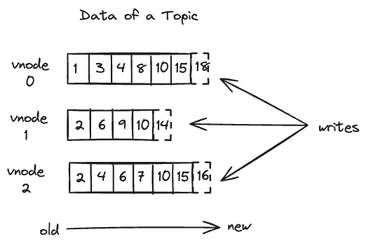
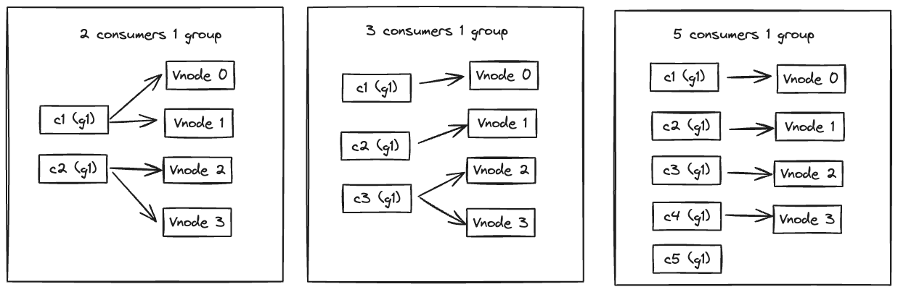
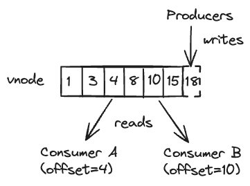

import Tabs from "@theme/Tabs";
import TabItem from "@theme/TabItem";
import Java from "./_sub_java.mdx";
import JavaWS from "./_sub_java_ws.mdx";
import Python from "./_sub_python.mdx";
import Go from "./_sub_go.mdx";
import Rust from "./_sub_rust.mdx";
import Node from "./_sub_node.mdx";
import CSharp from "./_sub_cs.mdx";
import CDemo from "./_sub_c.mdx";

为了帮助应用实时获取写入 TDengine 的数据，或者以事件到达顺序处理数据，TDengine 提供了类似 kafka 的数据订阅功能。这样在很多场景下，采用 TDengine 的时序数据处理系统不再需要集成消息队列产品，比如 kafka, 从而简化系统设计的复杂度，降低运营维护成本。

## 数据订阅介绍

### 主题
与 kafka 一样，你需要定义 topic, TDengine 的 topic 有三种，可以是数据库，超级表，或者一个 `SELECT` 语句，具体的语法参见 [CREATE TOPIC](../../taos-sql/tmq)。与其他消息队列软件相比，这是 TDengine 数据订阅功能的最大的优势，它提供了更大的灵活性，数据的颗粒度可以由应用随时调整，而且数据的过滤与预处理交给 TDengine，而不是应用完成，有效的减少传输的数据量与应用的复杂度。

如下图，每个 topic 涉及到的数据表可能分布在多个 vnode（相当于 kafka 里的 partition） 上，每个 vnode 上的数据保存在 WAL(Write-Ahead-Log) 文件中，WAL 文件里的数据是顺序写入的（由于 WAL 文件中存储的不只有数据，还有元数据，写入消息等，所以数据的版本号不是连续的）。



TDengine 会为 WAL 文件自动创建索引以支持快速随机访问，并提供了灵活可配置的文件切换与保留机制，用户可以按需指定 WAL 文件保留的时间以及大小（详见 [CREATE DATABASE](../../taos-sql/database) 语句，由于消费是通过 WAL 实现的，所以应该根据写入消费速度来确定 WAL 的保存时长）。通过以上方式将 WAL 改造成了一个保留事件到达顺序的、可持久化的存储引擎。

对于 `SELECT` 语句形式的 topic，在消费时，TDengine 根据当前消费进度从 WAL 直接读取数据，并使用统一的查询引擎实现过滤、变换等操作，将数据推送给消费者。

### 生产者
写入 topic 相关联的数据表中数据的都是生产者，生产者实际生产的数据写入到了子表或普通表中，即表所在 vnode 的 WAL 里。

### 消费者

#### 消费者组
消费者订阅 topic 后，可以消费 topic 里的所有数据（这些数据所在的表可能分布在多个 vnode 上，即 db 所在的所有 vnode）。订阅 topic 时，需要指定一个消费者组 (consumer group)，如果这个消费者组里只有一个消费者，那么这个消费者会顺序的消费这些 vnode 上的数据。

为了提高消费速度，便于多线程、分布式地消费数据，可以在一个消费组里添加多个消费者，这些消费者将均分数据所在的 vnode 进行消费（比如数据分布在 4 个 vnode 上，有 2 个消费者的话，那么每个消费者消费 2 个 vnode；有 3 个消费者的话，2 个消费者各消费 1 个 vnode，1 个消费者消费 2 个 vnode；有 5 个消费者的话，4 个各分配 1 个 vnode 消费，另外 1 个不消费），如下图：



在一个消费组里添加一个消费者后，在 Mnode 上通过 rebalance 的机制实现消费者的重新分配，该操作对用户是透明的。

一个消费者可以订阅多个 topic。TDengine 的数据订阅在宕机、重启等复杂环境下确保 at least once 消费。

#### 消费进度
在 topic 的一个消费组的一个 vnode 上有消费进度。消费者消费的同时，可以提交消费进度，消费进度即 vnode 上 WAL 的版本号（对于 kafka 里的 offset），消费进度可以手动提交，也可以通过参数（auto.commit.interval.ms）设置为周期性自动提交。

首次消费数据时通过订阅参数（auto.offset.reset）来确定消费位置为最新数据（latest）还是最旧数据（earliest）。

消费进度在一个 vnode 上对于同一个 topic 和 消费者组是唯一的。所以如果同一个 topic 和 消费者组在一个 vnode 上的消费者退出了，并且提交了消费进度。然后同一个 topic 和 消费者组里重新建了一个新的消费者消费这个 vnode，那么这个新消费者将继承之前的消费进度继续消费。

如果之前的消费者没有提交消费进度，那个新的消费者将根据订阅参数（auto.offset.reset）设置的值来确定起始消费位置。

不同消费者组中的消费者即使消费同一个 topic, 并不共享消费进度。



作为一个数据库产品， WAL 文件中存储的不全是数据，也包括其他写入消息，元数据等，所以消费进度不是连续的。

### 说明
从3.2.0.0版本开始，数据订阅支持vnode迁移和分裂。

由于数据订阅依赖wal文件，而在vnode迁移和分裂的过程中，wal并不会同步过去，所以迁移或分裂后，之前没消费完的wal数据后消费不到。所以请保证迁移和分裂之前把数据全部消费完后，再进行vnode迁移或分裂，否则，消费会丢失数据。

## 数据订阅语法说明

具体的语法参见 [数据订阅](../../taos-sql/tmq)

## 数据订阅相关参数

消费参数主要用于消费者创建时指定，基础配置项如下表所示：

|            参数名称            |  类型   | 参数说明                                                 | 备注                                        |
| :----------------------------: | :-----: | -------------------------------------------------------- | ------------------------------------------- |
|        `td.connect.ip`         | string  | 服务端的 IP 地址                          |                                          |
|       `td.connect.user`        | string  | 用户名                         |    |
|       `td.connect.pass`        | string  | 密码                          |  |
|       `td.connect.port`        | integer | 服务端的端口号                         |  |
|           `group.id`           | string  | 消费组 ID，同一消费组共享消费进度                        | <br />**必填项**。最大长度：192。<br />每个topic最多可建立100个 consumer group                 |
|          `client.id`           | string  | 客户端 ID                                                | 最大长度：192。                             |
|      `auto.offset.reset`       |  enum   | 消费组订阅的初始位置                                     | <br />`earliest`: default(version < 3.2.0.0);从头开始订阅; <br/>`latest`: default(version >= 3.2.0.0);仅从最新数据开始订阅; <br/>`none`: 没有提交的 offset 无法订阅 |
|      `enable.auto.commit`      | boolean | 是否启用消费位点自动提交，true: 自动提交，客户端应用无需commit；false：客户端应用需要自行commit     | 默认值为 true                   |
|   `auto.commit.interval.ms`    | integer | 消费记录自动提交消费位点时间间隔，单位为毫秒           | 默认值为 5000                                |
|     `msg.with.table.name`      | boolean | 是否允许从消息中解析表名, 不适用于列订阅（列订阅时可将 tbname 作为列写入 subquery 语句）（从3.2.0.0版本该参数废弃，恒为true）               |默认关闭 |
|     `enable.replay`            | boolean | 是否开启数据回放功能               |默认关闭 |

## 数据订阅主要 API 接口

不同语言下， TMQ 订阅相关的 API 及数据结构如下（详细的接口说明可以参考连接器章节数据订阅部分，注意consumer结构不是线程安全的，在一个线程使用consumer时，不要在另一个线程close这个consumer）：

<Tabs defaultValue="java" groupId="lang">
<TabItem value="c" label="C">

```c
    typedef struct tmq_t      tmq_t;
    typedef struct tmq_conf_t tmq_conf_t;
    typedef struct tmq_list_t tmq_list_t;

    typedef void(tmq_commit_cb(tmq_t *tmq, int32_t code, void *param));

    typedef enum tmq_conf_res_t {
        TMQ_CONF_UNKNOWN = -2,
        TMQ_CONF_INVALID = -1,
        TMQ_CONF_OK = 0,
    } tmq_conf_res_t;

    typedef struct tmq_topic_assignment {
        int32_t vgId;
        int64_t currentOffset;
        int64_t begin;
        int64_t end;
    } tmq_topic_assignment;

    DLL_EXPORT tmq_conf_t    *tmq_conf_new();
    DLL_EXPORT tmq_conf_res_t tmq_conf_set(tmq_conf_t *conf, const char *key, const char *value);
    DLL_EXPORT void           tmq_conf_destroy(tmq_conf_t *conf);
    DLL_EXPORT void           tmq_conf_set_auto_commit_cb(tmq_conf_t *conf, tmq_commit_cb *cb, void *param);

    DLL_EXPORT tmq_list_t *tmq_list_new();
    DLL_EXPORT int32_t     tmq_list_append(tmq_list_t *, const char *);
    DLL_EXPORT void        tmq_list_destroy(tmq_list_t *);
    DLL_EXPORT int32_t     tmq_list_get_size(const tmq_list_t *);
    DLL_EXPORT char      **tmq_list_to_c_array(const tmq_list_t *);

    DLL_EXPORT tmq_t    *tmq_consumer_new(tmq_conf_t *conf, char *errstr, int32_t errstrLen);
    DLL_EXPORT int32_t   tmq_subscribe(tmq_t *tmq, const tmq_list_t *topic_list);
    DLL_EXPORT int32_t   tmq_unsubscribe(tmq_t *tmq);
    DLL_EXPORT int32_t   tmq_subscription(tmq_t *tmq, tmq_list_t **topics);
    DLL_EXPORT TAOS_RES *tmq_consumer_poll(tmq_t *tmq, int64_t timeout);
    DLL_EXPORT int32_t   tmq_consumer_close(tmq_t *tmq);
    DLL_EXPORT int32_t   tmq_commit_sync(tmq_t *tmq, const TAOS_RES *msg);
    DLL_EXPORT void      tmq_commit_async(tmq_t *tmq, const TAOS_RES *msg, tmq_commit_cb *cb, void *param);
    DLL_EXPORT int32_t   tmq_commit_offset_sync(tmq_t *tmq, const char *pTopicName, int32_t vgId, int64_t offset);
    DLL_EXPORT void      tmq_commit_offset_async(tmq_t *tmq, const char *pTopicName, int32_t vgId, int64_t offset, tmq_commit_cb *cb, void *param);
    DLL_EXPORT int32_t   tmq_get_topic_assignment(tmq_t *tmq, const char *pTopicName, tmq_topic_assignment **assignment,int32_t *numOfAssignment);
    DLL_EXPORT void      tmq_free_assignment(tmq_topic_assignment* pAssignment);
    DLL_EXPORT int32_t   tmq_offset_seek(tmq_t *tmq, const char *pTopicName, int32_t vgId, int64_t offset);
    DLL_EXPORT int64_t   tmq_position(tmq_t *tmq, const char *pTopicName, int32_t vgId);
    DLL_EXPORT int64_t   tmq_committed(tmq_t *tmq, const char *pTopicName, int32_t vgId);

    DLL_EXPORT const char *tmq_get_topic_name(TAOS_RES *res);
    DLL_EXPORT const char *tmq_get_db_name(TAOS_RES *res);
    DLL_EXPORT int32_t     tmq_get_vgroup_id(TAOS_RES *res);
    DLL_EXPORT int64_t     tmq_get_vgroup_offset(TAOS_RES* res);
    DLL_EXPORT const char *tmq_err2str(int32_t code);
```

下面介绍一下它们的具体用法（超级表和子表结构请参考“数据建模”一节），完整的示例代码请见下面 C 语言的示例代码。

</TabItem>
<TabItem value="java" label="Java">

```java
void subscribe(Collection<String> topics) throws SQLException;

void unsubscribe() throws SQLException;

Set<String> subscription() throws SQLException;

ConsumerRecords<V> poll(Duration timeout) throws SQLException;

Set<TopicPartition> assignment() throws SQLException;
long position(TopicPartition partition) throws SQLException;
Map<TopicPartition, Long> position(String topic) throws SQLException;
Map<TopicPartition, Long> beginningOffsets(String topic) throws SQLException;
Map<TopicPartition, Long> endOffsets(String topic) throws SQLException;
Map<TopicPartition, OffsetAndMetadata> committed(Set<TopicPartition> partitions) throws SQLException;

void seek(TopicPartition partition, long offset) throws SQLException;
void seekToBeginning(Collection<TopicPartition> partitions) throws SQLException;
void seekToEnd(Collection<TopicPartition> partitions) throws SQLException;

void commitSync() throws SQLException;
void commitSync(Map<TopicPartition, OffsetAndMetadata> offsets) throws SQLException;

void close() throws SQLException;
```

</TabItem>

<TabItem value="Python" label="Python">

```python
class Consumer:
    def subscribe(self, topics):
        pass

    def unsubscribe(self):
        pass

    def poll(self, timeout: float = 1.0):
        pass

    def assignment(self):
        pass

    def seek(self, partition):
        pass

    def close(self):
        pass

    def commit(self, message):
        pass
```

</TabItem>

<TabItem label="Go" value="Go">

```go
func NewConsumer(conf *tmq.ConfigMap) (*Consumer, error)

// 出于兼容目的保留 rebalanceCb 参数，当前未使用
func (c *Consumer) Subscribe(topic string, rebalanceCb RebalanceCb) error

// 出于兼容目的保留 rebalanceCb 参数，当前未使用
func (c *Consumer) SubscribeTopics(topics []string, rebalanceCb RebalanceCb) error

func (c *Consumer) Poll(timeoutMs int) tmq.Event

// 出于兼容目的保留 tmq.TopicPartition 参数，当前未使用
func (c *Consumer) Commit() ([]tmq.TopicPartition, error)

func (c *Consumer) Unsubscribe() error

func (c *Consumer) Close() error
```

</TabItem>

<TabItem label="Rust" value="Rust">

```rust
impl TBuilder for TmqBuilder
  fn from_dsn<D: IntoDsn>(dsn: D) -> Result<Self, Self::Error>
  fn build(&self) -> Result<Self::Target, Self::Error>

impl AsAsyncConsumer for Consumer
  async fn subscribe<T: Into<String>, I: IntoIterator<Item = T> + Send>(
        &mut self,
        topics: I,
    ) -> Result<(), Self::Error>;
  fn stream(
        &self,
    ) -> Pin<
        Box<
            dyn '_
                + Send
                + futures::Stream<
                    Item = Result<(Self::Offset, MessageSet<Self::Meta, Self::Data>), Self::Error>,
                >,
        >,
    >;
  async fn commit(&self, offset: Self::Offset) -> Result<(), Self::Error>;

  async fn unsubscribe(self);
```

可在 <https://docs.rs/taos> 上查看详细 API 说明。

</TabItem>

<TabItem label="Node.JS" value="Node.JS">

```js
function TMQConsumer(config)

function subscribe(topic)

function consume(timeout)

function subscription()

function unsubscribe()

function commit(msg)

function close()
```

</TabItem>

<TabItem value="C#" label="C#">

```csharp
class ConsumerBuilder<TValue>

ConsumerBuilder(IEnumerable<KeyValuePair<string, string>> config)

public IConsumer<TValue> Build()

void Subscribe(IEnumerable<string> topics)

void Subscribe(string topic) 

ConsumeResult<TValue> Consume(int millisecondsTimeout)

List<string> Subscription()

void Unsubscribe()
 
List<TopicPartitionOffset> Commit()

void Close()
```

</TabItem>
</Tabs>

## 数据订阅示例
### 写入数据

首先完成建库、建一张超级表和多张子表操作，然后就可以写入数据了，比如：

```sql
DROP DATABASE IF EXISTS tmqdb;
CREATE DATABASE tmqdb WAL_RETENTION_PERIOD 3600;
CREATE TABLE tmqdb.stb (ts TIMESTAMP, c1 INT, c2 FLOAT, c3 VARCHAR(16)) TAGS(t1 INT, t3 VARCHAR(16));
CREATE TABLE tmqdb.ctb0 USING tmqdb.stb TAGS(0, "subtable0");
CREATE TABLE tmqdb.ctb1 USING tmqdb.stb TAGS(1, "subtable1");
INSERT INTO tmqdb.ctb0 VALUES(now, 0, 0, 'a0')(now+1s, 0, 0, 'a00');
INSERT INTO tmqdb.ctb1 VALUES(now, 1, 1, 'a1')(now+1s, 11, 11, 'a11');
```
### 创建 topic

使用 SQL 创建一个 topic：

```sql
CREATE TOPIC topic_name AS SELECT ts, c1, c2, c3 FROM tmqdb.stb WHERE c1 > 1;
```

### 创建消费者 consumer

对于不同编程语言，其设置方式如下：

<Tabs defaultValue="java" groupId="lang">
<TabItem value="c" label="C">

```c
/* 根据需要，设置消费组 (group.id)、自动提交 (enable.auto.commit)、
   自动提交时间间隔 (auto.commit.interval.ms)、用户名 (td.connect.user)、密码 (td.connect.pass) 等参数 */
tmq_conf_t* conf = tmq_conf_new();
tmq_conf_set(conf, "enable.auto.commit", "true");
tmq_conf_set(conf, "auto.commit.interval.ms", "1000");
tmq_conf_set(conf, "group.id", "cgrpName");
tmq_conf_set(conf, "td.connect.user", "root");
tmq_conf_set(conf, "td.connect.pass", "taosdata");
tmq_conf_set(conf, "auto.offset.reset", "latest");
tmq_conf_set(conf, "msg.with.table.name", "true");
tmq_conf_set_auto_commit_cb(conf, tmq_commit_cb_print, NULL);

tmq_t* tmq = tmq_consumer_new(conf, NULL, 0);
tmq_conf_destroy(conf);
```

</TabItem>
<TabItem value="java" label="Java">

对于 Java 程序，还可以使用如下配置项：

| 参数名称                      | 类型   | 参数说明                                                                                                                      |
| ----------------------------- | ------ | ----------------------------------------------------------------------------------------------------------------------------- |
| `td.connect.type` | string | 连接类型，"jni" 指原生连接，"ws" 指 websocket 连接，默认值为 "jni" |
| `bootstrap.servers`           | string | 连接地址，如 `localhost:6030`                                                                                                 |
| `value.deserializer`          | string | 值解析方法，使用此方法应实现 `com.taosdata.jdbc.tmq.Deserializer` 接口或继承 `com.taosdata.jdbc.tmq.ReferenceDeserializer` 类 |
| `value.deserializer.encoding` | string | 指定字符串解析的字符集                                                                                                        |  |

需要注意：此处使用 `bootstrap.servers` 替代 `td.connect.ip` 和 `td.connect.port`，以提供与 Kafka 一致的接口。

```java
Properties properties = new Properties();
properties.setProperty("enable.auto.commit", "true");
properties.setProperty("auto.commit.interval.ms", "1000");
properties.setProperty("group.id", "cgrpName");
properties.setProperty("bootstrap.servers", "127.0.0.1:6030");
properties.setProperty("td.connect.user", "root");
properties.setProperty("td.connect.pass", "taosdata");
properties.setProperty("auto.offset.reset", "latest");
properties.setProperty("msg.with.table.name", "true");
properties.setProperty("value.deserializer", "com.taos.example.MetersDeserializer");

TaosConsumer<Meters> consumer = new TaosConsumer<>(properties);

/* value deserializer definition. */
import com.taosdata.jdbc.tmq.ReferenceDeserializer;

public class MetersDeserializer extends ReferenceDeserializer<Meters> {
}
```

</TabItem>

<TabItem label="Go" value="Go">

```go
conf := &tmq.ConfigMap{
 "group.id":                     "test",
 "auto.offset.reset":            "latest",
 "td.connect.ip":                "127.0.0.1",
 "td.connect.user":              "root",
 "td.connect.pass":              "taosdata",
 "td.connect.port":              "6030",
 "client.id":                    "test_tmq_c",
 "enable.auto.commit":           "false",
 "msg.with.table.name":          "true",
}
consumer, err := NewConsumer(conf)
```

</TabItem>

<TabItem label="Rust" value="Rust">

```rust
let mut dsn: Dsn = "taos://".parse()?;
dsn.set("group.id", "group1");
dsn.set("client.id", "test");
dsn.set("auto.offset.reset", "latest");

let tmq = TmqBuilder::from_dsn(dsn)?;

let mut consumer = tmq.build()?;
```

</TabItem>

<TabItem value="Python" label="Python">

Python 语言下引入 `taos` 库的 `Consumer` 类，创建一个 Consumer 示例：

```python
from taos.tmq import Consumer

# Syntax: `consumer = Consumer(configs)`
#
# Example:
consumer = Consumer(
    {
        "group.id": "local",
        "client.id": "1",
        "enable.auto.commit": "true",
        "auto.commit.interval.ms": "1000",
        "td.connect.ip": "127.0.0.1",
        "td.connect.user": "root",
        "td.connect.pass": "taosdata",
        "auto.offset.reset": "latest",
        "msg.with.table.name": "true",
    }
)
```

</TabItem>

<TabItem label="Node.JS" value="Node.JS">

```js
// 根据需要，设置消费组 (group.id)、自动提交 (enable.auto.commit)、
// 自动提交时间间隔 (auto.commit.interval.ms)、用户名 (td.connect.user)、密码 (td.connect.pass) 等参数 

let consumer = taos.consumer({
  'enable.auto.commit': 'true',
  'auto.commit.interval.ms','1000',
  'group.id': 'tg2',
  'td.connect.user': 'root',
  'td.connect.pass': 'taosdata',
  'auto.offset.reset','latest',
  'msg.with.table.name': 'true',
  'td.connect.ip','127.0.0.1',
  'td.connect.port','6030'  
  });
```

</TabItem>

<TabItem value="C#" label="C#">

```csharp
var cfg = new Dictionary<string, string>()
{
    { "group.id", "group1" },
    { "auto.offset.reset", "latest" },
    { "td.connect.ip", "127.0.0.1" },
    { "td.connect.user", "root" },
    { "td.connect.pass", "taosdata" },
    { "td.connect.port", "6030" },
    { "client.id", "tmq_example" },
    { "enable.auto.commit", "true" },
    { "msg.with.table.name", "false" },
};
var consumer = new ConsumerBuilder<Dictionary<string, object>>(cfg).Build();
```

</TabItem>

</Tabs>
    
上述配置中包括 consumer group ID，如果多个 consumer 指定的 consumer group ID 一样，则自动形成一个 consumer group，共享消费进度。
    
### 订阅 topics

一个 consumer 支持同时订阅多个 topic。
    
<Tabs defaultValue="java" groupId="lang">
<TabItem value="c" label="C">

```c
// 创建订阅 topics 列表
tmq_list_t* topicList = tmq_list_new();
tmq_list_append(topicList, "topicName");
// 启动订阅
tmq_subscribe(tmq, topicList);
tmq_list_destroy(topicList);
  
```

</TabItem>
<TabItem value="java" label="Java">

```java
List<String> topics = new ArrayList<>();
topics.add("tmq_topic");
consumer.subscribe(topics);
```

</TabItem>
<TabItem value="Go" label="Go">

```go
err = consumer.Subscribe("example_tmq_topic", nil)
if err != nil {
 panic(err)
}
```

</TabItem>
<TabItem value="Rust" label="Rust">

```rust
consumer.subscribe(["tmq_meters"]).await?;
```

</TabItem>

<TabItem value="Python" label="Python">

```python
consumer.subscribe(['topic1', 'topic2'])
```

</TabItem>

<TabItem label="Node.JS" value="Node.JS">

```js
// 创建订阅 topics 列表
let topics = ['topic_test']

// 启动订阅
consumer.subscribe(topics);
```

</TabItem>

<TabItem value="C#" label="C#">

```csharp
// 创建订阅 topics 列表
List<String> topics = new List<string>();
topics.add("tmq_topic");
// 启动订阅
consumer.Subscribe(topics);
```

</TabItem>

</Tabs>

### 消费

以下代码展示了不同语言下如何对 TMQ 消息进行消费。

<Tabs defaultValue="java" groupId="lang">
<TabItem value="c" label="C">

```c
// 消费数据
while (running) {
  TAOS_RES* msg = tmq_consumer_poll(tmq, timeOut);
  msg_process(msg);
}  
```

这里是一个 **while** 循环，每调用一次 tmq_consumer_poll()，获取一个消息，该消息与普通查询返回的结果集完全相同，可以使用相同的解析 API 完成消息内容的解析。

</TabItem>
<TabItem value="java" label="Java">

```java
while(running){
  ConsumerRecords<Meters> meters = consumer.poll(Duration.ofMillis(100));
    for (Meters meter : meters) {
      processMsg(meter);
    }    
}
```

</TabItem>

<TabItem value="Go" label="Go">

```go
for {
 ev := consumer.Poll(0)
 if ev != nil {
  switch e := ev.(type) {
  case *tmqcommon.DataMessage:
   fmt.Println(e.Value())
  case tmqcommon.Error:
   fmt.Fprintf(os.Stderr, "%% Error: %v: %v\n", e.Code(), e)
   panic(e)
  }
  consumer.Commit()
 }
}
```

</TabItem>

<TabItem value="Rust" label="Rust">

```rust
{
    let mut stream = consumer.stream();

    while let Some((offset, message)) = stream.try_next().await? {
        // get information from offset

        // the topic
        let topic = offset.topic();
        // the vgroup id, like partition id in kafka.
        let vgroup_id = offset.vgroup_id();
        println!("* in vgroup id {vgroup_id} of topic {topic}\n");

        if let Some(data) = message.into_data() {
            while let Some(block) = data.fetch_raw_block().await? {
                // one block for one table, get table name if needed
                let name = block.table_name();
                let records: Vec<Record> = block.deserialize().try_collect()?;
                println!(
                    "** table: {}, got {} records: {:#?}\n",
                    name.unwrap(),
                    records.len(),
                    records
                );
            }
        }
        consumer.commit(offset).await?;
    }
}
```

</TabItem>
<TabItem value="Python" label="Python">

```python
while True:
    res = consumer.poll(100)
    if not res:
        continue
    err = res.error()
    if err is not None:
        raise err
    val = res.value()

    for block in val:
        print(block.fetchall())
```

</TabItem>

<TabItem label="Node.JS" value="Node.JS">

```js
while(true){
  msg = consumer.consume(200);
  // process message(consumeResult)
  console.log(msg.topicPartition);
  console.log(msg.block);
  console.log(msg.fields)
}
```

</TabItem>

<TabItem value="C#" label="C#">

```csharp
// 消费数据
while (true)
{
    using (var result = consumer.Consume(500))
    {
        if (result == null) continue;
        ProcessMsg(result);
        consumer.Commit();
    }
}
```

</TabItem>

</Tabs>

### 结束消费

消费结束后，应当取消订阅。

<Tabs defaultValue="java" groupId="lang">
<TabItem value="c" label="C">

```c
/* 取消订阅 */
tmq_unsubscribe(tmq);

/* 关闭消费者对象 */
tmq_consumer_close(tmq);
```

</TabItem>
<TabItem value="java" label="Java">

```java
/* 取消订阅 */
consumer.unsubscribe();

/* 关闭消费 */
consumer.close();
```

</TabItem>

<TabItem value="Go" label="Go">

```go
/* Unsubscribe */
_ = consumer.Unsubscribe()

/* Close consumer */
_ = consumer.Close()
```

</TabItem>

<TabItem value="Rust" label="Rust">

```rust
consumer.unsubscribe().await;
```

</TabItem>

<TabItem value="Python" label="Python">

```py
# 取消订阅
consumer.unsubscribe()
# 关闭消费
consumer.close()
```

</TabItem>
<TabItem label="Node.JS" value="Node.JS">

```js
consumer.unsubscribe();
consumer.close();
```

</TabItem>

<TabItem value="C#" label="C#">

```csharp
// 取消订阅
consumer.Unsubscribe();

// 关闭消费
consumer.Close();
```

</TabItem>

</Tabs>

### 完整示例代码

以下是各语言的完整示例代码。

<Tabs defaultValue="java" groupId="lang">

<TabItem label="C" value="c">
  <CDemo />
</TabItem>

<TabItem label="Java" value="java">
<Tabs defaultValue="native">
<TabItem value="native" label="本地连接">
<Java />
</TabItem>
<TabItem value="ws" label="WebSocket 连接">
<JavaWS />
</TabItem>
</Tabs>
</TabItem>

<TabItem label="Go" value="Go">
   <Go/>
</TabItem>

<TabItem label="Rust" value="Rust">
    <Rust />
</TabItem>

<TabItem label="Python" value="Python">
    <Python />
</TabItem>

<TabItem label="Node.JS" value="Node.JS">
   <Node/>
</TabItem>

<TabItem label="C#" value="C#">
   <CSharp/>
</TabItem>

</Tabs>

## 数据订阅高级功能
### 数据回放
- 订阅支持 replay 功能，按照数据写入的时间回放。
  比如，如下时间写入三条数据
  ```sql
        2023/09/22 00:00:00.000
        2023/09/22 00:00:05.000
        2023/09/22 00:00:08.000
        ```
  则订阅出第一条数据 5s 后返回第二条数据，获取第二条数据 3s 后返回第三条数据。
- 仅查询订阅支持数据回放
  - 回放需要保证独立时间线
  - 如果是子表订阅或者普通表订阅，只有一个vnode上有数据，保证是一个时间线
  - 如果超级表订阅，则需保证该 DB 只有一个vnode，否则报错（因为多个vnode上订阅出的数据不在一个时间线上）
- 超级表和库订阅不支持回放
- enable.replay 参数，true表示开启订阅回放功能，false表示不开启订阅回放功能，默认不开启。
- 回放不支持进度保存，所以回放参数 enable.replay = true 时，auto commit 自动关闭
- 因为数据回放本身需要处理时间，所以回放的精度存在几十ms的误差
