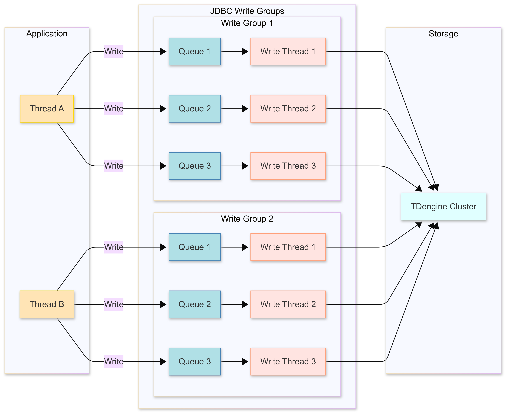

import Tabs from "@theme/Tabs";
import TabItem from "@theme/TabItem";

# 高效写入

为帮助用户轻松构建百万级吞吐量的数据写入管道，TDengine TSDB 连接器提供高效写入的特性。启动高效写入特性后，TDengine TSDB 连接器将自动创建写入线程与专属队列，将数据按子表切分缓存，在达到数据量阈值或超时条件时批量发送，以此减少网络请求、提升吞吐量，让用户无需掌握多线程编程知识和数据切分技巧即可实现高性能写入。

## 高效写入使用方法 {#usage}

下面介绍各连接器高效写入特性的使用方法：

<Tabs defaultValue="java" groupId="lang">
<TabItem label="Java" value="java">

##### JDBC 高效写入特性概述

JDBC 驱动从 `3.6.0` 版本开始，在 WebSocket 连接上提供了高效写入特性。JDBC 驱动高效写入特性有如下特点：

- 支持 JDBC 标准参数绑定接口。
- 在资源充分条件下，写入能力跟写入线程数配置线性相关。
- 支持写入超时和连接断开重连后的重试次数和重试间隔配置。
- 支持调用 `executeUpdate` 接口获取写入数据条数，若写入有异常，此时可捕获。
  
下面详细介绍其使用方法。本节内容假设用户已经熟悉 JDBC 标准参数绑定接口（可参考 [参数绑定](https://docs.oracle.com/javase/8/docs/api/java/sql/PreparedStatement.html)）。

##### 如何开启高效写入特性

对于 JDBC 连接器来说，有两种方式开启高效写入特性：  

- 在连接属性上设置 PROPERTY_KEY_ASYNC_WRITE 为 `stmt` 或者 JDBC URL 中增加 `asyncWrite=stmt` 都可以在此连接上开启高效写入。在连接上开启高效写入特性后，后续所有创建的 `PreparedStatement` 都会使用高效写入模式。
- 在参数绑定创建 `PreparedStatement` 所用的 SQL 中，使用 `ASYNC_INSERT INTO` 而不是 `INSERT INTO`，则可以在这个参数绑定对象上开启高效写入。

##### 如何检查写入是否成功

客户应用使用 JDBC 标准接口的 `addBatch` 添加一条记录，用 `executeBatch` 提交所有添加记录。高效写入模式下，可以使用 **executeUpdate** 方法来同步获取写入成功条数，如果有数据写入失败，此时调用 `executeUpdate` 会捕获到异常。

##### 高效写入重要配置参数

- TSDBDriver.PROPERTY_KEY_BACKEND_WRITE_THREAD_NUM：高效写入模式下，后台写入线程数。仅在使用 WebSocket 连接时生效。默认值为 10。
- TSDBDriver.PROPERTY_KEY_BATCH_SIZE_BY_ROW：高效写入模式下，写入数据的批大小，单位是行。仅在使用 WebSocket 连接时生效。默认值为 1000。
- TSDBDriver.PROPERTY_KEY_CACHE_SIZE_BY_ROW：高效写入模式下，缓存的大小，单位是行。仅在使用 WebSocket 连接时生效。默认值为 10000。

- TSDBDriver.PROPERTY_KEY_ENABLE_AUTO_RECONNECT：是否启用自动重连。仅在使用 WebSocket 连接时生效。true：启用，false：不启用。默认为 false。高效写入模式建议开启。
- TSDBDriver.PROPERTY_KEY_RECONNECT_INTERVAL_MS：自动重连重试间隔，单位毫秒，默认值 2000。仅在 PROPERTY_KEY_ENABLE_AUTO_RECONNECT 为 true 时生效。
- TSDBDriver.PROPERTY_KEY_RECONNECT_RETRY_COUNT：自动重连重试次数，默认值 3，仅在 PROPERTY_KEY_ENABLE_AUTO_RECONNECT 为 true 时生效。

其他配置参数请参考 [高效写入配置](../../reference/connector/java/#properties)。

##### JDBC 高效写入使用说明

下面是一个简单的使用 JDBC 高效写入的例子，说明了高效写入相关的配置和接口。

<details>
<summary>JDBC 高效写入使用样例</summary>
```java
{{#include docs/examples/java/src/main/java/com/taos/example/WSHighVolumeDemo.java:efficient_writing}}
```
</details>

</TabItem>
</Tabs>

## 示例程序 {#sample-code}

### 场景设计 {#scenario}

下面的示例程序展示了如何高效写入数据，场景设计如下：

- TDengine TSDB 客户端程序从其它数据源不断读入数据，在示例程序中采用生成模拟数据的方式来模拟读取数据源，同时提供了从 Kafka 拉取数据写入 TDengine TSDB 的示例。
- 为了提高 TDengine TSDB 客户端程序读取数据速度，使用多线程读取。为了避免乱序，多个读取线程读取数据对应的表集合应该不重叠。
- 为了与每个数据读取线程读取数据的速度相匹配，后台启用一组写入线程与之对应，每个写入线程都有一个独占的固定大小的消息队列。

### 示例代码 {#code}

这一部分是针对以上场景的示例代码。对于其它场景高效写入原理相同，不过代码需要适当修改。

本示例代码假设源数据属于同一张超级表（meters）的不同子表。程序在开始写入数据之前已经在 test 库创建了这个超级表，以及对应的子表。如果实际场景是多个超级表，只需按需创建多个超级表和启动多组任务。

<Tabs defaultValue="java" groupId="lang">
<TabItem label="Java" value="java">

##### 程序清单

| 类名               | 功能说明                                                                                  |
| ------------------ | ----------------------------------------------------------------------------------------- |
| FastWriteExample   | 主程序，完成命令行参数解析，线程池创建，以及等待任务完成功能                              |
| WorkTask           | 从模拟源中读取数据，调用 JDBC 标准接口写入                                                |
| MockDataSource     | 模拟生成一定数量 `meters` 子表的数据                                                      |
| DataBaseMonitor    | 统计写入速度，并每隔 10 秒把当前写入速度打印到控制台                                      |
| CreateSubTableTask | 根据子表范围创建子表，供主程序调用                                                        |
| Meters             | 提供了 `meters` 表单条数据的序列化和反序列化，供发送消息给 Kafka 和 从 Kafka 接收消息使用 |
| ProducerTask       | 生产者，向 Kafka 发送消息                                                                 |
| ConsumerTask       | 消费者，从 Kafka 接收消息，调用 JDBC 高效写入接口写入 TDengine TSDB，并按进度提交 offset       |
| Util               | 提供一些基础功能，包括创建连接，创建 Kafka topic，统计写入条数等                          |

以下是各类的完整代码和更详细的功能说明。

<details>
<summary>FastWriteExample</summary>

##### 主程序命令行参数介绍

```shell
   -b,--batchSizeByRow <arg>             指定高效写入的 batchSizeByRow 参数，默认 1000  
   -c,--cacheSizeByRow <arg>             指定高效写入的 cacheSizeByRow 参数，默认 10000  
   -d,--dbName <arg>                     指定数据库名, 默认 `test`  
      --help                             打印帮助信息  
   -K,--useKafka                         使用 Kafka，采用创建生产者发送消息，消费者接收消息写入 TDengine TSDB 方式。否则采用工作线程订阅模拟器生成数据写入 TDengine TSDB 方式  
   -r,--readThreadCount <arg>            指定工作线程数，默认 5，当 Kafka 模式，此参数同时决定生产者和消费者线程数  
   -R,--rowsPerSubTable <arg>            指定每子表写入行数，默认 100  
   -s,--subTableNum <arg>                指定子表总数，默认 1000000  
   -w,--writeThreadPerReadThread <arg>   指定每工作线程对应写入线程数，默认 5  
```

##### JDBC URL 和 Kafka 集群地址配置

1. JDBC URL 通过环境变量配置，例如：`export TDENGINE_JDBC_URL="jdbc:TAOS-WS://localhost:6041?user=root&password=taosdata"`
2. Kafka 集群地址通过环境变量配置，例如： `KAFKA_BOOTSTRAP_SERVERS=localhost:9092`

##### 使用方式

```shell
1. 采用模拟数据写入方式：java -jar highVolume.jar -r 5 -w 5 -b 10000 -c 100000 -s 1000000 -R 1000
2. 采用 Kafka 订阅写入方式：java -jar highVolume.jar -r 5 -w 5 -b 10000 -c 100000 -s 1000000 -R 100 -K
```

##### 主程序负责

1. 解析命令行参数
2. 创建子表
3. 创建工作线程或 Kafka 生产者，消费者
4. 统计写入速度
5. 等待写入结束，释放资源

```java
{{#include docs/examples/JDBC/highvolume/src/main/java/com/taos/example/highvolume/FastWriteExample.java}}
```

</details>

<details>
<summary>WorkTask</summary>

工作线程负责从模拟数据源读数据。每个读任务都关联了一个模拟数据源。每个模拟数据源可生成某个子表区间的数据。不同的模拟数据源生成不同表的数据。  
工作线程采用阻塞的方式调用 JDBC 标准接口 `addBatch`。也就是说，一旦对应高效写入后端队列满了，写操作就会阻塞。

```java
{{#include docs/examples/JDBC/highvolume/src/main/java/com/taos/example/highvolume/WorkTask.java}}
```

</details>

<details>
<summary>MockDataSource</summary>

模拟数据生成器，生成一定子表范围的数据。为了模拟真实情况，采用轮流每个子表一条数据的生成方式。

```java
{{#include docs/examples/JDBC/highvolume/src/main/java/com/taos/example/highvolume/MockDataSource.java}}
```

</details>

<details>
<summary>CreateSubTableTask</summary>

根据子表范围创建子表，采用批量拼 sql 创建方式。

```java
{{#include docs/examples/JDBC/highvolume/src/main/java/com/taos/example/highvolume/CreateSubTableTask.java}}
```

</details>

<details>
<summary>Meters</summary>

数据模型类，提供了发送到 Kafka 的序列化和反序列化方法。

```java
{{#include docs/examples/JDBC/highvolume/src/main/java/com/taos/example/highvolume/Meters.java}}
```

</details>

<details>
<summary>ProducerTask</summary>

消息生产者，采用与 JDBC 高效写入不同的 Hash 方式，将模拟数据生成器生成的数据，写入所有分区。

```java
{{#include docs/examples/JDBC/highvolume/src/main/java/com/taos/example/highvolume/ProducerTask.java}}
```

</details>

<details>
<summary>ConsumerTask</summary>

消息消费者，从 Kafka 接收消息，写入 TDengine TSDB。

```java
{{#include docs/examples/JDBC/highvolume/src/main/java/com/taos/example/highvolume/ConsumerTask.java}}
```

</details>

<details>
<summary>StatTask</summary>

提供定时统计写入条数功能

```java
{{#include docs/examples/JDBC/highvolume/src/main/java/com/taos/example/highvolume/StatTask.java}}
```

</details>

<details>
<summary>Util</summary>

工具类，提供连接创建，数据库创建和 topic 创建等功能。

```java
{{#include docs/examples/JDBC/highvolume/src/main/java/com/taos/example/highvolume/Util.java}}
```

</details>

##### 执行步骤

<details>
<summary>执行 Java 示例程序</summary>

##### 本地集成开发环境执行示例程序

1. clone TDengine 仓库

   ```bash
   git clone git@github.com:taosdata/TDengine.git --depth 1
   ```

2. 用集成开发环境打开 `TDengine/docs/examples/JDBC/highvolume` 目录。
3. 在开发环境中配置环境变量 `TDENGINE_JDBC_URL`。如果已配置了全局的环境变量 `TDENGINE_JDBC_URL` 可跳过这一步。
4. 如果要运行 Kafka 示例，需要设置 Kafka 集群地址的环境变量 `KAFKA_BOOTSTRAP_SERVERS`。
5. 指定命令行参数，如 `-r 3 -w 3 -b 100 -c 1000 -s 1000 -R 100`
6. 运行类 `com.taos.example.highvolume.FastWriteExample`。

##### 远程服务器上执行示例程序

若要在服务器上执行示例程序，可按照下面的步骤操作：

1. 打包示例代码。在目录 `TDengine/docs/examples/JDBC/highvolume` 下执行下面命令来生成 `highVolume.jar`：

   ```java
   mvn package
   ```

2. 复制程序到服务器指定目录：

   ```shell
   scp -r .\target\highVolume.jar <user>@<host>:~/dest-path
   ```

3. 配置环境变量。
   编辑 `~/.bash_profile` 或 `~/.bashrc` 添加如下内容例如：

   ```shell
   export TDENGINE_JDBC_URL="jdbc:TAOS-WS://localhost:6041?user=root&password=taosdata"
   ```

   以上使用的是本地部署 TDengine TSDB Server 时默认的 JDBC URL。你需要根据自己的实际情况更改。  
   如果想使用 Kafka 订阅模式，请再增加 Kafaka 集群环境变量配置：

   ```shell
   export KAFKA_BOOTSTRAP_SERVERS=localhost:9092
   ```

4. 用 Java 命令启动示例程序，命令模板（如果用 Kafaka 订阅模式，最后可以加上 `-K`）：

   ```java
   java -jar highVolume.jar -r 5 -w 5 -b 10000 -c 100000 -s 1000000 -R 1000
   ```

5. 结束测试程序。测试程序不会自动结束，在获取到当前配置下稳定的写入速度后，按 <kbd>CTRL</kbd> + <kbd>C</kbd> 结束程序。
   下面是一次实际运行的日志输出，机器配置 40 核 + 256G + 固态硬盘。

   ```shell
   ---------------$ java -jar highVolume.jar -r 2 -w 10 -b 10000 -c 100000 -s 1000000 -R 100
   [INFO ] 2025-03-24 18:03:17.980 com.taos.example.highvolume.FastWriteExample main 309 main readThreadCount=2, writeThreadPerReadThread=10 batchSizeByRow=10000 cacheSizeByRow=100000, subTableNum=1000000, rowsPerSubTable=100
   [INFO ] 2025-03-24 18:03:17.983 com.taos.example.highvolume.FastWriteExample main 312 main create database begin.
   [INFO ] 2025-03-24 18:03:34.499 com.taos.example.highvolume.FastWriteExample main 315 main create database end.
   [INFO ] 2025-03-24 18:03:34.500 com.taos.example.highvolume.FastWriteExample main 317 main create sub tables start.
   [INFO ] 2025-03-24 18:03:34.502 com.taos.example.highvolume.FastWriteExample createSubTables 73 main create sub table task started.
   [INFO ] 2025-03-24 18:03:55.777 com.taos.example.highvolume.FastWriteExample createSubTables 82 main create sub table task finished.
   [INFO ] 2025-03-24 18:03:55.778 com.taos.example.highvolume.FastWriteExample main 319 main create sub tables end.
   [INFO ] 2025-03-24 18:03:55.781 com.taos.example.highvolume.WorkTask run 41 FW-work-thread-2 started
   [INFO ] 2025-03-24 18:03:55.781 com.taos.example.highvolume.WorkTask run 41 FW-work-thread-1 started
   [INFO ] 2025-03-24 18:04:06.580 com.taos.example.highvolume.StatTask run 36 pool-1-thread-1 numberOfTable=1000000 count=12235906 speed=1223590
   [INFO ] 2025-03-24 18:04:17.531 com.taos.example.highvolume.StatTask run 36 pool-1-thread-1 numberOfTable=1000000 count=31185614 speed=1894970
   [INFO ] 2025-03-24 18:04:28.490 com.taos.example.highvolume.StatTask run 36 pool-1-thread-1 numberOfTable=1000000 count=51464904 speed=2027929
   [INFO ] 2025-03-24 18:04:40.851 com.taos.example.highvolume.StatTask run 36 pool-1-thread-1 numberOfTable=1000000 count=71498113 speed=2003320
   [INFO ] 2025-03-24 18:04:51.948 com.taos.example.highvolume.StatTask run 36 pool-1-thread-1 numberOfTable=1000000 count=91242103 speed=1974399
   ```

</details>

</TabItem>
</Tabs>

## 写入性能关键要素 {#key-factors}

### 客户端程序方面 {#application-view}

从客户端程序的角度来说，高效写入数据要考虑以下几个因素：

1. **批量写入**：通常情况下，每批次写入的数据量越大越高效（但超过一定阈值其优势会消失）。使用 SQL 写入 TDengine 时，尽量在单条 SQL 中拼接更多数据。当前，TDengine 支持的单条 SQL 最大长度为 **1MB**（1,048,576 字符）。
2. **多线程写入**：在系统资源未达瓶颈前，写入线程数增加可提升吞吐量（超过阈值后性能可能因服务端处理能力限制而下降）。推荐为每个写入线程分配独立连接，以减少连接资源的竞争。
3. **写入相邻性**：数据在不同表（或子表）之间的分布，即要写入数据的相邻性。一般来说，每批次只向同一张表（或子表）写入数据比向多张表（或子表）写入数据要更高效。
4. **提前建表**：提前建表可以提高写入性能，因为后续不需要检查表是否存在，且写入时可以不传标签列的数据，提高性能。
5. **写入方式**：
   - 参数绑定写入比 SQL 写入更高效。因参数绑定方式避免了 SQL 解析。
   - SQL 写入不自动建表比自动建表更高效。因自动建表要频繁检查表是否存在。
   - SQL 写入比无模式写入更高效。因无模式写入会自动建表且支持动态更改表结构。
6. **避免乱序**：相同子表的数据需按时间戳升序提交。乱序数据会导致服务端执行额外的排序操作，影响写入性能。
7. **开启压缩**：当网络带宽成为瓶颈，或写入数据存在大量重复时，启用压缩可有效提升整体性能。

客户端程序要充分且恰当地利用以上几个因素。比如选择参数绑定写入方式，提前建好子表，在单次写入中尽量只向同一张表（或子表）写入数据，每批次写入的数据量和并发写入的线程数经过测试和调优后设定为一个最适合当前系统处理能力的数值，一般可以实现在当前系统中的最佳写入速度。

### 数据源方面 {#datasource-view}

客户端程序通常需要从数据源读取数据再写入 TDengine TSDB。从数据源角度来说，以下几种情况需要在读线程和写线程之间增加队列：

1. 有多个数据源，单个数据源生成数据的速度远小于单线程写入的速度，但数据量整体比较大。此时队列的作用是把多个数据源的数据汇聚到一起，增加单次写入的数据量。
2. 单个数据源生成数据的速度远大于单线程写入的速度。此时队列的作用是增加写入的并发度。
3. 单张表的数据分散在多个数据源。此时队列的作用是将同一张表的数据提前汇聚到一起，提高写入时数据的相邻性。

如果写应用的数据源是 Kafka, 写应用本身即 Kafka 的消费者，则可利用 Kafka 的特性实现高效写入。比如：

1. 将同一张表的数据写到同一个 Topic 的同一个 Partition，增加数据的相邻性。
2. 通过订阅多个 Topic 实现数据汇聚。
3. 通过增加 Consumer 线程数增加写入的并发度。
4. 通过增加每次 Fetch 的最大数据量来增加单次写入的最大数据量。

### 服务端配置方面 {#setting-view}

首先看数据库建库参数中的几个重要性能相关参数：

1. **vgroups**：在服务端配置层面，创建数据库时，需综合考虑系统内磁盘数量、磁盘 I/O 能力以及处理器能力，合理设置 vgroups 数量，从而充分挖掘系统性能潜力。若 vgroups 数量过少，系统性能将难以充分释放；若数量过多，则会引发不必要的资源竞争。建议将每个 vgroup 中的表数量控制在 100 万以内，在硬件资源充足的情况下，控制在 1 万以内效果更佳。
1. **buffer**：buffer 指的是为一个 vnode 分配的写入内存大小，默认值为 256 MB。当 vnode 中实际写入的数据量达到 buffer 大小的约 1/3 时，会触发数据落盘操作。适当调大该参数，能够尽可能多地缓存数据，实现一次性落盘，提高写入效率。然而，若参数配置过大，在系统宕机恢复时，恢复时间会相应变长。
2. **cachemodel**：用于控制是否在内存中缓存子表的最近数据。开启此功能会对写入性能产生一定影响，因为在数据写入过程中，系统会同步检查并更新每张表的 last_row 和每列的 last 值。可通过将原选项 'both' 调整为‘last_row’或‘last_value’，来减轻其对写入性能的影响。
3. **stt_trigger**：用于控制 TSDB 数据落盘策略以及触发后台合并文件的文件个数。企业版的默认配置为 2，而开源版仅能配置为 1。当 stt_trigger = 1 时，适用于表数量少但写入频率高的场景；当 stt_trigger > 1 时，则更适合表数量多但写入频率低的场景。  

其他参数请参考 [数据库管理](../../reference/taos-sql/database)。

然后看 `taosd` 配置中的几个性能相关参数：

1. **compressMsgSize**：对于带宽是瓶颈的情况，开启 rpc 消息压缩可以提升性能。
2. **numOfCommitThreads**：服务端后台落盘线程个数，默认为 4。落盘线程数并非越多越好。线程越多，硬盘写入争抢越严重，写入性能反而可能下降。配置了多块盘的服务器可以考虑将此参数放大，从而利用多块硬盘的并发 IO 能力。
3. **日志级别**：以 `debugFlag` 为代表的一批参数，控制相关日志输出级别。日志级别决定日志输出压力，开的日志级别越高，对写入性能的影响越大，一般建议默认配置。  

其他参数请参考 [服务端配置](../../reference/components/taosd)。

## 高效写入实现原理 {#implement-principle}

通过上文的写入性能影响因素可知，开发高性能数据写入程序需掌握多线程编程与数据切分技术，存在一定技术门槛。为降低用户开发成本，TDengine TSDB 连接器提供**高效写入特性**，支持用户在不涉及底层线程管理与数据分片逻辑的前提下，充分利用 TDengine TSDB 强大的写入能力。

下面是连接器实现高效写入特性的原理图：


### 设计原理

- **自动线程与队列创建**：
   连接器根据配置参数动态创建独立的写入线程及对应的写入队列，每个队列与子表一一绑定，形成“子表数据 - 专属队列 - 独立线程”的处理链路。
- **数据分片与批量触发**：
   当应用写入数据时，连接器自动按子表维度切分数据，缓存至对应队列。当满足以下任一条件时触发批量发送：
   1. 队列数据量达到预设阈值。
   2. 达到预设的等待超时时间（避免延迟过高）。

   此机制通过减少网络请求次数，显著提升写入吞吐量。

### 功能优势

- **单线程高性能写入**：
   应用层只需通过单线程调用写入接口，连接器底层自动实现多线程并发处理，性能可接近传统客户端多线程写入能力，完全屏蔽底层线程管理复杂度。
- **可靠性增强机制**：
   1. 同步校验接口：提供同步方法确保已提交数据的写入成功状态可追溯；
   2. 连接自愈能力：支持连接断开后的自动重连，结合超时重试策略（可配置重试次数与间隔），保障数据不丢失；
   3. 错误隔离设计：单个队列或线程异常不影响其他子表的数据写入，提升系统容错性。

:::note
连接器高效写入特性仅支持写入超级表，不支持写入普通表。
:::
