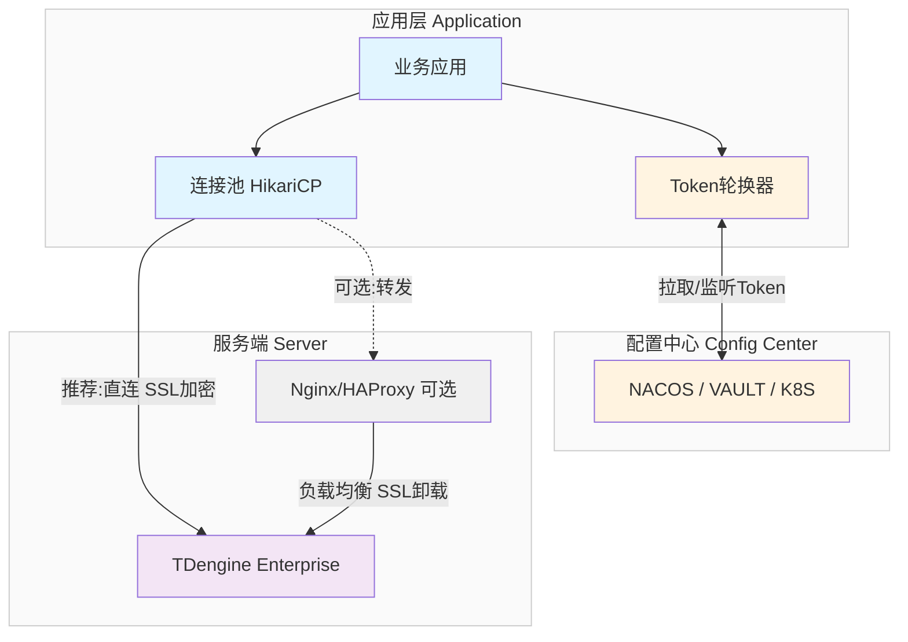
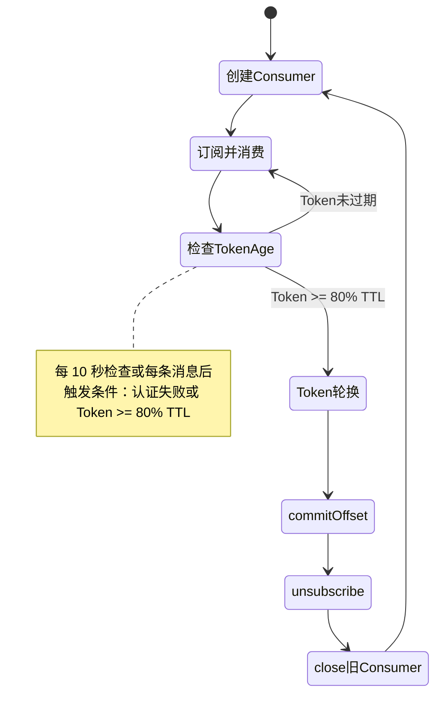

import Tabs from "@theme/Tabs";
import TabItem from "@theme/TabItem";

# 连接器安全最佳实践

本指南介绍 TDengine 连接器的安全最佳实践，包括 Token 认证、SSL/TLS 客户端配置、动态 Token 轮换以及各语言连接器的实现示例。

---

## 1. 安全架构设计

### 1.1 为什么需要安全架构

#### 安全威胁

在不可信的网络环境中，TDengine 连接面临以下安全威胁：

- **数据泄露**：敏感时序数据在传输过程中被窃取
- **中间人攻击**：攻击者冒充服务端或客户端，窃取或篡改数据
- **凭证泄露**：用户名/密码硬编码在代码中，泄露后无法快速撤销
- **重放攻击**：捕获并重放合法请求，执行未授权操作

#### 设计目标

TDengine 连接器安全架构的设计目标：

- **机密性**：所有数据传输加密，防止窃听
- **完整性**：防止数据在传输中被篡改
- **可用性**：Token 轮换确保业务连续性，避免服务中断
- **可审计性**：Token 独立追踪，支持访问审计
- **最小权限**：不同应用使用不同 Token，权限隔离

### 1.2 三层组件架构

TDengine 连接器安全架构由以下三层组成：

1. **应用层**：业务应用管理连接池和 Token 生命周期，包括业务应用（执行 SQL、参数绑定、无模式写入、数据订阅）、连接池（HikariCP 等管理物理连接）、Token 轮换器（监听配置中心变更，更新 Token）。

2. **配置中心**：集中存储和分发 Token，支持 Nacos、Vault、K8s Secret，动态推送 Token 更新，多实例共享配置。

3. **服务端**：TDengine 企业版，验证 Token 有效性，处理加密请求，可选 Nginx/HAProxy 负载均衡。

### 1.3 整体架构图



### 1.4 核心设计原则

#### 1. WebSocket + Token + SSL

TDengine 连接器安全架构基于：

- **WebSocket 连接**：跨平台支持；高性能、稳定；支持 SSL/TLS 加密
- **Token 认证**：替代用户名/密码；有 TTL（24 小时），过期自动失效；可主动撤销，安全性高；支持动态轮换，避免服务中断
- **SSL/TLS 加密**：客户端验证服务端证书，防止中间人攻击；所有数据加密传输

#### 2. 连接器直连优于 Nginx 转发

| 维度 | 方案 A：Nginx 转发 | 方案 B：连接器直连（推荐） |
|------|-------------------|-------------------------|
| **负载均衡** | Nginx/HAProxy | 连接器内置算法 |
| **SSL 处理** | Nginx SSL 卸载 | 客户端直连 SSL |
| **故障转移** | 5-10 秒检测 | **自动重连，业务无感知** |
| **性能** | 增加 1 跳延迟 | **极致性能** |
| **证书管理** | 集中管理 | 多节点配置 |
| **TMQ 稳定性** | 存在不稳定 | **更稳定** |
| **运维复杂度** | 需要额外组件 | **配置简单** |

**选择建议**：

- 优先使用**方案 B（连接器直连）**
- 仅在以下场景选择**方案 A（Nginx 转发）**：
  - 需要与现有基础设施集成
  - 需要集中管理证书
  - 需要统一的入口管控

#### 3. Token 动态轮换确保业务连续性

Token 有 TTL（通常 24 小时），过期后连接将失败。动态 Token 轮换机制确保：

- Token 过期前自动更新（80% TTL 触发）
- 业务无感知切换
- 失败自动回滚

---

## 2. SSL/TLS 配置

启用 SSL/TLS 可确保数据在传输过程中的机密性和完整性。

:::info 配置分工

- **服务端配置**：证书生成、taosAdapter SSL 配置（`taosadapter.toml`），请参考 [SSL 配置指南](./ssl-configuration-guide.md)
- **客户端配置**：TrustStore 配置、SSL 连接参数，在本章说明
:::

### 2.1 证书验证原理

客户端在建立 SSL/TLS 连接时，会验证服务端证书：

1. **证书链验证**：服务端证书是否由可信 CA 签发
2. **主机名验证**：证书中的 CN 或 SAN 是否与连接的主机名/IP 匹配
3. **有效期验证**：证书是否在有效期内
4. **吊销状态验证**：证书是否已被吊销（可选）

### 2.2 客户端 SSL/TLS 配置

<Tabs defaultValue="java" groupId="lang">
<TabItem value="java" label="Java">

Java 使用 `truststore` 存储可信证书。建议优先使用独立 truststore，避免污染系统默认证书库。

**导入服务端证书：**

```bash
# 方式一：导入到 JVM 系统证书库（需先正确设置 JAVA_HOME）
sudo keytool -import -alias tdengine-server \
  -file /etc/taos/server.crt \
  -keystore $JAVA_HOME/lib/security/cacerts \
  -storepass changeit -noprompt

# 方式二（推荐）：创建独立 truststore
keytool -import -alias tdengine-server \
  -file server.crt \
  -keystore ./tdengine-truststore.jks \
  -storepass tdengine -noprompt

# 查看导入结果
keytool -list -keystore ./tdengine-truststore.jks -storepass tdengine
```

**运行 Java 应用时指定 truststore：**

```bash
java -Djavax.net.ssl.trustStore=/path/to/tdengine-truststore.jks \
     -Djavax.net.ssl.trustStorePassword=tdengine \
     -jar your-app.jar
```

**验证 SSL 连接：**

```bash
# 使用 openssl 验证服务端 SSL 配置
openssl s_client \
  -connect td1.internal.taosdata.com:6041 \
  -servername td1.internal.taosdata.com \
  -CAfile ./server.crt \
  -verify_hostname td1.internal.taosdata.com \
  -verify_return_error < /dev/null

# 预期输出正常无错误
Verify return code: 0 (ok)
```

</TabItem>

<TabItem label="Python" value="python">

Python 推荐使用 WebSocket 连接器 `taosws`，通过 `wss://` 自动启用 SSL/TLS。

```python
import taosws

# 方式一：仅启用 SSL/TLS
conn = taosws.connect(
    url="wss://td1.internal.taosdata.com:6041/mydb"
)

# 方式二：SSL/TLS + Bearer Token
conn = taosws.connect(
    url="wss://td1.internal.taosdata.com:6041/mydb",
    bearer_token="your_token_here"
)
```

- `wss://`：WebSocket Secure，自动启用 SSL/TLS
- `ws://`：不加密连接

</TabItem>
<TabItem label="Go" value="go">

Go 推荐使用 `taosWS` 驱动，`wss(...)` 自动启用 SSL/TLS。

**基础连接：**

```go
package main

import (
    "database/sql"
    _ "github.com/taosdata/driver-go/v3/taosWS"
)

func main() {
    dsn := "root:taosdata@wss(td1.internal.taosdata.com:6041)/mydb"
    db, err := sql.Open("taosWS", dsn)
    if err != nil {
        panic(err)
    }
    defer db.Close()

    // Bearer Token（认证优先级高于用户名/密码）
    dsn = "wss://td1.internal.taosdata.com:6041/mydb?bearerToken=your_token_here"
    _, _ = sql.Open("taosWS", dsn)
}
```

- `wss(host:port)`：WebSocket Secure，自动启用 SSL/TLS
- `ws(host:port)`：不加密连接

</TabItem>

<TabItem value="rust" label="Rust">

:::info
Rust 客户端 SSL 配置示例即将推出。
:::

</TabItem>

<TabItem value="nodejs" label="Node.js">

Node.js 连接器目前使用 WebSocket 协议，`wss://` 自动启用 SSL/TLS。

```javascript
const taos = require('@tdengine/websocket');

let dsn = 'wss://localhost:6041';
async function createConnect() {
    let conf = new taos.WSConfig(dsn);
    conf.setUser('root');
    conf.setPwd('taosdata');
    conf.setDb('test');
    return await taos.sqlConnect(conf);
}
```

**Bearer Token 认证：**

```javascript
let dsn = 'wss://localhost:6041/test?bearerToken=your_token_here';
```

**验证配置：**

```bash
openssl s_client -connect localhost:6041 -showcerts
```

</TabItem>

<TabItem value="csharp" label="C#">

推荐使用 TDengine.Connector 3.2.0+（WebSocket）。

```csharp
using TDengine.Driver;
using TDengine.Connection;

var connectionString = "protocol=WebSocket;" +
                       "host=localhost;" +
                       "port=6041;" +
                       "useSSL=true;" +
                       "username=root;" +
                       "password=taosdata";

var client = new TDengineClient(connectionString);
```

**Bearer Token 认证（3.1.10+）：**

```csharp
var connectionString = "protocol=WebSocket;" +
                       "host=localhost;" +
                       "port=6041;" +
                       "useSSL=true;" +
                       "bearerToken=your_token_here";

var client = new TDengineClient(connectionString);
```

</TabItem>

<TabItem value="c" label="C">

:::info
C 客户端 SSL 配置示例即将推出。
:::

</TabItem>

<TabItem value="rest" label="REST API">

**使用 curl 进行 HTTPS 连接：**

```bash
curl -L -H "Authorization: Bearer your_token_here"  --cacert /etc/taos/server.crt   -d "show databases;"   https://localhost:6041/rest/sql
```

</TabItem>
</Tabs>

## 3. Token 认证

### 3.1 为什么使用 Token

Token 认证是 TDengine Enterprise 提供的一种轻量级身份验证机制，相比传统的用户名/密码方式具有以下优势：

- **限时有效性**：Token 有 TTL（生存时间），过期自动失效
- **可撤销性**：可以主动撤销 Token，立即停止访问权限
- **最小权限**：可为不同应用创建不同权限的 Token
- **审计友好**：每个 Token 可独立追踪使用情况

### 3.2 创建 Token

```sql
-- 创建 Token，有效期 1 天
CREATE TOKEN my_app_token FROM USER root ENABLE 1 PROVIDER 'root' TTL 1;

-- 查询当前用户创建的 Token
SHOW TOKENS;
```

### 3.3 使用 Token 连接

**Token 认证是推荐的方式**，相比用户名/密码认证具有更高的安全性。

使用 Token 认证时，只需要设置 Token 参数，**无需设置用户名和密码**。

---

## 4. 动态 Token 轮换

### 4.1 轮换场景概述

Token 有有效期限制（通常 24 小时），过期后连接将失败。动态 Token 轮换确保业务连续性。

**两种轮换场景：**

1. **普通连接**（执行 SQL、参数绑定、无模式写入）
   - 依赖连接池（如 HikariCP）的 `maxLifetime` 机制
   - 新连接使用新 Token，旧连接自然淘汰
   - 业务无感知

2. **数据订阅**（TMQ Consumer）
   - 需要主动重建 Consumer
   - 轮换前必须 commit offset
   - 优雅切换避免消息丢失

### 4.2 普通连接 Token 轮换

#### 轮换原理

连接池管理的物理连接有生命周期（`maxLifetime`），Token 轮换利用这一机制：配置中心 Token 更新后监听器收到通知 → 更新连接池配置中的 Token → 新建连接使用新 Token → 旧连接在 `maxLifetime` 到期后自然淘汰 → 业务无感知切换。

#### 轮换策略

**提前轮换**：在 Token 过期前 20% 时间发起轮换。例如 Token TTL = 24 小时时，在第 19-20 小时触发轮换（80% TTL），新 Token 生效后旧 Token 继续有效 5 分钟（宽限期）。

**灰度验证**：新 Token 生成后先在少量连接上验证，确认新 Token 有效后再全面切换，失败时自动回滚到旧 Token。

**回滚机制**：轮换失败时记录错误日志、发送告警通知、自动回滚到旧 Token、延迟 1 小时后重试。

#### 配置中心集成：Nacos

**Nacos 服务端部署：**

```bash
# 下载并启动 Nacos，示例使用 standalone 方式，正式环境请使用集群
cd /tmp
wget https://github.com/alibaba/nacos/releases/download/2.3.2/nacos-server-2.3.2.zip
unzip nacos-server-2.3.2.zip
cd nacos/bin
./startup.sh -m standalone

# 验证启动成功
curl http://localhost:8848/nacos/v1/ns/instance/list?serviceName=nacos
```

**写入 Token 到 Nacos：**

```bash
# 创建配置
curl -X POST "http://localhost:8848/nacos/v1/cs/configs" \
  -d "dataId=tdengine-credential" \
  -d "group=DEFAULT_GROUP" \
  -d "content=token=your_new_token_here"
```

**从 Nacos 读取 Token：**

```java
import com.alibaba.nacos.api.NacosFactory;
import com.alibaba.nacos.api.config.ConfigService;
import com.alibaba.nacos.api.config.listener.Listener;

// 创建 Nacos 配置服务
ConfigService nacos = NacosFactory.createConfigService("localhost:8848");

// 读取 Token
String config = nacos.getConfig("tdengine-credential", "DEFAULT_GROUP", 5000);
if (config == null || config.isEmpty()) {
    throw new IllegalStateException("Nacos 配置为空");
}
String token = "";
for (String line : config.split("\n")) {
    line = line.trim();
    if (line.startsWith("token=")) {
        token = line.substring("token=".length()).trim();
        break;
    }
}
if (token.isEmpty()) {
    throw new IllegalStateException("Nacos 配置中未找到 token=");
}
```

**添加监听器，Token 变化时自动轮换连接池：**

```java
{{#include docs/examples/JDBC/JDBCDemo/src/main/java/com/taos/example/security/NacosSecurityDemo.java:nacos-listener}}
```

### 4.3 数据订阅 Token 轮换

#### 轮换原理

TMQ Consumer 需要主动重建来实现 Token 轮换：定期检查 Token Age（每 10 秒或每条消息后）→ 达到 80% TTL 或认证失败时触发轮换 → **先 commit offset**（避免重复消费）→ unsubscribe 订阅 → close 旧 Consumer → 使用新 Token 创建新 Consumer → 重新订阅继续消费。

#### 轮换流程

**TMQ Token 轮换状态机：**



#### 实现要点

**轮换触发条件**：主动触发为 Token Age >= 80% TTL，被动触发为认证失败（错误码 0x80000357）。

**Offset 提交时机**：轮换前**必须先 commit offset**，否则会重复消费已处理的消息。

**优雅切换**：commit offset → unsubscribe → close → 获取新 Token → 创建新 Consumer → subscribe，失败时记录日志、发送告警、回滚到旧 Token。

### 4.4 实现可靠性与资源回收要求

动态轮换代码的稳定性主要取决于资源生命周期管理，建议把以下规则作为实现基线：

1. **Listener 执行器复用**：`getExecutor()` 返回共享线程池，不能在每次回调时新建线程池。
2. **Listener 必须解绑**：应用退出或示例步骤结束时调用 `removeListener`，避免回调对象泄漏。
3. **连接池恢复双向清理**：恢复成功后关闭旧池；恢复失败时关闭新建但未切换的池。
4. **TMQ skip 分支也要 close**：`buildConsumer` 成功但 `subscribe` 失败（如 topic 不存在）时，必须立即关闭 consumer。
5. **统一退出清理**：scheduler、listener executor、pool、consumer 统一在 `finally` 中幂等关闭并打印日志。

---

## 5. 连接器实现

本节提供各语言连接器的完整实现示例。

### 5.1 基础连接（Token + SSL）

<Tabs defaultValue="java" groupId="lang">
<TabItem value="java" label="Java">

```java
{{#include docs/examples/JDBC/JDBCDemo/src/main/java/com/taos/example/security/SecurityPoolDemo.java:basic-connect}}
```

**关键参数：**

- `bearerToken`：Bearer Token（WebSocket 连接专用）
- `useSSL`：启用 SSL/TLS

</TabItem>
<TabItem label="Go" value="go">

```go
package main

import (
    "database/sql"
    "fmt"
    "log"
    _ "github.com/taosdata/driver-go/v3/taosWS"
)

func main() {
    dsn := "wss://td1.internal.taosdata.com:6041/mydb?bearerToken=your_token_here"

    db, err := sql.Open("taosWS", dsn)
    if err != nil {
        log.Fatal(err)
    }
    defer db.Close()

    var version string
    err = db.QueryRow("SELECT SERVER_VERSION()").Scan(&version)
    if err != nil {
        log.Fatal(err)
    }
    fmt.Println("Server version:", version)
}
```

**关键参数：**

- `wss://`：WebSocket Secure 协议，自动启用 SSL/TLS
- `bearerToken`：Bearer Token 认证

</TabItem>
<TabItem label="Python" value="python">

```python
import taosws

conn = taosws.connect(
    url="wss://td1.internal.taosdata.com:6041/mydb",
    bearer_token="your_token_here"
)

cursor = conn.cursor()
cursor.execute("SELECT SERVER_VERSION()")
result = cursor.fetchone()
print(f"Server version: {result[0]}")

cursor.close()
conn.close()
```

**关键参数：**

- `url`：使用 `wss://` 协议启用 SSL/TLS
- `bearer_token`：Bearer Token 认证

</TabItem>
</Tabs>

### 5.2 普通连接 Token 轮换

<Tabs defaultValue="java" groupId="lang">
<TabItem value="java" label="Java">

**连接池配置**（`maxLifetime` 设为 Token TTL 的 1/2，连接到期自然淘汰，新连接使用最新 Token）：

```java
{{#include docs/examples/JDBC/JDBCDemo/src/main/java/com/taos/example/security/SecurityPoolDemo.java:pool-config}}
```

**Token 轮换**（Nacos 监听器收到新 Token 时调用，新建池后关闭旧池）：

```java
{{#include docs/examples/JDBC/JDBCDemo/src/main/java/com/taos/example/security/SecurityPoolDemo.java:token-refresh}}
```

**Nacos 监听器集成**：

```java
{{#include docs/examples/JDBC/JDBCDemo/src/main/java/com/taos/example/security/NacosSecurityDemo.java:nacos-listener}}
```

</TabItem>
</Tabs>

### 5.3 数据订阅 Token 轮换

<Tabs defaultValue="java" groupId="lang">
<TabItem value="java" label="Java">

**Consumer 构建**（WebSocket + SSL + Token 参数配置）：

```java
{{#include docs/examples/JDBC/JDBCDemo/src/main/java/com/taos/example/security/SecurityTmqDemo.java:consumer-build}}
```

**消费循环（含主动轮换 + 认证失败回退）**：

```java
{{#include docs/examples/JDBC/JDBCDemo/src/main/java/com/taos/example/security/SecurityTmqDemo.java:tmq-rotation}}
```

</TabItem>
</Tabs>

---

## 6. 进阶主题

### 6.1 性能优化

#### SSL/TLS 优化

##### 证书选择

| 证书类型 | 密钥长度 | 性能 | 安全性 | 推荐场景 |
|---------|----------|------|--------|----------|
| **RSA** | 2048 位 | 中 | 高 | 通用场景 |
| **RSA** | 4096 位 | 低 | 极高 | 高安全要求 |
| **ECC** | 256 位 | 高 | 高 | **推荐**（性能最优） |
| **ECC** | 384 位 | 中 | 极高 | 兼容性优先 |

**建议**：优先使用 ECC 证书（如 ECDSA P-256），相比 RSA 4096：

- 握手时间减少 50-70%
- CPU 占用降低 60%
- 证书体积更小（传输更快）

##### TLS Session Resumption

启用会话恢复可减少完整握手次数：

```ini
# TDengine 服务端配置（如支持）
sslSessionCache     internal
sslSessionCacheSize 10000
sslSessionTimeout   3600
```

效果：

- 首次握手：~100ms
- 会话恢复：~10ms（**减少 90%**）

##### 密码套件优化

禁用弱密码套件，优先使用高性能算法：

```ini
# 推荐优先级
1. TLS_AES_128_GCM_SHA256       (TLS 1.3，最快)
2. TLS_CHACHA20_POLY1305_SHA256 (ARM 优化)
3. TLS_AES_256_GCM_SHA384       (兼容性好)
```

#### 连接池优化

##### HikariCP 配置建议

| 参数 | 推荐值 | 说明 |
|------|--------|------|
| `maximumPoolSize` | 10-20 | 根据 CPU 核心数和并发量调整 |
| `minimumIdle` | 2-5 | 保持最小空闲连接，避免冷启动 |
| `maxLifetime` | **Token TTL / 2** | 关键参数：确保连接不会存活超过 Token |
| `connectionTimeout` | 30000 | 30 秒获取连接超时 |
| `keepaliveTime` | 60000 | 1 分钟保活，检测死连接 |
| `connectionTestQuery` | 不设置 | 不设置时，会用 JDBC 的 `isValid` 来检测连接有效性 |

### 6.2 证书管理最佳实践

#### 1. 通配符证书

推荐使用通配符证书（`*.yourdomain.com`）：**优点**是一张证书覆盖所有子域名、降低证书管理复杂度、减少证书更新频率；**限制**是仅支持同级子域名（*.a.example.com 不支持 b.a.example.com）、私钥泄漏影响范围更大。

#### 2. 证书自动化分发

```bash
# 1. 使用 CFSSL 或 cert-manager 自动生成证书
cfssl gencert -ca ca.crt -ca-key ca.key \
    -config ca-config.json \
    -hostname="td1.example.com,td2.example.com" \
    -profile=server server-csr.json | cfssljson -bare server

# 2. 自动部署到 TDengine 服务器
ansible-playbook deploy-ssl.yml --extra-vars "host=td1.example.com"

# 3. 自动重启服务
systemctl restart taosd
```

#### 3. 证书监控

```bash
# 定期检查证书过期时间
for host in td1 td2 td3; do
    expiry=$(echo | openssl s_client -connect $host.example.com:6041 2>/dev/null \
        | openssl x509 -noout -enddate | cut -d= -f2)
    echo "$host: $expiry"
done

# 集成到监控系统（Prometheus/Zabbix）
# 提前 30 天告警
```

---

## 7. 安全检查清单

在生产环境部署前，请确认以下安全措施：

### 传输加密

- [ ] **启用 SSL/TLS**：所有连接（JDBC、REST API、TMQ）使用 `useSSL=true`
- [ ] **证书验证**：不能跳过证书验证。
- [ ] **强密码套件**：TLS 版本 ≥ 1.2，禁用弱密码套件（如 RC4、DES）

### Token 管理

- [ ] **最小权限**：Token 仅授予必要的数据库权限
- [ ] **合理 TTL**：Token 有效期不超过 7 天，推荐 24 小时
- [ ] **静态加密**：Token 不明文存储在代码或配置文件中
- [ ] **密钥管理**：使用 KMS、Vault 等密钥管理服务存储 Token
- [ ] **定期轮换**：配置动态轮换机制，Token 过期前自动更新

### 运维安全

- [ ] **审计日志**：记录 Token 创建、使用、撤销操作
- [ ] **监控告警**：Token 过期、轮换失败、连接异常配置告警
- [ ] **应急响应**：Token 泄漏时能够快速撤销
- [ ] **最小暴露**：不同应用使用不同的 Token

### 代码安全

- [ ] **日志脱敏**：日志输出中隐藏 Token 敏感信息
- [ ] **连接池隔离**：不同租户或业务使用独立连接池
- [ ] **异常处理**：Token 失效时优雅降级，不泄漏错误信息

---

## 8. 故障排查

### 8.1 常见错误速查表

| 错误信息 | 原因 | 解决方案 |
|---------|------|----------|
| `SSLHandshakeException: PKIX path building failed` | 证书未被信任 | 导入 CA 证书到 truststore：<br/>`keytool -import -alias tdengine -file ca.crt -keystore truststore.jks` |
| `SSLHandshakeException: hostname in certificate didn't match` | 证书 CN/SAN 与连接地址不匹配 | 1. 重新生成证书，CN/SAN 设为连接 IP/域名<br/>2. 或使用与证书匹配的地址连接 |
| `SSLException: Connection reset by peer` | taosAdapter 未启用 SSL 或配置错误 | 1. 检查 `taosadapter.toml` 中 `[ssl] enable = true`<br/>2. 查看日志：`journalctl -u taosadapter -n 100` |
| `SQLException: Token expired` | Token 已过期 | 1. 创建新 Token：<br/>`CREATE TOKEN new_token FROM USER root TTL 1`<br/>2. 配置自动轮换（见上文） |
| `auth failure: Invalid password length` | 使用了错误的 Token 参数名 | WebSocket 连接应使用 `bearerToken`，不是 `token` |

### 8.2 调试命令

**验证 SSL 连接**：`openssl s_client -connect td1.internal.taosdata.com:6041 -showcerts` 测试连接，应该看到 Verify return code: 0 (ok)、TLSv1.3 连接成功、证书 CN/SAN 与主机名匹配。

**测试 Token 连接**：`curl -v "http://td1.internal.taosdata.com:6041/rest/sql/%22SELECT%20SERVER_VERSION()%22" -H "Authorization: Bearer your_token_here"` 测试 REST API Token 认证。

**检查 Nacos 配置**：`curl -X GET "http://localhost:8848/nacos/v1/cs/configs?dataId=tdengine-credential&group=DEFAULT_GROUP"` 查看 Token 配置，预期返回 token=your_actual_token。

---

## 9. 常见问题

### 1. Token 连接报错 "auth failure: Invalid password length"

**原因**：使用了错误的参数名。WebSocket 连接应使用 `bearerToken`，不是 `token`。

**解决**：

```java
// 错误
String url = "jdbc:TAOS-WS://host:6041/db?token=xxx";

// 正确
String url = "jdbc:TAOS-WS://host:6041/db?bearerToken=xxx";
```

### 2. SSL 连接报错 "certificate verify failed"

**原因**：客户端无法验证服务端证书。**排查步骤**：使用 `openssl s_client -connect host:port -showcerts` 验证服务端 SSL 配置，检查证书 CN/SAN 是否与连接主机名匹配，确认 CA 证书已导入客户端 truststore。

### 3. Nacos 监听器不生效

**原因**：ConfigService 未正确初始化或监听器添加失败。**排查**：确认 Nacos 服务启动（`curl http://localhost:8848/nacos/v1/ns/instance/list`），检查 dataId 和 group 是否与服务端一致，确认网络连接和防火墙配置。

---

## 10. 参考文档

- [SSL 配置指南](./ssl-configuration-guide.md) — 服务端 SSL 证书生成和配置
- [Java 连接器文档](../14-reference/05-connector/14-java.mdx) — JDBC 驱动完整参数说明
- [TMQ 订阅文档](./07-tmq.md) — 消息订阅详细说明
- [REST API 文档](../14-reference/05-connector/60-rest-api.mdx) — RESTful 接口 Token 认证说明
