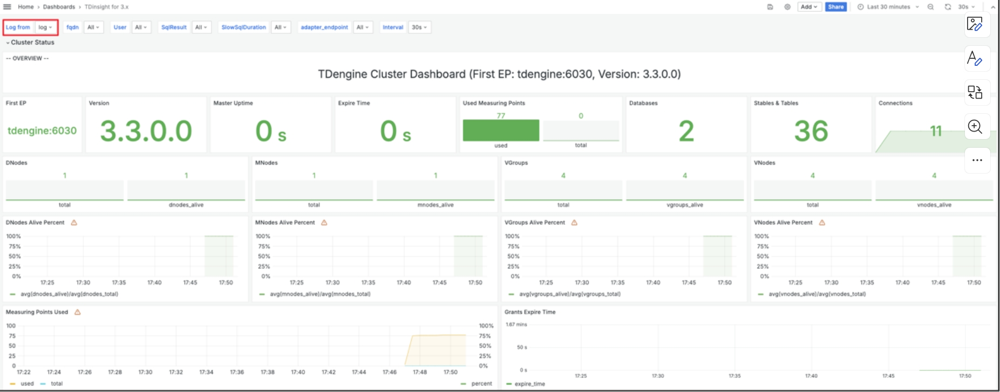

为了确保集群稳定运行，TDengine 集成了多种监控指标收集机制，并通 过taosKeeper 进行汇总。taosKeeper负责接收这些数据，并将其写入一个独立的 TDengine 实例中，该实例可以与被监控的 TDengine 集群保持独立。TDengine 中的两个核心组件 taosd （数据库引擎） 和 taosX （数据接入平台）都通过相同的监控架构来实现对其运行时的监控，但各自的监控指标设计有所不同。 

至于如何获取和使用这些监控数据，用户可以使用第三方的监测工具比如 Zabbix 来获取这些保存的系统监测数据，进而将 TDengine 的运行状况无缝集成到现有的 IT 监控系统中。也可以使用 TDengine 提供的 TDinsight 插件，使用该插件用户可以通过 Grafana 平台直观地展示和管理这些监控信息，如下图所示。这为用户提供了灵活的监控选项，以满足不同场景下的运维需求。

~[通过监控组件管理监控信息](./grafana.png)

## 配置 taosKeeper

因为 TDengine 的监控数据都通过 taosKeeper 上报并存储，所以本节先介绍 taosKeeper 的配置。

taosKeeper 的配置文件默认位于 `/etc/taos/taoskeeper.toml`。 下面为一个示例配置文件，更多详细信息见参考手册。其中最为关键的一个配置项是 `database`，它决定了收集到的监控数据存储在目标系统的哪个数据库中。

```toml
# gin 框架是否启用 debug
debug = false

# 服务监听端口, 默认为 6043
port = 6043

# 日志级别，包含 panic、error、info、debug、trace等
loglevel = "info"

# 程序中使用协程池的大小
gopoolsize = 50000

# 查询 TDengine 监控数据轮询间隔
RotationInterval = "15s"

[tdengine]
host = "127.0.0.1"
port = 6041
username = "root"
password = "taosdata"

# 需要被监控的 taosAdapter
[taosAdapter]
address = ["127.0.0.1:6041"]

[metrics]
# 监控指标前缀
prefix = "taos"

# 集群数据的标识符
cluster = "production"

# 存放监控数据的数据库
database = "log"

# 指定需要监控的普通表
tables = []

# database options for db storing metrics data
[metrics.databaseoptions]
cachemodel = "none"
```

## 监控 taosd

### 基于 TDinsight 监控 taosd

为了简化用户在 TDengine 监控方面的配置工作，TDengine 提供了一个名为 TDinsight 的 Grafana 插件。该插件与 taosKeeper 协同工作，能够实时监控 TDengine 的各项性能指标。

通过集成 Grafana 和 TDengine 数据源插件，TDinsight 能够读取 taosKeeper 收集并存储的监控数据。这使得用户可以在 Grafana 平台上直观地查看 TDengine 集群的状态、节点信息、读写请求以及资源使用情况等关键指标，实现数据的可视化展示。

此外，TDinsight 还具备针对 vnode、dnode 和 mnode 节点的异常状态告警功能，为开发者提供实时的集群运行状态监控，确保 TDengine 集群的稳定性和可靠性。以下是TDinsight 的详细使用说明，以帮助你充分利用这一强大工具。

#### 前置条件

若要顺利使用 TDinsight，应满足如下条件。
- TDengine 已安装并正常运行。
- taosAdapter 已经安装并正常运行。
- taosKeeper 已经安装并正常运行。
- Grafana 已安装并正常运行，以下介绍以 Grafna 10.4.0 为例。

同时记录以下信息。
- taosAdapter 的 RESTful 接口地址，如 http://www.example.com:6041。
- TDengine 集群的认证信息，包括用户名及密码。

#### 导入仪表盘

TDengine 数据源插件已被提交至 Grafana 官网，完成插件的安装和数据源的创建后，可以进行 TDinsight 仪表盘的导入。

在 Grafana 的 Home-Dashboards 页面，点击位于右上角的 New → mport 按钮，即可进入 Dashboard 的导入页面，它支持以下两种导入方式。
- Dashboard ID：18180。
- Dashboard URL：https://grafana.com/grafana/dashboards/18180-tdinsight-for-3-x/

填写以上 Dashboard ID 或 Dashboard URL 以后，点击 Load 按钮，按照向导操作，即可完成导入。导入成功后，Dashboards 列表页面会出现 TDinsight for 3.x 仪盘，点击进入后，就可以看到 TDinsight 中已创建的各个指标的面板，如下图所示：



**注意** 在 TDinsight 界面左上角的 Log from 下拉列表中可以选择 log 数据库。

### taosd 监控数据

TDinsight dashboard 数据来源于 log 库（存放监控数据的默认 db，可以在 taoskeeper 配置文件中修改。以下是由 taosd 上报由 taosKeeper 存储在 log 库中的数据。

1. taosd\_cluster\_basic 表

`taosd_cluster_basic` 表记录集群基础信息。

|field|type|is\_tag|comment|
|:----|:---|:-----|:------|
|ts|TIMESTAMP||timestamp|
|first\_ep|VARCHAR||集群 first ep|
|first\_ep\_dnode\_id|INT||集群 first ep 的 dnode id|
|cluster_version|VARCHAR||tdengine version。例如：3.0.4.0|
|cluster\_id|VARCHAR|TAG|cluster id|

2. taosd\_cluster\_info 表

`taosd_cluster_info` 表记录集群信息。

|field|type|is\_tag|comment|
|:----|:---|:-----|:------|
|ts|TIMESTAMP||timestamp|
|cluster_uptime|DOUBLE||当前 master 节点的uptime。单位：秒|
|dbs\_total|DOUBLE||database 总数|
|tbs\_total|DOUBLE||当前集群 table 总数|
|stbs\_total|DOUBLE||当前集群 stable 总数|
|dnodes\_total|DOUBLE||当前集群 dnode 总数|
|dnodes\_alive|DOUBLE||当前集群 dnode 存活总数|
|mnodes\_total|DOUBLE||当前集群 mnode 总数|
|mnodes\_alive|DOUBLE||当前集群 mnode 存活总数|
|vgroups\_total|DOUBLE||当前集群 vgroup 总数|
|vgroups\_alive|DOUBLE||当前集群 vgroup 存活总数|
|vnodes\_total|DOUBLE||当前集群 vnode 总数|
|vnodes\_alive|DOUBLE||当前集群 vnode 存活总数|
|connections\_total|DOUBLE||当前集群连接总数|
|topics\_total|DOUBLE||当前集群 topic 总数|
|streams\_total|DOUBLE||当前集群 stream 总数|
|grants_expire\_time|DOUBLE||认证过期时间，企业版有效，社区版为 DOUBLE 最大值|
|grants_timeseries\_used|DOUBLE||已用测点数|
|grants_timeseries\_total|DOUBLE||总测点数，开源版本为 DOUBLE 最大值|
|cluster\_id|VARCHAR|TAG|cluster id|

3. taosd\_vgroups\_info 表

`taosd_vgroups_info` 表记录虚拟节点组信息。

|field|type|is\_tag|comment|
|:----|:---|:-----|:------|
|ts|TIMESTAMP||timestamp|
|tables\_num|DOUBLE||vgroup 中 table 数量|
|status|DOUBLE||vgroup 状态, 取值范围：unsynced = 0, ready = 1|
|vgroup\_id|VARCHAR|TAG|vgroup id|
|database\_name|VARCHAR|TAG|vgroup 所属的 database 名字|
|cluster\_id|VARCHAR|TAG|cluster id|

4. taosd\_dnodes\_info 表

`taosd_dnodes_info` 记录 dnode 信息。

|field|type|is\_tag|comment|
|:----|:---|:-----|:------|
|ts|TIMESTAMP||timestamp|
|uptime|DOUBLE||dnode uptime，单位：秒|
|cpu\_engine|DOUBLE||taosd cpu 使用率，从 `/proc/<taosd_pid>/stat` 读取|
|cpu\_system|DOUBLE||服务器 cpu 使用率，从 `/proc/stat` 读取|
|cpu\_cores|DOUBLE||服务器 cpu 核数|
|mem\_engine|DOUBLE||taosd 内存使用率，从 `/proc/<taosd_pid>/status` 读取|
|mem\_free|DOUBLE||服务器可用内存，单位 KB|
|mem\_total|DOUBLE||服务器内存总量，单位 KB|
|disk\_used|DOUBLE||data dir 挂载的磁盘使用量，单位 bytes|
|disk\_total|DOUBLE||data dir 挂载的磁盘总容量，单位 bytes|
|system\_net\_in|DOUBLE||网络吞吐率，从 `/proc/net/dev` 中读取的 received bytes。单位 byte/s|
|system\_net\_out|DOUBLE||网络吞吐率，从 `/proc/net/dev` 中读取的 transmit bytes。单位 byte/s|
|io\_read|DOUBLE||io 吞吐率，从 `/proc/<taosd_pid>/io` 中读取的 rchar 与上次数值计算之后，计算得到速度。单位 byte/s|
|io\_write|DOUBLE||io 吞吐率，从 `/proc/<taosd_pid>/io` 中读取的 wchar 与上次数值计算之后，计算得到速度。单位 byte/s|
|io\_read\_disk|DOUBLE||磁盘 io 吞吐率，从 `/proc/<taosd_pid>/io` 中读取的 read_bytes。单位 byte/s|
|io\_write\_disk|DOUBLE||磁盘 io 吞吐率，从 `/proc/<taosd_pid>/io` 中读取的 write_bytes。单位 byte/s|
|vnodes\_num|DOUBLE||dnode 上 vnodes 数量|
|masters|DOUBLE||dnode 上 master node 数量|
|has\_mnode|DOUBLE||dnode 是否包含 mnode，取值范围：包含=1,不包含=0|
|has\_qnode|DOUBLE||dnode 是否包含 qnode，取值范围：包含=1,不包含=0|
|has\_snode|DOUBLE||dnode 是否包含 snode，取值范围：包含=1,不包含=0|
|has\_bnode|DOUBLE||dnode 是否包含 bnode，取值范围：包含=1,不包含=0|
|error\_log\_count|DOUBLE||error 总数|
|info\_log\_count|DOUBLE||info 总数|
|debug\_log\_count|DOUBLE||debug 总数|
|trace\_log\_count|DOUBLE||trace 总数|
|dnode\_id|VARCHAR|TAG|dnode id|
|dnode\_ep|VARCHAR|TAG|dnode endpoint|
|cluster\_id|VARCHAR|TAG|cluster id|

5. taosd\_dnodes\_status 表

`taosd_dnodes_status` 表记录 dnode 状态信息。

|field|type|is\_tag|comment|
|:----|:---|:-----|:------|
|ts|TIMESTAMP||timestamp|
|status|DOUBLE||dnode 状态,取值范围：ready=1，offline =0|
|dnode\_id|VARCHAR|TAG|dnode id|
|dnode\_ep|VARCHAR|TAG|dnode endpoint|
|cluster\_id|VARCHAR|TAG|cluster id|

6. taosd\_dnodes\_log\_dir 表

`taosd_dnodes_log_dir` 表记录 log 目录信息。

|field|type|is\_tag|comment|
|:----|:---|:-----|:------|
|ts|TIMESTAMP||timestamp|
|avail|DOUBLE||log 目录可用空间。单位 byte|
|used|DOUBLE||log 目录已使用空间。单位 byte|
|total|DOUBLE||log 目录空间。单位 byte|
|name|VARCHAR|TAG|log 目录名，一般为 `/var/log/taos/`|
|dnode\_id|VARCHAR|TAG|dnode id|
|dnode\_ep|VARCHAR|TAG|dnode endpoint|
|cluster\_id|VARCHAR|TAG|cluster id|

7. taosd\_dnodes\_data\_dir 表

`taosd_dnodes_data_dir` 表记录 data 目录信息。

|field|type|is\_tag|comment|
|:----|:---|:-----|:------|
|ts|TIMESTAMP||timestamp|
|avail|DOUBLE||data 目录可用空间。单位 byte|
|used|DOUBLE||data 目录已使用空间。单位 byte|
|total|DOUBLE||data 目录空间。单位 byte|
|level|VARCHAR|TAG|0、1、2 多级存储级别|
|name|VARCHAR|TAG|data 目录，一般为 `/var/lib/taos`|
|dnode\_id|VARCHAR|TAG|dnode id|
|dnode\_ep|VARCHAR|TAG|dnode endpoint|
|cluster\_id|VARCHAR|TAG|cluster id|

8. taosd\_mnodes\_info 表

`taosd_mnodes_info` 表记录 mnode 角色信息。

|field|type|is\_tag|comment|
|:----|:---|:-----|:------|
|ts|TIMESTAMP||timestamp|
|role|DOUBLE||mnode 角色， 取值范围：offline = 0,follower = 100,candidate = 101,leader = 102,error = 103,learner = 104|
|mnode\_id|VARCHAR|TAG|master node id|
|mnode\_ep|VARCHAR|TAG|master node endpoint|
|cluster\_id|VARCHAR|TAG|cluster id|

9. taosd\_vnodes\_role 表

`taosd_vnodes_role` 表记录虚拟节点角色信息。

|field|type|is\_tag|comment|
|:----|:---|:-----|:------|
|ts|TIMESTAMP||timestamp|
|vnode\_role|DOUBLE||vnode 角色，取值范围：offline = 0,follower = 100,candidate = 101,leader = 102,error = 103,learner = 104|
|vgroup\_id|VARCHAR|TAG|dnode id|
|dnode\_id|VARCHAR|TAG|dnode id|
|database\_name|VARCHAR|TAG|vgroup 所属的 database 名字|
|cluster\_id|VARCHAR|TAG|cluster id|

10. taosd\_sql\_req 表

`taosd_sql_req` 记录授权信息。

|field|type|is\_tag|comment|
|:----|:---|:-----|:------|
|ts|TIMESTAMP||timestamp|
|count|DOUBLE||sql 数量|
|result|VARCHAR|TAG|sql的执行结果，取值范围：Success, Failed|
|username|VARCHAR|TAG|执行sql的user name|
|sql\_type|VARCHAR|TAG|sql类型，取值范围：inserted_rows|
|dnode\_id|VARCHAR|TAG|dnode id|
|dnode\_ep|VARCHAR|TAG|dnode endpoint|
|vgroup\_id|VARCHAR|TAG|dnode id|
|cluster\_id|VARCHAR|TAG|cluster id|

11. taos\_sql\_req 表

`taos_sql_req` 记录授权信息。

|field|type|is\_tag|comment|
|:----|:---|:-----|:------|
|ts|TIMESTAMP||timestamp|
|count|DOUBLE||sql 数量|
|result|VARCHAR|TAG|sql的执行结果，取值范围：Success, Failed|
|username|VARCHAR|TAG|执行sql的user name|
|sql\_type|VARCHAR|TAG|sql类型，取值范围：select, insert，delete|
|cluster\_id|VARCHAR|TAG|cluster id|

12. taos\_slow\_sql 表

`taos_slow_sql` 记录授权信息。

|field|type|is\_tag|comment|
|:----|:---|:-----|:------|
|ts|TIMESTAMP||timestamp|
|count|DOUBLE||sql 数量|
|result|VARCHAR|TAG|sql的执行结果，取值范围：Success, Failed|
|username|VARCHAR|TAG|执行sql的user name|
|duration|VARCHAR|TAG|sql执行耗时，取值范围：3-10s,10-100s,100-1000s,1000s-|
|cluster\_id|VARCHAR|TAG|cluster id|

13. keeper\_monitor 表

`keeper_monitor` 记录 taoskeeper 监控数据。

|field|type|is\_tag|comment|
|:----|:---|:-----|:------|
|ts|TIMESTAMP||timestamp|
|cpu|DOUBLE||cpu 使用率|
|mem|DOUBLE||内存使用率|
|identify|NCHAR|TAG||

14. taosadapter\_restful\_http\_request\_total 表

`taosadapter_restful_http_request_total` 记录 taosadapter rest 请求信息，该表为 schemaless 方式创建的表，时间戳字段名为 `_ts`。

|field|type|is\_tag|comment|
|:----|:---|:-----|:------|
|\_ts|TIMESTAMP||timestamp|
|gauge|DOUBLE||监控指标值|
|client\_ip|NCHAR|TAG|client ip|
|endpoint|NCHAR|TAG|taosadpater endpoint|
|request\_method|NCHAR|TAG|request method|
|request\_uri|NCHAR|TAG|request uri|
|status\_code|NCHAR|TAG|status code|

15. taosadapter\_restful\_http\_request\_fail 表

`taosadapter_restful_http_request_fail` 记录 taosadapter rest 请求失败信息，该表为 schemaless 方式创建的表，时间戳字段名为 `_ts`。

|field|type|is\_tag|comment|
|:----|:---|:-----|:------|
|\_ts|TIMESTAMP||timestamp|
|gauge|DOUBLE||监控指标值|
|client\_ip|NCHAR|TAG|client ip|
|endpoint|NCHAR|TAG|taosadpater endpoint|
|request\_method|NCHAR|TAG|request method|
|request\_uri|NCHAR|TAG|request uri|
|status\_code|NCHAR|TAG|status code|

16. taosadapter\_restful\_http\_request\_in\_flight 表

`taosadapter_restful_http_request_in_flight` 记录 taosadapter rest 实时请求信息，该表为 schemaless 方式创建的表，时间戳字段名为 `_ts`。

|field|type|is\_tag|comment|
|:----|:---|:-----|:------|
|\_ts|TIMESTAMP||timestamp|
|gauge|DOUBLE||监控指标值|
|endpoint|NCHAR|TAG|taosadpater endpoint|

17. taosadapter\_restful\_http\_request\_summary\_milliseconds 表

`taosadapter_restful_http_request_summary_milliseconds` 记录 taosadapter rest 请求汇总信息，该表为 schemaless 方式创建的表，时间戳字段名为 `_ts`。

|field|type|is\_tag|comment|
|:----|:---|:-----|:------|
|\_ts|TIMESTAMP||timestamp|
|count|DOUBLE|||
|sum|DOUBLE|||
|0.5|DOUBLE|||
|0.9|DOUBLE|||
|0.99|DOUBLE|||
|0.1|DOUBLE|||
|0.2|DOUBLE|||
|endpoint|NCHAR|TAG|taosadpater endpoint|
|request\_method|NCHAR|TAG|request method|
|request\_uri|NCHAR|TAG|request uri|

18. taosadapter\_system\_mem\_percent 表

`taosadapter_system_mem_percent` 表记录 taosadapter 内存使用情况，该表为 schemaless 方式创建的表，时间戳字段名为 `_ts`。

|field|type|is\_tag|comment|
|:----|:---|:-----|:------|
|\_ts|TIMESTAMP||timestamp|
|gauge|DOUBLE||监控指标值|
|endpoint|NCHAR|TAG|taosadpater endpoint|

19. taosadapter\_system\_cpu\_percent 表

`taosadapter_system_cpu_percent` 表记录 taosadapter cpu 使用情况，该表为 schemaless 方式创建的表，时间戳字段名为 `_ts`。

|field|type|is\_tag|comment|
|:----|:---|:-----|:------|
|\_ts|TIMESTAMP||timestamp|
|gauge|DOUBLE||监控指标值|
|endpoint|NCHAR|TAG|taosadpater endpoint|

## 监控 taosX

taosX 是 TDengine 中提供零代码数据接入能力的核心组件，对它的监控也十分重要。taosX 监控与 TDengine 监控类似，都是通过 taosKeeper 将服务搜集的 metrics 写入指定数据库，然后借助 Grafana 面板做可视化和报警。这个功能可监控的对象包括：
1. taosX 进程
2. 所有运行中的 taosx-agent 进程
3. 运行在 taosX 端或 taosx-agent 端的各个连接器子进程
4. 运行中的各类数据写入任务

### 版本支持

1. TDengine 企业版本 3.2.3.0 或以上版本包含的 taosX 才包含此功能。如果单独安装 taosX，需要 taosX 1.5.0 或以上版本。
1. 需要安装 Grafana 插件 [TDengie Datasource v3.5.0](https://grafana.com/grafana/plugins/tdengine-datasource/) 或以上版本。

### 准备工作

假设你已经部署好了 taosd，taosAdapter 和 taosAdapter。 那么还需要：
2. 启动 taosX 服务。
3. 部署 Grafana ，安装 TDengine Datasource 插件，配置好数据源。

### 配置 taosX

toasX 的配置文件(默认 /etc/taos/taosx.toml) 中与 monitor 相关的配置如下：

```toml
[monitor]
# FQDN of taosKeeper service, no default value
# fqdn = "localhost"
# port of taosKeeper service, default 6043
# port = 6043
# how often to send metrics to taosKeeper, default every 10 seconds. Only value from 1 to 10 is valid.
# interval = 10
```

每个配置也有对应的命令行选项和环境变量。通过以下表格说明：

| 配置文件配置项 | 命令行选项         | 环境变量          | 含义                                                    | 取值范围 | 默认值                                   |
| -------------- | ------------------ | ----------------- | ------------------------------------------------------- | -------- | ---------------------------------------- |
| fqdn           | --monitor-fqdn     | MONITOR_FQDN      | taosKeeper 服务的 FQDN                                  |          | 无默认值，配置 fqdn 就等于开启了监控功能 |
| port           | --monitor-port     | MONITOR_PORT      | taosKeeper 服务的端口                                   |          | 6043                                     |
| interval       | --monitor-interval | MONITTOR_INTERVAL | taosX 发送 metrics 数据到 taosKeeper 的时间间隔，单位秒 | 1-10     | 10                                       |

TDinsight for taosX

"TDinsight for taosX" 专门为 taosX 监控创建的 Grafana 面板。使用前需要先导入这个面板。

### 基于 TDinsight 监控 tasoX

#### 进入面板

1. 选择 TDengine Datasource
   
2. 点击 “Dashboard”, 选择 TDinsight for taosX 面板。（第一次使用需要先导入）。
   
   
    该面板每一行代表一个或一类监控对象。最上面是 taosX 监控行，然后是 Agent 监控行, 最后是各类数据写入任务的监控。
    :::note
    1. 如果打开这个面板后看不到任何数据，你很可能需要点击左上角的数据库列表（即 “Log from” 下拉菜单），切换到监控数据所在的数据库。
    2. 数据库包含多少个 Agent 的数据就会自动创建多少个 Agent 行。(如上图)

    :::


#### 监控示例

1. taosX 监控示例


2. Agent 监控示例


3. TDengine2 数据源监控示例


:::info
监控面板只展示了数据写入任务的部分监控指标，在 Explorer 页面上有更全面的监控指标，且有每个指标的具体说明。

:::

3. TDengine3 数据源监控示例


4. 其它数据源监控示例


#### 限制

只有在以 server 模式运行 taosX 时，与监控相关的配置才生效。
