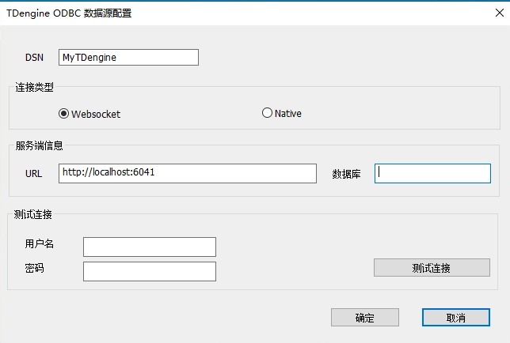
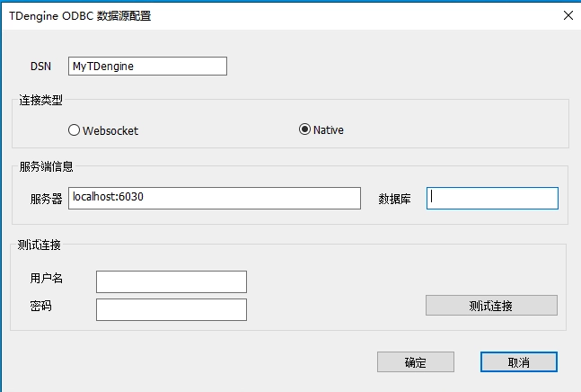

## 简介

TDengine ODBC  是为 TDengine 实现的 ODBC 驱动程序，支持 Windows 系统的应用（如 [PowerBI](https://powerbi.microsoft.com/zh-cn/) 等）通过 ODBC 标准接口访问本地、远程和云服务的 TDengine 数据库。

TDengine ODBC  提供基于 WebSocket（推荐）和 原生连接两种方式连接 TDengine 数据库，使用时可以为 TDengine 数据源设置不同的连接方式。访问云服务时必须使用 WebSocket 连接方式。

注意：TDengine ODBC 只支持 64 位系统，调用 TDengine ODBC 必须通过 64 位的 ODBC 驱动管理器进行。因此调用 ODBC 的程序不能使用 32 位版本。

想更多了解 TDengine 时序时序数据库的使用，可访问 [TDengine官方文档](https://docs.taosdata.com/intro/)。

## 安装

1. 仅支持 Windows 平台。Windows 上需要安装过 VC 运行时库，可在此下载安装 [VC运行时库](https://learn.microsoft.com/en-us/cpp/windows/latest-supported-vc-redist?view=msvc-170) 如果已经安装VS开发工具可忽略。  

2. 安装 TDengine Windows 客户端，版本在 3.2.1.0 或以上，都会包含 TDengine 的 ODBC 驱动。

## 配置数据源

### 数据源连接类型与区别

TDengine ODBC 支持两种连接 TDengine 数据库方式：Websocket 连接与 Native 连接，其区别如下：

1. 只有 Websocket 支持连接云服务

2. Websocket 连接的兼容性更好，一般不需要随着 TDengine 数据库服务端升级而升级客户端的库。

3. Native 连接通常性能更好一点，但是必须与 TDengine 数据库服务端的版本保持一致。

4. 对于一般用户，建议使用 **Websocket** 连接方式，性能与 Native 差别不大，兼容性更好。

### WebSocket 连接

1. 【开始】菜单搜索打开【ODBC 数据源(64 位)】管理工具（注意不要选择ODBC 数据源(32 位)） 

2. 选中【用户 DSN】标签页，通过【添加(D)】按钮进入"创建数据源"界面 

3. 选择想要添加的数据源，这里我们选择【TDengine】 

4. 点击完成，进入 TDengine ODBC 数据源配置页面，填写如下必要信息 

    

    4.1 【DSN】:Data Source Name 必填，为新添加的 ODBC 数据源命名

    4.2【连接类型】 : 必选，选择连接类型，这里选择 【Websocket】

    4.3【URL】必填，ODBC 数据源 URL，示例: `http://localhost:6041`， 云服务的 url 示例: `https://gw.cloud.taosdata.com?token=your_token`

    4.4【数据库】选填，需要连接的默认数据库

    4.5【用户名】仅供第5步测试连接使用，选填，数据库用户名，如果不填，TDengine 默认 root

    4.6【密码】仅供第5步测试连接使用，选填，数据库用户密码，如果不填，TDengine 默认 taosdata

5. 点【测试连接】测试连接情况，如果成功，提示"成功连接到URL"

6. 点【确定】，即可保存配置并退出

7. 也可以在第2步选择已经配置好的数据源名通过【配置】按钮进入配置页面，修改已有配置

### 原生连接（不支持云服务）

1. 【开始】菜单搜索打开【ODBC 数据源(64 位)】管理工具（注意不要选择ODBC 数据源(32 位)）

2. 选中【用户 DSN】标签页，通过【添加(D)】按钮进入"创建数据源"界面

3. 选择想要添加的数据源，这里我们选择【TDengine】

4. 点击完成，进入 TDengine ODBC 数据源配置页面，填写如下必要信息

    

    4.1 【DSN】:Data Source Name 必填，为新添加的 ODBC 数据源命名

    4.2 【连接类型】 : 必选，选择连接类型，这里选择 【Native】 原生连接；

    4.3 【服务器】必填，ODBC 数据源 服务器 地址，示例: `localhost:6030`

    4.4 【数据库】选填，需要连接的默认数据库
    
    4.5 【用户名】仅供第5步测试连接使用，选填，数据库用户名，如果不填，TDengine 默认 root

    4.6 【密码】仅供第5步测试连接使用，选填，数据库用户密码，如果不填，TDengine 默认 taosdata

5. 点【测试连接】测试连接情况，如果成功，提示"连接成功"

6. 点【确定】，即可保存配置并退出

7. 也可以在第2步选择已经配置好的数据源名通过【配置】按钮进入配置页面，修改已有配置

## 与第三方集成

作为使用 TDengine ODBC driver 的一个示例，你可以使用 Power BI 与 TDengine 分析时序数据。更多细节请参考 [Power BI](../../third-party/powerbi)
