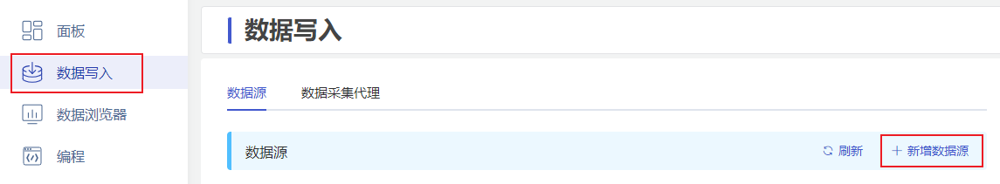
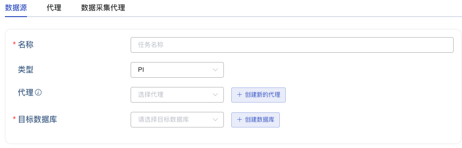
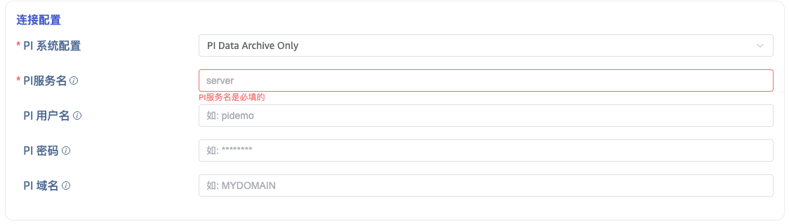
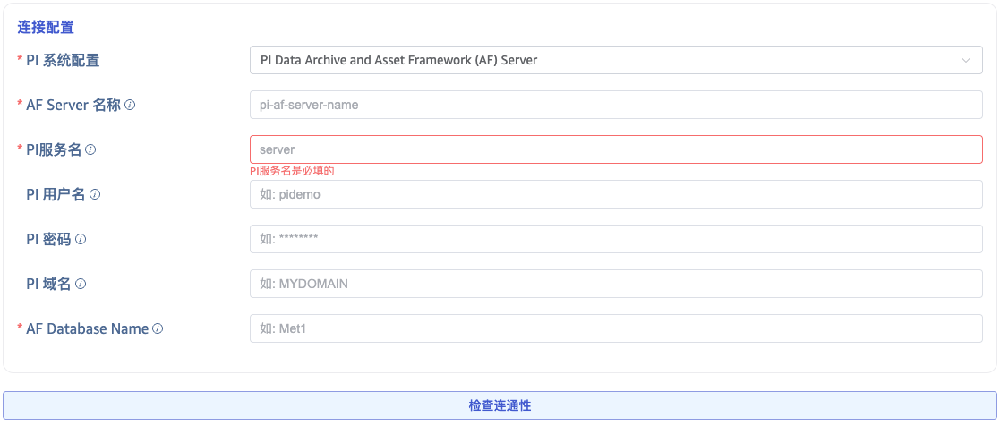
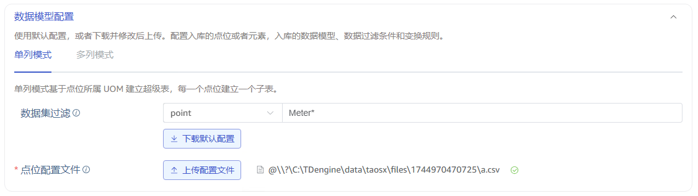
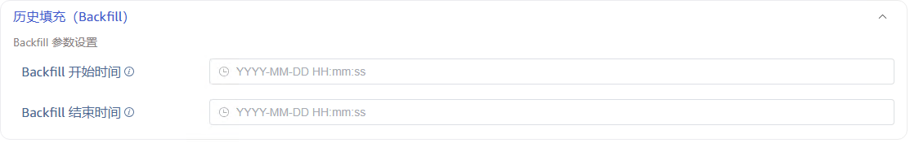
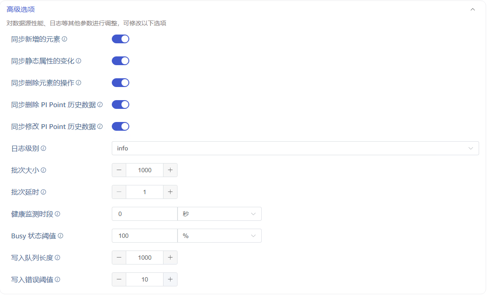

本节讲述如何通过 taosExplorer 界面创建数据写入任务，从 PI 系统同步数据到当前 TDengine 集群。

## 功能概述

PI 系统（OSIsoft PI System）是一套用于数据收集、查找、分析、传递和可视化的软件产品，广泛应用于电力、石化、制造等行业，可作为管理实时数据和事件的企业级系统基础架构。

taosX 通过 PI 连接器插件从 PI 系统中提取实时数据或历史数据，并写入 TDengine。

### 任务类型

从数据的实时性角度来看，PI 数据源任务分为两类：

| 任务类型 | taosExplorer 中的名称 | 说明 |
| --- | --- | --- |
| 实时任务 | **PI** | 持续订阅 PI 系统的实时数据变化，写入 TDengine |
| 回填任务 | **PI backfill** | 按指定时间范围提取历史数据，写入 TDengine |

### 数据模型

从数据模型角度来看，PI 数据源任务分为 **单列模型** 和 **多列模型**：

| 数据模型 | 映射规则 | 适用场景 |
| --- | --- | --- |
| 单列模型 | 一个 PI Point → 一张 TDengine 子表 | 以点位为中心的数据采集 |
| 多列模型 | 一个 PI AF 元素 → 一张 TDengine 子表 | 以设备/资产为中心的数据采集 |

### 数据源类型

从连接的数据源类型来看：

| 数据源类型 | 支持的数据模型 | 说明 |
| --- | --- | --- |
| PI Data Archive Only | 仅单列模型 | 直接连接 PI Data Archive Server |
| PI Data Archive + AF Server | 单列模型、多列模型 | 通过 PI AF SDK 连接，支持完整的资产框架 |

用户通过一个 CSV 格式的 **模型配置文件** 定义从 PI 到 TDengine 的数据映射规则，详见 [模型配置参考](./03-csv-reference.md)。

## 数据接入

### 确认前置条件

开始前，请先确认你的 PI 系统环境满足 [前置条件](./01-prerequisites.md)，包括：

- PI Data Archive / AF Server 的网络可达性
- 端口（5450、5457）的防火墙放通
- PI AF SDK 已安装在 taosX 或 taosX-Agent 所在主机
- 服务账户已配置相应的 PI 访问权限

如果你是首次部署，建议先阅读 [部署架构](./02-deployment-architecture.md) 了解推荐的部署方案。若计划部署多套 taosX（引擎侧登记为多个 Xnode）做冗余采集，请同时阅读 [高可用与故障转移](./08-failover.md)。

### 新增数据源

在数据写入页面中，点击 **+新增数据源** 按钮，进入新增数据源页面。

### 配置基本信息

在 **名称** 中输入任务名称，例如：`pi-realtime-plant1`。

在 **类型** 下拉列表中选择 **PI**（实时任务）或 **PI backfill**（回填任务）。

**代理** 配置：PI 连接器依赖 PI AF SDK，因此 taosX 或其代理（taosX-Agent）必须部署在可直接连接 PI 系统的 **Windows** 主机上。

- 如果 taosX 本身运行在可直连 PI 系统的 Windows 服务器上，**代理** 不是必须的。
- 如果 taosX 部署在云端或其他无法直连 PI 系统的环境，则需要在 PI 系统所在网段的 Windows 主机上部署 taosX-Agent 作为代理。此时在下拉框中选择已有代理，或点击右侧的 **+创建新的代理** 按钮新建。

在 **目标数据库** 下拉列表中选择一个目标数据库，也可以先点击右侧的 **+创建数据库** 按钮创建一个新的数据库。

:::tip
关于代理部署的详细架构选型，请参阅 [部署架构](./02-deployment-architecture.md)。
:::

### 配置连接信息

PI 连接器支持两种连接方式：

#### PI Data Archive Only

不使用 AF 模式，直接连接 PI Data Archive。填写 **PI 服务名**（服务器地址，通常使用主机名）。

#### PI Data Archive + AF Server

使用 PI AF SDK，连接 PI Data Archive 和 AF Server。除配置 PI 服务名外，还需要：

- **PI 系统 (AF Server) 名称**：AF Server 的主机名
- **AF 数据库名**：要连接的 AF 数据库名称

配置完成后，点击 **连通性检查** 按钮，验证数据源是否可用。

:::tip
关于 Windows 认证机制、为何默认不需要填写 Username/Password/Domain、以及如何在 PI 侧配置相应权限，请参阅 [连接配置与认证](./06-connection-config.md)。
:::

### 配置数据模型

数据模型配置区域有两个 Tab，分别对应 **单列模型** 和 **多列模型** 的配置。

:::tip
如果你是第一次配置，无论选择单列模型还是多列模型，请务必点击 **下载默认配置** 按钮。这个操作会触发生成默认的模型配置文件，同时将其下载到本地，你可以查看或编辑。编辑后还可以再上传，来覆盖默认的配置。
:::

如果你想同步所有点位或所有模板的元素，用默认配置即可。如果需要过滤特定命名模式的点位或元素模板，先填写过滤条件再点击 **下载默认配置**。

:::tip
Dataset Filter 的语法、可用单位及注意事项，请参阅 [Dataset Filter 配置](./07-dataset-filter.md)。
:::

关于模型配置文件的完整格式说明，请参阅 [模型配置参考](./03-csv-reference.md)。

### 配置 Backfill 参数

根据任务类型不同，Backfill 配置有所区别：

| 任务类型 | 配置项 | 说明 |
| --- | --- | --- |
| PI（实时任务） | 重启补偿时间 | 连接丢失或首次启动时自动回填的最长时间：2d、3h、4m 等。 |
| PI backfill（回填任务） | 开始时间、结束时间 | 必须配置回填的时间范围 |

**PI 实时任务 — 重启补偿时间**

**PI backfill 任务 — 回填时间范围**

:::tip
关于回填任务的详细最佳实践，请参阅 [历史数据回填](./04-backfill-guide.md)。关于实时任务的高级功能说明，请参阅 [实时数据同步](./05-realtime-guide.md)。
:::

### 高级选项

#### 通用选项

| 配置项 | 说明 |
| --- | --- |
| 连接器日志级别 | 默认 `info`，可选 `error`、`warn`、`info`、`debug`、`trace` |
| 批次大小 | 单次发送的最大消息数量，默认 1000 |
| 批次延时 | 单次发送最大延时（秒），超时后即使不满足批次大小也立即发送，默认 1 |
| 健康监测时段 | 健康检查的时间间隔，默认 0 表示不启用 |
| Busy 状态阈值 | 任务繁忙状态的阈值百分比，默认 100% |
| 写入队列长度 | 写入 TDengine 的队列长度，默认 1000 |
| 写入错误阈值 | 连续写入错误次数达到阈值后触发告警，默认 10 |

#### 多列模型实时任务专有选项

当任务类型为 **PI**（实时）且使用 **多列模型** 时，可配置以下开关：

| 选项 | 说明 |
| --- | --- |
| 同步新增元素 | 打开后，PI 连接器会监听模板下新增的元素，无需重启任务即可自动同步 |
| 同步静态属性变化 | 打开后，PI AF Server 上静态属性（非 PI Point 属性）的修改会同步到 TDengine TAG |
| 同步删除元素 | 打开后，PI 连接器会监听模板下删除元素的事件，并同步删除 TDengine 对应子表 |
| 同步删除历史数据 | 打开后，PI 中被删除的时序数据对应的 TDengine 列值会被置空 |
| 同步修改历史数据 | 打开后，PI 中修改的历史数据会同步更新到 TDengine |

### 提交任务

点击 **提交** 按钮，完成创建 PI 到 TDengine 的数据同步任务。回到 **数据源列表** 页面可查看任务执行情况。
